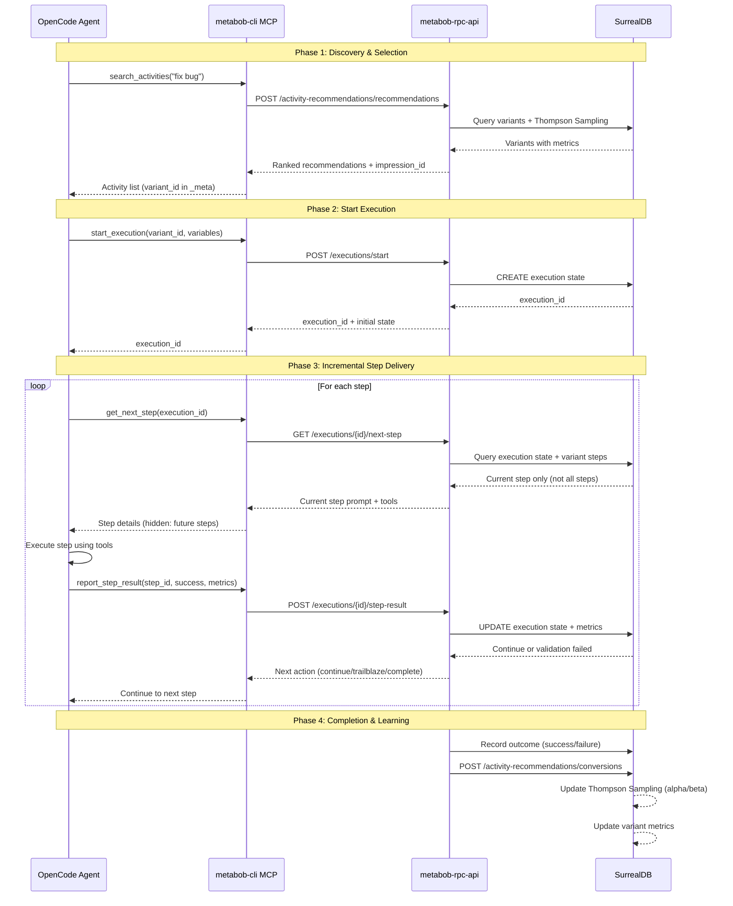

# Activity Execution Flow: Proper Workflow vs OpenCode Implementation

## ✅ PROPER WORKFLOW (metabob-cli MCP → metabob-rpc-api)

### Complete Flow Sequence



### Detailed MCP Call Sequence

#### 1. **search_activities** (Discovery)
```python
# Call
results = await activity_manager.search_activities(
    query="fix bug",
    category="bugfix",  # optional
    limit=10
)

# Returns
[
    {
        "id": "bug-fix",  # Base activity_id (visible to agent)
        "name": "Activity bug-fix",
        "description": "Diagnose and fix a reported bug with proper testing",
        "success_rate": 0.85,
        "avg_cost": 0.25,
        "expected_value": 0.65,
        "confidence": 0.82,
        "_meta": {
            "variant_id": "bug-fix-v1",  # Actual variant for execution
            "impression_id": "imp_abc123",  # For conversion tracking
            "score": 0.65
        }
    },
    ...
]

# Backend endpoint: POST /activity-recommendations/recommendations
# Uses Thompson Sampling to rank variants by expected value
```

#### 2. **start_execution** (Initialize)
```python
# Call (uses variant_id from _meta, not base id)
result = await activity_manager.start_execution(
    activity_id="bug-fix-v1",  # variant_id from _meta
    session_id="ses_xyz",
    variables={"bug_description": "...", "error_message": "..."},
    cost_budget=1.0
)

# Returns
{
    "execution_id": "exec_def456",
    "activity_id": "bug-fix",
    "variant_id": "bug-fix-v1",
    "session_id": "ses_xyz",
    "state": "pending",
    "cost_budget": 1.0
}

# Backend: Creates ActivityExecution in SurrealDB
# Tracks: execution_id, current_step_index, total_cost, state
```

#### 3. **get_next_step** (Incremental Delivery)
```python
# Call
response = await activity_manager.get_next_step("exec_def456")

# Returns (ONLY current step, not all steps)
{
    "current_step": {
        "id": "understand-bug",
        "description": "Gather information about the bug",
        "prompt": {
            "template": "You are investigating a bug...\n{{bug_description}}",
            "variables": ["bug_description", "error_message"]
        },
        "tools": {
            "required": [],
            "optional": ["read", "grep", "glob"],
            "disabled": []
        },
        "validation": {
            "required_files": [],
            "required_patterns": []
        }
    },
    "complete": false,
    "trailblazing": false
}

# Key: Agent does NOT see future steps!
# Backend queries variant from DB, returns step at current_step_index
```

#### 4. **report_step_result** (Metrics Collection)
```python
# Call
await activity_manager.report_step_result(
    execution_id="exec_def456",
    step_id="understand-bug",
    success=True,
    output=json.dumps({"findings": "..."}),
    error="",
    cost=0.12,
    tokens=1500,
    tool_calls=[
        {"tool": "read", "args": {"filePath": "src/auth.py"}},
        {"tool": "grep", "args": {"pattern": "token"}}
    ]
)

# Returns
{
    "continue": true,
    "next_step_index": 1,
    "validation_passed": true
}

# Backend: Updates execution in SurrealDB
# Increments current_step_index, accumulates total_cost/tokens
# Runs validation if defined
# If validation fails → triggers trailblazing
```

#### 5. **get_execution_state** (Progress Tracking)
```python
# Call
state = await activity_manager.get_execution_state("exec_def456")

# Returns
{
    "execution_id": "exec_def456",
    "activity_id": "bug-fix",
    "variant_id": "bug-fix-v1",
    "state": "running",  # pending, running, step_complete, trailblazing, completed, failed
    "current_step_index": 2,
    "total_steps": 4,
    "total_cost": 0.45,
    "total_tokens": 5200,
    "step_results": [
        {"step_id": "understand-bug", "success": true, "cost": 0.12},
        {"step_id": "locate-source", "success": true, "cost": 0.18}
    ]
}

# Backend: Reads from SurrealDB execution state
# Does NOT include future steps or prompt templates
```

---

## ❌ CURRENT OPENCODE IMPLEMENTATION

### What OpenCode Actually Does

Based on `ACTIVITY_SYSTEM_WORKFLOW_ANALYSIS.md` and bug reports:

```typescript
// WRONG: Bypasses MCP completely
async function executeActivityWrong() {
    // 1. Agent creates local JSON file
    const template = {
        id: "jiggle-docs",
        tasks: [...]
    };
    await fs.writeFile(".test-jiggle-docs/jiggle-documentation.json", JSON.stringify(template));
    
    // 2. Manually calls tools directly
    const files = await glob("*.md");
    const content = await read("file.md");
    await edit("file.md", changes);
    
    // 3. No execution tracking
    // 4. No metrics collection
    // 5. No Thompson Sampling updates
    // 6. No validation enforcement
    
    // Result: ZERO LEARNING
}
```

### Problems with Current Implementation

1. **No Thompson Sampling**
   - Activities not ranked by success rate
   - No exploration/exploitation balance
   - Agents don't learn which approaches work best

2. **No Execution Tracking**
   - No execution_id created in backend
   - No state persistence in SurrealDB
   - Can't resume failed executions
   - No trailblazing on validation failure

3. **No Metrics Collection**
   - Cost, tokens, duration not recorded
   - Can't optimize for performance
   - Can't predict future execution costs

4. **No Incremental Delivery**
   - Agent sees all steps upfront
   - Can "game" the system by skipping steps
   - No enforcement of step-by-step execution

5. **No Learning Loop**
   - Success/failure not recorded
   - Thompson Sampling parameters (alpha/beta) not updated
   - Future recommendations don't improve

---

## 🔧 WHAT NEEDS TO BE FIXED IN OPENCODE

### Location: `repos/metabob-opencode/packages/opencode/src/command/activity/`

### Required Changes

#### 1. **Remove Direct Template File Access**
Current:
```typescript
// activity-tool.ts (WRONG)
const templatePath = path.join(process.cwd(), ".activity-templates", `${templateId}.json`);
const template = JSON.parse(await fs.readFile(templatePath));
```

Fixed:
```typescript
// Use MCP
const results = await mcpClient.call("search_activities", {
    query: intent,
    category: category
});
```

#### 2. **Use start_execution for Tracking**
Current:
```typescript
// No execution tracking (WRONG)
for (const task of template.tasks) {
    await executeTask(task);
}
```

Fixed:
```typescript
// Create execution in backend
const exec = await mcpClient.call("start_execution", {
    activity_id: variant_id,  // from search results _meta
    session_id: sessionID,
    variables: variables,
    cost_budget: 1.0
});

executionID = exec.execution_id;
```

#### 3. **Incremental Step Delivery**
Current:
```typescript
// Sees all steps (WRONG)
const allSteps = template.tasks;
for (const step of allSteps) {
    // ...
}
```

Fixed:
```typescript
// Get one step at a time
while (true) {
    const response = await mcpClient.call("get_next_step", {
        execution_id: executionID
    });
    
    if (response.complete) break;
    
    const step = response.current_step;
    await executeStep(step);
    
    await mcpClient.call("report_step_result", {
        execution_id: executionID,
        step_id: step.id,
        success: true,
        cost: stepCost,
        tokens: stepTokens,
        tool_calls: toolCalls
    });
}
```

#### 4. **Metrics Collection**
Current:
```typescript
// No metrics (WRONG)
await tool.call("bash", {command: "..."});
```

Fixed:
```typescript
// Track metrics for learning
const startTime = Date.now();
const startTokens = session.totalTokens;

const result = await tool.call("bash", {command: "..."});

const duration = Date.now() - startTime;
const tokens = session.totalTokens - startTokens;
const cost = estimateCost(tokens, model);

toolCalls.push({
    tool: "bash",
    command: command,
    tokens: tokens,
    duration: duration
});
```

---

## 📊 COMPARISON TABLE

| Feature | Proper MCP Flow | Current OpenCode | Impact |
|---------|----------------|------------------|--------|
| **Activity Discovery** | Thompson Sampling search | JSON file lookup | No learning, static recommendations |
| **Execution Tracking** | execution_id in SurrealDB | No tracking | Can't resume, no state persistence |
| **Step Delivery** | Incremental (one at a time) | All steps upfront | Agent can game system |
| **Metrics Collection** | Cost, tokens, duration tracked | Not collected | Can't optimize or predict |
| **Validation** | Enforced by backend | Self-reported | No enforcement |
| **Trailblazing** | Automatic on validation failure | N/A | Failures aren't recovered |
| **Learning** | Alpha/beta updated per outcome | No updates | No improvement over time |
| **Variant Evolution** | Genealogy tracked | Not supported | Can't evolve templates |

---

## 🎯 NEXT STEPS

1. **Audit OpenCode Activity Tool**
   - Find where activities are executed
   - Identify MCP call sites (or lack thereof)
   - Map current flow to proper flow

2. **Implement Proper MCP Calls**
   - Replace JSON file access with `search_activities`
   - Add `start_execution` before execution
   - Implement `get_next_step` / `report_step_result` loop
   - Collect and report metrics

3. **Test End-to-End**
   - Run activity in OpenCode
   - Verify execution_id created in SurrealDB
   - Confirm metrics recorded
   - Check Thompson Sampling updates

4. **Document Integration**
   - Update activity tool documentation
   - Add examples of proper MCP usage
   - Create integration tests

---

## 📁 KEY FILES TO EXAMINE

```
repos/metabob-opencode/packages/opencode/src/
├── command/activity/
│   ├── activity-tool.ts        ← Main activity execution
│   ├── template-executor.ts    ← Step execution logic
│   └── template-provider.ts    ← Template loading
├── mcp/
│   └── client.ts               ← MCP client (should be used)
└── session/
    └── prompt.ts               ← Session integration
```

Compare these to the proper workflow documented above.
