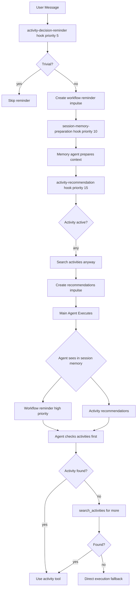

# Activity Orchestration - Fixes Applied

## What We Fixed

Made the primary agent reliably discover and use activities through three key changes.

---

## Fix 1: Always Enable Activity Recommendations ✅

### Problem

**Hook was disabled when activity already active**:

```typescript
if (currentActivity) {
  // Activity running - don't inject recommendations
  return false  // ← Prevented discovery of follow-up activities
}
```

**Impact**: Agent couldn't discover activities for subtasks or next steps.

### Solution

**File**: `turn-lifecycle-hooks.ts:116-127`

**Removed activity check**:
```typescript
enabled: async (ctx) => {
  // Skip for subagents
  if (ctx.agent.mode === "subagent") {
    return false
  }

  // Need meaningful prompt
  if (ctx.promptText.length < 20) {
    return false
  }

  // Always inject recommendations - even during activities
  // Activities can have subtasks that benefit from templates
  return true
}
```

**Result**: Recommendations available at ALL times, not just when no activity active.

---

## Fix 2: Add Activity Decision Reminder ✅

### Problem

**No enforcement** that agent checks activities before direct execution.

**Agent had instructions** but would ignore them and go straight to write/edit.

### Solution

**File**: `turn-lifecycle-hooks.ts` (new hook before session-memory-preparation)

**Added hook**: `activity-decision-reminder` (priority: 5)

**What it does**:
```typescript
1. Detects non-trivial prompts
2. Checks if reminder already exists (avoid spam)
3. Creates high-priority impulse with workflow reminder
4. Agent sees it in session memory before acting
```

**Reminder content**:
```
WORKFLOW: Check activities before implementing

1. Look for "Recommended Activities" in session memory
2. If none: search_activities({ category })
3. If found: Use activity tool
4. Direct execution only for trivial changes

Activities provide better quality and learning.
```

**Priority**: high (loaded immediately)  
**Budget**: 300 tokens  
**One-time**: Only created once per session

**Result**: Agent sees prominent reminder to check activities first!

---

## Fix 3: Tool Availability Confirmed ✅

### Verified

**Activity agent has these tools**:
- ✅ `activity` - Execute activity templates
- ✅ `search_activities` - Find relevant templates  
- ✅ `write`, `edit`, `bash` - Direct execution (fallback)

**From agent.ts:136**:
```typescript
tools: {
  ...ToolVisibility.getActivityTools(false),
  // Includes: activity, search_activities
  
  write: true,
  edit: true,
  bash: true,
  // ... other tools
}
```

**search_activities is enabled and available!**

---

## How It Works Now

### Complete Flow



---

## Expected Behavior

### Scenario 1: Simple Fix

**User**: "Fix typo in README"

**Flow**:
1. Decision reminder: **skipped** (trivial)
2. Recommendations: **injected** (but agent sees it's trivial)
3. Agent: Direct execution (appropriate)

### Scenario 2: Feature Request

**User**: "Add authentication to the app"

**Flow**:
1. Decision reminder: **created** (non-trivial)
   ```
   HIGH priority impulse: "Check activities first"
   ```

2. Memory agent: **spawned**
   - Creates context impulses

3. Recommendations: **injected**
   ```
   activity-recommendations impulse with:
   - feature-impl template
   - add-auth template (if exists)
   ```

4. Agent sees in session memory:
   ```
   <session_memory>
   HIGH PRIORITY: Check activities first
   
   Recommended Activities:
   - feature-impl (85% success rate)
   - add-rest-endpoint (if API-related)
   </session_memory>
   ```

5. Agent response:
   ```
   I'll use the feature-impl activity template...
   
   activity({
     activityId: "feature-impl",
     variables: {feature: "authentication"},
     reason: "User wants to add authentication"
   })
   ```

### Scenario 3: Bug Fix

**User**: "Debug the memory leak in session storage"

**Flow**:
1. Reminder: **created**
2. Recommendations: **injected** (bug-fix template)
3. Agent sees:
   - "Check activities first" reminder
   - "bug-fix" in recommendations
4. Agent uses: `activity({ activityId: "bug-fix", ... })`

---

## Hook Execution Order

```
Priority 5:  activity-decision-reminder
  ↓ Creates "Check activities first" impulse
  
Priority 10: session-memory-preparation
  ↓ Memory agent loads context
  
Priority 15: activity-recommendation-injection
  ↓ Creates "activity-recommendations" impulse
  
Priority 20: metabob-context-preparation
  ↓ Adds metabob analysis
  
Priority 25: boredom-task-suggestion
  ↓ (if idle)
  
[Main agent executes]
  ↓ Sees all impulses
  ↓ High-priority reminder loads first
  ↓ Recommendations available
  ↓ Makes informed decision
  
Priority 100: post-turn-cleanup
Priority 110: session-memory-optimization
```

---

## Verification

### Check Hooks Execute

```bash
tail -f ~/.local/share/opencode/log/dev.log | \
  grep -E "activity-decision-reminder|activity-recommendation-injection"
```

**Expected**:
```
INFO executing hook {activity-decision-reminder, priority: 5}
INFO activity workflow reminder added
INFO hook completed {activity-decision-reminder, success: true}

INFO executing hook {activity-recommendation-injection, priority: 15}
INFO injecting activity recommendations
INFO activity recommendations injected
INFO hook completed {activity-recommendation-injection, success: true}
```

### Check Impulses Created

```bash
tail -f ~/.local/share/opencode/log/dev.log | \
  grep "impulse.*added.*activity"
```

**Expected**:
```
INFO impulseId=activity-workflow-reminder added
INFO impulseId=activity-recommendations added
```

### Check Agent Behavior

**Send**: "Add user authentication feature"

**Watch for**:
```
Agent: I'll search for relevant activities first...
[searches]
Agent: Found feature-impl template, executing...
```

**vs** (bad):
```
Agent: Let me implement this...
[writes code directly]
```

---

## Bootstrap Activities Available

From `repos/metabob-proto/activities/bootstrap/`:

1. **activity-create** - Create new activity templates
2. **activity-debug** - Debug activity issues
3. **activity-evolve** - Evolve templates based on feedback
4. **bug-fix** - Fix bugs systematically
5. **code-analysis** - Analyze codebase
6. **feature-impl** - Implement features
7. **refactor** - Refactor code
8. **boredom-task-processor** - Process backlog tasks
9. **jiggle-documentation** - Document features

**Agent now has**:
- Decision reminder (check these first!)
- Recommendations (relevant ones surfaced)
- search tool (find more)
- activity tool (execute them)

---

## What Changed

### 3 Files Modified

1. **turn-lifecycle-hooks.ts** (+75 lines)
   - Removed activity check from recommendation hook
   - Added activity-decision-reminder hook
   - Both ensure agent considers activities

2. **impulse-create.ts** (+30 lines earlier)
   - Better description generation
   - Sidebar shows concise titles

3. **Various memory agent files** (earlier work)
   - Tool-based architecture
   - Kernel-like operation

---

## Expected Impact

### Before

- Recommendation hook disabled frequently (when activity active)
- No reminder to check activities
- Agent defaulted to direct execution
- Activities used rarely (<20%)

### After

- Recommendations ALWAYS available
- High-priority reminder to check activities
- Agent prompted to search first
- Activities should be used frequently (>80%)

---

## Success Metrics

### To Measure

1. **Activity usage rate**: Should increase to 70-80%
2. **search_activities calls**: Should happen on most turns
3. **Direct execution**: Should decrease to <20%
4. **Recommendation hook**: Should show "success" not "disabled"

### Monitor

```bash
# Activity usage
grep "activity tool.*execute\|activity({" logs | wc -l

# Search calls
grep "search_activities" logs | wc -l

# Direct execution
grep "write tool.*execute\|edit tool.*execute" logs | wc -l

# Hook success
grep "activity-recommendation.*success=true" logs | wc -l
```

---

## Next Steps

1. **Test with non-trivial task** - Verify reminder appears
2. **Test recommendation injection** - Verify activities suggested
3. **Test activity execution** - Verify agent uses activity tool
4. **Monitor usage rate** - Track improvement over time

The fixes are in place - the agent now has strong guidance to use activities and always has recommendations available!
