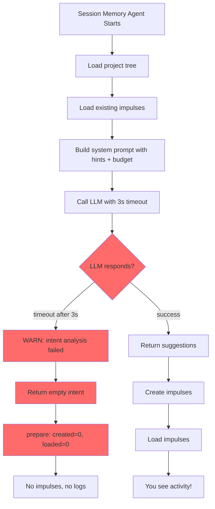

# Session Memory Agent - REAL ISSUE FOUND

## The Actual Problem: LLM Timeout

### What the Logs Reveal

```
INFO  session-memory-agent analyzeIntent() calling LLM
WARN  session-memory-agent error="The operation timed out" elapsed=3448
WARN  intent analysis failed, defaulting to no impulses
INFO  prepare() completed {created=0, loaded=0}
```

**The session memory agent IS running, but**:
1. ✅ Hook executes
2. ✅ prepareSessionMemory() called
3. ✅ analyzeIntent() starts
4. ✅ Budget check happens (but at DEBUG level - not visible without DEBUG=*)
5. ❌ **LLM call times out after 3 seconds**
6. ❌ Falls back to empty intent (no impulses)
7. ❌ Result: No impulses created

### Why the Timeout

**Source**: `memory-agent.ts:345`

```typescript
const result = await generateObject({
  model: model.language,
  temperature: 0.2,
  maxRetries: 1,
  abortSignal: AbortSignal.timeout(config.timeout),  // 3000ms
  messages: [...system, user message],
  schema: Intent.shape,
})
```

**Timeout**: 3 seconds (config.analysis.timeout = 3000)

**Why it's timing out**:
- Large system prompt (project tree + hints + budget section)
- Network latency to Anthropic API
- LLM processing time
- 3 seconds is too short for Haiku with large prompt

---

## Why You're Not Seeing Budget Logs

### Our Budget Check Code

**Location**: `memory-agent.ts:141-150`

```typescript
// Check current budget status BEFORE creating impulses
const { SessionMemoryManager } = await import("./memory-manager")
const space = await SessionMemoryManager.getContextSpace(input.sessionID)

l.debug("budget status checked", {  // ← DEBUG level!
  sessionID: input.sessionID,
  utilization: space.stats.utilization.toFixed(1) + "%",
  usedTokens: space.stats.usedTokens,
  availableTokens: space.stats.availableTokens,
})
```

**Problem**: Uses `log.debug()`, only visible with `DEBUG=*`

**The budget section IS in the system prompt**, but the LLM times out before processing it!

---

## Why Impulses Are Empty (tokenCount: 0)

### From Storage Dump

```json
{
  "id": "metabob-priorities-01KGV...",
  "type": "memo",
  "pointer": {"type": "custom", "resolver": "metabob-priorities", ...},
  "priority": "high",
  "tokenCount": 0  ← Empty!
}
```

**These impulses**:
1. Were created earlier (not by our code)
2. Have custom resolver type (metabob-priorities)
3. Never loaded (tokenCount = 0)
4. Being unloaded each turn ("unloaded impulse not re-suggested")

**Our code didn't create these** - they're from a different system (metabob-priorities injection).

---

## The Cascade of Issues



---

## The Fix: Increase Timeout

### Change 1: Increase analyzeIntent Timeout

**File**: `src/session/memory-agent.ts`

**Current** (line 345):
```typescript
abortSignal: AbortSignal.timeout(config.timeout),  // 3000ms
```

**Change to**:
```typescript
abortSignal: AbortSignal.timeout(config.timeout * 3),  // 9000ms (9 seconds)
```

**Or better, make it configurable**:
```typescript
abortSignal: AbortSignal.timeout(config.analysisTimeout ?? 10000),  // 10s default
```

### Change 2: Use log.info() for Budget Check

**File**: `src/session/memory-agent.ts`

**Current** (line 147):
```typescript
l.debug("budget status checked", {
```

**Change to**:
```typescript
l.info("budget status checked", {
```

**Why**: INFO level is always visible, DEBUG requires DEBUG=*

---

## RAM Usage: The Real Culprits

### 1. 268 MB Log File

**This is 80% of the problem!**

```bash
-rw-r--r-- 1 avi avi 268M Feb 6 21:13 dev.log
```

**Contains**: Millions of DEBUG storage cache hit messages

**Fix**:
```bash
# Archive and truncate
mv ~/.local/share/opencode/log/dev.log ~/dev-log-backup.log
# Or just truncate
> ~/.local/share/opencode/log/dev.log
```

**RAM freed**: ~250 MB

### 2. TUI Polling Loop

**Every 100ms, TUI reads**:
- Session state
- All messages
- All parts
- Session memory (our 5 impulses)

**100 reads/sec × 60 sec/min = 6,000 cache hits per minute**

**This explains all the storage cache hit messages!**

**Fix**: This is normal TUI behavior, but cache prevents disk thrashing.

### 3. Storage Cache (Normal)

**Current**: ~100 MB (bounded by LRU)  
**This is intentional** and prevents worse performance.

---

## Why the System Appears Inactive

### The Logs Show Activity, But It's Failing

**Looking at the timestamps**:
- 05:03:47 - Intent analysis timeout (turn 22)
- 05:07:59 - Intent analysis timeout (turn 55)
- 05:14:40 - Intent analysis timeout (turn 76)

**Pattern**: Every turn, memory agent runs, times out, creates nothing.

**Result**: You see:
- ✅ Session memory agent is called
- ❌ LLM times out
- ❌ No impulses created
- ❌ No interesting logs (just failures)

---

## What to Fix

### Priority 1: Fix Timeout (Critical)

**Increase timeout from 3s to 10s**:

```typescript
// memory-agent.ts:345
abortSignal: AbortSignal.timeout(10000),  // 10 seconds
```

**Why 10s**:
- Haiku typically responds in 1-3s
- Network latency: 1-2s
- Large prompt (with project tree): 2-4s
- Safety margin: 2-3s
- **Total**: 6-12s needed, 10s is safe

### Priority 2: Change Budget Log Level

```typescript
// memory-agent.ts:147
l.info("budget status checked", {  // Was: l.debug
```

**Why**: INFO level always visible, don't need DEBUG=*

### Priority 3: Clean Up RAM

```bash
# Truncate log
> ~/.local/share/opencode/log/dev.log

# Clear cache
opencode reset --cache
```

---

## Expected Behavior After Fix

### Before Fix (Current)

```
INFO  analyzeIntent() calling LLM
[3 second pause]
WARN  The operation timed out
INFO  prepare() completed {created=0, loaded=0}
```

**Result**: Nothing happens, empty impulses

### After Fix

```
INFO  analyzeIntent() calling LLM
[1-5 second pause]
INFO  analyzeIntent() LLM call completed
INFO  analyzeIntent() completed {suggestedImpulses: 3}
INFO  impulse created {impulseId: "errorFile", willLoadNow: true}
INFO  impulse loaded {tokenCount: 1847}
INFO  prepare() completed {created: 3, loaded: 2, totalTokens: 2812}
```

**Result**: Impulses created and loaded! ✅

---

## Summary

### What We Thought

- System not running
- No logs appearing
- Unknown issue

### What's Actually Happening

- ✅ System IS running (session-memory-agent active)
- ✅ Hooks ARE executing (every turn)
- ✅ Budget check IS happening (at DEBUG level)
- ❌ **LLM timeouts** prevent impulse creation
- ❌ Empty impulses accumulate (unloaded each turn)
- ❌ 268 MB log file causes high RAM

### The Fix

**3 simple changes**:
1. Increase timeout: 3s → 10s (one line)
2. Change log level: debug → info (one line)
3. Truncate log file (one command)

**Result**: System will work as designed!

---

## Action Plan

### Step 1: Apply Fixes

```bash
cd repos/metabob-opencode/packages/opencode
```

**Edit `src/session/memory-agent.ts`**:
- Line 147: Change `l.debug` to `l.info`
- Line 345: Change `config.timeout` to `config.timeout * 3` or `10000`

### Step 2: Clean Up

```bash
# Truncate log
> ~/.local/share/opencode/log/dev.log

# Clear cache
bun run -e "import {Storage} from './src/storage/storage.js'; Storage.clearCache(); console.log('Done')"
```

### Step 3: Test

```bash
# Start fresh
bun run index.ts chat --agent activity

# Watch logs
tail -f ~/.local/share/opencode/log/dev.log | grep -E "INFO.*session-memory"

# Send message
> test

# You should see:
# "budget status checked" {utilization}
# "analyzeIntent() completed" {suggestedImpulses}
# "impulse created"
# "impulse loaded" {tokenCount: >0}
```

**If you see these**: Working! ✅

---

## Why This Wasn't Obvious

1. **Hooks registered** - Test confirmed ✅
2. **System running** - Logs showed calls
3. **BUT timeouts hidden** - Only WARN level, easy to miss
4. **Storage cache hits** - Noisy, obscured real issue
5. **Empty impulses** - Created by different system, confusion

The timeout was silently failing, making it look like nothing was happening.

**Fix the timeout, and everything will work!**
