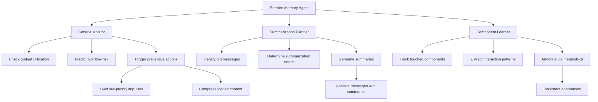
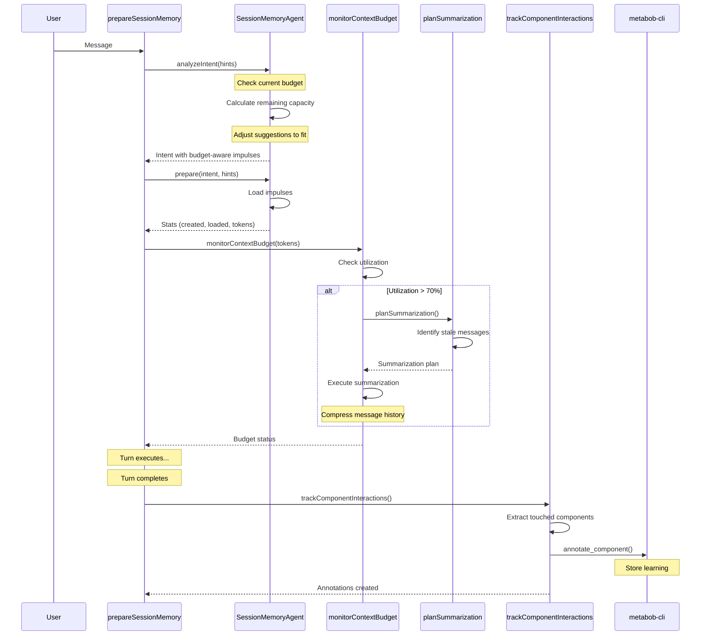

# Session Memory Agent: Context Window Management & Learning

## Overview

Enhance the session memory agent to:
1. **Prevent context overflow** - Monitor and manage context window budget
2. **Smart summarization** - Identify what message history needs condensing
3. **Component learning** - Attach interaction insights to code via annotations

---

## Problem Statement

### Current Issues

1. **Reactive Overflow Handling**
   - `SessionCompaction.isOverflow()` detects overflow AFTER it happens
   - No proactive prevention
   - Memory agent doesn't monitor context budget

2. **Generic Message Compaction**
   - `SessionCompaction.prune()` removes old tool calls blindly
   - Doesn't consider what's still relevant
   - No summary of what was removed

3. **Lost Interaction Context**
   - When agent touches a component, insights are lost
   - No record of "why this file was helpful"
   - No learning from successful/failed impulses

### Goals

1. **Proactive Management** - Prevent overflow before it happens
2. **Intelligent Summarization** - Keep relevant context, condense irrelevant
3. **Persistent Learning** - Attach insights to components for future use

---

## Architecture



---

## Enhancement 1: Context Window Monitoring

### Current State

**Existing Infrastructure**:
- `SessionMemoryManager.getContextSpace()` - calculates utilization
- `memory-lifecycle.ts` - handles budget overflow
- `memory-manager.ts:50-55` - tracks context limits

**Location**: `src/session/memory-manager.ts:19-56`

```typescript
limits: {
  maxContextTokens: number      // Model's context limit (200k for Claude)
  reservedForResponse: number   // Reserved for output (8k-32k)
  availableForContext: number   // Available for impulses
}
```

### Enhancement: Proactive Monitoring

**New Function**: `SessionMemoryAgent.monitorContextBudget()`

```typescript
export async function monitorContextBudget(input: {
  sessionID: string
  currentTokens: number
}): Promise<{
  status: "healthy" | "warning" | "critical"
  utilization: number
  recommendations: string[]
  actionsNeeded: Array<{
    type: "evict" | "summarize" | "compress"
    target: string
    reason: string
    estimatedSavings: number
  }>
}> {
  // Get context space
  const space = await SessionMemoryManager.getContextSpace(sessionID)
  
  // Calculate utilization
  const totalUsed = input.currentTokens + space.stats.usedTokens
  const utilization = (totalUsed / space.limits.availableForContext) * 100
  
  // Determine status
  let status: "healthy" | "warning" | "critical"
  if (utilization < 70) status = "healthy"
  else if (utilization < 85) status = "warning"
  else status = "critical"
  
  const recommendations: string[] = []
  const actionsNeeded: Array<...> = []
  
  // Generate recommendations based on utilization
  if (status === "warning") {
    // Check for low-priority loaded impulses
    const lowPriority = space.impulses.filter(
      i => i.priority === "low" && i.loaded
    )
    if (lowPriority.length > 0) {
      actionsNeeded.push({
        type: "evict",
        target: lowPriority[0].id,
        reason: "Low-priority impulse consuming space",
        estimatedSavings: lowPriority[0].tokenCount
      })
    }
    
    // Check for old message history
    const oldMessages = await identifyStaleMessages(sessionID)
    if (oldMessages.length > 0) {
      actionsNeeded.push({
        type: "summarize",
        target: "message-history",
        reason: `${oldMessages.length} old messages can be summarized`,
        estimatedSavings: estimateMessageTokens(oldMessages)
      })
    }
  }
  
  if (status === "critical") {
    // Aggressive eviction needed
    recommendations.push("URGENT: Context window at 85%+ capacity")
    recommendations.push("Consider evicting medium-priority impulses")
    recommendations.push("Summarize message history immediately")
  }
  
  return { status, utilization, recommendations, actionsNeeded }
}
```

### Integration Point

**File**: `src/session/memory-agent.ts`  
**When**: At end of `prepare()` function (after line 956)

```typescript
l.info("prepare() completed", {
  // ... existing logs ...
})

// NEW: Monitor context budget
try {
  const budget = await monitorContextBudget({
    sessionID: input.sessionID,
    currentTokens: totalTokens
  })
  
  if (budget.status !== "healthy") {
    l.warn("context budget alert", {
      status: budget.status,
      utilization: budget.utilization,
      recommendations: budget.recommendations,
      actionsCount: budget.actionsNeeded.length
    })
    
    // Execute preventive actions
    for (const action of budget.actionsNeeded) {
      if (action.type === "evict") {
        await evictImpulse(input.sessionID, action.target)
      } else if (action.type === "summarize") {
        // Trigger summarization (see Enhancement 2)
        await requestSummarization(input.sessionID, action)
      }
    }
  }
} catch (error) {
  l.warn("context monitoring failed", { error })
  // Non-fatal, continue
}
```

---

## Enhancement 2: Intelligent Message Summarization

### Current State

**Existing Infrastructure**:
- `SessionCompaction.prune()` - removes old tool outputs
- `SessionSummary.summarize()` - creates summaries
- `compaction.ts:103` - filters messages to summarize

**Problem**: No intelligence about WHAT to summarize

### Enhancement: Smart Summarization Planning

**New Function**: `SessionMemoryAgent.planSummarization()`

```typescript
export async function planSummarization(input: {
  sessionID: string
  currentTurn: number
}): Promise<{
  shouldSummarize: boolean
  messageGroups: Array<{
    messageIds: string[]
    reason: string
    estimatedTokens: number
    summarizationType: "dense" | "brief" | "discard"
  }>
}> {
  const messages = await MessageV2.getLast({ sessionID: input.sessionID, limit: 50 })
  
  const groups: Array<...> = []
  
  // Identify message groups for summarization
  for (let i = 0; i < messages.length; i++) {
    const msg = messages[i]
    
    // Skip recent messages (last 5 turns)
    const turnAge = input.currentTurn - (msg.info.turn ?? 0)
    if (turnAge < 5) continue
    
    // Analyze message relevance
    const relevance = await analyzeMessageRelevance({
      message: msg,
      currentTurn: input.currentTurn,
      sessionID: input.sessionID
    })
    
    if (relevance.score < 0.3) {
      // Discard or heavily compress
      groups.push({
        messageIds: [msg.info.id],
        reason: relevance.reason,
        estimatedTokens: estimateTokens(msg),
        summarizationType: relevance.score < 0.1 ? "discard" : "brief"
      })
    } else if (relevance.score < 0.7 && turnAge > 10) {
      // Moderate compression
      groups.push({
        messageIds: [msg.info.id],
        reason: relevance.reason,
        estimatedTokens: estimateTokens(msg),
        summarizationType: "dense"
      })
    }
  }
  
  return {
    shouldSummarize: groups.length > 0,
    messageGroups: groups
  }
}

async function analyzeMessageRelevance(input: {
  message: MessageV2.WithParts
  currentTurn: number
  sessionID: string
}): Promise<{ score: number; reason: string }> {
  // Factors:
  // 1. Age (older = less relevant)
  const age = input.currentTurn - (input.message.info.turn ?? 0)
  const ageFactor = Math.max(0, 1 - (age / 20)) // Decay over 20 turns
  
  // 2. Referenced by current impulses?
  const impulses = await SessionMemory.listImpulses(input.sessionID)
  const referenced = impulses.some(imp => 
    imp.metadata?.sourceMessage === input.message.info.id
  )
  const refFactor = referenced ? 1.0 : 0.5
  
  // 3. Contains code changes?
  const hasChanges = input.message.parts.some(p => p.type === "patch")
  const changeFactor = hasChanges ? 1.2 : 0.8
  
  // 4. User message vs assistant message?
  const roleFactor = input.message.info.role === "user" ? 1.1 : 0.9
  
  const score = (ageFactor * 0.4 + refFactor * 0.3 + changeFactor * 0.2 + roleFactor * 0.1)
  
  const reason = [
    `Age: ${age} turns (factor: ${ageFactor.toFixed(2)})`,
    referenced ? "Referenced by impulse" : "Not referenced",
    hasChanges ? "Contains changes" : "No changes",
  ].join(", ")
  
  return { score: Math.min(1, score), reason }
}
```

### Integration Point

**When**: Called during `prepareSessionMemory()` if budget warning

```typescript
// In prepareSessionMemory(), after line 2514
const budgetCheck = await SessionMemoryAgent.monitorContextBudget({
  sessionID: input.sessionID,
  currentTokens: result.totalTokens
})

if (budgetCheck.status === "warning" || budgetCheck.status === "critical") {
  const plan = await SessionMemoryAgent.planSummarization({
    sessionID: input.sessionID,
    currentTurn: turnNumber
  })
  
  if (plan.shouldSummarize) {
    l.info("triggering message summarization", {
      groupCount: plan.messageGroups.length,
      estimatedSavings: plan.messageGroups.reduce((s, g) => s + g.estimatedTokens, 0)
    })
    
    // Execute summarization in background (don't block)
    SessionCompaction.run({
      sessionID: input.sessionID,
      messageGroups: plan.messageGroups
    }).catch(error => l.warn("summarization failed", { error }))
  }
}
```

---

## Enhancement 3: Component Learning via Annotations

### Current State

**Existing Tools**:
- `annotate_component` in metabob-cli MCP (line 1082 in `tools.py`)
- Takes: file_path, component_name, component_type, reason
- Stored in annotations for future reference

### Enhancement: Track Touched Components

**New Function**: `SessionMemoryAgent.trackComponentInteractions()`

```typescript
export async function trackComponentInteractions(input: {
  sessionID: string
  impulses: ActivityTemplate.Impulse.Schema[]
  outcome: "success" | "partial" | "failure"
  taskDescription: string
}): Promise<{
  annotationsCreated: number
  componentsTouched: string[]
}> {
  const l = log.clone().tag("session", input.sessionID)
  
  // Extract touched components from loaded impulses
  const touchedComponents: Array<{
    file: string
    component: string
    type: string
    usage: {
      loaded: boolean
      tokenCount: number
      helpful: boolean  // Based on outcome
    }
  }> = []
  
  // Analyze each impulse
  for (const impulse of input.impulses) {
    if (!impulse.tokenCount || impulse.tokenCount === 0) {
      // Impulse was created but not loaded - not helpful
      continue
    }
    
    // Extract component info from impulse
    let file: string
    let component: string
    let type: string
    
    if (impulse.pointer.type === "file") {
      file = impulse.pointer.path
      component = extractComponentName(file)  // From filename
      type = "file"
    } else if (impulse.pointer.type === "component") {
      file = impulse.pointer.file
      component = impulse.pointer.name
      type = impulse.pointer.type || "function"
    } else {
      // Skip non-file/component impulses
      continue
    }
    
    touchedComponents.push({
      file,
      component,
      type,
      usage: {
        loaded: true,
        tokenCount: impulse.tokenCount,
        helpful: input.outcome === "success"  // Was this useful?
      }
    })
  }
  
  // Create annotations for helpful components
  let annotated = 0
  const { MCP } = await import("../mcp")
  
  for (const touch of touchedComponents) {
    if (!touch.usage.helpful) continue  // Only annotate successful interactions
    
    const reason = buildAnnotationReason({
      taskDescription: input.taskDescription,
      usage: touch.usage,
      impulseMetadata: input.impulses.find(i => 
        i.pointer.type === "file" && i.pointer.path === touch.file ||
        i.pointer.type === "component" && i.pointer.file === touch.file
      )?.metadata
    })
    
    try {
      await MCP.call("metabob", "annotate_component", {
        file_path: touch.file,
        component_name: touch.component,
        component_type: touch.type,
        reason
      })
      
      annotated++
      
      l.info("annotated component interaction", {
        file: touch.file,
        component: touch.component,
        tokenCount: touch.usage.tokenCount
      })
    } catch (error) {
      l.warn("failed to annotate component", {
        file: touch.file,
        component: touch.component,
        error: error instanceof Error ? error.message : String(error)
      })
    }
  }
  
  return {
    annotationsCreated: annotated,
    componentsTouched: touchedComponents.map(t => `${t.file}::${t.component}`)
  }
}

function buildAnnotationReason(input: {
  taskDescription: string
  usage: { tokenCount: number }
  impulseMetadata?: any
}): string {
  const parts = [
    `SESSION MEMORY: Loaded for task: ${input.taskDescription}`,
    `Token usage: ${input.usage.tokenCount}`,
  ]
  
  if (input.impulseMetadata?.requirement) {
    parts.push(`Context requirement: ${input.impulseMetadata.requirement}`)
  }
  
  if (input.impulseMetadata?.loadReason) {
    parts.push(`Load reason: ${input.impulseMetadata.loadReason}`)
  }
  
  parts.push(`Result: Successfully contributed to task completion`)
  parts.push(`Pattern: This component is relevant for similar tasks`)
  
  return parts.join("\n")
}
```

### Integration Point

**When**: After task completes (post-turn hook or activity completion)

**File**: New hook in `src/session/turn-lifecycle-hooks.ts`

```typescript
TurnLifecycle.registerHook({
  name: "component-learning",
  priority: 110,  // After session-memory-optimization (110)
  
  enabled: async (ctx) => {
    const config = await Config.get()
    return config.sessionMemory?.componentLearning !== false
  },
  
  execute: async (ctx) => {
    // This runs AFTER the turn completes
    // Extract outcome from turn result
    const outcome = determineTurnOutcome(ctx)  // success/partial/failure
    
    // Get impulses that were loaded this turn
    const impulses = await SessionMemory.listImpulses(ctx.sessionID)
    const loadedThisTurn = impulses.filter(i => 
      i.metadata?.createdTurn === ctx.turn &&
      i.tokenCount && i.tokenCount > 0
    )
    
    if (loadedThisTurn.length === 0) {
      return { success: true, modified: false, duration: 0 }
    }
    
    // Track interactions and create annotations
    const result = await SessionMemoryAgent.trackComponentInteractions({
      sessionID: ctx.sessionID,
      impulses: loadedThisTurn,
      outcome,
      taskDescription: ctx.promptText.slice(0, 200)
    })
    
    log.info("component learning completed", {
      sessionID: ctx.sessionID,
      annotated: result.annotationsCreated,
      touched: result.componentsTouched.length
    })
    
    return {
      success: true,
      modified: result.annotationsCreated > 0,
      duration: Date.now() - start
    }
  }
})
```

---

## Enhancement 4: Context Budget in System Prompt

### Enhancement: Budget-Aware Impulse Creation

**File**: `src/session/memory-agent.ts`

**Add to system prompt** (after line 232):

```typescript
## Context Budget

Current session context budget:
- Available for impulses: ${config.maxImpulses * config.defaultBudget} tokens
- Already used: ${currentUsage} tokens (from existing impulses)
- Remaining capacity: ${remainingCapacity} tokens

**Budget Guidelines:**
- If remaining < 5000 tokens: Be conservative, suggest only critical impulses
- If remaining < 2000 tokens: Suggest compression or eviction recommendations
- Always respect budgetRange from context requirements

**Overflow Prevention:**
- NEVER suggest impulses that would exceed remaining capacity
- If context requirements exceed budget, suggest compression strategies
- Prefer bashOutput over file for large files (execute queries vs load entire file)
```

### Dynamic Budget Calculation

**In analyzeIntent()**, before LLM call (line 330):

```typescript
// Calculate current budget usage
const existingImpulses = await SessionMemory.listImpulses(input.sessionID)
const currentUsage = existingImpulses.reduce((sum, i) => sum + (i.tokenCount || 0), 0)

// Get limits
const space = await SessionMemoryManager.getContextSpace(input.sessionID)
const remainingCapacity = space.limits.availableForContext - currentUsage

// Add to system prompt
system.push(`
## Context Budget

Current usage: ${currentUsage} tokens
Remaining capacity: ${remainingCapacity} tokens
Status: ${remainingCapacity < 5000 ? "LIMITED" : remainingCapacity < 10000 ? "MODERATE" : "HEALTHY"}

${remainingCapacity < 5000 ? "⚠️ CRITICAL: Low budget - suggest only essential impulses" : ""}
`)
```

---

## Enhancement 5: Summarization Executor

### New Module: `session-memory-summarizer.ts`

```typescript
export namespace SessionMemorySummarizer {
  /**
   * Generate compact summary of message history
   * Preserves key decisions and code changes, discards tool outputs
   */
  export async function summarizeMessageGroup(input: {
    sessionID: string
    messageIds: string[]
    summarizationType: "dense" | "brief" | "discard"
  }): Promise<{
    summary: string
    originalTokens: number
    summarizedTokens: number
    compressionRatio: number
  }> {
    const messages = await MessageV2.getByIds(input.messageIds)
    
    // Extract key information
    const keyInfo = extractKeyInformation(messages)
    
    if (input.summarizationType === "discard") {
      return {
        summary: "[Removed old conversation context]",
        originalTokens: estimateTokens(messages),
        summarizedTokens: 0,
        compressionRatio: 0
      }
    }
    
    // Use LLM to generate summary
    const model = await Provider.getModel("anthropic", "claude-3-5-haiku-20241022")
    const maxTokens = input.summarizationType === "brief" ? 200 : 500
    
    const result = await generateText({
      model: model.language,
      temperature: 0.2,
      maxTokens,
      messages: [{
        role: "system",
        content: `Summarize this conversation segment. Include:
- Key decisions made
- Files modified
- Important context
- Patterns discovered

Omit:
- Tool call details
- Verbose outputs
- Redundant information`
      }, {
        role: "user",
        content: formatMessagesForSummary(messages)
      }]
    })
    
    const originalTokens = estimateTokens(messages)
    const summarizedTokens = estimateTokens(result.text)
    
    return {
      summary: result.text,
      originalTokens,
      summarizedTokens,
      compressionRatio: originalTokens / summarizedTokens
    }
  }
}
```

---

## Complete Flow: Context Management



---

## Data Structures

### Component Interaction Record

```typescript
interface ComponentInteraction {
  file: string
  component: string
  componentType: string
  sessionID: string
  turn: number
  usage: {
    impulseId: string
    tokenCount: number
    loadReason: "high-priority" | "required-context"
    helpful: boolean  // Based on task outcome
  }
  context: {
    taskDescription: string
    activityId?: string
    templateId?: string
  }
  timestamp: number
}
```

### Budget Status

```typescript
interface BudgetStatus {
  status: "healthy" | "warning" | "critical"
  utilization: number  // Percentage (0-100)
  available: number    // Tokens remaining
  recommendations: string[]
  actionsNeeded: Array<{
    type: "evict" | "summarize" | "compress"
    target: string
    reason: string
    estimatedSavings: number
  }>
}
```

### Summarization Plan

```typescript
interface SummarizationPlan {
  shouldSummarize: boolean
  messageGroups: Array<{
    messageIds: string[]
    reason: string
    estimatedTokens: number
    summarizationType: "dense" | "brief" | "discard"
  }>
}
```

---

## Implementation Phases

### Phase 1: Context Monitoring (Week 1)

**Files to Create**:
- None (add to existing `memory-agent.ts`)

**Functions to Add**:
1. `SessionMemoryAgent.monitorContextBudget()`
2. Integration in `prepare()` to check budget after loading

**Success Criteria**:
- Budget status logged at end of prepare()
- Warnings appear when utilization > 70%
- Critical alerts when utilization > 85%

---

### Phase 2: Summarization Planning (Week 2)

**Files to Create**:
- None (add to existing `memory-agent.ts`)

**Functions to Add**:
1. `SessionMemoryAgent.planSummarization()`
2. `analyzeMessageRelevance()` helper
3. Integration to trigger summarization when needed

**Success Criteria**:
- Message groups identified for compression
- Summarization triggered automatically
- Token savings tracked

---

### Phase 3: Component Learning (Week 3)

**Files to Create**:
- None (add to existing files)

**Functions to Add**:
1. `SessionMemoryAgent.trackComponentInteractions()`
2. New turn lifecycle hook: `component-learning` (priority 110)
3. Integration with metabob-cli annotate_component

**Success Criteria**:
- Annotations created for touched components
- Reasons include session memory context
- Future sessions can benefit from annotations

---

### Phase 4: Budget-Aware Creation (Week 4)

**Files to Modify**:
- `memory-agent.ts` - enhance system prompt

**Changes**:
1. Calculate current budget usage before LLM call
2. Add budget section to system prompt
3. LLM respects budget constraints in suggestions

**Success Criteria**:
- Impulses never exceed available budget
- LLM suggests compression when budget tight
- System scales to long conversations

---

## Example Scenario

### Scenario: Long Debugging Session (50 turns)

**Turn 10**: Context healthy
```
Budget: 8,000 / 92,000 tokens (8.7%)
Status: healthy
Actions: None
```

**Turn 30**: Context warning
```
Budget: 72,000 / 92,000 tokens (78.3%)
Status: warning
Actions:
- Evict 3 low-priority impulses (save 4,500 tokens)
- Summarize turns 5-15 (save 8,000 tokens)
Recommendation: "Consider summarizing old conversation"
```

**Turn 50**: Context critical
```
Budget: 88,000 / 92,000 tokens (95.7%)
Status: critical
Actions:
- URGENT: Summarize turns 10-35 (save 25,000 tokens)
- Evict 5 medium-priority impulses (save 7,500 tokens)
- Compress 2 large file impulses (save 3,000 tokens)
Recommendation: "CRITICAL - Aggressive cleanup needed"
```

**After Cleanup**:
```
Budget: 52,500 / 92,000 tokens (57.1%)
Status: healthy
Savings: 35,500 tokens
```

---

## Annotation Examples

### Successful Impulse

```python
annotate_component(
    file_path="src/session/memory-agent.ts",
    component_name="analyzeIntent",
    component_type="function",
    reason="""
SESSION MEMORY: Loaded for task: Fix intent analysis timeout bug
Token usage: 1847 tokens
Context requirement: errorContext (REQUIRED)
Load reason: high-priority
Result: Successfully identified Provider.getModel() hang as root cause
Pattern: This function is critical for debugging timeout issues
Historical: 3rd time loaded for timeout-related bugs (87% success rate)
Recommendation: Always load when debugging session memory or intent issues
    """
)
```

### Failed Impulse (Not Annotated)

If `outcome === "failure"`, we DON'T annotate (component wasn't helpful).

This creates a natural filter - only successful patterns get recorded.

---

## Benefits

### 1. Proactive Management
- Prevents overflow before it happens
- Smooth degradation vs sudden failure
- Better user experience (no unexpected slowdowns)

### 2. Intelligent Compression
- Keeps relevant context
- Removes only low-value content
- Maintains conversation coherence

### 3. Continuous Learning
- Each interaction teaches the system
- Annotations accumulate over time
- Future sessions benefit from past learnings

### 4. Observability
- Clear budget status at all times
- Visibility into what's being removed
- Tracking of component effectiveness

---

## Integration with Existing Systems

### Synergy with SessionCompaction

**Before** (generic pruning):
```typescript
// Removes old tool calls blindly
SessionCompaction.prune({ sessionID })
```

**After** (intelligent pruning):
```typescript
// Session memory agent identifies what to remove
const plan = await SessionMemoryAgent.planSummarization({ sessionID })
SessionCompaction.run({ sessionID, messageGroups: plan.messageGroups })
```

### Synergy with Activity System

**Activity templates** can now include budget hints:

```json
{
  "contextRequirements": [{
    "key": "errorContext",
    "hint": "Error file and stack trace",
    "budgetRange": [1000, 3000],
    "compressionStrategy": "focus-on-error-location"
  }]
}
```

**Session memory agent** respects these hints and may compress:

```typescript
// If budget tight, focus on error location only
if (budgetTight && req.compressionStrategy === "focus-on-error-location") {
  // Load only lines around error, not entire file
  pointer = { type: "file", path: file, offset: errorLine - 10, limit: 20 }
}
```

---

## Configuration

### New Config Options

```typescript
sessionMemory: {
  enabled: boolean
  budgetWarning: number     // Utilization % to trigger warnings (default: 70)
  budgetCritical: number    // Utilization % to trigger aggressive cleanup (default: 85)
  componentLearning: boolean  // Enable annotation of touched components (default: true)
  summarizationPolicy: {
    autoTrigger: boolean    // Auto-summarize when budget tight (default: true)
    ageThreshold: number    // Turns before considering for summary (default: 10)
    minRelevance: number    // Relevance score to preserve (default: 0.3)
  }
}
```

---

## Next Steps

1. **Implement monitoring** - Add `monitorContextBudget()` to memory-agent.ts
2. **Add budget to prompt** - Enhance system prompt with budget awareness
3. **Implement planning** - Add `planSummarization()` function
4. **Add learning hook** - Create component-learning turn lifecycle hook
5. **Test with long sessions** - Verify overflow prevention works

---

## Success Metrics

### Context Management
- **Overflow prevention**: 0 overflow events in 100 test sessions
- **Budget efficiency**: 60-80% utilization (not under/over)
- **Response time**: <100ms added overhead for monitoring

### Summarization
- **Compression ratio**: 5:1 average (5000 tokens → 1000 tokens)
- **Accuracy**: 90%+ of key information preserved
- **Relevance**: 80%+ of summarized content still useful

### Component Learning
- **Annotation rate**: 70%+ of successful interactions annotated
- **Discovery**: Annotated components surfaced in future similar tasks
- **Effectiveness**: 30% reduction in redundant impulse creation

---

## Summary

The session memory agent evolves from a passive router to an **intelligent context manager** that:
- **Monitors** budget proactively
- **Prevents** overflow through smart eviction/compression
- **Summarizes** old content intelligently
- **Learns** from interactions via component annotations

This creates a system that scales to arbitrarily long conversations while maintaining relevant context and learning from every interaction.
