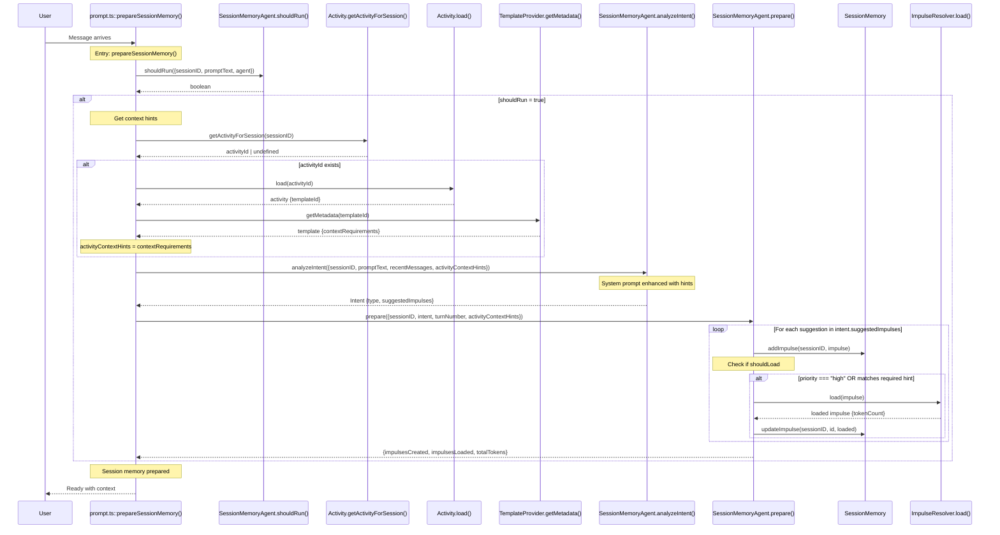

# Session Memory Agent Flow - Symbol Trace

## Complete Flow with Symbols

This document traces the complete flow of context hints through the session memory system, recording every key symbol and transition point.

---

## Flow Diagram



---

## Detailed Symbol Trace

### 1. Entry Point: `prompt.ts`

**Function**: `prepareSessionMemory(input: { sessionID: string; promptText: string; agent: string })`  
**Location**: `src/session/prompt.ts:2423`

**Key Variables**:
- `input.sessionID` - Session identifier
- `input.promptText` - User's message
- `input.agent` - Agent name (activity/plan/review)

**Transition**:
```typescript
const shouldRun = await SessionMemoryAgent.shouldRun({
  sessionID: input.sessionID,
  promptText: input.promptText,
  agent: input.agent,
})
```

---

### 2. Gate Check: `SessionMemoryAgent.shouldRun()`

**Function**: `shouldRun(input: { sessionID: string; promptText: string; agent: string })`  
**Location**: `src/session/memory-agent.ts:971`

**Returns**: `Promise<boolean>`

**Logic**:
- Returns `false` if `config.sessionMemory.enabled === false`
- Returns `false` if agent mode is `"subagent"`
- Returns `false` if message is trivial (greetings, etc.)
- Returns `true` for substantive messages from primary agents

**Transition**: If `true`, continue to hint extraction

---

### 3. Extract Activity Context Hints: `prompt.ts`

**Variables Introduced**:
```typescript
let activityContextHints: ActivityTemplate.ContextRequirement[] = []
```

**Step 3.1: Get Activity ID**
```typescript
const { Activity } = await import("./activity")
const activityId = Activity.getActivityForSession(input.sessionID)
```

**Function**: `Activity.getActivityForSession(sessionId: string)`  
**Location**: `src/session/activity.ts:34`  
**Returns**: `string | undefined`

---

**Step 3.2: Load Activity** (if activityId exists)
```typescript
const activity = await Activity.load(activityId)
```

**Function**: `Activity.load(activityId: string)`  
**Location**: `src/session/activity.ts` (not shown in trace, but standard function)  
**Returns**: `Activity` object with `templateId` property

---

**Step 3.3: Get Template Metadata**
```typescript
const { TemplateProvider } = await import("./template-provider")
const template = await TemplateProvider.getMetadata(activity.templateId)
```

**Function**: `TemplateProvider.getMetadata(templateId: string)`  
**Location**: `src/session/template-provider.ts`  
**Returns**: Template metadata including `contextRequirements`

---

**Step 3.4: Extract Context Requirements**
```typescript
if (template?.contextRequirements) {
  activityContextHints = template.contextRequirements
}
```

**Type**: `ActivityTemplate.ContextRequirement[]`

**Schema**:
```typescript
{
  key: string              // Requirement identifier
  hint: string            // Description of what's needed
  required: boolean       // Must be satisfied?
  impulseTypes: string[]  // Allowed impulse types (file, bashOutput, memo, etc.)
  budgetRange: [number, number]  // Min/max tokens
}
```

**Log Point**:
```typescript
l.info("extracted activity context hints", {
  sessionID: input.sessionID,
  templateId: activity.templateId,
  requirementCount: activityContextHints.length,
})
```

---

### 4. Analyze Intent: `SessionMemoryAgent.analyzeIntent()`

**Function**: `analyzeIntent(input: { sessionID, promptText, recentMessages, activityContextHints })`  
**Location**: `src/session/memory-agent.ts:97`

**Input Symbol**: `activityContextHints: ActivityTemplate.ContextRequirement[]`

**Key Processing**:

**Step 4.1: Build System Prompt with Hints**
```typescript
// Line 142
const system = SystemPrompt.header(config.model.providerID)

// Lines 185-200: Hints section inserted
${input.activityContextHints && input.activityContextHints.length > 0 ? `

## Activity Context Hints

The current activity has specific context requirements. Use these to guide impulse creation:

${input.activityContextHints.map(req => `
### ${req.key} (${req.required ? 'REQUIRED' : 'optional'})
- **Hint**: ${req.hint}
- **Types**: ${req.impulseTypes.join(', ')}
- **Budget**: ${req.budgetRange[0]}-${req.budgetRange[1]} tokens
- **Priority**: ${req.required ? 'high' : 'medium'}
`).join('\n')}

**IMPORTANT**: Create impulses that satisfy these requirements.` : ""}
```

**Step 4.2: LLM Call**
```typescript
const result = await generateObject({
  model: model.language,
  temperature: 0.2,
  messages: [...system, user message],
  schema: Intent.shape,
})
```

**Returns**: `Intent` object

**Intent Schema**:
```typescript
{
  type: "code_fix" | "feature_request" | "question" | "refactor" | "exploration" | "other"
  confidence: number  // 0-1
  reasoning: string
  suggestedImpulses: Array<{
    id: string
    type: "file" | "metabobIssue" | "bashOutput" | "memo" | "component" | etc.
    description: string
    priority: "high" | "medium" | "low"
    budget: number
    pointer: {type, ...specificFields}
  }>
}
```

**Log Point**:
```typescript
l.info("intent analyzed", {
  type: intent.type,
  confidence: intent.confidence,
  suggestedImpulses: intent.suggestedImpulses.length,
})
```

**Transition**: Pass Intent to prepare()

---

### 5. Prepare Session Memory: `SessionMemoryAgent.prepare()`

**Function**: `prepare(input: { sessionID, intent, turnNumber, activityContextHints })`  
**Location**: `src/session/memory-agent.ts:792`

**Input Symbols**:
- `intent: Intent` - From analyzeIntent()
- `activityContextHints: ActivityTemplate.ContextRequirement[]` - Passed through

**Key Variables**:
```typescript
let created = 0
let loaded = 0
let totalTokens = 0
let unloaded = 0
```

---

**Step 5.1: Create Impulse Schema** (for each suggestion)

**Location**: Line 874

```typescript
const impulse: ActivityTemplate.Impulse.Schema = {
  id: suggestion.id,
  sessionID: input.sessionID,
  scope: "session",
  pointer: suggestion.pointer as ActivityTemplate.Impulse.Pointer,
  budget: suggestion.budget,
  priority: suggestion.priority,
  type: suggestion.type,
  metadata: {
    description: suggestion.description,
    createdTurn: input.turnNumber,
    createdBy: "session-memory-agent",
  },
}
```

---

**Step 5.2: Add Impulse to Storage**

**Function**: `SessionMemory.addImpulse(sessionID, impulse)`  
**Location**: `src/session/session-memory.ts:162`

```typescript
await SessionMemory.addImpulse(input.sessionID, impulse)
created++
```

**Storage**: Impulse stored in `["session-memory", sessionID]` key

---

**Step 5.3: Determine Loading Strategy**

**Location**: Lines 897-910

```typescript
// Determine if should load immediately
let shouldLoad = suggestion.priority === "high"
let loadReason = "high-priority"

// ALSO load if matches a required activity context requirement
if (!shouldLoad && input.activityContextHints) {
  const matchesRequirement = input.activityContextHints.some(req => 
    req.required && impulse.metadata?.requirement === req.key
  )
  if (matchesRequirement) {
    shouldLoad = true
    loadReason = "required-context"
  }
}
```

**Key Decision Points**:
1. **High Priority**: `suggestion.priority === "high"` → Load immediately
2. **Required Context**: Impulse matches a required contextRequirement → Load immediately
3. **Otherwise**: Create but don't load (stays empty with tokenCount = 0)

**Log Point**:
```typescript
l.info("impulse created", {
  sessionID: input.sessionID,
  impulseId: impulse.id,
  priority: impulse.priority,
  budget: impulse.budget,
  willLoadNow: shouldLoad,
  loadReason: shouldLoad ? loadReason : "not-loading",
})
```

---

**Step 5.4: Load Impulse Content** (if shouldLoad)

**Location**: Lines 922-943

```typescript
if (shouldLoad) {
  const { ImpulseResolver } = await import("./impulse-resolver")
  const loadedImpulse = await ImpulseResolver.load(impulse)
  await SessionMemory.updateImpulse(input.sessionID, suggestion.id, loadedImpulse)
  loaded++
  totalTokens += loadedImpulse.tokenCount || 0
}
```

---

### 6. Load Impulse: `ImpulseResolver.load()`

**Function**: `load(impulse: ActivityTemplate.Impulse.Schema)`  
**Location**: `src/session/impulse-resolver.ts:619`

**Input**: Impulse with pointer (unloaded, no content)

**Processing**:
- Resolves pointer based on type:
  - `file`: Read file content via `ReadTool`
  - `bashOutput`: Execute command via `BashTool`
  - `memo`: Use inline content
  - `component`: Load specific component
  - `metabobIssue`: Query Metabob API
  - etc.

**Returns**: Loaded impulse with:
```typescript
{
  ...impulse,
  content: string,      // Resolved content
  tokenCount: number,   // Actual token count
  loadedAt: number      // Timestamp
}
```

**Log Point**:
```typescript
l.info("impulse loaded", {
  sessionID: input.sessionID,
  impulseId: loadedImpulse.id,
  loadReason,
  tokenCount: loadedImpulse.tokenCount,
  budget: loadedImpulse.budget,
  withinBudget: (loadedImpulse.tokenCount || 0) <= loadedImpulse.budget,
})
```

---

### 7. Update Storage: `SessionMemory.updateImpulse()`

**Function**: `updateImpulse(sessionID, impulseId, updates)`  
**Location**: `src/session/session-memory.ts:252`

**Updates**:
```typescript
{
  content: string,
  tokenCount: number,
  loadedAt: number
}
```

**Storage Update**: Impulse now has `tokenCount > 0` (no longer empty!)

---

### 8. Return Results

**Location**: Lines 947-962

```typescript
l.info("prepare() completed", {
  sessionID: input.sessionID,
  created,
  loaded,
  unloaded,
  totalTokens,
  skipped: input.intent.suggestedImpulses.length - created,
  hintsProvided: input.activityContextHints?.length ?? 0,
  hintsAddressed: created > 0 ? "yes" : "no",
  elapsed: Date.now() - start,
})

return {
  impulsesCreated: created,
  impulsesLoaded: loaded,
  impulsesUnloaded: unloaded,
  totalTokens,
}
```

---

## Key Symbol Summary

### Entry → Exit Flow

```
User Message
  ↓
prompt.ts::prepareSessionMemory()
  ↓
SessionMemoryAgent.shouldRun() → boolean
  ↓ (if true)
Activity.getActivityForSession() → activityId?
  ↓ (if exists)
Activity.load() → activity {templateId}
  ↓
TemplateProvider.getMetadata() → template {contextRequirements}
  ↓
activityContextHints: ActivityTemplate.ContextRequirement[]
  ↓
SessionMemoryAgent.analyzeIntent() → Intent {suggestedImpulses}
  ↓
SessionMemoryAgent.prepare() 
  ↓
  Loop: for each suggestion
    ↓
    SessionMemory.addImpulse() → stored
    ↓
    if (high priority OR required context)
      ↓
      ImpulseResolver.load() → loaded {content, tokenCount}
      ↓
      SessionMemory.updateImpulse() → updated with content
  ↓
{created, loaded, totalTokens}
  ↓
Session ready with loaded context
```

---

## Critical Data Structures

### 1. ActivityTemplate.ContextRequirement

```typescript
{
  key: string              // "errorContext", "relatedFiles", etc.
  hint: string            // "Provide error file and stack trace"
  required: boolean       // true = must load, false = optional
  impulseTypes: string[]  // ["file", "bashOutput", "memo"]
  budgetRange: [number, number]  // [1000, 3000]
}
```

**Flow**: Template → activityContextHints → System Prompt → Loading Decision

---

### 2. Intent.suggestedImpulses[]

```typescript
{
  id: string              // "errorFile", "stackTrace", etc.
  type: string           // "file", "bashOutput", "memo"
  description: string    // "File containing the error"
  priority: string       // "high", "medium", "low"
  budget: number         // 2000
  pointer: {             // Type-specific pointer
    type: "file",
    path: "src/tool/bash.ts",
    offset?: number,
    limit?: number
  }
}
```

**Flow**: LLM generates → prepare() creates → storage

---

### 3. ActivityTemplate.Impulse.Schema

```typescript
{
  id: string
  sessionID: string
  scope: "session" | "activity"
  pointer: Pointer      // Unresolved reference
  budget: number
  priority: "high" | "medium" | "low"
  type: string
  metadata: {
    description: string
    createdTurn: number
    createdBy: "session-memory-agent"
    requirement?: string  // Maps to contextRequirement.key
  }
  // After loading:
  content?: string      // Resolved content
  tokenCount?: number   // Actual size
  loadedAt?: number     // When loaded
}
```

**Flow**: Created → Stored → (maybe) Loaded → Updated

---

## Loading Decision Matrix

| Priority | Required Hint Match | Action | Reason |
|----------|---------------------|--------|--------|
| high | - | **LOAD** | high-priority |
| medium | true | **LOAD** | required-context |
| medium | false | skip | not needed yet |
| low | true | **LOAD** | required-context |
| low | false | skip | background context |

---

## Log Points to Monitor

### 1. Hint Extraction
```
"extracted activity context hints" {
  sessionID,
  templateId,
  requirementCount
}
```

### 2. Intent Analysis
```
"intent analyzed" {
  type,
  confidence,
  suggestedImpulses
}
```

### 3. Impulse Creation
```
"impulse created" {
  sessionID,
  impulseId,
  priority,
  budget,
  willLoadNow,
  loadReason: "high-priority" | "required-context" | "not-loading"
}
```

### 4. Impulse Loading
```
"impulse loaded" {
  sessionID,
  impulseId,
  loadReason,
  tokenCount,
  budget,
  withinBudget
}
```

### 5. Preparation Complete
```
"prepare() completed" {
  sessionID,
  created,
  loaded,
  unloaded,
  totalTokens,
  skipped,
  hintsProvided,      // NEW: Count of context requirements
  hintsAddressed,     // NEW: "yes" | "no"
  elapsed
}
```

---

## Verification Checklist

To verify the flow is working correctly:

1. ✅ **Hint Extraction**: Log shows `"extracted activity context hints"` with count > 0
2. ✅ **Hint Passing**: `analyzeIntent()` receives `activityContextHints` parameter
3. ✅ **System Prompt Enhancement**: LLM sees hints in prompt (check via debug logs)
4. ✅ **Targeted Impulses**: `suggestedImpulses` match hint requirements
5. ✅ **Prioritized Loading**: Required impulses have `loadReason: "required-context"`
6. ✅ **Non-Empty Impulses**: Loaded impulses have `tokenCount > 0`
7. ✅ **Hint Tracking**: Final log shows `hintsProvided > 0` and `hintsAddressed: "yes"`

---

## What Was Fixed

### Before (Broken)
```
User Message → prepareSessionMemory()
  → turn-lifecycle-hook tries "manage-session-memory" template → FAILS
  → Memory agent gets NO hints
  → Creates generic file suggestions
  → Many impulses stay empty (tokenCount = 0)
```

### After (Fixed)
```
User Message → prepareSessionMemory()
  → Extract contextRequirements from active activity
  → Pass hints to analyzeIntent() → Enhanced system prompt
  → Memory agent creates targeted impulses
  → Required context loaded immediately (tokenCount > 0)
  → Hints tracked in logs
```

---

## Next Steps: Intelligence Layer

Now that the pipeline is fixed, we can add:

1. **Historical Effectiveness** - Query which impulses helped in similar tasks
2. **Active Gathering** - Execute analysis activities to synthesize context
3. **Content Generation** - LLM-generated summaries instead of raw files
4. **Learned Optimization** - Adjust budgets/priorities based on outcomes

See: `SESSION_MEMORY_AGENT_EVOLUTION.md` for full roadmap.
