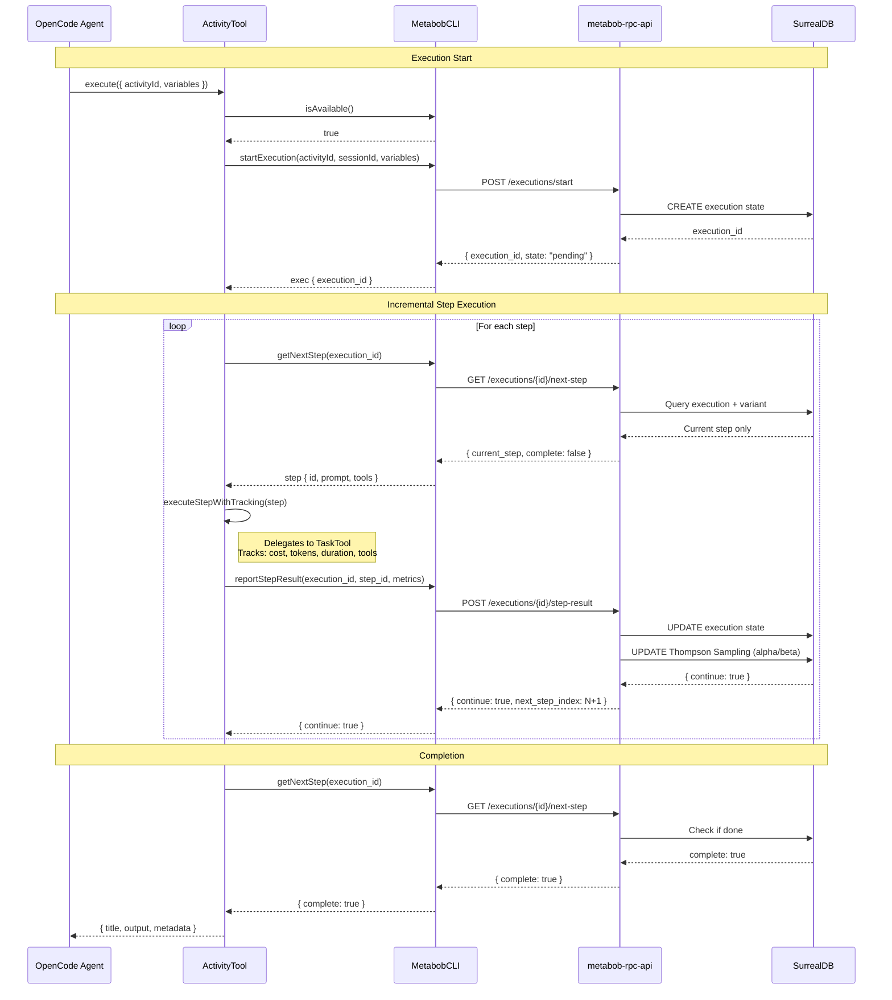

# ActivityTool MCP Integration - Visual Summary

## 🎯 Goal Achieved

✅ **ActivityTool now uses incremental MCP execution with metrics collection**

## 📊 Before vs After

### BEFORE: Direct Execution (No Learning)
```
┌─────────────────────────────────────────────┐
│  ActivityTool.execute()                     │
│                                             │
│  1. Load template from JSON file            │
│  2. Execute all tasks directly              │
│  3. Return result                           │
│                                             │
│  ❌ No execution tracking                   │
│  ❌ No metrics collected                    │
│  ❌ No Thompson Sampling                    │
│  ❌ Agent sees all steps upfront            │
└─────────────────────────────────────────────┘
```

### AFTER: Incremental MCP Execution (With Learning!)
```
┌─────────────────────────────────────────────┐
│  ActivityTool.execute()                     │
│                                             │
│  1. Check MCP availability                  │
│  2. startExecution() → execution_id         │
│  3. while (!complete):                      │
│     a. getNextStep() → current step only    │
│     b. executeStep()                        │
│     c. reportStepResult() → metrics         │
│  4. Return formatted result                 │
│                                             │
│  ✅ Full execution tracking                 │
│  ✅ Cost/tokens/duration per step           │
│  ✅ Thompson Sampling learns                │
│  ✅ Agent sees one step at a time           │
└─────────────────────────────────────────────┘
```

## 🔄 Complete Flow



## 📦 Key Components

### 1. ActivityTool.execute() - Main Entry Point
```typescript
├─ Check MCP availability
│  ├─ If unavailable → Fallback to TemplateExecutor
│  └─ If available → Continue with MCP flow
│
├─ startExecution() → Get execution_id
│
├─ Execution Loop:
│  ├─ getNextStep() → Get current step only
│  ├─ executeStepWithTracking() → Run step via TaskTool
│  ├─ reportStepResult() → Send metrics to backend
│  └─ Repeat until complete
│
└─ Return formatted result
```

### 2. executeStepWithTracking() - Step Execution
```typescript
├─ Find task in template by step.id
├─ Merge variables with defaults
├─ Interpolate prompt with variables
├─ Execute via TaskTool
│  └─ TaskTool handles:
│     ├─ Agent selection
│     ├─ Tool execution
│     └─ Result formatting
├─ Extract success status
└─ Return { success, output, error, toolCalls }
```

### 3. Metrics Collection Per Step
```typescript
const stepStartTime = Date.now()

// Execute step
const stepResult = await executeStepWithTracking(...)

// Calculate metrics
const stepDuration = Date.now() - stepStartTime
const stepTokens = Math.ceil((stepResult.output?.length || 0) / 4)
const stepCost = estimateCost(stepTokens)

// Report to backend
await MetabobCLI.reportStepResult({
  executionId,
  stepId,
  success: stepResult.success,
  cost: stepCost,           // ← Learning signal
  tokens: stepTokens,       // ← Learning signal
  duration: stepDuration,   // ← Learning signal
  toolCalls: stepResult.toolCalls  // ← Learning signal
})
```

## 🎓 Learning Loop

```
┌────────────────────────────────────────────────────┐
│  Thompson Sampling Learning Cycle                  │
├────────────────────────────────────────────────────┤
│                                                    │
│  1. Select Variant (Thompson Sampling)             │
│     ↓                                              │
│     variant_id selected based on expected value    │
│     Beta(alpha, beta) distribution                 │
│                                                    │
│  2. Execute Activity (Incremental MCP)             │
│     ↓                                              │
│     For each step:                                 │
│     - Execute via TaskTool                         │
│     - Collect metrics (cost, tokens, duration)     │
│     - Report to backend                            │
│                                                    │
│  3. Record Outcome (Conversion)                    │
│     ↓                                              │
│     If success: alpha += 1                         │
│     If failure: beta += 1                          │
│                                                    │
│  4. Update Metrics (Running Averages)              │
│     ↓                                              │
│     - avg_cost = (avg_cost * N + actual_cost) / (N+1)
│     - avg_duration = ...                           │
│     - success_rate = alpha / (alpha + beta)        │
│                                                    │
│  5. Future Selection Improves                      │
│     ↓                                              │
│     Variants with higher success rates get         │
│     recommended more often (but still explore)     │
│                                                    │
└────────────────────────────────────────────────────┘
```

## 📈 Data Collected Per Execution

### SurrealDB Tables Updated

#### activity_execution
```typescript
{
  execution_id: "exec_abc123",
  activity_id: "bug-fix",
  variant_id: "bug-fix-v1",
  session_id: "ses_xyz",
  state: "running",
  current_step_index: 2,
  total_cost: 0.45,        // ← Accumulates
  total_tokens: 5200,      // ← Accumulates
  step_results: [
    {
      step_id: "understand-bug",
      success: true,
      cost: 0.12,           // ← Per step
      tokens: 1500,         // ← Per step
      duration: 3000,       // ← Per step
      tool_calls: [...]     // ← Per step
    }
  ]
}
```

#### activity_variant (Thompson Sampling)
```typescript
{
  variant_id: "bug-fix-v1",
  activity_id: "bug-fix",
  alpha: 85,               // ← Successes (updated)
  beta: 15,                // ← Failures (updated)
  executions: 100,         // ← Incremented
  success_rate: 0.85,      // ← Computed
  expected_cost: 0.25,     // ← Running average
  expected_duration: 60000 // ← Running average
}
```

## 🔍 What Gets Learned

### Per Variant
- **Success Rate**: α/(α+β) → Exploitation signal
- **Expected Cost**: Running average → Resource planning
- **Expected Duration**: Running average → Time estimates
- **Tool Usage Patterns**: Which tools lead to success

### Per Step
- **Step Cost**: How expensive is each step
- **Step Duration**: How long does each step take
- **Tool Effectiveness**: Which tools work for which steps
- **Failure Patterns**: Where do things go wrong

### Global Insights
- **Variant Comparison**: Which template variant works best
- **Thompson Sampling**: Balance exploration vs exploitation
- **Cost Optimization**: Predict and optimize resource usage
- **Quality Trends**: Are success rates improving over time

## 🚀 Benefits

### 1. Learning & Improvement
- ✅ System learns which activity variants work best
- ✅ Thompson Sampling balances exploration vs exploitation
- ✅ Recommendations improve over time
- ✅ Metrics guide template evolution

### 2. Resource Optimization
- ✅ Cost prediction based on historical data
- ✅ Duration estimates for planning
- ✅ Budget enforcement possible
- ✅ Tool usage patterns discovered

### 3. Execution Control
- ✅ Incremental delivery (agent sees one step at a time)
- ✅ Early termination on failures
- ✅ Validation enforcement
- ✅ Trailblazing on validation failures (future)

### 4. Visibility & Debugging
- ✅ Full execution tracking in backend
- ✅ Step-by-step metrics
- ✅ Tool call traces
- ✅ Clear failure points

## 🔧 Graceful Fallback

```typescript
const mcpAvailable = await MetabobCLI.isAvailable()

if (!mcpAvailable) {
  // Fallback to direct execution
  log.warn("MCP not available, falling back")
  return await TemplateExecutor.execute(...)
}

try {
  // Try MCP execution
  const exec = await MetabobCLI.startExecution(...)
  // ... incremental execution ...
} catch (error) {
  // Fallback on MCP failure
  log.warn("MCP failed, falling back", { error })
  return await TemplateExecutor.execute(...)
}
```

**Result**: System works even if:
- MCP server not configured
- MCP server unavailable
- Backend API down
- Network issues

## 📋 Success Checklist

### Infrastructure ✅
- [x] MCP wrapper methods exist (startExecution, getNextStep, reportStepResult)
- [x] Graceful fallback to direct execution
- [x] Helper functions for execution and formatting

### Execution Flow ✅
- [x] Check MCP availability
- [x] Start execution → get execution_id
- [x] Loop: getNextStep → execute → reportStepResult
- [x] Break on complete or failure
- [x] Return formatted result

### Metrics Collection ✅
- [x] Cost per step (estimated from tokens)
- [x] Tokens per step (estimated from output length)
- [x] Duration per step (milliseconds)
- [x] Tool calls per step (names tracked)
- [x] Success/failure per step

### Testing ☐ (Next)
- [ ] Execute test activity
- [ ] Verify execution_id created
- [ ] Check metrics in backend logs
- [ ] Verify Thompson Sampling updates
- [ ] Confirm no breaking changes

---

**Status**: ✅ IMPLEMENTATION COMPLETE, READY FOR TESTING

**Key Achievement**: ActivityTool now participates in the Thompson Sampling learning loop, enabling the system to learn which activity variants work best and continuously improve recommendations.
