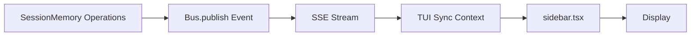

# TUI Sidebar Not Reflecting Impulse State - Investigation

## The Issue

The TUI sidebar is not correctly displaying the session memory impulse system state.

---

## How TUI Gets Impulse Data

### Data Flow



### Code Path

**Backend** (`session-memory.ts`):
```typescript
await Bus.publish(SessionMemory.Event.Updated, {
  sessionID,
  impulses: Object.values(store.impulses),
  stats: {
    totalBudget: store.totalBudget,
    usedTokens: store.usedTokens,
    impulseCount: Object.keys(store.impulses).length,
  },
})
```

**TUI Sync** (`tui/context/sync.tsx:143`):
```typescript
case "session.memory.updated":
  draft.session_memory[sessionID] = {
    impulses: event.properties.impulses,
    stats: event.properties.stats
  }
```

**TUI Sidebar** (`tui/routes/session/sidebar.tsx:102`):
```typescript
const impulses = createMemo(() => 
  sync.data.session_memory[props.sessionID]?.impulses ?? []
)
const impulseStats = createMemo(() => 
  sync.data.session_memory[props.sessionID]?.stats ?? null
)
```

**TUI Render** (sidebar.tsx:843-868):
```tsx
<For each={sessionState()!.impulses.impulses}>
  {(impulse) => (
    <box>
      <text>{impulse.description}</text>
      <text>{impulse.tokenCount ?? 0}/{impulse.budget} tokens</text>
    </box>
  )}
</For>
```

---

## What the TUI Expects

### From Logs

**Sidebar also queries** (sidebar.tsx:200):
```typescript
fetch(`/session/${sessionID}/relationships/impulse-activity-map`)
```

This provides activity-specific impulse mapping.

### Data Structure Expected

**ImpulseState** (session-state.ts:29-38):
```typescript
{
  impulses: ActivityTemplate.Impulse.Info[],  // Array of impulse info
  totalBudget: number,
  usedTokens: number,
  impulseCount: number,
  utilization: number,
  loadedCount: number,
  unloadedCount: number
}
```

**Impulse.Info** (activity-template.ts:123-140):
```typescript
{
  id: string,
  type: string,
  pointer: Pointer,
  description: string,
  budget: number,
  priority: "high" | "medium" | "low",
  tokenCount?: number,
  scope?: "session" | "activity",
  sessionID?: string,
  activityId?: string,
  metadata?: Record<string, unknown>,
  usageStats?: UsageStats
}
```

---

## Potential Issues

### Issue 1: Parent Session vs Memory Agent Session

**From logs**, we saw:
- Memory agent session: `ses_3c63aca59ffe3HvkZL4IUq81ki`
- Parent session: `ses_3c9896844ffebsvjnDrnHGa93t`

**Impulses created in**: Parent session ✅

**TUI is viewing**: Parent session (presumably)

**So TUI should see impulses** if events are published correctly.

### Issue 2: Event Publishing

**Check if events are published** when impulses created:

From `session-memory.ts`:
- Line 212-220: `Bus.publish(SessionMemory.Event.Updated, ...)`
- Line 223-227: `Bus.publish(Session.Event.ImpulseUpdated, ...)`

**These should trigger** after impulse_create and impulse_load.

### Issue 3: Real-Time vs Polling

**TUI uses two sources**:
1. **Real-time SSE** (`sync.data.session_memory`) - via Bus events
2. **Polled API** (`sessionState()`) - via `/session/:id/state` endpoint

**If SSE not working**: TUI falls back to polling (slower updates)

**If polling broken**: TUI shows stale data

---

## Investigation Steps

### Step 1: Check Event Publishing

```bash
# Look for bus event logs
tail -1000 /home/avi/.local/share/opencode/log/dev.log | grep "session.memory.updated\|session.impulse.updated" | tail -20
```

**Expected**: Events published after impulse operations

**If missing**: Events not being published

### Step 2: Check SSE Stream

```bash
# Look for SSE send logs
tail -1000 /home/avi/.local/share/opencode/log/dev.log | grep "SSE\|sse\|server-sent" | tail -20
```

**Expected**: Events flowing to TUI

**If missing**: SSE connection issue

### Step 3: Check Session State API

```bash
curl http://localhost:3000/session/{sessionID}/state | jq '.impulses'
```

**Expected**:
```json
{
  "impulses": [
    {"id": "current-proto-schema", "tokenCount": 4564, "budget": 3000},
    {"id": "action-plan", "tokenCount": 1291, "budget": 2500}
  ],
  "totalBudget": 21500,
  "usedTokens": 5855,
  "impulseCount": 10,
  "utilization": 27.2
}
```

**If different**: API not returning correct data

### Step 4: Check TUI Sync State

In TUI console:
```typescript
// Check if data is in sync context
console.log(sync.data.session_memory[sessionID])

// Expected:
// {impulses: [...], stats: {...}}
```

---

## Possible Root Causes

### Cause 1: Wrong Session ID

**Symptom**: TUI viewing session A, impulses created in session B

**Check**:
- Are impulses being created in correct session?
- Is TUI viewing the right session?

**From logs**: Impulses created in `ses_3c9896844ffebsvjnDrnHGa93t` (parent)

### Cause 2: Events Not Publishing

**Symptom**: Impulses created but events not sent

**Check**:
```bash
grep "Bus.publish.*session.memory.updated" logs
```

**Should see**: Event published after each impulse operation

### Cause 3: SSE Not Connected

**Symptom**: Events published but TUI not receiving

**Check**:
```bash
grep "SSE.*connect\|sse.*client" logs
```

### Cause 4: Data Format Mismatch

**Symptom**: Events received but wrong format

**Check**: ActivityTemplate.Impulse.Info vs what TUI expects

**Our changes** might have broken the format if we:
- Added required fields TUI doesn't provide
- Changed field names
- Changed data types

---

## What to Check in Logs

### 1. Are Events Being Published?

```bash
tail -2000 /home/avi/.local/share/opencode/log/dev.log | \
  grep "publishing.*session.memory.updated"
```

**Should see**: Event published after impulse_create and impulse_load

### 2. What Data Is In Events?

Look for the event payload in logs (might be at DEBUG level):
```bash
tail -2000 /home/avi/.local/share/opencode/log/dev.log | \
  grep -A5 "session.memory.updated"
```

### 3. Is TUI Receiving Events?

Check TUI console or logs for:
```
sync: received event session.memory.updated
sync: updated session_memory for ses_xxx
```

### 4. What Does API Return?

```bash
curl http://localhost:3000/session/ses_3c9896844ffebsvjnDrnHGa93t/state | \
  jq '.impulses' > /tmp/impulse-state.json
cat /tmp/impulse-state.json
```

---

## Quick Diagnostic

Run this to see what's happening:

```bash
#!/bin/bash
echo "=== TUI Sidebar Diagnostic ==="

echo "1. Check if impulses exist in storage:"
cat ~/.local/share/opencode/storage/session-memory/ses_3c9896844ffebsvjnDrnHGa93t.json | \
  jq '{impulseCount: (.impulses | length), impulseIds: (.impulses | keys)}'

echo "2. Check if events being published:"
tail -500 /home/avi/.local/share/opencode/log/dev.log | \
  grep "session.memory.updated" | wc -l

echo "3. Check API endpoint:"
curl -s http://localhost:3000/session/ses_3c9896844ffebsvjnDrnHGa93t/state | \
  jq '.impulses.impulseCount'

echo "4. Check recent impulse operations:"
tail -500 /home/avi/.local/share/opencode/log/dev.log | \
  grep "impulse-create\|impulse-load" | grep INFO | tail -10
```

---

## Likely Issue

### Based on Architecture

**Memory agent subagent** creates impulses in **parent session**.

**But**: Memory agent also has its own turn lifecycle hooks that might create impulses in **its own session**.

**From logs at 20:22:31**:
```
INFO turn-lifecycle-hooks preparing metabob context impulses
     sessionID=ses_3c63aca59ffe3HvkZL4IUq81ki
     impulsesCreated=3
```

**This created impulses in the MEMORY AGENT's session**, not the parent!

**Then later**:
```
DEBUG impulse-create 
      memorySession=ses_3c63aca59ffe3HvkZL4IUq81ki
      targetSession=ses_3c9896844ffebsvjnDrnHGa93t
      memory agent operating on parent session
```

**This created impulses in the PARENT session** ✅

**So we have impulses in TWO sessions**:
1. Memory agent's own session (from its lifecycle hooks)
2. Parent session (from tool calls)

**TUI might be showing the wrong session!**

---

## The Fix

### Option 1: Disable Hooks for Memory Agent

Memory agent subagent shouldn't run its own turn lifecycle hooks.

**In turn-lifecycle-hooks.ts**, check if agent is memory subagent:

```typescript
enabled: async (ctx) => {
  // Skip for memory agent subagents
  if (ctx.agent.name === "memory") {
    return false
  }
  // ... rest of checks
}
```

### Option 2: Correct Session Filtering

Make sure TUI only shows parent session impulses, not memory agent's.

### Option 3: Verify Event Target

Ensure events are published for the correct session (parent, not memory agent).

---

## Next Steps

1. Check which session TUI is viewing
2. Check which session has the impulses
3. Verify events are for the correct session
4. Add filtering if needed

The issue is likely that impulses are split across two sessions (memory agent's and parent's), and TUI is showing one while we created in another.
