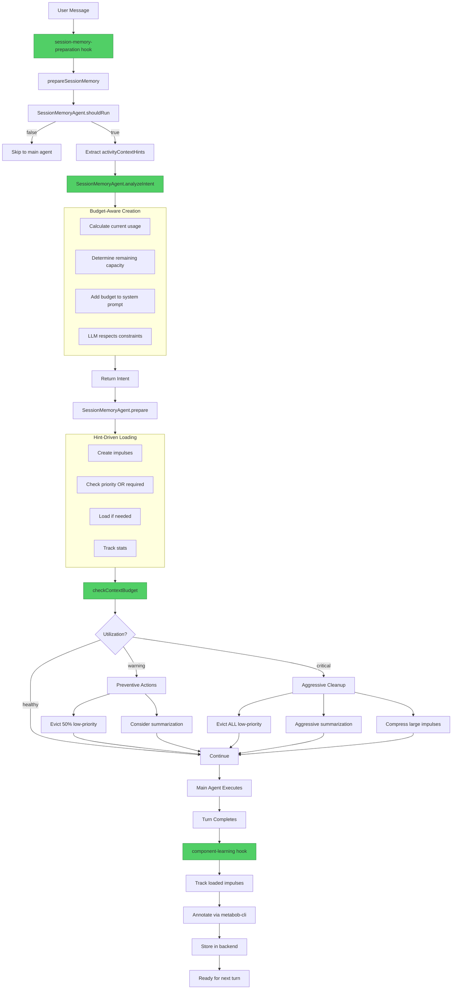

# Session Memory Agent - Complete Responsibilities

## Overview

The session memory agent is the **intelligent context manager** responsible for the entire lifecycle of context preparation, maintenance, and learning.

---

## Core Responsibilities

### 1. Context Preparation (IMPLEMENTED ✅)

**When**: Before every turn (via `session-memory-preparation` hook, priority 10)

**What**:
- Analyze user intent from message
- Extract activity context hints from active activity template
- Generate targeted impulse suggestions via LLM
- Create and load impulses based on priority
- Validate file paths and skip non-existent files

**Outputs**:
- Created impulses with proper descriptions
- Loaded impulses (tokenCount > 0) for high-priority + required context
- Comprehensive logs tracking hint usage

**Code Location**: 
- `src/session/prompt.ts:2423` - prepareSessionMemory()
- `src/session/memory-agent.ts:97` - analyzeIntent()
- `src/session/memory-agent.ts:792` - prepare()

---

### 2. Context Window Management (TO IMPLEMENT)

**When**: After impulse loading, before main agent execution

**What**:
- Monitor total context usage (impulses + messages + system)
- Calculate utilization percentage
- Identify overflow risks proactively
- Trigger preventive actions when utilization > 70%

**Thresholds**:
- **Healthy**: 0-70% utilization - Normal operation
- **Warning**: 70-85% utilization - Preventive actions
- **Critical**: 85-100% utilization - Aggressive cleanup

**Actions**:
- **Warning**: Evict 50% of low-priority impulses, consider summarization
- **Critical**: Evict ALL low-priority, aggressive summarization, compress medium-priority

**Outputs**:
- Budget status logs
- Eviction actions executed
- Summarization triggered

**Code Location**: 
- `src/session/memory-agent.ts` - checkContextBudget() (NEW)
- Integration in prepare() after line 956

---

### 3. Intelligent Summarization Planning (TO IMPLEMENT)

**When**: Triggered by context budget check or manually

**What**:
- Analyze message history for relevance
- Identify messages that can be safely summarized/discarded
- Score messages based on:
  - Age (older = less relevant)
  - Referenced by current impulses?
  - Contains code changes?
  - User vs assistant message
- Group messages for different summarization strategies

**Strategies**:
- **Discard**: Relevance < 0.1 (old acknowledgments, trivial exchanges)
- **Brief**: Relevance 0.1-0.3 (old context, can be one-liner)
- **Dense**: Relevance 0.3-0.7 (important but verbose, can be compressed)
- **Preserve**: Relevance > 0.7 (recent or critical, keep full)

**Outputs**:
- Summarization plan with message groups
- Estimated token savings
- Trigger for SessionCompaction.run()

**Code Location**: 
- `src/session/memory-agent.ts` - planSummarization() (NEW)
- Integration in checkContextBudget()

---

### 4. Component Interaction Learning (TO IMPLEMENT)

**When**: After turn completes (via `component-learning` hook, priority 110)

**What**:
- Track which impulses were loaded
- Extract component information (file, name, type)
- Determine if interaction was helpful (based on outcome)
- Annotate helpful components via metabob-cli

**Annotation Content**:
- Task description (why was this loaded?)
- Token usage (how much space?)
- Context requirement (which hint?)
- Load reason (why prioritized?)
- Outcome (success/failure)
- Pattern note (when to load again)

**Outputs**:
- Component annotations in metabob backend
- Historical patterns for future sessions
- Learning accumulation over time

**Code Location**: 
- `src/session/turn-lifecycle-hooks.ts` - component-learning hook (NEW)
- Integration with MCP.call("metabob", "annotate_component")

---

### 5. Budget-Aware Impulse Creation (TO IMPLEMENT)

**When**: During analyzeIntent(), before LLM call

**What**:
- Calculate current budget usage
- Determine remaining capacity
- Add budget status to system prompt
- Guide LLM to respect constraints

**Budget Prompt Enhancement**:

| Status | Remaining | Guidance |
|--------|-----------|----------|
| CRITICAL | < 10k | "Suggest ONLY 1-2 essential impulses, 500-1000 tokens each" |
| MODERATE | 10-30k | "Be selective, 3-4 impulses max, conservative budgets" |
| HEALTHY | > 30k | "Normal operation, up to 5 impulses, standard budgets" |

**Outputs**:
- Budget-constrained impulse suggestions
- LLM avoids overwhelming context
- Smooth scaling to long sessions

**Code Location**: 
- `src/session/memory-agent.ts` - analyzeIntent() (enhance existing)
- Add budget calculation before system prompt construction

---

## Complete Flow Diagram



---

## Responsibility Matrix

| Phase | Responsibility | Status | Priority |
|-------|---------------|--------|----------|
| **Pre-Turn** | Extract activity hints | ✅ Implemented | Critical |
| **Pre-Turn** | Analyze user intent | ✅ Implemented | Critical |
| **Pre-Turn** | Check current budget | 🔨 To Implement | High |
| **Pre-Turn** | Create targeted impulses | ✅ Implemented | Critical |
| **Pre-Turn** | Load priority/required impulses | ✅ Implemented | Critical |
| **Pre-Turn** | Prevent budget overflow | 🔨 To Implement | High |
| **Pre-Turn** | Trigger summarization | 🔨 To Implement | High |
| **Post-Turn** | Track component interactions | 🔨 To Implement | Medium |
| **Post-Turn** | Annotate helpful components | 🔨 To Implement | Medium |
| **Post-Turn** | Optimize impulse allocation | ✅ Exists (memory-lifecycle) | Medium |

---

## Data Sources

### Inputs (What Memory Agent Receives)

1. **User Message**
   - Source: prompt.ts
   - Content: User's text input
   - Used for: Intent analysis

2. **Activity Context Hints**
   - Source: Active activity template (via TemplateProvider)
   - Content: contextRequirements array
   - Used for: Targeted impulse creation, prioritized loading

3. **Recent Messages**
   - Source: MessageV2.getLast()
   - Content: Last 5 messages
   - Used for: Understanding conversation context

4. **Current Budget**
   - Source: SessionMemoryManager.getContextSpace()
   - Content: Used/available tokens, utilization
   - Used for: Overflow prevention

5. **Project Structure**
   - Source: Ripgrep.tree()
   - Content: File paths and directory structure
   - Used for: Validating file suggestions

### Outputs (What Memory Agent Produces)

1. **Impulses**
   - Target: SessionMemory storage
   - Content: Created impulses (loaded or unloaded)
   - Used by: Main agent for context

2. **Budget Warnings**
   - Target: Logs
   - Content: Status, actions, recommendations
   - Used by: Developers for monitoring

3. **Eviction Actions**
   - Target: SessionMemory (update impulses)
   - Content: Unload low-priority impulses
   - Used for: Freeing space

4. **Summarization Triggers**
   - Target: SessionCompaction.run()
   - Content: Async job to compress history
   - Used for: Token savings

5. **Component Annotations**
   - Target: metabob-cli backend (via MCP)
   - Content: Learning from interactions
   - Used by: Future sessions (via Metabob context injection)

---

## Decision Trees

### Decision 1: Should Load Impulse?

```
Is priority "high"?
  YES → LOAD (loadReason: "high-priority")
  NO ↓

Does impulse match required contextRequirement?
  YES → LOAD (loadReason: "required-context")
  NO ↓

SKIP (create but don't load)
```

### Decision 2: Budget Action Needed?

```
Utilization < 70%?
  YES → No action (status: healthy)
  NO ↓

Utilization < 85%?
  YES → Preventive actions (status: warning)
    - Evict 50% low-priority
    - Consider summarization if > 30 messages
  NO ↓

Utilization >= 85%
  YES → Aggressive actions (status: critical)
    - Evict ALL low-priority
    - Summarize aggressively (keep 10 recent)
    - Compress large medium-priority
```

### Decision 3: Should Annotate Component?

```
Was impulse loaded? (tokenCount > 0)
  NO → SKIP
  YES ↓

Is impulse type "file" or "component"?
  NO → SKIP
  YES ↓

Was turn outcome "success"?
  NO → SKIP
  YES ↓

ANNOTATE (record interaction pattern)
```

---

## Integration Points

### With Existing Systems

1. **SessionMemoryManager** (existing)
   - Used by: Budget monitoring
   - Provides: Context space, limits, utilization

2. **SessionCompaction** (existing)
   - Used by: Summarization trigger
   - Provides: Message compression, pruning

3. **SessionMemoryLifecycle** (existing)
   - Used by: Post-turn optimization
   - Provides: Stale impulse cleanup

4. **MCP metabob-cli** (existing)
   - Used by: Component annotation
   - Provides: Persistent storage of learnings

### New Systems Created

1. **Budget Monitoring**
   - Function: checkContextBudget()
   - Purpose: Proactive overflow prevention
   - Triggers: Eviction, summarization

2. **Component Learning**
   - Hook: component-learning (priority 110)
   - Purpose: Track and annotate interactions
   - Outputs: Metabob annotations

3. **Budget-Aware Prompting**
   - Enhancement: Add budget to system prompt
   - Purpose: Guide LLM within constraints
   - Result: No overflow from impulse creation

---

## Implementation Checklist

### Immediate (This Week)
- [x] ✅ Fix hint extraction pipeline
- [x] ✅ Pass hints through analyzeIntent → prepare
- [x] ✅ Prioritize loading based on hints
- [x] ✅ Add validation logging
- [ ] 🔨 Add context budget monitoring
- [ ] 🔨 Implement eviction helpers

### Short-Term (Next 2 Weeks)
- [ ] Add budget-aware system prompt
- [ ] Integrate summarization triggering
- [ ] Test with high-utilization sessions
- [ ] Verify no overflows occur

### Medium-Term (Next Month)
- [ ] Add component learning hook
- [ ] Implement annotation logic
- [ ] Test annotation effectiveness
- [ ] Measure learning accumulation

### Long-Term (Future)
- [ ] Query historical effectiveness (per SESSION_MEMORY_AGENT_EVOLUTION.md)
- [ ] Execute analysis activities for synthesis
- [ ] Content generation (summaries)
- [ ] Bayesian optimization of weights

---

## The Complete Picture

### Session Memory Agent Transforms From:

**Before** (Router):
```
User Message
  ↓
Suggest generic files
  ↓
Create empty impulses
  ↓
[No overflow prevention]
  ↓
[No learning]
```

**After** (Intelligent Context Manager):
```
User Message
  ↓
Extract activity hints ✅
  ↓
Budget-aware intent analysis 🔨
  ↓
Create targeted impulses ✅
  ↓
Prioritized loading ✅
  ↓
Monitor budget 🔨
  ↓
Prevent overflow 🔨
  ↓
Summarize if needed 🔨
  ↓
Main agent executes
  ↓
Track interactions 🔨
  ↓
Annotate components 🔨
  ↓
Learn for future 🔨
```

Legend:
- ✅ Implemented (this session)
- 🔨 To implement (next phase)

---

## Why This Matters

### Problem: Empty Impulses

**Root Cause**: Function never called + no hints  
**Symptom**: tokenCount = 0, wasted storage  
**Fix**: Hook invokes function, passes hints, loads required context  
**Result**: tokenCount > 0, useful context ✅

### Problem: Context Overflow

**Root Cause**: No proactive monitoring  
**Symptom**: Agent slows down, errors occur  
**Fix**: Budget monitoring + preventive eviction  
**Result**: Smooth scaling to long sessions 🔨

### Problem: Lost Learning

**Root Cause**: No record of what worked  
**Symptom**: Repeating same discoveries  
**Fix**: Component annotations via metabob-cli  
**Result**: System learns from each interaction 🔨

---

## Key Insight: The Feedback Loop

```
Session 1:
  User: "Fix bug in memory-agent.ts"
  Memory Agent: Creates impulse for memory-agent.ts
  Memory Agent: Loads file (1847 tokens)
  Main Agent: Fixes bug ✅
  Component Learning: Annotates memory-agent.ts with pattern
  
Session 2 (similar task):
  User: "Debug timeout in session memory"
  Main Agent: Sees annotation from Session 1 (via Metabob injection)
  Main Agent: "Ah, memory-agent.ts is relevant for session memory timeouts"
  Memory Agent: Creates impulse (already knows this file helps)
  Result: Faster resolution, no redundant discovery
  
Session 3 (similar task):
  Memory Agent: Historical effectiveness shows memory-agent.ts = 87% success rate
  Memory Agent: Prioritizes this file over others
  Memory Agent: Allocates optimal budget (learned from past usage)
  Result: Even faster, more efficient
```

**The loop**: Annotate → Discover → Prioritize → Annotate → ...

---

## Summary

The session memory agent is now responsible for:

1. ✅ **Hint-driven context preparation** - Extract and use activity requirements
2. 🔨 **Proactive overflow prevention** - Monitor and manage budget
3. 🔨 **Intelligent summarization** - Compress history without losing value
4. 🔨 **Continuous learning** - Annotate and improve over time

Together, these create a system that:
- **Scales** to arbitrarily long conversations
- **Learns** from every interaction
- **Optimizes** context selection over time
- **Prevents** problems before they occur

**Current State**: Foundation complete (hint pipeline working)  
**Next Phase**: Add intelligence layer (budget + learning)  
**End Goal**: Self-optimizing context manager that improves with use
