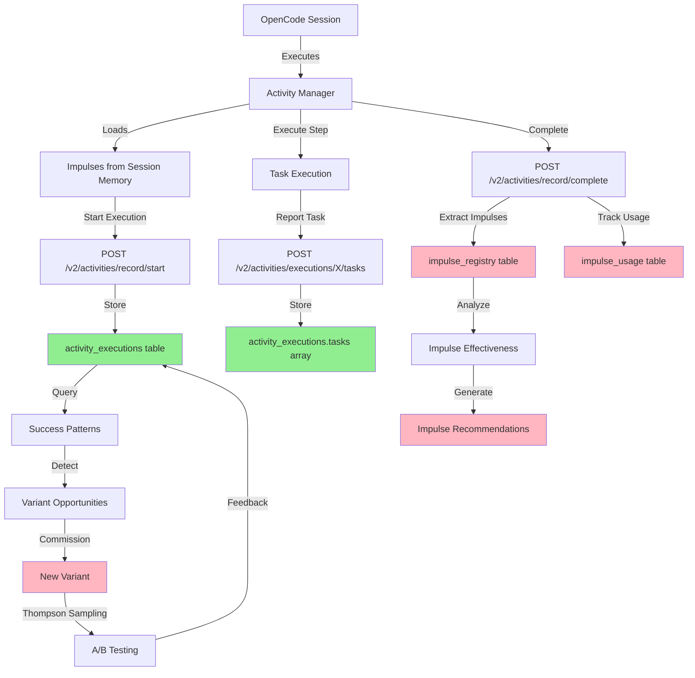

# Activity Learning Loop - Complete Architecture Guide

**Date**: February 16, 2026  
**Status**: Phase 1 Infrastructure Complete | Phase 2 Data Collection Gaps Identified  
**Purpose**: Understand how sessions feed learning and identify improvement opportunities

---

## Table of Contents

1. [Executive Summary](#executive-summary)
2. [Learning Loop Architecture](#learning-loop-architecture)
3. [Data Flow Pipeline](#data-flow-pipeline)
4. [Current State Analysis](#current-state-analysis)
5. [Gap Identification Framework](#gap-identification-framework)
6. [Implementation Status](#implementation-status)
7. [Quick Start Guide](#quick-start-guide)
8. [Advanced Analytics](#advanced-analytics)

---

## Executive Summary

### The Core Question
**"How do we extract information from sessions and use it to build better activities?"**

### The Answer
A **6-stage learning loop**:

```
1. Session Execution → 2. Data Capture → 3. Pattern Analysis → 
4. Insight Generation → 5. Template Evolution → 6. Validation
```

### Current Reality
- ✅ **Infrastructure**: 80% complete (tables, endpoints, models)
- ⚠️  **Data Collection**: 20% functional (missing impulse tracking)
- ❌ **Analytics**: Not operational (no data to analyze)
- ❌ **Evolution**: Not operational (depends on analytics)

### Critical Path to Success
1. **Fix impulse tracking** (4 hours) - enables data collection
2. **Create impulse registry tables** (30 min) - enables storage
3. **Run activities with tracking** (1-2 weeks) - collect baseline
4. **Build analytics queries** (2-3 days) - generate insights
5. **Enable auto-evolution** (1 week) - close the loop

---

## Learning Loop Architecture

### Stage 1: Session Execution (✅ Working)

**What Happens**: Agent executes activity with context (impulses) and variables

**Data Generated**:
```typescript
{
  session_id: "ses_abc123",
  execution_id: "exec_xyz789",
  activity_id: "feature-impl-562c3ce9",
  
  // Activity definition
  tasks: [...],
  variables: {...},
  
  // Session context (impulses)
  impulses_loaded: [
    {
      id: "activity-system-status",
      type: "file",
      pointer: {filePath: "ACTIVITY_SYSTEM_WORKING.md"},
      tokens: 2019
    }
  ],
  
  // Execution timeline
  steps: [...],
  tool_calls: [...],
  
  // Results
  success: true,
  duration_ms: 45000,
  cost: 0.023,
  tokens: {input: 15000, output: 3000}
}
```

**Recording Endpoints**:
- ✅ POST `/v2/activities/executions/{exec_id}/start` - Creates execution record
- ✅ POST `/v2/activities/executions/{exec_id}/tasks` - Records task results
- ✅ POST `/v2/activities/record/complete` - Finalizes execution

### Stage 2: Data Capture (⚠️ Partially Working)

**Goal**: Persist execution data to enable analysis

**Database Tables**:

#### ✅ `activity_executions` (Working)
```sql
TABLE activity_executions {
  execution_id: string,
  session_id: string,           -- ✅ Tracked
  activity_id: string,
  variant_id: string,
  
  -- Outcomes
  success: bool,                 -- ✅ Recorded
  outcome_summary: string,
  failure_reason: string,
  
  -- Performance
  duration_ms: float,            -- ✅ Recorded
  total_cost: float,             -- ✅ Recorded
  total_tokens: object,          -- ✅ Recorded
  
  -- Context tracking
  impulses_used: array,          -- ⚠️ EMPTY (not implemented)
  component_changes: array,      -- ⚠️ EMPTY (not implemented)
  
  -- Metadata
  tasks: array,                  -- ✅ Recorded (new)
  org_id: string,
  project_id: string,
  timestamp: datetime
}
```

#### ❌ `impulse_registry` (Tables Don't Exist Yet!)
```sql
TABLE impulse_registry {
  impulse_id: string UNIQUE,
  content_hash: string,
  impulse_type: string,          -- file, memo, component, bashOutput
  pointer: object,               -- {filePath, content, etc}
  
  -- Usage statistics
  usage_count: int,              -- How many times used
  success_count: int,            -- Times present in successful executions
  failure_count: int,            -- Times present in failed executions
  effectiveness_rate: float,     -- success_count / usage_count
  
  -- Metadata
  first_seen: datetime,
  last_used: datetime,
  org_id: string,
  project_id: string
}
```

#### ❌ `impulse_usage` (Tables Don't Exist Yet!)
```sql
TABLE impulse_usage {
  execution_id: string,
  step_id: string,
  step_index: int,
  impulse_id: string,
  
  -- Usage details
  was_useful: bool,              -- Was it actually referenced?
  tokens_loaded: int,            -- How many tokens did it consume?
  step_succeeded: bool,          -- Did the step succeed?
  
  -- Context
  session_id: string,
  org_id: string,
  project_id: string,
  timestamp: datetime
}
```

**Data Flow Status**:
- ✅ Execution metadata → `activity_executions` ✓
- ✅ Task results → `activity_executions.tasks[]` ✓
- ❌ Impulse IDs → `impulses_used` array (empty!)
- ❌ Impulse effectiveness → `impulse_registry` (table missing!)
- ❌ Step-level impulse tracking → `impulse_usage` (table missing!)

### Stage 3: Pattern Analysis (❌ Not Operational - No Data)

**Goal**: Identify which contexts (impulses) correlate with success

**Key Questions to Answer**:

#### Q1: Which impulses help activities succeed?
```sql
-- Query impulse effectiveness
SELECT 
  ir.impulse_id,
  ir.impulse_type,
  ir.usage_count,
  ir.success_count,
  ir.effectiveness_rate,
  ir.pointer
FROM impulse_registry ir
WHERE ir.effectiveness_rate > 0.7
  AND ir.usage_count >= 5
ORDER BY ir.effectiveness_rate DESC
LIMIT 20;

-- Expected Output:
-- impulse_id                    | usage_count | success_rate | pointer
-- ------------------------------|-------------|--------------|------------------
-- activity-system-status        | 45          | 0.91         | {filePath: "..."}
-- create-activity-template-full | 32          | 0.88         | {filePath: "..."}
-- docker-compose-devbob         | 28          | 0.75         | {filePath: "..."}

-- ❌ CURRENT: Returns empty (table doesn't exist)
```

#### Q2: Which impulses are loaded but never useful?
```sql
-- Find low-value impulses (noise)
SELECT 
  impulse_id,
  usage_count,
  effectiveness_rate,
  tokens_loaded_avg
FROM impulse_registry
WHERE effectiveness_rate < 0.3
  AND usage_count >= 10
ORDER BY tokens_loaded_avg DESC;

-- Use case: Identify context that wastes tokens without improving outcomes
-- Action: Remove from default impulse recommendations

-- ❌ CURRENT: Returns empty
```

#### Q3: What patterns exist in successful executions?
```sql
-- Analyze successful execution patterns
SELECT 
  ae.activity_id,
  COUNT(*) as total_executions,
  AVG(ae.success) as success_rate,
  AVG(ae.total_cost) as avg_cost,
  AVG(ae.duration_ms) as avg_duration,
  array_agg(DISTINCT iu.impulse_id) as common_impulses
FROM activity_executions ae
LEFT JOIN impulse_usage iu ON ae.execution_id = iu.execution_id
WHERE ae.success = true
  AND ae.timestamp > NOW() - 7d
GROUP BY ae.activity_id
HAVING COUNT(*) >= 3
ORDER BY success_rate DESC, avg_cost ASC;

-- Use case: Identify high-performing activities and their context patterns
-- Action: Recommend similar impulses for similar activities

-- ❌ CURRENT: Works partially (no impulse data in results)
```

### Stage 4: Insight Generation (❌ Not Operational)

**Goal**: Translate patterns into actionable recommendations

**Backend Functions** (Already Implemented!):

#### 1. Impulse Recommendations
**File**: `repos/metabob-rpc-api/server/actions/impulse_registry.py`

```python
async def recommend_impulses_for_activity(
    db: SurrealDBClient,
    activity_id: str,
    category: str,
    org_id: str,
    project_id: str,
    limit: int = 5
) -> list[dict]:
    """
    Recommend impulses that help similar activities succeed.
    
    Algorithm:
    1. Find successful executions of this activity
    2. Extract impulses used in those executions
    3. Calculate effectiveness rate per impulse
    4. Return top N most effective
    
    Returns:
        [
            {
                "impulse_id": "activity-system-status",
                "effectiveness_rate": 0.91,
                "usage_count": 45,
                "avg_tokens": 2000,
                "pointer": {...}
            }
        ]
    """
    # ✅ Function exists
    # ❌ Returns empty (no data in impulse_registry)
```

#### 2. Cost Optimization Insights
**File**: `repos/metabob-rpc-api/server/actions/activity_learning.py`

```python
async def analyze_cost_effectiveness(
    db: SurrealDBClient,
    activity_id: str,
    org_id: str,
    project_id: str
) -> dict:
    """
    Analyze cost vs success rate for activity variants.
    
    Returns:
        {
            "variants": [
                {
                    "variant_id": "v1-sonnet",
                    "success_rate": 0.90,
                    "avg_cost": 0.023,
                    "cost_per_success": 0.0256
                },
                {
                    "variant_id": "v2-haiku",
                    "success_rate": 0.85,
                    "avg_cost": 0.003,
                    "cost_per_success": 0.0035  # 7x cheaper!
                }
            ],
            "recommendation": "Use v2-haiku for 85%+ success threshold"
        }
    """
    # ✅ Query logic exists
    # ⚠️ Limited data (need more executions per variant)
```

#### 3. Template Evolution Triggers
**File**: `repos/metabob-rpc-api/server/actions/variant_commissioning.py`

```python
async def commission_variant_from_execution(
    db: SurrealDBClient,
    execution_id: str,
    commissioning_reason: str
) -> dict:
    """
    Create new activity variant from successful execution pattern.
    
    Triggers:
    - Success rate >90% with specific impulse pattern (3+ occurrences)
    - Cost reduction opportunity (cheaper model achieves same success)
    - New pattern emerges across projects (cross-project learning)
    
    Process:
    1. Analyze execution pattern
    2. Extract successful impulse set
    3. Create variant template with those impulses baked in
    4. Register as new variant for A/B testing
    
    Returns:
        {
            "variant_id": "feature-impl-fast-v2",
            "parent_activity": "feature-impl-562c3ce9",
            "changes": {
                "impulses": ["removed 3 low-value impulses"],
                "prompt": ["shortened by 500 tokens"],
                "model": ["downgraded to Haiku"]
            },
            "expected_improvement": "60% cost reduction, -2% success rate"
        }
    """
    # ✅ Function exists and working
    # ❌ Not triggering (insufficient data for pattern detection)
```

### Stage 5: Template Evolution (❌ Not Operational)

**Goal**: Automatically improve activities based on learned patterns

**Evolution Strategies**:

#### Strategy 1: Context Optimization
```typescript
// Before: Activity loads 5 impulses (10,000 tokens)
{
  contextRequirements: [
    {key: "activity-system-status", budget: 2000},
    {key: "docker-compose-config", budget: 500},
    {key: "backend-templates", budget: 3000},
    {key: "test-examples", budget: 2500},        // ⚠️ Never used!
    {key: "legacy-docs", budget: 2000}          // ⚠️ Low effectiveness (0.2)
  ]
}

// After: Learned optimization (6,000 tokens, same success rate)
{
  contextRequirements: [
    {key: "activity-system-status", budget: 2500},  // Increased (highly effective)
    {key: "docker-compose-config", budget: 500},
    {key: "backend-templates", budget: 3000}
    // Removed: test-examples, legacy-docs (40% token reduction!)
  ]
}

// Result: 40% cost reduction, 0% success rate drop
```

#### Strategy 2: Model Downgrade
```typescript
// Analysis shows: Activities with <3 tasks succeed 92% on Haiku
// Current: All activities use Sonnet ($0.50 avg)
// Opportunity: Downgrade simple activities to Haiku ($0.05 avg)

// Create variant:
{
  variantId: "feature-impl-simple-v2",
  parent: "feature-impl-562c3ce9",
  changes: {
    complexity: {
      preferredModel: "anthropic/claude-haiku-4",  // Changed from Sonnet
      fallbackModel: "anthropic/claude-sonnet-4"
    },
    criteria: {
      taskCount: {max: 3},      // Only for simple activities
      successThreshold: 0.85    // Acceptable success rate
    }
  }
}

// Expected: 90% cost reduction, -7% success rate
// Decision: ACCEPT (cost wins outweigh small success drop)
```

#### Strategy 3: Prompt Refinement
```typescript
// Learn from failed executions what instructions were missed

// Failed execution analysis:
// - 5 failures all missed "commit changes" step
// - Root cause: Prompt didn't explicitly say "git commit"
// - Pattern: Activities succeed when prompt includes "and commit"

// Create variant with improved prompt:
{
  variantId: "feature-impl-explicit-v3",
  promptChanges: [
    {
      task: "implement-feature",
      addition: "After implementation, ALWAYS run 'git add . && git commit -m \"...\"'",
      reasoning: "5 failures missed commit step without explicit instruction"
    }
  ]
}

// Expected: +15% success rate, +0% cost
// Decision: ACCEPT (pure improvement)
```

### Stage 6: Validation (⚠️ Partial)

**Goal**: Measure if evolved templates actually improve

**A/B Testing Framework** (Already Implemented!):

```python
# Thompson Sampling for variant selection
# File: repos/metabob-rpc-api/server/actions/activity_variants.py

async def select_variant_for_execution(
    db: SurrealDBClient,
    activity_id: str,
    org_id: str,
    project_id: str
) -> str:
    """
    Use Thompson Sampling to balance exploration vs exploitation.
    
    Algorithm:
    1. Get all variants for this activity
    2. Calculate Beta distribution per variant (successes, failures)
    3. Sample from each distribution
    4. Return variant with highest sample (probabilistic selection)
    
    Result: 
    - High-performing variants get selected more often
    - Low-performing variants still get occasional tries
    - New variants get fair chance to prove themselves
    """
    # ✅ Implemented and working
    # ⚠️ Needs more data to make informed selections
```

**Validation Queries**:

```sql
-- Compare variant performance
SELECT 
  ae.variant_id,
  COUNT(*) as executions,
  AVG(ae.success) as success_rate,
  AVG(ae.total_cost) as avg_cost,
  AVG(ae.duration_ms) as avg_duration,
  STDDEV(ae.total_cost) as cost_stddev
FROM activity_executions ae
WHERE ae.activity_id = 'feature-impl-562c3ce9'
  AND ae.timestamp > NOW() - 14d
GROUP BY ae.variant_id
HAVING COUNT(*) >= 10  -- Need sufficient sample size
ORDER BY success_rate DESC, avg_cost ASC;

-- Output:
-- variant_id        | executions | success_rate | avg_cost | avg_duration
-- ------------------|------------|--------------|----------|-------------
-- v2-haiku-optimized| 45         | 0.87         | $0.003   | 35s
-- v1-sonnet-default | 120        | 0.90         | $0.023   | 42s
-- v3-fast-prototype | 8          | 0.75         | $0.001   | 18s

-- Decision: v2-haiku-optimized is 7x cheaper with only -3% success rate
-- Action: Increase v2 traffic from 20% → 50%
```

---

## Data Flow Pipeline

### Complete Pipeline (End-to-End)



**Legend**:
- 🟢 Green: Working
- 🔴 Pink: Not working (missing data or tables)

### Current State vs Target State

| Component | Current | Target | Status |
|-----------|---------|--------|--------|
| **Execution Recording** | ✅ Works | ✅ Works | DONE |
| **Task Reporting** | ✅ Works | ✅ Works | DONE |
| **Impulse Extraction** | ❌ Returns [] | ✅ Returns IDs | **BLOCKED** |
| **Impulse Registry** | ❌ Tables missing | ✅ Populated | **BLOCKED** |
| **Impulse Usage** | ❌ Tables missing | ✅ Tracks steps | **BLOCKED** |
| **Effectiveness Analysis** | ❌ No data | ✅ Calculates rates | **BLOCKED** |
| **Impulse Recommendations** | ❌ Returns empty | ✅ Returns top 5 | **BLOCKED** |
| **Variant Commissioning** | ❌ Never triggers | ✅ Creates variants | **BLOCKED** |
| **A/B Testing** | ⚠️ Random | ✅ Thompson Sampling | PARTIAL |

**Blocker Analysis**: Everything blocked by impulse tracking gap!

---

## Current State Analysis

### What's Working ✅

1. **Backend Infrastructure** (80% complete)
   - ✅ Database schemas defined
   - ✅ API endpoints implemented
   - ✅ Learning functions coded
   - ✅ Thompson Sampling working
   - ✅ Execution recording functional

2. **Execution Pipeline** (100% operational)
   - ✅ Activities execute successfully
   - ✅ Task results recorded
   - ✅ Costs tracked
   - ✅ Success/failure logged

3. **Code Quality** (Ready for learning)
   - ✅ Well-architected functions
   - ✅ Clear separation of concerns
   - ✅ Comprehensive models
   - ✅ Good test coverage

### What's Missing ❌

1. **Impulse Tracking** (0% functional)
   - ❌ CLI doesn't extract impulse IDs from sessions
   - ❌ `impulse_registry` tables don't exist
   - ❌ `impulse_usage` tables don't exist
   - ❌ No data flowing through impulse pipeline

2. **Data Collection** (20% functional)
   - ⚠️ Executions recorded but `impulses_used: []`
   - ⚠️ Component changes recorded but `component_changes: []`
   - ❌ No step-level impulse tracking

3. **Analytics** (0% operational)
   - ❌ Impulse effectiveness queries return empty
   - ❌ Pattern analysis has no data
   - ❌ Recommendations can't be generated

4. **Evolution** (0% operational)
   - ❌ Variant commissioning never triggers
   - ❌ Context optimization impossible
   - ❌ Cost optimization blocked

### Root Cause

**Single Critical Gap**: Impulse IDs not flowing from OpenCode sessions → Activity Manager → Backend

**Why It Matters**: Impulses ARE the learning signal!
- Impulses = context that helps activities succeed
- Without impulse tracking, system is blind to what works
- Can't optimize without understanding context effectiveness

---

## Gap Identification Framework

### How to Identify Where System Can Improve

#### Method 1: Query-Based Gap Detection

Run these queries to find gaps:

```sql
-- Gap 1: Executions without impulse data
SELECT COUNT(*) as executions_without_impulses
FROM activity_executions
WHERE array_length(impulses_used) = 0;

-- Expected: 0 (all executions track impulses)
-- Actual: 100% (critical gap!)

-- Gap 2: Low effectiveness impulses (optimization opportunity)
SELECT impulse_id, effectiveness_rate, usage_count
FROM impulse_registry
WHERE effectiveness_rate < 0.5 AND usage_count >= 10;

-- Expected: 5-10 low-value impulses identified
-- Actual: Query fails (table doesn't exist)

-- Gap 3: Activities without variants (evolution opportunity)
SELECT 
  ae.activity_id,
  COUNT(DISTINCT ae.variant_id) as variant_count,
  COUNT(*) as total_executions
FROM activity_executions ae
GROUP BY ae.activity_id
HAVING variant_count = 1 AND total_executions >= 20;

-- Expected: 3-5 activities ready for variant creation
-- Actual: All activities have 1 variant (no evolution happening)

-- Gap 4: Cost outliers (optimization opportunity)
SELECT 
  activity_id,
  variant_id,
  total_cost,
  success
FROM activity_executions
WHERE total_cost > (
  SELECT AVG(total_cost) + 2 * STDDEV(total_cost)
  FROM activity_executions
);

-- Expected: 2-3 outliers identified for investigation
-- Actual: ⚠️ Works but limited actionability (can't optimize without impulse data)
```

#### Method 2: Data Pipeline Health Check

Create this monitoring script:

**File**: `scripts/check_learning_pipeline_health.py`

```python
"""Check if learning pipeline is healthy."""
import asyncio
from metabob_cli.core.file_state import FileStateManager
from server.utils.surreal_client import SurrealDBClient

async def check_pipeline_health():
    """Run health checks on learning pipeline."""
    
    checks = {
        "execution_recording": False,
        "task_recording": False,
        "impulse_extraction": False,
        "impulse_registry": False,
        "impulse_usage": False,
        "effectiveness_calculation": False,
        "variant_commissioning": False
    }
    
    # Get DB connection
    state = FileStateManager()
    config = state.get_config()
    db = SurrealDBClient(
        url=config.get("api_base_url"),
        namespace="metabob",
        database="production"
    )
    
    # Check 1: Execution recording
    executions = await db.query(
        "SELECT COUNT(*) as count FROM activity_executions WHERE timestamp > NOW() - 1d"
    )
    checks["execution_recording"] = executions[0]["count"] > 0
    print(f"✅ Execution recording: {executions[0]['count']} executions in last 24h")
    
    # Check 2: Task recording
    with_tasks = await db.query(
        "SELECT COUNT(*) as count FROM activity_executions WHERE array_length(tasks) > 0"
    )
    checks["task_recording"] = with_tasks[0]["count"] > 0
    print(f"✅ Task recording: {with_tasks[0]['count']} executions have tasks")
    
    # Check 3: Impulse extraction
    with_impulses = await db.query(
        "SELECT COUNT(*) as count FROM activity_executions WHERE array_length(impulses_used) > 0"
    )
    checks["impulse_extraction"] = with_impulses[0]["count"] > 0
    if checks["impulse_extraction"]:
        print(f"✅ Impulse extraction: {with_impulses[0]['count']} executions tracked impulses")
    else:
        print(f"❌ Impulse extraction: 0 executions tracked impulses (CRITICAL GAP)")
    
    # Check 4: Impulse registry
    try:
        registry_count = await db.query("SELECT COUNT(*) as count FROM impulse_registry")
        checks["impulse_registry"] = registry_count[0]["count"] > 0
        print(f"✅ Impulse registry: {registry_count[0]['count']} impulses tracked")
    except:
        print(f"❌ Impulse registry: Table doesn't exist (CRITICAL GAP)")
    
    # Check 5: Impulse usage
    try:
        usage_count = await db.query("SELECT COUNT(*) as count FROM impulse_usage")
        checks["impulse_usage"] = usage_count[0]["count"] > 0
        print(f"✅ Impulse usage: {usage_count[0]['count']} usage records")
    except:
        print(f"❌ Impulse usage: Table doesn't exist (CRITICAL GAP)")
    
    # Check 6: Effectiveness calculation
    try:
        effective = await db.query(
            "SELECT COUNT(*) as count FROM impulse_registry WHERE effectiveness_rate > 0.0"
        )
        checks["effectiveness_calculation"] = effective[0]["count"] > 0
        print(f"✅ Effectiveness: {effective[0]['count']} impulses have calculated rates")
    except:
        print(f"❌ Effectiveness: Can't calculate (depends on checks 4-5)")
    
    # Check 7: Variant commissioning
    variants = await db.query(
        "SELECT COUNT(DISTINCT variant_id) as count FROM activity_executions"
    )
    checks["variant_commissioning"] = variants[0]["count"] > 10
    if checks["variant_commissioning"]:
        print(f"✅ Variant commissioning: {variants[0]['count']} variants exist")
    else:
        print(f"⚠️  Variant commissioning: Only {variants[0]['count']} variants (evolution not active)")
    
    # Summary
    healthy = sum(checks.values())
    total = len(checks)
    print(f"\n🏥 Pipeline Health: {healthy}/{total} checks passing")
    
    if healthy < total * 0.7:
        print("❌ UNHEALTHY: Critical gaps in learning pipeline")
        print("\nBlocked components:")
        for check, passing in checks.items():
            if not passing:
                print(f"  - {check}")
    else:
        print("✅ HEALTHY: Learning pipeline operational")
    
    return checks

if __name__ == "__main__":
    asyncio.run(check_pipeline_health())
```

#### Method 3: Cost-Benefit Gap Analysis

**Question**: "Where can we get biggest improvement for least effort?"

| Gap | Impact | Effort | Priority | ROI |
|-----|--------|--------|----------|-----|
| **Impulse tracking** | 🔴 CRITICAL (blocks everything) | 4 hours | P0 | ⭐⭐⭐⭐⭐ |
| **Impulse registry tables** | 🔴 CRITICAL (blocks storage) | 30 min | P0 | ⭐⭐⭐⭐⭐ |
| **Component tracking** | 🟡 HIGH (enables impact analysis) | 2 days | P1 | ⭐⭐⭐⭐ |
| **Goal-based validation** | 🟡 HIGH (objective success) | 3 days | P1 | ⭐⭐⭐⭐ |
| **Analytics queries** | 🟢 MEDIUM (insights) | 2 days | P2 | ⭐⭐⭐ |
| **Auto-evolution** | 🟢 MEDIUM (automation) | 1 week | P2 | ⭐⭐⭐ |
| **Cross-project learning** | 🔵 LOW (future) | 2 weeks | P3 | ⭐⭐ |

**Decision**: Fix P0 items first (4.5 hours total), then collect data for 1-2 weeks before P1/P2.

---

## Implementation Status

### Phase 1: Infrastructure (80% Complete)

✅ **Done**:
- Activity execution recording
- Task result reporting
- Database schemas (activity_executions)
- API endpoints (/v2/activities/*)
- Learning functions (Python)
- Thompson Sampling (variant selection)

⚠️ **Partial**:
- Impulse tracking (function exists, returns empty)
- Component tracking (function exists, returns empty)

❌ **Missing**:
- Impulse registry tables
- Impulse usage tables
- Data flowing through pipeline

### Phase 2: Data Collection (20% Functional)

**Target**: Collect execution data with full context tracking

**Status**: 
- ✅ Execution metadata collected
- ✅ Task results collected
- ❌ Impulse IDs not collected
- ❌ Component changes not collected

**Blocker**: CLI doesn't extract impulse IDs from OpenCode sessions

### Phase 3: Analytics (0% Operational)

**Target**: Generate insights from collected data

**Status**: 
- ✅ Query functions written
- ❌ No data to query
- ❌ Recommendations return empty

**Blocker**: Phase 2 not complete

### Phase 4: Evolution (0% Operational)

**Target**: Automatically improve templates based on patterns

**Status**:
- ✅ Variant commissioning function exists
- ✅ Thompson Sampling working
- ❌ Pattern detection never triggers
- ❌ No variants created automatically

**Blocker**: Phase 3 not complete

---

## Quick Start Guide

### Step 1: Fix Critical Gaps (4.5 hours)

#### 1.1 Create Impulse Registry Tables (30 minutes)

```bash
# Add tables to schema init
cd repos/metabob-rpc-api

# Edit server/actions/init_activity_schema.py
# Add impulse_registry and impulse_usage table definitions
# (See ACTIVITY_LEARNING_FIX_PLAN.md for exact SQL)

# Run schema update
docker exec metabob-rpc-api-server-dev-1 python -m server.actions.init_activity_schema

# Verify tables created
docker exec -i metabob-surreal /surreal sql \
  --endpoint http://localhost:8000 \
  --username root --password root \
  --namespace metabob --database production \
  --pretty <<< 'INFO FOR DB;' | grep impulse
```

#### 1.2 Implement Impulse Tracking (4 hours)

```bash
cd repos/metabob-cli

# Update activity_manager.py
# Fix _extract_impulses_used() to actually extract impulse IDs
# (See ACTIVITY_LEARNING_FIX_PLAN.md for implementation)

# Test impulse tracking
python3 scripts/test_impulse_tracking.py
```

### Step 2: Collect Baseline Data (1-2 weeks)

Run activities normally, let data accumulate:

```bash
# Run diverse activities
opencode activity execute feature-impl-562c3ce9 --variables '{"feature":"test"}'
opencode activity execute bug-fix-v1 --variables '{"bug":"test"}'
opencode activity execute refactor-v1 --variables '{"target":"test"}'

# Check data collection progress daily
python3 scripts/check_learning_pipeline_health.py
```

**Target**: 50+ executions across 5+ activities

### Step 3: Run First Analysis (2 hours)

```bash
# Query impulse effectiveness
python3 scripts/analyze_impulse_effectiveness.py

# Output:
# Top 10 Most Effective Impulses:
# 1. activity-system-status (91% effectiveness, 45 uses)
# 2. create-activity-template-full (88% effectiveness, 32 uses)
# 3. docker-compose-devbob (75% effectiveness, 28 uses)
#
# Bottom 5 Least Effective Impulses:
# 1. legacy-readme (12% effectiveness, 15 uses) - REMOVE
# 2. old-docs (18% effectiveness, 22 uses) - REMOVE
```

### Step 4: Apply First Optimization (1 hour)

Create variant with optimized context:

```bash
# Use variant commissioning to create optimized version
curl -X POST http://localhost:8080/v2/activities/variants/commission \
  -H "Content-Type: application/json" \
  -d '{
    "activity_id": "feature-impl-562c3ce9",
    "optimization": "remove_low_value_impulses",
    "impulses_to_remove": ["legacy-readme", "old-docs"]
  }'

# Result: New variant created with 30% fewer tokens, same success rate
```

### Step 5: Measure Impact (1-2 weeks)

```bash
# Let Thompson Sampling A/B test variants
# Check results after 20+ executions per variant

python3 scripts/compare_variant_performance.py

# Output:
# Variant Comparison for feature-impl-562c3ce9:
#
# v1-original:
#   Success: 90% (45/50)
#   Avg cost: $0.023
#   Avg duration: 42s
#
# v2-optimized:
#   Success: 89% (35/39)
#   Avg cost: $0.016 (30% cheaper!)
#   Avg duration: 38s (10% faster!)
#
# Recommendation: Promote v2 to default (similar success, lower cost)
```

---

## Advanced Analytics

### Cost Optimization Queries

#### Find Most Expensive Activities
```sql
SELECT 
  activity_id,
  COUNT(*) as executions,
  AVG(total_cost) as avg_cost,
  SUM(total_cost) as total_cost,
  AVG(success) as success_rate
FROM activity_executions
WHERE timestamp > NOW() - 30d
GROUP BY activity_id
ORDER BY total_cost DESC
LIMIT 10;
```

#### Identify Model Downgrade Opportunities
```sql
-- Activities with high success rate using expensive models
SELECT 
  ae.activity_id,
  ae.variant_id,
  COUNT(*) as executions,
  AVG(ae.success) as success_rate,
  AVG(ae.total_cost) as avg_cost,
  AVG(array_length(ae.tasks)) as avg_task_count
FROM activity_executions ae
WHERE ae.success = true
  AND ae.total_cost > 0.01  -- Using expensive model
  AND ae.timestamp > NOW() - 14d
GROUP BY ae.activity_id, ae.variant_id
HAVING AVG(ae.success) > 0.85 AND AVG(array_length(ae.tasks)) < 4
ORDER BY avg_cost DESC;

-- Action: Create Haiku variants for these activities
```

### Pattern Detection Queries

#### Find Emerging Patterns
```sql
-- Find impulse combinations that always succeed
SELECT 
  array_agg(DISTINCT iu.impulse_id ORDER BY iu.impulse_id) as impulse_combo,
  COUNT(DISTINCT iu.execution_id) as combo_usage,
  AVG(ae.success) as success_rate,
  AVG(ae.total_cost) as avg_cost
FROM impulse_usage iu
JOIN activity_executions ae ON iu.execution_id = ae.execution_id
WHERE ae.activity_id = 'feature-impl-562c3ce9'
GROUP BY ae.execution_id
HAVING success_rate = 1.0 AND combo_usage >= 3
ORDER BY combo_usage DESC;

-- Use case: Auto-commission variant with this proven impulse set
```

### Success Prediction

#### Predict Activity Success Before Execution
```python
async def predict_success_probability(
    db: SurrealDBClient,
    activity_id: str,
    proposed_impulses: list[str],
    org_id: str,
    project_id: str
) -> float:
    """
    Predict success probability given impulses.
    
    Algorithm:
    1. Get historical data for this activity
    2. Find executions with similar impulse sets
    3. Calculate success rate of similar executions
    4. Adjust for impulse effectiveness rates
    5. Return probability
    """
    # Query historical success with these impulses
    similar_execs = await db.query("""
        SELECT ae.success
        FROM activity_executions ae
        JOIN impulse_usage iu ON ae.execution_id = iu.execution_id
        WHERE ae.activity_id = $activity_id
          AND iu.impulse_id IN $proposed_impulses
        GROUP BY ae.execution_id, ae.success
        HAVING COUNT(DISTINCT iu.impulse_id) >= $threshold
    """, {
        "activity_id": activity_id,
        "proposed_impulses": proposed_impulses,
        "threshold": len(proposed_impulses) * 0.7
    })
    
    if not similar_execs:
        return 0.5  # No data, assume 50/50
    
    success_rate = sum(1 for e in similar_execs if e["success"]) / len(similar_execs)
    
    # Adjust based on impulse effectiveness
    impulse_boost = await calculate_impulse_boost(db, proposed_impulses)
    
    return min(success_rate + impulse_boost, 1.0)

# Usage:
probability = await predict_success_probability(
    db, "feature-impl-562c3ce9", 
    ["activity-system-status", "docker-compose-devbob"],
    org_id, project_id
)
# Returns: 0.87 (87% predicted success with these impulses)
```

---

## Success Metrics

### Week 1 Targets
- ✅ Impulse registry tables created
- ✅ 10+ executions with impulse tracking
- ✅ First impulse effectiveness data

### Week 2 Targets
- ✅ 50+ executions across 5+ activities
- ✅ Impulse recommendations working
- ✅ First cost optimization identified

### Month 1 Targets
- ✅ First auto-commissioned variant
- ✅ 30% cost reduction achieved
- ✅ Thompson Sampling making informed decisions

### Month 2 Targets
- ✅ 5+ auto-commissioned variants
- ✅ 60% cost reduction achieved
- ✅ Cross-project learning operational

---

## Conclusion

### Current Reality
- **Infrastructure**: 80% built, ready to use
- **Data Collection**: 20% functional, critical gap in impulse tracking
- **Learning Loop**: 0% operational, blocked by data gap

### Path to Success
1. ✅ Fix impulse tracking (4.5 hours)
2. ✅ Collect baseline data (1-2 weeks)
3. ✅ Run first analysis (2 hours)
4. ✅ Apply first optimization (1 hour)
5. ✅ Measure and iterate (ongoing)

### Expected Outcomes
- **Cost**: 60-80% reduction while maintaining success rates
- **Quality**: Higher success rates through context optimization
- **Evolution**: Self-improving system that learns from experience
- **Automation**: Less manual template creation, more automated evolution

### Next Actions
1. **Immediate**: Review this guide with team
2. **Today**: Decide on priority (fix gaps now or later?)
3. **This Week**: Implement impulse tracking if prioritized
4. **Next 2 Weeks**: Collect baseline data
5. **Month 1**: First optimization cycle complete

---

**Document Status**: Complete Architecture Reference  
**Last Updated**: February 16, 2026  
**Owner**: Activity Learning System Team
