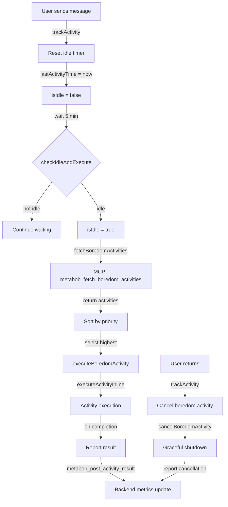
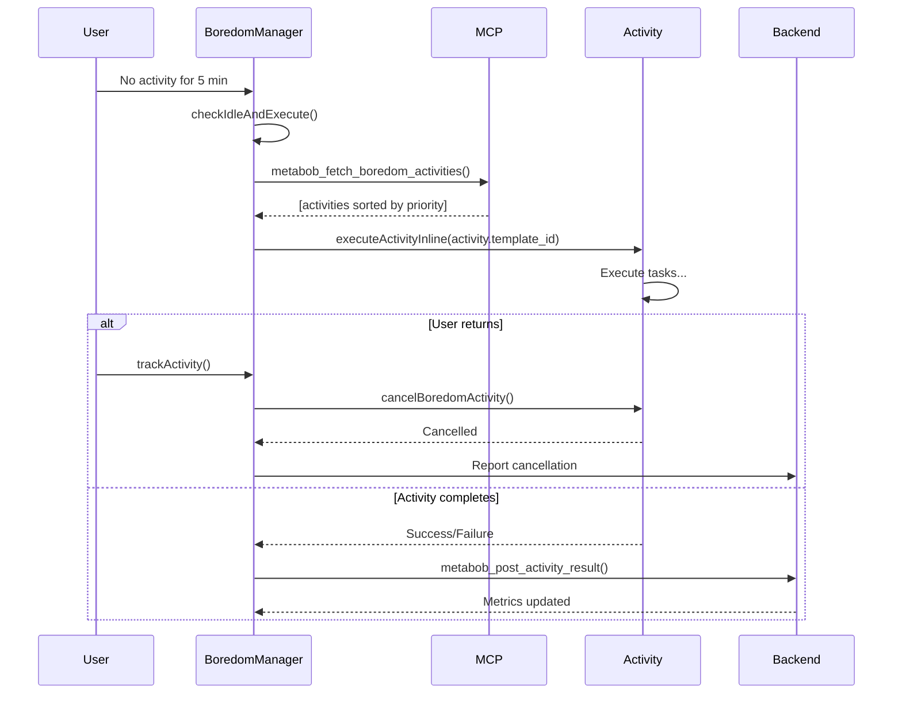

# BoredomManager Implementation Path

**Feature:** BoredomManager idle detection and auto-execution system  
**Purpose:** Detect when OpenCode is idle (5+ min no user activity), fetch prioritized work from backend, auto-execute highest priority boredom activity, cancel on user return  
**Date:** 2026-02-21  
**Status:** Design Complete - Ready for Implementation

---

## Entry Points

### Entry Point 1: Session Creation (Initial Setup)
```
File: repos/metabob-opencode/packages/opencode/src/session/index.ts:97-100
Function: Session.Event.Created
Input Type: z.object({ sessionID: Identifier.schema("session") })
Trigger: Bus.Event (session.created)
```

**Integration Point:** Register BoredomManager when session is created
- Hook into `Session.Event.Created` bus event
- Create `BoredomManager` instance for session
- Start monitoring user activity

### Entry Point 2: User Message Events (Activity Detection)
```
File: repos/metabob-opencode/packages/opencode/src/session/prompt.ts:372
Function: SessionPrompt.createUserMessage()
Input Type: SessionPrompt.PromptInput
Trigger: User sends message to session
```

**Integration Point:** Track user activity
- Hook into `SessionPrompt.createUserMessage()` call
- Reset idle timer on every user message
- Update last activity timestamp

### Entry Point 3: Session Attachment (CLI Interaction)
```
File: repos/metabob-opencode/packages/opencode/src/session/index.ts:522
Function: Session.command()
Input Type: { sessionID: string }
Trigger: User attaches to session via CLI
```

**Integration Point:** Track CLI activity
- Hook into `Session.command()` call
- Reset idle timer on session attachment
- Update last activity timestamp

---

## Core Components

### Component 1: BoredomManager Class

**Location:** `repos/metabob-opencode/packages/opencode/src/session/boredom-manager.ts` (NEW FILE)

**Class Structure:**
```typescript
import { Log } from "@/util/log"
import { MCP } from "../mcp"
import { Session } from "./index"
import { Activity } from "./activity"
import { TemplateRepository } from "./template-library"

export namespace BoredomManager {
  const log = Log.create({ service: "boredom-manager" })

  // Configuration
  const IDLE_THRESHOLD_MS = 5 * 60 * 1000  // 5 minutes
  const BOREDOM_ACTIVITY_POLL_MS = 60 * 1000  // Check every minute after idle
  
  // Session tracking
  const sessionManagers = new Map<string, ManagerInstance>()
  
  interface ManagerInstance {
    sessionID: string
    lastActivityTime: number
    boredomTimer?: NodeJS.Timeout
    currentActivity?: Activity.Info
    isIdle: boolean
  }
  
  /**
   * Register a session for boredom monitoring
   */
  export function startMonitoring(sessionID: string): void
  
  /**
   * Track user activity (resets idle timer)
   */
  export function trackActivity(sessionID: string): void
  
  /**
   * Stop monitoring a session (cleanup on session close)
   */
  export function stopMonitoring(sessionID: string): void
  
  /**
   * Check if session is idle and trigger boredom activity if needed
   */
  async function checkIdleAndExecute(sessionID: string): Promise<void>
  
  /**
   * Fetch boredom activities from backend
   */
  async function fetchBoredomActivities(sessionID: string): Promise<BoredomActivity[]>
  
  /**
   * Execute a boredom activity in the background
   */
  async function executeBoredomActivity(
    sessionID: string,
    activity: BoredomActivity
  ): Promise<void>
  
  /**
   * Cancel current boredom activity (user returned)
   */
  export function cancelBoredomActivity(sessionID: string): void
}
```

**Key Methods:**

1. **startMonitoring(sessionID: string)**
   - Create `ManagerInstance` for session
   - Set up periodic idle check timer
   - Register in `sessionManagers` map

2. **trackActivity(sessionID: string)**
   - Update `lastActivityTime` to `Date.now()`
   - If `isIdle`, cancel current boredom activity
   - Set `isIdle = false`
   - Reset boredom timer

3. **checkIdleAndExecute(sessionID: string)**
   - Calculate idle time: `Date.now() - lastActivityTime`
   - If idle time > `IDLE_THRESHOLD_MS` and not already `isIdle`:
     - Set `isIdle = true`
     - Fetch boredom activities
     - Execute highest priority activity
   - If already executing, check if activity completed

4. **fetchBoredomActivities(sessionID: string)**
   - Get MCP client via `MCP.getClient("metabob")`
   - Call `metabob_fetch_boredom_activities` tool:
     ```typescript
     const result = await mcpClient.callTool("metabob_fetch_boredom_activities", {
       max_activities: 5,
       priority_threshold: 0.5,
       exclude_recent_hours: 24
     })
     ```
   - Parse response and return `BoredomActivity[]`

5. **executeBoredomActivity(sessionID: string, activity: BoredomActivity)**
   - Load activity template via `TemplateRepository.get(activity.template_id)`
   - Execute activity inline via `executeActivityInline()`:
     ```typescript
     const result = await executeActivityInline(
       activity.template_id,
       { /* extract variables from activity.metrics */ },
       sessionID,
       `Boredom activity: ${activity.reason}`,
       "boredom-system"
     )
     ```
   - Store `activityId` in `currentActivity`
   - Report result back to backend via `metabob_post_activity_result`

6. **cancelBoredomActivity(sessionID: string)**
   - If `currentActivity` exists:
     - Trigger cancellation signal (AbortController)
     - Wait for graceful shutdown (timeout: 10s)
     - Report cancellation to backend
     - Clear `currentActivity`

---

## Data Flow

### Flow 1: Idle Detection and Execution



### Flow 2: Activity Execution Lifecycle



---

## Integration Points

### Integration 1: Session Lifecycle

**File:** `repos/metabob-opencode/packages/opencode/src/session/index.ts`

**Hook Location:** `Session.Event.Created` bus event listener

**Implementation:**
```typescript
// Add to Session namespace
Session.Event.Created.subscribe(async (event) => {
  const { sessionID } = event
  
  // Start boredom monitoring for new session
  const { BoredomManager } = await import("./boredom-manager")
  BoredomManager.startMonitoring(sessionID)
})
```

### Integration 2: User Activity Tracking

**File:** `repos/metabob-opencode/packages/opencode/src/session/prompt.ts`

**Hook Location:** `SessionPrompt.prompt()` function (line ~369)

**Implementation:**
```typescript
export async function prompt(input: PromptInput): Promise<MessageV2.Schema> {
  // Track user activity
  const { BoredomManager } = await import("./boredom-manager")
  BoredomManager.trackActivity(input.sessionID)
  
  // ... existing code ...
}
```

### Integration 3: Session Cleanup

**File:** `repos/metabob-opencode/packages/opencode/src/session/index.ts`

**Hook Location:** Session removal/cleanup logic

**Implementation:**
```typescript
// When session is removed
const { BoredomManager } = await import("./boredom-manager")
BoredomManager.stopMonitoring(sessionID)
```

---

## Data Types

### BoredomActivity (from backend)
```typescript
interface BoredomActivity {
  activity_type: "improve-template" | "debug-failures" | "optimize-performance"
  priority: number  // 0.0-1.5
  template_id: string
  improvement_gradient: number  // 0.0-1.0
  reason: string
  estimated_effort: string  // e.g., "5-15 min"
  metrics: {
    success_rate: number
    avg_cost: number
    avg_duration_ms: number
    execution_count: number
    failure_patterns: Array<{
      task_id: string
      count: number
      error_category: string
      last_seen: string
    }>
    performance_trends: {
      duration: "improving" | "stable" | "degrading"
      cost: "improving" | "stable" | "degrading"
      success_rate: "improving" | "stable" | "degrading"
    }
    last_execution: {
      activity_id: string
      timestamp: string
      success: boolean
      duration_ms: number
      cost: number
      error?: string
    }
  }
}
```

---

## Cancellation Mechanism

### AbortController Integration

**Current State:**
- `executeActivityInline()` does NOT support AbortSignal
- `TemplateExecutor` has `abortSignal` parameter but only in trailblazing mode

**Required Changes:**

1. **Add AbortSignal to executeActivityInline**
   ```typescript
   // File: repos/metabob-opencode/packages/opencode/src/tool/activity.ts
   export async function executeActivityInline(
     templateId: string,
     variables: Record<string, unknown>,
     parentSessionID: string,
     reason: string,
     parentMessageID: string,
     abortSignal?: AbortSignal  // NEW PARAMETER
   ): Promise<{
     impulses: Record<string, ActivityTemplate.Impulse.Schema>
     success: boolean
     activityId: string
     cancelled?: boolean  // NEW FIELD
   }>
   ```

2. **Pass AbortSignal through execution chain**
   - `executeActivityInline` → `TemplateExecutor.execute`
   - Check `abortSignal.aborted` before each task
   - Throw cancellation error if aborted

3. **BoredomManager uses AbortController**
   ```typescript
   interface ManagerInstance {
     sessionID: string
     lastActivityTime: number
     boredomTimer?: NodeJS.Timeout
     currentActivity?: {
       activityId: string
       abortController: AbortController
     }
     isIdle: boolean
   }
   
   export function cancelBoredomActivity(sessionID: string): void {
     const manager = sessionManagers.get(sessionID)
     if (manager?.currentActivity) {
       manager.currentActivity.abortController.abort()
       manager.currentActivity = undefined
     }
   }
   ```

---

## Testing Strategy

### Unit Tests

**File:** `repos/metabob-opencode/packages/opencode/test/session/boredom-manager.test.ts` (NEW)

1. **test_idle_detection**
   - Create session, wait 5+ min
   - Verify `isIdle` becomes true

2. **test_activity_reset**
   - Session idle → user sends message
   - Verify idle timer resets

3. **test_fetch_boredom_activities**
   - Mock MCP client
   - Call `fetchBoredomActivities`
   - Verify correct tool call and response parsing

4. **test_execute_boredom_activity**
   - Mock `executeActivityInline`
   - Execute boredom activity
   - Verify activity executed with correct parameters

5. **test_cancel_boredom_activity**
   - Start boredom activity
   - User returns → cancel
   - Verify AbortSignal triggered

### Integration Tests

**File:** `repos/metabob-opencode/packages/opencode/test/integration/boredom-manager-integration.test.ts` (NEW)

1. **test_end_to_end_boredom_flow**
   - Create session
   - Simulate idle (5 min)
   - Verify boredom activity fetched and executed
   - Verify result reported to backend

2. **test_user_return_cancellation**
   - Start boredom activity
   - Simulate user message
   - Verify activity cancelled gracefully

---

## Implementation Steps

### Step 1: Create BoredomManager class (2-3 hours)
- [ ] Create `boredom-manager.ts` file
- [ ] Implement `startMonitoring()`, `stopMonitoring()`, `trackActivity()`
- [ ] Implement idle detection timer logic
- [ ] Add logging for debugging

### Step 2: Integrate with Session lifecycle (1 hour)
- [ ] Hook into `Session.Event.Created`
- [ ] Hook into `SessionPrompt.prompt()` for activity tracking
- [ ] Hook into session cleanup for `stopMonitoring()`

### Step 3: Implement boredom activity fetching (1 hour)
- [ ] Add MCP client integration
- [ ] Call `metabob_fetch_boredom_activities` tool
- [ ] Parse and validate response

### Step 4: Implement boredom activity execution (2 hours)
- [ ] Call `executeActivityInline()` with boredom activity
- [ ] Handle success/failure/cancellation
- [ ] Report results to backend via `metabob_post_activity_result`

### Step 5: Add cancellation support (2 hours)
- [ ] Add `AbortSignal` parameter to `executeActivityInline()`
- [ ] Pass signal through execution chain
- [ ] Implement graceful cancellation in `BoredomManager`

### Step 6: Testing (3 hours)
- [ ] Write unit tests
- [ ] Write integration tests
- [ ] Manual testing with real sessions

**Total Estimated Time:** 11-13 hours

---

## Dependencies

### Existing Components (No Changes Required)
- ✅ `metabob_fetch_boredom_activities` MCP tool (IMPLEMENTED)
- ✅ `metabob_post_activity_result` MCP tool (EXISTING)
- ✅ `executeActivityInline()` function (EXISTING, needs AbortSignal parameter)
- ✅ `TemplateRepository` (EXISTING)
- ✅ `Activity` namespace (EXISTING)
- ✅ `Session` namespace (EXISTING)
- ✅ MCP client (EXISTING)

### Required Changes
- ⚠️ Add `AbortSignal` parameter to `executeActivityInline()`
- ⚠️ Add cancellation support in `TemplateExecutor`

---

## Success Criteria

**Phase 3 Complete When:**
- ✅ BoredomManager class implemented
- ✅ Idle detection working (5-minute threshold)
- ✅ Boredom activities fetched from backend
- ✅ Highest priority activity executes automatically
- ✅ Cancellation on user activity working
- ✅ Results reported to backend
- ✅ Unit tests passing
- ✅ Integration tests passing
- ✅ Manual testing successful

---

## Next Steps

**Recommended Approach:**

Use proven activity-based implementation (Option C from CURRENT_STATUS_BOREDOM_SYSTEM.md):

```bash
# Step 1: Trace BoredomManager implementation path (20 min, ~$2)
activity({
  templateId: "trace-data-flow-single-feature",
  variables: {
    featureName: "BoredomManager idle detection and auto-execution",
    entryPoint: "repos/metabob-opencode/packages/opencode/src/session/boredom-manager.ts",
    description: "Frontend class that detects idle state, fetches boredom activities, auto-executes highest priority, cancels on user return"
  },
  reason: "Map complete implementation path for BoredomManager before coding"
})

# Step 2: Implement BoredomManager using propagation (16 min, ~$1.70)
activity({
  templateId: "propagate-change-through-flow",
  variables: {
    flowDocPath: "BOREDOM_MANAGER_IMPLEMENTATION_PATH.md",
    changeType: "addFeature",
    changeDescription: "Add BoredomManager class with idle detection, activity fetching, auto-execution, and cancellation"
  },
  reason: "Systematically implement BoredomManager following traced data flow"
})
```

---

## Notes

- **Idle threshold:** 5 minutes (configurable)
- **Poll interval:** Check idle status every 1 minute
- **Cancellation grace period:** 10 seconds for graceful shutdown
- **Priority selection:** Always execute highest priority activity first
- **Retry logic:** If activity fails, fetch next highest priority
- **Session isolation:** Each session has its own BoredomManager instance
- **Thread safety:** Use Map for session tracking (single-threaded Node.js)

