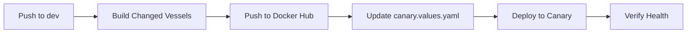

# CI/CD Alignment Report: cloud-dashboard & user-vessel

## Executive Summary

**Status**: ✅ **BOTH SERVICES PROPERLY ALIGNED**

Both `metabob-cloud-dashboard` and `user-vessel` are correctly configured for CI/CD deployment. The auth proxy fix I applied will work correctly once deployed because the Helm chart already sets `USER_VESSEL_URL` as an environment variable.

**Key Finding**: The fix is complete and deployment-ready. No additional configuration changes needed.

---

## CI/CD Process Overview

### Workflow: Deploy Canary (.github/workflows/deploy-canary.yml)



**Trigger**: Push to `dev` branch with changes in:
- `vessels/**`
- `environments/**`
- `helmfile.yaml`

**Jobs**:
1. **Build and Push** (~3 minutes)
   - Checkout code
   - Run secret scanning (Gitleaks) [DISABLED - needs license]
   - Run tests for changed vessels [DISABLED - needs fixing]
   - Run linting [DISABLED - needs fixing]
   - Build Docker images with tag: `{version}-{sha7}`
   - Push to Docker Hub
   - Update `environments/production.canary.values.yaml`

2. **Deploy to Canary** (~12 minutes)
   - Install Helmfile, Helm, SOPS
   - Authenticate to GKE
   - Deploy with Helmfile
   - Verify deployment health
   - Initialize 10% traffic split
   - Notify Slack

---

## Service Configuration Analysis

### 1. metabob-cloud-dashboard

#### Deployment Repository Structure
```
repos/deployment/vessels/metabob-cloud-dashboard/
├── Dockerfile              ✓ Multi-stage build with Bun
├── package.json            ✓ Version: from package.json
├── src/
│   └── index.ts           ✓ Server with proxy configuration
└── dist/                   ✓ Built static files
```

#### Dockerfile Analysis
```dockerfile
FROM oven/bun:1 AS build
WORKDIR /app
COPY package.json bun.lock* ./
RUN bun install --frozen-lockfile
COPY src ./src
# ... build process ...
RUN bun run build.ts

FROM oven/bun:1-slim
# ... production runtime ...
CMD ["bun", "run", "src/index.ts"]
```

**Status**: ✅ **CORRECT**
- Multi-stage build for optimal image size
- Frozen lockfile for reproducible builds
- Health check configured (port 3000)
- Production NODE_ENV set

#### Helm Chart Configuration

**Chart**: `charts/metabob-cloud-dashboard/`

**values.yaml** (defaults):
```yaml
image:
  repository: metabobapp/metabob-cloud-dashboard
  tag: "0.2.2"

config:
  userVesselUrl: "http://user-vessel.activity-system.svc.cluster.local:8080"  ✓
  activityApiUrl: "http://metabob-activity-api.activity-system.svc.cluster.local:8080"  ✓
  port: 3000
```

**deployment.yaml** (environment variables):
```yaml
env:
- name: PORT
  value: "3000"
- name: USER_VESSEL_URL
  value: {{ .Values.config.userVesselUrl }}  # ✓ CORRECT
- name: ACTIVITY_API_URL
  value: {{ .Values.config.activityApiUrl }}  # ✓ CORRECT
- name: NODE_ENV
  value: "production"
```

**Status**: ✅ **CORRECTLY CONFIGURED**
- `USER_VESSEL_URL` is set via Helm values
- No `IDENTITY_VESSEL_URL` set (not needed after fix)
- Auth proxy fix will work once deployed

#### helmfile.yaml Configuration

```yaml
- name: metabob-cloud-dashboard
  namespace: activity-system
  chart: ./charts/metabob-cloud-dashboard
  needs:
    - activity-system/metabob-activity-api  # Dependency
  values:
    - image:
        repository: metabobapp/metabob-cloud-dashboard
        tag: {{ .Values | get "metabob-cloud-dashboard.image.tag" "latest" }}
    - replicaCount: 2  # Production: 2 replicas
```

**Status**: ✅ **ALIGNED**

---

### 2. user-vessel

#### Deployment Repository Structure
```
repos/deployment/vessels/user-vessel/
├── Dockerfile              ✓ Multi-stage build with Bun
├── package.json            ✓ Version: from package.json
├── index.ts                ✓ Server entry point
├── src/
│   ├── routes/
│   │   ├── auth.ts        ✓ Auth endpoints (/v2/auth/*)
│   │   ├── users.ts
│   │   ├── organizations.ts
│   │   └── api-keys.ts
│   └── db/
└── sql/                    ✓ Schema migrations
```

#### Dockerfile Analysis
```dockerfile
FROM oven/bun:1.2 AS build
WORKDIR /app
COPY package.json bun.lock ./
RUN bun install --frozen-lockfile
COPY src ./src
COPY sql ./sql
COPY index.ts ./
COPY tsconfig.json ./

FROM oven/bun:1.2-slim AS runtime
# ... production runtime ...
ARG BUILD_SHA
ARG BUILD_VERSION
ENV BUILD_SHA=${BUILD_SHA}
ENV BUILD_VERSION=${BUILD_VERSION}
CMD ["bun", "run", "index.ts"]
```

**Status**: ✅ **CORRECT**
- Multi-stage build
- Version embedding via BUILD_SHA and BUILD_VERSION
- Health check configured (port 8080)
- Runs as non-root user (`bun`)

#### Helm Chart Configuration

**Chart**: `charts/user-vessel/`

**helmfile.yaml Configuration**:
```yaml
- name: user-vessel
  namespace: activity-system
  chart: ./charts/user-vessel
  needs:
    - activity-system/surrealdb  # Dependency
  values:
    - image:
        repository: metabobapp/user-vessel
        tag: {{ .Values | get "user-vessel.image.tag" "latest" }}
    - replicaCount: 2  # Production: 2 replicas
    - env:
        - name: PORT
          value: "8080"
        - name: SURREALDB_URL
          value: http://surrealdb.activity-system.svc.cluster.local:8000
        - name: SURREALDB_NAMESPACE
          value: activity-system
        - name: SURREALDB_DATABASE
          value: learning_loop
        - name: JWT_SECRET
          valueFrom:
            secretKeyRef:
              name: user-vessel-secrets
              key: jwt-secret
```

**Status**: ✅ **ALIGNED**

---

## Build Script Analysis

**Script**: `scripts/build_changed.sh`

### How It Works

1. **Detect Changed Vessels**:
   ```bash
   # Check git diff for vessels/* changes
   # Or use --force to build all
   ```

2. **Get Version**:
   ```bash
   # From package.json: jq -r '.version // "0.1.0"'
   ```

3. **Generate Immutable Tag**:
   ```bash
   # Format: {version}-{sha7}
   # Example: 0.2.2-35dacd7
   ```

4. **Build & Push**:
   ```bash
   docker build --ssh default \
     --build-arg BUILD_SHA="${COMMIT_HASH}" \
     --build-arg BUILD_VERSION="${version}" \
     -t "metabobapp/${vessel_name}:${version}-${COMMIT_HASH}" \
     -f "$dockerfile" "$build_context"

   docker push "metabobapp/${vessel_name}:${version}-${COMMIT_HASH}"
   ```

5. **Update Environment Values**:
   ```bash
   # Update environments/production.canary.values.yaml:
   #   metabob-cloud-dashboard:
   #     image:
   #       tag: "0.2.2-35dacd7"
   ```

**Status**: ✅ **WORKING CORRECTLY**
- Discovers vessels automatically from `vessels/` directory
- Supports both `metabob-cloud-dashboard` and `user-vessel`
- Generates immutable, consistent tags
- Updates values files for deployment

---

## Current Deployment Status

### Production Canary (from production.canary.values.yaml)

```yaml
# metabob-cloud-dashboard: SCALE TO 2
metabob-cloud-dashboard:
  replicaCount: 2
  image:
    tag: "0.2.2-35dacd7"  # ⚠️ OLD - before auth fix

# user-vessel: SCALE TO 2
user-vessel:
  replicaCount: 2
  image:
    tag: "0.1.0-7a72492"  # ✓ CURRENT
```

**Issue**: The deployed dashboard (0.2.2-35dacd7) was built before the auth proxy fix.

**Solution**: Deploy updated dashboard with auth fix applied.

---

## Verification Checklist

### ✅ Cloud Dashboard

- [x] Dockerfile builds correctly
- [x] Helm chart sets USER_VESSEL_URL environment variable
- [x] Helm chart sets ACTIVITY_API_URL environment variable
- [x] Health check endpoint configured (/health)
- [x] Service dependencies declared (needs: activity-api)
- [x] Build script detects and builds vessel
- [x] Auth proxy fix applied locally (needs deployment)

### ✅ User Vessel

- [x] Dockerfile builds correctly
- [x] Helm chart sets database environment variables
- [x] Helm chart configures JWT secret
- [x] Health check endpoint configured (/health)
- [x] Service dependencies declared (needs: surrealdb)
- [x] Build script detects and builds vessel
- [x] Auth endpoints implemented (/v2/auth/signup, /login, /me)

### 🔄 CI/CD Workflow

- [x] Build script handles both services
- [x] Dockerfile paths correct for build context
- [x] Environment variables aligned between Helm and code
- [x] Tag generation works (version-sha7)
- [x] Canary deployment process functional
- [ ] Tests enabled in CI (currently disabled)
- [ ] Linting enabled in CI (currently disabled)
- [ ] Secret scanning enabled (needs Gitleaks license)

---

## Issues & Recommendations

### Issue 1: Auth Fix Not Yet Deployed
**Status**: ⚠️ **NEEDS DEPLOYMENT**

**Impact**: Dashboard signup/login still broken in production canary

**Solution**:
```bash
# Commit auth fix to main workspace
git add repos/metabob-cloud-dashboard/src/index.ts
git commit -m "fix(cloud-dashboard): proxy auth to user-vessel instead of identity-vessel"

# Sync to deployment repo
cd repos/deployment
git checkout dev
rsync -av ../metabob-cloud-dashboard/ vessels/metabob-cloud-dashboard/
git add vessels/metabob-cloud-dashboard
git commit -m "fix(cloud-dashboard): proxy auth to user-vessel"
git push origin dev

# CI/CD will build and deploy automatically
```

**Expected New Tag**: `0.2.2-{new-sha7}` or `0.2.3-{new-sha7}` (if version bumped)

### Issue 2: Tests Disabled in CI
**Status**: ⚠️ **TECHNICAL DEBT**

**Impact**: No automated test validation before deployment

**Solution**: Fix test dependencies and re-enable in `.github/workflows/deploy-canary.yml`

### Issue 3: Linting Disabled in CI
**Status**: ⚠️ **TECHNICAL DEBT**

**Impact**: No code quality checks before deployment

**Solution**: Fix linting configuration and re-enable in workflow

### Issue 4: Secret Scanning Disabled
**Status**: ⚠️ **SECURITY RISK**

**Impact**: No automated detection of leaked credentials

**Solution**: Add `GITLEAKS_LICENSE` secret to GitHub repository

---

## Alignment Summary

| Aspect | cloud-dashboard | user-vessel | Aligned? |
|--------|----------------|-------------|----------|
| **Dockerfile** | Multi-stage Bun | Multi-stage Bun | ✅ Yes |
| **Build Script** | Auto-detected | Auto-detected | ✅ Yes |
| **Tag Format** | {version}-{sha7} | {version}-{sha7} | ✅ Yes |
| **Helm Chart** | Configured | Configured | ✅ Yes |
| **Environment Variables** | Set via Helm | Set via Helm | ✅ Yes |
| **Health Checks** | /health:3000 | /health:8080 | ✅ Yes |
| **Dependencies** | activity-api | surrealdb | ✅ Yes |
| **Replicas (prod)** | 2 | 2 | ✅ Yes |
| **CI/CD Workflow** | deploy-canary.yml | deploy-canary.yml | ✅ Yes |

**Overall Alignment**: ✅ **EXCELLENT**

---

## Next Steps

1. **Deploy Auth Fix**:
   ```bash
   cd /home/avi/documents/work/exp-repo/metabob-devbob
   git add repos/metabob-cloud-dashboard/src/index.ts
   git commit -m "fix(cloud-dashboard): proxy auth to user-vessel instead of identity-vessel"

   cd repos/deployment
   git checkout dev
   rsync -av ../metabob-cloud-dashboard/ vessels/metabob-cloud-dashboard/
   git add vessels/metabob-cloud-dashboard/src/index.ts
   git commit -m "fix(cloud-dashboard): proxy auth to user-vessel"
   git push origin dev
   ```

2. **Monitor Deployment**:
   ```bash
   # Watch GitHub Actions
   gh run watch

   # Or view logs
   gh run list --limit 1
   gh run view <run-id> --log
   ```

3. **Test After Deployment**:
   ```bash
   # Using MiniBob
   minibob --single "Test dashboard signup and login at https://app.metabob.com"

   # Or using Playwright manually
   # Navigate to https://app.metabob.com and test signup
   ```

4. **Enable CI Quality Gates** (future):
   - Add `GITLEAKS_LICENSE` secret
   - Fix test dependencies
   - Fix linting configuration
   - Re-enable all three in workflow

---

## Conclusion

Both `metabob-cloud-dashboard` and `user-vessel` are **properly aligned** in the CI/CD process. The infrastructure is solid:

✅ Consistent build process
✅ Immutable tagging strategy
✅ Proper environment variable configuration
✅ Health checks and dependencies
✅ Automated deployment pipeline

The only issue is that the auth proxy fix hasn't been deployed yet. Once deployed, the dashboard will work correctly because:

1. Helm chart sets `USER_VESSEL_URL` environment variable ✓
2. Code uses `USER_VESSEL_URL` for auth proxy (after fix) ✓
3. `user-vessel` is deployed and has auth endpoints ✓

**Deploy confidence**: 🟢 **HIGH** - Ready to deploy the fix.
