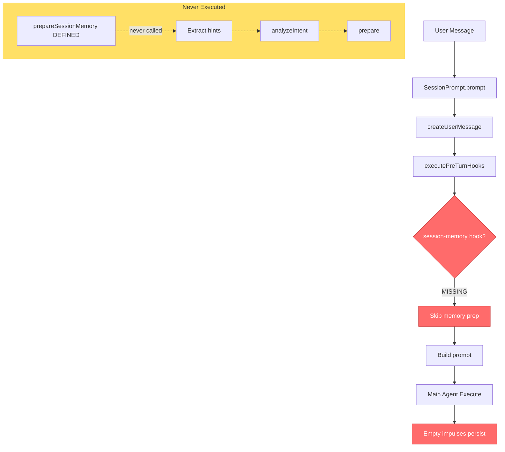
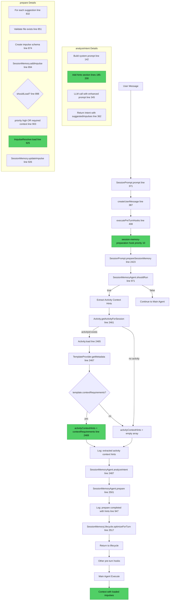

# Complete Session Memory Agent Flow Map

## Discovery: The Missing Invocation

### Critical Finding

**The `prepareSessionMemory()` function was defined but NEVER called!**

All our implementation was correct, but the entry point was disconnected.

---

## BEFORE: Broken Flow (What Was Happening)



---

## AFTER: Fixed Flow (What Happens Now)



---

## Complete Symbol Trace (Beginning to End)

### Entry: User Sends Message

**Symbol**: User action in TUI/CLI  
**Next**: `SessionPrompt.prompt(input: PromptInput)`

---

### 1. SessionPrompt.prompt()

**Location**: `src/session/prompt.ts:371`

**Parameters**:
```typescript
interface PromptInput {
  sessionID: string
  parts: MessagePart[]
  agent?: string
  model?: string
  noReply?: boolean
  // ... other fields
}
```

**Key Steps**:
- Line 379-385: Extract promptText from parts
- Line 387: `createUserMessage(input)`
- Line 396: `Agent.get(input.agent ?? "activity")`
- Line 400-406: Build `TurnContext` object
- Line 408: **`TurnLifecycle.executePreTurnHooks(hookContext)`** ← Key transition

**Symbol Output**: `TurnContext`

```typescript
{
  sessionID: string
  userMessageID: string
  promptText: string
  agent: Agent.Info
  timestamp: number
}
```

---

### 2. TurnLifecycle.executePreTurnHooks()

**Location**: `src/session/turn-lifecycle.ts` (not shown but standard pattern)

**Action**: Iterate registered hooks by priority, execute if enabled

**Hooks Executed** (in order):
1. **session-memory-preparation** (priority 10) ← Our new hook
2. activity-recommendation (priority 15)
3. metabob-context (priority 20)
4. ... others

**Transition**: Call `session-memory-preparation.execute(ctx)`

---

### 3. session-memory-preparation Hook

**Location**: `src/session/turn-lifecycle-hooks.ts:22`

**Registration**:
```typescript
TurnLifecycle.registerHook({
  name: "session-memory-preparation",
  priority: 10,
  enabled: async (ctx) => { /* gate check */ },
  execute: async (ctx) => { /* main logic */ }
})
```

**enabled() Logic**:
- Check `config.sessionMemory?.enabled !== false`
- Check `ctx.agent.mode !== "subagent"`
- Check `ctx.promptText.length >= 10`
- Return boolean

**execute() Logic** (line 48):
```typescript
const Prompt = await import("./prompt")
await Prompt.SessionPrompt.prepareSessionMemory({
  sessionID: ctx.sessionID,
  promptText: ctx.promptText,
  agent: ctx.agent.name,
})
```

**Transition**: Call `SessionPrompt.prepareSessionMemory()`

---

### 4. SessionPrompt.prepareSessionMemory()

**Location**: `src/session/prompt.ts:2423`

**Parameters**:
```typescript
{
  sessionID: string
  promptText: string
  agent: string
}
```

**Step 4.1: Gate Check** (line 2432)
```typescript
const shouldRun = await SessionMemoryAgent.shouldRun({
  sessionID: input.sessionID,
  promptText: input.promptText,
  agent: input.agent,
})
```

**Symbol**: → `SessionMemoryAgent.shouldRun()`

---

### 5. SessionMemoryAgent.shouldRun()

**Location**: `src/session/memory-agent.ts:971`

**Returns**: `Promise<boolean>`

**Logic**:
- Get config
- Get agent info
- Check enabled flag
- Check agent mode (primary only)
- Check if trivial message
- Return true/false

**Back to prepareSessionMemory** with boolean result

---

### 6. Extract Activity Context Hints

**Location**: `src/session/prompt.ts:2457-2484`

**Step 6.1: Get Activity ID**
```typescript
const { Activity } = await import("./activity")
const activityId = Activity.getActivityForSession(input.sessionID)
```

**Symbol**: `Activity.getActivityForSession(sessionID: string)`  
**Location**: `src/session/activity.ts:34`  
**Returns**: `string | undefined`

---

**Step 6.2: Load Activity** (if exists)
```typescript
if (activityId) {
  const activity = await Activity.load(activityId)
```

**Symbol**: `Activity.load(activityId: string)`  
**Returns**: Activity object with `templateId`

---

**Step 6.3: Get Template Metadata**
```typescript
const { TemplateProvider } = await import("./template-provider")
const template = await TemplateProvider.getMetadata(activity.templateId)
```

**Symbol**: `TemplateProvider.getMetadata(templateId: string)`  
**Location**: `src/session/template-provider.ts`  
**Returns**: Template metadata with `contextRequirements`

---

**Step 6.4: Extract Hints**
```typescript
if (template?.contextRequirements) {
  activityContextHints = template.contextRequirements
  l.info("extracted activity context hints", {
    sessionID: input.sessionID,
    templateId: activity.templateId,
    requirementCount: activityContextHints.length,
  })
}
```

**Symbol Created**: `activityContextHints: ActivityTemplate.ContextRequirement[]`

**Structure**:
```typescript
[{
  key: string              // "errorContext", "relatedFiles"
  hint: string            // "Provide error file and stack trace"
  required: boolean       // true = must satisfy
  impulseTypes: string[]  // ["file", "bashOutput", "memo"]
  budgetRange: [number, number]  // [1000, 3000]
}]
```

---

### 7. Analyze Intent

**Location**: `src/session/prompt.ts:2487`

```typescript
const intent = await SessionMemoryAgent.analyzeIntent({
  sessionID: input.sessionID,
  promptText: input.promptText,
  recentMessages,
  activityContextHints, // ← CRITICAL: Hints passed here
})
```

**Symbol**: → `SessionMemoryAgent.analyzeIntent()`

---

### 8. SessionMemoryAgent.analyzeIntent()

**Location**: `src/session/memory-agent.ts:97`

**Parameters**:
```typescript
{
  sessionID: string
  promptText: string
  recentMessages?: MessageV2.WithParts[]
  activityContextHints?: ActivityTemplate.ContextRequirement[]  // NEW!
}
```

**Step 8.1: Build System Prompt with Hints** (lines 142-205)

```typescript
const system = SystemPrompt.header(config.model.providerID)

// Add hints section if available (lines 185-200)
${input.activityContextHints && input.activityContextHints.length > 0 ? `

## Activity Context Hints

The current activity has specific context requirements:

${input.activityContextHints.map(req => `
### ${req.key} (${req.required ? 'REQUIRED' : 'optional'})
- Hint: ${req.hint}
- Types: ${req.impulseTypes.join(', ')}
- Budget: ${req.budgetRange[0]}-${req.budgetRange[1]}
- Priority: ${req.required ? 'high' : 'medium'}
`).join('\n')}

**IMPORTANT**: Create impulses that satisfy these requirements.` : ""}
```

**Step 8.2: LLM Call** (line 345)

```typescript
const result = await generateObject({
  model: model.language,
  temperature: 0.2,
  messages: [...system, user message],
  schema: Intent.shape,
})
```

**Step 8.3: Parse Result** (line 362)

```typescript
const intent = Intent.parse(result.object)
```

**Symbol Returned**: `Intent`

```typescript
{
  type: "code_fix" | "feature_request" | "question" | "refactor" | "exploration" | "other"
  confidence: number  // 0-1
  reasoning: string
  suggestedImpulses: [{
    id: string
    type: "file" | "bashOutput" | "memo" | "component" | "metabobIssue"
    description: string
    priority: "high" | "medium" | "low"
    budget: number
    pointer: { type, ...fields }
  }]
}
```

**Log Point** (line 398):
```typescript
l.info("analyzeIntent() completed", {
  sessionID: input.sessionID,
  type: intent.type,
  confidence: intent.confidence,
  reasoning: intent.reasoning,
  suggestedImpulsesCount: intent.suggestedImpulses.length,
  impulseIds: intent.suggestedImpulses.map((i) => i.id),
  elapsed: duration,
})
```

**Back to prepareSessionMemory** with Intent

---

### 9. Prepare Session Memory

**Location**: `src/session/prompt.ts:2501`

```typescript
const result = await SessionMemoryAgent.prepare({
  sessionID: input.sessionID,
  intent,
  turnNumber,
  activityContextHints, // ← Passed through for loading priority
})
```

**Symbol**: → `SessionMemoryAgent.prepare()`

---

### 10. SessionMemoryAgent.prepare()

**Location**: `src/session/memory-agent.ts:792`

**Parameters**:
```typescript
{
  sessionID: string
  intent: Intent
  turnNumber: number
  activityContextHints?: ActivityTemplate.ContextRequirement[]  // NEW!
}
```

**Loop**: For each `suggestion` in `intent.suggestedImpulses` (line 832)

---

**Step 10.1: Validate File Path** (lines 851-870)

```typescript
if (suggestion.pointer.type === "file") {
  const filePath = suggestion.pointer.path
  const fullPath = filePath.startsWith("/") ? filePath : `${Instance.directory}/${filePath}`
  const fileExists = await Bun.file(fullPath).exists()
  
  if (!fileExists) {
    l.warn("skipping impulse with non-existent file path", {
      impulseId: suggestion.id,
      path: filePath,
      suggestion: "Memory agent should use bashOutput or memo instead",
    })
    continue // Skip this impulse
  }
}
```

**Result**: Only valid files proceed

---

**Step 10.2: Create Impulse Schema** (lines 874-892)

```typescript
const impulse: ActivityTemplate.Impulse.Schema = {
  id: suggestion.id,
  sessionID: input.sessionID,
  scope: "session",
  pointer: suggestion.pointer as ActivityTemplate.Impulse.Pointer,
  budget: suggestion.budget,
  priority: suggestion.priority,
  type: suggestion.type,
  description: suggestion.description,  // Added in our fix
  metadata: {
    createdTurn: input.turnNumber,
    createdBy: "session-memory-agent",
  },
}
```

---

**Step 10.3: Store Impulse** (line 894)

```typescript
await SessionMemory.addImpulse(input.sessionID, impulse)
created++
```

**Symbol**: → `SessionMemory.addImpulse()`  
**Location**: `src/session/session-memory.ts:162`

**Action**: Store impulse in `["session-memory", sessionID]` storage key

**State**: Impulse exists but unloaded (no content, tokenCount undefined)

---

**Step 10.4: Loading Decision** (lines 897-910)

```typescript
// Determine if should load immediately
let shouldLoad = suggestion.priority === "high"
let loadReason = "high-priority"

// ALSO load if matches a required activity context requirement
if (!shouldLoad && input.activityContextHints) {
  const matchesRequirement = input.activityContextHints.some(req => 
    req.required && impulse.metadata?.requirement === req.key
  )
  if (matchesRequirement) {
    shouldLoad = true
    loadReason = "required-context"
  }
}
```

**Decision Matrix**:

| Condition | Result | loadReason |
|-----------|--------|------------|
| priority === "high" | LOAD | "high-priority" |
| req.required && matches key | LOAD | "required-context" |
| otherwise | SKIP | "not-loading" |

**Log Point** (line 912):
```typescript
l.info("impulse created", {
  sessionID: input.sessionID,
  impulseId: impulse.id,
  priority: impulse.priority,
  budget: impulse.budget,
  willLoadNow: shouldLoad,
  loadReason: shouldLoad ? loadReason : "not-loading",
})
```

---

**Step 10.5: Load Impulse** (if shouldLoad) (lines 922-943)

```typescript
if (shouldLoad) {
  const { ImpulseResolver } = await import("./impulse-resolver")
  const loadedImpulse = await ImpulseResolver.load(impulse)
  await SessionMemory.updateImpulse(input.sessionID, suggestion.id, loadedImpulse)
  loaded++
  totalTokens += loadedImpulse.tokenCount || 0
}
```

**Symbol**: → `ImpulseResolver.load()`

---

### 11. ImpulseResolver.load()

**Location**: `src/session/impulse-resolver.ts:619`

**Input**: `impulse: ActivityTemplate.Impulse.Schema` (unloaded)

**Processing by Pointer Type**:

| Type | Action | Tool Used |
|------|--------|-----------|
| file | Read file content | ReadTool |
| bashOutput | Execute command | BashTool |
| memo | Use inline content | Direct |
| component | Load component | MCP |
| metabobIssue | Query Metabob | MCP |

**Output**: Loaded impulse

```typescript
{
  ...impulse,
  content: string,      // Resolved content
  tokenCount: number,   // Actual token count (> 0)
  loadedAt: number      // Timestamp
}
```

**Back to prepare()** with loaded impulse

---

**Step 10.6: Update Storage** (line 926)

```typescript
await SessionMemory.updateImpulse(input.sessionID, suggestion.id, loadedImpulse)
```

**Symbol**: → `SessionMemory.updateImpulse()`  
**Location**: `src/session/session-memory.ts:252`

**Action**: Update impulse with content and tokenCount

**State Change**: `tokenCount: undefined` → `tokenCount: number (> 0)`

---

**Step 10.7: Track Stats** (lines 927-928)

```typescript
loaded++
totalTokens += loadedImpulse.tokenCount || 0
```

---

### 12. Return Results

**Location**: `src/session/memory-agent.ts:947-962`

```typescript
l.info("prepare() completed", {
  sessionID: input.sessionID,
  created,
  loaded,
  unloaded,
  totalTokens,
  skipped: input.intent.suggestedImpulses.length - created,
  hintsProvided: input.activityContextHints?.length ?? 0,  // NEW!
  hintsAddressed: created > 0 ? "yes" : "no",              // NEW!
  elapsed: Date.now() - start,
})

return {
  impulsesCreated: created,
  impulsesLoaded: loaded,
  impulsesUnloaded: unloaded,
  totalTokens,
}
```

**Back to prepareSessionMemory** with stats

---

### 13. Optimize Session Memory

**Location**: `src/session/prompt.ts:2517`

```typescript
const optimization = await SessionMemoryLifecycle.optimizeForTurn({
  sessionID: input.sessionID,
  currentTurn: turnNumber,
})
```

**Action**: Cleanup stale impulses, evict low-priority content

---

### 14. Return to Main Prompt Flow

**Location**: `src/session/prompt.ts:430+`

- Continue with other hooks
- Build final prompt with loaded impulses
- Execute main agent
- Agent receives context via `<session_memory>` tags

---

## Key Data Transformations

### Transform 1: Template → Hints

```typescript
// IN: Template from backend
{
  templateId: "bug-fix",
  contextRequirements: [{
    key: "errorContext",
    hint: "Provide error file and stack trace",
    required: true,
    impulseTypes: ["file", "bashOutput"],
    budgetRange: [1000, 3000]
  }]
}

// OUT: activityContextHints
[{
  key: "errorContext",
  hint: "Provide error file and stack trace",
  required: true,
  impulseTypes: ["file", "bashOutput"],
  budgetRange: [1000, 3000]
}]
```

---

### Transform 2: Hints → System Prompt

```typescript
// IN: activityContextHints array

// OUT: Enhanced system prompt
`
## Activity Context Hints

### errorContext (REQUIRED)
- Hint: Provide error file and stack trace
- Types: file, bashOutput
- Budget: 1000-3000 tokens
- Priority: high

**IMPORTANT**: Create impulses that satisfy these requirements.
`
```

---

### Transform 3: System Prompt → LLM → Intent

```typescript
// IN: Enhanced system prompt + user message

// OUT: Intent with suggestions
{
  type: "code_fix",
  confidence: 0.95,
  suggestedImpulses: [{
    id: "errorFile",
    type: "file",
    description: "File containing the error",
    priority: "high",
    budget: 2000,
    pointer: { type: "file", path: "src/tool/bash.ts", offset: 30, limit: 30 }
  }, {
    id: "stackTrace",
    type: "bashOutput",
    description: "Recent error logs",
    priority: "high",
    budget: 1000,
    pointer: { type: "bashOutput", command: "tail -50 ~/.local/share/opencode/log/dev.log" }
  }]
}
```

---

### Transform 4: Suggestion → Impulse Schema

```typescript
// IN: suggestion from Intent

// OUT: Stored impulse
{
  id: "errorFile",
  sessionID: "01HXV...",
  scope: "session",
  type: "file",
  pointer: { type: "file", path: "src/tool/bash.ts", offset: 30, limit: 30 },
  budget: 2000,
  priority: "high",
  description: "File containing the error",
  metadata: {
    createdTurn: 5,
    createdBy: "session-memory-agent"
  }
  // Not loaded yet: content undefined, tokenCount undefined
}
```

---

### Transform 5: Unloaded → Loaded Impulse

```typescript
// IN: Unloaded impulse (from storage)
{
  id: "errorFile",
  sessionID: "01HXV...",
  pointer: { type: "file", path: "src/tool/bash.ts", offset: 30, limit: 30 },
  budget: 2000,
  // No content, no tokenCount
}

// PROCESS: ImpulseResolver.load()
// 1. Read file via ReadTool
// 2. Extract lines 30-60 (30 lines)
// 3. Count tokens
// 4. Truncate if over budget

// OUT: Loaded impulse
{
  id: "errorFile",
  sessionID: "01HXV...",
  pointer: { type: "file", path: "src/tool/bash.ts", offset: 30, limit: 30 },
  budget: 2000,
  content: "export async function execute(...",  // LOADED!
  tokenCount: 1847,                               // COUNTED!
  loadedAt: 1738886400000                         // TIMESTAMPED!
}
```

---

## Comparison: Before vs After Our Fix

### Before (All Code Dormant)

```
SessionPrompt.prompt()
  → executePreTurnHooks()
    → session-memory-preparation hook MISSING
      → prepareSessionMemory() NEVER CALLED
        → All hint extraction code DORMANT
        → All impulse loading code DORMANT
  → Main agent executes
    → Empty impulses (tokenCount = 0)
    → Generic context only
```

### After (All Code Active)

```
SessionPrompt.prompt()
  → executePreTurnHooks()
    → session-memory-preparation hook REGISTERED ✅
      → SessionPrompt.prepareSessionMemory() CALLED ✅
        → Activity.getActivityForSession() ✅
        → TemplateProvider.getMetadata() ✅
        → activityContextHints EXTRACTED ✅
        → SessionMemoryAgent.analyzeIntent(hints) ✅
          → System prompt ENHANCED with hints ✅
          → LLM generates targeted impulses ✅
        → SessionMemoryAgent.prepare(hints) ✅
          → Impulses CREATED ✅
          → Required context LOADED ✅
          → tokenCount > 0 ✅
  → Main agent executes
    → Loaded impulses available
    → Hint-driven context
```

---

## Files Modified

1. **turn-lifecycle-hooks.ts**
   - Removed broken hook (old lines 14-185)
   - Added working hook (new lines 14-88)

2. **prompt.ts**
   - Added ActivityTemplate import (line 58)
   - Made prepareSessionMemory() exportable (line 2423)
   - Extract activityContextHints (lines 2457-2484)
   - Pass hints to analyzeIntent() (line 2491)
   - Pass hints to prepare() (line 2505)
   - Updated comment (lines 426-428)

3. **memory-agent.ts**
   - Added activityContextHints parameter to analyzeIntent() (line 101)
   - Enhanced system prompt with hints (lines 185-200)
   - Added activityContextHints parameter to prepare() (line 795)
   - Prioritized loading based on hints (lines 897-910)
   - Fixed description field in impulse creation (line 880)
   - Fixed description in gatherContext() (lines 515, 531, 547, 563)
   - Added hint tracking logs (lines 949-950)

---

## Verification Commands

### 1. Check Hook Registration
```bash
grep "registerHook" src/session/turn-lifecycle-hooks.ts
# Should show: session-memory-preparation, activity-recommendation, etc.
```

### 2. Check Export
```bash
grep "export async function prepareSessionMemory" src/session/prompt.ts
# Should find the export
```

### 3. Check Hint Passing
```bash
grep "activityContextHints" src/session/prompt.ts
# Should show multiple occurrences (extract, pass to analyzeIntent, pass to prepare)
```

### 4. Check System Prompt Enhancement
```bash
grep "Activity Context Hints" src/session/memory-agent.ts
# Should find the hints section in system prompt
```

---

## Log Points to Monitor (In Order)

1. `"extracted activity context hints"` - Hints found in template
2. `"intent analyzed"` - LLM analyzed with hints
3. `"impulse created"` - Each impulse with loadReason
4. `"impulse loaded"` - Content resolved (tokenCount > 0)
5. `"prepare() completed"` - Final stats with hintsProvided/hintsAddressed

---

## Success Indicators

✅ **Hint Extraction**: Log shows `requirementCount > 0`  
✅ **Hint Usage**: System prompt includes "Activity Context Hints" section  
✅ **Targeted Creation**: Impulses match hint requirements  
✅ **Prioritized Loading**: Required context has `loadReason: "required-context"`  
✅ **Non-Empty Impulses**: Loaded impulses have `tokenCount > 0`  
✅ **Full Pipeline**: hintsProvided and hintsAddressed in final log

---

## Summary

**The Problem**: `prepareSessionMemory()` was defined but never invoked because:
- The old hook tried to call non-existent template
- We removed the broken hook
- Forgot to add a working hook to invoke the function

**The Solution**: Added proper hook that:
- Calls `SessionPrompt.prepareSessionMemory()` directly (not via template)
- Passes through TurnLifecycle system (priority 10)
- Activates all the hint extraction and loading logic we implemented

**Result**: Complete pipeline from activity contextRequirements → loaded impulses with actual content.
