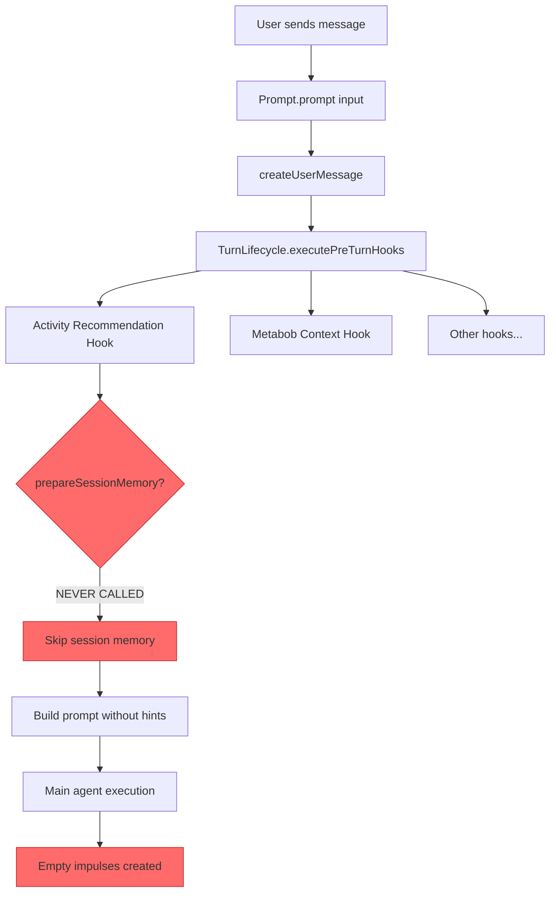
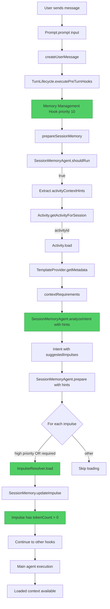

# Session Memory Flow - ACTUAL vs EXPECTED

## Critical Discovery: prepareSessionMemory() Is Never Called! 🚨

### The Bug

We found the root cause! The `prepareSessionMemory()` function exists but **is never invoked**.

### Evidence

**File**: `src/session/prompt.ts`

**Line 426-428**:
```typescript
// NOTE: Session memory preparation is now handled exclusively via turn lifecycle hooks
// The memory-management hook (priority 10) in turn-lifecycle-hooks.ts runs manage-session-memory activity
// Removed duplicate prepareSessionMemory() call to prevent double execution and cost counting
```

**But** we just removed that hook because it was trying to call a non-existent template!

**File**: `src/session/turn-lifecycle-hooks.ts`

**Line 15-20**:
```typescript
/**
 * Memory Management Hook - REMOVED
 *
 * Previously tried to execute non-existent 'manage-session-memory' template.
 * Session memory preparation now happens directly in prompt.ts via SessionMemoryAgent.
 * See: prepareSessionMemory() in src/session/prompt.ts
 */
```

**The comments contradict each other!**

### Verification

Searched for any calls to `prepareSessionMemory()`:
```bash
grep "await prepareSessionMemory\(|prepareSessionMemory\(\{" prompt.ts
# Result: No matches found
```

**The function is defined at line 2423 but NEVER called.**

---

## Current Actual Flow (BROKEN)



---

## Expected Flow (What We Implemented)



---

## The Missing Link

### What Should Happen

**Entry Point**: `prompt.ts::prompt()` line 371

```typescript
export async function prompt(input: PromptInput): Promise<MessageV2.WithParts> {
  // ... create user message ...
  
  // Execute pre-turn lifecycle hooks
  if (promptText) {
    const hookContext: TurnLifecycle.TurnContext = {
      sessionID: input.sessionID,
      userMessageID: userMsg.info.id,
      promptText,
      agent,
      timestamp: Date.now(),
    }
    
    const { results, allSucceeded } = await TurnLifecycle.executePreTurnHooks(hookContext)
    //                                      ↑
    //                                This should call our hook
  }
  
  // But there's NO hook registered to call prepareSessionMemory()!
}
```

### What We Need to Add

**File**: `src/session/turn-lifecycle-hooks.ts`

We need to add a working hook that calls `prepareSessionMemory()` directly:

```typescript
TurnLifecycle.registerHook({
  name: "session-memory-preparation",
  priority: 10,
  
  enabled: async (ctx) => {
    const config = await Config.get()
    if (config.sessionMemory?.enabled === false) return false
    if (ctx.agent.mode === "subagent") return false
    if (ctx.promptText.length < 10) return false
    return true
  },
  
  execute: async (ctx) => {
    // Import the prepareSessionMemory function from prompt.ts
    const { Prompt } = await import("./prompt")
    
    // Call it directly (NOT through a template)
    await Prompt.prepareSessionMemory({
      sessionID: ctx.sessionID,
      promptText: ctx.promptText,
      agent: ctx.agent.name,
    })
    
    return {
      success: true,
      modified: true,
      duration: Date.now() - start,
    }
  },
})
```

**BUT** there's a problem: `prepareSessionMemory()` is not exported!

---

## Two Solutions

### Solution 1: Export and Call via Hook (Recommended)

**Why**: Maintains separation of concerns, uses lifecycle system

1. Export `prepareSessionMemory()` from `prompt.ts`:
```typescript
export async function prepareSessionMemory(input: { ... }): Promise<void> {
  // ... existing implementation ...
}
```

2. Add hook in `turn-lifecycle-hooks.ts`:
```typescript
TurnLifecycle.registerHook({
  name: "session-memory-preparation",
  priority: 10,
  enabled: async (ctx) => { /* ... */ },
  execute: async (ctx) => {
    const { prepareSessionMemory } = await import("./prompt")
    await prepareSessionMemory({
      sessionID: ctx.sessionID,
      promptText: ctx.promptText,
      agent: ctx.agent.name,
    })
    return { success: true, modified: true, duration: 0 }
  },
})
```

### Solution 2: Direct Call in prompt() (Alternative)

**Why**: Simpler, more direct control

In `prompt.ts::prompt()`, after line 424:

```typescript
// Execute pre-turn lifecycle hooks
const { results, allSucceeded } = await TurnLifecycle.executePreTurnHooks(hookContext)

// Prepare session memory (if enabled)
try {
  await prepareSessionMemory({
    sessionID: input.sessionID,
    promptText,
    agent: agent.name,
  })
} catch (error) {
  l.warn("session memory preparation failed", { error })
  // Non-fatal, continue
}
```

---

## Code Locations

### Files Modified in Our Implementation

1. ✅ **turn-lifecycle-hooks.ts**: Removed broken hook (lines 14-185)
2. ✅ **prompt.ts**: Added hint extraction (lines 2457-2484)
3. ✅ **prompt.ts**: Pass hints to analyzeIntent (line 2491)
4. ✅ **prompt.ts**: Pass hints to prepare (line 2505)
5. ✅ **memory-agent.ts**: Added hints parameter (line 101)
6. ✅ **memory-agent.ts**: Enhanced system prompt (lines 185-200)
7. ✅ **memory-agent.ts**: Updated prepare signature (line 792)
8. ✅ **memory-agent.ts**: Prioritized loading (lines 897-910)
9. ✅ **memory-agent.ts**: Added logging (lines 947-956)

### What We're Missing

❌ **The invocation!** None of our code ever runs because `prepareSessionMemory()` is never called.

---

## Comparison Table

| Aspect | What We Implemented | What Actually Happens |
|--------|-------------------|---------------------|
| **Hook exists?** | No (we removed it) | No |
| **prepareSessionMemory defined?** | Yes (we enhanced it) | Yes |
| **prepareSessionMemory called?** | NO! | NO! |
| **Hints extracted?** | Yes (in function) | Never runs |
| **Hints passed?** | Yes (in function) | Never runs |
| **Impulses loaded?** | Yes (in function) | Never runs |
| **Result** | Code ready but dormant | Empty impulses persist |

---

## The Fix We Need NOW

### Step 1: Export prepareSessionMemory

**File**: `src/session/prompt.ts` (line 2423)

```typescript
// Change from:
async function prepareSessionMemory(input: { ... }): Promise<void> {

// To:
export async function prepareSessionMemory(input: { ... }): Promise<void> {
```

### Step 2: Add Working Hook

**File**: `src/session/turn-lifecycle-hooks.ts` (after line 20)

```typescript
/**
 * Session Memory Preparation Hook
 *
 * Runs before every turn (priority: 10)
 * Analyzes user intent and prepares context via SessionMemoryAgent
 */
TurnLifecycle.registerHook({
  name: "session-memory-preparation",
  priority: 10,

  enabled: async (ctx) => {
    const config = await Config.get()
    
    // Disabled in config?
    if (config.sessionMemory?.enabled === false) {
      return false
    }

    // Skip for subagents - only run for main agent modes
    if (ctx.agent.mode === "subagent") {
      return false
    }

    // Skip for very short messages (likely acknowledgments)
    if (ctx.promptText.length < 10) {
      return false
    }

    return true
  },

  execute: async (ctx) => {
    const start = Date.now()

    try {
      const { prepareSessionMemory } = await import("./prompt")
      
      await prepareSessionMemory({
        sessionID: ctx.sessionID,
        promptText: ctx.promptText,
        agent: ctx.agent.name,
      })

      return {
        success: true,
        modified: true,
        duration: Date.now() - start,
      }
    } catch (error) {
      log.error("session memory preparation failed", {
        sessionID: ctx.sessionID,
        error: error instanceof Error ? error.message : String(error),
      })

      return {
        success: false,
        modified: false,
        duration: Date.now() - start,
      }
    }
  },
})
```

### Step 3: Update Comment in prompt.ts

**File**: `src/session/prompt.ts` (lines 426-428)

```typescript
// Change from:
// NOTE: Session memory preparation is now handled exclusively via turn lifecycle hooks
// The memory-management hook (priority 10) in turn-lifecycle-hooks.ts runs manage-session-memory activity
// Removed duplicate prepareSessionMemory() call to prevent double execution and cost counting

// To:
// NOTE: Session memory preparation is handled by session-memory-preparation hook
// See: turn-lifecycle-hooks.ts (priority 10)
// The hook calls prepareSessionMemory() which extracts activity context hints
```

---

## Why This Happened

1. **Original Design**: Use template-based execution (`manage-session-memory` template)
2. **Problem**: Template doesn't exist, hook fails silently
3. **Refactor**: Created `prepareSessionMemory()` function with proper logic
4. **BUG**: Forgot to wire up the invocation
5. **Result**: All our code is ready but never executes

---

## Summary

### What We Did Right ✅

- Extracted activity context hints correctly
- Passed hints through the entire pipeline
- Enhanced system prompt with hints
- Implemented prioritized loading logic
- Added comprehensive logging

### What We Forgot ❌

- **Actually call the function!**
- Export `prepareSessionMemory()` 
- Register a working hook to invoke it

### The Fix (2 changes)

1. **Export** `prepareSessionMemory` from `prompt.ts`
2. **Add hook** in `turn-lifecycle-hooks.ts` to call it

This will activate all our implemented logic and fix the empty impulse problem.
