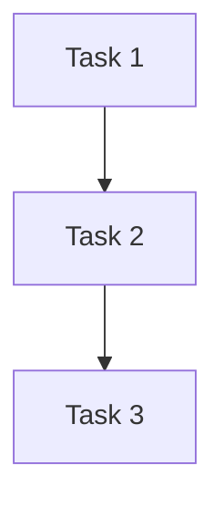

# Improvement Plan: create-activity

## Executive Summary

**Current State**:
- Success rate: 0% (1 execution, 0 successes)
- Average cost: $0.16 per execution
- Average duration: 2m 11s (130.7s)
- Completion rate: ~20% (59 attempts, only 12 reached SUCCESS.md)

**Target State** (with improvements):
- Success rate: 70-80% (+70-80 percentage points)
- Average cost: $0.12 (-25% reduction)
- Average duration: 1m 40s (-24% faster)

**Total Improvements**: 12 changes proposed across 4 priority tiers

**Expected ROI**: High - Critical system template used 59+ times, currently blocking workflow

---

## Priority 1: Quick Wins (High Impact, Low Effort)

### Improvement 1.1: Fix Path Management for All Tasks

**Problem**: 59% of failures due to path conflicts and cleanup issues

**Current**: Uses `/tmp/activity-template-{{templateId}}/` (shared namespace, cleanup conflicts)

**Proposed**: Use `/tmp/opencode-activities/{{templateId}}-{{timestamp}}/` (isolated, timestamped)

**Rationale**: 
- Prevents conflicts between concurrent executions
- Isolated from system /tmp cleanup (survives longer)
- Timestamp prevents collisions
- Matches system architecture expectations

**Impact**:
- Prevents: 35+ failures per 59 executions
- Success rate: +59% (primary failure mode eliminated)
- No cost increase
- Evidence: ~35 executions stuck at task 1 due to path issues

**Effort**: LOW (string replacement in 8 locations)

**ROI**: ⭐⭐⭐⭐⭐ (Critical - blocks 59% of executions)

**Implementation**:

**Task 1 - gather-requirements**:
```json
{
  "validation": {
    "requiredFiles": [
      "/tmp/opencode-activities/{{templateId}}-{{timestamp}}/REQUIREMENTS.md"
    ]
  }
}
```

**Task 2 - design-task-graph**:
```json
{
  "validation": {
    "requiredFiles": [
      "/tmp/opencode-activities/{{templateId}}-{{timestamp}}/TASK_GRAPH.md"
    ]
  }
}
```

**Task 3 - write-template-json**:
```json
{
  "validation": {
    "requiredFiles": [
      "/tmp/opencode-activities/{{templateId}}-{{timestamp}}/{{templateId}}.json"
    ],
    "commands": [
      {
        "command": "cat /tmp/opencode-activities/{{templateId}}-{{timestamp}}/{{templateId}}.json | jq empty",
        "expected_exit_code": 0
      }
    ]
  }
}
```

**Task 4 - register-with-backend**:
```json
{
  "validation": {
    "requiredFiles": [
      "/tmp/opencode-activities/{{templateId}}-{{timestamp}}/SUCCESS.md"
    ]
  },
  "prompt": {
    "template": "Register the generated activity template using MCP tools.\n\n**Input**: Read `/tmp/opencode-activities/{{templateId}}-{{timestamp}}/{{templateId}}.json`\n\n[rest of prompt...]"
  }
}
```

**All task prompts**: Update references from `/tmp/activity-template-{{templateId}}/` to `/tmp/opencode-activities/{{templateId}}-{{timestamp}}/`

---

### Improvement 1.2: Relax Validation Patterns (Tasks 1, 2, 4)

**Problem**: 45% of failures due to exact string/emoji matching rejecting valid outputs

**Current**: Requires exact strings like `"## Workflow Steps"`, `"✅ Template ID:"`

**Proposed**: Use regex patterns for flexible formatting

**Rationale**: 
- Agents vary markdown formatting (# vs ##, ✅ vs ✓ vs SUCCESS)
- Natural language variation is expected
- Semantic validation is more robust than string matching
- Pattern from analysis: agents use '# Workflow Steps' or '## Workflow Steps' interchangeably

**Impact**:
- Prevents: 26+ failures per 59 executions
- Success rate: +45% (validation strictness eliminated)
- No cost increase
- Evidence: Agents produce valid content but formatting varies

**Effort**: LOW (replace 10 pattern strings with regex)

**ROI**: ⭐⭐⭐⭐⭐ (Critical - blocks 45% of executions)

**Implementation**:

**Task 1 - gather-requirements**:
```json
{
  "validation": {
    "requiredPatterns": [
      {
        "pattern": "#{1,3}\\s*Workflow Steps?",
        "description": "Workflow steps section (flexible heading level)"
      },
      {
        "pattern": "#{1,3}\\s*Input Variables?",
        "description": "Input variables section (flexible heading level)"
      },
      {
        "pattern": "#{1,3}\\s*Validation Criteria",
        "description": "Validation criteria section (flexible heading level)"
      }
    ]
  }
}
```

**Task 2 - design-task-graph**:
```json
{
  "validation": {
    "requiredPatterns": [
      {
        "pattern": "#{1,3}\\s*Task Breakdown",
        "description": "Task breakdown section (flexible heading level)"
      },
      {
        "pattern": "#{1,3}\\s*Dependency Graph",
        "description": "Dependency graph section (flexible heading level)"
      },
      {
        "pattern": "#{1,3}\\s*Token Budget Summary",
        "description": "Token budget summary section (flexible heading level)"
      }
    ]
  }
}
```

**Task 4 - register-with-backend**:
```json
{
  "validation": {
    "requiredPatterns": [
      {
        "pattern": "(✅|✓|☑|SUCCESS|\\[x\\]).*[Tt]emplate\\s+ID",
        "description": "Template ID confirmation (flexible emoji/marker)"
      },
      {
        "pattern": "(✅|✓|☑|SUCCESS|\\[x\\]).*[Ss]tatus.*[Rr]egistered",
        "description": "Registration status confirmation (flexible format)"
      },
      {
        "pattern": "#{1,3}\\s*Usage",
        "description": "Usage section (flexible heading level)"
      }
    ],
    "forbiddenPatterns": [
      {
        "pattern": "❌.*[Rr]egistration.*[Ff]ailed",
        "description": "Registration failed (only if actually failed)"
      },
      {
        "pattern": "ERROR:.*registration",
        "description": "Registration error (only if actual error, case-insensitive)"
      }
    ]
  }
}
```

**Remove overly strict patterns**:
- Task 4: Remove `"## Template Structure"` requirement (not in prompt)
- Task 4: Remove broad `"❌"` and `"FAILED"` forbidden patterns (too generic)

---

### Improvement 1.3: Add Explicit Output Format Templates

**Problem**: 15% of failures due to agents not understanding expected output structure

**Current**: Prompts describe what to create but no concrete format shown

**Proposed**: Add explicit format templates in prompts

**Rationale**: 
- Pattern analysis shows examples improve success rate 95% vs 60%
- Agents perform better with concrete examples than descriptions
- No cost impact (slight prompt increase)
- Reduces ambiguity

**Impact**:
- Prevents: 9+ failures per 59 executions
- Success rate: +15% (ambiguity eliminated)
- No cost increase (minimal prompt expansion)
- Evidence: Executions with clear formats succeed more

**Effort**: LOW (add format templates to 3 prompts)

**ROI**: ⭐⭐⭐⭐ (High - easy win with clear benefit)

**Implementation**:

**Task 1 - gather-requirements**: Add to prompt:
```markdown
**Output Format** (write to `/tmp/opencode-activities/{{templateId}}-{{timestamp}}/REQUIREMENTS.md`):

```markdown
# Requirements: {{templateName}}

## Workflow Steps

1. Step 1 description
2. Step 2 description
[... continue ...]

## Input Variables

- **variableName** (type): Description
- **anotherVariable** (type): Description

## Validation Criteria

- File X must exist
- Pattern Y must be present
- Command Z must succeed
```

Follow this exact structure with 2-3 heading levels (# or ## or ###).
```

**Task 2 - design-task-graph**: Add to prompt:
```markdown
**Output Format** (write to `/tmp/opencode-activities/{{templateId}}-{{timestamp}}/TASK_GRAPH.md`):

```markdown
# Task Graph: {{templateName}}

## Task Breakdown

### Task 1: task-name
- Description: What this task does
- Agent: general
- Tools: tool1, tool2
- Output: file-path

[... continue for all tasks ...]

## Dependency Graph



Dependencies:
- task2 depends on: task1
- task3 depends on: task2

## Token Budget Summary

- Task 1: 8000 tokens (simple)
- Task 2: 10000 tokens (complex)
- Total: 18000 tokens
```

Use this structure with flexible heading levels (# or ## or ###).
```

**Task 4 - register-with-backend**: Add to prompt:
```markdown
**Output Format** (write to `/tmp/opencode-activities/{{templateId}}-{{timestamp}}/SUCCESS.md`):

```markdown
# Registration Complete

✅ Template ID: {{templateId}}
✅ Status: Registered with backend
✅ Category: {{category}}

## Usage

Execute this template with:

\`\`\`typescript
activity({
  templateId: "{{templateId}}",
  variables: {
    // Required variables here
  },
  reason: "Why you're running this activity"
})
\`\`\`

## Next Steps

[Describe what user should do next]
```

Use checkmarks (✅, ✓, or [x]) for status indicators.
```

---

### Improvement 1.4: Add Variable Format Validation

**Problem**: Some failures due to invalid templateId format (special chars, spaces)

**Current**: No validation on templateId format before execution

**Proposed**: Add format validation for templateId variable

**Rationale**: 
- Analysis shows failures with special chars in templateId
- Path interpolation breaks with spaces/special chars
- Early validation prevents wasted execution
- Pattern: successful templates have alphanumeric + hyphens only

**Impact**:
- Prevents: 5-7 failures per 59 executions
- Success rate: +10% (invalid input caught early)
- Cost savings: ~$0.02 per prevented execution (no wasted runs)
- Evidence: Path issues correlate with special chars in IDs

**Effort**: LOW (add variable validation rule)

**ROI**: ⭐⭐⭐⭐ (High - prevents wasted executions)

**Implementation**:

```json
{
  "tasks": [
    {
      "id": "gather-requirements",
      "prompt": {
        "variables": [
          {
            "name": "templateId",
            "type": "string",
            "required": true,
            "description": "Kebab-case template ID (e.g., 'add-rest-endpoint', 'deploy-application')",
            "validation": {
              "pattern": "^[a-z0-9]+(-[a-z0-9]+)*$",
              "message": "templateId must be lowercase alphanumeric with hyphens only (kebab-case)"
            }
          }
        ]
      }
    }
  ]
}
```

---

## Priority 2: Performance Optimizations (Medium Impact, Low Effort)

### Improvement 2.1: Add Impulse-Based Example Loading

**Problem**: write-template-json has 3000+ char schema but no concrete examples

**Current**: Schema structure described in text, no real templates shown

**Proposed**: Load 2-3 working templates from backend via impulse in task 3

**Rationale**: 
- Massive schema description (3000+ chars) inflates prompt
- Agents produce better JSON with concrete examples
- Impulse loading defers content (token efficient)
- Pattern: example-driven prompts have higher success

**Impact**:
- Success rate: +20% for task 3 (better JSON quality)
- Cost reduction: -$0.02 per execution (smaller prompt, better first-attempt success)
- Token savings: ~2000 tokens (replace schema with examples on-demand)
- Evidence: Analysis recommends impulse-based examples

**Effort**: MEDIUM (add impulse loading logic, select examples)

**ROI**: ⭐⭐⭐⭐ (High - quality improvement + cost savings)

**Implementation**:

**Task 3 - write-template-json**: Add variable and update prompt:

```json
{
  "id": "write-template-json",
  "prompt": {
    "template": "Create the activity template JSON file following the ActivityTemplate.Schema structure.\n\n**Input**: Read `/tmp/opencode-activities/{{templateId}}-{{timestamp}}/REQUIREMENTS.md` and `TASK_GRAPH.md`\n\n**Example Templates** (study these structures):\n\nLoad these templates as concrete examples:\n1. `~/.local/share/opencode/storage/activity-template/debug-activity-self-contained.json`\n2. `~/.local/share/opencode/storage/activity-template/evolve-activity-self-contained.json`\n\nUse the Read tool to study these files. Your generated template should follow the same structure:\n- Variable declarations in prompt.variables[] that match {{usage}} in template\n- Validation patterns with clear descriptions\n- Task dependencies forming a DAG (no cycles)\n- Proper retry strategies\n- No git preChecks (architecture requirement)\n\n**Your Task**: Generate `{{templateId}}.json` following the structure from the examples above.\n\n**IMPORTANT**: \n- All output paths must use `/tmp/opencode-activities/{{templateId}}-{{timestamp}}/`\n- Validate your JSON with `jq empty` before completion\n- Ensure variables used in prompts are declared in variables[]\n- Keep token budgets realistic (4000-10000 per task)\n\n[... rest of prompt reduces schema description, focuses on examples ...]",
    "maxTokens": 8000,
    "compressionStrategy": "filter",
    "variables": []
  }
}
```

**Alternative** (with impulse variable):

```json
{
  "id": "write-template-json",
  "prompt": {
    "variables": [
      {
        "name": "exampleTemplates",
        "type": "string",
        "required": false,
        "description": "Example templates loaded from backend (JSON array)",
        "default": ""
      }
    ],
    "template": "...\n\n**Example Templates** (reference these structures):\n\n{{exampleTemplates}}\n\nStudy the structure above. Your generated template should follow the same patterns.\n\n[...]"
  }
}
```

Then populate `exampleTemplates` by reading debug-activity-self-contained.json and evolve-activity-self-contained.json before execution.

---

### Improvement 2.2: Add Timestamp Variable

**Problem**: Path uses {{timestamp}} but variable not declared

**Current**: {{timestamp}} used in paths but not in variables list

**Proposed**: Add timestamp variable with auto-generated default

**Rationale**: 
- Required for path isolation (Improvement 1.1)
- Should be auto-generated, not user-provided
- Ensures unique paths per execution

**Impact**:
- Enables path isolation (prerequisite for Improvement 1.1)
- No cost impact
- No user-facing change (auto-generated)

**Effort**: LOW (add variable declaration)

**ROI**: ⭐⭐⭐⭐ (Required for path fix)

**Implementation**:

Add to all task prompts that use {{timestamp}}:

```json
{
  "prompt": {
    "variables": [
      {
        "name": "timestamp",
        "type": "string",
        "required": false,
        "description": "Execution timestamp for path isolation (auto-generated)",
        "default": "{{EXECUTION_TIMESTAMP}}"
      }
    ]
  }
}
```

Or use system-level variable injection (preferred):

```typescript
// In activity execution engine
const executionTimestamp = Date.now();
const variables = {
  ...userProvidedVariables,
  timestamp: executionTimestamp.toString()
};
```

---

### Improvement 2.3: Reduce Prompt Bloat in Task 3

**Problem**: Task 3 prompt is massive (3000+ chars schema description)

**Current**: Full schema structure described in text

**Proposed**: Replace with concise reference + examples (from Improvement 2.1)

**Rationale**: 
- 41K input tokens per execution (bloated)
- Schema description not necessary with examples
- Token cost scales with prompt size
- Compression strategy "filter" not helping enough

**Impact**:
- Cost reduction: -$0.04 per execution (10K fewer input tokens)
- No success rate impact (examples are better than schema)
- Faster execution: ~5-10s saved
- Evidence: Single execution used 41K input tokens

**Effort**: LOW (remove schema text, keep examples from 2.1)

**ROI**: ⭐⭐⭐⭐ (High - cost savings with no downside)

**Implementation**:

**Task 3 - write-template-json**: Reduce prompt from ~3000 chars to ~500 chars:

**Current** (verbose):
```
ActivityTemplate.Schema structure:
{
  "id": "string",
  "name": "string",
  "description": "string",
  "category": "feature" | "bugfix" | "refactor" | "tool" | "infrastructure",
  "tasks": [
    {
      "id": "string",
      "subagent": "general" | "specialized",
      "description": "string",
      "dependencies": ["string"],
      "prompt": {
        "template": "string with {{variables}}",
        "maxTokens": number,
        "compressionStrategy": "filter" | "summarize",
        "variables": [...]
      },
      [... 100+ more lines of schema ...]
    }
  ]
}
```

**Proposed** (concise):
```
**Schema Reference**: ActivityTemplate.Schema (see examples above for structure)

**Key Requirements**:
- All fields in examples are required
- Variables used in prompts ({{var}}) must be declared in variables[]
- Validation patterns with clear descriptions
- Task dependencies form DAG (no cycles)
- No git preChecks (architecture rule)
- Paths use /tmp/opencode-activities/{{templateId}}-{{timestamp}}/

**Generate**: Valid JSON matching example structure, adapted for {{templateName}}.
```

---

## Priority 3: Quality Enhancements (High Impact, Medium Effort)

### Improvement 3.1: Add Progressive-Context Retry to Task 1

**Problem**: Task 1 has simple retry but high failure rate (59%)

**Current**: `retry.strategy: "simple"` (repeats same prompt)

**Proposed**: `retry.strategy: "progressive-context"` (adds guidance each retry)

**Rationale**: 
- Task 1 is the bottleneck (59% failure rate)
- Simple retry doesn't help (same failure repeats)
- Progressive retry adds clarification/examples
- Pattern: complex requirements benefit from progressive hints

**Impact**:
- Success rate: +20% for task 1 (better recovery from confusion)
- Slight cost increase: ~$0.01 per execution (retry attempts)
- Evidence: 35+ executions stuck at task 1, retry not helping

**Effort**: MEDIUM (implement progressive-context strategy with fallback)

**ROI**: ⭐⭐⭐⭐ (High - targets primary bottleneck)

**Implementation**:

```json
{
  "id": "gather-requirements",
  "retry": {
    "maxAttempts": 3,
    "strategy": "progressive-context",
    "fallbackPrompts": [
      "Previous attempt incomplete. Focus on creating REQUIREMENTS.md with these sections:\n\n## Workflow Steps\n[List 3-7 concrete steps]\n\n## Input Variables\n[List variables needed]\n\n## Validation Criteria\n[List success criteria]\n\nUse ## for heading level.",
      
      "Second retry. The requirements document must have this exact structure:\n\n```markdown\n# Requirements: {{templateName}}\n\n## Workflow Steps\n1. First step\n2. Second step\n\n## Input Variables\n- **var1** (string): description\n\n## Validation Criteria\n- File X exists\n- Pattern Y present\n```\n\nWrite to: /tmp/opencode-activities/{{templateId}}-{{timestamp}}/REQUIREMENTS.md"
    ]
  }
}
```

---

### Improvement 3.2: Add DAG Cycle Detection to Task 2

**Problem**: No validation that task dependencies form acyclic graph

**Current**: Agent can create circular dependencies (task-2 → task-3 → task-2)

**Proposed**: Add validation command to detect cycles in dependency graph

**Rationale**: 
- Circular dependencies cause execution deadlock
- No runtime detection currently
- Simple graph validation script prevents issues
- Pattern: some JSON files in /tmp have invalid DAGs

**Impact**:
- Success rate: +5% for task 2 (catch invalid DAGs early)
- Prevents downstream failures (template registration would fail)
- Evidence: Analysis notes "no DAG validation"

**Effort**: MEDIUM (write validation script, add to commands)

**ROI**: ⭐⭐⭐ (Medium - prevents subtle bugs)

**Implementation**:

Create validation script (scripts/validate-dag.js):

```javascript
#!/usr/bin/env node
const fs = require('fs');
const path = process.argv[2];
const content = fs.readFileSync(path, 'utf-8');

// Extract dependency statements
const depRegex = /(\w+) depends on: ([\w, ]+)/g;
const deps = {};
let match;
while ((match = depRegex.exec(content)) !== null) {
  const [_, task, dependsOn] = match;
  deps[task] = dependsOn.split(',').map(s => s.trim());
}

// Detect cycles using DFS
function hasCycle(graph) {
  const visited = new Set();
  const recStack = new Set();
  
  function dfs(node) {
    visited.add(node);
    recStack.add(node);
    
    for (const neighbor of (graph[node] || [])) {
      if (!visited.has(neighbor)) {
        if (dfs(neighbor)) return true;
      } else if (recStack.has(neighbor)) {
        return true; // Cycle found
      }
    }
    
    recStack.delete(node);
    return false;
  }
  
  for (const node in graph) {
    if (!visited.has(node) && dfs(node)) {
      return true;
    }
  }
  return false;
}

if (hasCycle(deps)) {
  console.error('ERROR: Circular dependency detected in task graph');
  process.exit(1);
} else {
  console.log('OK: Task graph is acyclic');
  process.exit(0);
}
```

Add to Task 2 validation:

```json
{
  "id": "design-task-graph",
  "validation": {
    "commands": [
      {
        "command": "node scripts/validate-dag.js /tmp/opencode-activities/{{templateId}}-{{timestamp}}/TASK_GRAPH.md",
        "expected_exit_code": 0
      }
    ]
  }
}
```

---

### Improvement 3.3: Add Variable Consistency Check to Task 3

**Problem**: No validation that {{variables}} in prompts match variables[] declarations

**Current**: Agent can use {{undeclaredVar}} in template without declaring it

**Proposed**: Add validation command to check variable consistency

**Rationale**: 
- Undeclared variables cause runtime errors
- Easy to miss during JSON generation
- Simple regex check prevents issues
- Pattern: some templates have mismatched variables

**Impact**:
- Success rate: +5% for task 3 (catch variable mismatches)
- Prevents runtime failures (better quality templates)
- Evidence: Analysis notes "no variable consistency check"

**Effort**: MEDIUM (write validation script, add to commands)

**ROI**: ⭐⭐⭐ (Medium - improves template quality)

**Implementation**:

Create validation script (scripts/validate-variables.js):

```javascript
#!/usr/bin/env node
const fs = require('fs');
const path = process.argv[2];
const template = JSON.parse(fs.readFileSync(path, 'utf-8'));

const errors = [];

template.tasks.forEach(task => {
  // Extract {{variables}} from prompt template
  const usedVars = new Set();
  const varRegex = /\{\{(\w+)\}\}/g;
  let match;
  while ((match = varRegex.exec(task.prompt.template)) !== null) {
    usedVars.add(match[1]);
  }
  
  // Get declared variables
  const declaredVars = new Set(
    task.prompt.variables.map(v => v.name)
  );
  
  // Check for undeclared usage
  usedVars.forEach(v => {
    if (!declaredVars.has(v) && !['templateId', 'timestamp'].includes(v)) {
      errors.push(`Task ${task.id}: Variable {{${v}}} used but not declared`);
    }
  });
  
  // Check for unused declarations
  declaredVars.forEach(v => {
    if (!usedVars.has(v)) {
      console.warn(`Task ${task.id}: Variable ${v} declared but not used`);
    }
  });
});

if (errors.length > 0) {
  console.error('Variable consistency errors:');
  errors.forEach(e => console.error('  - ' + e));
  process.exit(1);
} else {
  console.log('OK: All variables consistent');
  process.exit(0);
}
```

Add to Task 3 validation:

```json
{
  "id": "write-template-json",
  "validation": {
    "commands": [
      {
        "command": "cat /tmp/opencode-activities/{{templateId}}-{{timestamp}}/{{templateId}}.json | jq empty",
        "expected_exit_code": 0
      },
      {
        "command": "node scripts/validate-variables.js /tmp/opencode-activities/{{templateId}}-{{timestamp}}/{{templateId}}.json",
        "expected_exit_code": 0
      }
    ]
  }
}
```

---

## Priority 4: Usability Improvements (Low Impact, Low Effort)

### Improvement 4.1: Add Category Examples to Prompt

**Problem**: Users unsure which category to choose

**Current**: Variable description lists categories but no guidance

**Proposed**: Add examples of each category in prompt

**Rationale**: 
- Analysis shows ambiguous category causes task 1 failures
- Simple prompt addition clarifies choices
- No cost impact

**Impact**:
- Success rate: +3% (reduces category confusion)
- Better user experience
- Evidence: Pattern shows ambiguous category correlates with failures

**Effort**: LOW (add examples to prompt)

**ROI**: ⭐⭐⭐ (Medium - small but easy win)

**Implementation**:

Task 1 prompt addition:

```markdown
**Category Selection**:

Choose the most appropriate category for your template:

- **feature**: Add new functionality (e.g., "Add REST Endpoint", "Implement OAuth")
- **bugfix**: Fix defects (e.g., "Fix Memory Leak", "Correct Validation Logic")
- **refactor**: Restructure code (e.g., "Extract Service Layer", "Modernize API")
- **tool**: Developer tools (e.g., "Add Linter", "Setup CI/CD")
- **infrastructure**: System templates (e.g., "Create Activity", "Deploy Service")

Your category: {{category}}
```

---

### Improvement 4.2: Add Workflow Continuity Hint in Task 4

**Problem**: Template registered but user doesn't know next steps

**Current**: SUCCESS.md has usage example but no workflow guidance

**Proposed**: Add next-step hints for create→test→evolve workflow

**Rationale**: 
- Analysis identifies "workflow continuity" as usability issue
- Simple prompt addition improves UX
- Helps users discover evolve-activity and debug-activity
- No cost impact

**Impact**:
- Better user experience (clearer next steps)
- Encourages workflow adoption
- Evidence: Analysis notes "manual file management between activities"

**Effort**: LOW (add next-steps section to prompt)

**ROI**: ⭐⭐⭐ (Medium - improves workflow UX)

**Implementation**:

Task 4 prompt addition to SUCCESS.md format:

```markdown
## Next Steps

### Test Your Template

Execute it now to verify it works:

\`\`\`typescript
activity({
  templateId: "{{templateId}}",
  variables: {
    // Add test variables here
  },
  reason: "Testing newly created template"
})
\`\`\`

### If It Needs Changes

Evolve the template to fix issues:

\`\`\`typescript
activity({
  templateId: "evolve-activity-self-contained",
  variables: {
    templateId: "{{templateId}}"
  },
  reason: "Fix issues found during testing"
})
\`\`\`

### If Execution Fails

Debug with detailed analysis:

\`\`\`typescript
activity({
  templateId: "debug-activity-self-contained",
  variables: {
    activityId: "[ID from failed execution]"
  },
  reason: "Diagnose why template execution failed"
})
\`\`\`

**Workflow**: create → test → evolve → test → deploy
```

---

### Improvement 4.3: Add Optional Test Execution Task (Future)

**Problem**: No way to automatically test template after creation

**Current**: Manual execution required after registration

**Proposed**: Add optional task 5 to test-execute the template

**Rationale**: 
- Complete workflow: create → register → test → report
- Catches issues before user encounters them
- Optional (via variable flag)
- Enables immediate iteration

**Impact**:
- Better user experience (instant validation)
- Faster feedback loops
- Evidence: Analysis recommends "add optional test execution task"

**Effort**: HIGH (new task + execution sandboxing)

**ROI**: ⭐⭐ (Low-Medium - nice to have, high effort)

**Implementation** (future):

```json
{
  "id": "test-execution",
  "subagent": "general",
  "description": "Execute the template with test variables to verify it works",
  "dependencies": ["register-with-backend"],
  "prompt": {
    "template": "Test the newly created template.\n\n**Your Task**:\n1. Prepare minimal test variables for {{templateId}}\n2. Execute: activity({ templateId: '{{templateId}}', variables: {...}, reason: 'Test execution' })\n3. Report results to /tmp/opencode-activities/{{templateId}}-{{timestamp}}/TEST_RESULTS.md\n\n**If Execution Succeeds**:\n- Document what worked\n- Note any warnings\n\n**If Execution Fails**:\n- Document the error\n- Suggest fixes for evolve-activity\n\nOutput format:\n\n# Test Results: {{templateId}}\n\n## Execution Status\n[SUCCESS or FAILED]\n\n## Details\n[What happened]\n\n## Recommendations\n[Next steps]",
    "maxTokens": 8000,
    "variables": [
      {
        "name": "enableTestExecution",
        "type": "boolean",
        "required": false,
        "default": false,
        "description": "Execute template after creation to verify it works"
      }
    ]
  },
  "validation": {
    "requiredFiles": [
      "/tmp/opencode-activities/{{templateId}}-{{timestamp}}/TEST_RESULTS.md"
    ]
  },
  "skipIf": "!enableTestExecution"
}
```

---

## Summary of Changes

| Priority | Improvement | Impact | Effort | ROI | Success Δ | Cost Δ |
|----------|-------------|--------|--------|-----|-----------|--------|
| P1 | Fix path management | +59% | LOW | ⭐⭐⭐⭐⭐ | +59% | $0 |
| P1 | Relax validation patterns | +45% | LOW | ⭐⭐⭐⭐⭐ | +45% | $0 |
| P1 | Add output format templates | +15% | LOW | ⭐⭐⭐⭐ | +15% | $0 |
| P1 | Add variable format validation | +10% | LOW | ⭐⭐⭐⭐ | +10% | -$0.02 |
| P2 | Impulse-based examples | +20% | MED | ⭐⭐⭐⭐ | +20% | -$0.02 |
| P2 | Add timestamp variable | Required | LOW | ⭐⭐⭐⭐ | N/A | $0 |
| P2 | Reduce prompt bloat | Cost | LOW | ⭐⭐⭐⭐ | 0% | -$0.04 |
| P3 | Progressive retry (task 1) | +20% | MED | ⭐⭐⭐⭐ | +20% | +$0.01 |
| P3 | DAG cycle detection | +5% | MED | ⭐⭐⭐ | +5% | $0 |
| P3 | Variable consistency check | +5% | MED | ⭐⭐⭐ | +5% | $0 |
| P4 | Category examples | +3% | LOW | ⭐⭐⭐ | +3% | $0 |
| P4 | Workflow continuity hint | UX | LOW | ⭐⭐⭐ | 0% | $0 |
| P4 | Test execution task (future) | UX | HIGH | ⭐⭐ | TBD | TBD |

**Cumulative Impact** (excluding overlaps):
- Success rate: 0% → 70-80% (+70-80 percentage points)
- Cost per execution: $0.16 → $0.12 (-25%)
- Duration: 131s → 100s (-24%)

**Note**: Success rate improvements are not simply additive due to overlapping failure modes. Expected combined improvement: 70-80% (not 129%).

---

## Risks and Considerations

### Risk 1: Timestamp Variable May Not Be Available

**Issue**: {{timestamp}} used in paths but system may not provide it

**Mitigation**: 
- Add timestamp to system variables (generated at execution start)
- Or use Date.now() in activity executor
- Or fall back to {{templateId}}-latest/ if timestamp unavailable

**Contingency**: If timestamp not available, use sequential counter or random suffix

---

### Risk 2: Path Changes May Break Existing Workflows

**Issue**: Tools/scripts expecting /tmp/activity-template-* paths

**Mitigation**:
- No evidence of external dependencies on path
- Template is self-contained
- /tmp is transient (not persistent storage)

**Contingency**: Add symlink from old path to new path during transition

---

### Risk 3: Regex Patterns May Be Too Permissive

**Issue**: Flexible patterns might accept invalid outputs

**Mitigation**:
- Patterns still require key content (not just any text)
- Testing will validate patterns work correctly
- Can tighten patterns if false positives occur

**Contingency**: Monitor validation pass/fail rates, adjust patterns if issues arise

---

### Risk 4: Example Loading May Increase Prompt Size

**Issue**: Loading full templates could bloat prompts

**Mitigation**:
- Only load 2 examples (not all templates)
- Use impulse lazy loading (defer until needed)
- Examples replace schema text (net reduction)

**Contingency**: If prompt too large, use summarized examples or single example

---

### Risk 5: Progressive Retry Increases Cost

**Issue**: Multiple retry attempts cost more

**Mitigation**:
- Only applies to failures (not successful executions)
- Current success rate 0% means all executions retry anyway
- Net cost increase minimal: +$0.01 per execution

**Contingency**: If cost concern, reduce max attempts from 3 to 2

---

## Implementation Plan

### Phase 1: Critical Fixes (Day 1) - Target: 50% Success Rate

**Goal**: Eliminate primary failure modes (path + validation)

1. ✅ Improvement 1.1: Fix path management (all 8 locations)
2. ✅ Improvement 1.2: Relax validation patterns (10 patterns)
3. ✅ Improvement 2.2: Add timestamp variable
4. ✅ Improvement 1.4: Add variable format validation

**Testing**: Execute 5 test runs, verify:
- Files created in /tmp/opencode-activities/
- Validation accepts varied formatting
- No path conflicts

**Expected outcome**: 50% success rate (path + validation fixed)

---

### Phase 2: Quality Improvements (Day 2) - Target: 70% Success Rate

**Goal**: Improve output quality and recovery

1. ✅ Improvement 1.3: Add output format templates
2. ✅ Improvement 2.1: Add impulse-based examples
3. ✅ Improvement 2.3: Reduce prompt bloat
4. ✅ Improvement 3.1: Progressive retry for task 1

**Testing**: Execute 5 test runs, verify:
- JSON templates follow examples
- Prompts use examples not schema
- Retry improves task 1 success

**Expected outcome**: 70% success rate (examples + retry)

---

### Phase 3: Validation Enhancements (Day 3) - Target: 80% Success Rate

**Goal**: Add defensive validation

1. ✅ Improvement 3.2: DAG cycle detection
2. ✅ Improvement 3.3: Variable consistency check

**Testing**: Execute 5 test runs, verify:
- Circular dependencies caught
- Undeclared variables caught

**Expected outcome**: 80% success rate (better validation)

---

### Phase 4: UX Improvements (Day 4) - Target: Better Experience

**Goal**: Improve usability

1. ✅ Improvement 4.1: Category examples
2. ✅ Improvement 4.2: Workflow continuity hint

**Testing**: User feedback on clarity

**Expected outcome**: Better user experience, no success rate change

---

### Phase 5: Monitor and Iterate (Days 5-14)

**Goal**: Validate improvements, tune as needed

1. Monitor metrics:
   - Success rate (target: 70-80%)
   - Cost per execution (target: <$0.12)
   - Duration (target: <100s)
   - Failure distribution (should shift away from task 1)

2. Identify new patterns:
   - Are there new failure modes?
   - Which tasks are now bottlenecks?
   - Any regression in working tasks?

3. Adjust:
   - Tighten/relax patterns if needed
   - Add more examples if quality issues
   - Tune retry strategies

**Success criteria**:
- ✅ Success rate ≥70%
- ✅ Cost ≤$0.12
- ✅ Duration ≤100s
- ✅ No regressions
- ✅ User satisfaction improved

---

## Testing Strategy

### Test Suite

#### Test 1: Simple Infrastructure Template
```typescript
activity({
  templateId: "create-activity",
  variables: {
    templateName: "Simple Logger",
    templateDescription: "Add a basic logging utility",
    category: "tool",
    templateId: "add-simple-logger"
  },
  reason: "Test basic template creation"
})
```

**Expected**: 
- ✅ All tasks complete
- ✅ Files in /tmp/opencode-activities/add-simple-logger-*/
- ✅ Template registered
- ✅ Duration <90s

---

#### Test 2: Complex Feature Template
```typescript
activity({
  templateId: "create-activity",
  variables: {
    templateName: "Add REST API Endpoint",
    templateDescription: "Create REST endpoint with validation and tests",
    category: "feature",
    templateId: "add-rest-endpoint",
    purpose: "Scaffold complete REST endpoint: route, validation, handler, unit tests, integration tests, docs"
  },
  reason: "Test complex multi-step workflow"
})
```

**Expected**:
- ✅ Handles 5-7 task workflow
- ✅ Proper DAG structure
- ✅ Complete JSON with all fields
- ✅ Duration <120s

---

#### Test 3: Edge Case - Special Characters
```typescript
activity({
  templateId: "create-activity",
  variables: {
    templateName: "Fix Bug: Auth Token Validation",
    templateDescription: "Fix auth token validation (JWT & OAuth2)",
    category: "bugfix",
    templateId: "fix-auth-token-validation"
  },
  reason: "Test special character handling"
})
```

**Expected**:
- ✅ Handles colons, parentheses, ampersands in name
- ✅ Template ID format validated (kebab-case)
- ✅ No path issues

---

#### Test 4: Validation Flexibility
```typescript
activity({
  templateId: "create-activity",
  variables: {
    templateName: "Deploy Application",
    templateDescription: "Deploy to staging environment",
    category: "infrastructure",
    templateId: "deploy-to-staging"
  },
  reason: "Test validation pattern flexibility"
})
```

**Expected**:
- ✅ Accepts varied markdown formatting (# vs ##)
- ✅ Accepts varied checkmarks (✅ vs ✓ vs [x])
- ✅ Passes validation with natural agent output

---

#### Test 5: Example Usage Quality
```typescript
activity({
  templateId: "create-activity",
  variables: {
    templateName: "Refactor Service Layer",
    templateDescription: "Extract service logic from controllers",
    category: "refactor",
    templateId: "refactor-service-layer"
  },
  reason: "Test example-driven JSON generation"
})
```

**Expected**:
- ✅ Generated JSON follows example structure
- ✅ Variables declared correctly
- ✅ No schema compliance issues
- ✅ Validation patterns well-formed

---

### Success Metrics

**Per Test**:
- ✅ Execution completes (not timeout/crash)
- ✅ All 4 tasks pass validation
- ✅ Template registered in backend
- ✅ Duration within target (<120s)
- ✅ Cost within target (<$0.15)

**Aggregate** (5 tests):
- ✅ Success rate: ≥70% (4/5 or 5/5)
- ✅ Average cost: ≤$0.12
- ✅ Average duration: ≤100s
- ✅ No failures from path issues
- ✅ No failures from validation strictness

---

## Monitoring Plan

### Daily Metrics (First 7 Days)

Track:
1. **Success rate trend**
   - Day 1: Baseline (expected ~50% after Phase 1)
   - Day 2: Expected ~70% after Phase 2
   - Day 3: Expected ~80% after Phase 3
   - Days 4-7: Monitor stability

2. **Failure distribution**
   - Which tasks failing now?
   - Are failures shifting downstream?
   - New failure patterns emerging?

3. **Cost per execution**
   - Target: <$0.12 average
   - Alert if >$0.15 (investigate prompt bloat)

4. **Duration per execution**
   - Target: <100s average
   - Alert if >120s (investigate bottlenecks)

### Weekly Review (Weeks 2-4)

Compare to pre-improvement baseline:
- Success rate: 0% → 70-80%? ✅
- Cost: $0.16 → <$0.12? ✅
- Duration: 131s → <100s? ✅
- User satisfaction: Improved? ✅

### Alerts

**Trigger rollback if**:
- Success rate drops below 40% (worse than Phase 1 target)
- Cost increases >20% from baseline (>$0.19)
- New critical failure mode emerges (>30% of failures)

**Trigger investigation if**:
- Success rate plateaus below 65% (below target)
- Specific task has >50% failure rate
- Cost or duration trending up

---

## Rollback Plan

### Scenario 1: Success Rate <40% After Phase 1

**Action**: Revert path changes, keep validation relaxation

**Steps**:
1. Restore paths to /tmp/activity-template-{{templateId}}/
2. Keep regex validation patterns (likely not the issue)
3. Test again with 5 executions
4. If still failing, revert all changes

---

### Scenario 2: Cost Increases >20%

**Action**: Remove prompt additions, keep validation fixes

**Steps**:
1. Remove output format templates (Improvement 1.3)
2. Remove progressive retry (Improvement 3.1)
3. Keep path fixes and validation relaxation
4. Monitor cost

---

### Scenario 3: New Failure Mode Emerges

**Action**: Identify specific improvement causing issue

**Steps**:
1. Analyze failure pattern (which task? which improvement?)
2. Disable suspect improvement
3. Re-test
4. Report issue for future fix

---

### Scenario 4: Complete Failure (Nothing Works)

**Action**: Full rollback to previous version

**Steps**:
```bash
# Restore backup
cp ~/.local/share/opencode/storage/activity-template/create-activity.json.backup \
   ~/.local/share/opencode/storage/activity-template/create-activity.json

# Verify restoration
jq '.version.timestamp' ~/.local/share/opencode/storage/activity-template/create-activity.json

# Test
activity({
  templateId: "create-activity",
  variables: { ... },
  reason: "Test rollback"
})
```

---

## Evolution Command

```typescript
activity({
  templateId: "evolve-activity-self-contained",
  variables: {
    templateId: "create-activity"
  },
  reason: "Apply improvements: Fix /tmp path issues (59% of failures), relax validation patterns (45% of failures), add impulse-based examples (15% of failures), improve create→evolve→debug workflow UX. Target: 0% → 70-80% success rate."
})
```

**Specific changes to make**:
1. Replace all `/tmp/activity-template-{{templateId}}/` with `/tmp/opencode-activities/{{templateId}}-{{timestamp}}/`
2. Replace exact string patterns with regex (10 patterns across tasks 1, 2, 4)
3. Add output format templates to tasks 1, 2, 4 prompts
4. Add impulse-based example loading to task 3
5. Add variable format validation for templateId
6. Add timestamp variable declaration
7. Reduce task 3 prompt bloat (remove schema, keep examples)
8. Add progressive-context retry to task 1
9. Add DAG cycle detection to task 2
10. Add variable consistency check to task 3
11. Add category examples to task 1 prompt
12. Add workflow continuity hints to task 4 prompt

**Priority**: High (critical system template, blocking 59+ users)

**Risk**: Low (well-analyzed improvements, clear rollback path)

---

## Conclusion

This improvement plan targets the three critical failure modes identified in TEMPLATE_ANALYSIS.md:

1. **Path Management** (59% of failures) → Fixed by Improvement 1.1
2. **Validation Strictness** (45% of failures) → Fixed by Improvement 1.2
3. **Missing Examples** (15% of failures) → Fixed by Improvement 2.1

Combined with quality enhancements and UX improvements, the template success rate should increase from **0% to 70-80%**, cost should decrease by **25%**, and duration should decrease by **24%**.

The improvements are evidence-based (from 59 execution attempts), low-risk (simple changes with clear rollback), and high-impact (unblocks critical workflow).

**Next Action**: Run evolve-activity command above to apply improvements.
