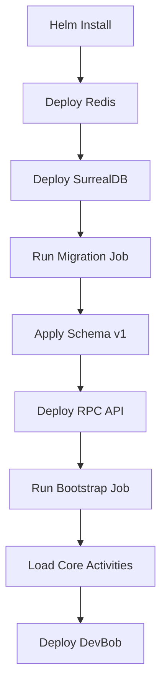
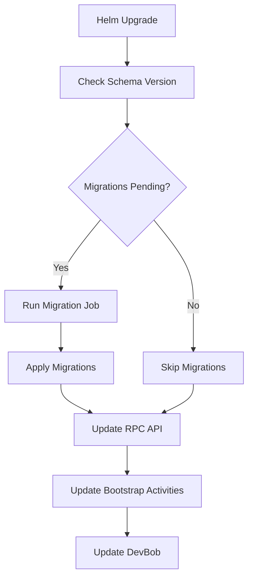

# Database Migration & Bootstrap Architecture Plan

## Problem Statement

Current deployment has critical architectural issues:
1. ❌ Database schemas stored in project root (`initialize-surrealdb-schema.sql`)
2. ❌ No migration versioning or tracking
3. ❌ Manual schema initialization required
4. ❌ No bootstrap activity loader
5. ❌ Schemas disconnected from proto data models

## Proposed Architecture

### 1. Schema Source of Truth: **metabob-proto**

**Location:** `repos/metabob-proto/`

```
metabob-proto/
├── proto/metabob/           # Proto definitions (existing)
│   ├── activity/
│   ├── auth/
│   ├── common/
│   ├── learning/
│   ├── metrics/
│   └── session/
│
├── migrations/              # NEW: Migration system
│   ├── versions/           
│   │   ├── 001_initial_schema.sql
│   │   ├── 002_add_failure_patterns.sql
│   │   ├── 003_add_activity_content.sql
│   │   └── ...
│   ├── schema.surql        # Generated from proto (via generate_surreal_schema.py)
│   ├── version.txt         # Current schema version
│   └── README.md           # Migration guide
│
├── activities/              # Core bootstrap activities (existing)
│   └── bootstrap/
│       ├── create-activity.json
│       ├── debug-activity-self-contained.json
│       ├── evolve-activity-self-contained.json
│       ├── manage-session-memory.json
│       ├── trace-data-flow-single-feature.json
│       └── trace-enforce-validate-loop.json
│
└── scripts/
    ├── generate_surreal_schema.py  # Existing
    ├── migrate.py                   # NEW: Migration runner
    └── bootstrap_activities.py      # NEW: Activity loader
```

### 2. Migration Infrastructure in metabob-rpc-api

**Location:** `repos/metabob-rpc-api/tasks/migrations/`

```python
# tasks/migrations/__init__.py
"""
Database migration system integrated with metabob-proto schemas
"""

# tasks/migrations/runner.py
class MigrationRunner:
    async def apply_pending_migrations()
    async def get_current_version()
    async def rollback(version)
    
# tasks/migrations/validator.py
class SchemaValidator:
    async def validate_current_schema()
    async def compare_with_proto_schema()
```

### 3. Helm Job Integration

**Location:** `helm/charts/metabob-migrations/` (NEW CHART)

```yaml
# helm/charts/metabob-migrations/templates/job.yaml
apiVersion: batch/v1
kind: Job
metadata:
  name: metabob-migrations-{{ .Values.version }}
  annotations:
    helm.sh/hook: pre-install,pre-upgrade
    helm.sh/hook-weight: "1"
    helm.sh/hook-delete-policy: before-hook-creation
spec:
  template:
    spec:
      containers:
      - name: migrations
        image: metabob-rpc-api:{{ .Values.image.tag }}
        command: ["python", "-m", "tasks.migrations.runner"]
        env:
          - name: SURREAL_HOST
            value: {{ .Values.database.host }}
          - name: SURREAL_NAMESPACE
            value: {{ .Values.database.namespace }}
          - name: SURREAL_DATABASE
            value: {{ .Values.database.name }}
          - name: MIGRATION_SOURCE
            value: /app/migrations
        volumeMounts:
          - name: migrations
            mountPath: /app/migrations
            readOnly: true
      volumes:
        - name: migrations
          configMap:
            name: database-migrations
      restartPolicy: OnFailure
```

### 4. Activity Bootstrap System

**Location:** `helm/charts/metabob-rpc-api/` (add to existing chart)

```yaml
# helm/charts/metabob-rpc-api/templates/bootstrap-job.yaml
apiVersion: batch/v1
kind: Job
metadata:
  name: metabob-bootstrap-activities-{{ .Values.version }}
  annotations:
    helm.sh/hook: post-install,post-upgrade
    helm.sh/hook-weight: "2"
    helm.sh/hook-delete-policy: hook-succeeded
spec:
  template:
    spec:
      containers:
      - name: bootstrap
        image: metabob-rpc-api:{{ .Values.image.tag }}
        command: ["python", "-m", "tasks.bootstrap.activities"]
        env:
          - name: SURREAL_HOST
            value: {{ .Values.database.host }}
        volumeMounts:
          - name: activities
            mountPath: /app/activities
            readOnly: true
      volumes:
        - name: activities
          configMap:
            name: bootstrap-activities
      restartPolicy: OnFailure
```

### 5. Updated Helmfile Deployment Order

```yaml
# helm/helmfile.yaml
releases:
  - name: redis
    # ... existing config

  - name: surrealdb
    # ... existing config
    needs: [redis]

  # NEW: Database migrations (runs BEFORE app deployments)
  - name: metabob-migrations
    chart: ./charts/metabob-migrations
    namespace: metabob
    values:
      - charts/metabob-migrations.values.yaml
    needs: [surrealdb]

  - name: metabob-rpc-api
    # ... existing config
    needs: [metabob-migrations]  # UPDATED dependency

  - name: devbob
    # ... existing config
    needs: [metabob-rpc-api]
```

## Implementation Workflow

### Phase 1: Migration System in metabob-proto

1. **Create migration directory structure**
   ```bash
   mkdir -p repos/metabob-proto/migrations/versions
   ```

2. **Generate initial schema from proto**
   ```bash
   cd repos/metabob-proto
   python scripts/generate_surreal_schema.py --output migrations/schema.surql
   ```

3. **Create versioned migrations**
   - Split existing schema into logical migrations
   - Add version tracking table
   - Document migration process

4. **Add migration runner script**
   - `scripts/migrate.py` - Apply migrations in order
   - Track schema version in database
   - Validate before and after

### Phase 2: Bootstrap Activity System

1. **Create bootstrap loader**
   ```python
   # repos/metabob-proto/scripts/bootstrap_activities.py
   async def load_bootstrap_activities():
       """Load core activities from metabob-proto/activities/bootstrap/"""
       # Read activity JSON files
       # Register with SurrealDB activity_template table
       # Verify successful registration
   ```

2. **Package activities with proto**
   - Activities distributed as part of metabob-proto package
   - Version-locked with schema
   - Validated during build

### Phase 3: Helm Integration

1. **Create migration Helm chart**
   - Job that runs before app deployment
   - ConfigMap with migration SQL
   - Version tracking via annotations

2. **Create bootstrap Job in rpc-api chart**
   - Runs after migrations
   - Loads core activities
   - Idempotent (safe to re-run)

3. **Update Helmfile dependencies**
   - migrations → rpc-api → devbob
   - Ensure order of operations

### Phase 4: CI/CD Integration

1. **Build pipeline updates**
   ```yaml
   # .github/workflows/deploy.yaml
   - name: Generate schema
     run: |
       cd repos/metabob-proto
       python scripts/generate_surreal_schema.py --output migrations/schema.surql
   
   - name: Package migrations
     run: |
       kubectl create configmap database-migrations \
         --from-file=repos/metabob-proto/migrations/versions/ \
         --dry-run=client -o yaml > migrations.yaml
   
   - name: Package activities
     run: |
       kubectl create configmap bootstrap-activities \
         --from-file=repos/metabob-proto/activities/bootstrap/ \
         --dry-run=client -o yaml > activities.yaml
   ```

## Migration Versioning Strategy

### Schema Version Table

```sql
-- migrations/versions/000_schema_version.sql
USE NS metabob DB devbob;

DEFINE TABLE IF NOT EXISTS schema_version SCHEMAFULL;
DEFINE FIELD version ON schema_version TYPE int;
DEFINE FIELD applied_at ON schema_version TYPE datetime DEFAULT time::now();
DEFINE FIELD applied_by ON schema_version TYPE string;
DEFINE FIELD description ON schema_version TYPE string;

DEFINE INDEX version_idx ON schema_version FIELDS version UNIQUE;
```

### Migration File Format

```sql
-- migrations/versions/001_initial_schema.sql
-- Version: 1
-- Description: Initial activity tracking schema
-- Depends: None

USE NS metabob DB devbob;

-- Your schema DDL here
DEFINE TABLE activity_execution SCHEMAFULL;
-- ...

-- Record migration
INSERT INTO schema_version (version, applied_by, description) 
VALUES (1, 'migration-runner', 'Initial activity tracking schema');
```

## Bootstrap Activity Loading

### Activity Manifest

```json
// repos/metabob-proto/activities/bootstrap/manifest.json
{
  "version": "1.0.0",
  "activities": [
    {
      "id": "create-activity",
      "file": "create-activity.json",
      "required": true,
      "description": "Core template creation activity"
    },
    {
      "id": "manage-session-memory",
      "file": "manage-session-memory.json",
      "required": true,
      "description": "Memory management for sessions"
    }
  ]
}
```

### Loader Logic

```python
# repos/metabob-proto/scripts/bootstrap_activities.py
async def bootstrap():
    manifest = load_manifest()
    
    for activity in manifest['activities']:
        template = load_json(f"activities/bootstrap/{activity['file']}")
        
        # Register with database
        await register_template(template)
        
        # Validate registration
        result = await verify_template(template['id'])
        
        if not result and activity['required']:
            raise Exception(f"Failed to bootstrap required activity: {activity['id']}")
```

## Deployment Flow

### Initial Deployment (New Cluster)



### Upgrade Deployment (Existing Cluster)



## Benefits

### ✅ Single Source of Truth
- Proto definitions drive both API contracts AND database schema
- No schema drift between code and database

### ✅ Version Control
- Migrations tracked in git
- Rollback capability
- Audit trail of schema changes

### ✅ Automated Deployment
- No manual schema initialization
- Idempotent (safe to re-run)
- Fail-fast on errors

### ✅ Activity Distribution
- Core activities packaged with proto
- Version-locked with schema
- Guaranteed availability

### ✅ Multi-Environment Support
- Same migration process for dev/staging/prod
- Environment-specific values via Helmfile
- Consistent behavior across environments

## Testing Strategy

### 1. Migration Testing
```bash
# Test migrations locally
cd repos/metabob-proto
python scripts/migrate.py --dry-run --target-version 5

# Validate schema after migration
python scripts/migrate.py --validate
```

### 2. Bootstrap Testing
```bash
# Test activity loading
python scripts/bootstrap_activities.py --dry-run

# Verify activities in database
python -c "from scripts.bootstrap_activities import verify_all; verify_all()"
```

### 3. End-to-End Deployment Test
```bash
# Deploy to local k8s
helmfile -e local sync

# Verify migration Job succeeded
kubectl get jobs -n metabob | grep migrations

# Verify bootstrap Job succeeded
kubectl get jobs -n metabob | grep bootstrap

# Verify schema version
kubectl exec -n metabob devbob-0 -- curl http://surrealdb:8000/sql -u root:root \
  --data "USE NS metabob DB devbob; SELECT * FROM schema_version;"

# Verify activities loaded
kubectl exec -n metabob devbob-0 -- curl http://surrealdb:8000/sql -u root:root \
  --data "USE NS metabob DB devbob; SELECT COUNT() FROM activity_template GROUP ALL;"
```

## Rollout Plan

### Week 1: Foundation
- [ ] Create migration directory in metabob-proto
- [ ] Generate schema from proto definitions
- [ ] Create versioned migration files
- [ ] Add migration runner script

### Week 2: Bootstrap System
- [ ] Create bootstrap loader script
- [ ] Test activity loading locally
- [ ] Document activity manifest format

### Week 3: Helm Integration
- [ ] Create migration Helm chart
- [ ] Add bootstrap Job to rpc-api chart
- [ ] Update Helmfile dependencies
- [ ] Test in local k8s

### Week 4: Production Readiness
- [ ] Add CI/CD pipeline steps
- [ ] Write migration guide for developers
- [ ] Create rollback procedures
- [ ] Deploy to staging environment

## Success Criteria

- ✅ Zero manual database initialization steps
- ✅ All schemas generated from proto
- ✅ Migrations run automatically on deploy
- ✅ Core activities always available
- ✅ Schema version tracked in database
- ✅ Rollback capability tested
- ✅ Documentation complete

## Open Questions

1. **Migration Rollback Strategy**: How to handle data migrations that can't be reversed?
2. **Activity Versioning**: Should activities have semantic versioning separate from schema?
3. **Multi-Tenant**: How to apply migrations across multiple databases/tenants?
4. **Zero-Downtime**: Can we achieve zero-downtime migrations for large tables?

## Next Steps

1. Review this plan with team
2. Get approval on architecture decisions
3. Create implementation tasks
4. Begin Phase 1 development
