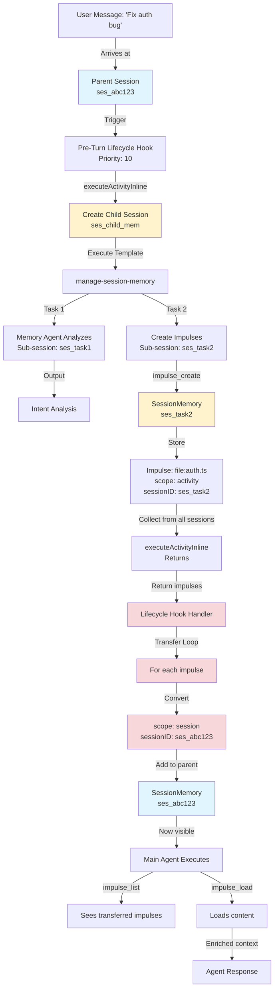
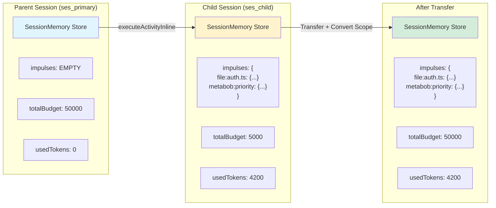
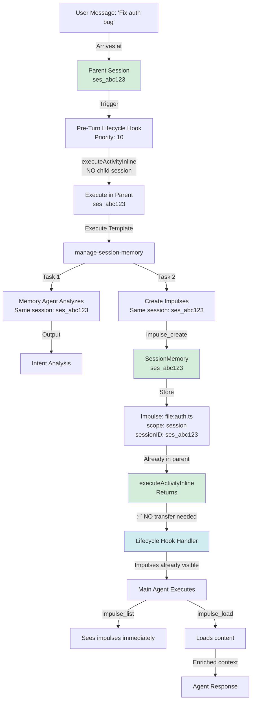
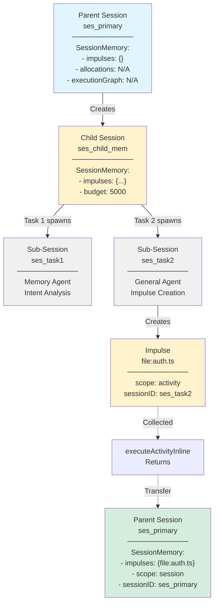
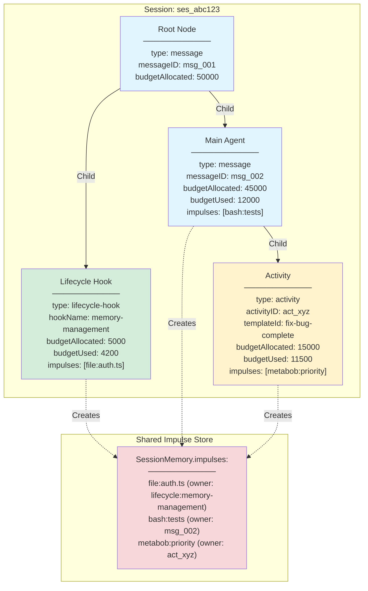
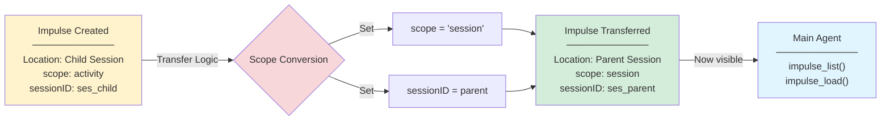
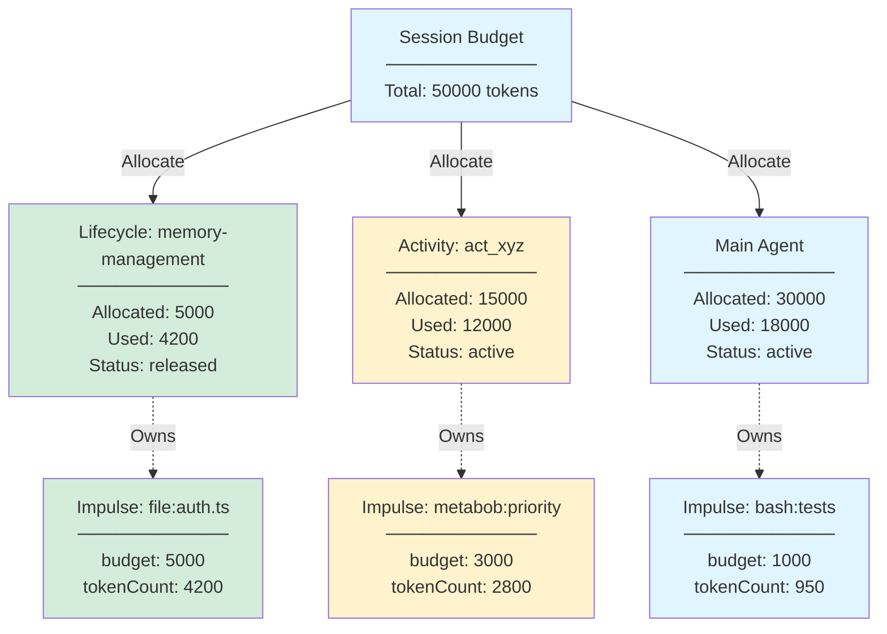
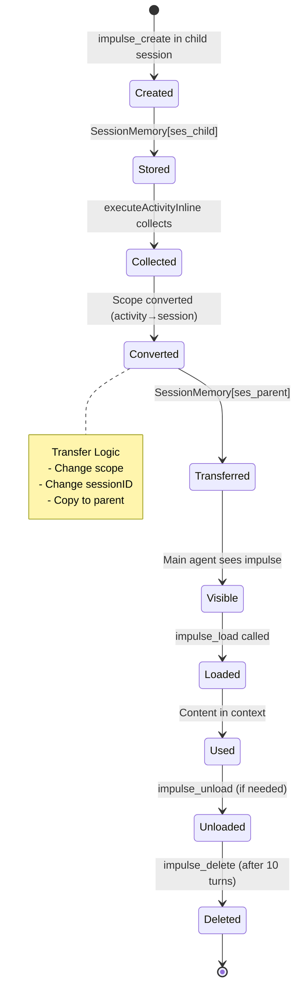
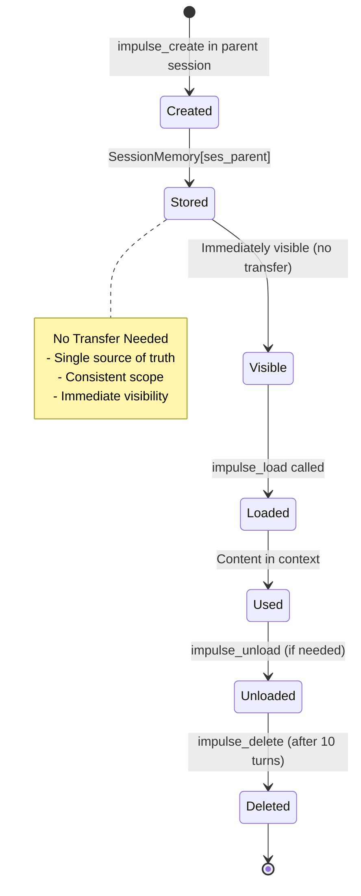
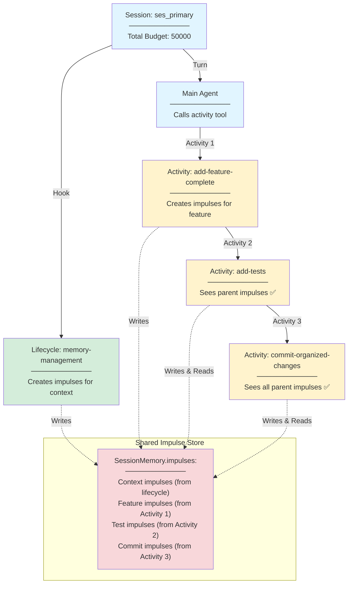

# Session Memory State Flow: Visual Diagrams

**Date**: 2026-02-24  
**Purpose**: Visual representation of how session memory and impulses flow through lifecycle hooks

---

## Diagram 1: Current Architecture - Transfer-Based Flow

### Legend
- **Blue**: Parent session storage
- **Yellow**: Child session storage
- **Red**: Transfer/conversion logic

---

## Diagram 2: State Slice Ownership (Current)

---

## Diagram 3: Planned Architecture - Unified State

### Legend
- **Green**: Single source of truth (parent session)
- **Blue**: No transfer needed

---

## Diagram 4: Session Hierarchy (Current)

---

## Diagram 5: Execution Graph (Planned)

---

## Diagram 6: Scope Conversion Rules

---

## Diagram 7: Budget Allocation (Planned)

---

## Diagram 8: Impulse Lifecycle (Current)

---

## Diagram 9: Impulse Lifecycle (Planned)

---

## Diagram 10: Multi-Activity Composition (Planned)

### Key Insight
With unified state, each nested activity can:
- ✅ Read impulses created by previous activities
- ✅ Create new impulses visible to subsequent activities
- ✅ No transfer logic needed at any level

---

## Summary: Visual Comparison

| Aspect | Current (Transfer-Based) | Planned (Unified) |
|--------|-------------------------|-------------------|
| **Session Creation** | Child sessions for isolation | Execute in parent session |
| **Impulse Storage** | Child SessionMemory | Parent SessionMemory |
| **Transfer Logic** | Required (scope conversion) | Not needed |
| **Visibility** | After transfer only | Immediate |
| **Complexity** | High (3 stages) | Low (1 stage) |
| **Nested Activities** | Manual propagation | Automatic sharing |
| **Budget Tracking** | Not implemented | Tracked per activity |
| **Execution Graph** | Not implemented | Full hierarchy |

---

## References

- **Implementation Trace**: `SESSION_MEMORY_LIFECYCLE_TRACING.md`
- **Architecture Spec**: `docs/architecture/SHARED_INSTRUCTIONAL_STATE_COMPLETE_ARCHITECTURE.md`
- **Code Files**:
  - `src/session/turn-lifecycle-hooks.ts`
  - `src/tool/activity.ts`
  - `src/session/session-memory.ts`
