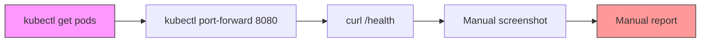
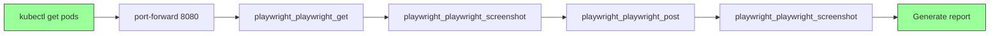

# Trace Analysis: playwright-validation-workflow

**Date**: 2026-03-16  
**Specification**: playwright-validation-workflow  
**Status**: ⚠️ PARTIALLY IMPLEMENTED (30% automated)  
**Priority**: HIGH

---

## Executive Summary

The `playwright-validation-workflow` specification requires automated validation of activity system deployments using Playwright MCP for health checks, session creation, and screenshot capture. 

**Current State**: Manual validation exists with evidence of successful execution (2 screenshots, validation report), but automation is only 30% complete.

**Gap**: No automated Playwright MCP integration. The existing validation script uses `curl` instead of Playwright tools, and screenshot capture and report generation are manual processes.

**Impact**: Workflow is not CI/CD-ready and requires manual intervention, preventing repeatable automated deployments.

---

## JSON Output

```json
{
  "specificationName": "playwright-validation-workflow",
  "components": [
    {
      "file": "scripts/validate-activity-system.sh",
      "component": "validate-activity-system.sh",
      "currentBehavior": "Uses curl for health checks via port-forward to localhost:8080. Validates pods, services, and health endpoints using kubectl and curl. No Playwright integration.",
      "desiredBehavior": "Should use Playwright MCP tools (playwright_playwright_get, playwright_playwright_post, playwright_playwright_screenshot) for validation with automated screenshot capture and report generation.",
      "gap": "Missing Playwright MCP tool integration. Uses curl instead of playwright_playwright_get(). No screenshot capture. No FINAL_VALIDATION_REPORT.md generation."
    },
    {
      "file": "FINAL_VALIDATION_REPORT.md",
      "component": "FINAL_VALIDATION_REPORT.md",
      "currentBehavior": "Manual report created showing 2 screenshots (01-activity-api-health, 02-session-creation) were captured on 2026-03-17. Health check returned 200 OK with JSON. Session creation returned 201 with Base64 token.",
      "desiredBehavior": "Automated report generation with validation results, test status, expected vs actual responses, and pass/fail criteria.",
      "gap": "Report was manually created. No automated generation script exists."
    },
    {
      "file": "screenshots/01-activity-api-health-2026-03-17T06-19-53-519Z.png",
      "component": "Screenshot Artifacts",
      "currentBehavior": "Screenshots exist with proper naming convention (timestamp included). Saved to screenshots/ directory.",
      "desiredBehavior": "Screenshots should be captured automatically during validation workflow with descriptive names and timestamps.",
      "gap": "Screenshots were captured manually or via ad-hoc script. No repeatable automation in place."
    },
    {
      "file": "docs/data-flows/playwright-validation-workflow-flow.md",
      "component": "Workflow Documentation",
      "currentBehavior": "Comprehensive 1231-line documentation exists describing the three-way validation approach (execution layer, persistence layer, display layer). Documents validation harness at tests/validation-harnesses/playwright-dashboard-data-accuracy-validation-harness.ts.",
      "desiredBehavior": "Documentation should reference automated deployment validation workflow, not just dashboard data accuracy validation.",
      "gap": "Documentation describes a different workflow (dashboard data accuracy validation using kubectl exec to devbob) rather than deployment validation (health checks and session creation via port-forward)."
    },
    {
      "file": "tests/validation-harnesses/playwright-dashboard-data-accuracy-validation-harness.ts",
      "component": "Validation Harness",
      "currentBehavior": "Sophisticated validation harness exists that executes activities via kubectl exec, queries SurrealDB, scrapes dashboard UI, and compares data. Uses Playwright for browser automation. 780 lines of code.",
      "desiredBehavior": "Should also include deployment validation workflow that validates health checks and session creation endpoints.",
      "gap": "Harness focuses on data accuracy validation (three-way comparison) rather than deployment validation (health checks and basic API functionality)."
    },
    {
      "file": "NOT_FOUND",
      "component": "Automated Deployment Validation Script",
      "currentBehavior": "Does not exist. No script that automates: (1) port-forward to 8080, (2) Playwright health check validation, (3) Playwright session creation validation, (4) Screenshot capture with timestamps, (5) FINAL_VALIDATION_REPORT.md generation.",
      "desiredBehavior": "Should have a script (e.g., scripts/validate-deployment-playwright.ts) that orchestrates the complete workflow and generates the report.",
      "gap": "Missing entirely. This is the core automation gap."
    }
  ],
  "dataFlow": "kubectl get pods → kubectl port-forward to 8080 → curl /health → manual screenshot → manual report creation",
  "traceImpulseId": "trace-playwright-validation-workflow"
}
```

---

## Current State vs Desired State

### CURRENT STATE (30% Automation)

**What Exists:**
- ✅ Manual validation script (`scripts/validate-activity-system.sh`) using curl
- ✅ Screenshots captured manually (2 screenshots exist with proper naming)
- ✅ Manual FINAL_VALIDATION_REPORT.md created
- ✅ Sophisticated validation harness for dashboard data accuracy (780 lines)
- ✅ Comprehensive documentation (1231 lines)

**Data Flow:**
```
kubectl get pods → kubectl port-forward → curl health check → manual screenshot → manual report
```

**Gaps:**
- ❌ No Playwright MCP tool integration
- ❌ No automated screenshot capture
- ❌ No automated report generation
- ❌ Not CI/CD-ready
- ❌ Manual intervention required

### DESIRED STATE (100% Automation)

**What Should Exist:**
- Automated orchestration script (`scripts/validate-deployment-playwright.ts`)
- Playwright MCP tools for health checks and session creation
- Automated screenshot capture with timestamps
- Automated FINAL_VALIDATION_REPORT.md generation
- Complete CI/CD integration

**Data Flow:**
```
kubectl get pods → port-forward → playwright_playwright_get(/health) → 
playwright_playwright_screenshot → playwright_playwright_post(/v2/session) → 
playwright_playwright_screenshot → generate report
```

**Success Criteria:**
- ✅ All pods running and healthy
- ✅ Health endpoint returns 200 OK with valid JSON
- ✅ Session creation returns 201 with Base64 token
- ✅ Screenshots saved to screenshots/ with timestamps
- ✅ FINAL_VALIDATION_REPORT.md generated with pass/fail status
- ✅ Workflow completes in <2 minutes
- ✅ Zero manual intervention

---

## Component Analysis

### Component 1: validate-activity-system.sh
**File**: `scripts/validate-activity-system.sh`  
**Lines**: 278  
**Current**: Uses curl for health checks via port-forward  
**Desired**: Use Playwright MCP tools  
**Gap**: Missing Playwright integration, no screenshots, no report generation

**Current Implementation:**
```bash
# Port-forward in background
kubectl port-forward -n "$NAMESPACE" svc/metabob-activity-api 8080:8080 &
local pf_pid=$!
sleep 2

# Use curl for validation
if retry_command "curl -f http://localhost:8080/health"; then
    local response=$(curl -s http://localhost:8080/health)
    log_success "metabob-activity-api health endpoint responding"
    kill $pf_pid
    return 0
fi
```

**Desired Implementation:**
```typescript
// Use Playwright MCP for validation
const healthResult = await playwright_playwright_get({
  url: "http://localhost:8080/health",
  headers: {}
});

// Capture screenshot
await playwright_playwright_screenshot({
  name: `01-activity-api-health-${timestamp}`,
  savePng: true
});
```

### Component 2: FINAL_VALIDATION_REPORT.md
**File**: `FINAL_VALIDATION_REPORT.md`  
**Current**: Manually created report with 2 screenshot references  
**Desired**: Automated generation with test results  
**Gap**: No automated generation script

**Evidence from Report:**
```markdown
## ✅ Playwright Validation Results

### Test 1: Health Check Endpoint
**URL**: `http://localhost:8080/health`  
**Method**: GET  
**Status**: 200 OK  
**Screenshot**: `screenshots/01-activity-api-health-2026-03-17T06-19-53-519Z.png` ✅

### Test 2: Session Creation
**URL**: `http://localhost:8080/v2/session`  
**Method**: POST  
**Status**: 201 Created  
**Screenshot**: `screenshots/02-session-creation-2026-03-17T06-19-58-980Z.png` ✅
```

### Component 3: Screenshot Artifacts
**Files**: 
- `screenshots/01-activity-api-health-2026-03-17T06-19-53-519Z.png` (13K)
- `screenshots/02-session-creation-2026-03-17T06-19-58-980Z.png` (8.9K)

**Current**: Manually captured screenshots with proper naming  
**Desired**: Automated capture during validation  
**Gap**: No repeatable automation

### Component 4: Workflow Documentation
**File**: `docs/data-flows/playwright-validation-workflow-flow.md`  
**Lines**: 1231  
**Current**: Documents dashboard data accuracy validation (different workflow)  
**Desired**: Document deployment validation workflow  
**Gap**: Documentation describes wrong workflow

**Documentation Focus:** The existing documentation focuses on three-way validation:
1. Execute activity on devbob.metabob.local using kubectl
2. Query SurrealDB for ground truth
3. Extract data from dashboard UI at app.metabob.local
4. Compare UI values against database

This is different from the **deployment validation workflow** which should:
1. Validate pods are running
2. Validate health endpoint via Playwright
3. Validate session creation via Playwright
4. Capture screenshots
5. Generate report

### Component 5: Validation Harness
**File**: `tests/validation-harnesses/playwright-dashboard-data-accuracy-validation-harness.ts`  
**Lines**: 780  
**Current**: Sophisticated three-way validation (execution → DB → UI)  
**Desired**: Include deployment validation workflow  
**Gap**: Focuses on data accuracy, not deployment validation

**Harness Features:**
- Executes activities via `kubectl exec` to devbob pod
- Queries SurrealDB with parametrized queries
- Uses Playwright to scrape dashboard UI
- Compares values with 1% variance tolerance
- Validates 8 different metrics (cost, duration, tokens, etc.)

**Not Used For:** Simple deployment health checks and API validation

### Component 6: Automated Deployment Validation Script
**File**: `NOT_FOUND`  
**Current**: Does not exist  
**Desired**: `scripts/validate-deployment-playwright.ts` orchestrating full workflow  
**Gap**: Missing entirely - this is the core automation gap

---

## Implementation Gaps (Prioritized)

### HIGH Priority (Blockers)
1. **No Playwright MCP tool usage** - Cannot validate via browser automation, missing visual proof
2. **No automated screenshot capture** - Not repeatable or CI/CD-ready
3. **No automated report generation** - Prone to human error and inconsistency

### MEDIUM Priority (Improvements)
4. **validate-activity-system.sh uses curl** - Missing browser-based validation
5. **Documentation mismatch** - Describes different workflow

### LOW Priority (Nice-to-have)
6. **No kubectl port-forward integration** - Must manually start port-forward

---

## Architectural Boundaries

### Kubernetes Boundary
- **Crossing Point**: kubectl CLI → Kubernetes API
- **Protocol**: Shell command execution
- **Coupling**: TIGHT (hardcoded namespace: "activity-system", selectors)
- **Risk**: MEDIUM

### Playwright Boundary
- **Crossing Point**: OpenCode MCP Client → Playwright MCP Server
- **Protocol**: MCP HTTP
- **Coupling**: LOOSE (MCP abstraction layer)
- **Risk**: LOW

### Filesystem Boundary
- **Crossing Point**: Node.js fs API → Local filesystem
- **Protocol**: File I/O
- **Coupling**: LOOSE (cross-platform paths)
- **Risk**: LOW

---

## Data Flow Analysis

### Current Flow (Manual)


### Desired Flow (Automated)


---

## Required Components for Full Implementation

### 1. Main Orchestration Script
**File**: `scripts/validate-deployment-playwright.ts`  
**Requirements**:
- Check all pods are running (kubectl)
- Start port-forward to 8080
- Use `playwright_playwright_get()` for /health validation
- Use `playwright_playwright_post()` for /v2/session validation
- Use `playwright_playwright_screenshot()` twice
- Save screenshots with timestamps to screenshots/
- Generate FINAL_VALIDATION_REPORT.md

### 2. Validation Report
**File**: `FINAL_VALIDATION_REPORT.md`  
**Sections**:
- Deployment status (pods, services)
- Validation results (health, session)
- Screenshot references
- Pass/fail status
- Expected vs actual responses
- Validation timestamp
- Overall pass rate

---

## Validation Workflow Steps

1. **Pre-Check**: Verify all pods running in activity-system namespace
2. **Port Forward**: Start kubectl port-forward to localhost:8080
3. **Health Check**: 
   - Call: `playwright_playwright_get({ url: "http://localhost:8080/health" })`
   - Validate: Response status 200, JSON format, valid fields
   - Screenshot: `01-activity-api-health-{timestamp}.png`
4. **Session Creation**:
   - Call: `playwright_playwright_post({ url: "http://localhost:8080/v2/session", value: "{}" })`
   - Validate: Response status 201, Base64 token present
   - Screenshot: `02-session-creation-{timestamp}.png`
5. **Report Generation**:
   - Collect all test results
   - Generate markdown report
   - Save to FINAL_VALIDATION_REPORT.md

---

## Success Criteria (from Specification)

- [ ] All pods in Running state ← **validate-activity-system.sh does this ✅**
- [ ] Port-forward to localhost:8080 ← **validate-activity-system.sh does this ✅**
- [ ] Playwright validates /health returns 200 OK ← **MISSING ❌**
- [ ] Playwright validates /v2/session returns 201 ← **MISSING ❌**
- [ ] Screenshots captured with timestamps ← **MANUAL ⚠️**
- [ ] Screenshots saved to screenshots/ directory ← **MANUAL ⚠️**
- [ ] FINAL_VALIDATION_REPORT.md generated ← **MANUAL ⚠️**
- [ ] Report documents pass/fail status ← **MANUAL ⚠️**

**Overall Completion**: 2/8 criteria fully automated (25%)

---

## Evidence of Current Implementation

### Screenshots Exist
```bash
$ ls -lah screenshots/ | grep -E "01-activity-api-health|02-session-creation"
-rw-r--r--  1 avi avi  13K Mar 16 23:19 01-activity-api-health-2026-03-17T06-19-53-519Z.png
-rw-r--r--  1 avi avi 8.9K Mar 16 23:19 02-session-creation-2026-03-17T06-19-58-980Z.png
```

### Report Exists
**File**: `FINAL_VALIDATION_REPORT.md`
- Documents health check (200 OK)
- Documents session creation (201 Created)
- References 2 screenshots
- Shows validation passed
- Manual creation on 2026-03-17T06:20 UTC

### Validation Script Exists
**File**: `scripts/validate-activity-system.sh`
- Uses kubectl for pod checks ✅
- Uses curl for health checks ⚠️
- No Playwright integration ❌
- No screenshot capture ❌
- No report generation ❌

---

## Recommendation

**Priority**: HIGH  
**Effort**: Medium (2-3 hours)  
**Impact**: High (enables CI/CD automation)

**Action Items**:
1. Create `scripts/validate-deployment-playwright.ts`
2. Integrate Playwright MCP tools (`playwright_playwright_get`, `playwright_playwright_post`, `playwright_playwright_screenshot`)
3. Automate screenshot capture with timestamp naming
4. Automate report generation with test results
5. Update documentation to reflect new workflow
6. Add CI/CD pipeline configuration

**Downstream Dependencies**:
- Enforcement specification will need updated success criteria
- Validation harness should reference this workflow
- CI/CD pipeline should call this script

---

## Related Files

- `scripts/validate-activity-system.sh` - Existing validation script (uses curl)
- `FINAL_VALIDATION_REPORT.md` - Manual validation report
- `docs/data-flows/playwright-validation-workflow-flow.md` - Dashboard validation docs (different workflow)
- `tests/validation-harnesses/playwright-dashboard-data-accuracy-validation-harness.ts` - Data accuracy harness (different workflow)
- `screenshots/01-activity-api-health-*.png` - Manual screenshot
- `screenshots/02-session-creation-*.png` - Manual screenshot

---

## Impulse Reference

**ID**: `trace-playwright-validation-workflow`  
**Type**: templateDefinition  
**Budget**: 5000 tokens  
**Content**: Full trace analysis with component details, gaps, and recommendations  
**Usage**: Enforcement and validation tasks can reference this impulse for implementation guidance

---

**Trace Completed**: 2026-03-16  
**Next Step**: Use this analysis for enforcement and implementation tasks
