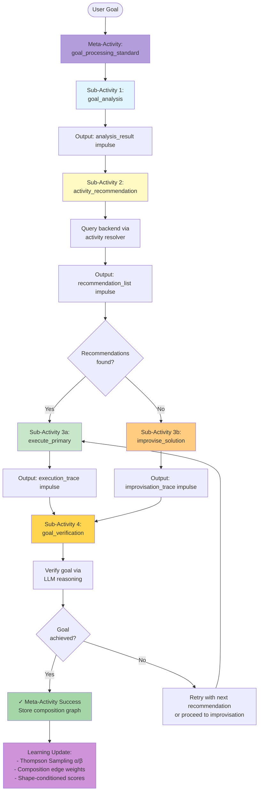
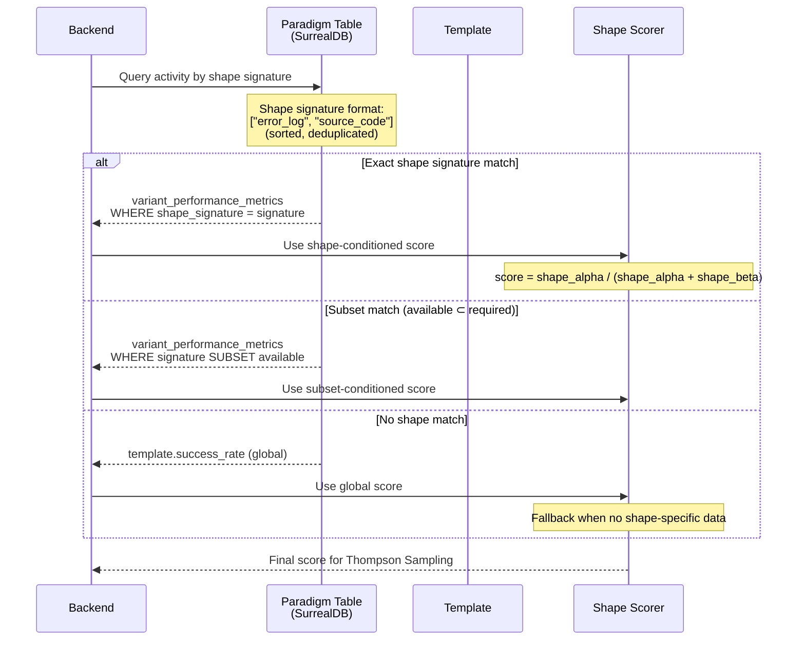
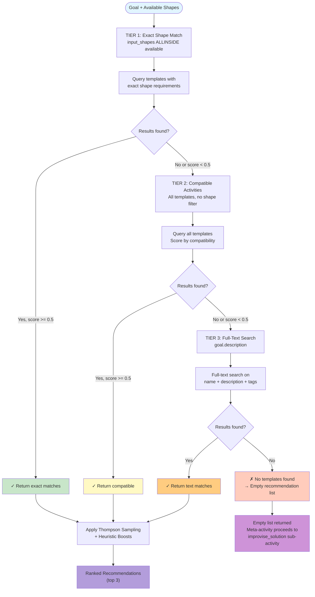

# Activity Selection from Impulse State Space

> **Status (2026-05-27):** Conceptual flow (Thompson Sampling, tiered fallback, composition chain, impulse state space) is still accurate. All `GoalProcessor (goal-processor.ts)` and `ActivityExecutor (activity.ts)` references now map to `GoalHost` inside `goal-host-vessel` / `ias-executor-ts` — those files no longer exist in `repos/minibob/src/`. Line-number citations are stale; use `repos/goal-host-vessel/` and `@avigopal/ias-executor-ts` for implementation navigation.

## Overview

This document maps the complete flow from user goal to activity execution through Thompson Sampling recommendation. The activity selection process is the entry point for all MiniBob executions, determining which activity template should be used to achieve a given goal.

**Key Architectural Shift:** Goal processing is itself a meta-activity that composes other activities. There is no branching between "activity execution" and "improvisation" - everything flows through the activity composition system.

## Key Concepts

1. **Composition-Based Architecture** - Goal processing is a meta-activity that orchestrates sub-activities
2. **Impulse State Space** - Available shapes and impulses inform activity compatibility
3. **Thompson Sampling** - Probabilistic template selection that learns which variants perform best
4. **Tiered Fallback** - Three-tier query strategy (exact → compatible → full-text search)
5. **Heuristic Boosts** - 8 boost components + 1 mismatch penalty influence exploration-exploitation balance
6. **Shape-Conditioned Scoring** - Activities scored based on impulse state space compatibility
7. **Correlation Tracking** - Links selection decisions to execution outcomes for learning
8. **Recursive Composition** - Activities can invoke other activities as sub-tasks

## Main Sequence Diagram

```mermaid
sequenceDiagram
    participant User as User/CLI
    participant GP as GoalProcessor<br/>(goal-processor.ts)
    participant SSM as StateSpaceManager<br/>(state-space-manager.ts)
    participant Backend as Activity API<br/>(activities.ts)
    participant TS as Thompson Sampling<br/>(paradigm.ts)
    participant Exec as ActivityExecutor<br/>(activity.ts)

    User->>GP: processGoal(message)
    activate GP

    rect rgb(240, 248, 255)
    Note over GP: META-ACTIVITY LOADING
    GP->>Backend: Load goal_processing_standard template
    Backend-->>GP: Meta-activity template with composition chain
    Note over GP: Template defines sub-activities:<br/>1. goal_analysis<br/>2. activity_recommendation<br/>3. execute_primary<br/>4. goal_verification<br/>5. improvise_solution (if needed)
    end

    rect rgb(255, 250, 240)
    Note over GP,SSM: SUB-ACTIVITY 1: GOAL ANALYSIS
    GP->>SSM: getAvailableShapes()
    SSM-->>GP: Set<string> shapes
    GP->>SSM: getShapeSignature()
    Note over SSM: Return sorted, deduplicated<br/>shape list for matching
    SSM-->>GP: string[] signature
    GP->>Exec: Execute goal_analysis activity
    Note over Exec: LLM semantic analysis:<br/>- Extract category<br/>- Identify intent<br/>- Detect capabilities needed<br/>- Parse constraints
    Exec-->>GP: Analysis result impulse
    end

    rect rgb(240, 255, 240)
    Note over GP,Backend: SUB-ACTIVITY 2: ACTIVITY RECOMMENDATION
    GP->>Backend: POST /v2/activities/recommend<br/>(activities.ts:3080-3116)
    Note over Backend: Request:<br/>{<br/>  goal: enriched_description,<br/>  shapes: available_shapes,<br/>  category: detected_category,<br/>  limit: 3<br/>}

    activate Backend

    rect rgb(250, 250, 255)
    Note over Backend,TS: TIER 1: Exact Shape Match
    Backend->>TS: query(input_shapes ALLINSIDE shapes)<br/>(paradigm.ts:2915-3049)
    TS-->>Backend: Templates with exact match

    alt Exact matches found (score >= 0.5)
        Note over Backend: ✓ Use exact matches
    else No exact matches
        Note over Backend,TS: TIER 2: Compatible Activities
        Backend->>TS: query(all activities, no shape filter)
        TS-->>Backend: All templates (compatibility scored)

        alt Compatible found (score >= 0.5)
            Note over Backend: ✓ Use compatible
        else No compatible
            Note over Backend,TS: TIER 3: Full-Text Search
            Backend->>TS: fullTextSearch(goal.description)
            TS-->>Backend: Text-matched templates
        end
    end
    end

    rect rgb(255, 245, 230)
    Note over Backend,TS: THOMPSON SAMPLING WITH BOOSTS

    loop For each candidate template
        Backend->>TS: computeHeuristicBoosts(template, goal)<br/>(activities.ts:3285-3340)

        Note over TS: 9 BOOST/PENALTY COMPONENTS:
        Note over TS: 1. Tag Match Quality (+0 to +10)<br/>   - Exact: +10, Partial: +5, None: 0<br/>   (tagBoost = floor(quality * 10))
        Note over TS: 2. Shape Compatibility (+3)<br/>   - All required shapes available
        Note over TS: 3. Recency (+1)<br/>   - Recently used templates
        Note over TS: 4. Execution History (+1 to +3)<br/>   - min(3, floor(executionCount / 20))<br/>   (rebalanced 2026-04-22 to favor semantic relevance)
        Note over TS: 5. Scope Preference (+1)<br/>   - Local > file_write > read_only
        Note over TS: 6. Impulse Relevancy (+variable)<br/>   - Computed from relevance metrics
        Note over TS: 7. Category Match (+3)<br/>   - Exact category match
        Note over TS: 8. Output Shape Coverage (+0 to +4)<br/>   - Produces expected shapes
        Note over TS: 9. Shape Mismatch Penalty (−2 × missing)<br/>   - Only when effectiveShapes provided<br/>   - Penalizes templates that can't run with<br/>     the available context (added 2026-04-22)

        TS->>TS: totalBoost = sum(boosts)
        TS->>TS: alpha += totalBoost
        TS->>TS: score = Beta(alpha, beta).sample()
        Note over TS: Beta distribution:<br/>α = successes + boosts<br/>β = failures
    end

    Backend->>Backend: sortByScore(templates)
    Backend->>Backend: selectTopN(limit=3)
    end

    Backend-->>GP: ActivityRecommendation[]<br/>{<br/>  template_id,<br/>  confidence: score,<br/>  thompson_metadata: {α, β},<br/>  boost_breakdown<br/>}
    deactivate Backend
    end

    rect rgb(255, 240, 245)
    Note over GP,Exec: SUB-ACTIVITY 3: EXECUTE PRIMARY

    alt Recommendations found
        GP->>GP: selectBestTemplate(recommendations)
        Note over GP: Select highest confidence<br/>(or user choice if interactive)

        loop For each recommendation (until success)
            GP->>Exec: executeActivity(template, impulses)
            activate Exec

            Exec->>Exec: Load impulses by shape
            Exec->>Exec: Execute tasks with LLM
            Note over Exec: Can recursively invoke<br/>other activities via<br/>activity resolver
            Exec-->>GP: ActivityExecution<br/>{<br/>  status: completed|failed,<br/>  trace: full_execution_trace<br/>}
            deactivate Exec

            alt Execution succeeded
                Note over GP: ✓ PRIMARY SUCCESS
                break Primary activity completed
            else Execution failed
                Note over GP: Try next recommendation
            end
        end
    else No recommendations
        Note over GP: ✗ No templates found<br/>Proceed to improvisation
    end
    end

    rect rgb(255, 235, 238)
    Note over GP,Exec: SUB-ACTIVITY 4: GOAL VERIFICATION
    GP->>Exec: Execute goal_verification activity
    Exec->>Exec: Verify goal achieved
    Exec-->>GP: Verification result

    alt Goal achieved
        Note over GP: ✓ GOAL COMPLETE
    else Goal not achieved
        Note over GP: Proceed to improvisation
    end
    end

    rect rgb(245, 255, 245)
    Note over GP,Exec: SUB-ACTIVITY 5: IMPROVISE SOLUTION (IF NEEDED)

    alt Goal not achieved
        GP->>Backend: Load improvise_solution template
        Backend-->>GP: Improvisation activity
        GP->>Exec: Execute improvise_solution activity
        Note over Exec: Improvisation is just another activity<br/>Not a special code path<br/>Uses activity resolver for composition
        Exec-->>GP: Improvisation result
    end
    end

    rect rgb(240, 240, 255)
    Note over GP,Backend: LEARNING FEEDBACK (ALL SUB-ACTIVITIES)

    loop For each sub-activity execution
        GP->>Backend: storeExecutionTrace(trace)<br/>+ correlation_id: parent_activity_id<br/>+ composition_edge: parent→child
        Note over Backend: Links parent activity → child activity<br/>for composition learning
    end

    GP->>Backend: storeExecutionTrace(meta_activity_trace)
    Note over Backend: Store complete composition graph:<br/>- All sub-activity edges<br/>- Overall success/failure<br/>- Composition pattern effectiveness

    Backend->>Backend: Update Thompson Sampling (α/β)
    Backend->>Backend: Update composition_edges table
    Backend->>Backend: Update variant_performance_metrics
    end

    GP-->>User: GoalResult
    deactivate GP
```

## Decomposition: Meta-Activity Composition

This diagram shows how the `goal_processing_standard` meta-activity orchestrates sub-activities in a composition chain.



**Key Points:**
- Each box represents an activity (not a code path)
- Activities communicate via impulses
- Composition edges are recorded in the database
- Meta-activities can recursively invoke other meta-activities
- All activities use the same execution engine
- Improvisation is an activity, not a fallback

**Implementation:**
- Meta-activity templates: `repos/metabob-activity-api/sql/seed/meta-activities/`
- Composition tracking: `repos/metabob-activity-api/src/routes/composition-edges.ts`
- Activity resolver: `repos/minibob/src/impulse.ts` (activity shape resolution)

## Decomposition: Shape-Conditioned Scoring

The shape-conditioned scoring system enables activity templates to have different success rates depending on the impulse state space.



**Implementation:** `repos/metabob-activity-api/src/db/paradigm.ts:797-909`

## Decomposition: Heuristic Boost Calculation

```mermaid
graph TD
    Start([Template Candidate]) --> TagMatch["1. Tag Match Quality<br/>(+0 to +10)"]

    TagMatch --> TagExact{Exact match?}
    TagExact -->|Yes| AddTen["+10"]
    TagExact -->|No| TagPartial{Partial match?}
    TagPartial -->|Yes| AddFive0["+5"]
    TagPartial -->|No| AddZero["+0"]

    AddTen --> ShapeCheck
    AddFive0 --> ShapeCheck
    AddZero --> ShapeCheck

    ShapeCheck["2. Shape Compatibility<br/>(+3)"] --> ShapeMatch{All required<br/>shapes available?}
    ShapeMatch -->|Yes| AddThree2["+3"]
    ShapeMatch -->|No| Skip2["Skip"]

    AddThree2 --> Recency
    Skip2 --> Recency

    Recency["3. Recency<br/>(+1)"] --> RecentCheck{Used recently?}
    RecentCheck -->|Yes| AddOne["+1"]
    RecentCheck -->|No| Skip3["Skip"]

    AddOne --> History
    Skip3 --> History

    History["4. Execution History<br/>(+0 to +3)<br/>min(3, floor(count / 20))"] --> ExecCount{executionCount?}
    ExecCount -->|">= 60"| AddThreeH["+3"]
    ExecCount -->|"40–59"| AddTwoH["+2"]
    ExecCount -->|"20–39"| AddOneH["+1"]
    ExecCount -->|"< 20"| AddZeroH["+0"]

    AddThreeH --> Scope
    AddTwoH --> Scope
    AddOneH --> Scope
    AddZeroH --> Scope

    Scope["5. Scope Preference<br/>(+1)"] --> ScopeCheck{Scope match?}
    ScopeCheck -->|Local| AddOne3["+1"]
    ScopeCheck -->|file_write| AddOne3
    ScopeCheck -->|Other| Skip5["Skip"]

    AddOne3 --> Impulse
    Skip5 --> Impulse

    Impulse["6. Impulse Relevancy<br/>(+variable)"] --> ImpulseCalc["Σ impulse_relevance_scores"]
    ImpulseCalc --> Category

    Category["7. Category Match<br/>(+3)"] --> CategoryCheck{Category match?}
    CategoryCheck -->|Yes| AddThree4["+3"]
    CategoryCheck -->|No| Skip7["Skip"]

    AddThree4 --> Output
    Skip7 --> Output

    Output["8. Output Shape Coverage<br/>(+0 to +4)"] --> OutputCalc["Count matching output shapes"]
    OutputCalc --> ShapePenalty["9. Shape Mismatch Penalty<br/>(−2 × missing)"]

    ShapePenalty --> ShapeMissing{effectiveShapes<br/>provided?}
    ShapeMissing -->|No| Skip9["Skip"]
    ShapeMissing -->|Yes| CountMissing["missing = effectiveShapes<br/>− templateShapes"]
    CountMissing --> ApplyPenalty["totalBoost += missing.length × −2"]

    ApplyPenalty --> FinalSum["Total Boost = Σ boosts − penalties"]
    Skip9 --> FinalSum

    FinalSum --> ApplyBoost["α += totalBoost<br/>score = Beta(α, β).sample()"]

    ApplyBoost --> End([Final Thompson Score])

    style Start fill:#e1f5ff
    style End fill:#c8e6c9
    style AddTen fill:#c8e6c9
    style AddFive0 fill:#fff9c4
    style AddThreeH fill:#c8e6c9
    style ApplyPenalty fill:#ffcdd2
    style FinalSum fill:#ffd54f
```



**Implementation:** `repos/metabob-activity-api/src/routes/activities.ts:3285-3340` (boosts 1–8), `:3757-3779` (shape mismatch penalty + boost_breakdown logging)

### How tags are extracted (Boost #1 input)

Boost #1 (Tag Match Quality) compares template tags against **prefixes extracted deterministically from the goal description**, not against the LLM semantic analysis from Sub-Activity 1. The extraction lives in `repos/metabob-activity-api/src/utils/semantic-tags.ts`:

- `KEYWORD_TO_TAGS` — a static keyword → tag-prefix map (hundreds of entries across `tool.*`, `bugfix.*`, `development.*`, `meta.*`, `feature.*`). Each keyword maps to an ordered list of prefixes (most specific first). Compound keys like `"dependency vulnerabilities"` and `"find security"` let multi-word phrases match in a single lookup.
- `extractTagPrefixes(description)` — tokenises the description and returns the union of matched prefixes.
- `calculateTagMatchQuality(extractedPrefixes, templateTags)` — scores template-tag match with a position-weighted formula: first extracted prefix contributes weight `1.0`, second `0.5`, third `0.33`, etc. A template tag counts as a match when it `startsWith(prefix)`. Final quality is `totalScore / maxScore` in `[0, 1]`; the boost is `floor(quality * 10)`.
- `analyzeTaskSemantics(description)` — the combined entry point called from `activities.ts:3533` during the recommend path.

The keyword map is evolved in-repo as new task vocabularies emerge (e.g. `23994d1` on 2026-04-22 added security-focused keys: `owasp`, `scan`, `audit`, `cve`, `resolve`, and the compound phrases above). This layer is deliberately deterministic — it exists so tag pre-filtering and Boost #1 do not depend on an LLM call. The Sub-Activity 1 LLM analysis (category/intent/capabilities) runs in parallel on the MiniBob side; the two extractions converge at the `/recommend` call.

## Decomposition: Tiered Fallback Query Strategy



**Implementation:** `repos/metabob-activity-api/src/db/paradigm.ts:2915-3049`

## Key Decision Points

### 1. Activity Composition Chain
**Location:** Meta-activity template definition (database)

```json
{
  "id": "goal_processing_standard",
  "name": "Standard Goal Processing",
  "tasks": [
    {
      "id": "goal_analysis",
      "activity_ref": "analyze_goal_structure"
    },
    {
      "id": "activity_recommendation",
      "activity_ref": "recommend_activities"
    },
    {
      "id": "execute_primary",
      "activity_ref": "execute_recommended_activity"
    },
    {
      "id": "goal_verification",
      "activity_ref": "verify_goal_completion"
    },
    {
      "id": "improvise_solution",
      "activity_ref": "improvise_until_complete",
      "condition": "goal_not_achieved"
    }
  ]
}
```

**Key Points:**
- No code-level branching between execution and improvisation
- Composition defined declaratively in database
- Can be modified without code changes
- Learning applies to composition patterns

### 2. Recommendation Evaluation
**Location:** `goal-processor.ts:906` (conceptual - actual logic in meta-activity)

```typescript
// Meta-activity evaluates recommendations
if (recommendations.length > 0 && recommendations[0].confidence >= 0.5) {
  // Execute primary activity
  return executeActivity(recommendations[0]);
} else {
  // Proceed to improvisation sub-activity
  return executeActivity("improvise_solution");
}
```

**Criteria:**
- Recommendation list not empty
- Best recommendation confidence >= 0.5
- If criteria not met, composition chain proceeds to improvisation

### 3. Goal Verification
**Location:** Composition chain (goal_verification sub-activity)

```typescript
// Executed as a sub-activity, not inline code
const verification = await executeActivity("goal_verification", {
  impulses: {
    goal: originalGoal,
    execution_trace: primaryExecution
  }
});

if (verification.status === "completed" && verification.result.achieved) {
  return { status: "success" };
} else {
  // Meta-activity proceeds to improvisation
  return executeActivity("improvise_solution");
}
```

**Key Points:**
- Verification is an activity, not a boolean check
- Uses LLM reasoning to assess goal completion
- Result determines next sub-activity in composition chain

## Data Flow Summary

```
User Goal (text)
  ↓
Load Meta-Activity (goal_processing_standard)
  ↓
Sub-Activity 1: Goal Analysis (LLM semantic extraction)
  ↓
Sub-Activity 2: Activity Recommendation
  ├─ Query impulse state space (available shapes)
  ├─ Backend Thompson Sampling
  │   ├─ Tier 1: Exact shape match
  │   ├─ Tier 2: Compatible activities
  │   └─ Tier 3: Full-text search
  ├─ Heuristic Boosts Applied (8 components + shape mismatch penalty)
  ├─ Shape-Conditioned Scoring
  └─ Return ranked recommendations (or empty list)
  ↓
Sub-Activity 3: Execute Primary (if recommendations exist)
  ├─ Execute highest-confidence activity
  ├─ Recursive composition (activities can invoke activities)
  └─ Return execution trace
  ↓
Sub-Activity 4: Goal Verification
  ├─ LLM reasoning about goal achievement
  └─ Return verification result
  ↓
Sub-Activity 5: Improvise Solution (if goal not achieved)
  ├─ Execute improvisation activity
  └─ Return improvisation trace
  ↓
Learning Feedback
  ├─ Store all sub-activity traces
  ├─ Record composition edges (parent → child)
  ├─ Update Thompson Sampling (α/β)
  └─ Update composition pattern effectiveness
```

**Key Difference from Linear Flow:**
- No if/else branching at code level
- Composition chain defined in database
- All paths are activities (including improvisation)
- Learning applies to composition patterns, not just individual activities

## Metrics Captured

At each stage, the following metrics are captured for learning:

**Selection Metrics:**
- `recommendation_id` - Unique ID for this selection
- `goal_description` - Enriched goal text
- `available_shapes` - Impulse state space
- `candidates_considered` - Number of templates evaluated
- `tier_used` - Which fallback tier matched (1, 2, or 3)
- `boost_breakdown` - Contribution of each boost component
- `selected_template_id` - Which template was chosen
- `confidence_score` - Thompson Sampling score

**Execution Metrics:**
- `correlation_id` - Links to recommendation_id
- `execution_status` - completed | failed
- `goal_achieved` - Boolean verification result
- `duration_ms` - Total execution time
- `cost_usd` - LLM API costs
- `tokens_used` - Input + output tokens

**Learning Metrics:**
- `alpha_before` / `alpha_after` - Thompson Sampling α
- `beta_before` / `beta_after` - Thompson Sampling β
- `success_rate_change` - How this execution affected rate
- `shape_signature` - For shape-conditioned scoring

**Composition Metrics (NEW):**
- `composition_pattern_id` - Which meta-activity was used
- `sub_activity_sequence` - Order of sub-activities executed
- `composition_edge_weights` - Effectiveness of parent→child relationships
- `composition_success_rate` - Success rate for this composition pattern
- `recursive_depth` - How many levels of activity nesting

## File References

| Component | File | Lines | Purpose |
|-----------|------|-------|---------|
| Goal Processing | `repos/minibob/src/goal-processor.ts` | 2565-2625 | Meta-activity orchestration |
| State Space Manager | `repos/minibob/src/state-space-manager.ts` | Full file | Shape querying, compatibility |
| Backend Recommendation | `repos/metabob-activity-api/src/routes/activities.ts` | 3080-3116 | POST /recommend endpoint |
| Thompson Sampling | `repos/metabob-activity-api/src/routes/activities.ts` | 3345 | Beta distribution sampling |
| Heuristic Boosts | `repos/metabob-activity-api/src/routes/activities.ts` | 3285-3340, 3757-3779 | 8 boost components + shape mismatch penalty |
| Tag Extraction | `repos/metabob-activity-api/src/utils/semantic-tags.ts` | Full file | Keyword→tag-prefix map + position-weighted match quality (input to Boost #1) |
| Paradigm Queries | `repos/metabob-activity-api/src/db/paradigm.ts` | 2915-3049 | Tiered fallback queries |
| Shape Scoring | `repos/metabob-activity-api/src/db/paradigm.ts` | 797-909 | Shape-conditioned scores |
| Composition Tracking | `repos/metabob-activity-api/src/routes/composition-edges.ts` | Full file | Composition edge storage |
| Activity Resolver | `repos/minibob/src/impulse.ts` | Activity shape | Activity→activity resolution |

## Implementation Architecture

This sequence spans **both MiniBob (execution) and activity-api (storage/learning)** with clear separation of concerns.

### MiniBob (Execution Environment)

**Responsibilities:**
- Execute meta-activity templates (goal_processing_standard)
- Query backend for Thompson Sampling recommendations
- Load and format impulses for execution context
- Execute activity tasks with LLM + tools
- Capture execution traces with state transitions
- Store traces to backend (via MCP)

**Key Files:**
- `repos/minibob/src/goal-processor.ts` (2565-2625) - Meta-activity orchestration
- `repos/minibob/src/state-space-manager.ts` - Shape querying, impulse state space
- `repos/minibob/src/activity.ts` - Task execution engine
- `repos/minibob/src/mcp.ts` - Backend communication client

**What MiniBob Does NOT Do:**
- Does NOT store templates (backend owns this)
- Does NOT compute Thompson Sampling scores (backend owns this)
- Does NOT aggregate metrics (backend owns this)
- Does NOT persist execution traces beyond session (backend owns this)

### Activity-API (Storage & Learning Backend)

**Responsibilities:**
- Store activity templates persistently
- Implement Thompson Sampling algorithm (α/β scoring)
- Execute tiered fallback queries (exact → compatible → full-text)
- Compute heuristic boosts (8 boosts + shape mismatch penalty)
- Track shape-conditioned performance metrics
- Store execution traces for learning
- Update composition edges
- Return ranked recommendations to MiniBob

**Key Endpoints:**
- `POST /v2/activities/recommend` (activities.ts:3080-3116) - Thompson Sampling recommendations
- `GET /v2/activities/templates` - Template listing
- `POST /v2/activities/execution-traces` - Trace storage
- `POST /v2/activities/composition` - Composition edge tracking
- `POST /v2/activities/impulse-relevance` - Relevance score updates

**Key Files:**
- `repos/metabob-activity-api/src/routes/activities.ts` (3080-3116, 3285-3340) - Recommendation endpoint + boost logic
- `repos/metabob-activity-api/src/db/paradigm.ts` (2915-3049, 797-909) - Thompson Sampling + tiered queries

### SurrealDB Schema

**Tables:**
- `activity_template` - Template definitions with Thompson params (α, β)
- `activity_execution_trace` - Full execution traces with correlation IDs
- `variant_performance_metrics` - Shape-conditioned success rates
- `composition_edges` - Parent→child activity relationships
- `impulse_relevance_metrics` - Impulse→activity relevance scores

**Indexes:**
- `activity_template` by category, tags, input_shapes
- `variant_performance_metrics` by shape_signature
- `composition_edges` by parent_id, child_id

### Correct Separation

**MiniBob handles (execution-time):**
- Activity orchestration (meta-activities)
- Impulse loading and formatting
- LLM tool calling loop
- State capture (before/after/transition)
- Trace creation (structure)

**Activity-API handles (storage/learning):**
- Template storage and versioning
- Thompson Sampling computation (Beta distribution)
- Tiered fallback query strategy
- Heuristic boost calculation
- Shape-conditioned scoring
- Composition pattern learning

**Why This Separation Matters:**
- MiniBob can operate offline (executes locally)
- Backend can evolve learning algorithms without MiniBob changes
- Multiple MiniBob instances can share learning via centralized backend
- Backend can aggregate cross-instance patterns

## Related Documentation

- [Impulse Resolution](./02-impulse-resolution.md) - How impulses are loaded for execution
- [Improvisation & Failure Modes](./04-improvisation-failure-modes.md) - How improvisation works as an activity
- [IMPULSE_ACTIVITY_FOUNDATION.md](../IMPULSE_ACTIVITY_FOUNDATION.md) - Foundational model
- [IMPULSE_DRIVEN_COMPOSITION.md](../IMPULSE_DRIVEN_COMPOSITION.md) - Composition architecture details

---

**Last Updated:** 2026-04-16
