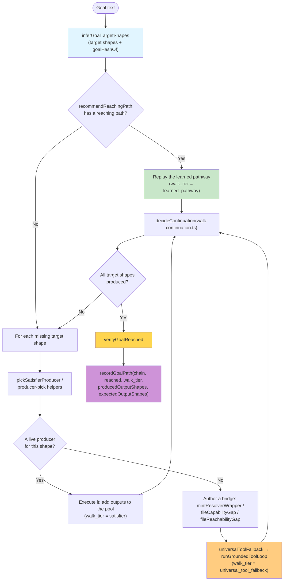
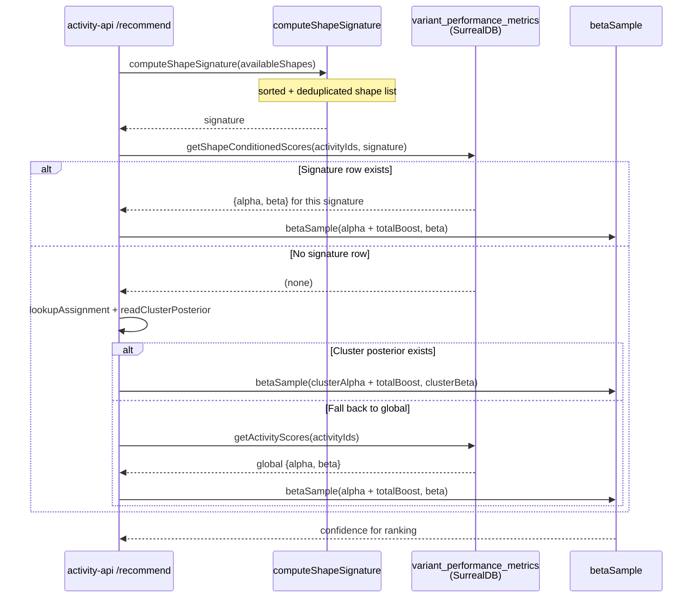
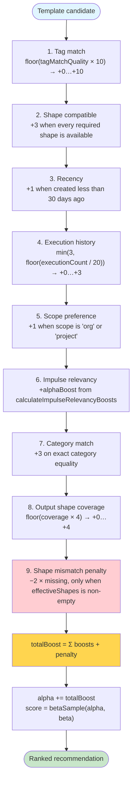
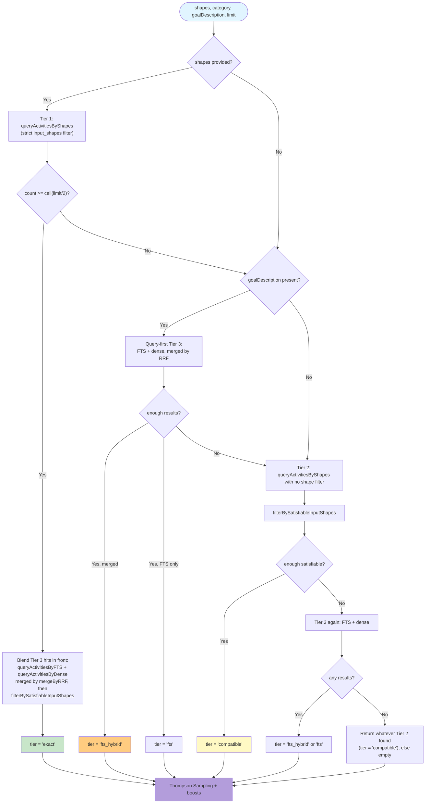

# Activity Selection from Impulse State Space

> **How to read this.** Dispatch enters `goal-host-vessel` (`:8210` in-container,
> `:18210` host-mapped) at `POST /run-goal` or `POST /resolve`. Selection posteriors,
> template storage and tiered candidate retrieval live in `activity-api`
> (`:8080` / `:18080`). Participants below are named by the symbol that implements
> them, never by line number — this system rewrites its own source, so line
> citations rot within a day.

## Overview

This document maps the flow from a dispatched goal to an executed activity: how candidate templates are retrieved, how Thompson Sampling ranks them, how a goal that has no single matching template is walked over the shape graph instead, and how the post-execution reach gate decides whether the run actually counted.

The two halves are split across vessels. `goal-host-vessel` owns the walk (`runGoalAsPoolWalk`), the recovery wrapper (`runGoalWithRecovery`), and the reach gate (`verifyGoalReached`). `activity-api` owns the candidate pool and the posteriors: `getActivitiesWithTieredFallback` retrieves, `betaSample` ranks, `insertExecution` and the feedback route update.

**Success is decided after execution, not by exit status.** A run whose template returns `status=completed` but whose output does not fulfil the goal is graded `reached:false` and β-penalised through `penaliseHollowTemplate`.

## Key Concepts

1. **Tiered candidate retrieval** — `getActivitiesWithTieredFallback` returns a pool plus a `tier` label of `exact`, `compatible`, `fts`, or `fts_hybrid`.
2. **Thompson Sampling** — `betaSample(alpha, beta)` draws a score per candidate; heuristic boosts are added to α before the draw.
3. **Heuristic boosts** — eight additive boosts plus one shape-mismatch penalty, surfaced on the response as `boost_breakdown`.
4. **Shape-conditioned scoring** — `computeShapeSignature` and `getShapeConditionedScores` key posteriors on the sorted shape signature, falling back to global α/β.
5. **Shape-graph walk** — when no single template covers the goal, `runGoalAsPoolWalk` backward-chains from the goal's target shapes, selecting producers and satisfiers.
6. **Walk tier** — every recorded path carries one of `learned_pathway`, `satisfier`, `universal_tool_fallback`, `feature_compose`, `fresh_derivation`.
7. **Reach gate** — `verifyGoalReached` returns a `GoalReachVerdict` with `reached`, `reason`, and `completion_shapes`.
8. **Per-goal path memory** — `recordGoalPath` writes `goal_execution_paths`; `recommendReachingPath` reads it back for a repeat of the same goal.

## Main Sequence Diagram

```mermaid
sequenceDiagram
    participant User as Dispatch<br/>(mcp__metabob__run_goal)
    participant GH as goal-host-vessel<br/>handleRunGoal
    participant Walk as runGoalWithRecovery<br/>→ runGoalAsPoolWalk
    participant API as activity-api<br/>(:8080)
    participant TS as Tiered retrieval<br/>+ betaSample
    participant Tools as Resolver vessels<br/>(llm / local-tools / …)

    User->>GH: POST /run-goal {goal, tags, variables}
    activate GH
    GH->>Walk: dispatch record created, walk started

    rect rgb(255, 250, 240)
    Note over Walk: TARGET INFERENCE
    Walk->>Walk: inferGoalTargetShapes(goal)
    Note over Walk: goalHashOf(goal) keys the per-goal memory;<br/>target shapes drive backward chaining
    Walk->>API: POST /v2/goal-paths/recommend<br/>(recommendReachingPath)
    API-->>Walk: recommended_paths (highest-α reaching path, if any)
    end

    rect rgb(240, 255, 240)
    Note over Walk,API: CANDIDATE RETRIEVAL + RANKING
    Walk->>API: POST /v2/activities/recommend<br/>{goal, task_description, expected_output_shapes, limit}
    activate API
    API->>TS: getActivitiesWithTieredFallback(shapes, category, goal, …)
    Note over TS: Tier 1 queryActivitiesByShapes (exact)<br/>Tier 2 same query, no shape filter (compatible)<br/>Tier 3 queryActivitiesByFTS + queryActivitiesByDense,<br/>merged by mergeByRRF (fts / fts_hybrid)
    TS-->>API: {activities, tier}
    loop per candidate
        API->>API: analyzeTaskSemantics → tag boost
        API->>API: 8 boosts + shape-mismatch penalty → totalBoost
        API->>API: alpha += totalBoost; betaSample(alpha, beta)
        API->>API: getShapeConditionedScores / cluster posterior blend
    end
    API-->>Walk: recommendations[] with confidence + boost_breakdown
    deactivate API
    end

    rect rgb(255, 240, 245)
    Note over Walk,Tools: EXECUTION
    Walk->>Tools: execute selected producer / satisfier chain
    Tools-->>Walk: produced shapes + content digest
    end

    rect rgb(255, 235, 238)
    Note over Walk: REACH GATE
    Walk->>Walk: verifyGoalReached(goal, producedShapes, taskSummary, digest, …)
    Note over Walk: deterministic pre-checks first<br/>(no-output, error envelope, unfilled placeholder,<br/>staged-not-landed, favorable-compose),<br/>then an LLM judge for the residue
    alt reached
        Walk->>API: creditReachedTemplate (positive feedback)
        Walk->>API: recordGoalPath(goal, chain, reached=true, walk_tier)
        Walk->>Walk: mintReachedTrace → dispatch ribosome-extract
    else not reached
        Walk->>API: penaliseHollowTemplate (feedback, negative, intensity 2)
        Walk->>API: recordGoalPath(goal, chain, reached=false, walk_tier)
        Walk->>API: recommendExcluding(task_description, exclude=[failed ids])
        Note over Walk: retry a genuinely different approach<br/>until reached or candidates exhausted
    end
    end

    GH-->>User: dispatch result {status, reached, walkTier, completionShapes}
    deactivate GH
```

## Decomposition: Meta-Activity Composition

A goal is not a single template call. `runGoalAsPoolWalk` maintains a pool of produced impulses and a set of still-missing target shapes, and repeatedly chooses how to close the gap. The chain of activity ids it accumulates is the composition, and `tierFromChain` classifies it after the fact.



**Key points:**
- The chain is discovered at run time from the shape graph, not declared in a stored meta-template.
- `decideContinuation` decides whether to keep walking, terminalise, or stop.
- Parent→child pairs observed in traces are reconciled into `activity_composition_graph` by the composition-edge reconciler; nothing is written to a per-goal declarative composition table.
- Improvisation is not a separate branch — the fallback route is just another walk tier.

**Implementation:** `runGoalAsPoolWalk`, `decideContinuation`, `tierFromChain`, `recordGoalPath` (all `repos/goal-host-vessel/src`), plus `pickSatisfierProducer` (`satisfier-pick.ts`) and `makeProducerPickHelpers` (`producer-pick.ts`).

## Decomposition: Shape-Conditioned Scoring

A template's success rate is not a single number. The same template can be reliable when the impulse pool carries the shapes it wants and unreliable otherwise, so posteriors are keyed on a shape signature as well as globally.



The blend order is signature row → cluster posterior → global posterior, so a template with no history under the current shape signature still gets a draw rather than being dropped. `applyReputationFactor` and, when enabled, the successor-feature value from `successorValue` further adjust the draw.

**Implementation:** `computeShapeSignature`, `getShapeConditionedScores`, `getActivityScores` in `repos/activity-api/src/db/paradigm.ts`; `betaSample`, `updateShapeScoresFromExecution`, `variantMetricsRecordId` in `repos/activity-api/src/routes/activities.scoring.ts`; `lookupAssignment` / `readClusterPosterior` in `repos/activity-api/src/lib/cluster-posterior.ts`.

## Decomposition: Heuristic Boost Calculation

Boosts are added to α **before** the Beta draw, so they bias exploration without overwriting learned evidence. All nine components are reported back on the recommendation as `boost_breakdown`, which is what makes a selection auditable after the fact.



Two of these are easy to misread. **Recency** keys on the template's creation date, not on when it was last used. **Scope preference** rewards `org` and `project` scope; it is not a filesystem-permission ordering. The mismatch penalty only applies when the caller supplied an effective shape set, so a shape-blind recommend request is never penalised for shapes it never claimed.

**Implementation:** the boost block and `boost_breakdown` assembly inside the `/recommend` handler in `repos/activity-api/src/routes/activities.ts`; coverage via `calculateOutputShapeCoverage` (`src/utils/outcome-to-shape.ts`); relevancy via `calculateImpulseRelevancyBoosts` (`src/utils/impulse-relevancy.ts`).

### How tags are extracted (Boost #1 input)

Boost #1 compares template tags against prefixes extracted deterministically from the goal description, not against any LLM analysis. The extraction lives in `repos/activity-api/src/utils/semantic-tags.ts`:

- `KEYWORD_TO_TAGS` — a module-private keyword → tag-prefix map spanning `tool.*`, `bugfix.*`, `development.*`, `meta.*` and `feature.*` families. Each keyword maps to an ordered prefix list, most specific first, and compound keys let multi-word phrases match in one lookup.
- `extractTagPrefixes(taskDescription)` — tokenises the description and returns the union of matched prefixes.
- `calculateTagMatchQuality(extractedPrefixes, templateTags)` — position-weighted scoring: the first extracted prefix contributes weight `1.0`, the second `0.5`, the third `0.33`, and so on. A template tag counts as a match when it `startsWith(prefix)`. The quality lands in `[0, 1]` and the boost is `floor(quality * 10)`.
- `extractImpliedShapes(taskDescription)` — derives shape hints from the same vocabulary, which is why a shapeless dispatch can still satisfy Tier 1.
- `analyzeTaskSemantics(taskDescription)` — the combined entry point the recommend path calls.

This layer is deliberately deterministic: tag pre-filtering and Boost #1 must not depend on an LLM call, so the ranking of a goal is reproducible from its text alone.

## Decomposition: Tiered Fallback Query Strategy

Retrieval relaxes constraints in tiers until it has at least `minResults = ceil(limit / 2)` candidates. The tier that produced the pool is returned alongside it as `exact`, `compatible`, `fts`, or `fts_hybrid`.



Two properties are worth holding onto. First, `filterBySatisfiableInputShapes` keeps the recommender from proposing templates the engine would reject at pre-flight — an activity matches when it declares no `input_shapes` or when every declared input is present in the provided pool. Second, the filter is conservative: if applying it would underfill the tier, the unfiltered list is returned instead, so a goal never fails outright for want of a perfectly satisfiable candidate.

**Implementation:** `getActivitiesWithTieredFallback` and `filterBySatisfiableInputShapes` in `repos/activity-api/src/routes/activities.get-activities-with-tiered-fallback.ts`; the underlying queries `queryActivitiesByShapes`, `queryActivitiesByFTS`, `queryActivitiesByDense` in `repos/activity-api/src/db/paradigm.ts`; rank fusion in `mergeByRRF` (`src/utils/rrf.ts`).

## Key Decision Points

Three decisions determine what a dispatch does: which candidates enter the pool, which candidate is executed, and whether the result counted. The first two are ordinary ranking; the third is the one that is easy to get wrong, because a template can exit cleanly without producing what was asked. The subsections below cover each in turn, and each names the symbol that owns the decision so the behaviour can be read from source rather than inferred from this document.

### 1. Activity Composition Chain

**Owner:** `runGoalAsPoolWalk` in `repos/goal-host-vessel/src/index.ts`.

The composition is a runtime chain, not a declarative task list stored against a meta-template. The walk holds a pool of produced impulses and a set of unmet target shapes; each iteration picks a producer or satisfier for one unmet shape, executes it, folds its outputs into the pool, and asks `decideContinuation` whether to keep going.

```
chain = []
target = inferGoalTargetShapes(goal)
while target has unmet shapes and continuation allows:
    shape    = next unmet target shape
    producer = learned-pathway replay
             ?? pickSatisfierProducer(shape)
             ?? bridge mint (mintResolverWrapper / gap filing)
             ?? universalToolFallback(goal, target)
    outputs  = execute(producer)
    pool    += outputs
    chain   += producer.id
walkTier = tierFromChain(chain)
```

**Key points:**
- There is no code-level branch between "normal execution" and "improvisation" — the fallback is a tier of the same walk.
- `terminalOutputShapes` lets the walk defer a terminal write until intermediate shapes exist, so a derive→emit goal binds the emit's content from what was actually derived.
- The chain, not a single template id, is what `recordGoalPath` attributes success to.

### 2. Recommendation Evaluation

**Owner:** the `/v2/activities/recommend` handler in `repos/activity-api/src/routes/activities.ts`, called from `goal-host-vessel` via `recommendExcluding`, `recommendReachingPath`, and the `activity_recommendation` builtin resolver registered by `registerBuiltinResolvers`.

Candidates are ranked by the Beta draw described above and returned newest-best-first with their `confidence` and `boost_breakdown`. The caller decides what to do with them; the backend does not execute anything.

```typescript
// goal-host asks for a genuinely different approach after a miss
const next = await recommendExcluding(
  taskDescription,          // NOT the raw goal text
  [...alreadyFailedIds],    // exclude_activities
  repairSignature,          // optional repair_signature
  targetShapes,             // optional expected_output_shapes
);
// null ⇒ no fresh candidate remains ⇒ honest failure
```

`recommendExcluding` normalises ids by stripping the `activity:` prefix and any `⟨⟩` wrapper before comparing against the exclusion set, so a candidate cannot be re-selected under a differently-wrapped id. When target shapes are supplied and a candidate declares output shapes, candidates whose outputs overlap none of the targets are skipped.

### 3. Goal-Reaching Gate (`verifyGoalReached`)

**Owner:** `verifyGoalReached` in `repos/goal-host-vessel/src/index.ts`, invoked on both the `/run-goal` and `/resolve` paths after execution returns.

The gate does not trust exit status. It runs deterministic checks first and only consults an LLM judge for what the deterministic checks cannot settle:

```typescript
const verdict = await verifyGoalReached(
  goal, producedShapes, taskSummary, contentDigest, commandEvidence, walkEvidence,
);
// → { reached, reason, completion_shapes, deterministic? } | null
```

Deterministic verdicts, in the order they are tried:

- **`deterministic:no-output`** — empty digest and no meaningful produced shape.
- **`deterministic:staged-not-landed`** — a `mitosisStaged` shape with no landing evidence. A typecheck-clean edit sitting in a clone is not a reach.
- **`deterministic:error-envelope`** — every content-bearing digest line is an error envelope. Containment alone does not trigger it, so a report *about* failures still reaches the judge.
- **`deterministic:placeholder`** — the output is an unfilled `{{placeholder}}`.
- **`deterministic:favorable-compose`** — a `featureComposeReport` with verdict `FAVORABLE` **and** landing evidence (`push_status: "pushed"` or a `new_git_sha`). Strong credit additionally requires the non-fail-open markers `verified: true` and a non-empty `reachable_symbols`; without them the run still reaches but strong credit is withheld.

Class-specific verifiers (`verifyDeterministicCompute`, `verifyCountFilesReach`, `verifyAggregateReach`, `verifyShapeProducersReach`, `verifyRegistryInventoryReach`, and siblings) recompute the answer independently and can reject a provably wrong output before the judge ever sees it.

**Consequences of the verdict:**
- `reached: true` → `creditReachedTemplate`, `recordGoalPath(..., true, walkTier)`, and `mintReachedTrace`, which dispatches `ribosome-extract` on the reached trace.
- `reached: false` → `penaliseHollowTemplate` (a `POST /v2/activities/feedback` with `direction: "negative"`, `intensity: 2`, no α change), `recordGoalPath(..., false, walkTier)`, a class-grain lesson mirrored to concept-db, and the in-flight recovery retry described in [04](./04-improvisation-failure-modes.md).
- `isSubstanceHonestReach` is true only when the code set `deterministic: true`; the LLM judge's parse is sanitised so a bare model "yes" can never claim it.

### Note: single-template pick vs shape-graph walk

The tiered recommendation ranks single templates. A goal that no single template covers is not rejected — it is walked. `runGoalAsPoolWalk` backward-chains from the inferred target shapes, picks a producer per missing shape, and binds data flow shape-to-shape through the impulse pool.

The learning machinery is identical for both. The same posteriors rank the producers chosen at each hop, and the same reach gate judges the terminal output. What differs is only the recorded `walk_tier`: a single learned template replays as `learned_pathway`, a shape-by-shape derivation records as `satisfier` or `fresh_derivation`, and a goal closed by grounded tool use records as `universal_tool_fallback`.

## Data Flow Summary

```
Dispatch (mcp__metabob__run_goal → POST /run-goal, handleRunGoal)
  ↓
inferGoalTargetShapes(goal) + goalHashOf(goal)
  ↓
recommendReachingPath → POST /v2/goal-paths/recommend
  ├─ a reaching path exists → replay it (walk_tier = learned_pathway)
  └─ none → walk
  ↓
POST /v2/activities/recommend
  ├─ getActivitiesWithTieredFallback → {activities, tier}
  │   ├─ exact       (queryActivitiesByShapes)
  │   ├─ compatible  (no shape filter + filterBySatisfiableInputShapes)
  │   └─ fts / fts_hybrid (queryActivitiesByFTS ⊕ queryActivitiesByDense via mergeByRRF)
  ├─ per candidate: 8 boosts + shape-mismatch penalty → totalBoost
  ├─ posterior blend: shape signature → cluster → global
  └─ betaSample(alpha + totalBoost, beta) → ranked recommendations
  ↓
Execute the producer/satisfier chain (resolver vessels)
  ↓
verifyGoalReached → GoalReachVerdict {reached, reason, completion_shapes}
  ├─ reached  → creditReachedTemplate + recordGoalPath(true) + mintReachedTrace
  └─ not      → penaliseHollowTemplate + recordGoalPath(false) + recommendExcluding → retry
  ↓
Persisted learning
  ├─ activity_execution_traces (via POST /v2/activities/execution-traces)
  ├─ goal_execution_paths      (keyed by goal_hash, carries walk_tier)
  ├─ variant_performance_metrics (shape-conditioned α/β)
  └─ activity_composition_graph  (parent→child, reconciled from traces)
```

**What this is not:** there is no if/else in the host between "run a template" and "improvise". Every route through the diagram above is a walk tier of one mechanism, and every route ends at the same gate.

## Metrics Captured

**Selection.** Returned on each recommendation and stored with the execution: the tier that produced the candidate pool, `heuristic_boost` with its per-component `boost_breakdown` (`tag_match`, `shape_compatible`, `recency`, `execution_history`, `scope_preference`, `category_match`, `output_shape_coverage`, plus the impulse relevancy contribution), the sampled `confidence`, and the selected template id.

**Execution.** Written through `insertExecution` and `POST /v2/activities/execution-traces`: status, duration, cost, token usage, produced output shapes, and the composition chain.

**Reach.** The `GoalReachVerdict` fields — `reached`, `reason`, `completion_shapes`, and the `deterministic` flag that distinguishes a code-proved reach from a judged one. `recordDeterministicLabel` records deterministic verdicts as labels for the oracle corpus.

**Per-goal.** `recordGoalPath` writes `goal_execution_paths` keyed by `goal_hash`: `path_activities`, `reached`, duration, cost, `walk_tier`, `produced_output_shapes`, `expected_output_shapes`. This is what `recommendReachingPath` reads back, and what makes "has this goal ever been reached, and how" answerable.

**Composition.** Parent→child edges land in `activity_composition_graph` through `POST /v2/activities/composition`; `classifyCompositionEdge` labels each edge `genuine`, `scaffold`, or `hub`, and a write-path caller that supplies recurrence or shape-flow evidence only earns `genuine` with that evidence.

## File References

| Component | Location | Entry symbols |
|-----------|----------|---------------|
| Dispatch surface | `repos/goal-host-vessel/src/index.ts` | `handleRunGoal`, `handleResolve` |
| Walk | `repos/goal-host-vessel/src/index.ts` | `runGoalWithRecovery`, `runGoalAsPoolWalk` |
| Target inference | `repos/goal-host-vessel/src/goal-target-inference.ts` | `inferGoalTargetShapes`, `inferGoalTargetDecision`, `goalHashOf` |
| Producer / satisfier choice | `repos/goal-host-vessel/src/producer-pick.ts`, `satisfier-pick.ts` | `makeProducerPickHelpers`, `pickSatisfierProducer` |
| Continuation | `repos/goal-host-vessel/src/walk-continuation.ts` | `decideContinuation` |
| Reach gate | `repos/goal-host-vessel/src/index.ts` | `verifyGoalReached`, `isSubstanceHonestReach`, `recordDeterministicLabel` |
| Posterior updates | `repos/goal-host-vessel/src/index.ts` | `creditReachedTemplate`, `penaliseHollowTemplate` |
| Per-goal memory | `repos/goal-host-vessel/src/index.ts` | `recordGoalPath`, `recommendReachingPath`, `recommendExcluding` |
| Recommendation endpoint | `repos/activity-api/src/routes/activities.ts` | `/recommend` handler, boost block |
| Tiered retrieval | `repos/activity-api/src/routes/activities.get-activities-with-tiered-fallback.ts` | `getActivitiesWithTieredFallback`, `filterBySatisfiableInputShapes` |
| Sampling | `repos/activity-api/src/routes/activities.scoring.ts` | `betaSample`, `updateShapeScoresFromExecution` |
| Posterior storage | `repos/activity-api/src/db/paradigm.ts` | `getActivityScores`, `getShapeConditionedScores`, `computeShapeSignature` |
| Tag extraction | `repos/activity-api/src/utils/semantic-tags.ts` | `analyzeTaskSemantics`, `extractTagPrefixes`, `calculateTagMatchQuality` |
| Composition edges | `repos/activity-api/src/routes/activities.ts` (`/composition`, `/composition/graph`, `/composition/successors`) and `activities.composition.ts` | `classifyCompositionEdge` |
| Per-goal paths endpoint | `repos/activity-api/src/routes/goal-paths.ts` | `/`, `/recommend`, `/stats` |

## Implementation Architecture

This sequence spans two vessels with a clean split: `goal-host-vessel` decides and executes, `activity-api` remembers and ranks. The split is what lets a goal-host be replaced or run in a second location without losing learned posteriors, and what lets the ranking algorithm change without redeploying the executor.

### goal-host-vessel (Execution Environment)

**Responsibilities:**
- Accept dispatches at `POST /run-goal` and `POST /resolve` (`handleRunGoal`, `handleResolve`), plus `GET /executions/:id` for dispatch state.
- Infer target shapes and walk the shape graph (`inferGoalTargetShapes`, `runGoalAsPoolWalk`).
- Register resolvers: builtins (`registerBuiltinResolvers`), discovery proxies (`registerDiscoveryProxies`, `buildDiscoveryProxyResolver`), and development-vessel proxies (`registerDevVesselProxies`).
- React to `vessel.registered` so new vessels get proxy resolvers without a restart (`startVesselRegistrationSubscriber`).
- Run the reach gate and drive in-flight recovery.
- Emit the trace and per-goal path to activity-api.

**What it does not do:** it does not store templates, compute Beta draws, or aggregate metrics. It reads recommendations and writes outcomes.

### Activity-API (Storage & Learning Backend)

**Responsibilities:**
- Persist templates (`activity_template`) and executions (`activity_execution_traces`).
- Retrieve candidates through the tiered strategy and rank them with `betaSample` plus the boost block.
- Maintain shape-conditioned posteriors (`variant_performance_metrics`) and cluster posteriors.
- Serve `POST /v2/activities/feedback` as the α/β update surface for credit and hollow penalties.
- Serve per-goal paths at `/v2/goal-paths` (`POST /`, `GET /`, `POST /recommend`, `GET /stats`).
- Record composition edges at `POST /v2/activities/composition` into `activity_composition_graph`, and serve them back at `/composition/graph`, `/composition/successors`, `/composition/state-transitions`, `/composition/impulse-success`.
- Host the WebSocket broadcast bus that ribosome-vessel and other subscribers consume.
- Register with discovery-vessel and advertise its activity shapes.

**What it does not do:** it does not execute activities, resolve local impulses, or own resolver dispatch.

### SurrealDB Schema

**Tables that carry selection and reach state:**
- `activity_template` — template definitions.
- `activity_execution_traces` — execution history with state, tasks, and reach fields.
- `variant_performance_metrics` — shape-conditioned α/β per variant and signature.
- `goal_execution_paths` — per-goal attribution keyed by `goal_hash`, carrying `walk_tier` and produced/expected output shapes.
- `activity_composition_graph` — parent→child producer/consumer edges, the live composition surface.
- `impulse_relevance_metrics` — impulse→activity relevance used by the relevancy boost.
- `thompson_selection_log`, `context_thompson_scores` — selection audit and context-conditioned scores.

**Retired:** the `composition_edge` table and its `fn::update_composition_edge` helper were removed along with their writer and reader routes. Anything describing composition learning should point at `activity_composition_graph`.

### Correct Separation

**Execution-time (goal-host-vessel):** goal parsing and target inference, walk control, resolver dispatch, tool loops, the reach gate, trace construction, per-goal path writes, and the recovery retry.

**Storage and learning (activity-api):** template persistence, candidate retrieval, Beta sampling, boost computation, shape-conditioned and cluster posteriors, feedback application, composition-graph reconciliation, and the event bus.

**Why the split matters:**
- A goal-host can point at any substrate's activity-api; posteriors are not trapped in the executor.
- The ranking algorithm can change without touching the executor, and the executor's walk can change without touching the ranker.
- Multiple substrates can share one learning backend, and cross-instance patterns aggregate there rather than in a process that restarts.
- The backend is one resolver among many, not the universal resolution authority.

## Related Documentation

- [Impulse Resolution](./02-impulse-resolution.md) — how impulses are resolved and injected
- [Improvisation & Failure Modes](./04-improvisation-failure-modes.md) — in-flight recovery and the failure taxonomy
- [GOAL_EXECUTION_PATHS_SCHEMA.md](../GOAL_EXECUTION_PATHS_SCHEMA.md) — per-goal record and reuse
- [IMPULSE_ACTIVITY_FOUNDATION.md](../IMPULSE_ACTIVITY_FOUNDATION.md) — the foundational model
