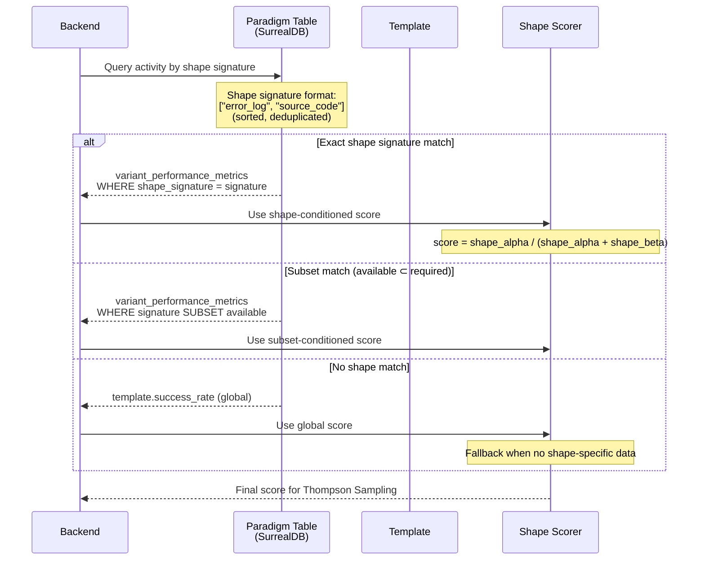
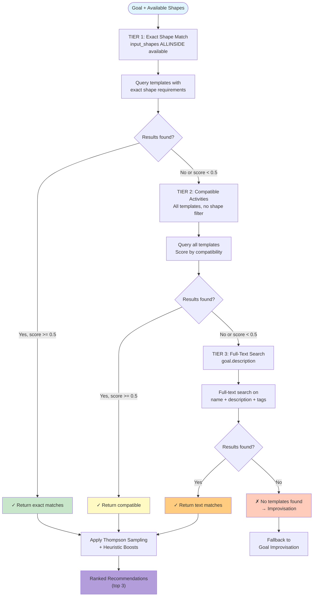

# Activity Selection from Impulse State Space

## Overview

This document maps the complete flow from user goal to activity execution through Thompson Sampling recommendation. The activity selection process is the entry point for all MiniBob executions, determining which activity template (if any) should be used to achieve a given goal.

## Key Concepts

1. **Goal Enrichment** - LLM semantic analysis extracts category, intent, and capabilities from user input
2. **Impulse State Space** - Available shapes and impulses inform activity compatibility
3. **Thompson Sampling** - Probabilistic template selection that learns which variants perform best
4. **Tiered Fallback** - Three-tier query strategy (exact → compatible → full-text search)
5. **Heuristic Boosts** - 8-point boost system influences exploration-exploitation balance
6. **Shape-Conditioned Scoring** - Activities scored based on impulse state space compatibility
7. **Correlation Tracking** - Links selection decisions to execution outcomes for learning

## Main Sequence Diagram

```mermaid
sequenceDiagram
    participant User as User/CLI
    participant GP as GoalProcessor<br/>(goal-processor.ts)
    participant SSM as StateSpaceManager<br/>(state-space-manager.ts)
    participant Backend as Activity API<br/>(activities.ts)
    participant TS as Thompson Sampling<br/>(paradigm.ts)
    participant Exec as ActivityExecutor<br/>(activity.ts)

    User->>GP: processGoal(message)
    activate GP

    rect rgb(240, 248, 255)
    Note over GP: PHASE 1: GOAL ENRICHMENT
    GP->>GP: enrichGoal(message)<br/>(lines 2565-2625)
    Note over GP: LLM semantic analysis:<br/>- Extract category<br/>- Identify intent<br/>- Detect capabilities needed<br/>- Parse constraints
    end

    rect rgb(255, 250, 240)
    Note over GP,SSM: PHASE 2: STATE SPACE ANALYSIS
    GP->>SSM: getAvailableShapes()
    SSM-->>GP: Set<string> shapes
    GP->>SSM: getShapeSignature()
    Note over SSM: Return sorted, deduplicated<br/>shape list for matching
    SSM-->>GP: string[] signature
    end

    rect rgb(240, 255, 240)
    Note over GP,Backend: PHASE 3: ACTIVITY RECOMMENDATION
    GP->>Backend: POST /v2/activities/recommend<br/>(activities.ts:3080-3116)
    Note over Backend: Request:<br/>{<br/>  goal: enriched_description,<br/>  shapes: available_shapes,<br/>  category: detected_category,<br/>  limit: 3<br/>}

    activate Backend

    rect rgb(250, 250, 255)
    Note over Backend,TS: TIER 1: Exact Shape Match
    Backend->>TS: query(input_shapes ALLINSIDE shapes)<br/>(paradigm.ts:2915-3049)
    TS-->>Backend: Templates with exact match

    alt Exact matches found (score >= 0.5)
        Note over Backend: ✓ Use exact matches
    else No exact matches
        Note over Backend,TS: TIER 2: Compatible Activities
        Backend->>TS: query(all activities, no shape filter)
        TS-->>Backend: All templates (compatibility scored)

        alt Compatible found (score >= 0.5)
            Note over Backend: ✓ Use compatible
        else No compatible
            Note over Backend,TS: TIER 3: Full-Text Search
            Backend->>TS: fullTextSearch(goal.description)
            TS-->>Backend: Text-matched templates
        end
    end
    end

    rect rgb(255, 245, 230)
    Note over Backend,TS: THOMPSON SAMPLING WITH BOOSTS

    loop For each candidate template
        Backend->>TS: computeHeuristicBoosts(template, goal)<br/>(activities.ts:3285-3340)

        Note over TS: 8 BOOST COMPONENTS:
        Note over TS: 1. Tag Match Quality (+0 to +6)<br/>   - Exact: +6, Partial: +3, None: 0
        Note over TS: 2. Shape Compatibility (+3)<br/>   - All required shapes available
        Note over TS: 3. Recency (+1)<br/>   - Recently used templates
        Note over TS: 4. Execution History (+1 to +5)<br/>   - High success rate: +5<br/>   - Medium: +3, Low: +1
        Note over TS: 5. Scope Preference (+1)<br/>   - Local > file_write > read_only
        Note over TS: 6. Impulse Relevancy (+variable)<br/>   - Computed from relevance metrics
        Note over TS: 7. Category Match (+3)<br/>   - Exact category match
        Note over TS: 8. Output Shape Coverage (+0 to +4)<br/>   - Produces expected shapes

        TS->>TS: totalBoost = sum(boosts)
        TS->>TS: alpha += totalBoost
        TS->>TS: score = Beta(alpha, beta).sample()
        Note over TS: Beta distribution:<br/>α = successes + boosts<br/>β = failures
    end

    Backend->>Backend: sortByScore(templates)
    Backend->>Backend: selectTopN(limit=3)
    end

    Backend-->>GP: ActivityRecommendation[]<br/>{<br/>  template_id,<br/>  confidence: score,<br/>  thompson_metadata: {α, β},<br/>  boost_breakdown<br/>}
    deactivate Backend
    end

    rect rgb(255, 240, 245)
    Note over GP,Exec: PHASE 4: ACTIVITY EXECUTION

    GP->>GP: selectBestTemplate(recommendations)
    Note over GP: Select highest confidence<br/>(or user choice if interactive)

    loop For each recommendation (until success)
        GP->>Exec: executeActivity(template, impulses)
        activate Exec

        Exec->>Exec: Load impulses by shape
        Exec->>Exec: Execute tasks with LLM
        Exec-->>GP: ActivityExecution<br/>{<br/>  status: completed|failed,<br/>  trace: full_execution_trace<br/>}
        deactivate Exec

        GP->>GP: verifyGoal(execution)
        alt Goal Achieved
            Note over GP: ✓ SUCCESS
            break Goal satisfied
        else Goal Not Achieved
            Note over GP: Try next template
        end
    end
    end

    rect rgb(245, 255, 245)
    Note over GP,Backend: PHASE 5: LEARNING FEEDBACK

    GP->>Backend: storeExecutionTrace(trace)<br/>+ correlation_id: recommendation_id
    Note over Backend: Links selection → execution<br/>for Thompson Sampling learning

    Backend->>Backend: Update α or β based on outcome
    Backend->>Backend: Recalculate success_rate
    Backend->>Backend: Store in variant_performance_metrics
    end

    GP-->>User: GoalResult
    deactivate GP
```

## Decomposition: Shape-Conditioned Scoring

The shape-conditioned scoring system enables activity templates to have different success rates depending on the impulse state space.



**Implementation:** `repos/metabob-activity-api/src/db/paradigm.ts:797-909`

## Decomposition: Heuristic Boost Calculation

```mermaid
graph TD
    Start([Template Candidate]) --> TagMatch["1. Tag Match Quality<br/>(+0 to +6)"]

    TagMatch --> TagExact{Exact match?}
    TagExact -->|Yes| AddSix["+6"]
    TagExact -->|No| TagPartial{Partial match?}
    TagPartial -->|Yes| AddThree["+3"]
    TagPartial -->|No| AddZero["+0"]

    AddSix --> ShapeCheck
    AddThree --> ShapeCheck
    AddZero --> ShapeCheck

    ShapeCheck["2. Shape Compatibility<br/>(+3)"] --> ShapeMatch{All required<br/>shapes available?}
    ShapeMatch -->|Yes| AddThree2["+3"]
    ShapeMatch -->|No| Skip2["Skip"]

    AddThree2 --> Recency
    Skip2 --> Recency

    Recency["3. Recency<br/>(+1)"] --> RecentCheck{Used recently?}
    RecentCheck -->|Yes| AddOne["+1"]
    RecentCheck -->|No| Skip3["Skip"]

    AddOne --> History
    Skip3 --> History

    History["4. Execution History<br/>(+1 to +5)"] --> SuccessRate{Success rate?}
    SuccessRate -->|"> 80%"| AddFive["+5"]
    SuccessRate -->|"60-80%"| AddThree3["+3"]
    SuccessRate -->|"< 60%"| AddOne2["+1"]

    AddFive --> Scope
    AddThree3 --> Scope
    AddOne2 --> Scope

    Scope["5. Scope Preference<br/>(+1)"] --> ScopeCheck{Scope match?}
    ScopeCheck -->|Local| AddOne3["+1"]
    ScopeCheck -->|file_write| AddOne3
    ScopeCheck -->|Other| Skip5["Skip"]

    AddOne3 --> Impulse
    Skip5 --> Impulse

    Impulse["6. Impulse Relevancy<br/>(+variable)"] --> ImpulseCalc["Σ impulse_relevance_scores"]
    ImpulseCalc --> Category

    Category["7. Category Match<br/>(+3)"] --> CategoryCheck{Category match?}
    CategoryCheck -->|Yes| AddThree4["+3"]
    CategoryCheck -->|No| Skip7["Skip"]

    AddThree4 --> Output
    Skip7 --> Output

    Output["8. Output Shape Coverage<br/>(+0 to +4)"] --> OutputCalc["Count matching output shapes"]
    OutputCalc --> FinalSum["Total Boost = Σ all boosts"]

    FinalSum --> ApplyBoost["α += totalBoost<br/>score = Beta(α, β).sample()"]

    ApplyBoost --> End([Final Thompson Score])

    style Start fill:#e1f5ff
    style End fill:#c8e6c9
    style AddSix fill:#c8e6c9
    style AddThree fill:#fff9c4
    style AddFive fill:#c8e6c9
    style FinalSum fill:#ffd54f
```



**Implementation:** `repos/metabob-activity-api/src/routes/activities.ts:3285-3340`

## Decomposition: Tiered Fallback Query Strategy



**Implementation:** `repos/metabob-activity-api/src/db/paradigm.ts:2915-3049`

## Key Decision Points

### 1. Simple Goal Detection
**Location:** `goal-processor.ts:1409-1430`

```typescript
if (isSimpleGoal(enrichedGoal)) {
  // Skip template search, use direct improvisation
  return improviseUntilComplete(goal);
}
```

**Criteria:**
- Read-only operations
- Exploration patterns
- No file writes required

### 2. Relevance Threshold
**Location:** `goal-processor.ts:906`

```typescript
if (bestScore < RELEVANCE_THRESHOLD) { // 0.7
  // No relevant templates found
  return improviseUntilComplete(goal);
}
```

### 3. Goal Verification
**Location:** `goal-processor.ts:4579`

```typescript
if (verifyGoal(execution)) {
  return { status: "success", execution };
} else {
  // Try next template or improvise
}
```

## Data Flow Summary

```
User Goal (text)
  ↓
Goal Enrichment (LLM semantic analysis)
  ↓
State Space Query (available shapes)
  ↓
Backend Recommendation (Thompson Sampling)
  ├─ Tier 1: Exact shape match
  ├─ Tier 2: Compatible activities
  └─ Tier 3: Full-text search
  ↓
Heuristic Boosts Applied (8 components)
  ↓
Shape-Conditioned Scoring
  ↓
Ranked Recommendations (top 3)
  ↓
Activity Execution (best → fallback)
  ↓
Goal Verification
  ↓
Learning Feedback (α/β update)
```

## Metrics Captured

At each stage, the following metrics are captured for learning:

**Selection Metrics:**
- `recommendation_id` - Unique ID for this selection
- `goal_description` - Enriched goal text
- `available_shapes` - Impulse state space
- `candidates_considered` - Number of templates evaluated
- `tier_used` - Which fallback tier matched (1, 2, or 3)
- `boost_breakdown` - Contribution of each boost component
- `selected_template_id` - Which template was chosen
- `confidence_score` - Thompson Sampling score

**Execution Metrics:**
- `correlation_id` - Links to recommendation_id
- `execution_status` - completed | failed
- `goal_achieved` - Boolean verification result
- `duration_ms` - Total execution time
- `cost_usd` - LLM API costs
- `tokens_used` - Input + output tokens

**Learning Metrics:**
- `alpha_before` / `alpha_after` - Thompson Sampling α
- `beta_before` / `beta_after` - Thompson Sampling β
- `success_rate_change` - How this execution affected rate
- `shape_signature` - For shape-conditioned scoring

## File References

| Component | File | Lines | Purpose |
|-----------|------|-------|---------|
| Goal Processing | `repos/minibob/src/goal-processor.ts` | 2565-2625 | Goal enrichment, orchestration |
| State Space Manager | `repos/minibob/src/state-space-manager.ts` | Full file | Shape querying, compatibility |
| Backend Recommendation | `repos/metabob-activity-api/src/routes/activities.ts` | 3080-3116 | POST /recommend endpoint |
| Thompson Sampling | `repos/metabob-activity-api/src/routes/activities.ts` | 3345 | Beta distribution sampling |
| Heuristic Boosts | `repos/metabob-activity-api/src/routes/activities.ts` | 3285-3340 | 8-point boost system |
| Paradigm Queries | `repos/metabob-activity-api/src/db/paradigm.ts` | 2915-3049 | Tiered fallback queries |
| Shape Scoring | `repos/metabob-activity-api/src/db/paradigm.ts` | 797-909 | Shape-conditioned scores |

## Related Documentation

- [Impulse Resolution](./02-impulse-resolution.md) - How impulses are loaded for execution
- [Improvisation & Trailblazing](./04-improvisation-trailblazing.md) - What happens when no activity matches
- [IMPULSE_ACTIVITY_FOUNDATION.md](../IMPULSE_ACTIVITY_FOUNDATION.md) - Foundational model

---

**Last Updated:** 2026-04-16
