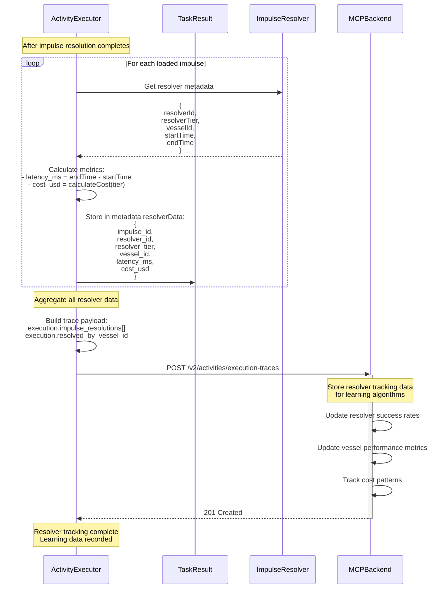
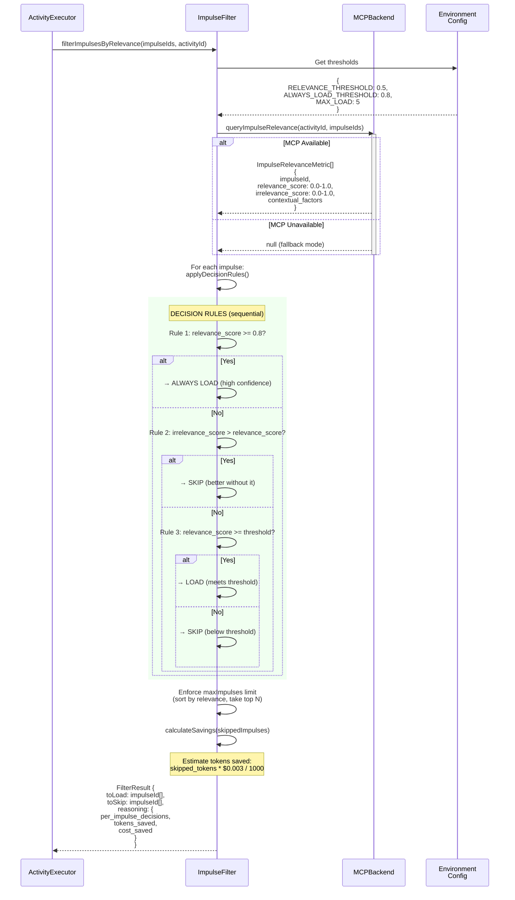
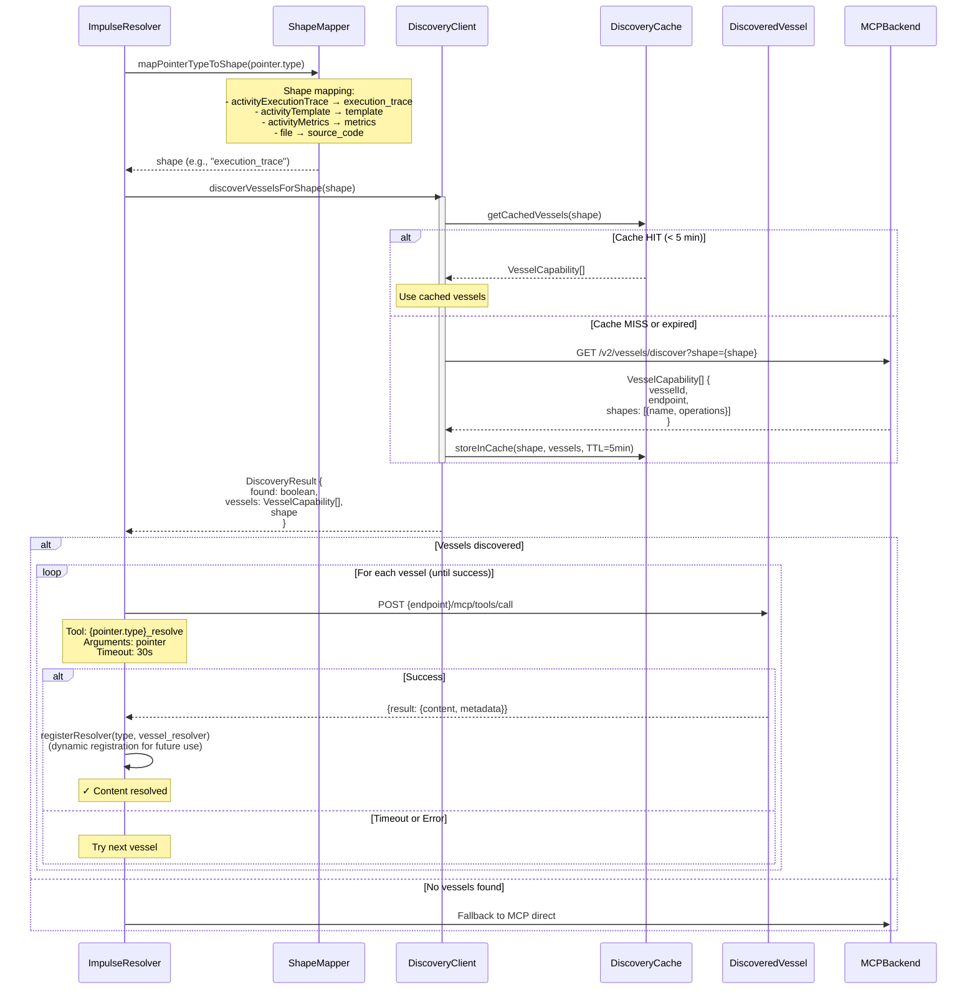
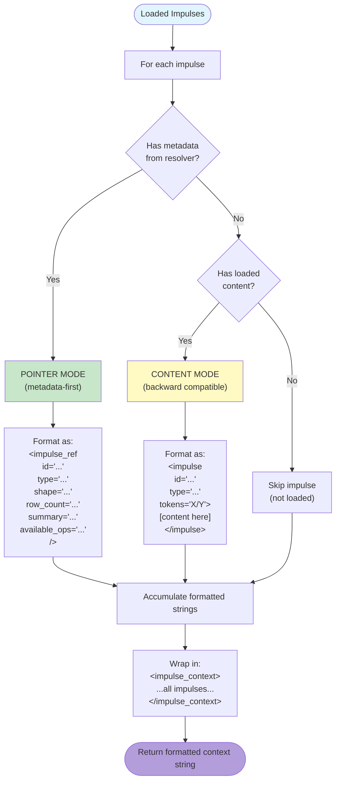

# Impulse Resolution During Activity Execution

> **Status (2026-06):** The 6-step resolver dispatch chain (local → custom → discovery → backend → fallback) and the filtering/budget/context-injection flow are still conceptually accurate, but they run **inside goal-host-vessel, not minibob** (minibob is deprecated and no longer executes anything). The `impulse.ts` and `vessel-discovery.ts` file refs were minibob's old copy; the live implementation lives in `goal-host-vessel` / `ias-executor-ts`. The `ActivityExecutor (activity.ts)` participant is now `GoalHost (goal-host-vessel)`; the `MCPBackend (mcp.ts)` participant is now `activity-api` (`:18080`) reached over HTTP via the discovery resolver contract, not a local MCP client. The LOCAL filesystem/process resolvers (file, directoryTree, gitDiff, bash) are owned by `local-tools-vessel` (`:8230`); discovery routing is unchanged.

## Overview

This document maps the complete lifecycle of impulse resolution during activity execution, from filtering through resolution to context injection into LLM prompts. The impulse resolution system is the core data access mechanism of the executing vessel (goal-host-vessel), enabling metadata-first reasoning and lazy-loaded content.

## Key Concepts

1. **Relevance Filtering** - Impulses filtered by learned relevance scores before loading
2. **6-Step Resolver Dispatch** - Priority-ordered resolution chain (local → custom → discovery → backend → fallback), executed in goal-host-vessel
3. **Budget Enforcement** - Content truncated to fit token budgets with metadata capture
4. **Dual-Mode Formatting** - Pointer-mode (metadata only) vs content-mode (full content)
5. **Impulse Evolution Tracking** - Before/after hashes track state transitions (P3.2)
6. **State Capture** - Input/output/transition states recorded for learning
7. **Discovery Integration** - Dynamic vessel discovery for capability-based resolution

## Main Sequence Diagram: Complete Resolution Flow

```mermaid
sequenceDiagram
    actor User as Task Executor
    participant Act as ActivityExecutor<br/>(goal-host-vessel)
    participant IF as ImpulseFilter<br/>(goal-host-vessel)
    participant ImpStore as ImpulseStore<br/>(goal-host-vessel)
    participant IR as ImpulseResolver<br/>(goal-host-vessel)
    participant Local as LocalResolvers<br/>(local-tools-vessel)
    participant Disc as DiscoveryVessel
    participant MCP as Activity-API<br/>(:18080, HTTP)
    participant Cache as DiscoveryCache

    User->>Act: executeTask()
    activate Act

    rect rgb(200, 220, 255)
    Note over Act,IF: PHASE 1: Impulse Filtering (Phase 1.8)<br/>Query relevance metrics if MCP enabled
    Act->>IF: Query task impulses IDs<br/>(taskImpulseIds = task.impulseReferences || impulses)
    IF->>MCP: queryImpulseRelevance(activityId, impulseIds)
    activate MCP
    MCP-->>IF: ImpulseRelevanceMetric[]
    deactivate MCP

    rect rgb(230, 245, 230)
    Note over IF: Apply Decision Rules:<br/>1. score ≥ 0.8 → always load<br/>2. irrelevance > relevance → skip<br/>3. score ≥ threshold → load<br/>4. enforce maxImpulses limit (default: 5)
    IF->>IF: filterImpulsesByRelevance(impulseIds, metrics)
    IF-->>Act: FilterResult {toLoad, toSkip, reasoning}
    end

    Note over Act: impulsesToLoad = filterResult.toLoad<br/>calculateSavings(skipped_tokens, cost)
    end

    rect rgb(255, 245, 200)
    Note over Act,ImpStore: PHASE 2: Sequential Impulse Loading<br/>Load filtered impulses with budget enforcement
    Act->>Act: loadImpulses(impulsesToLoad)
    activate Act as LoadLoop

    loop For each impulseId in impulsesToLoad
        Act->>ImpStore: load(impulseId)
        activate ImpStore

        rect rgb(255, 255, 220)
        Note over ImpStore,IR: PHASE 3: Pointer Resolution Chain<br/>Try resolvers in priority order
        ImpStore->>IR: resolvePointer(pointer)
        activate IR

        alt Step 1: LOCAL - memo (embedded content)
        IR->>IR: Check pointer.type === "memo"
        IR-->>IR: Return pointer.content

        else Step 2: LOCAL - file/directoryTree/gitDiff
        IR->>Local: Resolve file/tree/diff
        activate Local

        rect rgb(200, 255, 200)
        Note over Local: - file: read from filesystem<br/>- directoryTree: Bun.Glob() scan<br/>- gitDiff: git diff --stat<br/>- packageConfig: parse package.json<br/>- toolList: return available tools
        Local-->>IR: file_content | tree_structure | diff_output
        deactivate Local

        else Step 3: CUSTOM - registered resolvers
        IR->>IR: Check customResolvers.has(type)
        IR->>IR: resolver(pointer)
        IR-->>IR: resolver_result

        else Step 4: DISCOVERY - vessel discovery
        IR->>Disc: discoverVesselsForShape(shape)
        activate Disc

        rect rgb(200, 240, 255)
        Note over Cache: Cache TTL: 5 min<br/>Check cache first
        Disc->>Cache: Check discovery cache
        alt Cache HIT (< 5 min)
        Cache-->>Disc: CacheEntry {shape, vessels}
        else Cache MISS
        Disc->>MCP: GET /v2/vessels/discover?shape=X
        MCP-->>Disc: VesselCapability[]
        Disc->>Cache: Store {shape, vessels, cachedAt, expiresAt}
        end
        end

        Disc-->>IR: DiscoveryResult {found, vessels, shape}
        deactivate Disc

        rect rgb(240, 200, 240)
        Note over IR: Iterate through discovered vessels<br/>until one succeeds
        loop For each vessel in discovery.vessels
            alt vessel.vesselId === "metabob-activity-api" && isMCPEnabled
            IR->>MCP: mcp.resolveImpulse(pointer)
            else General case: MCP tool interface
            IR->>IR: POST {endpoint}/mcp/tools/call
            IR->>MCP: Tool: {pointer.type}_resolve<br/>Arguments: pointer
            end
            MCP-->>IR: {result: {content, metadata?}}
            Note over IR: Dynamic registration:<br/>registerResolver(type, cached_resolver)
        end
        end

        else Step 5: BACKEND - MCP fallback
        IR->>MCP: mcp.resolveImpulse(pointer)
        MCP-->>IR: content | error

        else Step 6: FALLBACK - in-memory cache
        IR->>IR: Check activityOutput store
        IR-->>IR: cached_output | throw error
        end
        end

        deactivate IR

        rect rgb(255, 230, 230)
        Note over ImpStore: PHASE 4: Budget Enforcement<br/>Truncate if over budget
        ImpStore->>ImpStore: estimateTokens(content)<br/>(4 chars ≈ 1 token)
        ImpStore->>ImpStore: Calculate:<br/>- originalTokenCount<br/>- wasTruncated = tokenCount > budget<br/>- truncationRatio = originalTokenCount / budget

        alt tokenCount > budget
        ImpStore->>ImpStore: Truncate to (budget / originalTokenCount * 90%)
        ImpStore->>ImpStore: Append "... (truncated to fit budget)"
        end

        ImpStore->>ImpStore: Store budget metadata:<br/>originalTokenCount, wasTruncated,<br/>truncationRatio, priorityLevel
        end

        rect rgb(240, 255, 240)
        Note over ImpStore: PHASE 5: Content Hashing & Metadata<br/>P3.2 - Impulse Evolution Tracking
        ImpStore->>ImpStore: captureImpulseHashes(impulsesToLoad)
        ImpStore->>ImpStore: hashes[impulseId] = Bun.hash(content)
        ImpStore->>ImpStore: Merge resolver metadata if provided<br/>(metadata.shape, metadata.rowCount, etc.)
        end

        ImpStore-->>Act: Impulse {loaded, content, tokenCount, metadata}
        deactivate ImpStore
    end
    deactivate LoadLoop
    end

    rect rgb(245, 230, 255)
    Note over Act: PHASE 6: State Capture<br/>Record input state BEFORE task execution
    Act->>Act: captureInputState(workdir, impulses, variables)
    Act->>Act: captureFileHashes(workdir, filesAvailable)
    end

    rect rgb(255, 245, 200)
    Note over Act: PHASE 7: Context Formatting & Injection<br/>Dual-mode impulse formatting
    Act->>Act: formatImpulsesForContext(loadedImpulses)
    activate Act as Format

    loop For each loadedImpulse
        alt impulse.metadata (pointer-mode)
        Note over Act: <impulse_ref id type shape<br/>row_count summary available_ops />
        else impulse.loaded && impulse.content (content-mode)
        Note over Act: <impulse id type tokens=X/Y>content</impulse>
        else unloaded + no metadata
        Note over Act: (skip - return null)
        end
    end

    Act-->>Act: <impulse_context>...impulses...</impulse_context>
    deactivate Format
    end

    rect rgb(200, 245, 200)
    Note over Act: PHASE 8: Build Prompt & Execute<br/>Inject impulse context into LLM prompt
    Act->>Act: prompt = task.prompt.template
    Act->>Act: substituteImpulses(template, impulseIds)
    Act->>Act: interpolate(prompt, variables, taskResults)
    Act->>Act: Add impulseContext to prompt head<br/>Add argumentRecommendations (Task 7.5)

    rect rgb(240, 255, 240)
    Note over Act: Tool argument recommendations<br/>(proven patterns from prior executions)
    Act->>Act: Get argumentRecommendations<br/>from backend (top 5 by success rate)
    Act->>Act: Format as context hints:<br/>- {toolName}: args (X% success, N uses)
    Act->>Act: Inject into prompt
    end

    Note over Act: Tool Filtering<br/>(goal-execution-foundation-alignment)
    Act->>Act: filterToolsForTask(allTools, task)
    Note over Act: - Check resolverRequirements.excludeTools<br/>- Validate resolverRequirements.requiredTools

    Act->>Act: llm.completeWithTools({<br/>  model: selectedModel,<br/>  messages: [system, user with impulse_context],<br/>  tools: filteredTools,<br/>  maxTokens: task.prompt.maxTokens<br/>})
    end

    rect rgb(255, 230, 230)
    Note over Act: PHASE 9: Output Impulse Creation<br/>& Trace Storage
    Act->>Act: For each tool call:<br/>- Create output impulse from result<br/>- Create argument impulse (Task 7.2/7.3)<br/>- Record tool execution data

    Act->>ImpStore: createImpulse({<br/>  id: impulseId,<br/>  pointer: {type: "memo", content: output},<br/>  budget: min(length/4, 2000),<br/>  priority: "medium"<br/>})

    Note over Act: Record metrics for learning:<br/>- impulseRelevance<br/>- toolArgumentPatterns<br/>- activityExecutionTrace
    Act->>MCP: storeImpulse(impulse)<br/>(with retry & backoff)
    Alt: Store succeeds
    MCP-->>Act: stored = true
    Else: Store fails (unavailable)
    MCP-->>Act: stored = false (cached for sync)
    end
    end

    rect rgb(230, 240, 255)
    Note over Act: PHASE 10: Resolver Tracking<br/>Record which resolvers were used
    Act->>Act: For each loaded impulse:<br/>- Extract resolver metadata<br/>- Calculate latency_ms<br/>- Calculate cost_usd

    Act->>Act: Aggregate resolver data:<br/>{impulse_id, resolver_id,<br/>resolver_tier, vessel_id,<br/>latency_ms, cost_usd}

    Note over Act: Store in taskResult.metadata.resolverData<br/>Include in execution trace

    Act->>MCP: Include resolver tracking in trace:<br/>execution.impulse_resolutions[]<br/>execution.resolved_by_vessel_id

    Note over Act: Enable learning:<br/>- Resolver success rates<br/>- Vessel performance<br/>- Cost optimization
    end

    deactivate Act
```

## Decomposition: Resolver Tracking (Phase 10)



**Purpose:**
- Track which resolvers work best for which impulses
- Measure vessel-level performance
- Identify cost optimization opportunities
- Enable Thompson Sampling for resolver selection

**Tracked Metrics:**
- `resolver_id`: Which resolver was used (bash, git, llm, discovery, etc.)
- `resolver_tier`: Tier classification (deterministic, pattern, llm)
- `vessel_id`: Which vessel executed the resolver
- `latency_ms`: Resolution duration (performance tracking)
- `cost_usd`: Resolution cost (budget optimization)

**Implementation:**
- Location: `repos/goal-host-vessel/` + `ias-executor-ts` (executeWithResolver; was `minibob/src/activity.ts`)
- Trace field: `execution.impulse_resolutions: [{...}]`
- Backend storage: `execution` table with `resolved_by_vessel_id` field

## Decomposition: Relevance-Based Filtering



**Implementation:** `repos/goal-host-vessel/` + `ias-executor-ts` (was `minibob/src/impulse-filter.ts`)

**Environment Variables:**
- `IMPULSE_RELEVANCE_THRESHOLD` (default: 0.5)
- `IMPULSE_ALWAYS_LOAD_THRESHOLD` (default: 0.8)
- `IMPULSE_MAX_LOAD` (default: 5)
- `IMPULSE_FALLBACK_BEHAVIOR` (default: "load-top-n")

## Decomposition: Pointer Resolution by Type

```mermaid
graph TD
    Start([Impulse with Pointer]) --> CheckType{pointer.type?}

    CheckType -->|"memo"| Memo["LOCAL: Return embedded content<br/>latency: <1ms<br/>offline: yes"]

    CheckType -->|"file"| File["LOCAL: Read filesystem<br/>with offset/limit support<br/>latency: 10-100ms<br/>offline: yes"]

    CheckType -->|"directoryTree"| Tree["LOCAL: Bun.Glob() scan<br/>with depth limit + exclusions<br/>latency: 50-200ms<br/>offline: yes"]

    CheckType -->|"gitDiff"| GitDiff["LOCAL: git diff --stat<br/>with time range<br/>latency: 100-500ms<br/>offline: yes"]

    CheckType -->|"packageConfig"| Package["LOCAL: Parse package.json<br/>extract dependencies<br/>latency: 10-50ms<br/>offline: yes"]

    CheckType -->|"toolList"| ToolList["LOCAL: Return available tools<br/>from tool registry<br/>latency: <1ms<br/>offline: yes"]

    CheckType -->|"custom type"| Custom["CUSTOM: Registered resolver<br/>latency: variable<br/>offline: depends on resolver"]

    CheckType -->|"activityExecutionTrace"<br/>"activityTemplate"<br/>"activityMetrics"| Discovery["DISCOVERY: Query vessel discovery<br/>shape mapping → vessels<br/>latency: 100-500ms<br/>offline: no"]

    CheckType -->|"fallback"| MCPFallback["MCP BACKEND: mcp.resolveImpulse()<br/>latency: 100-300ms<br/>offline: no"]

    CheckType -->|"activityOutput"| InMemory["IN-MEMORY: Check activityOutput map<br/>latency: <1ms<br/>offline: yes (limited)"]

    Memo --> BudgetCheck
    File --> BudgetCheck
    Tree --> BudgetCheck
    GitDiff --> BudgetCheck
    Package --> BudgetCheck
    ToolList --> BudgetCheck
    Custom --> BudgetCheck
    Discovery --> BudgetCheck
    MCPFallback --> BudgetCheck
    InMemory --> BudgetCheck

    BudgetCheck{Content exceeds<br/>budget?} -->|Yes| Truncate["Truncate to budget * 0.9<br/>Store metadata:<br/>- originalTokenCount<br/>- wasTruncated<br/>- truncationRatio"]

    BudgetCheck -->|No| NoTruncate["Use full content<br/>wasTruncated = false"]

    Truncate --> Hash
    NoTruncate --> Hash

    Hash["Compute content hash<br/>for evolution tracking"] --> Return([Return loaded Impulse])

    style Start fill:#e1f5ff
    style Memo fill:#c8e6c9
    style File fill:#c8e6c9
    style Tree fill:#c8e6c9
    style Discovery fill:#fff9c4
    style MCPFallback fill:#ffcc80
    style Return fill:#b39ddb
```

## Decomposition: Discovery-Based Resolution



**Implementation:** `repos/goal-host-vessel/` + `ias-executor-ts` (was `minibob/src/vessel-discovery.ts`)

**Configuration:**
- Discovery cache TTL: 5 minutes
- Discovery query timeout: 10 seconds
- Vessel resolution timeout: 30 seconds

## Decomposition: Dual-Mode Content Formatting



**Pointer Mode Example:**
```xml
<impulse_ref
  id="trace-123"
  type="activityExecutionTrace"
  shape="execution_trace"
  row_count="42"
  summary="Fix login bug execution, 3 tasks completed"
  available_ops="debug,filter,aggregate"
/>
```

**Content Mode Example:**
```xml
<impulse id="file-auth" type="file" tokens=247/2000>
// src/auth.ts
export function authenticate(user: User) {
  // ... content here ...
}
</impulse>
```

**Implementation:** `repos/goal-host-vessel/` + `ias-executor-ts` (was `minibob/src/impulse.ts:742-755`)

## Budget Enforcement and Truncation

### Budget Metadata Structure

```typescript
{
  originalTokenCount: number      // Tokens before truncation
  wasTruncated: boolean           // Whether truncation occurred
  truncationRatio: number         // originalTokenCount / budget
  budgetRequested: number         // Original allocation
  priorityLevel: string           // critical|high|medium|low
}
```

### Truncation Algorithm

```typescript
function enforceBudget(content: string, budget: number): {
  finalContent: string
  tokenCount: number
  wasTruncated: boolean
  metadata: BudgetMetadata
} {
  const estimatedTokens = Math.ceil(content.length / 4);

  if (estimatedTokens <= budget) {
    return {
      finalContent: content,
      tokenCount: estimatedTokens,
      wasTruncated: false,
      metadata: {
        originalTokenCount: estimatedTokens,
        wasTruncated: false,
        truncationRatio: 1.0,
        budgetRequested: budget,
        priorityLevel: impulse.priority
      }
    };
  }

  // Truncate with 10% safety margin
  const targetChars = Math.floor(content.length * budget / estimatedTokens * 0.9);
  const truncated = content.substring(0, targetChars) + "\n... (truncated to fit budget)";

  return {
    finalContent: truncated,
    tokenCount: Math.min(estimatedTokens, budget),
    wasTruncated: true,
    metadata: {
      originalTokenCount: estimatedTokens,
      wasTruncated: true,
      truncationRatio: estimatedTokens / budget,
      budgetRequested: budget,
      priorityLevel: impulse.priority
    }
  };
}
```

**Implementation:** `repos/goal-host-vessel/` + `ias-executor-ts` (was `minibob/src/impulse.ts:151-181`)

## State Transition Tracking (P3.2)

### Before/After Hashing

```typescript
// BEFORE task execution
const impulseHashesBefore = {};
for (const impulseId of taskImpulses) {
  const impulse = impulseStore.get(impulseId);
  if (impulse.loaded && impulse.content) {
    impulseHashesBefore[impulseId] = Bun.hash(impulse.content);
  }
}

// AFTER task execution
const impulseHashesAfter = {};
for (const impulseId of taskImpulses) {
  const impulse = impulseStore.get(impulseId);
  if (impulse.loaded && impulse.content) {
    impulseHashesAfter[impulseId] = Bun.hash(impulse.content);
  }
}

// Calculate evolution
const impulseEvolution = {
  unchanged: impulseIds.filter(id =>
    impulseHashesBefore[id] === impulseHashesAfter[id]
  ),
  modified: impulseIds.filter(id =>
    impulseHashesBefore[id] && impulseHashesAfter[id] &&
    impulseHashesBefore[id] !== impulseHashesAfter[id]
  ),
  created: impulseIds.filter(id =>
    !impulseHashesBefore[id] && impulseHashesAfter[id]
  ),
  deleted: impulseIds.filter(id =>
    impulseHashesBefore[id] && !impulseHashesAfter[id]
  )
};
```

### State Transition Structure

```typescript
{
  inputState: {
    filesAvailable: string[]
    environment: Record<string, string>
    impulses: string[]               // Loaded impulse IDs
    variables: Record<string, unknown>
  },
  outputState: {
    filesModified: string[]
    filesCreated: string[]
    filesDeleted: string[]
    exitCode?: number
    stderr?: string
  },
  stateTransition: {
    before: Record<string, string>   // File → hash
    after: Record<string, string>    // File → hash
    workingDirectory: string
  },
  impulseEvolution: {
    unchanged: string[]
    modified: string[]
    created: string[]
    deleted: string[]
  }
}
```

## Key Configuration Variables

| Variable | Default | Purpose |
|----------|---------|---------|
| `IMPULSE_RELEVANCE_THRESHOLD` | 0.5 | Minimum relevance score to load |
| `IMPULSE_ALWAYS_LOAD_THRESHOLD` | 0.8 | Always load above this score |
| `IMPULSE_MAX_LOAD` | 5 | Maximum impulses to load per task |
| `IMPULSE_FALLBACK_BEHAVIOR` | "load-top-n" | Behavior when no metrics available |
| `DISCOVERY_ENABLED` | false | Enable vessel discovery |
| `DISCOVERY_VESSEL_ENDPOINT` | (none) | Discovery service URL |

**Fallback Behaviors:**
- `"load-all"` - Load all impulses (backward compatible)
- `"load-none"` - Skip all impulses (conservative)
- `"load-top-n"` - Load top N by priority (default)

## Performance Characteristics

| Resolution Type | Latency | Offline | Caching |
|-----------------|---------|---------|---------|
| memo (embedded) | <1ms | Yes | N/A (always instant) |
| file (local) | 10-100ms | Yes | OS file cache |
| directoryTree | 50-200ms | Yes | None |
| gitDiff | 100-500ms | Yes | None |
| packageConfig | 10-50ms | Yes | File cache |
| toolList | <1ms | Yes | In-memory |
| custom resolver | Variable | Depends | Resolver-specific |
| discovery | 100-500ms | No | 5 min TTL |
| MCP backend | 100-300ms | No | Backend-specific |
| activityOutput | <1ms | Yes | In-memory (session) |

## File References

| Component | File (live equivalent) | Purpose |
|-----------|------|---------|
| Impulse Store | `repos/goal-host-vessel/` + `ias-executor-ts` (was `minibob/src/impulse.ts`) | Core impulse lifecycle |
| Filtering | `repos/goal-host-vessel/` + `ias-executor-ts` (was `impulse-filter.ts`) | Relevance-based filtering |
| State Space Manager | `repos/goal-host-vessel/` + `ias-executor-ts` (was `state-space-manager.ts`) | Shape querying, compatibility |
| Discovery Integration | `repos/goal-host-vessel/` + `ias-executor-ts` (was `vessel-discovery.ts`) | Vessel discovery client |
| Backend client | HTTP to activity-api `:18080` via discovery contract (was `minibob/src/mcp.ts`) | Backend integration |
| Activity Executor | `repos/goal-host-vessel/` + `ias-executor-ts` (was `activity.ts`) | Impulse integration |
| Filesystem/process resolvers | `repos/local-tools-vessel/` (`:8230`) | file/directoryTree/gitDiff/bash resolution |

## Implementation Architecture

This sequence runs in **goal-host-vessel** (dispatching filesystem/process to `local-tools-vessel`), with backend integration for learning.

### goal-host-vessel (Execution Environment)

**Responsibilities:**
- **6-step resolver dispatch** (local → custom → discovery → backend → fallback) - THIS IS THE KEY ARCHITECTURAL POINT
- Relevance-based filtering (query backend for scores)
- Pointer resolution for all LOCAL types (memo, file, directoryTree, gitDiff) — filesystem/process via `local-tools-vessel`
- Custom resolver registration and invocation
- Discovery-vessel queries for capability-based routing
- Backend delegation (HTTP to activity-api) as last resort
- Budget enforcement and content truncation
- Impulse state tracking (before/after hashes)
- Context formatting (pointer-mode vs content-mode)

**Key Files (live):**
- `repos/goal-host-vessel/` + `@avigopal/ias-executor-ts` — **core resolver dispatch logic**, relevance filtering, shape compatibility, discovery integration, backend client
- `repos/local-tools-vessel/` — filesystem/process resolvers dispatched to via discovery

**The 6-Step Resolver Dispatch (goal-host-vessel-owned):**
1. **LOCAL: memo** - Return embedded content directly
2. **LOCAL: file/directoryTree/gitDiff** - Filesystem operations (via `local-tools-vessel`)
3. **CUSTOM: registered resolvers** - Plugin-style custom resolvers
4. **DISCOVERY: vessel discovery** - Query discovery-vessel for capable vessels
5. **BACKEND: activity-api fallback** - Delegate to activity-api over HTTP via discovery contract
6. **FALLBACK: in-memory cache** - Activity output from current session

**What goal-host-vessel Does NOT Do:**
- Does NOT persist impulses beyond session (backend does this)
- Does NOT aggregate relevance metrics (backend computes these)
- Does NOT resolve activity-specific types without backend (activityExecutionTrace, activityTemplate, etc.)

### Activity-API (Storage & Learning Backend)

**Responsibilities:**
- Resolve activity-related impulse types (activityExecutionTrace, activityTemplate, activityMetrics)
- Store impulses persistently
- Compute impulse relevance scores (via Thompson Sampling)
- Track which impulses correlate with success
- Aggregate cross-execution impulse usage patterns
- Register with discovery-vessel (advertises 7 activity-related shapes)

**Key Endpoints:**
- `POST /v2/impulses/resolve` - Resolve activity-related impulse pointers
- `POST /v2/impulses` - Store impulse persistently
- `GET /v2/activities/impulse-relevance` - Query relevance metrics
- Discovery advertisement: activityExecutionTrace, activityTemplate, activityMetrics, etc.

**Key Files:**
- `repos/metabob-activity-api/src/routes/impulses.ts` - Impulse resolution endpoint
- `repos/metabob-activity-api/src/services/discovery-client.ts` - Discovery registration

### Discovery-Vessel (Capability Registry)

**Responsibilities:**
- Register vessels with advertised shapes
- Route shape queries to capable vessels
- Maintain TTL-based registry (5 min expiration)
- Provide health scoring and circuit breaking

**Key Endpoints:**
- `POST /register` - Vessel registration with shapes
- `POST /resolve` - Query vessels by capability
- `GET /shapes` - List available shapes

**Key Files:**
- `repos/discovery-vessel/src/registry.ts` - In-memory registry with TTL

### SurrealDB Schema

**Tables:**
- `impulse` - Persistent impulse storage (pointer + metadata)
- `impulse_relevance_metrics` - Activity→impulse relevance scores
- `impulse_load_pattern` - Which impulses loaded together
- `impulse_evolution` - Before/after state transitions

**Indexes:**
- `impulse` by type, shape, tags
- `impulse_relevance_metrics` by activity_id, impulse_id

### Correct Separation

**goal-host-vessel handles (execution-time):**
- Resolver dispatch (6-step chain) - **THIS IS CRITICAL**
- Local resolution (memo, file, directoryTree, gitDiff — filesystem/process via local-tools-vessel)
- Discovery queries (find vessels for shapes)
- Budget enforcement (truncation)
- Context formatting (pointer-mode vs content-mode)
- State tracking (before/after hashes)

**Activity-API handles (storage/learning):**
- Persistent impulse storage
- Relevance score computation
- Activity-related shape resolution (activityExecutionTrace, etc.)
- Cross-execution pattern aggregation
- Discovery registration (advertises activity shapes)

**Discovery-Vessel handles (routing):**
- Vessel registration and TTL management
- Capability-based routing (shape → vessels)
- Health scoring and circuit breaking

**Why This Separation Matters:**
- goal-host-vessel can resolve LOCAL impulses without the backend (file/memo/directoryTree via local-tools-vessel)
- Backend only queried for relevance filtering and activity-specific shapes
- Discovery enables dynamic routing without hardcoded endpoints
- Resolver dispatch stays in goal-host-vessel (execution environment), not backend

**Key Architectural Point:**
The 6-step resolver dispatch is **goal-host-vessel's responsibility**, not the backend's. The backend is a resolver among many, not the universal resolution authority.

## Related Documentation

- [Activity Selection](./01-activity-selection.md) - How activities are chosen
- [Resolver Processing](./03-resolver-processing.md) - How resolvers use impulses
- [IMPULSE_ACTIVITY_FOUNDATION.md](../IMPULSE_ACTIVITY_FOUNDATION.md) - Foundational model
- [IMPULSE_ACTIVITY_FOUNDATION.md](../IMPULSE_ACTIVITY_FOUNDATION.md) - Vessel discovery system overview

---

**Last Updated:** 2026-06 (re-narrated: resolver dispatch runs in goal-host-vessel; LOCAL fs/process via local-tools-vessel; backend reached over HTTP)
