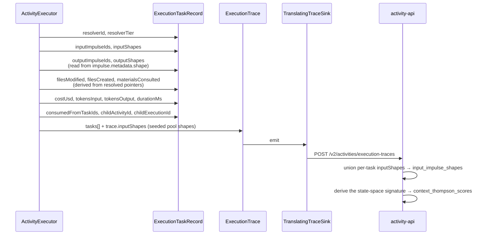
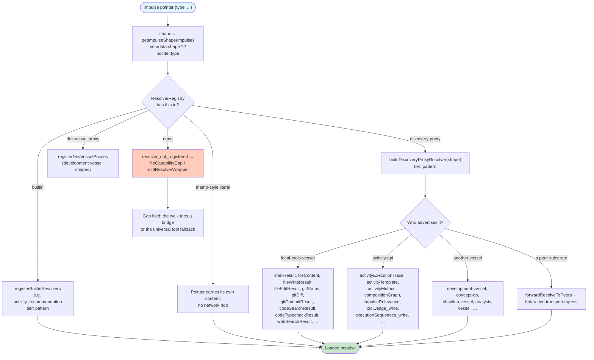
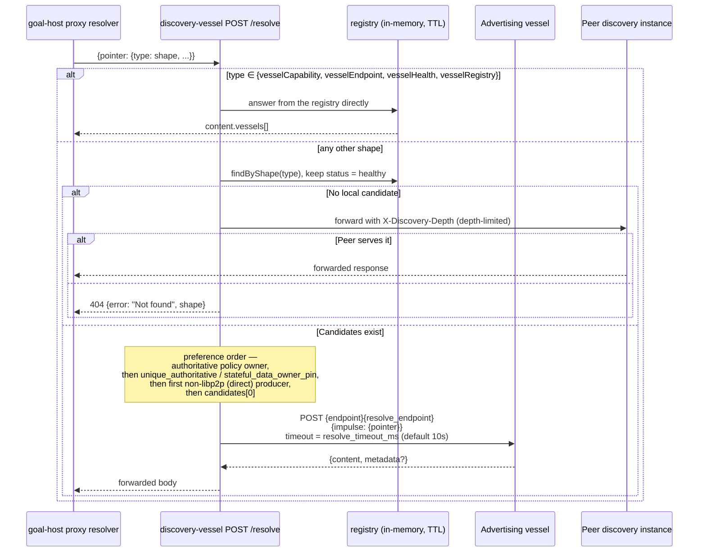
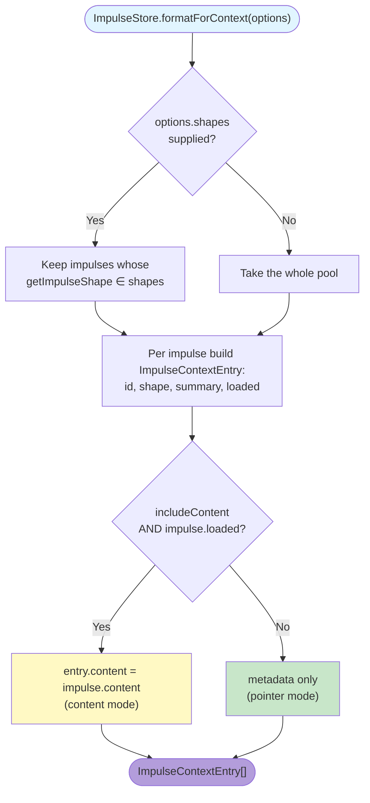

# Impulse Resolution During Activity Execution

> **How to read this.** Resolution is a dispatch chain owned by the executing
> vessel, not by the trace store. `goal-host-vessel` (`:8210`) registers the
> resolvers and runs the chain; `discovery-vessel` (`:8100`) answers "who serves
> this shape"; `local-tools-vessel` (`:8230`) owns filesystem, process, git and
> code-edit shapes; `activity-api` (`:8080`) resolves the activity-related shapes
> it advertises and nothing else. Participants are named by symbol, never by line
> number.

## Overview

This document maps how an impulse pointer becomes content during activity execution: how a resolver is chosen for a shape, how a shape nobody local serves is routed through discovery, and what the execution trace records about the resolution afterwards.

The load-bearing claim is architectural: **resolver dispatch belongs to the executing vessel.** `ResolverRegistry` in `@avigopal/ias-executor-ts` is the lookup table, `goal-host-vessel` fills it at startup, and `activity-api` participates as one producer among many rather than as a universal resolution authority.

## Key Concepts

1. **Impulse** — `{ id, pointer, metadata, loaded, content?, budget?, priority? }`; the shape is read via `getImpulseShape`, which prefers `metadata.shape` and falls back to `pointer.type`.
2. **ResolverRegistry** — the per-runtime map of resolver id → `Resolver`, each carrying a `tier` of `deterministic`, `pattern`, `llm`, or `external`.
3. **Registration order** — builtins, then discovery proxies, then development-vessel proxies, then reactive registration on `vessel.registered`.
4. **Discovery routing** — `POST /resolve` on discovery-vessel both answers registry questions and forwards non-registry shapes to the vessel that advertises them.
5. **Transport selection** — `endpointForShape` prefers a peer endpoint, then a libp2p candidate via the federation egress, then the advertised HTTP endpoint.
6. **Execution budget** — enforced per execution as cost, duration and task count, not as a per-impulse token cap.
7. **Attribution** — each `ExecutionTaskRecord` records `resolverId`, `resolverTier`, `inputShapes`, `outputShapes`, `filesModified`, `filesCreated`, `materialsConsulted`.

## Main Sequence Diagram: Complete Resolution Flow

```mermaid
sequenceDiagram
    participant Exec as ActivityExecutor<br/>(ias-executor-ts engine)
    participant Reg as ResolverRegistry
    participant Store as ImpulseStore
    participant Proxy as buildDiscoveryProxyResolver<br/>(goal-host-vessel)
    participant Disc as discovery-vessel<br/>(:8100)
    participant Vessel as Producing vessel<br/>(local-tools / activity-api / peer)
    participant Sink as TranslatingTraceSink<br/>→ activity-api

    Exec->>Store: collect input impulses for the task
    Note over Store: formatForContext({shapes, includeContent})<br/>returns metadata-first entries; content only<br/>when the impulse is already loaded

    Exec->>Reg: lookup resolver for task.resolver / shape
    alt Resolver registered locally
        Reg-->>Exec: Resolver (deterministic | pattern | llm | external)
    else Not registered
        Reg-->>Exec: resolver_not_registered
        Note over Exec: the walk treats this as a missing producer<br/>and files a capability gap
    end

    Exec->>Proxy: resolve(context)
    activate Proxy
    Proxy->>Proxy: buildImpulseSlots(inputImpulses)<br/>interpolateProxyValue(config, variables, slots)
    Note over Proxy: pointer = { type: shape, ...variables, ...config }

    alt Endpoint already cached in shapeEndpointMap
        Proxy->>Proxy: reuse endpoint + resolvePath
    else Cold
        Proxy->>Disc: POST /resolve<br/>{pointer: {type: "vesselCapability", shape}}
        Disc-->>Proxy: content.vessels[] (endpoint, resolve_endpoint,<br/>protocol, libp2p_multiaddr, peerEndpoint)
        alt protocol = libp2p
            Proxy->>Proxy: route via federation egress<br/>/egress/resolve?target=<multiaddr>
        else discoveredVia = peer
            Proxy->>Proxy: use peerEndpoint + its resolve_endpoint
        else direct
            Proxy->>Proxy: use endpoint + resolve_endpoint<br/>(default /v2/impulses/resolve)
        end
    end

    Proxy->>Vessel: POST {endpoint}{resolvePath}<br/>{impulse: {pointer}}
    Vessel-->>Proxy: {content, metadata?}
    Proxy-->>Exec: output Impulse (loaded, metadata.shape set)
    deactivate Proxy

    Exec->>Store: put(outputImpulse)
    Exec->>Exec: record ExecutionTaskRecord<br/>{resolverId, resolverTier, inputShapes,<br/>outputShapes, filesModified, filesCreated,<br/>materialsConsulted, costUsd, durationMs}

    Exec->>Exec: budget check<br/>maxTaskCount / maxDurationMs / maxCostUsd
    alt Budget exceeded
        Exec->>Exec: throw BudgetExceededError<br/>→ failureMode {type: "budget_exhausted"}
    end

    Exec->>Sink: ExecutionTrace (tasks, inputShapes, outputImpulseIds, failureMode)
    Sink->>Sink: filter failureMode.type to the canonical set
    Sink-->>Exec: POST /v2/activities/execution-traces
```

## Decomposition: Resolver Tracking (Phase 10)

Resolution is recorded on the task record, not in a side channel. Every `ExecutionTaskRecord` the engine emits carries the identity and tier of the resolver that ran, the shapes that went in and came out, and the files the resolver touched.



**Why each field exists:**
- `resolverId` / `resolverTier` — which resolver, and at which tier, so cost and reliability can be attributed per tier.
- `inputShapes` — the union of these is what activity-api needs to compute a state signature; a trace with empty `input_impulse_shapes` makes selection state-blind.
- `outputShapes` — what was genuinely produced, as opposed to what the template declared it might produce.
- `consumedFromTaskIds` and `childActivityId` — the provenance pair that lets the composition-edge reconciler derive genuine producer→consumer edges from placeholder references.
- `filesModified` / `filesCreated` / `materialsConsulted` — the attributed experience log used for locality learning.
- `skipped` — a conditional gate that evaluated false ran no resolver; it is neither success nor failure signal, and consumers must read this flag rather than inferring from `success`.

**Implementation:** `ExecutionTaskRecord` and `ExecutionTrace` in `repos/ias-executor-ts/src/ontology.ts`; population in `ActivityExecutor.execute` (`src/engine.ts`); wire translation in `TranslatingTraceSink` (`src/adapters/activity-api-trace-sink.ts`).

## Decomposition: Relevance-Based Filtering

Impulse relevance is a **learning signal**, not an execution-time gate. Relevance is scored on the backend from observed correlation between loaded impulses and reached executions, and is consumed at selection time as a boost to a candidate template's α — not as a pre-load filter that drops impulses from the pool.

```mermaid
sequenceDiagram
    participant Walk as goal-host walk
    participant API as activity-api
    participant Sink as relevance-sink-vessel<br/>(:8255)
    participant DB as impulse_relevance_metrics

    Note over Walk,API: WRITE PATH (after execution)
    Walk->>API: POST /v2/activities/impulse-relevance<br/>{activity_id, impulse_id, was_loaded, execution_succeeded}
    API->>DB: upsert relevance / irrelevance counts
    Sink->>DB: owns penalty writes, decoupled from the trace store

    Note over Walk,API: READ PATH (at selection)
    Walk->>API: POST /v2/activities/recommend
    API->>API: calculateImpulseRelevancyBoosts(candidates, pooledImpulses)
    API->>API: alphaBoost added to totalBoost; betaPenalty tracked
    API->>API: discoverMissingImpulses → pointer recommendations
    API-->>Walk: recommendations with boost_breakdown
```

This is a deliberate placement. Filtering impulses out before a task runs would hide them from the trace, and an impulse that never appears in a trace can never be scored — the signal would extinguish itself. Instead the pool stays whole, the trace records what was consumed, and the relevance the backend learns steers *which activity is selected* for a given pool rather than *which impulses that activity may see*.

**Implementation:** `calculateImpulseRelevancyBoosts` and `discoverMissingImpulses` in `repos/activity-api/src/utils/impulse-relevancy.ts`; the `/v2/activities/impulse-relevance` handlers in `repos/activity-api/src/routes/activities.ts`; penalty writes in `repos/relevance-sink-vessel/`.

## Decomposition: Pointer Resolution by Type

A pointer's `type` is the shape key. Resolution is a registry lookup first and a network call second — there is no hardcoded type switch in the executing vessel. What varies is *who* is registered for a shape and how far the request has to travel.



The consequence worth internalising: adding a capability means advertising a shape from a vessel, not adding a case to a resolver switch. A shape nobody advertises produces `resolver_not_registered`, which the walk treats as a missing producer and files as a capability gap rather than as an execution error.

**Implementation:** `getImpulseShape` (`repos/ias-executor-ts/src/ontology.ts`), `ResolverRegistry` (`src/resolvers.ts`), and `registerBuiltinResolvers` / `buildProxyResolver` / `buildDiscoveryProxyResolver` / `registerDiscoveryProxies` / `registerDevVesselProxies` / `mintResolverWrapper` in `repos/goal-host-vessel/src/index.ts`.

## Decomposition: Discovery-Based Resolution

Discovery-vessel plays two roles on one endpoint. For its own registry shapes it answers directly; for every other shape it acts as a resolving proxy, finding a healthy vessel that advertises the shape and forwarding the whole pointer to it.



Registration is by `POST /register` with a heartbeat at `POST /heartbeat`; the registry is in-memory with TTL expiry, and the fleet's shape vocabulary is readable at `GET /shapes`, `GET /registry/shapes` and `GET /registry/shape-descriptions`. Registration and expiry are also broadcast as `vessel.registered`, `vessel.heartbeat`, `vessel.deregistered` and `vessel.expired`, which is how `startVesselRegistrationSubscriber` in goal-host-vessel adds a proxy resolver for a newly-appeared vessel without a restart.

**Implementation:** the `/resolve`, `/register`, `/heartbeat`, `/shapes` and `/registry/*` handlers in `repos/discovery-vessel/src/index.ts`; the registry itself in `src/registry.ts`; transport selection in `endpointForShape` and `routeThroughEgress` (`repos/goal-host-vessel/src/index.ts`).

## Decomposition: Dual-Mode Content Formatting

The pool is presented metadata-first. `ImpulseStore.formatForContext` returns one `ImpulseContextEntry` per impulse — `{ id, shape, summary, loaded }` — and attaches `content` only when the caller passes `includeContent: true` **and** the impulse is already loaded.



The two modes are the point of the ontology: an impulse is a **lazy pointer with metadata**, so the default view of the pool is what shapes exist and what they summarise, and content is materialised only where a task actually needs it. `loadedSummaries` is the same idea narrowed to already-loaded impulses, and `findByShape` is the shape-keyed lookup a task uses to bind one declared input.

**Implementation:** `ImpulseStore.formatForContext`, `loadedSummaries`, `findByShape` and the `FormatForContextOptions` / `ImpulseContextEntry` types in `repos/ias-executor-ts/src/impulses.ts`.

## Budget Enforcement and Truncation

Budget is enforced **per execution**, not per impulse. `ExecuteOptions.budget` carries an `ExecutionBudget`, and the engine checks it at task boundaries; breaching it raises `BudgetExceededError`, which the engine converts into a `failureMode` of type `budget_exhausted` on the trace.

`Impulse.budget` exists as an advisory number on the impulse itself, and `priority` (`critical` | `high` | `medium` | `low`) ranks impulses for callers that need to choose. Neither is a truncation mechanism — the executor does not silently cut content to fit a token ceiling, because a silently truncated impulse would make a downstream failure unattributable.

### Budget Metadata Structure

The execution-level budget the engine enforces:

```typescript
interface ExecutionBudget {
  maxCostUsd?: number;      // checked after cost accrues on a task
  maxDurationMs?: number;   // checked against elapsed wall time
  maxTaskCount?: number;    // checked against taskRecords.length
}
```

The per-impulse advisory fields on `Impulse`:

```typescript
{
  budget?: number;                                        // advisory allocation
  priority?: "critical" | "high" | "medium" | "low";      // ranking hint
}
```

A breach of any execution-level ceiling is recorded as `FailureMode { type: "budget_exhausted", reason, context: { budget_type, consumed, allowed } }`, which the posterior update treats as a **half penalty** (β += 0.5) rather than a full one: the execution ran and hit a ceiling, which is not the same evidence as producing a wrong answer.

### Truncation Algorithm

There is no content-truncation step in the execution path. The engine's bounding is by refusal, not by silent shortening:

```
before each task:
    if budget.maxTaskCount  and taskRecords.length >= maxTaskCount  → BudgetExceededError("task_count")
    if budget.maxDurationMs and elapsed            >= maxDurationMs → BudgetExceededError("duration")
after cost accrues:
    if budget.maxCostUsd    and totalCostUsd       >= maxCostUsd    → BudgetExceededError("cost")
```

Bounding of individual resolver payloads is the producing vessel's responsibility — a shell resolver bounds its own output, a search resolver bounds its own result set — so the bound is visible in the produced impulse rather than applied invisibly by the executor. Anything a consumer must know about a bound belongs in the impulse's metadata, which is exactly what the metadata-first formatting above surfaces.

## State Transition Tracking (P3.2)

What the trace records is **attribution**, not a before/after filesystem diff. Each task reports the paths it wrote, the paths it created, and the material locators it read; the trace as a whole reports the shapes seeded into the pool and the shapes produced. Together these answer "what did this run touch, and what did it turn into" without requiring the executor to hash a working tree.

### Before/After Hashing

The executor does not hash the working tree. Change is evidenced by three narrower, cheaper signals that survive across vessels:

- **Per-task file attribution** — `filesModified`, `filesCreated` and `materialsConsulted` are derived from the pointers the task actually resolved, so attribution is a by-product of resolution rather than a separate scan.
- **Shape flow** — `inputShapes` and `outputShapes` on each task say which shapes were consumed and which were genuinely produced, which is what the composition-edge reconciler needs.
- **Verified post-state on edit goals** — for code-change goals, `verifyEditPostState` and `symbolOnAddedLine` in goal-host-vessel check the landed commit for the expected symbol on an added line, which is a stronger claim than a hash comparison because it survives reformatting and is checked against origin rather than a local clone.

The reach gate depends on this distinction. `verifyGoalReached` grades a `mitosisStaged` shape with no landing evidence as `deterministic:staged-not-landed`: a working-tree change that never reached origin is not a state transition anyone downstream can observe.

### State Transition Structure

The fields the engine actually populates:

```typescript
interface ExecutionTaskRecord {
  taskId: string;
  resolverId: string;
  resolverTier?: "deterministic" | "pattern" | "llm" | "external";
  inputImpulseIds: string[];
  inputShapes?: string[];
  outputImpulseIds: string[];
  outputShapes?: string[];        // read from impulse.metadata.shape at run time
  success: boolean;
  skipped?: boolean;              // conditional gate false, or dependency skipped
  error?: string;
  costUsd?: number;
  tokensInput?: number;
  tokensOutput?: number;
  durationMs?: number;
  consumedFromTaskIds?: string[]; // placeholder-reference provenance
  childActivityId?: string;       // sub-activity dispatched by this task
  childExecutionId?: string;
  filesModified?: string[];
  filesCreated?: string[];
  materialsConsulted?: string[];  // "file:<path>" locators read
}
```

At trace level: `inputShapes` records the seeded pool state that selection conditioned on, `compositionChain` records the parent chain, `failureMode` records the taxonomy verdict, and `metadata` is a free-form bag the activity-api trace sink stores verbatim so cross-vessel additions do not need a wire revision.

## Key Configuration Variables

Configuration here is bootstrap-only — ports, endpoints and identity frozen at process start. Behaviour that should be learnable is steered by shaped impulses, not by these.

| Variable | Where it applies | Purpose |
|----------|------------------|---------|
| `PORT` | every vessel unit | In-container listen port (`8210` goal-host, `8100` discovery, `8230` local-tools, `8080` activity-api, `8260` concept-db) |
| `DISCOVERY_ENABLED` | activity-api | Whether to register with discovery-vessel on startup |
| `DISCOVERY_VESSEL_ENDPOINT` | vessel clients | Discovery service URL used for registration and resolution |
| `DISCOVERY_HEARTBEAT_INTERVAL_MS` | vessel clients | Heartbeat cadence that keeps a registry entry alive |
| `VESSEL_ID` | vessel clients | Registry identity for the vessel |
| `IAS_SUBSCRIBER_MAX_INFLIGHT` | ias-executor-ts | Cap on concurrent fire-and-forget lifecycle-subscriber dispatches (default 64) |
| `LOCAL_TOOLS_GC_INTERVAL_MS` | local-tools-vessel | Interval of the periodic forced full GC workaround |

Per-vessel `resolve_timeout_ms` is a **registry** property rather than an environment variable: a vessel advertises it at registration and discovery honours it when forwarding, defaulting to ten seconds.

## Performance Characteristics

Latency is dominated by hop count, not by pointer type. Three regimes exist, and the resolver tier on the task record is what lets them be told apart after the fact.

| Regime | Path | Cost driver |
|--------|------|-------------|
| In-process | Pointer carries its own content, or a builtin resolver answers from memory | None beyond the resolver body |
| One hop | `buildDiscoveryProxyResolver` with a warm `shapeEndpointMap` entry, POSTing straight to the advertising vessel | One HTTP round trip, bounded by the vessel's `resolve_timeout_ms` |
| Two hops | Cold cache: a discovery lookup (5s abort) followed by the producer call | Two round trips; the endpoint is then cached for subsequent resolves |
| Federated | libp2p or peer routing through the federation transport egress, or `forwardResolveToPeers` on discovery | Adds the relay leg; depth-limited to prevent loops |

The `llm` tier is the outlier in cost rather than latency, and is the reason `resolverTier` and `costUsd` are recorded per task: the aggregate cost of a walk is attributable to the tier that spent it, which is what makes tier substitution a measurable optimisation rather than a guess.

## File References

| Component | Location | Entry symbols |
|-----------|----------|---------------|
| Impulse pool | `repos/ias-executor-ts/src/impulses.ts` | `ImpulseStore`, `formatForContext`, `findByShape`, `loadedSummaries` |
| Ontology | `repos/ias-executor-ts/src/ontology.ts` | `Impulse`, `ImpulsePointer`, `getImpulseShape`, `ExecutionTaskRecord`, `ExecutionTrace`, `FailureMode` |
| Resolver contract | `repos/ias-executor-ts/src/resolvers.ts` | `Resolver`, `ResolverContext`, `ResolverRegistry` |
| Ports | `repos/ias-executor-ts/src/ports.ts` | `FileSystemPort`, `ProcessPort`, `GitPort`, `LLMPort`, `DiscoveryPort`, `TraceSink` |
| Execution + budget | `repos/ias-executor-ts/src/engine.ts` | `ActivityExecutor.execute`, `BudgetExceededError` |
| Trace wire translation | `repos/ias-executor-ts/src/adapters/activity-api-trace-sink.ts` | `TranslatingTraceSink` |
| Resolver registration | `repos/goal-host-vessel/src/index.ts` | `registerBuiltinResolvers`, `registerDiscoveryProxies`, `registerDevVesselProxies`, `startVesselRegistrationSubscriber` |
| Proxy resolvers | `repos/goal-host-vessel/src/index.ts` | `buildProxyResolver`, `buildDiscoveryProxyResolver`, `buildImpulseSlots`, `interpolateProxyValue` |
| Transport selection | `repos/goal-host-vessel/src/index.ts` | `endpointForShape`, `routeThroughEgress` |
| Discovery | `repos/discovery-vessel/src/index.ts`, `src/registry.ts` | `/resolve`, `/register`, `/heartbeat`, `/shapes` |
| Filesystem/process shapes | `repos/local-tools-vessel/src/index.ts` | advertised shape list + resolver map |
| Activity-shape resolution | `repos/activity-api/src/routes/impulses.ts` | `/v2/impulses/resolve` |
| Relevance | `repos/activity-api/src/utils/impulse-relevancy.ts` | `calculateImpulseRelevancyBoosts`, `discoverMissingImpulses` |

## Implementation Architecture

Resolution spans three vessels with one rule between them: the executing vessel dispatches, the registry routes, and the producer resolves. No participant is allowed to become a universal resolver, because that would collapse the shape vocabulary into one service's API surface.

### goal-host-vessel (Execution Environment)

**Responsibilities:**
- Own the `ResolverRegistry` for the execution runtime and populate it: builtins via `registerBuiltinResolvers`, discovery-advertised shapes via `registerDiscoveryProxies`, development-vessel shapes via `registerDevVesselProxies`.
- Keep it current reactively — `startVesselRegistrationSubscriber` adds a proxy when a `vessel.registered` event arrives, so a newly-started vessel is usable without restarting the host.
- Build pointers from task config plus variables plus input-impulse slots (`buildImpulseSlots`, `interpolateProxyValue`) before any network call.
- Choose transport per resolve (`endpointForShape`, `routeThroughEgress`), including the libp2p egress path for peer vessels.
- Cache resolved endpoints in `shapeEndpointMap` so the steady state is one hop.
- Treat an unresolvable shape as a capability gap (`fileCapabilityGap`, `fileReachabilityGap`, `mintResolverWrapper`), not as an execution error.

**What it does not do:** it does not persist impulses, compute relevance, or hold the fleet registry.

### Activity-API (Storage & Learning Backend)

**Responsibilities:**
- Resolve the activity-related shapes it advertises at `POST /v2/impulses/resolve` — among them `activityExecutionTrace`, `activityTemplate`, `activityMetrics`, `compositionGraph`, `impulseRelevance`, and mutation shapes such as `toolUsage_write` and `executionSequences_write`. The advertised set is far longer than this sample and is listed as `discovery.shapes` in `repos/activity-api/src/config.ts`; the vessel's own `scripts/check-shape-dispatch.ts` compares that list against the `case` labels in `repos/activity-api/src/routes/impulses.ts` and reports the disagreements. Read `discovery.shapes` — not this doc — as the name of record.
- Persist execution traces at `POST /v2/activities/execution-traces` and derive the state-space signature from their unioned `input_impulse_shapes`.
- Accumulate impulse relevance at `/v2/activities/impulse-relevance` and serve it back as selection boosts.
- Host the WebSocket broadcast bus that other vessels subscribe to.
- Register itself with discovery-vessel and heartbeat, so it is discovered like any other producer.

**What it does not do:** it does not own resolver dispatch, does not resolve shapes it never advertised, and is not a fallback for arbitrary pointers. Its legacy `/v2/vessels/*` endpoints are deprecated in favour of discovery-vessel.

### Discovery-Vessel (Capability Registry)

**Responsibilities:**
- Accept registrations (`POST /register`) and heartbeats (`POST /heartbeat`) into a TTL-bounded in-memory registry.
- Answer capability questions for its own shapes — `vesselCapability`, `vesselEndpoint`, `vesselHealth`, `vesselRegistry`.
- Forward every other pointer to a healthy advertising vessel, honouring that vessel's `resolve_endpoint` and `resolve_timeout_ms`.
- Apply placement policy when several vessels serve a shape: an authoritative policy owner wins, then `unique_authoritative` / `stateful_data_owner_pin`, then a direct (non-libp2p) local producer, then the first candidate.
- Forward to peer discovery instances when no local vessel serves the shape, depth-limited via `X-Discovery-Depth`.
- Publish `vessel.registered`, `vessel.heartbeat`, `vessel.deregistered`, `vessel.expired`.
- Expose the live shape vocabulary at `GET /shapes`, `/registry/shapes`, `/registry/shape-descriptions`, and health at `/registry/stats`, `/metrics`.

### SurrealDB Schema

Impulse-related persistence lives in activity-api's database. The tables that matter to this sequence:

- `impulse` — persisted impulses (pointer plus metadata).
- `impulse_relevance_metrics` — activity→impulse relevance and irrelevance counts.
- `impulse_shape_activity_score`, `impulse_shape_statistics` — per-shape selection statistics.
- `impulse_resolution_metrics`, `impulse_usage_history` — resolution outcomes and load history.
- `activity_execution_traces` — the trace rows, from which `input_impulse_shapes` and the state signature are derived.
- `context_thompson_scores` — the state-conditioned posteriors those signatures feed.

Discovery-vessel's registry is deliberately **not** in this list: it is in-memory with TTL expiry, so a vessel that stops heartbeating stops being routable without anyone writing a tombstone.

### Correct Separation

**Execution-time (goal-host-vessel):** registry population, pointer construction, transport selection, endpoint caching, gap filing on unresolvable shapes, task-record attribution, execution-budget enforcement.

**Routing (discovery-vessel):** registration, TTL, health filtering, placement policy, forwarding, peer federation, shape-vocabulary publication.

**Storage and learning (activity-api):** resolution of its own advertised shapes, trace persistence, relevance accumulation, state-signature derivation, the event bus.

**Why this separation matters:**
- A vessel can be added, moved or removed and become reachable purely by advertising its shapes — no executor change, no hardcoded endpoint.
- Local shapes resolve without the trace store being up; a backend outage degrades learning, not execution.
- Data locality is enforceable: a resolver lives where its data lives, and discovery routes to it rather than the data being copied to a central resolver.
- Federation is a routing concern, so a shape served on another substrate resolves through the same call the local one does.

**Key architectural point:** dispatch belongs to the executing vessel. The backend is one resolver among many, and treating the trace store as a universal resolver is the failure mode this split exists to prevent.

## Related Documentation

- [Activity Selection](./01-activity-selection.md) — how activities are chosen and graded
- [Resolver Processing](./03-resolver-processing.md) — how resolvers consume and produce impulses
- [RESOLVER_TRACKING.md](../RESOLVER_TRACKING.md) — resolver attribution in traces
- [IMPULSE_STATE_SPACE_SPEC.md](../IMPULSE_STATE_SPACE_SPEC.md) — the state-space model
- [IMPULSE_ACTIVITY_FOUNDATION.md](../IMPULSE_ACTIVITY_FOUNDATION.md) — the foundational model
