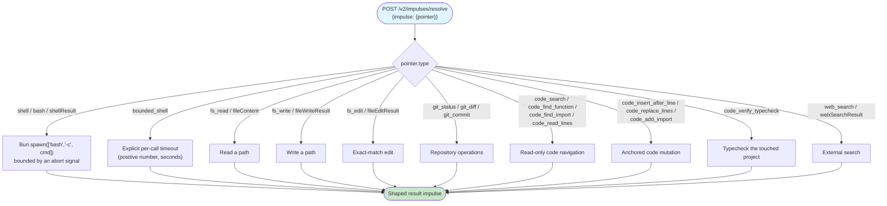
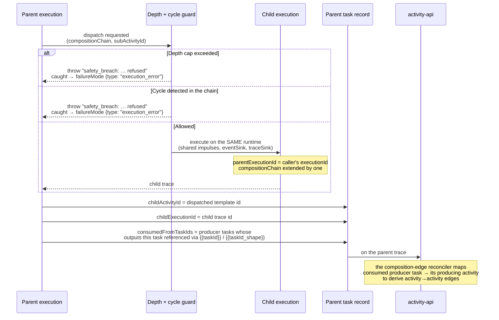
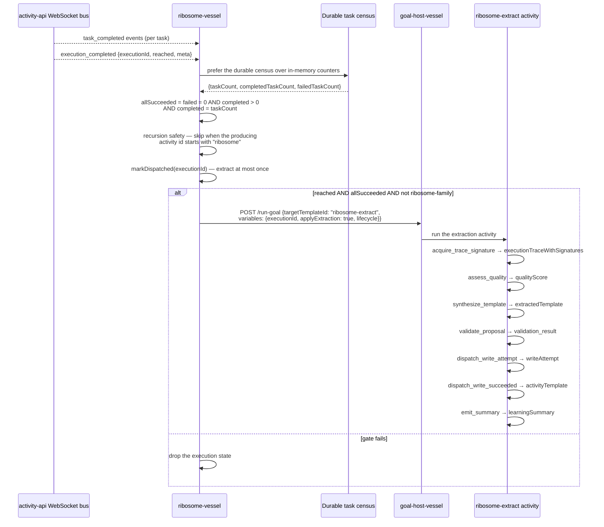
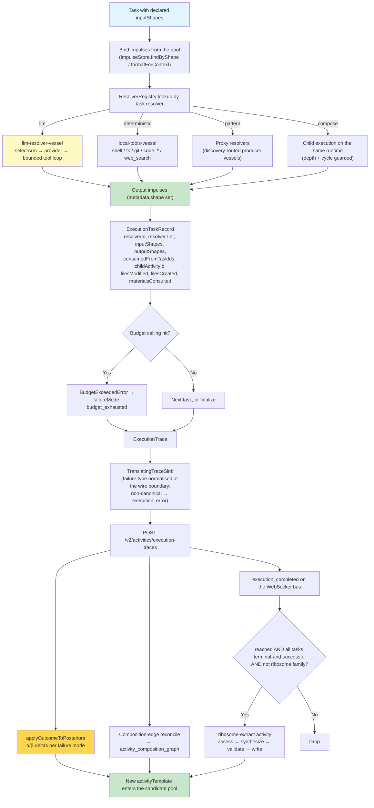

# Processing of Required Input Impulses by Resolvers

> **How to read this.** Resolvers run in the vessel that owns their data. The
> LLM tier is `llm-resolver-vessel` (`:8220`, with per-model siblings on `:8221`,
> `:8223`, `:8225`); the deterministic tier — shell, filesystem, git, code edits,
> web search — is `local-tools-vessel` (`:8230`); nested activity dispatch is the
> engine's own `compose` / `compose_parallel` path in `@avigopal/ias-executor-ts`;
> template extraction is the `ribosome-extract` activity, triggered by
> `ribosome-vessel` (`:8240`). Cite by symbol, never by line number.

## Overview

This document maps how a resolver turns required input impulses into output impulses: what a resolver contract looks like, how the LLM tier runs a bounded tool loop, how the deterministic tier executes and bounds its own work, how one activity dispatches another, and how a reached execution becomes a reusable template.

The unifying idea is that all four are the same contract. A resolver is `{ id, tier, resolve(context) }` where `tier` is one of `deterministic`, `pattern`, `llm`, `external`, and every one of them consumes impulses from the pool and returns impulses back into it. Nothing in the engine special-cases "the LLM" — it is one tier among four.

## Key Concepts

1. **Resolver contract** — `Resolver { id, tier, resolve(ctx) }` from `repos/ias-executor-ts/src/resolvers.ts`; `ResolverContext` carries the task, variables, input impulses, and the ports.
2. **Resolver tiers** — `deterministic`, `pattern`, `llm`, `external`; the tier is recorded on every `ExecutionTaskRecord`.
3. **Bounded LLM tool loop** — `llm-resolver-vessel` iterates on `stop_reason === "tool_use"` up to `max_tool_iterations`, defaulting to 20 and hard-capped at 30.
4. **Grounded floor loop** — `runGroundedToolLoop` in goal-host-vessel: at most 4 iterations, 8 calls per iteration, wall-clock deadline, deduplicated calls, and a strict separation of *grounding* (reads) from *side effects* (writes).
5. **Nested dispatch** — `compose` and `compose_parallel` task resolvers, plus the `activity` resolver, run a child template on the same runtime with `parentExecutionId` and an extended `compositionChain`.
6. **Composition provenance** — `consumedFromTaskIds` and `childActivityId` are what let producer→consumer activity edges be derived from placeholder references.
7. **Ribosome** — a reached execution triggers the `ribosome-extract` activity, whose tasks assess quality, synthesise a template, validate it, and attempt the write.

## Main Sequence Diagram: Complete Resolver Flow

```mermaid
sequenceDiagram
    participant Exec as ActivityExecutor<br/>(ias-executor-ts)
    participant Pool as ImpulseStore
    participant Reg as ResolverRegistry
    participant LLM as llm-resolver-vessel<br/>(:8220)
    participant Tools as local-tools-vessel<br/>(:8230)
    participant Child as Child execution<br/>(compose)
    participant API as activity-api<br/>(:8080)
    participant Ribo as ribosome-vessel<br/>(:8240)

    Exec->>Pool: bind declared inputShapes from the pool
    Pool-->>Exec: input impulses (metadata-first)

    Exec->>Reg: resolver for task.resolver
    Reg-->>Exec: {id, tier, resolve}

    alt tier = llm
        Exec->>LLM: POST resolve {pointer: {type: "llm_completion_dispatch",<br/>prompt, tools?, max_tokens, max_tool_iterations?}}
        activate LLM
        LLM->>LLM: selectArm(taskType, availableModels) → model
        loop while stop_reason = "tool_use" (≤ max_tool_iterations, hard cap 30)
            LLM->>LLM: provider call with tools
            LLM->>Tools: execute each tool_use block
            Tools-->>LLM: tool_result (is_error on failure)
            LLM->>LLM: append assistant + tool_result turns
        end
        LLM->>LLM: recordArmOutcome(model, ok, taskType)
        LLM-->>Exec: {shape: "llmCompletion", content, usage, cost}
        deactivate LLM

    else tier = deterministic
        Exec->>Tools: POST /v2/impulses/resolve {impulse: {pointer}}
        activate Tools
        Note over Tools: shell / bounded_shell / fs_read / fs_write / fs_edit /<br/>git_status / git_diff / git_commit / code_* / web_search<br/>each bounds its own timeout and output
        Tools-->>Exec: {shellResult | fileContent | gitDiff | code*Result | …}
        deactivate Tools

    else task.resolver = compose / compose_parallel
        Exec->>Exec: depth + cycle check on compositionChain
        alt refused
            Exec->>Exec: throw "safety_breach: dispatch refused …"<br/>caught → failureMode {type: "execution_error"}
        else allowed
            Exec->>Child: run child template on the same runtime<br/>(parentExecutionId, compositionChain + 1)
            Child-->>Exec: child trace; record childActivityId + childExecutionId
        end
    end

    Exec->>Pool: put output impulses (metadata.shape set)
    Exec->>Exec: ExecutionTaskRecord {resolverId, resolverTier,<br/>inputShapes, outputShapes, consumedFromTaskIds,<br/>filesModified, filesCreated, materialsConsulted, cost, tokens}

    Exec->>API: POST /v2/activities/execution-traces
    API->>API: applyOutcomeToPosteriors (α/β by failure mode)
    API-->>Ribo: execution_completed on the WebSocket bus

    Ribo->>Ribo: gate: reached AND every task terminal-and-successful<br/>AND producer is not the ribosome family
    alt gate passes
        Ribo->>Exec: POST /run-goal {targetTemplateId: "ribosome-extract",<br/>variables: {executionId, applyExtraction, lifecycle}}
    end
```

## Decomposition: LLM Resolver with Impulse Context

The LLM tier is a vessel, reached through discovery like any other producer. It accepts a prompt plus an optional Anthropic-style tool array and returns an `llmCompletion` shape. When tools are present it owns the loop; when they are absent it is a single completion.

```mermaid
sequenceDiagram
    participant Task as Task (llm tier)
    participant Vessel as llm-resolver-vessel
    participant Policy as model-policy
    participant Provider as Model provider
    participant Tool as Client-side tool

    Task->>Vessel: {prompt, tools?, max_tokens, max_tool_iterations?}
    Vessel->>Policy: selectArm(taskType, availableModels)
    Note over Policy: PolicyArm chosen from the learned model policy;<br/>drafting task types are held to capable arms
    Policy-->>Vessel: ArmSelection {model}

    alt No tools
        Vessel->>Provider: single completion (cacheable byte-prefix:<br/>tools → system → messages)
        Provider-->>Vessel: content
    else Tools present
        Note over Vessel: maxIter = clamp(max_tool_iterations ?? 20, 1, 30)<br/>client-side tools require an API key
        loop until stop_reason ≠ "tool_use" or maxIter
            Vessel->>Provider: messages + tools
            Provider-->>Vessel: content blocks
            alt stop_reason ≠ "tool_use"
                Note over Vessel: final answer — exit loop
            else tool_use blocks present
                loop each tool_use block
                    Vessel->>Tool: execute(name, input)
                    Tool-->>Vessel: result (is_error when it failed)
                end
                Vessel->>Vessel: append assistant turn + tool_result turn
            end
        end
    end

    Vessel->>Policy: recordArmOutcome(model, ok, taskType)
    Vessel-->>Task: {shape: "llmCompletion", content, usage}
```

**Properties that matter downstream:**
- The iteration cap is configurable per request and clamped by the vessel; `LLM_MAX_TOOL_ITERATIONS` sets the default and 30 is the ceiling regardless.
- Model choice is a learned policy, not a literal: `selectArm` picks and `recordArmOutcome` grades, so a weak arm loses traffic on evidence rather than by being edited out.
- Prompt caching is a byte-prefix match rendered in the order tools → system → messages, so anything that varies per call belongs at the end of the prompt.
- The vessel advertises `llm_completion`, `llmCompletion`, `llmModelPolicy`, `llmModelPolicy_write` and `llmQuotaState`; the policy itself is therefore readable and writable as a shape.

**Implementation:** `repos/llm-resolver-vessel/src/index.ts` (dispatch, tool loop, cache prefix) and `src/model-policy.ts` (`loadPolicy`, `selectArm`, `recordArmOutcome`, `ensureArmsForModels`, `providerFor`).

## Decomposition: Deterministic Resolvers (Bash & Git)

`local-tools-vessel` owns everything that touches the filesystem, a process, or a repository. Each handler bounds its own execution and returns a shaped result; nothing is unbounded, and nothing is retried silently.



Two conventions are worth stating explicitly. First, **advertised output shapes double as pointer types**: `shellResult` routes to the same handler as `shell`, `fileContent` to the same handler as `fs_read`, and so on, so a discovery-routed resolve whose pointer type is the *output* shape still lands correctly. Second, the tool names the code-edit route drives (`code_search`, `code_read_lines`, `code_replace_lines`, …) are advertised in their own right — a capability that exists but is not advertised is unreachable through discovery, which is indistinguishable from not existing.

**Implementation:** the resolver map and advertised shape list in `repos/local-tools-vessel/src/index.ts`, hosted by `VesselDaemon` from `repos/ias-executor-ts/src/hosts/vessel-daemon.ts`.

## Activity Resolver (Composition)

Composition is how an activity gets work done that it does not itself know how to do. Three mechanisms exist and they differ in who chooses the child: the `compose` task resolver names a `subActivityId` in the template, `compose_parallel` names several, and the `activity` resolver takes an inline template or a `templateId` from config or from a prior task's output.

### How Activity Composition Works



Sharing the runtime is the important detail: the child sees the same impulse pool and writes into it, so data flows shape-to-shape rather than through a serialised argument blob. The recursion guard is enforced **before** the child starts, so a refused dispatch surfaces immediately as a refusal — an error whose message is prefixed `safety_breach:` — rather than as a cascade of timeouts.

Failures inside the `activity` resolver are caught and returned as an impulse with `shape: "activityExecutionError"`, which the calling template normally lists in its output shapes so a consumer can branch on it.

**Implementation:** the `compose` / `compose_parallel` branches and their depth/cycle guards in `ActivityExecutor.execute` (`repos/ias-executor-ts/src/engine.ts`); the standalone `activity` resolver in `src/resolvers/activity.ts`.

### Activity Tool Definition

Nested dispatch is declared on the task, not offered to the model as a free-form tool. The template names what it composes, which is what makes the composition auditable and the depth cap enforceable:

```typescript
// compose — one child
{ id: "run_child", resolver: "compose", subActivityId: "child-template-id", ... }

// compose_parallel — several children
{ id: "fan_out",  resolver: "compose_parallel", subActivityIds: ["a", "b", "c"], ... }
```

The `activity` resolver is the dynamic form, used when the child is only known at run time — a validator chosen by a prior task, or an escalation target selected from a variant result:

```typescript
{
  template?:   ActivityTemplate,           // inline; wins over templateId
  templateId?: string,                     // resolved via TemplateProvider
  variables?:  Record<string, unknown>,    // merged with context.variables
}
```

A task using `compose` without `subActivityId`, or `compose_parallel` without `subActivityIds`, is rejected by the engine as a template error rather than being silently skipped.

### Composition Edge Recording

Edges are **derived from traces**, not declared by the caller. The parent trace carries `consumedFromTaskIds` and `childActivityId` per task; a reconciler maps a consumed producer task to the activity that produced it and writes the resulting activity→activity edge.

```
POST /v2/activities/composition
  {parent_activity_id, child_activity_id, execution_id, success, ...}
    → upsert into activity_composition_graph
```

The write path refuses defensively: an edge with a missing or blank parent or child id is skipped with a warning rather than persisted, because a malformed edge aborts the reconcile run on first read. `classifyCompositionEdge` then labels the edge:

- **`hub`** — either endpoint matches a hub marker (`validator-dispatch`, `slot-binding`).
- **`scaffold`** — either endpoint matches a scaffold marker (`compose-`, `genuine-edge-probe`), or the pair is unproven.
- **`genuine`** — only with empirical evidence: at least 5 executions with at least 3 successes, or a demonstrated shape flow from the parent's outputs into the child's inputs.

Read-time callers that supply no evidence get the legacy node-name verdict, which is why the honest genuine-count comes from write-path callers that pass recurrence or shape-flow evidence.

**Note on a retired table.** The older `composition_edge` table, its `fn::update_composition_edge` helper, its writer and reader routes, and the `compositionEdge_write` impulse shape were all removed. The live surface is the sibling table `activity_composition_graph`, served by `POST /v2/activities/composition` and read back at `/composition/graph`, `/composition/successors`, `/composition/state-transitions` and `/composition/impulse-success`.

### Recursive Execution Tracking

Every nested execution is reconstructable from three fields. `parentExecutionId` links a child trace to its caller, `compositionChain` records the full ancestry as an ordered list of activity ids, and `childExecutionId` on the parent's task record links the other way.

```
compositionChain = ["goal-walk-root", "derive-findings", "emit-note"]
                     depth 0            depth 1           depth 2
```

Depth is read from the chain length rather than tracked separately, which is why the guard can refuse a dispatch before the child starts and why a cycle — the same activity id already present in the chain — is detectable at dispatch time. Both refusals are raised as a thrown error whose message begins `safety_breach:`; the engine's catch turns any non-budget throw into `failureMode {type: "execution_error"}`, so a capped run is identified by that message rather than by a distinct failure-mode type on the trace.

`tierOf` and `tierFromChain` in goal-host-vessel classify the resulting chain into a walk tier, which is what `recordGoalPath` stores as `walk_tier`: any reused learned or composed activity in the chain makes the whole walk a `learned_pathway`.

### Composition Learning Benefits

Recording edges as evidence rather than as declarations is what makes composition learnable rather than merely observable:

1. **Which activities genuinely work together** — the `genuine` label requires recurrence with success or demonstrated shape flow, so a one-shot pairing does not inflate the graph.
2. **Reuse ceilings become visible** — a producer that covers two or more of a goal's missing target shapes is preferred over a single-shape satisfier, so the walk selects the composition rather than re-deriving each shape.
3. **Successor lookup** — `/composition/successors` answers "given this activity, what has followed it successfully", which is what turns the graph into a forward-chaining aid rather than an audit artefact.
4. **Failure attribution** — a `cascading` failure mode marks a victim of an upstream cause, and the posterior update deliberately assigns it no penalty so the cause is not double-counted.

## Ribosome Resolver (Template Extraction)

Extraction is an activity, not a library call. `ribosome-vessel` watches the event bus and decides *whether* to extract; the `ribosome-extract` activity template decides *what* the extracted template looks like. Splitting it this way means extraction is itself traced, graded and replaceable.

### How Ribosome Extraction Works



The bus subscription is not the only trigger. `mintReachedTrace` in goal-host-vessel dispatches the same `ribosome-extract` activity directly when a walk reaches, which is the more reliable path because it fires on the reach verdict rather than on an all-tasks-succeeded heuristic. `buildCompositeTraceFromChain` assembles a multi-hop reached walk into a single composite trace with a deterministic id, so re-running the same composition upserts one learned row instead of spawning duplicates.

**Implementation:** `repos/ribosome-vessel/src/index.ts` (`dispatchRibosomeExtract`, `onTaskCompleted`, the `execution_completed` handler, `replay-observer.ts`); the activity itself at `repos/ias-executor-ts/src/templates/lifecycle/ribosome-extract.json`; the direct trigger `mintReachedTrace` and `buildCompositeTraceFromChain` in `repos/goal-host-vessel/src/index.ts`.

### Extraction Criteria

The gate is deliberately strict, because a template extracted from a partial or hollow run poisons every posterior downstream of it. All of the following must hold before `ribosome-extract` is dispatched:

- **Reached.** The execution's reach verdict is true. `status = completed` alone is not sufficient, which is the whole point of the gate in [01](./01-activity-selection.md).
- **Every task terminal and successful.** `failedTaskCount = 0`, `completedTaskCount > 0`, and `completedTaskCount = taskCount`. Requiring the equality is what excludes a run abandoned mid-flight; `failed = 0` alone would score non-terminal tasks as fine.
- **Durable census preferred.** Counts come from the durable per-execution census when it is present and non-empty, falling back to in-memory counters only when the trace store has not converged.
- **Not the ribosome family.** A producing activity id beginning with `ribosome` is excluded at the source, because an extraction run is itself an execution that emits `execution_completed` — without this the ribosome extracts from its own extractions.
- **Once per execution.** `markDispatched` makes the dispatch idempotent across bus replays.

Beyond this gate the activity applies its own quality assessment: `assess_quality` emits a `qualityScore` and the synthesis task is conditional on the `lifecycle.qualityEligible` gate the dispatcher supplies.

### Template Generalization

Synthesis is a task inside the activity (`synthesize_template`, LLM tier), producing an impulse of shape `extractedTemplate`. Because it is a task rather than hardcoded logic, the generalisation strategy is a prompt that can be graded and revised like any other.

What it works from is `executionTraceWithSignatures` — the trace enriched with shape signatures — so the generalisation is anchored on the shapes that actually flowed rather than on prose in the prompt. The output is a proposed activity template: tasks with their resolvers, declared input and output shapes, and the variables the trace showed varying.

The extraction dedupes against existing templates, so re-running a known activity does not mint a near-duplicate; only a genuinely novel reached trajectory becomes a seed. This matters because a duplicate mint splits selection traffic across two uninformed posteriors and raises the growth rate the learning loop has to outpace.

### Validation Rule Extraction

Validation is a separate task (`validate_proposal`) emitting a `validation_result` impulse, and it runs before any write is attempted. Separating proposal from validation is what allows a bad synthesis to be rejected without ever reaching the template store.

The write itself is also split: `dispatch_write_attempt` emits a `writeAttempt`, and only `dispatch_write_succeeded` emits the `activityTemplate` shape plus `goalEnd`. A failed write therefore leaves a recorded attempt rather than a silently missing template, which is the difference between a diagnosable failure and an invisible one.

Beyond the ribosome, the same discipline appears in the standalone validation resolvers — `validation.ts` and `verify-three-invariants.ts` in `repos/ias-executor-ts/src/resolvers/` — which emit `verifier_negative` failure modes rather than throwing, so a failed check grades the posterior instead of aborting the run.

### Ribosome in the Learning Loop

```
1. A goal is walked and the reach gate grades it reached
2. mintReachedTrace (direct) or ribosome-vessel (bus) dispatches ribosome-extract
3. ribosome-extract assesses quality, synthesises, validates, writes
4. The new template enters the candidate pool with a neutral prior
5. A later similar goal retrieves it through the tiered fallback
6. Its outcome updates α/β through applyOutcomeToPosteriors
7. Repeated reuse promotes the chain to walk_tier = learned_pathway
```

The loop only compounds if step 1 is honest. A hollow completion admitted at step 1 mints a template that will be selected, will fail, and will take real traffic with it — which is why the reach gate, not the exit status, is the trigger, and why the extraction gate re-checks the reach verdict rather than trusting the event that woke it.

### Example: Ribosome Self-Development

Extraction applies to the substrate's own development work, because a code-change goal is an ordinary goal. A walk that lands a commit reaches, its trace is extracted, and the resulting template is available to the next similar change.

The reach gate is what keeps this honest for the code-change family specifically. `deterministic:favorable-compose` requires a `FAVORABLE` verdict **and** landing evidence — `push_status: "pushed"` or a `new_git_sha` — and withholds strong credit unless the non-fail-open markers `verified: true` and a non-empty `reachable_symbols` are present. Its mirror image, `deterministic:staged-not-landed`, grades a typecheck-clean patch that never left the clone as not reached. Without both, the system would extract templates for producing changes that were never actually made.

## Tool Argument Pattern Learning

Argument patterns are learned from what tools were actually called with and how those calls turned out. The learning is backend-side and aggregated; the execution path only reports what happened, which keeps the hot path free of the learner and keeps the learner's view honest — it sees the calls that were really made, not the calls a policy said should be made.

Two grains of evidence accumulate. Tool-level usage answers "which tools does this template rely on"; argument-level patterns answer "which argument shapes have succeeded for this tool". The second is what makes a surfaced hint useful rather than merely descriptive.

### Pattern Extraction

Reporting happens on two surfaces. Tool usage is recorded at `POST /v2/activities/tool-usage`, and argument-level patterns at `POST /v2/activities/tool-argument-patterns`, both on activity-api. The engine supplies the raw material on the task record — `resolverId`, `resolverTier`, `costUsd`, `tokensInput`, `tokensOutput`, `durationMs`, `success` — so the aggregate is attributable per tool and per tier.

The grounded floor loop adds a second kind of extraction. `runGroundedToolLoop` keys each call as `${toolName}:${JSON.stringify(args)}` in a `doneKeys` set, so an identical call is never re-executed within a walk, and it records the literal command a tool was run with (`command`, `cmd`, `script`, or `sql` from the arguments) into `commandEvidence`. That evidence is passed to `verifyGoalReached`, which is what allows a reach verdict to scrutinise whether the command that ran actually matches the goal's intent.

### Pattern Storage and Retrieval

```
POST /v2/activities/tool-usage               → tool_usage / tool_usage_patterns
POST /v2/activities/tool-argument-patterns   → tool_argument_pattern
GET  /v2/activities/tool-usage               → aggregated usage
GET  /v2/activities/tool-argument-recommendations
                                             → proven argument patterns for a template
```

Retrieval is a recommendation surface, not a mandate: the caller receives patterns ranked by observed success and decides whether to use them. `tool_execution_stats` holds the per-tool aggregates and `tool_argument_pattern` the per-argument-hash rows.

The same shape of learning drives command reuse in goal-host-vessel. A command that produced a reached answer is persisted by `persistReachedCommand` and replayed for a later instance of the same goal; `tryLexicalRebind` adapts a cached command to a lexically similar goal by diff-aligning the varying slots. Both are suppressible per dispatch through the `ablation` option so a floor arm can be measured against the reused arm rather than assumed better.

## Proven Tool Argument Patterns

When a template has accumulated argument-level evidence, that evidence is surfaced to the caller rather than applied invisibly. `GET /v2/activities/tool-argument-recommendations` returns the patterns a template's prior executions succeeded with, and the caller may inject them as hints into the prompt it builds.

Keeping this advisory is deliberate. An argument pattern that is silently forced would make a failure unattributable — the trace would show a call the model never chose — and would freeze the tool surface at whatever shape happened to work first. Surfacing it as a hint keeps the choice in the trace, which keeps it gradable.

## Error Impulse Creation

Errors are data, not control flow. A resolver that fails returns a shaped impulse describing the failure, and the engine records a `FailureMode` on the trace; neither path throws away the surrounding execution.

### Error Impulse Structure

The nested-dispatch case is the clearest example. The `activity` resolver catches a child failure and returns an impulse carrying:

```typescript
{
  metadata: { shape: "activityExecutionError" },
  // content describes the failure; the calling template normally
  // lists this shape in its outputShapes so a consumer can branch on it
}
```

At trace level the engine records:

```typescript
interface FailureMode {
  type: string;                        // canonical set below
  reason: string;
  context?: Record<string, unknown>;   // e.g. {budget_type, consumed, allowed}
}
```

`TranslatingTraceSink` normalises `failureMode.type` at the wire boundary against `CANONICAL_FAILURE_TYPES` — `verifier_negative`, `budget_exhausted`, `safety_breach`, `cascading`, `user_abort`. A type outside that set (notably the engine's own `execution_error`, which its catch assigns to any non-budget throw) is not dropped: the field is replaced with `{ type: "execution_error" }`, losing the `reason` while the trace still lands. `computeDeltas` in `posterior-update.ts` has no `execution_error` case, so such a trace, whenever `applyOutcomeToPosteriors` grades it at all (an ungraded reach verdict skips the update entirely), falls to its default branch — a warning plus the full `verifier_negative` penalty.

### Error Impulse Injection on Retry

Failures are fed back rather than merely logged. In the grounded floor loop, a failed tool call is pushed into the observation list as `TOOL <name> ERROR: <reason>` and included in the next iteration's prompt alongside the successful observations, under an instruction to reason only over real results. A call that failed is not added to `doneKeys`, so it may be retried with different arguments; a call that succeeded is, so it cannot spin.

The loop stops itself in three ways: the iteration cap, the wall-clock deadline enforced inside a turn as well as between turns, and a no-progress check — if an iteration executed nothing new, because every call was a duplicate, unauthorised, or failed, the loop breaks rather than spinning.

At walk level the equivalent feedback is the recovery loop in [04](./04-improvisation-failure-modes.md): the reach verdict's `reason` and `completion_shapes` are what `recommendExcluding` uses to pick a genuinely different approach.

## Complete Data Flow Diagram



## Tool Resolver Comparison

| Resolver family | Tier | Vessel | Consumes | Produces | Bounding | Learning signal |
|---|---|---|---|---|---|---|
| `llm_completion_dispatch` | `llm` | llm-resolver-vessel | prompt + optional tools | `llmCompletion` | `max_tool_iterations` (default 20, cap 30), `max_tokens` | model-policy arm outcome, cost, tokens |
| `shell` / `bounded_shell` | `deterministic` | local-tools-vessel | command, cwd | `shellResult` | abort signal / explicit per-call timeout | task success, duration |
| `fs_read` / `fs_write` / `fs_edit` | `deterministic` | local-tools-vessel | path (+ content) | `fileContent`, `fileWriteResult`, `fileEditResult` | per-call | `filesModified`, `filesCreated` attribution |
| `git_status` / `git_diff` / `git_commit` | `deterministic` | local-tools-vessel | repository args | `gitStatus`, `gitDiff`, `gitCommitResult` | per-call | landing evidence for the reach gate |
| `code_*` | `deterministic` | local-tools-vessel | symbol / anchor / lines | `codeSearchResult`, `codeReplaceResult`, `codeTypecheckResult`, … | per-call | edit-family reach verdicts |
| discovery proxies | `pattern` | goal-host-vessel → producer vessel | pointer built from config + variables + slots | the advertised shape | vessel `resolve_timeout_ms` | resolver attribution per tier |
| `compose` / `compose_parallel` / `activity` | `deterministic` (dispatch) | ias-executor-ts engine | `subActivityId(s)` or template | child outputs, or `activityExecutionError` | depth cap + cycle check, refusing before the child starts | composition edges, chain-derived walk tier |
| `ribosome-extract` (as an activity) | mixed | goal-host-vessel | `executionId` + lifecycle | `extractedTemplate`, `activityTemplate` | reach + all-tasks gate, once per execution | new templates entering the pool |

**Reading the table:** the tier column is what appears on the task record, and it is the axis along which cost and reliability are attributable. Substituting a cheaper tier for an expensive one is a measurable change precisely because the tier is recorded.

## File References

| Component | Location | Entry symbols |
|-----------|----------|---------------|
| Resolver contract | `repos/ias-executor-ts/src/resolvers.ts` | `Resolver`, `ResolverContext`, `ResolverRegistry` |
| Execution + composition guards | `repos/ias-executor-ts/src/engine.ts` | `ActivityExecutor.execute`, `BudgetExceededError`, `compose` / `compose_parallel` branches |
| Nested dispatch resolver | `repos/ias-executor-ts/src/resolvers/activity.ts` | `activity` resolver, `activityExecutionError` |
| LLM prompt resolver | `repos/ias-executor-ts/src/resolvers/llm-prompt.ts` | emits `lifecycle:llm:dispatched` before the call |
| Validation resolvers | `repos/ias-executor-ts/src/resolvers/validation.ts`, `verify-three-invariants.ts` | `verifier_negative` emission |
| Trace wire boundary | `repos/ias-executor-ts/src/adapters/activity-api-trace-sink.ts` | `TranslatingTraceSink`, `CANONICAL_FAILURE_TYPES` |
| Ribosome activity | `repos/ias-executor-ts/src/templates/lifecycle/ribosome-extract.json` | `acquire_trace_signature` → `emit_summary` |
| LLM tier | `repos/llm-resolver-vessel/src/index.ts`, `src/model-policy.ts` | tool loop, `selectArm`, `recordArmOutcome` |
| Deterministic tier | `repos/local-tools-vessel/src/index.ts` | resolver map + advertised shapes |
| Ribosome trigger | `repos/ribosome-vessel/src/index.ts` | `dispatchRibosomeExtract`, `onTaskCompleted` |
| Grounded floor loop | `repos/goal-host-vessel/src/index.ts` | `runGroundedToolLoop`, `universalToolFallback`, `ufExecuteTool`, `ufBuildWriteTool` |
| Reached-command reuse | `repos/goal-host-vessel/src/index.ts` | `persistReachedCommand`, `loadReachedCommandCache`, `tryLexicalRebind` |
| Composition edges | `repos/activity-api/src/routes/activities.ts` (`/composition*`), `activities.composition.ts` | `classifyCompositionEdge` |
| Posterior application | `repos/activity-api/src/lib/posterior-update.ts` | `applyOutcomeToPosteriors` |
| Tool patterns | `repos/activity-api/src/routes/activities.ts` | `/tool-usage`, `/tool-argument-patterns`, `/tool-argument-recommendations` |

## Implementation Architecture

Resolvers execute where their data is; patterns are learned centrally. That is the whole architecture, and every placement decision below follows from it.

The reason the split is drawn there rather than anywhere else is latency and locality. Putting the learner on the hot path would make every tool call wait on an aggregate query, and moving a resolver away from its data would mean duplicating access to that data. Reporting outcomes asynchronously satisfies both: the resolver stays with its data, the learner sees every outcome, and neither blocks the other.

### goal-host-vessel + resolver vessels (Execution Environment)

**Responsibilities:**
- Bind declared input shapes from the impulse pool and dispatch to the registered resolver.
- Run the LLM tier in `llm-resolver-vessel`, including the bounded tool loop and learned model-arm selection.
- Run the deterministic tier in `local-tools-vessel`, each handler bounding its own timeout and output.
- Run nested dispatch in the engine with the depth and cycle guards, refusing before a child starts.
- Run the grounded floor loop (`runGroundedToolLoop`) when no producer exists for a target shape, separating grounding reads from side-effect writes and recording literal command evidence.
- Record per-task attribution and emit the trace through `TranslatingTraceSink`.
- Trigger extraction on a reached walk via `mintReachedTrace`.

**What the execution environment does not do:** it does not aggregate success rates, does not rank argument patterns, and does not persist templates.

### Activity-API (Storage & Learning Backend)

**Responsibilities:**
- Persist traces at `POST /v2/activities/execution-traces`, including per-task resolver attribution and the canonical failure mode.
- Apply posterior deltas with `applyOutcomeToPosteriors`, differentiating by failure mode rather than treating every failure alike.
- Store and serve tool usage and argument patterns (`/tool-usage`, `/tool-argument-patterns`, `/tool-argument-recommendations`).
- Record and serve composition edges over `activity_composition_graph`.
- Register templates — including ribosome-extracted ones — at `POST /v2/activities/templates`.
- Broadcast `execution_completed` and the other lifecycle events that subscriber vessels consume.

### SurrealDB Schema

**Tables this sequence writes or reads:**
- `activity_execution_traces` — traces with per-task records, failure mode and reach fields.
- `activity_template` — templates, including extracted ones and variants.
- `activity_composition_graph` — parent→child activity edges with their `genuine` / `scaffold` / `hub` classification.
- `tool_argument_pattern`, `tool_usage`, `tool_usage_patterns`, `tool_execution_stats` — tool-level learning.
- `variant_performance_metrics` — shape-conditioned α/β per variant.
- `llm_resolution_log` — LLM dispatch records.
- `code_variants` — code-variant rows for the edit family.

**Retired:** `composition_edge` and its account-id back-compat view were removed with their routes and helper function. Composition learning reads and writes `activity_composition_graph`.

### Correct Separation

**Execution-time:** tool execution and its bounding, the LLM tool loop, model-arm selection, nested dispatch and its guards, output-impulse creation, per-task attribution, and the reach-triggered extraction dispatch.

**Storage and learning:** trace persistence, failure-mode-differentiated posterior updates, tool and argument pattern aggregation, composition-edge classification and reconciliation, template registration.

**Why this separation matters:**
- The hot path never waits on the learner; a backend outage degrades learning rather than blocking execution.
- A resolver stays with its data, so adding a capability means advertising a shape from the vessel that owns it — not adding a case to a central switch.
- Because tiers are recorded, substituting a cheaper tier is a measurable experiment rather than a guess.
- Because extraction is an activity, the mechanism that creates templates is itself traced, graded, and replaceable by a better variant.

**Key architectural point:** the LLM is one resolver tier among four. Anything that makes the LLM the controller — routing every decision through it, or letting it process raw data instead of reasoning over metadata — collapses the tier distinction that the cost and reliability accounting depends on.

## Related Documentation

- [Impulse Resolution](./02-impulse-resolution.md) — how pointers become content
- [Activity Selection](./01-activity-selection.md) — how activities are chosen and graded
- [Improvisation & Failure Modes](./04-improvisation-failure-modes.md) — the failure taxonomy and recovery
- [RESOLVER_TRACKING.md](../RESOLVER_TRACKING.md) — resolver attribution in traces
- [IMPULSE_ACTIVITY_FOUNDATION.md](../IMPULSE_ACTIVITY_FOUNDATION.md) — the foundational model
