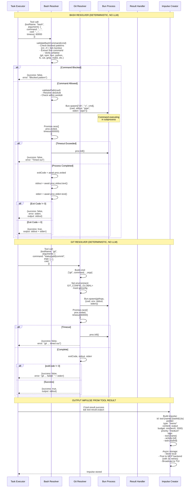
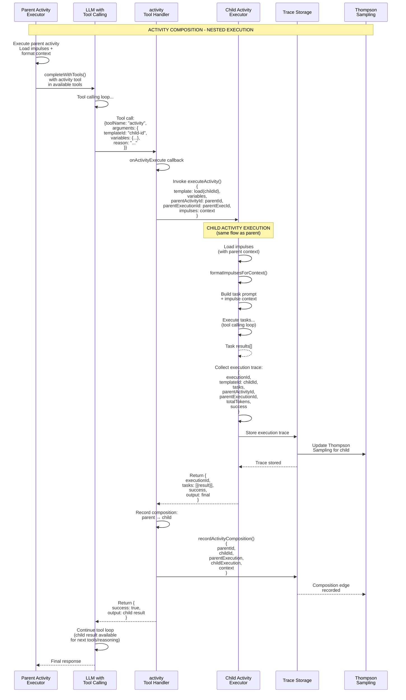
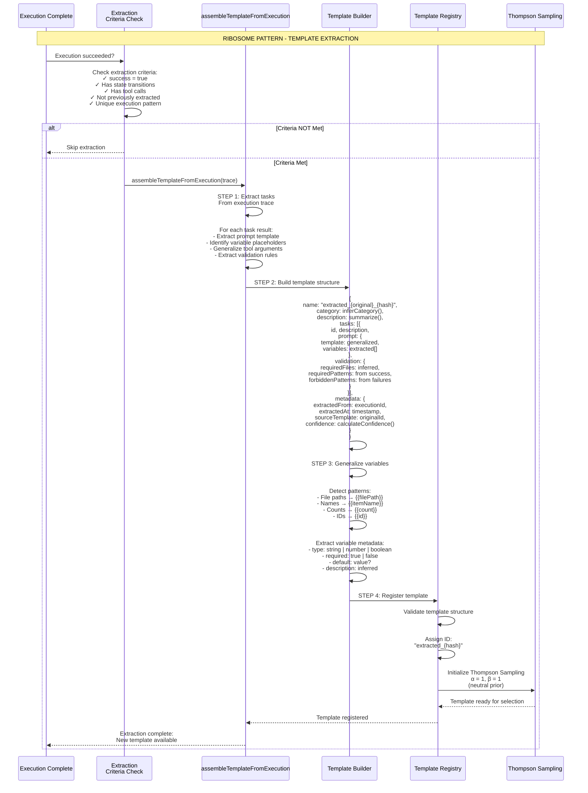

# Processing of Required Input Impulses by Resolvers

> **Status (2026-06):** Resolver types (LLM, bash, git, activity, ribosome) and the impulse context-injection flow are still accurate, but they run **across the substrate vessels, not minibob** (minibob is deprecated and no longer executes). The orchestration (tool-calling loop, activity composition, impulse creation) lives in `goal-host-vessel` / `ias-executor-ts`; the **LLM resolver** is `llm-resolver-vessel` (`:8220`); the **deterministic resolvers** (bash, git, read/write/edit, process) are `local-tools-vessel` (`:8230`); the **ribosome resolver** is `ribosome-vessel` (`:8240`), which subscribes to `task.completed` / `lifecycle:execution:succeeded` on the activity-api WebSocket bus rather than running inline. The `MCP Backend (mcp.ts)` participant is now `activity-api` (`:18080`) reached over HTTP via discovery routing. Map the file refs below (`llm.ts`, `tools.ts`, `activity.ts`, `template-extractor.ts`) to those vessels.

## Overview

This document maps how different resolver types (LLM, bash, git, file operations, activities, ribosome) process required input impulses during task execution. It shows the complete flow from impulse context injection through tool execution to output impulse creation.

## Key Concepts

1. **Impulse Context Injection** - How impulses are formatted and injected into resolver prompts
2. **Tool Calling Loop** - LLM iterative execution with tool handlers (max 20 iterations)
3. **Deterministic Resolvers** - bash, git, file operations that don't use LLM
4. **Tool Argument Patterns** - Proven argument patterns from historical executions
5. **Output Impulse Creation** - Tool results become new impulses for downstream tasks
6. **Activity Composition** - Nested activity execution with composition tracking
7. **Ribosome Pattern** - Successful executions extracted into reusable templates
8. **Pattern Learning** - Tool usage and argument patterns recorded for Thompson Sampling

## Main Sequence Diagram: Complete Resolver Flow

```mermaid
sequenceDiagram
    participant TaskExec as Task Executor<br/>(goal-host-vessel)
    participant ImpStore as Impulse Store<br/>(goal-host-vessel)
    participant ImpFormat as formatImpulsesForContext<br/>(goal-host-vessel)
    participant LLMClient as LLM Resolver<br/>(llm-resolver-vessel)
    participant ToolWrap as Tool Wrapper<br/>(goal-host-vessel)
    participant Bash as Bash Resolver<br/>(local-tools-vessel)
    participant Git as Git Resolver<br/>(local-tools-vessel)
    participant ActTool as Activity Resolver<br/>(goal-host-vessel)
    participant Ribosome as Ribosome Resolver<br/>(ribosome-vessel)
    participant ImpCreate as Impulse Creator<br/>(goal-host-vessel)
    participant MCP as Activity-API<br/>(:18080, HTTP)

    Note over TaskExec,MCP: PHASE 1: LOAD & FORMAT INPUT IMPULSES

    TaskExec->>ImpStore: loadImpulses(impulseIds)
    ImpStore->>ImpStore: resolvePointer() [DISPATCH ORDER]
    ImpStore->>ImpStore: 1. LOCAL: memo (embedded)
    ImpStore->>ImpStore: 2. LOCAL: file (filesystem)
    ImpStore->>ImpStore: 3. LOCAL: directoryTree, gitDiff
    ImpStore->>ImpStore: 4. CUSTOM: registered resolvers
    ImpStore->>ImpStore: 5. DISCOVERY: vessel discovery
    ImpStore->>ImpStore: 6. BACKEND: MCP fallback
    ImpStore->>ImpStore: Truncate to budget
    ImpStore-->>TaskExec: Return loaded impulses

    TaskExec->>ImpStore: captureImpulseHashes(impulseIds)
    ImpStore-->>TaskExec: Record hash before execution

    Note over TaskExec,MCP: PHASE 2: INJECT IMPULSES INTO PROMPT

    TaskExec->>TaskExec: substituteImpulses(template, ids)
    TaskExec->>ImpStore: loadImpulses(referenced ids)
    ImpStore-->>TaskExec: Return impulse content

    TaskExec->>ImpFormat: formatImpulsesForContext(impulses)
    ImpFormat->>ImpFormat: For each impulse:
    ImpFormat->>ImpFormat: IF metadata present:<br/>USE pointer-mode<br/>(&lt;impulse_ref&gt; XML tags)
    ImpFormat->>ImpFormat: ELSE loaded content:<br/>USE content-mode<br/>(&lt;impulse&gt; with content)
    ImpFormat-->>TaskExec: Return formatted context string

    TaskExec->>TaskExec: Prepend impulse context<br/>+ proven tool patterns<br/>+ error impulses (if retry)

    Note over TaskExec,MCP: PHASE 3: BUILD LLM REQUEST

    TaskExec->>TaskExec: Build messages array:<br/>1. System prompt<br/>2. Impulse context +<br/>formatted impulses +<br/>tool recommendations<br/>3. Task prompt

    TaskExec->>TaskExec: Filter tools<br/>(based on task.resolverRequirements)

    Note over TaskExec,MCP: PHASE 4: LLM RESOLVER - TOOL CALLING LOOP

    TaskExec->>LLMClient: completeWithTools(options, handlers)

    loop Tool Calling Loop [max 20 iterations]
        LLMClient->>LLMClient: POST /messages to<br/>Anthropic API<br/>with system + messages +<br/>formatted tools

        LLMClient-->>LLMClient: Parse response:<br/>extract text + tool_use blocks

        LLMClient->>LLMClient: Tool calls<br/>from response?
        alt No Tool Calls
            LLMClient->>LLMClient: content = final response
            LLMClient-->>TaskExec: Return {content, toolsUsed, usage}
            break Done with tool calling
        else Tool Calls Found
            LLMClient->>LLMClient: For each tool call:
            LLMClient->>ToolWrap: Wrap handler to<br/>capture tool execution

            alt Bash Tool
                ToolWrap->>Bash: bash resolver<br/>(validateCommand +<br/>spawn process)
                Bash-->>ToolWrap: {success, output, error}
            else Git Tool
                ToolWrap->>Git: git resolver<br/>(git command with<br/>timeout + auth)
                Git-->>ToolWrap: {success, output, error}
            else Activity Tool
                ToolWrap->>ActTool: activity resolver<br/>(nested execution)
                ActTool-->>ToolWrap: {success, output, childExecId}
            end

            ToolWrap-->>LLMClient: Return tool result

            LLMClient->>LLMClient: Record tool call:<br/>- name<br/>- arguments<br/>- result

            LLMClient->>LLMClient: Append to messages:<br/>1. assistant message<br/>with tool_use content<br/>2. tool result message
        end
    end

    Note over TaskExec,MCP: PHASE 5: CREATE OUTPUT IMPULSES FROM TOOL CALLS

    TaskExec->>TaskExec: For each tool call record:
    TaskExec->>ImpCreate: Create output impulse<br/>if tool.result.success

    ImpCreate->>ImpCreate: Build impulse:<br/>id: tool:{name}:{taskId}:{timestamp}<br/>type: memo<br/>content: tool output<br/>budget: output.length / 4<br/>tags: [tool:{name}, activity:{id}]

    ImpCreate->>MCP: storeImpulse(impulse)<br/>[BLOCKING with retries]
    MCP-->>ImpCreate: Stored in backend

    ImpCreate->>ImpStore: Store locally
    ImpCreate-->>TaskExec: Impulse created

    Note over TaskExec,MCP: PHASE 5.5: EXTRACT TOOL ARGUMENT IMPULSES

    TaskExec->>TaskExec: For each tool call:<br/>extractToolArgumentImpulse()

    TaskExec->>ImpCreate: Create argument impulse<br/>if extraction succeeds

    ImpCreate->>ImpCreate: Build impulse:<br/>id: toolargs:{hash}<br/>type: memo or custom<br/>content: structured args<br/>metadata:<br/>  shape: tool_invocation<br/>  toolName<br/>  argumentsHash<br/>  successRate<br/>tags: [tool-args:{name}]

    ImpCreate->>MCP: storeImpulse(impulse)
    MCP-->>ImpCreate: Stored for pattern learning

    ImpCreate-->>TaskExec: Argument impulse created

    Note over TaskExec,MCP: PHASE 6: STATE TRANSITIONS & ACTIVITY OUTPUT

    TaskExec->>TaskExec: Store activity output<br/>storeActivityOutput(activityId,<br/>taskId, result.content)

    TaskExec->>TaskExec: Capture output state:<br/>- filesCreated<br/>- filesModified<br/>- toolCallRecords

    TaskExec->>TaskExec: captureFileHashes()<br/>(after execution)

    TaskExec->>TaskExec: calculateImpulseEvolution()<br/>(compare before/after hashes)

    Note over TaskExec,MCP: PHASE 7: RECORD PATTERNS FOR LEARNING

    TaskExec->>MCP: recordToolArgumentPattern()<br/>For each tool call:<br/>- activityId<br/>- toolName<br/>- argumentHash<br/>- executionSucceeded<br/>- failureType (if failed)

    MCP-->>TaskExec: Pattern recorded<br/>(Thompson Sampling)

    TaskExec->>MCP: recordImpulseRelevance()<br/>For each impulse:<br/>- impulseId<br/>- wasLoaded<br/>- executionSucceeded

    MCP-->>TaskExec: Relevance recorded

    Note over TaskExec,MCP: PHASE 8: VALIDATION & ERROR HANDLING

    alt Validation Enabled
        TaskExec->>TaskExec: runValidation(pattern)<br/>- requiredFiles<br/>- requiredPatterns<br/>- forbiddenPatterns

        alt Validation Failed
            TaskExec->>ImpCreate: createErrorImpulse()<br/>id: error:{taskId}:{activityId}:{ts}<br/>content: error message<br/>metadata:<br/>  shape: previous_attempt_error<br/>  attemptNumber<br/>  failureType<br/>  availableOps<br/>  suggestedOp

            ImpCreate->>MCP: storeImpulse(errorImpulse)
            MCP-->>ImpCreate: Error impulse stored<br/>(for retry context)

            ImpCreate-->>TaskExec: Error impulse ready

            TaskExec->>TaskExec: Return {status: failed,<br/>error, metadata:<br/>inputState, outputState,<br/>stateTransition, toolCalls}
        else Validation Succeeded
            TaskExec->>TaskExec: Continue to success path
        end
    end

    Note over TaskExec,MCP: PHASE 9: SUCCESS COMPLETION

    TaskExec->>TaskExec: Return {status: completed,<br/>output: result.content,<br/>tokens: {input, output},<br/>metadata: {<br/>  inputState,<br/>  outputState,<br/>  stateTransition,<br/>  toolCalls,<br/>  impulseEvolution,<br/>  modelSelection<br/>}}

    Note over TaskExec,MCP: PHASE 10: RIBOSOME EXTRACTION (ON SUCCESS)

    alt Execution Succeeded & Criteria Met
        TaskExec->>Ribosome: shouldExtractTemplate()<br/>- success = true<br/>- has state transitions<br/>- has tool calls<br/>- not already extracted

        Ribosome->>Ribosome: Criteria passed

        Ribosome->>Ribosome: assembleTemplateFromExecution()<br/>- Extract tasks from trace<br/>- Generalize prompts<br/>- Extract variables<br/>- Build validation rules

        Ribosome->>MCP: registerTemplate()<br/>{<br/>  name: "extracted_{original}_{hash}",<br/>  category,<br/>  tasks,<br/>  extractedFrom: executionId<br/>}

        MCP-->>Ribosome: Template registered<br/>(available for Thompson Sampling)
    end

    Note over TaskExec,MCP: FINAL: BATCH STORAGE & LEARNING

    TaskExec->>MCP: storeExecutionTrace()<br/>{<br/>  executionId,<br/>  templateId,<br/>  tasks: [{<br/>    id, prompt, result,<br/>    tokens, metadata<br/>  }],<br/>  totalTokens,<br/>  costUSD,<br/>  success,<br/>  duration<br/>}

    MCP-->>TaskExec: Trace stored

    MCP->>MCP: Thompson Sampling update<br/>α/β for template variants

    MCP-->>TaskExec: Learning updated<br/>(ready for next iteration)
```

## Decomposition: LLM Resolver with Impulse Context

```mermaid
sequenceDiagram
    participant LLM as LLM Resolver
    participant ImpCtx as Impulse Context<br/>Formatter
    participant Prompt as Prompt Builder
    participant APICall as Anthropic API
    participant ToolLoop as Tool Loop
    participant ToolHandler as Tool Handler
    participant Result as Result Processing

    Note over LLM,Result: LLM RESOLVER WITH IMPULSE CONTEXT INJECTION

    LLM->>ImpCtx: formatImpulsesForContext(loaded[])
    ImpCtx->>ImpCtx: For each impulse:
    ImpCtx->>ImpCtx: IF metadata.shape exists:<br/>FORMAT: &lt;impulse_ref<br/>  id="{id}"<br/>  type="{type}"<br/>  shape="{shape}"<br/>  row_count="{count}"<br/>  summary="{text}"/&gt;

    ImpCtx->>ImpCtx: ELSE IF loaded.content:<br/>FORMAT: &lt;impulse<br/>  id="{id}"<br/>  type="{type}"<br/>  tokens={actual}/{budget}&gt;<br/>{content}<br/>&lt;/impulse&gt;

    ImpCtx-->>Prompt: &lt;impulse_context&gt;<br/>(formatted impulses)<br/>&lt;/impulse_context&gt;

    Prompt->>Prompt: Build full prompt:<br/>1. Impulse context block<br/>2. Tool pattern hints<br/>(if arg recommendations)<br/>3. Error impulses (if retry)<br/>4. Task prompt

    Prompt->>Prompt: Build messages:<br/>- system: config.systemPrompt<br/>- user: full prompt

    Prompt->>APICall: POST /messages<br/>{<br/>  model,<br/>  system,<br/>  messages,<br/>  tools: [{<br/>    name,<br/>    description,<br/>    input_schema<br/>  }],<br/>  max_tokens<br/>}

    APICall-->>LLM: {<br/>  content: [{<br/>    type: "text" | "tool_use",<br/>    text?: string,<br/>    id?: string,<br/>    name?: string,<br/>    input?: object<br/>  }],<br/>  stop_reason: "tool_use" | "end_turn"<br/>}

    LLM->>ToolLoop: While maxIterations > 0:<br/>Extract toolCalls[] from response

    alt NO Tool Calls (stop_reason="end_turn")
        ToolLoop-->>Result: Return {content, toolsUsed, usage}
    else Tool Calls Present
        ToolLoop->>ToolLoop: For each toolCall:

        ToolLoop->>ToolHandler: Call handler(toolCall.arguments)
        ToolHandler->>ToolHandler: Validate arguments
        ToolHandler->>ToolHandler: Execute operation
        ToolHandler-->>ToolLoop: Return {success, output?, error?}

        ToolLoop->>LLM: Record:<br/>- toolName<br/>- arguments<br/>- result<br/>(for output impulses)

        ToolLoop->>LLM: Append messages:<br/>1. assistant:<br/>   content: text + tool_use blocks<br/>2. tool:<br/>   content: result<br/>   tool_call_id: id

        ToolLoop->>APICall: Next API call<br/>with extended messages
    end
```

**Implementation:** `repos/llm-resolver-vessel/` (LLM tool-calling loop; was `minibob/src/llm.ts:360-448`)

**Key Points:**
- Impulse context injected at start of user message
- Tool patterns provide proven argument examples
- Max 20 iterations prevents infinite loops
- Tool results appended to conversation for next iteration

## Decomposition: Deterministic Resolvers (Bash & Git)



**Implementation:** `repos/local-tools-vessel/` (was `minibob/src/tools.ts` — bash ~790-835, git ~1114-1168)

**Security Features:**
- Command whitelist (git, npm, bun, python, ls, cat, grep, make, etc.)
- Blocked patterns (rm -rf /, fork bombs, dangerous commands)
- Path validation (must be within working directory)
- Timeout protection (60 seconds default)

## Activity Resolver (Composition)

The activity resolver enables **nested activity execution** - activities calling other activities. This is a powerful composition mechanism that enables complex workflows to be built from simpler, reusable activities.

### How Activity Composition Works



**Implementation:** `repos/goal-host-vessel/` + `ias-executor-ts` (activity-tool composition; was `minibob/src/tools.ts:1214-1246`)

### Activity Tool Definition

```typescript
{
  name: "activity",
  description: "Execute another activity as a subtask. Use this when the current task would benefit from a specialized activity that already exists.",
  input_schema: {
    type: "object",
    properties: {
      templateId: {
        type: "string",
        description: "ID of the activity template to execute"
      },
      variables: {
        type: "object",
        description: "Variables to pass to the activity"
      },
      reason: {
        type: "string",
        description: "Why you're calling this activity (for composition learning)"
      }
    },
    required: ["templateId", "reason"]
  }
}
```

### Composition Edge Recording

When an activity calls another activity, a **composition edge** is recorded:

```typescript
interface ActivityCompositionEdge {
  parentActivityId: string;
  childActivityId: string;
  parentExecutionId: string;
  childExecutionId: string;
  context: {
    reason: string;              // Why was child called?
    variables: Record<string, unknown>;
    impulsesPassed: string[];    // Which impulses were passed to child?
  };
  timestamp: Date;
  success: boolean;              // Did child execution succeed?
}
```

**Storage:** `POST /v2/activities/composition` endpoint in metabob-activity-api

### Recursive Execution Tracking

Activities can be nested multiple levels deep. Each execution tracks:

- `parentActivityId` - Template ID of parent activity (if nested)
- `parentExecutionId` - Execution ID of parent instance (if nested)
- `depth` - Nesting depth (0 = top-level, 1 = child, 2 = grandchild, etc.)

**Example hierarchy:**
```
goal_processing_standard (depth=0)
  ├─ goal_analysis (depth=1)
  ├─ activity_recommendation (depth=1)
  ├─ execute_user_activity (depth=1)
  │   └─ run_tests (depth=2, user's activity)
  ├─ goal_verification (depth=1)
  └─ improvise_solution (depth=1, if needed)
```

### Composition Learning Benefits

By recording composition edges, the system learns:

1. **Which activities work well together** - Thompson Sampling on edges
2. **Common composition patterns** - Frequent parent→child pairs
3. **Context requirements** - What impulses child activities need
4. **Failure modes** - Which compositions tend to fail

This enables **automatic activity orchestration** where the system learns to compose activities without explicit programming.

## Ribosome Resolver (Template Extraction)

The ribosome pattern is the **self-replication mechanism** - successful executions are extracted into reusable templates. This is how the system **learns by doing**.

### How Ribosome Extraction Works



**Implementation:** `repos/ribosome-vessel/` — subscribes to `task.completed` / `lifecycle:execution:succeeded` on the activity-api WebSocket bus and calls `assembleTemplateFromExecution`, writing via the `activityTemplate_update` impulse (replaces the inline minibob ribosome path; `assembleTemplateFromExecution` shared via `ias-executor-ts`).

### Extraction Criteria

Not all executions become templates. The ribosome only extracts when:

```typescript
function shouldExtractTemplate(trace: ExecutionTrace): boolean {
  return (
    trace.success === true &&                    // Must succeed
    trace.tasks.length > 0 &&                    // Must have tasks
    trace.tasks.some(t => t.toolCalls?.length > 0) &&  // Must use tools
    hasStateTransitions(trace) &&                // Must change state
    !alreadyExtracted(trace.executionId) &&      // Not already extracted
    hasUniquePattern(trace)                      // Novel execution pattern
  );
}
```

**Why these criteria?**
- **Success required** - Only learn from working executions
- **Tool usage required** - Pure reasoning tasks don't need extraction
- **State transitions required** - Must actually do something
- **Uniqueness required** - Don't create duplicate templates
- **Not already extracted** - One template per execution

### Template Generalization

The ribosome converts **specific executions** into **general templates**:

**Before (specific execution):**
```typescript
{
  prompt: "Fix the authentication bug in src/auth.ts by updating the token validation logic",
  variables: {},
  result: "Fixed token validation by adding expiry check"
}
```

**After (generalized template):**
```typescript
{
  prompt: {
    template: "Fix the {{bugType}} bug in {{filePath}} by {{fixStrategy}}",
    variables: [
      { name: "bugType", type: "string", required: true,
        description: "Type of bug (e.g., authentication, validation)" },
      { name: "filePath", type: "string", required: true,
        description: "Path to file containing the bug" },
      { name: "fixStrategy", type: "string", required: true,
        description: "Strategy for fixing the bug" }
    ]
  }
}
```

### Validation Rule Extraction

The ribosome also extracts validation rules from execution patterns:

**From successful execution:**
```typescript
// Observed: Modified src/auth.ts, created test file
{
  validation: {
    requiredFiles: ["src/auth.ts"],           // From filesModified
    requiredPatterns: [
      "token.*expiry",                         // From diff content
      "validateToken"                          // From tool outputs
    ],
    forbiddenPatterns: []                      // From known anti-patterns
  }
}
```

**From failed attempts:**
```typescript
// Observed: Previous attempts failed with missing imports
{
  validation: {
    requiredPatterns: [
      "import.*Token",                         // Must have imports
    ],
    forbiddenPatterns: [
      "require\\(",                            // Don't use require()
      "eval\\("                                // Never use eval
    ]
  }
}
```

### Ribosome in the Learning Loop

```
1. Developer runs activity → Execution traced
2. Execution succeeds → Ribosome extracts template
3. Template registered → Thompson Sampling initialized
4. Next similar goal → Template recommended
5. Template executes → More data for Thompson Sampling
6. Template improves → Or new variant extracted
```

**Key insight:** The ribosome creates a **continuous improvement loop** where:
- Successful work becomes templates
- Templates compete via Thompson Sampling
- Best templates get used more
- Variations are tried and extracted
- The system evolves toward better solutions

### Example: Ribosome Self-Development

The ribosome can extract templates for **improving itself**:

**Execution:** Developer improves ribosome extraction logic
**Extracted template:** "improve_pattern_extraction"
**Next time:** System uses this template to improve other extractors
**Result:** Self-improving extraction capabilities

This is the **process-of-becoming** in action - the system improving the mechanism by which it improves.

## Tool Argument Pattern Learning

### Pattern Extraction

```typescript
// After each tool call, extract argument pattern
function extractToolArgumentImpulse(toolCall: ToolCall): Impulse | null {
  const { name, arguments: args, result } = toolCall;

  // Compute stable hash of argument structure
  const argShape = JSON.stringify(
    Object.keys(args).sort()
  );
  const argHash = Bun.hash(argShape);

  return {
    id: `toolargs:${name}:${argHash}`,
    pointer: {
      type: "memo",
      content: JSON.stringify({
        toolName: name,
        arguments: args,
        argumentShape: argShape,
        result: {
          success: result.success,
          outputLength: result.output?.length || 0
        }
      })
    },
    metadata: {
      shape: "tool_invocation",
      toolName: name,
      argumentsHash: argHash,
      successRate: result.success ? 1.0 : 0.0
    },
    tags: [`tool-args:${name}`, `activity:${activityId}`, `task:${taskId}`],
    budget: 2000,
    priority: "low"
  };
}
```

### Pattern Storage and Retrieval

```typescript
// Backend stores patterns with Thompson Sampling
interface ToolArgumentPattern {
  toolName: string
  argumentHash: string
  arguments: object
  successCount: number
  failureCount: number
  successRate: number      // successCount / (successCount + failureCount)
  timesUsed: number
  avgExecutionMs: number
  lastUsed: Date
}

// Query top patterns for task
const recommendations = await mcp.getToolArgumentRecommendations(templateId);
// Returns top 5 by success rate

// Inject into prompt as hints
const hintBlock = `
## Proven Tool Argument Patterns
${recommendations.map(r =>
  `- ${r.toolName}: ${JSON.stringify(r.arguments)} (${r.successRate * 100}% success, used ${r.timesUsed} times)`
).join('\n')}
`;
```

**Implementation:** `repos/goal-host-vessel/` + `ias-executor-ts` (tool argument extraction and injection; was `minibob/src/activity.ts`)

## Error Impulse Creation

### Error Impulse Structure

```typescript
{
  id: `error:${taskId}:${activityId}:${timestamp}`,
  pointer: {
    type: "memo",
    content: errorMessage
  },
  budget: Math.min(errorMessage.length / 4, 2000),
  priority: "high",
  metadata: {
    shape: "previous_attempt_error",
    attemptNumber: 2,
    maxAttempts: 3,
    failureType: "validation" | "execution" | "tool_failure" | "timeout",
    validationError?: string,
    toolName?: string,
    availableOps: ["retry", "variant", "debug", "skip", "escalate"],
    suggestedOp: "retry" | "variant" | "debug" | "escalate",
    suggestionConfidence: 0.0 - 1.0
  },
  tags: ["error", `activity:${activityId}`, `task:${taskId}`]
}
```

### Error Impulse Injection on Retry

```typescript
// On retry attempt, error impulses from previous attempts
// are loaded and injected into prompt context

const errorImpulses = impulseStore.getByShape("previous_attempt_error");
const errorContext = formatImpulsesForContext(errorImpulses);

const fullPrompt = `
${impulseContext}

${errorContext}
<!-- Previous attempts failed. Review error impulses above. -->

${task.prompt.template}
`;
```

**Implementation:** `repos/goal-host-vessel/` + `ias-executor-ts` (createErrorImpulse; was `minibob/src/impulse.ts:881-961`)

## Complete Data Flow Diagram

```mermaid
graph TD
    A["PHASE 1: LOAD IMPULSES<br/>impulse.ts:load()"] -->|"Dispatch: local → custom → discovery → MCP"| B["Resolve pointers<br/>by type"]
    B -->|"memo: embedded"| C["Use content directly"]
    B -->|"file: filesystem"| D["Read from disk<br/>with line slicing"]
    B -->|"activityOutput"| E["Resolve from store<br/>or MCP"]
    B -->|"other types"| F["Query discovery-vessel<br/>or fallback to MCP"]

    C --> G["Truncate to budget<br/>if needed"]
    D --> G
    E --> G
    F --> G

    G --> H["Return loaded impulses[]"]

    H --> I["PHASE 2: FORMAT CONTEXT<br/>impulse.ts:formatImpulsesForContext"]

    I -->|"Has metadata"| J["Use pointer-mode<br/>&lt;impulse_ref&gt; tags<br/>shape metadata only"]
    I -->|"No metadata"| K["Use content-mode<br/>&lt;impulse&gt; tags<br/>with full content"]

    J --> L["Build impulse_context block"]
    K --> L

    L --> M["PHASE 3: INJECT INTO PROMPT<br/>activity.ts:execute"]

    M --> N["substituteImpulses()<br/>Replace {{impulse:id}}<br/>placeholders"]
    N --> O["Prepend formatImpulsesForContext()<br/>+ tool patterns<br/>+ error impulses if retry"]
    O --> P["Build messages<br/>system + user"]

    P --> Q["PHASE 4: LLM RESOLVER<br/>llm.ts:completeWithTools"]

    Q --> R["POST /messages to API<br/>with system + messages +<br/>tools definitions"]
    R --> S{Tool calls<br/>in response?}

    S -->|"No"| T["Return final content"]
    S -->|"Yes"| U["Execute each tool call"]

    U --> V{Tool type?}
    V -->|"bash"| W["Validate + spawn process<br/>tools.ts:bash"]
    V -->|"git"| X["Git command<br/>tools.ts:git"]
    V -->|"read/write/edit"| Y["File operations<br/>tools.ts"]
    V -->|"activity"| Z["Nested execution<br/>activity.ts:execute"]

    W --> AA["Record tool call:<br/>name, args, result"]
    X --> AA
    Y --> AA
    Z --> AA

    AA --> AB["Append to messages<br/>assistant + tool result"]
    AB --> R

    T --> AC["PHASE 5: CREATE OUTPUT IMPULSES<br/>impulse.ts:createImpulse"]

    AC --> AD["For each tool call:<br/>Create impulse<br/>id: tool:{name}:{taskId}:{ts}"]
    AD --> AE["Store locally +<br/>post to MCP backend<br/>with 3x retries"]
    AE --> AF["Broadcast to TUI"]

    AF --> AG["PHASE 6: EXTRACT ARGUMENT IMPULSES<br/>tool-argument-extractor.ts"]
    AG --> AH["Create impulse for<br/>tool arguments<br/>for pattern learning"]
    AH --> AI["Store with tags<br/>tool-args, activity, task"]

    AI --> AJ["PHASE 7: RECORD PATTERNS<br/>mcp.ts"]

    AJ --> AK["recordToolArgumentPattern()<br/>- toolName<br/>- argumentHash<br/>- successRate<br/>- failureType if failed"]
    AJ --> AL["recordImpulseRelevance()<br/>- which impulses loaded<br/>- execution success"]

    AK --> AM["PHASE 8: VALIDATION<br/>activity.ts:runValidation"]
    AL --> AM

    AM --> AN{Validation<br/>passes?}
    AN -->|"No"| AO["Create error impulse<br/>shape: previous_attempt_error"]
    AN -->|"Yes"| AP["Return success"]

    AO --> AQ["Store error impulse<br/>for retry context"]
    AQ --> AR["Return task failed"]

    AP --> AS["PHASE 9: STORE EXECUTION TRACE<br/>mcp.ts:storeExecutionTrace"]

    AS --> AT["Send to backend:<br/>- taskId, prompt, result<br/>- tokens, metadata<br/>- inputState, outputState<br/>- stateTransition<br/>- impulseEvolution<br/>- toolCalls"]

    AT --> AU["PHASE 10: LEARNING UPDATE<br/>Backend"]

    AU --> AV["Thompson Sampling:<br/>Update α/β for variants"]
    AU --> AW["Ribosome extraction:<br/>successful executions →<br/>new templates"]
    AU --> AX["Pattern learning:<br/>tool arguments,<br/>impulse relevance<br/>composition edges"]

    AV --> AY["READY FOR NEXT EXECUTION"]
    AW --> AY
    AX --> AY

    style A fill:#e1f5ff
    style Q fill:#fff9c4
    style AC fill:#c8e6c9
    style AU fill:#ffd54f
    style AY fill:#c8e6c9
```



## Tool Resolver Comparison

| Resolver Type | Uses LLM | Latency | Impulse Input | Output Type | Security | Learning |
|---------------|----------|---------|---------------|-------------|----------|----------|
| **LLM** | Yes | Variable (seconds) | Context injection | Text + tool calls | Prompt injection risk | Token usage patterns |
| **bash** | No | Fast (ms-seconds) | None | stdout/stderr | Command whitelist | Argument patterns |
| **git** | No | Fast (ms-seconds) | None | git output | Safe git commands | Argument patterns |
| **read** | No | Fast (ms) | None | File content | Path validation | Access patterns |
| **write** | No | Fast (ms) | File content | Success/error | Path validation | Write patterns |
| **edit** | No | Fast (ms) | old/new strings | Success/error | Exact match only | Edit patterns |
| **activity** | Yes (nested) | Variable (seconds) | Full context | Execution result | Template validation | Composition edges |
| **ribosome** | No | Fast (ms) | Execution trace | Template | Structure validation | Template evolution |
| **impulse_create** | No | Fast (ms) | Pointer spec | Impulse ID | Type validation | Relevance scores |

**Key insights:**

1. **LLM resolver is the orchestrator** - Calls other resolvers via tool calling
2. **Deterministic resolvers are fast** - No LLM overhead, just execution
3. **Activity resolver enables composition** - Activities can call activities
4. **Ribosome resolver enables learning** - Successful patterns become templates
5. **All resolvers feed learning** - Every execution improves Thompson Sampling

## File References

| Component | File (live equivalent) | Purpose |
|-----------|------|---------|
| LLM Resolver | `repos/llm-resolver-vessel/` (`:8220`; was `minibob/src/llm.ts`) | Tool calling loop |
| Tool Definitions | `repos/local-tools-vessel/` (`:8230`; was `minibob/src/tools.ts`) | All deterministic tool handlers |
| Bash Resolver | `repos/local-tools-vessel/` (was `tools.ts:790-835`) | Command execution |
| Git Resolver | `repos/local-tools-vessel/` (was `tools.ts:1114-1168`) | Git operations |
| Activity Composition | `repos/goal-host-vessel/` + `ias-executor-ts` (was `tools.ts:1214-1246`) | Nested execution |
| Ribosome Extractor | `repos/ribosome-vessel/` (bus subscriber; `assembleTemplateFromExecution` in ias-executor-ts) | Template extraction |
| Impulse Creation | `repos/goal-host-vessel/` + `ias-executor-ts` (was `impulse.ts`) | Store and lifecycle |
| Output Impulses | `repos/goal-host-vessel/` + `ias-executor-ts` (was `activity.ts:3213-3273`) | Tool result → impulse |
| Error Impulses | `repos/goal-host-vessel/` + `ias-executor-ts` (was `impulse.ts:881-961`) | Error context capture |

## Implementation Architecture

This sequence runs **across the substrate vessels (execution)** with backend involvement for pattern storage and learning.

### goal-host-vessel + resolver vessels (Execution Environment)

**Responsibilities:**
- LLM resolver with tool calling loop (max 20 iterations) — `llm-resolver-vessel`
- Deterministic resolvers (bash, git, read, write, edit) — `local-tools-vessel`
- Activity resolver (nested activity execution for composition) — `goal-host-vessel`
- Ribosome resolver (template extraction from successful executions) — `ribosome-vessel` (bus subscriber)
- Impulse context injection into LLM prompts — `goal-host-vessel`
- Tool argument pattern extraction — `goal-host-vessel`
- Output impulse creation from tool results — `goal-host-vessel`
- Error impulse creation on validation failures — `goal-host-vessel`
- State capture (input/output/transition) — `goal-host-vessel`

**Key Files (live):**
- `repos/llm-resolver-vessel/` (`:8220`) - LLM tool calling loop
- `repos/local-tools-vessel/` (`:8230`) - all deterministic tool handlers
- `repos/goal-host-vessel/` + `@avigopal/ias-executor-ts` - activity resolver (composition), impulse creation/storage, tool-arg extraction
- `repos/ribosome-vessel/` (`:8240`) - template extraction on the bus

**What the execution environment Does NOT Do:**
- Does NOT compute tool argument success rates (backend aggregates)
- Does NOT select "best" argument patterns (backend provides recommendations)
- Does NOT persist patterns beyond session (backend stores)

### Activity-API (Storage & Learning Backend)

**Responsibilities:**
- Store tool argument patterns with success/failure tracking
- Compute tool argument success rates (Thompson Sampling)
- Provide top argument recommendations for tasks
- Store execution traces with tool call records
- Track impulse relevance (which impulses loaded → success)
- Aggregate composition edges (parent activity → child activity)
- Ribosome template storage (new templates from extractions)

**Key Endpoints:**
- `POST /v2/activities/tool-usage` - Record tool argument patterns
- `GET /v2/activities/tool-recommendations` - Get proven argument patterns (top 5)
- `POST /v2/activities/execution-traces` - Store full execution trace
- `POST /v2/activities/composition` - Record composition edges
- `POST /v2/activities/templates` - Register extracted templates (ribosome output)

**Key Files:**
- `repos/activity-api/src/routes/activities.ts` - Tool pattern endpoints
- `repos/activity-api/src/routes/composition-edges.ts` - Composition tracking
- (Template extraction itself runs in `repos/ribosome-vessel/`, which writes via the `activityTemplate_update` impulse)

### SurrealDB Schema

**Tables:**
- `tool_argument_pattern` - Tool argument hashes with success/failure counts
- `activity_execution_trace` - Full execution traces with tool call records
- `composition_edges` - Parent activity → child activity relationships
- `activity_template` - Templates (including ribosome-extracted ones)
- `impulse_relevance_metrics` - Impulse→activity success correlation

**Indexes:**
- `tool_argument_pattern` by tool_name, argument_hash
- `composition_edges` by parent_id, child_id
- `activity_template` by category, extracted_from

### Correct Separation

**The execution environment handles (execution-time):**
- Tool execution (bash, git, file operations) — `local-tools-vessel`
- LLM tool calling loop (max 20 iterations) — `llm-resolver-vessel`
- Activity composition (nested execution) — `goal-host-vessel`
- Ribosome extraction logic (template assembly) — `ribosome-vessel`
- Impulse creation (output, error, argument impulses) — `goal-host-vessel`
- State transitions (before/after hashes) — `goal-host-vessel`

**Activity-API handles (storage/learning):**
- Tool argument pattern storage
- Success rate computation (Thompson Sampling on arguments)
- Proven pattern recommendations
- Execution trace persistence
- Composition edge tracking
- Template registration (from ribosome)

**Why This Separation Matters:**
- The resolver vessels execute tools directly (no backend latency on the hot path)
- Backend learns from tool usage patterns asynchronously
- Tool recommendations improve over time (Thompson Sampling)
- ribosome-vessel extracts templates from the event bus, backend stores for reuse
- Composition tracking enables learning orchestration patterns

**Key Architectural Point:**
Resolvers execute in the substrate vessels (goal-host-vessel + llm-/local-tools-/ribosome-vessel), but their patterns are learned in the backend (aggregated). This separates execution from online learning.

## Related Documentation

- [Impulse Resolution](./02-impulse-resolution.md) - How impulses are loaded
- [Activity Selection](./01-activity-selection.md) - How activities are chosen
- [Improvisation](./04-improvisation-failure-modes.md) - What happens on failure (incl. in-flight recovery)
- [IMPULSE_ACTIVITY_FOUNDATION.md](../IMPULSE_ACTIVITY_FOUNDATION.md) - Foundational model

---

**Last Updated:** 2026-06 (re-narrated: resolvers split across llm-resolver-vessel / local-tools-vessel / goal-host-vessel / ribosome-vessel)
