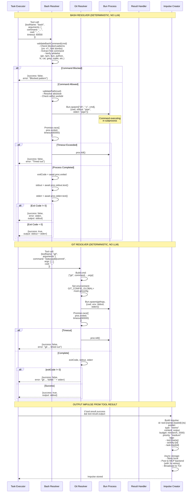
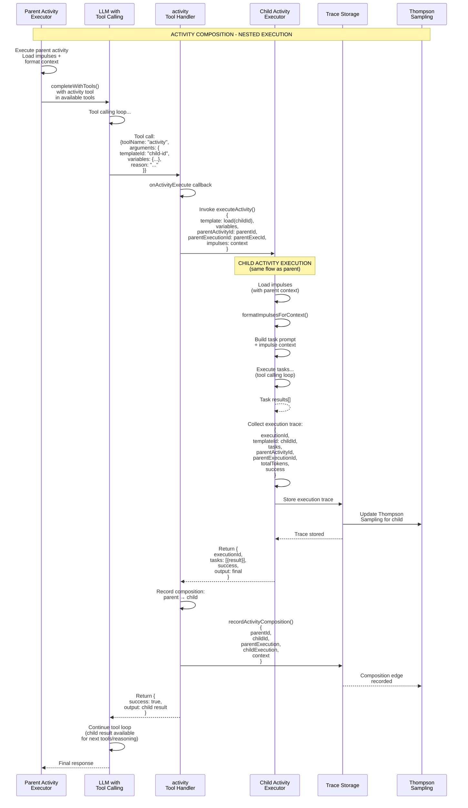

# Processing of Required Input Impulses by Resolvers

## Overview

This document maps how different resolver types (LLM, bash, git, file operations, activities) process required input impulses during task execution. It shows the complete flow from impulse context injection through tool execution to output impulse creation.

## Key Concepts

1. **Impulse Context Injection** - How impulses are formatted and injected into resolver prompts
2. **Tool Calling Loop** - LLM iterative execution with tool handlers (max 20 iterations)
3. **Deterministic Resolvers** - bash, git, file operations that don't use LLM
4. **Tool Argument Patterns** - Proven argument patterns from historical executions
5. **Output Impulse Creation** - Tool results become new impulses for downstream tasks
6. **Activity Composition** - Nested activity execution with composition tracking
7. **Pattern Learning** - Tool usage and argument patterns recorded for Thompson Sampling

## Main Sequence Diagram: Complete Resolver Flow

```mermaid
sequenceDiagram
    participant TaskExec as Task Executor<br/>(activity.ts)
    participant ImpStore as Impulse Store<br/>(impulse.ts)
    participant ImpFormat as formatImpulsesForContext<br/>(impulse.ts)
    participant LLMClient as LLM Client<br/>(llm.ts)
    participant ToolWrap as Tool Wrapper<br/>(tools.ts)
    participant Bash as Bash Resolver<br/>(bash tool)
    participant Git as Git Resolver<br/>(git tool)
    participant ImpCreate as Impulse Creator<br/>(impulse.ts)
    participant MCP as MCP Backend<br/>(mcp.ts)

    Note over TaskExec,MCP: PHASE 1: LOAD & FORMAT INPUT IMPULSES

    TaskExec->>ImpStore: loadImpulses(impulseIds)
    ImpStore->>ImpStore: resolvePointer() [DISPATCH ORDER]
    ImpStore->>ImpStore: 1. LOCAL: memo (embedded)
    ImpStore->>ImpStore: 2. LOCAL: file (filesystem)
    ImpStore->>ImpStore: 3. LOCAL: directoryTree, gitDiff
    ImpStore->>ImpStore: 4. CUSTOM: registered resolvers
    ImpStore->>ImpStore: 5. DISCOVERY: vessel discovery
    ImpStore->>ImpStore: 6. BACKEND: MCP fallback
    ImpStore->>ImpStore: Truncate to budget
    ImpStore-->>TaskExec: Return loaded impulses

    TaskExec->>ImpStore: captureImpulseHashes(impulseIds)
    ImpStore-->>TaskExec: Record hash before execution

    Note over TaskExec,MCP: PHASE 2: INJECT IMPULSES INTO PROMPT

    TaskExec->>TaskExec: substituteImpulses(template, ids)
    TaskExec->>ImpStore: loadImpulses(referenced ids)
    ImpStore-->>TaskExec: Return impulse content

    TaskExec->>ImpFormat: formatImpulsesForContext(impulses)
    ImpFormat->>ImpFormat: For each impulse:
    ImpFormat->>ImpFormat: IF metadata present:<br/>USE pointer-mode<br/>(&lt;impulse_ref&gt; XML tags)
    ImpFormat->>ImpFormat: ELSE loaded content:<br/>USE content-mode<br/>(&lt;impulse&gt; with content)
    ImpFormat-->>TaskExec: Return formatted context string

    TaskExec->>TaskExec: Prepend impulse context<br/>+ proven tool patterns<br/>+ error impulses (if retry)

    Note over TaskExec,MCP: PHASE 3: BUILD LLM REQUEST

    TaskExec->>TaskExec: Build messages array:<br/>1. System prompt<br/>2. Impulse context +<br/>formatted impulses +<br/>tool recommendations<br/>3. Task prompt

    TaskExec->>TaskExec: Filter tools<br/>(based on task.resolverRequirements)

    Note over TaskExec,MCP: PHASE 4: LLM RESOLVER - TOOL CALLING LOOP

    TaskExec->>LLMClient: completeWithTools(options, handlers)

    loop Tool Calling Loop [max 20 iterations]
        LLMClient->>LLMClient: POST /messages to<br/>Anthropic API<br/>with system + messages +<br/>formatted tools

        LLMClient-->>LLMClient: Parse response:<br/>extract text + tool_use blocks

        LLMClient->>LLMClient: Tool calls<br/>from response?
        alt No Tool Calls
            LLMClient->>LLMClient: content = final response
            LLMClient-->>TaskExec: Return {content, toolsUsed, usage}
            break Done with tool calling
        else Tool Calls Found
            LLMClient->>LLMClient: For each tool call:
            LLMClient->>ToolWrap: Wrap handler to<br/>capture tool execution
            ToolWrap->>Bash: bash resolver<br/>(validateCommand +<br/>spawn process)
            Bash-->>ToolWrap: {success, output, error}
            ToolWrap->>Git: git resolver<br/>(git command with<br/>timeout + auth)
            Git-->>ToolWrap: {success, output, error}
            ToolWrap-->>LLMClient: Return tool result

            LLMClient->>LLMClient: Record tool call:<br/>- name<br/>- arguments<br/>- result

            LLMClient->>LLMClient: Append to messages:<br/>1. assistant message<br/>with tool_use content<br/>2. tool result message
        end
    end

    Note over TaskExec,MCP: PHASE 5: CREATE OUTPUT IMPULSES FROM TOOL CALLS

    TaskExec->>TaskExec: For each tool call record:
    TaskExec->>ImpCreate: Create output impulse<br/>if tool.result.success

    ImpCreate->>ImpCreate: Build impulse:<br/>id: tool:{name}:{taskId}:{timestamp}<br/>type: memo<br/>content: tool output<br/>budget: output.length / 4<br/>tags: [tool:{name}, activity:{id}]

    ImpCreate->>MCP: storeImpulse(impulse)<br/>[BLOCKING with retries]
    MCP-->>ImpCreate: Stored in backend

    ImpCreate->>ImpStore: Store locally
    ImpCreate-->>TaskExec: Impulse created

    Note over TaskExec,MCP: PHASE 5.5: EXTRACT TOOL ARGUMENT IMPULSES

    TaskExec->>TaskExec: For each tool call:<br/>extractToolArgumentImpulse()

    TaskExec->>ImpCreate: Create argument impulse<br/>if extraction succeeds

    ImpCreate->>ImpCreate: Build impulse:<br/>id: toolargs:{hash}<br/>type: memo or custom<br/>content: structured args<br/>metadata:<br/>  shape: tool_invocation<br/>  toolName<br/>  argumentsHash<br/>  successRate<br/>tags: [tool-args:{name}]

    ImpCreate->>MCP: storeImpulse(impulse)
    MCP-->>ImpCreate: Stored for pattern learning

    ImpCreate-->>TaskExec: Argument impulse created

    Note over TaskExec,MCP: PHASE 6: STATE TRANSITIONS & ACTIVITY OUTPUT

    TaskExec->>TaskExec: Store activity output<br/>storeActivityOutput(activityId,<br/>taskId, result.content)

    TaskExec->>TaskExec: Capture output state:<br/>- filesCreated<br/>- filesModified<br/>- toolCallRecords

    TaskExec->>TaskExec: captureFileHashes()<br/>(after execution)

    TaskExec->>TaskExec: calculateImpulseEvolution()<br/>(compare before/after hashes)

    Note over TaskExec,MCP: PHASE 7: RECORD PATTERNS FOR LEARNING

    TaskExec->>MCP: recordToolArgumentPattern()<br/>For each tool call:<br/>- activityId<br/>- toolName<br/>- argumentHash<br/>- executionSucceeded<br/>- failureType (if failed)

    MCP-->>TaskExec: Pattern recorded<br/>(Thompson Sampling)

    TaskExec->>MCP: recordImpulseRelevance()<br/>For each impulse:<br/>- impulseId<br/>- wasLoaded<br/>- executionSucceeded

    MCP-->>TaskExec: Relevance recorded

    Note over TaskExec,MCP: PHASE 8: VALIDATION & ERROR HANDLING

    alt Validation Enabled
        TaskExec->>TaskExec: runValidation(pattern)<br/>- requiredFiles<br/>- requiredPatterns<br/>- forbiddenPatterns

        alt Validation Failed
            TaskExec->>ImpCreate: createErrorImpulse()<br/>id: error:{taskId}:{activityId}:{ts}<br/>content: error message<br/>metadata:<br/>  shape: previous_attempt_error<br/>  attemptNumber<br/>  failureType<br/>  availableOps<br/>  suggestedOp

            ImpCreate->>MCP: storeImpulse(errorImpulse)
            MCP-->>ImpCreate: Error impulse stored<br/>(for retry context)

            ImpCreate-->>TaskExec: Error impulse ready

            TaskExec->>TaskExec: Return {status: failed,<br/>error, metadata:<br/>inputState, outputState,<br/>stateTransition, toolCalls}
        else Validation Succeeded
            TaskExec->>TaskExec: Continue to success path
        end
    end

    Note over TaskExec,MCP: PHASE 9: SUCCESS COMPLETION

    TaskExec->>TaskExec: Return {status: completed,<br/>output: result.content,<br/>tokens: {input, output},<br/>metadata: {<br/>  inputState,<br/>  outputState,<br/>  stateTransition,<br/>  toolCalls,<br/>  impulseEvolution,<br/>  modelSelection<br/>}}

    Note over TaskExec,MCP: PHASE 10: ACTIVITY COMPOSITION (NESTED EXECUTION)

    alt Activity Calls Activity
        TaskExec->>TaskExec: activity resolver<br/>(runActivity tool)

        TaskExec->>TaskExec: Prepare nested context:<br/>- parentActivityId<br/>- parentExecutionId<br/>- impulses passed as context

        TaskExec->>TaskExec: executeActivity()<br/>(recursive call)

        TaskExec-->>TaskExec: Return nested execution result

        TaskExec->>ImpCreate: Create composition edge impulse<br/>(parent → child)

        ImpCreate->>MCP: recordActivityComposition()
        MCP-->>ImpCreate: Composition tracked

        ImpCreate-->>TaskExec: Composition recorded
    end

    Note over TaskExec,MCP: FINAL: BATCH STORAGE & RIBOSOME EXTRACTION

    TaskExec->>MCP: storeExecutionTrace()<br/>{<br/>  executionId,<br/>  templateId,<br/>  tasks: [{<br/>    id, prompt, result,<br/>    tokens, metadata<br/>  }],<br/>  totalTokens,<br/>  costUSD,<br/>  success,<br/>  duration<br/>}

    MCP-->>TaskExec: Trace stored

    MCP->>MCP: Thompson Sampling update<br/>α/β for template variants

    MCP->>MCP: Ribosome pattern extraction<br/>(if shouldExtractTemplate)<br/>→ assembleTemplateFromExecution

    MCP-->>TaskExec: Template candidate created<br/>(for next iteration)
```

## Decomposition: LLM Resolver with Impulse Context

```mermaid
sequenceDiagram
    participant LLM as LLM Resolver
    participant ImpCtx as Impulse Context<br/>Formatter
    participant Prompt as Prompt Builder
    participant APICall as Anthropic API
    participant ToolLoop as Tool Loop
    participant ToolHandler as Tool Handler
    participant Result as Result Processing

    Note over LLM,Result: LLM RESOLVER WITH IMPULSE CONTEXT INJECTION

    LLM->>ImpCtx: formatImpulsesForContext(loaded[])
    ImpCtx->>ImpCtx: For each impulse:
    ImpCtx->>ImpCtx: IF metadata.shape exists:<br/>FORMAT: &lt;impulse_ref<br/>  id="{id}"<br/>  type="{type}"<br/>  shape="{shape}"<br/>  row_count="{count}"<br/>  summary="{text}"/&gt;

    ImpCtx->>ImpCtx: ELSE IF loaded.content:<br/>FORMAT: &lt;impulse<br/>  id="{id}"<br/>  type="{type}"<br/>  tokens={actual}/{budget}&gt;<br/>{content}<br/>&lt;/impulse&gt;

    ImpCtx-->>Prompt: &lt;impulse_context&gt;<br/>(formatted impulses)<br/>&lt;/impulse_context&gt;

    Prompt->>Prompt: Build full prompt:<br/>1. Impulse context block<br/>2. Tool pattern hints<br/>(if arg recommendations)<br/>3. Error impulses (if retry)<br/>4. Task prompt

    Prompt->>Prompt: Build messages:<br/>- system: config.systemPrompt<br/>- user: full prompt

    Prompt->>APICall: POST /messages<br/>{<br/>  model,<br/>  system,<br/>  messages,<br/>  tools: [{<br/>    name,<br/>    description,<br/>    input_schema<br/>  }],<br/>  max_tokens<br/>}

    APICall-->>LLM: {<br/>  content: [{<br/>    type: "text" | "tool_use",<br/>    text?: string,<br/>    id?: string,<br/>    name?: string,<br/>    input?: object<br/>  }],<br/>  stop_reason: "tool_use" | "end_turn"<br/>}

    LLM->>ToolLoop: While maxIterations > 0:<br/>Extract toolCalls[] from response

    alt NO Tool Calls (stop_reason="end_turn")
        ToolLoop-->>Result: Return {content, toolsUsed, usage}
    else Tool Calls Present
        ToolLoop->>ToolLoop: For each toolCall:

        ToolLoop->>ToolHandler: Call handler(toolCall.arguments)
        ToolHandler->>ToolHandler: Validate arguments
        ToolHandler->>ToolHandler: Execute operation
        ToolHandler-->>ToolLoop: Return {success, output?, error?}

        ToolLoop->>LLM: Record:<br/>- toolName<br/>- arguments<br/>- result<br/>(for output impulses)

        ToolLoop->>LLM: Append messages:<br/>1. assistant:<br/>   content: text + tool_use blocks<br/>2. tool:<br/>   content: result<br/>   tool_call_id: id

        ToolLoop->>APICall: Next API call<br/>with extended messages
    end
```

**Implementation:** `repos/minibob/src/llm.ts:360-448`

**Key Points:**
- Impulse context injected at start of user message
- Tool patterns provide proven argument examples
- Max 20 iterations prevents infinite loops
- Tool results appended to conversation for next iteration

## Decomposition: Deterministic Resolvers (Bash & Git)



**Implementation:**
- Bash: `repos/minibob/src/tools.ts:790-835`
- Git: `repos/minibob/src/tools.ts:1114-1168`

**Security Features:**
- Command whitelist (git, npm, bun, python, ls, cat, grep, make, etc.)
- Blocked patterns (rm -rf /, fork bombs, dangerous commands)
- Path validation (must be within working directory)
- Timeout protection (60 seconds default)

## Decomposition: Activity Composition (Nested Execution)



**Implementation:** `repos/minibob/src/tools.ts:1214-1246`

**Key Points:**
- Child execution is recursive (same flow as parent)
- Parent impulses available to child
- Composition edges recorded for learning
- Thompson Sampling learns from both parent and child outcomes

## Tool Argument Pattern Learning

### Pattern Extraction

```typescript
// After each tool call, extract argument pattern
function extractToolArgumentImpulse(toolCall: ToolCall): Impulse | null {
  const { name, arguments: args, result } = toolCall;

  // Compute stable hash of argument structure
  const argShape = JSON.stringify(
    Object.keys(args).sort()
  );
  const argHash = Bun.hash(argShape);

  return {
    id: `toolargs:${name}:${argHash}`,
    pointer: {
      type: "memo",
      content: JSON.stringify({
        toolName: name,
        arguments: args,
        argumentShape: argShape,
        result: {
          success: result.success,
          outputLength: result.output?.length || 0
        }
      })
    },
    metadata: {
      shape: "tool_invocation",
      toolName: name,
      argumentsHash: argHash,
      successRate: result.success ? 1.0 : 0.0
    },
    tags: [`tool-args:${name}`, `activity:${activityId}`, `task:${taskId}`],
    budget: 2000,
    priority: "low"
  };
}
```

### Pattern Storage and Retrieval

```typescript
// Backend stores patterns with Thompson Sampling
interface ToolArgumentPattern {
  toolName: string
  argumentHash: string
  arguments: object
  successCount: number
  failureCount: number
  successRate: number      // successCount / (successCount + failureCount)
  timesUsed: number
  avgExecutionMs: number
  lastUsed: Date
}

// Query top patterns for task
const recommendations = await mcp.getToolArgumentRecommendations(templateId);
// Returns top 5 by success rate

// Inject into prompt as hints
const hintBlock = `
## Proven Tool Argument Patterns
${recommendations.map(r =>
  `- ${r.toolName}: ${JSON.stringify(r.arguments)} (${r.successRate * 100}% success, used ${r.timesUsed} times)`
).join('\n')}
`;
```

**Implementation:** `repos/minibob/src/activity.ts` (tool argument extraction and injection)

## Error Impulse Creation

### Error Impulse Structure

```typescript
{
  id: `error:${taskId}:${activityId}:${timestamp}`,
  pointer: {
    type: "memo",
    content: errorMessage
  },
  budget: Math.min(errorMessage.length / 4, 2000),
  priority: "high",
  metadata: {
    shape: "previous_attempt_error",
    attemptNumber: 2,
    maxAttempts: 3,
    failureType: "validation" | "execution" | "tool_failure" | "timeout",
    validationError?: string,
    toolName?: string,
    availableOps: ["retry", "variant", "debug", "skip", "escalate"],
    suggestedOp: "retry" | "variant" | "debug" | "escalate",
    suggestionConfidence: 0.0 - 1.0
  },
  tags: ["error", `activity:${activityId}`, `task:${taskId}`]
}
```

### Error Impulse Injection on Retry

```typescript
// On retry attempt, error impulses from previous attempts
// are loaded and injected into prompt context

const errorImpulses = impulseStore.getByShape("previous_attempt_error");
const errorContext = formatImpulsesForContext(errorImpulses);

const fullPrompt = `
${impulseContext}

${errorContext}
<!-- Previous attempts failed. Review error impulses above. -->

${task.prompt.template}
`;
```

**Implementation:** `repos/minibob/src/impulse.ts:881-961` (createErrorImpulse)

## Complete Data Flow Diagram

```mermaid
graph TD
    A["PHASE 1: LOAD IMPULSES<br/>impulse.ts:load()"] -->|"Dispatch: local → custom → discovery → MCP"| B["Resolve pointers<br/>by type"]
    B -->|"memo: embedded"| C["Use content directly"]
    B -->|"file: filesystem"| D["Read from disk<br/>with line slicing"]
    B -->|"activityOutput"| E["Resolve from store<br/>or MCP"]
    B -->|"other types"| F["Query discovery-vessel<br/>or fallback to MCP"]

    C --> G["Truncate to budget<br/>if needed"]
    D --> G
    E --> G
    F --> G

    G --> H["Return loaded impulses[]"]

    H --> I["PHASE 2: FORMAT CONTEXT<br/>impulse.ts:formatImpulsesForContext"]

    I -->|"Has metadata"| J["Use pointer-mode<br/>&lt;impulse_ref&gt; tags<br/>shape metadata only"]
    I -->|"No metadata"| K["Use content-mode<br/>&lt;impulse&gt; tags<br/>with full content"]

    J --> L["Build impulse_context block"]
    K --> L

    L --> M["PHASE 3: INJECT INTO PROMPT<br/>activity.ts:execute"]

    M --> N["substituteImpulses()<br/>Replace {{impulse:id}}<br/>placeholders"]
    N --> O["Prepend formatImpulsesForContext()<br/>+ tool patterns<br/>+ error impulses if retry"]
    O --> P["Build messages<br/>system + user"]

    P --> Q["PHASE 4: LLM RESOLVER<br/>llm.ts:completeWithTools"]

    Q --> R["POST /messages to API<br/>with system + messages +<br/>tools definitions"]
    R --> S{Tool calls<br/>in response?}

    S -->|"No"| T["Return final content"]
    S -->|"Yes"| U["Execute each tool call"]

    U --> V{Tool type?}
    V -->|"bash"| W["Validate + spawn process<br/>tools.ts:bash"]
    V -->|"git"| X["Git command<br/>tools.ts:git"]
    V -->|"read/write/edit"| Y["File operations<br/>tools.ts"]
    V -->|"activity"| Z["Nested execution<br/>activity.ts:execute"]

    W --> AA["Record tool call:<br/>name, args, result"]
    X --> AA
    Y --> AA
    Z --> AA

    AA --> AB["Append to messages<br/>assistant + tool result"]
    AB --> R

    T --> AC["PHASE 5: CREATE OUTPUT IMPULSES<br/>impulse.ts:createImpulse"]

    AC --> AD["For each tool call:<br/>Create impulse<br/>id: tool:{name}:{taskId}:{ts}"]
    AD --> AE["Store locally +<br/>post to MCP backend<br/>with 3x retries"]
    AE --> AF["Broadcast to TUI"]

    AF --> AG["PHASE 6: EXTRACT ARGUMENT IMPULSES<br/>tool-argument-extractor.ts"]
    AG --> AH["Create impulse for<br/>tool arguments<br/>for pattern learning"]
    AH --> AI["Store with tags<br/>tool-args, activity, task"]

    AI --> AJ["PHASE 7: RECORD PATTERNS<br/>mcp.ts"]

    AJ --> AK["recordToolArgumentPattern()<br/>- toolName<br/>- argumentHash<br/>- successRate<br/>- failureType if failed"]
    AJ --> AL["recordImpulseRelevance()<br/>- which impulses loaded<br/>- execution success"]

    AK --> AM["PHASE 8: VALIDATION<br/>activity.ts:runValidation"]
    AL --> AM

    AM --> AN{Validation<br/>passes?}
    AN -->|"No"| AO["Create error impulse<br/>shape: previous_attempt_error"]
    AN -->|"Yes"| AP["Return success"]

    AO --> AQ["Store error impulse<br/>for retry context"]
    AQ --> AR["Return task failed"]

    AP --> AS["PHASE 9: STORE EXECUTION TRACE<br/>mcp.ts:storeExecutionTrace"]

    AS --> AT["Send to backend:<br/>- taskId, prompt, result<br/>- tokens, metadata<br/>- inputState, outputState<br/>- stateTransition<br/>- impulseEvolution<br/>- toolCalls"]

    AT --> AU["PHASE 10: LEARNING UPDATE<br/>Backend"]

    AU --> AV["Thompson Sampling:<br/>Update α/β for variants"]
    AU --> AW["Ribosome extraction:<br/>successful executions →<br/>new templates"]
    AU --> AX["Pattern learning:<br/>tool arguments,<br/>impulse relevance<br/>composition edges"]

    AV --> AY["READY FOR NEXT EXECUTION"]
    AW --> AY
    AX --> AY

    style A fill:#e1f5ff
    style Q fill:#fff9c4
    style AC fill:#c8e6c9
    style AU fill:#ffd54f
    style AY fill:#c8e6c9
```



## Tool Resolver Comparison

| Resolver Type | Uses LLM | Latency | Impulse Input | Output Type | Security |
|---------------|----------|---------|---------------|-------------|----------|
| **LLM** | Yes | Variable (seconds) | Context injection | Text + tool calls | Prompt injection risk |
| **bash** | No | Fast (ms-seconds) | None | stdout/stderr | Command whitelist |
| **git** | No | Fast (ms-seconds) | None | git output | Safe git commands |
| **read** | No | Fast (ms) | None | File content | Path validation |
| **write** | No | Fast (ms) | File content | Success/error | Path validation |
| **edit** | No | Fast (ms) | old/new strings | Success/error | Exact match only |
| **activity** | Yes (nested) | Variable (seconds) | Full context | Execution result | Template validation |
| **impulse_create** | No | Fast (ms) | Pointer spec | Impulse ID | Type validation |

## File References

| Component | File | Lines | Purpose |
|-----------|------|-------|---------|
| LLM Client | `repos/minibob/src/llm.ts` | 360-448 | Tool calling loop |
| Tool Definitions | `repos/minibob/src/tools.ts` | 790-1722 | All tool handlers |
| Bash Resolver | `repos/minibob/src/tools.ts` | 790-835 | Command execution |
| Git Resolver | `repos/minibob/src/tools.ts` | 1114-1168 | Git operations |
| Activity Composition | `repos/minibob/src/tools.ts` | 1214-1246 | Nested execution |
| Impulse Creation | `repos/minibob/src/impulse.ts` | Full file | Store and lifecycle |
| Output Impulses | `repos/minibob/src/activity.ts` | 3213-3273 | Tool result → impulse |
| Error Impulses | `repos/minibob/src/impulse.ts` | 881-961 | Error context capture |

## Related Documentation

- [Impulse Resolution](./02-impulse-resolution.md) - How impulses are loaded
- [Activity Selection](./01-activity-selection.md) - How activities are chosen
- [Improvisation](./04-improvisation-trailblazing.md) - What happens on failure
- [IMPULSE_ACTIVITY_FOUNDATION.md](../IMPULSE_ACTIVITY_FOUNDATION.md) - Foundational model

---

**Last Updated:** 2026-04-16
