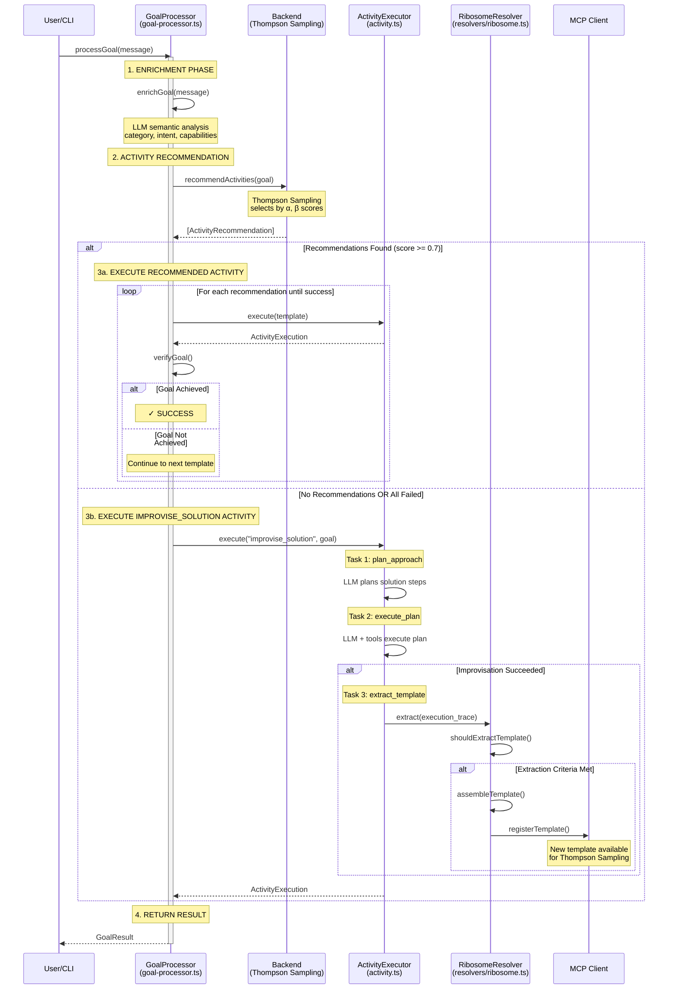
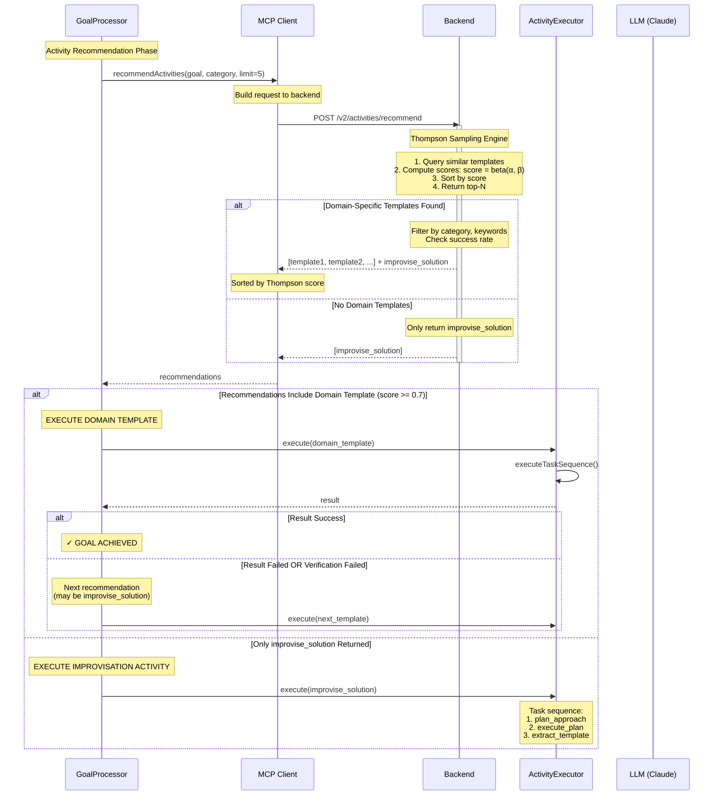
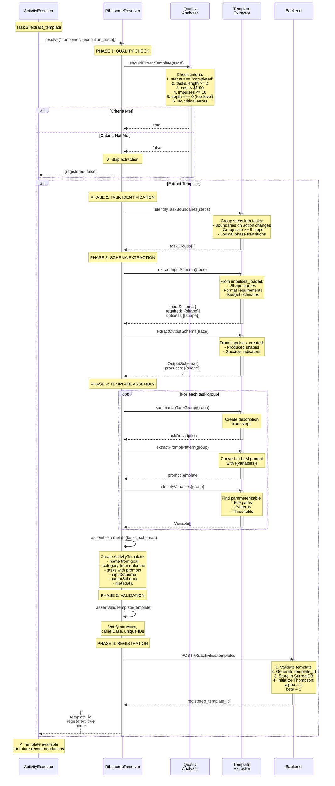
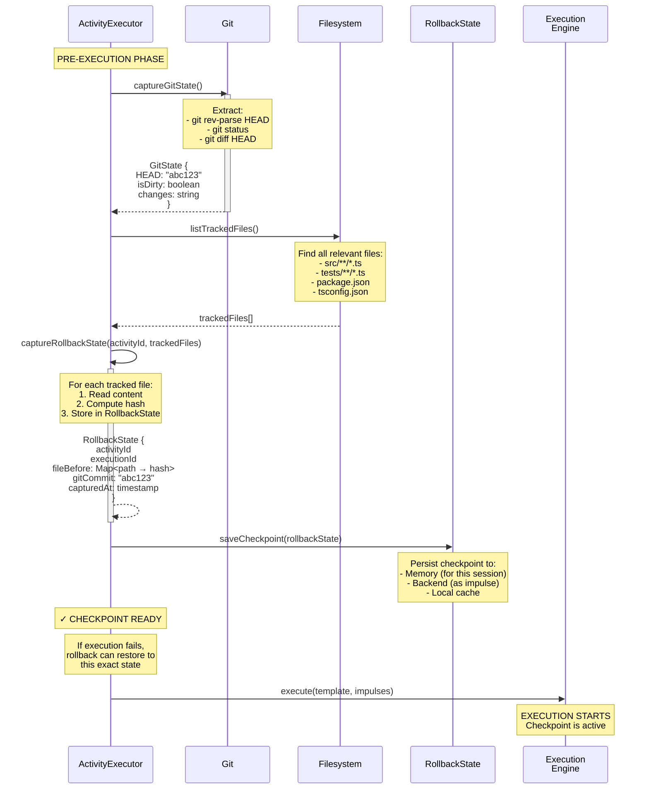
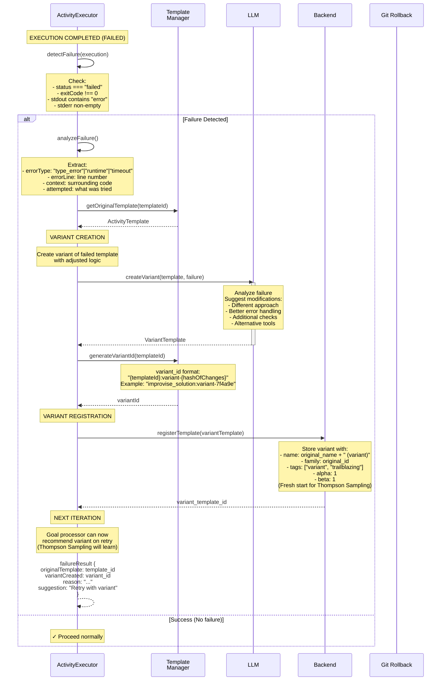
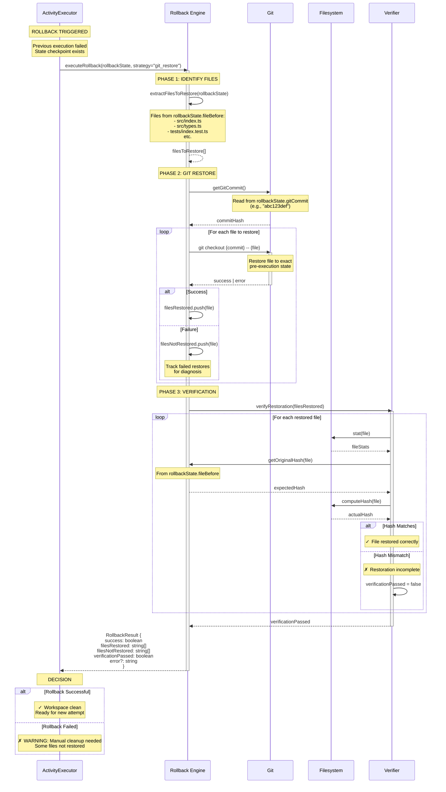
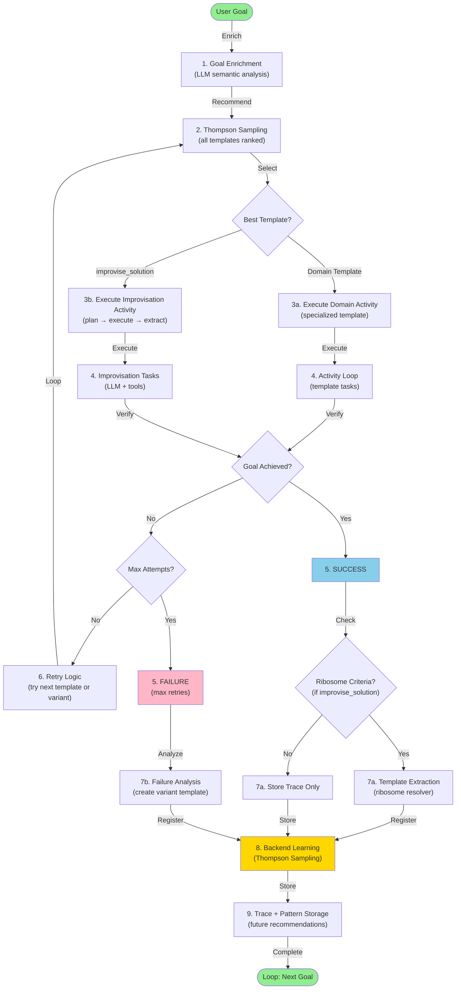

# Improvisation, Failure Modes, Checkpoints, and Rollbacks

> **STATUS (2026-04-28): Renamed from `04-improvisation-trailblazing.md`.** "Trailblazing" was class-(c) terminology — never implemented and pruned from the corrected foundation model. What older versions of this doc called trailblazing is now handled by the **failure-mode taxonomy** (`verifier_negative`, `budget_exhausted`, `safety_breach`, `cascading`, `user_abort`) plus posterior variance. Read this file for the improvisation flow (which is real and current); treat any remaining trailblazing references as historical. See [`IMPULSE_ACTIVITY_FOUNDATION.md`](../IMPULSE_ACTIVITY_FOUNDATION.md#known-gaps-system-not-yet-self-stable) → "Class-(c) Terms Pruned".

> **Status (2026-05-27):** The failure-mode taxonomy and improvisation-as-activity model are accurate. File refs (`goal-processor.ts`, `improviser.ts`, `rollback.ts`, `template-extractor.ts`) point to minibob source that has moved: improvisation and ribosome extraction now live in `goal-host-vessel` / `ias-executor-ts`; `ribosome-vessel` handles template extraction via the `lifecycle:execution:succeeded` WebSocket subscription. The `GoalProcessor` / `ActivityExecutor` participant labels should be read as `GoalHost (goal-host-vessel)`.

## Overview

This document maps the complete flow of how MiniBob handles situations when no activity template matches (improvisation), learns from failures (trailblazing), and manages execution safety (checkpoints and rollbacks). These mechanisms enable continuous learning and autonomous adaptation.

**Key Insight:** Improvisation is not a fallback mode - it's an activity template like any other. The `improvise_solution` activity uses LLM-directed tool use to explore solutions, and the ribosome resolver extracts successful improvisations into reusable templates.

## Key Concepts

1. **Improvisation as an Activity** - `improvise_solution` template with plan → execute → extract tasks
2. **Trailblazing** - Creating variant templates from failed executions
3. **Checkpoints** - Git state capture before execution for rollback capability
4. **Rollbacks** - Restoring pre-execution state after failures
5. **Ribosome Resolver** - Task 3 of `improvise_solution` that extracts successful patterns into templates
6. **Thompson Sampling Learning** - Updating α/β scores based on execution outcomes
7. **Stuck Detection** - Identifying when improvisation is making no progress

## Main Sequence Diagram: Goal Processing via Activity Composition



**Implementation:** `repos/minibob/src/goal-processor.ts:650-6800+`

## Improvisation as an Activity

Improvisation is no longer a special "fallback mode" - it's a first-class activity template that gets composed like any other.

### The `improvise_solution` Activity Template

```typescript
{
  id: "improvise_solution",
  name: "Improvise Solution via LLM Tool Use",
  category: "tool",
  tasks: [
    {
      id: "plan_approach",
      description: "Analyze the goal and plan a solution approach",
      prompt: {
        template: `Given this goal: {{goalDescription}}

Analyze the requirements and create a step-by-step plan to achieve it.
Consider available tools: bash, read, write, edit, glob, grep.

Identify:
1. What information you need to gather
2. What changes you need to make
3. How to verify success`,
        variables: [
          { name: "goalDescription", type: "string", required: true }
        ]
      }
    },
    {
      id: "execute_plan",
      description: "Execute the planned solution using available tools",
      prompt: {
        template: `Execute your plan from the previous task.

Use available tools to:
- Read files (read, grep)
- Modify code (edit, write)
- Run commands (bash)
- Verify changes (bash tests)

Track your progress after each step. If stuck, try a different approach.`,
        variables: []
      },
      validation: {
        maxSteps: 50,
        maxCost: 5.00,
        stuckDetection: true
      }
    },
    {
      id: "extract_template",
      description: "Extract successful execution into reusable template",
      resolver: "ribosome",
      condition: "execution.status === 'completed' && execution.tasks.length >= 2"
    }
  ],
  inputSchema: {
    required: [
      { shape: "goal_description", budget: 500 }
    ],
    optional: [
      { shape: "context_files", budget: 2000 },
      { shape: "previous_attempts", budget: 1000 }
    ]
  },
  outputSchema: {
    produces: [
      { shape: "execution_trace" },
      { shape: "activity_template", condition: "ribosome_extraction" }
    ]
  },
  metadata: {
    author: "system",
    category: "improvisation",
    thompsonParams: { alpha: 1, beta: 1 }
  }
}
```

### How It Works

1. **Goal processor selects activity**: Thompson Sampling returns `improvise_solution` when no domain-specific template matches
2. **Task 1 - Plan**: LLM analyzes the goal and creates a solution plan
3. **Task 2 - Execute**: LLM uses tools (bash, read, write, edit) to execute the plan
   - Step limit: 50 steps max
   - Cost limit: $5.00 max
   - Stuck detection: Break if same action repeated 3x
4. **Task 3 - Extract**: Ribosome resolver checks if extraction criteria met
   - If yes: Creates new activity template from execution
   - If no: Execution completes without extraction

### Key Difference from Old "Fallback" Model

**Before (fallback improvisation):**
```
Activity failed → Exit activity system → Enter improvisation mode → Ad-hoc LLM loop
```

**Now (activity composition):**
```
Activity failed → Execute improvise_solution activity → Tasks with validation
```

All workflows go through the activity composition system. Improvisation is just another activity.

## Decomposition: Activity Matching → Improvisation Selection



**Selection Logic:**
- Thompson Sampling ranks ALL templates (including `improvise_solution`)
- Domain-specific templates rank higher if they have good success history
- `improvise_solution` ranks higher when:
  - No domain templates exist
  - Domain templates have low success rates
  - Goal is novel/exploratory

## Decomposition: Improvise Solution Activity Execution

```mermaid
sequenceDiagram
    participant Exec as ActivityExecutor
    participant LLM as LLM (Claude)
    participant Tools as Tool Handlers<br/>(bash, read, write, etc)
    participant State as State Tracker<br/>(impulses_loaded,<br/>impulses_created)
    participant Ribosome as RibosomeResolver

    Note over Exec: EXECUTE: improvise_solution

    Note over Exec: TASK 1: plan_approach
    Exec->>Exec: captureStateSnapshot()
    Note over Exec: Pre-execution checkpoint

    Exec->>LLM: executeTask("plan_approach", {goalDescription})
    activate LLM
    Note over LLM: Analyze goal<br/>Identify requirements<br/>Create step-by-step plan
    LLM-->>Exec: Plan {steps, approach, tools_needed}
    deactivate LLM

    Note over Exec: TASK 2: execute_plan

    loop For each planned step (max 50)
        Exec->>LLM: sendMessage(goal, context, plan, tools_list)
        Note over LLM: Available tools:<br/>- bash: Run commands<br/>- read: Read files<br/>- write: Create files<br/>- edit: Modify files<br/>- glob: Find files<br/>- grep: Search content

        activate LLM
        LLM->>LLM: reason(goal, plan, progress)
        Note over LLM: Step {n}:<br/>Thought: "..."<br/>Action: tool_name<br/>Parameters: {...}
        LLM-->>Exec: ToolCall
        deactivate LLM

        Exec->>Tools: execute(action, params)
        activate Tools

        alt action === "read"
            Tools->>Tools: readFile(path)
            Tools->>State: recordImpulseLoad(path, "source_code")
            Note over State: Track shape + tokens
        else action === "write"
            Tools->>Tools: writeFile(path, content)
            Tools->>State: recordImpulseCreate(path, inferred_shape)
        else action === "bash"
            Tools->>Tools: execSync(command)
            Tools->>State: recordImpulseLoad(pattern, "bash_output")
        end

        Tools-->>Exec: ToolResult
        deactivate Tools

        Exec->>Exec: recordStep({<br/>  step: n<br/>  thought: "..."<br/>  action: "..."<br/>  result: {...}<br/>  duration_ms<br/>  cost_estimate<br/>})

        Exec->>LLM: sendToolResult(result)

        Exec->>Exec: verifyGoalAchieved()?
        alt Goal Achieved
            Note over Exec: ✓ Break loop
            break Goal Complete
        else Stuck Detection
            Exec->>Exec: isStuck()
            Note over Exec: Same action repeated 3x?
            alt Stuck
                Note over Exec: ✗ Break loop
                break Exit: Stuck
            end
        else Max Steps/Cost Reached
            alt steps >= 50 OR cost >= $5.00
                Note over Exec: ✗ Break loop
                break Exit: Limits
            end
        end
    end

    Note over Exec: TASK 3: extract_template

    Exec->>Ribosome: resolve("ribosome", execution_trace)
    activate Ribosome

    Ribosome->>Ribosome: shouldExtractTemplate(trace)
    Note over Ribosome: Check criteria:<br/>1. status === "completed"<br/>2. tasks.length >= 2<br/>3. cost < $1.00<br/>4. impulses <= 10<br/>5. depth === 0

    alt Criteria Met
        Ribosome->>Ribosome: assembleTemplate(trace)
        Note over Ribosome: Extract:<br/>- Input schema from impulses_loaded<br/>- Output schema from impulses_created<br/>- Tasks from step sequences<br/>- Variables from patterns

        Ribosome->>Ribosome: registerTemplate(template)
        Note over Ribosome: Store in backend<br/>Thompson params: α=1, β=1

        Ribosome-->>Exec: {template_id, registered: true}
    else Criteria Not Met
        Note over Ribosome: Skip extraction
        Ribosome-->>Exec: {registered: false}
    end
    deactivate Ribosome

    Exec->>Exec: computeOutcome()
    Note over Exec: Execution complete<br/>Template may be available
```

**Implementation:**
- Activity executor: `repos/minibob/src/activity.ts`
- Ribosome resolver: `repos/minibob/src/resolvers/ribosome.ts`
- State tracking: `repos/minibob/src/improviser.ts:256-299`

## Decomposition: Ribosome Resolver (Template Extraction)

The ribosome resolver is invoked as Task 3 of the `improvise_solution` activity.



**Ribosome Extraction Criteria:**
- Status: `completed` (successful execution)
- Minimum complexity: `tasks >= 2`
- Maximum cost: `< $1.00`
- Impulse count: `<= 10`
- Depth: `0` (top-level, not nested)
- No critical errors in execution

**Extracted Template Structure:**
```typescript
{
  id: "tpl_{timestamp}_{randomId}"
  name: Capitalized goal
  category: Inferred from goal/outcome
  tasks: [{ id, description, prompt, validation }]
  inputSchema: { required, optional }
  outputSchema: { produces }
  metadata: {
    generatedFrom: "execution"
    sourceExecutionId: trace.execution_id
    author: "ribosome"
    inputSchemaInferredFrom: {
      executionId
      confidence
      impulseCount
    }
  }
}
```

**Implementation:** `repos/minibob/src/template-extractor.ts:24-400+`, `repos/minibob/src/ribosome-quality.ts:103-142+`

## Decomposition: Checkpoint Creation Before Execution



**Checkpoint Structure:**
```typescript
{
  activityId: string
  executionId: string
  fileBefore: Map<string, string>  // path → hash
  workingDirectory: string
  gitCommit?: string
  capturedAt: number
}
```

**Implementation:** `repos/minibob/src/rollback.ts:79-250+`

## Decomposition: Trailblazing (Failure → Variant Creation)

Trailblazing works the same whether the failed activity is domain-specific or `improvise_solution`.



**Trailblazing Decision Flow:**
1. Failed execution detected (any activity, including `improvise_solution`)
2. Failure analysis performed
3. LLM generates variant with modifications
4. Variant registered with fresh Thompson scores
5. Variant becomes available for recommendation
6. Thompson Sampling learns variant effectiveness over time

**Implementation:** `repos/minibob/src/activity.ts` (trailblazing logic)

## Decomposition: Execution Rollback (Git Restore)



**Rollback Strategies:**
- **git_restore** (primary): `git checkout {commit} -- {file}`
- **file_restore** (fallback): Direct file content restoration from captured state

**Implementation:** `repos/minibob/src/rollback.ts:79-250+`

## Complete Learning Loop Diagram



## The Unified Activity Pathway

**All workflows go through activity composition. There is no separate "improvisation mode."**

| Scenario | Template Selected | Tasks Executed | Extraction |
|----------|-------------------|----------------|------------|
| **Domain-specific goal with matching template** | `fix_typescript_error` | Domain-specific tasks | No (domain template already exists) |
| **Novel goal, no matches** | `improvise_solution` | 1. plan_approach<br/>2. execute_plan<br/>3. extract_template | Yes (if criteria met) |
| **Template failed, retry** | Variant of original template | Modified tasks | No (variant already exists) |
| **Improvisation failed** | Variant of `improvise_solution` | Modified plan/execution | Yes (if variant succeeds) |

**Key Points:**
- No distinction between "activity execution" and "improvisation" in the execution engine
- `improvise_solution` is ranked alongside other templates via Thompson Sampling
- Ribosome extraction is a resolver task, not external post-processing
- All executions (domain or improvisation) produce traces for learning
- Variants can be created for any activity, including `improvise_solution`

## Key Configuration

| Variable | Default | Purpose |
|----------|---------|---------|
| `RELEVANCE_THRESHOLD` | 0.7 | Minimum score to prefer domain template over improvise_solution |
| `MAX_IMPROVISATION_STEPS` | 50 | Step limit for execute_plan task |
| `MAX_IMPROVISATION_COST` | $5.00 | Cost limit for execute_plan task |
| `RIBOSOME_MIN_TASKS` | 2 | Minimum tasks for template extraction |
| `RIBOSOME_MAX_COST` | $1.00 | Maximum cost for template extraction |
| `RIBOSOME_MAX_IMPULSES` | 10 | Maximum impulses for extraction |

## File References

| Component | File | Lines | Purpose |
|-----------|------|-------|---------|
| Goal Processor | `repos/minibob/src/goal-processor.ts` | 650-6800+ | Complete goal processing flow |
| Activity Executor | `repos/minibob/src/activity.ts` | 100-2000+ | Task execution and composition |
| Improvisation Tasks | `repos/minibob/src/improviser.ts` | 125-1650+ | LLM tool use for execute_plan |
| Ribosome Resolver | `repos/minibob/src/template-extractor.ts` | 24-400+ | Template extraction from traces |
| Ribosome Quality | `repos/minibob/src/ribosome-quality.ts` | 103-142+ | Extraction criteria |
| Rollback | `repos/minibob/src/rollback.ts` | 79-250+ | Checkpoint and restore |
| Checkpoint | `repos/minibob/src/activity.ts` | 455-610+ | Git state capture |

## Implementation Architecture

This sequence spans **both MiniBob (execution) and activity-api (storage/learning)**.

### MiniBob (Execution Environment)

**Responsibilities:**
- Execute `improvise_solution` activity (plan → execute → extract tasks)
- LLM-driven improvisation (tool use loop with stuck detection)
- Checkpoint creation (git state capture before execution)
- Rollback execution (git restore to pre-execution state)
- Ribosome extraction criteria evaluation
- Template assembly from successful executions
- Variant creation on failures (trailblazing)

**Key Files:**
- `repos/minibob/src/goal-processor.ts` (650-6800+) - Meta-activity orchestration
- `repos/minibob/src/improviser.ts` (125-1650+) - Improvisation activity implementation
- `repos/minibob/src/template-extractor.ts` (24-400+) - Ribosome template assembly
- `repos/minibob/src/ribosome-quality.ts` (103-142+) - Extraction criteria
- `repos/minibob/src/rollback.ts` (79-250+) - Checkpoint and rollback logic

**What MiniBob Does NOT Do:**
- Does NOT store templates (backend owns template registry)
- Does NOT compute variant performance (backend tracks Thompson scores)
- Does NOT aggregate extraction patterns (backend learns)

### Activity-API (Storage & Learning Backend)

**Responsibilities:**
- Store `improvise_solution` template and variants
- Thompson Sampling for improvisation vs domain-specific selection
- Register ribosome-extracted templates
- Track variant performance (α/β scores for variants)
- Store execution traces (success and failure)
- Compute extraction success rates

**Key Endpoints:**
- `GET /v2/activities/templates?id=improvise_solution` - Get improvisation activity template
- `POST /v2/activities/templates` - Register ribosome-extracted templates
- `POST /v2/activities/templates` - Register variant templates (trailblazing)
- `POST /v2/activities/execution-traces` - Store improvisation traces
- `POST /v2/activities/recommend` - Thompson Sampling (includes improvise_solution)

**Key Files:**
- `repos/metabob-activity-api/src/routes/activities.ts` - Template registration
- `repos/metabob-activity-api/src/db/paradigm.ts` - Thompson Sampling (includes improvise_solution in pool)
- `repos/metabob-activity-api/sql/seed/meta-activities/improvise_solution.json` - Template definition

### SurrealDB Schema

**Tables:**
- `activity_template` - All templates (domain + improvise_solution + variants + extracted)
- `variant_performance_metrics` - Variant success rates
- `activity_execution_trace` - Improvisation execution traces
- `checkpoint` - Git state snapshots (optional persistence)

**Indexes:**
- `activity_template` by category, family (for variant tracking)
- `variant_performance_metrics` by template_id, variant_id

### Correct Separation

**MiniBob handles (execution-time):**
- Improvisation activity execution (plan, execute, extract tasks)
- LLM tool use loop with stuck detection
- Checkpoint creation (git state capture)
- Rollback execution (git restore)
- Ribosome extraction logic (template assembly)
- Variant creation (modified template generation)

**Activity-API handles (storage/learning):**
- Template storage (improvise_solution, extracted, variants)
- Thompson Sampling (ranks improvise_solution alongside domain templates)
- Variant performance tracking
- Execution trace persistence
- Extraction pattern learning

**Why This Separation Matters:**
- Improvisation runs locally (MiniBob can improvise offline)
- Backend learns which improvisation strategies work (Thompson Sampling)
- Extracted templates become first-class citizens (Thompson Sampling includes them)
- Variants compete with originals (Thompson Sampling selects best)

**Key Architectural Point:**
Improvisation is an **activity**, not a fallback code path. It's stored in the backend as `improvise_solution.json` and selected via Thompson Sampling like any other template.

## Related Documentation

- [Activity Selection](./01-activity-selection.md) - How templates are recommended
- [Impulse Resolution](./02-impulse-resolution.md) - Data loading during execution
- [Resolver Processing](./03-resolver-processing.md) - Tool execution mechanics
- [IMPULSE_ACTIVITY_FOUNDATION.md](../IMPULSE_ACTIVITY_FOUNDATION.md) - Foundational model

---

**Last Updated:** 2026-04-16
