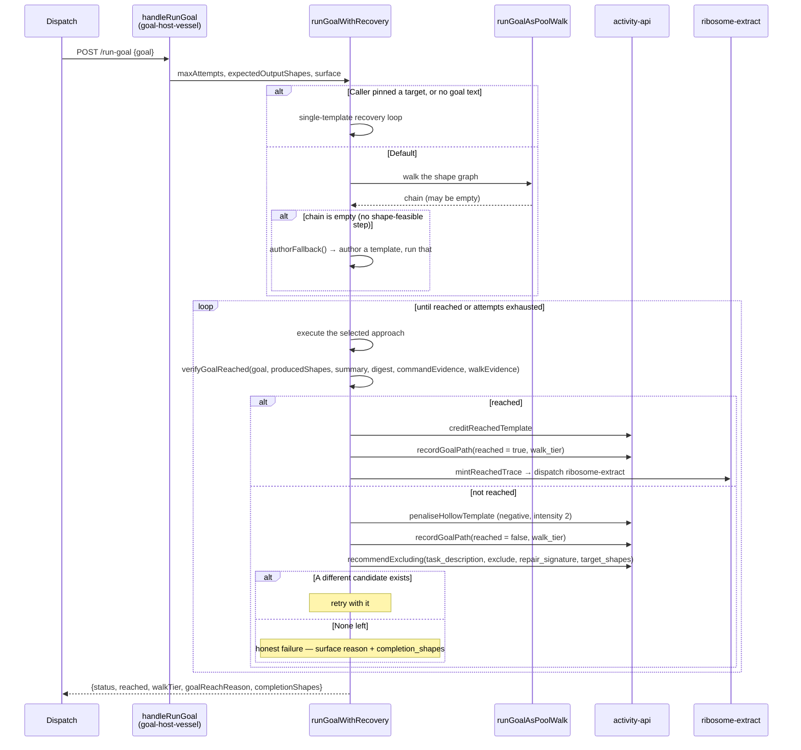
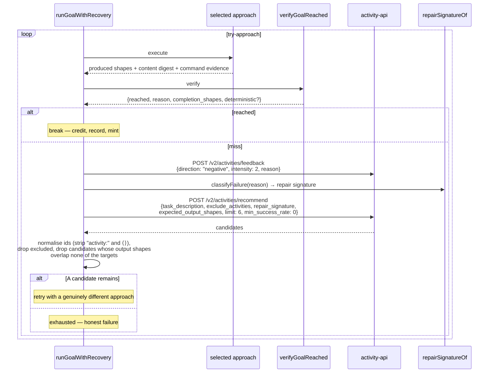
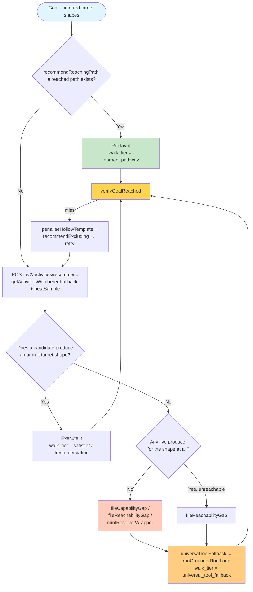
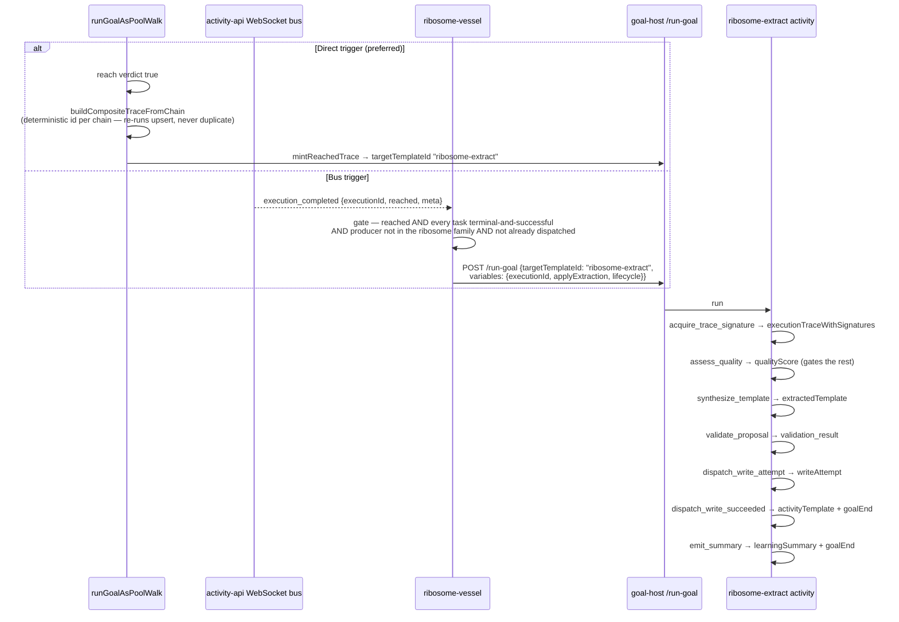
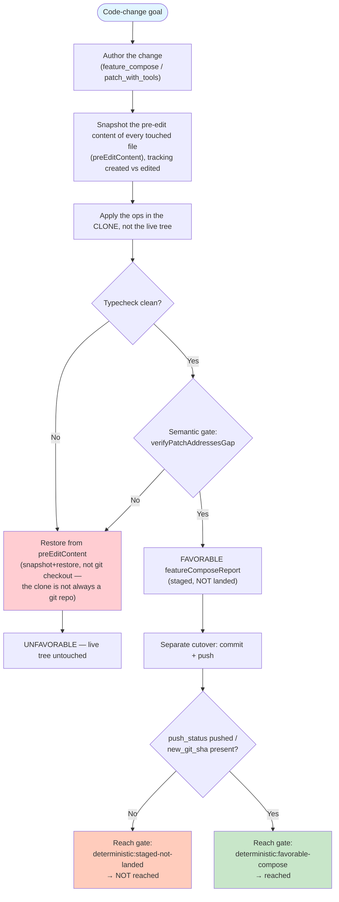
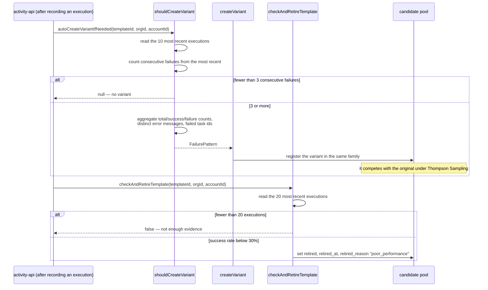
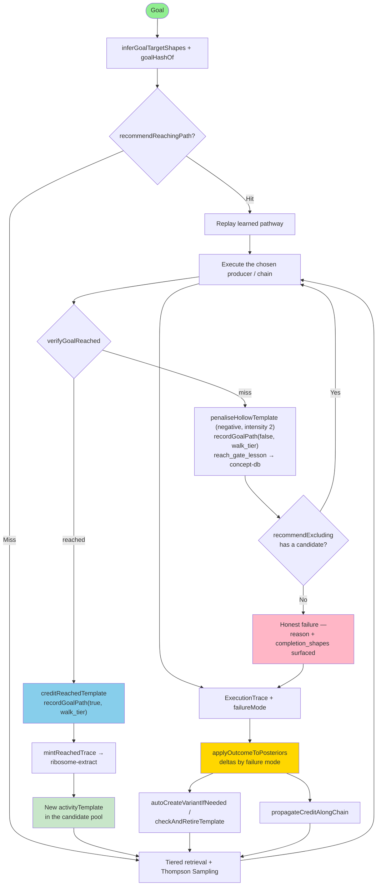

# Improvisation, Failure Modes, Checkpoints, and Rollbacks

> **How to read this.** Failure handling is in-flight, not offline. The same
> dispatch that ran an approach also grades it (`verifyGoalReached`) and, on a
> miss, tries a different one (`recommendExcluding`) — all inside
> `goal-host-vessel` (`:8210`). Posterior consequences are applied by
> `activity-api` (`:8080`); extraction of the trajectory that finally worked is
> the `ribosome-extract` activity, triggered by `ribosome-vessel` (`:8240`) or
> directly by `mintReachedTrace`. Cite by symbol, never by line number.

## Overview

This document maps what happens when a goal does not go well: the canonical failure taxonomy and the posterior consequence of each type, the in-flight recovery loop that retries with a genuinely different approach, the floor that keeps a goal reachable when no producer exists, and the staging-and-revert discipline that keeps a failed code change from becoming a broken vessel.

The organising claim is that **failure is graded, not merely detected**. Every failure carries a canonical type, and each type has a defined α/β delta — a budget breach is a half penalty, a cascade victim carries none, a user abort is neutral. Treating all failures as one signal would make the posterior a measure of difficulty rather than of quality.

## Key Concepts

1. **Canonical failure taxonomy** — `verifier_negative`, `budget_exhausted`, `safety_breach`, `cascading`, `user_abort`; anything else is filtered at the wire boundary.
2. **Hollow completion** — `status = completed` with the asked output absent. Detected by `verifyGoalReached`, penalised through `penaliseHollowTemplate`.
3. **In-flight recovery** — on a miss: β-penalise, exclude the failed approach, `recommendExcluding` a different one, retry until reached or exhausted.
4. **Floor** — `universalToolFallback` / `runGroundedToolLoop`: bounded, grounded tool use so no goal is structurally unreachable for want of a learned pathway.
5. **Bridge minting** — `mintResolverWrapper`, `fileCapabilityGap`, `fileReachabilityGap`: a missing producer becomes a filed gap, not an exception.
6. **Variant creation and retirement** — `shouldCreateVariant` on a consecutive-failure pattern, `checkAndRetireTemplate` on a sustained low success rate.
7. **Staged-then-landed code changes** — a patch lives in a writable clone until a separate cutover lands it; `deterministic:staged-not-landed` refuses to grade the staged state as a reach.
8. **Credit propagation** — `propagateCreditAlongChain` attributes an outcome along the composition chain rather than only to the leaf.

## Main Sequence Diagram: Goal Processing via Activity Composition



## In-Flight Recovery Loop

Recovery is part of reaching the goal, not a repair pass afterwards. The same dispatch that ran an approach grades it and, on a miss, selects a different one.



**Mechanics that make the loop honest:**
- `recommendExcluding` takes a **task description**, not the raw goal text, and passes `exclude_activities`; id normalisation prevents the just-failed approach from being re-selected under a differently-wrapped id.
- A `repair_signature` from `repairSignatureOf` / `classifyFailure` keys the retry on `(state, failure mode)` rather than collapsing distinct failures onto one posterior.
- The β penalty is applied *before* the next selection, so the retry samples from an updated posterior rather than the one that just misled it.
- Exhaustion is a real outcome. When no fresh candidate remains, the dispatch reports failure with the gate's `reason` and `completion_shapes` attached, which is what makes the failure diagnosable rather than merely red.
- The trace that finally **reaches** is what gets minted. Recovery feeds learning by extracting the approach that worked, never the one that merely completed.

**`reached: false` is itself a failure mode.** Hollow completion sits alongside the canonical taxonomy: it is detected by the gate, it drives a β penalty, it mirrors a class-grain lesson to concept-db (`reach_gate_lesson`, keyed by hollow class such as `deterministic_no_output`, `deterministic_error_envelope`, `deterministic_placeholder`, or `llm_judged_hollow`), and it triggers the loop above. Per-goal attribution accumulates in `goal_execution_paths` keyed by `goal_hash`.

## Improvisation as an Activity

There is no separate improvisation mode and no activity named for it. What older designs called improvisation is covered by two mechanisms in the walk, both ordinary walk tiers:

- **Bridge minting.** When no producer exists for a needed shape, the walk mints a resolver wrapper (`mintResolverWrapper`), or files the shortfall as a capability or reachability gap (`fileCapabilityGap`, `fileReachabilityGap`) so the substrate can close it. A missing producer is a filed gap, not an exception.
- **The floor.** `universalToolFallback` invokes `runGroundedToolLoop`, a bounded ReAct-style loop over the tools discovery can reach. It is the guarantee behind the execution expectation's floor: a goal with no learned pathway is still reachable, and every step of the attempt lands in a trace.

Both record a walk tier (`fresh_derivation`, `satisfier`, `universal_tool_fallback`) so the route taken is visible in `goal_execution_paths` and can be compared against the learned-pathway route for the same goal.

### The `improvise_solution` Activity Template

**No such template exists in the fleet.** Nothing named `improvise_solution` is seeded, registered, or selectable, and no directory of hand-written meta-activity JSON is shipped. Any description of its tasks, step limits, or cost caps should be read as retracted.

The role the name suggests — "get this goal done when nothing matches" — is filled by the floor described above. Its bounds are real and enforced in `runGroundedToolLoop`:

- at most 4 iterations,
- at most 8 tool calls per iteration,
- a wall-clock deadline checked *inside* a turn as well as between turns,
- a `doneKeys` set that refuses to re-execute an identical `(tool, arguments)` pair,
- a no-progress break when an iteration executed nothing new.

The loop also distinguishes **grounding** from **side effects**: successful read and shell calls increment a grounding counter and are fed back as observations, while calls to write shapes are recorded as effects and explicitly do not count as grounding. A "grounded" answer therefore means the model reasoned over data it actually gathered, not that it wrote something.

### How It Works

1. **Target inference.** `inferGoalTargetShapes` derives the shapes that would constitute reaching the goal; `inferDerivationSplit` separates intermediate shapes from terminal emit targets.
2. **Reuse first.** `recommendReachingPath` checks whether this goal has ever been reached and by what path; a reached path is replayed as `learned_pathway`.
3. **Walk.** For each unmet target shape, pick a producer or satisfier; execute it; fold outputs into the pool; ask `decideContinuation` whether to continue.
4. **Bridge or fall to the floor.** No producer for a shape means mint a wrapper or file a gap; if the walk cannot take a shape-feasible step at all, `authorFallback` authors a template, and failing that the grounded loop runs.
5. **Grade.** `verifyGoalReached` returns the verdict; deterministic checks run before any judge.
6. **Consequences.** Credit or penalty, path recorded, and on a reach, extraction dispatched.

### Key Difference from Old "Fallback" Model

**The retracted model:** a template fails, control leaves the activity system, an ad-hoc LLM loop runs untraced, and whatever it produced is reported.

**What actually happens:** every route is a tier of the same walk, and every route ends at the same gate.

```
walk_tier ∈ { learned_pathway, satisfier, universal_tool_fallback,
              feature_compose, fresh_derivation }
```

The consequences follow from that. There is no untraced escape hatch, so a floor run is as gradable as a learned-pathway run. The tier is recorded on the goal path, so "this goal only ever reaches via the floor" is a measurable statement and therefore a gap that can be filed. And because the floor is bounded and grounded, a run that gathered no data cannot present itself as an answer.

## Decomposition: Activity Matching → Improvisation Selection

Selection does not branch into an improvisation mode. It retrieves candidates, ranks them, and — when the ranked pool cannot cover the goal's target shapes — the walk continues by other means.



A goal that repeatedly finds no producer is escalated rather than silently retried: `escalateNoProducerToInvestigation` self-dispatches an "investigate and decompose" goal tagged `escalated_from:no_producer`, so the shortfall becomes work the substrate does rather than a stuck dispatch.

## Decomposition: Improvise Solution Activity Execution

Since no `improvise_solution` activity exists, what this section documents is the execution of the floor — the mechanism that occupies its place.

```mermaid
sequenceDiagram
    participant Walk as runGoalAsPoolWalk
    participant UF as universalToolFallback
    participant Loop as runGroundedToolLoop
    participant Disc as discovery (ufResolveUrl)
    participant LLM as llm_completion_dispatch
    participant Tool as ufExecuteTool

    Walk->>UF: goal, targetShapes
    UF->>Disc: resolve llm_completion_dispatch
    Note over UF: NOT gated on any env var — the loop<br/>returns null when dispatch is genuinely unavailable
    UF->>UF: ufBuildWriteTool per target write shape
    UF->>Loop: basePrompt, tools, writeShapeList

    loop ≤ 4 iterations, while before the deadline
        Loop->>LLM: prompt + accumulated real observations + tools
        LLM-->>Loop: text and/or tool_calls

        alt tool_calls present
            loop ≤ 8 calls, deadline checked per call
                Loop->>Loop: skip if (tool, args) already in doneKeys
                Loop->>Tool: execute within the allowlist
                Tool-->>Loop: {ok, result} or {ok: false, error}
                alt ok and the tool is a write shape
                    Loop->>Loop: record as side effect (not grounding)
                else ok
                    Loop->>Loop: groundedOk++ ; push observation
                else failed
                    Loop->>Loop: push "TOOL … ERROR: …" observation<br/>(not added to doneKeys — retryable)
                end
                Loop->>Loop: record the literal command into commandEvidence
            end
            alt nothing new executed
                Note over Loop: break — anti-spin
            end
        else no tool_calls
            Note over Loop: the model gave its final answer — break
        end
    end

    Loop-->>UF: {finalText, groundedOk, executedOk, observations,<br/>calledWriteShapes, commandEvidence}
    UF-->>Walk: GoalSeekResult
```

`commandEvidence` is then handed to `verifyGoalReached`, which is what lets the gate scrutinise whether the command that ran corresponds to what the goal asked for — a check no amount of prose in the answer can substitute for.

## Decomposition: Ribosome Resolver (Template Extraction)

Extraction is triggered on a reach, and it is an activity rather than a library call. Two triggers exist and both dispatch the same template.



The recursion guard matters more than it looks: an extraction run is itself an execution that emits `execution_completed`, so without excluding the ribosome family at the source the system would extract templates from its own extractions. The guard is applied before dispatch, not inside the template's own rubric, because a rubric that runs at task three never evaluates if task one fails.

The `lifecycle` payload must be sent in full. The template's first task is behind a conditional gate on `lifecycle.qualityEligible`; dispatching with only an `executionId` leaves that placeholder unresolvable and the whole chain fails at task one.

## Decomposition: Checkpoint Creation Before Execution

There is no generic git-checkpoint engine in the executor. Safety for code changes comes from **staging in a writable clone**: a change is authored and verified against a clone rooted at the mitosis runtime directory, and landing it on origin is a separate downstream cutover.



The critical property is that a staged change is never graded as done. `verifyGoalReached` refuses a `mitosisStaged` shape without landing evidence, because a typecheck-clean edit sitting in a clone is exactly what an operator would call "not done" — and grading it green would train every downstream posterior on a false outcome.

## Decomposition: Trailblazing (Failure → Variant Creation)

Sustained failure produces a variant; sustained failure without improvement produces a retirement. Both are backend-side, driven by observed execution history rather than by a caller's request.



Two thresholds are worth remembering because they define how patient the system is: **three consecutive failures** before a variant is proposed, and **twenty executions with a success rate under 30%** before a template is retired. Retiring on thinner evidence removes working arms; the twenty-execution floor is what stops a sweep from deleting a template that simply had a bad afternoon.

Variant families are readable at `GET /v2/activities/:id/variants`, `GET /v2/activities/:id/variant-scores` and `GET /v2/activities/family/:baseId`; `buildVariantTree` and `getVariantScores` back those reads.

## Decomposition: Execution Rollback (Git Restore)

Rollback is scoped to the authoring path, and it is a **snapshot restore**, not a `git checkout`. The clone the ops are applied to is not always a git repository, so a `git checkout` rollback silently no-ops and leaves broken edits in the runtime — which is why the pre-edit content of each touched file is captured before the first op and restored on an unfavourable verdict.

```
before applying ops:
    preEditContent[path] = current content, for every file the plan touches
    track which paths are CREATED vs EDITED

on UNFAVORABLE (typecheck failure, semantic-gate rejection, or a hard-fail detector):
    for each EDITED path:  write back preEditContent[path]
    for each CREATED path: remove it
```

The hard-fail detectors that can trigger a revert are themselves symbols worth knowing, because each encodes a class of change that typechecks but does nothing: `detectZeroBehaviorDelta`, `detectNewCapabilityStub`, `detectEffectlessHeaderOnlyDiff`, `detectArchitectureViolation`, and `reachabilityHardFail` over the facts computed by `computeDataFlowFacts`. `verifyPatchAddressesGap` is the semantic gate that asks whether the diff actually addresses the stated intent.

The gate fails **open** on a judge outage so a flaky LLM cannot wedge landing — and the reach gate compensates by withholding strong credit from a fail-open FAVORABLE, requiring `verified: true` plus a non-empty `reachable_symbols` before stamping `deterministic: true`.

## Complete Learning Loop Diagram



**Failure-mode deltas applied by `applyOutcomeToPosteriors`:**

| Failure mode | α delta | β delta | Why |
|---|---|---|---|
| success | 1 (or a graded yield) | 0 (or 1 − yield) | Graded yield rewards partial production when enabled |
| `verifier_negative` | 0 | 1 | A verifier said no — full penalty |
| `budget_exhausted` | 0 | 0.5 | It ran and hit a ceiling; not evidence of a wrong answer |
| `safety_breach` | 0 | 1 | A refused dispatch is a full negative |
| `cascading` | 0 | 0 | Victim of an upstream cause; the cause carries the penalty |
| `user_abort` | 0 | 0 | No signal — the run was cancelled |
| null on a failed trace | 0 | 1 | Defaults to `verifier_negative` with a warning |

Posterior counts decay with a half-life (`resolveThompsonDecayHalfLifeDays`, `decayedThompsonCounts`) so old evidence loses weight rather than permanently pinning an arm.

## The Unified Activity Pathway

Every route through the system is a tier of one walk, graded by one gate, recorded on one path row.

| Situation | Route | Recorded tier |
|---|---|---|
| This goal has reached before | Replay the recorded path | `learned_pathway` |
| A producer exists for each target shape | Pick and execute per shape | `satisfier` |
| No single template covers it, producers exist | Backward-chain and compose | `fresh_derivation` |
| A code change is asked for | Author, verify, stage, land | `feature_compose` |
| No producer exists for a needed shape | Mint a bridge, file the gap, run the grounded loop | `universal_tool_fallback` |
| An approach missed | β-penalise, exclude, retry a different approach | whatever the retry resolved to |
| Nothing reached | Honest failure with reason and completion shapes | last attempted tier |

**Key points:**
- No route escapes tracing, so no route escapes grading.
- The tier is the measurable statement. "This goal only ever reaches via the floor" is a gap that can be filed; "the system improvised" is not.
- Variants compete with originals in the same pool; nothing is promoted by declaration.
- Exhaustion is reported honestly rather than dressed as a partial success.

## Key Configuration

Configuration here is bootstrap-only. Behaviour that should be learnable — cadence, selection, model choice — is steered by shapes and posteriors, not by these values.

| Setting | Where | Purpose |
|---|---|---|
| `LLM_MAX_TOOL_ITERATIONS` | llm-resolver-vessel | Default tool-loop iterations (20); the vessel clamps any request to a maximum of 30 |
| `IAS_SUBSCRIBER_MAX_INFLIGHT` | ias-executor-ts | Bound on concurrent lifecycle-subscriber dispatches (64) |
| `MITOSIS_RUNTIME_DIR` | development-vessel | Root of the writable vessel clones ops are applied against |
| `MITOSIS_REPO_ROOT` | development-vessel | Repository root used for scope resolution |
| `MITOSIS_PUSH_CLONE_DIR` | development-vessel | Push-clone root for host-resident vessels |
| `PORT` | every vessel unit | In-container listen port |

Values enforced in code rather than configuration: the floor's 4 iterations and 8 calls per iteration, the variant threshold of 3 consecutive failures, the retirement threshold of 20 executions below a 30% success rate, and the hollow-completion penalty intensity of 2.

## File References

| Component | Location | Entry symbols |
|---|---|---|
| Recovery loop | `repos/goal-host-vessel/src/index.ts` | `runGoalWithRecovery`, `recommendExcluding`, `recommendReachingPath` |
| Reach gate | `repos/goal-host-vessel/src/index.ts` | `verifyGoalReached`, `isSubstanceHonestReach`, `isGroundedHonestReach`, `recordDeterministicLabel` |
| Penalty and credit | `repos/goal-host-vessel/src/index.ts` | `penaliseHollowTemplate`, `creditReachedTemplate` |
| Floor | `repos/goal-host-vessel/src/index.ts` | `universalToolFallback`, `runGroundedToolLoop`, `ufExecuteTool`, `ufBuildWriteTool`, `ufResolveUrl` |
| Gap filing and escalation | `repos/goal-host-vessel/src/index.ts` | `fileCapabilityGap`, `fileReachabilityGap`, `mintResolverWrapper`, `escalateNoProducerToInvestigation`, `mintGovernorAllows` |
| Repair signature | `repos/goal-host-vessel/src/repair-signature.ts` | `repairSignatureOf`, `classifyFailure` |
| Continuation | `repos/goal-host-vessel/src/walk-continuation.ts` | `decideContinuation` |
| Extraction trigger | `repos/goal-host-vessel/src/index.ts`, `repos/ribosome-vessel/src/index.ts` | `mintReachedTrace`, `buildCompositeTraceFromChain`, `dispatchRibosomeExtract` |
| Extraction activity | `repos/ias-executor-ts/src/templates/lifecycle/ribosome-extract.json` | `assess_quality` → `emit_summary` |
| Failure taxonomy | `repos/ias-executor-ts/src/ontology.ts`, `src/adapters/activity-api-trace-sink.ts` | `FailureMode`, `CANONICAL_FAILURE_TYPES` |
| Composition guards | `repos/ias-executor-ts/src/engine.ts` | depth and cycle refusals as `safety_breach`, `BudgetExceededError` |
| Posterior consequences | `repos/activity-api/src/lib/posterior-update.ts` | `applyOutcomeToPosteriors`, `computeDeltas`, `propagateCreditAlongChain`, `successYield`, `decayedThompsonCounts` |
| Variants and retirement | `repos/activity-api/src/services/variant-creator.ts` | `shouldCreateVariant`, `createVariant`, `autoCreateVariantIfNeeded`, `checkAndRetireTemplate` |
| Per-goal paths | `repos/activity-api/src/routes/goal-paths.ts` | `POST /`, `GET /`, `POST /recommend`, `GET /stats` |
| Authoring, staging, revert | `repos/development-vessel/src/resolvers/feature-compose.ts`, `patch-with-tools.ts` | `verifyPatchAddressesGap`, `detectZeroBehaviorDelta`, `detectNewCapabilityStub`, `detectEffectlessHeaderOnlyDiff`, `detectArchitectureViolation`, `reachabilityHardFail`, `computeDataFlowFacts` |

## Implementation Architecture

Detection and recovery run where execution runs; consequence and memory run where the posteriors live. Splitting them is what lets a recovery policy change without redeploying the learner, and lets the learner change without redeploying the executor.

### goal-host-vessel (Execution Environment)

**Responsibilities:**
- Run the walk and the recovery loop, including approach exclusion and repair-signature-keyed re-selection.
- Grade every dispatch with `verifyGoalReached`, deterministic checks before any judge.
- Apply the immediate consequence: credit on a reach, β penalty on a miss, class-grain lesson to concept-db.
- Run the bounded grounded floor so no goal is structurally unreachable.
- Mint bridges and file capability or reachability gaps when a producer is missing, and escalate a persistent no-producer to an investigation goal.
- Record the per-goal path with its walk tier, and dispatch extraction on a reach.
- Surface an honest failure — reason and completion shapes — when approaches are exhausted.

**What it does not do:** it does not compute posterior deltas, create variants, retire templates, or store templates.

### Activity-API (Storage & Learning Backend)

**Responsibilities:**
- Apply outcomes to posteriors with per-failure-mode deltas, graded success yield, and time decay.
- Propagate credit along the composition chain rather than only to the leaf.
- Create variants on a consecutive-failure pattern and retire templates on sustained poor performance.
- Persist traces with their canonical failure mode, and per-goal paths with their walk tier.
- Serve `POST /v2/activities/feedback` as the α/β update surface for both credit and penalty.
- Broadcast `execution_completed` so extraction subscribers can react.

### SurrealDB Schema

**Tables this sequence depends on:**
- `activity_execution_traces` — traces with `failure_mode` (the taxonomy field) and reach fields.
- `goal_execution_paths` — per-goal attribution keyed by `goal_hash`, carrying `walk_tier` and produced/expected shapes.
- `activity_template` — templates, variants, and retirement state (`retired`, `retired_at`, `retired_reason`).
- `variant_performance_metrics` — per-variant, shape-conditioned α/β.
- `activity_composition_graph` — the edges credit is propagated along.
- `code_variants` — code-variant rows for the edit family.
- `impulse_relevance_metrics` — where relevance penalties land.

### Correct Separation

**Execution-time (goal-host-vessel):** grading, recovery, the floor, bridge minting, gap filing, escalation, path recording, extraction dispatch, and honest failure reporting.

**Consequence and memory (activity-api):** posterior deltas differentiated by failure mode, credit propagation along the chain, variant creation, retirement, trace and path persistence.

**Authoring safety (development-vessel):** staging in a clone, snapshot-and-restore revert, the hard-fail detectors, and the semantic gate — with landing as a separate cutover step.

**Why this separation matters:**
- Recovery happens inside the dispatch, so a goal is not left half-done waiting for an offline repair pass.
- Differentiated deltas keep the posterior a measure of quality: a budget breach and a wrong answer are not the same evidence.
- Staging separates "authored and verified" from "landed", which is what makes `deterministic:staged-not-landed` enforceable and stops a clone-local edit from being reported as done.
- Because every route is traced and tiered, a persistent reliance on the floor is visible as a gap rather than invisible as improvisation.

**Key architectural point:** success is **reach**, not exit status, and failure is **typed**, not binary. Those two decisions are what make the learning loop measure the right thing.

## Related Documentation

- [Activity Selection](./01-activity-selection.md) — retrieval, ranking, and the reach gate
- [Impulse Resolution](./02-impulse-resolution.md) — how pointers become content
- [Resolver Processing](./03-resolver-processing.md) — resolver tiers and extraction
- [GOAL_EXECUTION_PATHS_SCHEMA.md](../GOAL_EXECUTION_PATHS_SCHEMA.md) — per-goal record and reuse
- [IMPULSE_ACTIVITY_FOUNDATION.md](../IMPULSE_ACTIVITY_FOUNDATION.md) — the foundational model
