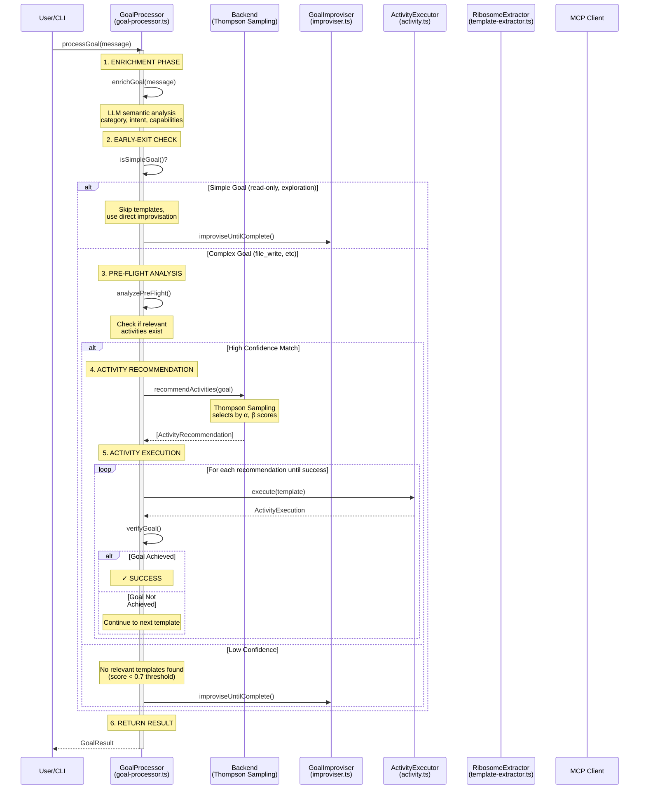
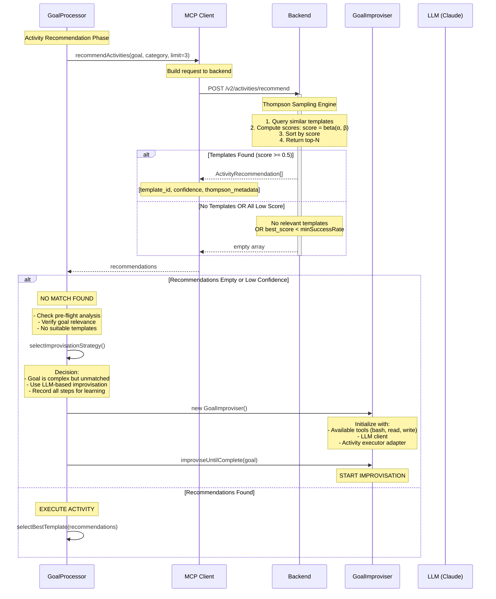
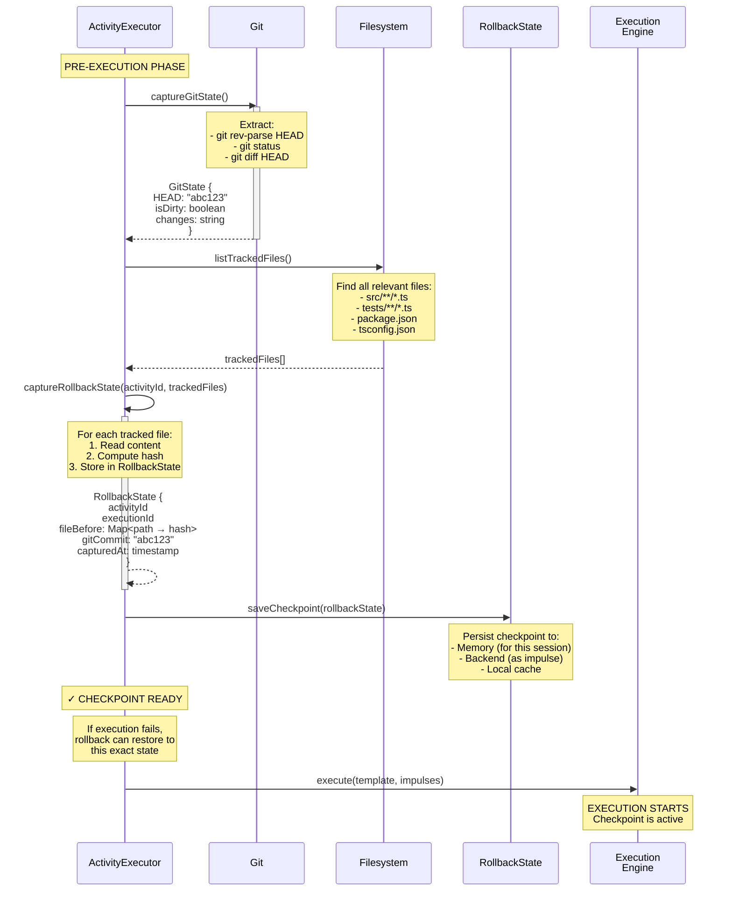
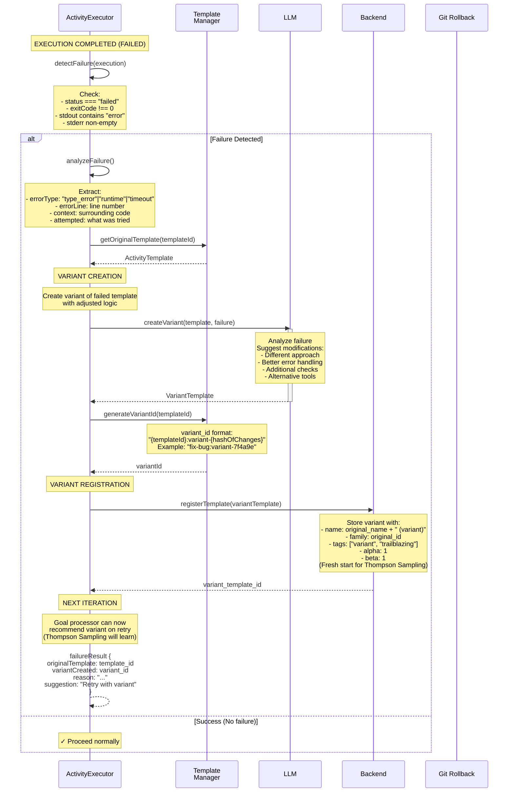
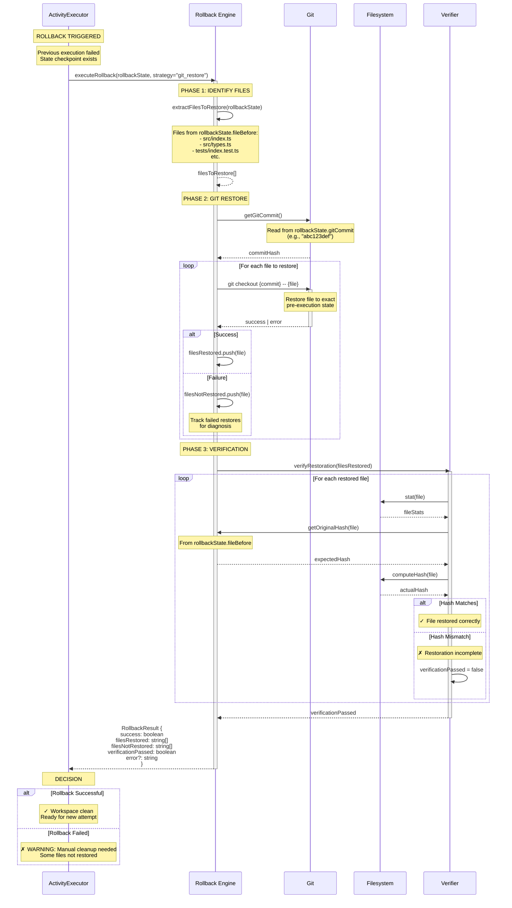
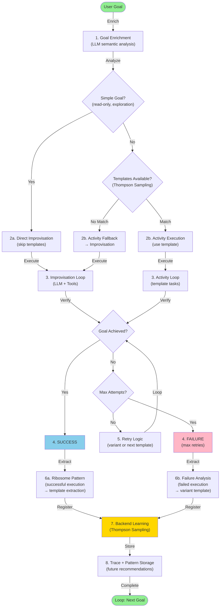

# Improvisation, Trailblazing, Checkpoints, and Rollbacks

## Overview

This document maps the complete flow of how MiniBob handles situations when no activity template matches (improvisation), learns from failures (trailblazing), and manages execution safety (checkpoints and rollbacks). These mechanisms enable continuous learning and autonomous adaptation.

## Key Concepts

1. **Improvisation** - LLM-directed tool use when no template matches the goal
2. **Trailblazing** - Creating variant templates from failed executions
3. **Checkpoints** - Git state capture before execution for rollback capability
4. **Rollbacks** - Restoring pre-execution state after failures
5. **Ribosome Pattern** - Extracting successful improvisation into reusable templates
6. **Thompson Sampling Learning** - Updating α/β scores based on execution outcomes
7. **Stuck Detection** - Identifying when improvisation is making no progress

## Main Sequence Diagram: Goal Processing with Fallback



**Implementation:** `repos/minibob/src/goal-processor.ts:650-6800+`

## Decomposition: Activity Matching Failure → Improvisation



**Failure Reasons Triggering Improvisation:**
- `recommendations.length === 0`
- `bestScore < RELEVANCE_THRESHOLD (0.7)`
- `bestScore < minSuccessRate (0.5)`
- Backend unavailable → fallback to local goal resolver

## Decomposition: LLM-Based Improvisation Loop

```mermaid
sequenceDiagram
    participant Impr as GoalImproviser
    participant LLM as LLM (Claude)
    participant Tools as Tool Handlers<br/>(bash, read, write, etc)
    participant FS as Filesystem
    participant State as State Tracker<br/>(impulses_loaded,<br/>impulses_created)

    Impr->>Impr: resetImpulseTracking()
    Note over Impr: Clear impulse state

    Impr->>Impr: captureStateSnapshot()
    Note over Impr: Capture pre-improvisation state:<br/>- File metadata<br/>- Git HEAD<br/>- Working directory structure

    loop For each step (max 50)
        Note over Impr: STEP N: Tool Selection & Execution

        Impr->>LLM: sendMessage(goal, context, tools_list)
        Note over LLM: Available tools:<br/>- bash: Run commands<br/>- read: Read files<br/>- write: Create files<br/>- edit: Modify files<br/>- glob: Find files<br/>- grep: Search content<br/>- activity: Call other activities

        activate LLM
        LLM->>LLM: reason(goal, context)
        Note over LLM: Step {n}:<br/>Thought: "..."<br/>Action: tool_name<br/>Parameters: {...}
        LLM-->>Impr: ToolCall
        deactivate LLM

        Impr->>Impr: recordThought(thought)
        Note over Impr: impulses_loaded,<br/>impulses_created tracking

        Impr->>Tools: execute(action, params)
        activate Tools

        alt action === "read"
            Tools->>FS: readFile(path)
            FS-->>Tools: content
            Tools->>State: recordImpulseLoad(path, "source_code")
            Note over State: Track shape + tokens
        else action === "write"
            Tools->>FS: writeFile(path, content)
            FS-->>Tools: success
            Tools->>State: recordImpulseCreate(path, inferred_shape)
            Note over State: Infer shape from filename
        else action === "bash"
            Tools->>FS: execSync(command)
            FS-->>Tools: stdout, stderr
            Tools->>State: recordImpulseLoad(pattern, "bash_output")
        else action === "activity"
            Tools->>Tools: loadActivityTemplate(id)
            Tools->>Tools: executor.execute(template)
            Note over Tools: Nested activity execution
        end

        Tools-->>Impr: ToolResult
        deactivate Tools

        Impr->>Impr: recordStep({<br/>  step: n<br/>  thought: "..."<br/>  action: "..."<br/>  result: {...}<br/>  duration_ms<br/>  cost_estimate<br/>  expected_output_shape<br/>  step_purpose<br/>})

        Impr->>LLM: sendToolResult(result)
        Note over LLM: Feedback to LLM

        Impr->>Impr: verifyGoalAchieved(goal)?
        alt Goal Achieved
            Note over Impr: ✓ Break loop
            break Goal Complete
        else Stuck Detection
            Impr->>Impr: isStuck()
            Note over Impr: Same action repeated 3x?
            alt Stuck
                Note over Impr: ✗ Break loop
                break Exit: Stuck
            end
        else Max Steps Reached
            alt steps >= maxSteps
                Note over Impr: ✗ Break loop
                break Exit: Max steps
            end
        end
    end

    Note over Impr: OUTCOME COMPUTATION
    Impr->>Impr: computeOutcome()
    Note over Impr: status: "success"|"failure"|"stuck"<br/>goal_achieved: boolean<br/>total_duration_ms<br/>total_cost<br/>total_tokens<br/>files_modified<br/>files_created<br/>files_deleted<br/>error?

    Impr->>Impr: computeStateDelta(before, after)
    Note over Impr: Files changed?<br/>Git commit changes?<br/>State transition metadata
```

**Implementation:** `repos/minibob/src/improviser.ts:125-1650+`

**Key Mechanisms:**
1. **Impulse Tracking** (lines 256-299): Every read/write tracked with shape inference
2. **State Snapshot** (lines 401-489): Captures pre-improvisation state
3. **Step Limits** (line 90): maxSteps=50 prevents infinite loops
4. **Stuck Detection** (line 90): Repeated actions detected
5. **Shape Inference** (line 1647): inferShapeFromPath() for output shapes

## Decomposition: Checkpoint Creation Before Execution



**Checkpoint Structure:**
```typescript
{
  activityId: string
  executionId: string
  fileBefore: Map<string, string>  // path → hash
  workingDirectory: string
  gitCommit?: string
  capturedAt: number
}
```

**Implementation:** `repos/minibob/src/rollback.ts:79-250+`

## Decomposition: Trailblazing (Failure → Variant Creation)



**Trailblazing Decision Flow:**
1. Failed execution detected
2. Failure analysis performed
3. LLM generates variant with modifications
4. Variant registered with fresh Thompson scores
5. Variant becomes available for recommendation
6. Thompson Sampling learns variant effectiveness over time

**Implementation:** `repos/minibob/src/activity.ts` (trailblazing logic)

## Decomposition: Execution Rollback (Git Restore)



**Rollback Strategies:**
- **git_restore** (primary): `git checkout {commit} -- {file}`
- **file_restore** (fallback): Direct file content restoration from captured state

**Implementation:** `repos/minibob/src/rollback.ts:79-250+`

## Decomposition: Ribosome Pattern (Success → Template Extraction)

```mermaid
sequenceDiagram
    participant Impr as GoalImproviser
    participant TE as TemplateExtractor
    participant Analyzer as RibosomeQuality
    participant BE as Backend
    participant MCP as MCP Client

    Note over Impr: IMPROVISATION COMPLETED (SUCCESS)

    Impr->>Analyzer: shouldExtractTemplate(execution)
    activate Analyzer
    Note over Analyzer: Check criteria:<br/>1. status === "completed"<br/>2. tasks.length >= 2<br/>3. cost < $1.00<br/>4. impulses <= 10<br/>5. depth === 0
    alt Criteria Met
        Analyzer-->>Impr: true
    else Criteria Not Met
        Note over Analyzer: ✗ Skip extraction
        Analyzer-->>Impr: false
    end
    deactivate Analyzer

    alt Extract Template
        Note over TE: PHASE 1: IDENTIFY TASKS

        TE->>TE: identifyTaskBoundaries(steps)
        Note over TE: Group steps into logical tasks:<br/>1. Read & analyze (steps 1-3)<br/>2. Modify files (steps 4-6)<br/>3. Validate (step 7)<br/><br/>Boundaries on:<br/>- Action changes (read → write)<br/>- File changes<br/>- Group size >= 5
        TE-->>TE: taskGroups[][]

        Note over TE: PHASE 2: EXTRACT SCHEMAS

        TE->>TE: extractInputSchema(trace)
        Note over TE: From impulses_loaded:<br/>- Shape names (source_code, config, etc)<br/>- Format requirements<br/>- Budget estimates
        TE-->>TE: InputSchema {<br/>  required: [{shape}]<br/>  optional: [{shape}]<br/>}

        TE->>TE: extractOutputSchema(trace)
        Note over TE: From impulses_created:<br/>- What shapes were produced<br/>- Success indicators
        TE-->>TE: OutputSchema {<br/>  produces: [{shape}]<br/>}

        Note over TE: PHASE 3: BUILD TEMPLATE

        loop For each task group
            TE->>TE: summarizeTaskGroup(group)
            Note over TE: Create description from<br/>- First step's thought<br/>- Action patterns<br/>- Purpose inference
            TE-->>TE: taskDescription

            TE->>TE: extractPromptPattern(group)
            Note over TE: Convert steps into<br/>reusable LLM prompt template<br/>with {{variables}}
            TE-->>TE: promptTemplate

            TE->>TE: identifyVariables(group)
            Note over TE: Find parameterizable values:<br/>- File paths<br/>- Patterns<br/>- Thresholds
            TE-->>TE: Variable[]
        end

        TE->>TE: assembleTemplate(tasks, schemas)
        Note over TE: Create ActivityTemplate:<br/>1. name from goal<br/>2. category from outcome<br/>3. tasks with descriptions<br/>4. inputSchema<br/>5. outputSchema<br/>6. metadata<br/>   - sourceExecutionId<br/>   - author: "ribosome"<br/>   - createdAt<br/>   - inputSchemaInferredFrom

        TE-->>TE: ActivityTemplate

        Note over TE: PHASE 4: VALIDATION

        TE->>TE: assertValidTemplate(template)
        Note over TE: Verify:<br/>- All fields present<br/>- camelCase (no snake_case)<br/>- Task IDs unique<br/>- Schema shapes valid

        Note over TE: PHASE 5: REGISTER

        TE->>MCP: registerTemplate(template)
        activate MCP
        MCP->>BE: POST /v2/activities/templates
        activate BE

        Note over BE: 1. Validate template<br/>2. Generate template_id<br/>3. Store in SurrealDB<br/>4. Initialize Thompson params:<br/>   alpha = 1<br/>   beta = 1<br/>   successRate = 0

        BE-->>MCP: registered_template_id
        deactivate BE
        deactivate MCP

        Note over TE: ✓ TEMPLATE REGISTERED
        Note over TE: Can now be recommended<br/>via Thompson Sampling
    end

    Note over Impr: LEARNING FEEDBACK
    Note over Impr: - Execution trace stored<br/>- New template available<br/>- Thompson Sampling learns<br/>- Pattern documented
```



**Ribosome Extraction Criteria:**
- Status: `completed` (successful execution)
- Minimum complexity: `tasks >= 2`
- Maximum cost: `< $1.00`
- Impulse count: `<= 10`
- Depth: `0` (top-level, not nested)

**Extracted Template Structure:**
```typescript
{
  id: "tpl_{timestamp}_{randomId}"
  name: Capitalized goal
  category: Inferred from goal/outcome
  tasks: [{ id, description, prompt, validation }]
  inputSchema: { required, optional }
  outputSchema: { produces }
  metadata: {
    generatedFrom: "execution"
    sourceExecutionId: trace.execution_id
    author: "ribosome"
    inputSchemaInferredFrom: {
      executionId
      confidence
      impulseCount
    }
  }
}
```

**Implementation:** `repos/minibob/src/template-extractor.ts:24-400+`

## Complete Learning Loop Diagram



## The Three Main Pathways

| Pathway | Trigger | Mechanism | Outcome |
|---------|---------|-----------|---------|
| **Activity Execution** | Template match (score >= 0.7) | Execute template tasks with LLM reasoning | Execution trace + metrics |
| **Improvisation (Goal Achieved)** | No template match OR simple goal | LLM-directed tool use (bash, read, write, edit) | Improvisation trace + extracted template (Ribosome) |
| **Improvisation (Goal Failed)** | Max attempts/cost exceeded | Analyze failure + create variant template | Failure analysis + variant registered for learning |

## Key Configuration

| Variable | Default | Purpose |
|----------|---------|---------|
| `RELEVANCE_THRESHOLD` | 0.7 | Minimum score to use template |
| `MAX_IMPROVISATION_STEPS` | 50 | Step limit for improvisation loop |
| `MAX_IMPROVISATION_COST` | $5.00 | Cost limit for improvisation |
| `RIBOSOME_MIN_TASKS` | 2 | Minimum tasks for template extraction |
| `RIBOSOME_MAX_COST` | $1.00 | Maximum cost for template extraction |
| `RIBOSOME_MAX_IMPULSES` | 10 | Maximum impulses for extraction |

## File References

| Component | File | Lines | Purpose |
|-----------|------|-------|---------|
| Goal Processor | `repos/minibob/src/goal-processor.ts` | 650-6800+ | Complete goal processing flow |
| Improvisation | `repos/minibob/src/improviser.ts` | 125-1650+ | LLM-based improvisation loop |
| Template Extraction | `repos/minibob/src/template-extractor.ts` | 24-400+ | Ribosome pattern extraction |
| Rollback | `repos/minibob/src/rollback.ts` | 79-250+ | Checkpoint and restore |
| Checkpoint | `repos/minibob/src/activity.ts` | 455-610+ | Git state capture |
| Ribosome Quality | `repos/minibob/src/ribosome-quality.ts` | 103-142+ | Template extraction criteria |

## Related Documentation

- [Activity Selection](./01-activity-selection.md) - How templates are recommended
- [Impulse Resolution](./02-impulse-resolution.md) - Data loading during execution
- [Resolver Processing](./03-resolver-processing.md) - Tool execution mechanics
- [IMPULSE_ACTIVITY_FOUNDATION.md](../IMPULSE_ACTIVITY_FOUNDATION.md) - Foundational model

---

**Last Updated:** 2026-04-16
