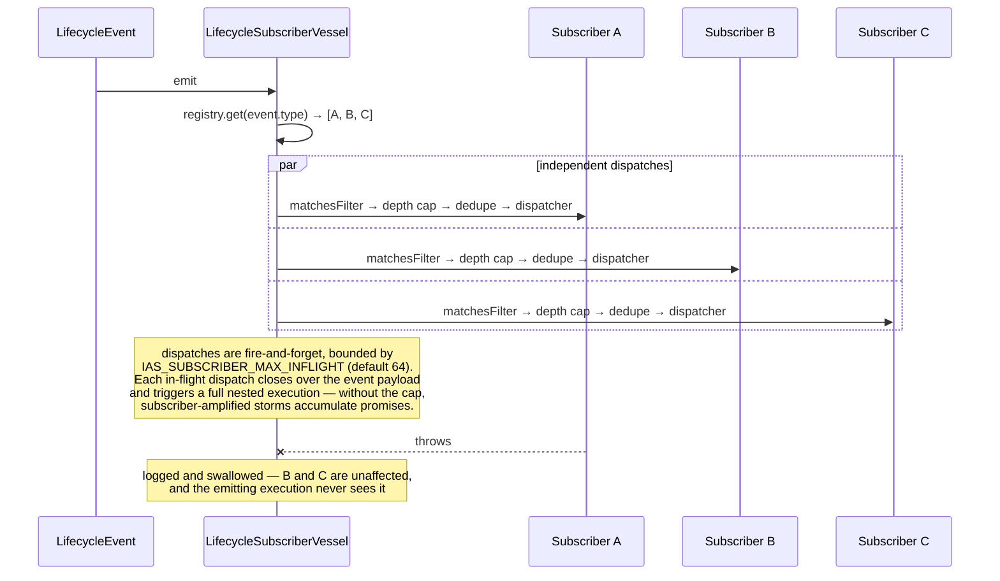
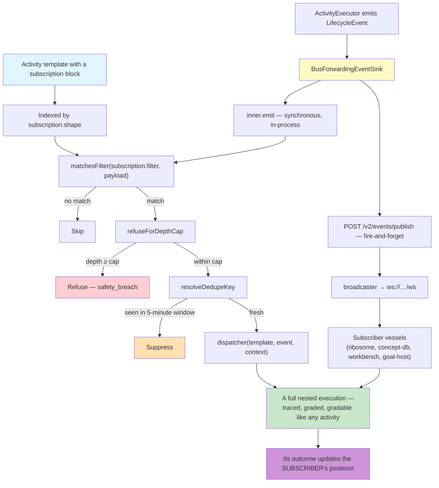

# Hook Registration and Behavior Injection

> **How to read this.** "Hook" here means **lifecycle subscription**. The engine
> emits lifecycle events, `BusForwardingEventSink` forwards them to
> `activity-api`'s bus (`POST /v2/events/publish`, broadcast over `ws://…/ws`),
> and any vessel can subscribe. The in-process form of the same mechanism is
> `LifecycleSubscriberVessel`, which matches subscriber templates against events
> and dispatches them. There is no per-session registry of callback functions —
> a subscription is a declaration on an activity template. Cite by symbol, never
> by line number.

## Overview

This document maps how behaviour is attached to lifecycle points: what an activity template declares in order to be woken by an event, how an event is matched and filtered, how runaway self-triggering is prevented, and why none of this is stored as activity schema in the learning backend.

The design decision underneath is that **reactive behaviour is an activity**. A subscriber is a template with a `subscription` block, so it is selectable, gradable, composable and retirable like any other activity. A callback registered at process start would be none of those things.

## Key Concepts

1. **Subscription block** — `ActivityTemplateSubscription { shape, filter?, must_fire?, dedupe_key? }` on an activity template.
2. **Event emission** — `ActivityExecutor` emits `LifecycleEvent { type, timestamp, data }` to the runtime's `EventSink`.
3. **Bus forwarding** — `BusForwardingEventSink` calls the inner sink first, then fire-and-forget-publishes to activity-api; engine progression never blocks on bus availability.
4. **Name mapping** — `mapEventTypeToBusForm` converts colons to dots and camelCase to snake_case: `lifecycle:task:preBinding` → `lifecycle.task.pre_binding`.
5. **Structural filters** — `matchesFilter` supports `<field>_contains` and `<field>_equals`, with snake_case → camelCase tolerance via `resolvePayloadField`.
6. **Dedupe** — `resolveDedupeKey` renders a `{field}` / `{nested.field}` template against the payload; the cache window is five minutes.
7. **Depth cap** — `refuseForDepthCap` refuses a dispatch at composition depth ≥ 2 (audit-tagged templates may raise it to at most 4).
8. **Isolation** — dispatcher failures are logged and swallowed; a subscriber must never cascade into the emitting execution.

## Main Sequence Diagram: Complete Hook Lifecycle

```mermaid
sequenceDiagram
    participant Exec as ActivityExecutor
    participant Sink as BusForwardingEventSink
    participant Sub as LifecycleSubscriberVessel
    participant API as activity-api /v2/events/publish
    participant WS as WebSocket broadcaster (ws://…/ws)
    participant Vessel as Subscriber vessel<br/>(ribosome, concept-db, workbench, …)

    rect rgb(200, 220, 255)
    Note over Exec,Sub: DECLARATION (not registration)
    Sub->>Sub: register(template) — indexed by subscription.shape
    Note over Sub: the template itself declares<br/>{shape, filter?, must_fire?, dedupe_key?}
    end

    rect rgb(200, 255, 220)
    Note over Exec,Vessel: EMISSION
    Exec->>Sink: emit(LifecycleEvent {type, timestamp, data})
    Sink->>Sub: inner.emit(event) — SYNCHRONOUS, first
    Sink-->>API: POST /v2/events/publish (fire-and-forget, timeout ~2s)
    Note over Sink: no await, no retry; errors are warned only.<br/>Durable state lives in the trace store —<br/>the bus is a hot reactivity channel.
    API->>WS: broadcaster.emit
    WS-->>Vessel: event with sourceVesselId attribution
    end

    rect rgb(220, 255, 240)
    Note over Sub: IN-PROCESS MATCHING
    Sub->>Sub: registry lookup by event type
    loop each candidate subscriber template
        Sub->>Sub: matchesFilter(subscription.filter, payload)
        alt filter fails
            Note over Sub: skip
        else matches
            Sub->>Sub: refuseForDepthCap(template, payload)
            alt at or beyond the cap
                Note over Sub: refuse — recorded as safety_breach
            else within the cap
                Sub->>Sub: resolveDedupeKey(template, payload)
                alt seen within the 5-minute window
                    Note over Sub: suppress
                else fresh
                    Sub->>Sub: dispatcher(template, event, {lifecycleShape, payload})
                    Note over Sub: fire-and-forget, bounded by<br/>IAS_SUBSCRIBER_MAX_INFLIGHT (default 64)
                end
            end
        end
    end
    Sub->>Sub: downstreamSink?.emit(event) — after dispatch
    end

    rect rgb(255, 240, 220)
    Note over Vessel: REACTION
    Vessel->>Vessel: apply its own gate<br/>(e.g. ribosome: reached AND all tasks terminal-and-successful)
    Vessel->>Vessel: dispatch work through the normal goal path
    end
```

## Decomposition: Hook Registration Flow

Registration is a template declaration, not a function call at startup. A subscriber template carries a `subscription` block, and the vessel indexes it by `subscription.shape` for O(1) lookup when an event of that type arrives.

```mermaid
sequenceDiagram
    participant Author as Template author / ribosome
    participant Store as Template store
    participant Sub as LifecycleSubscriberVessel
    participant Reg as registry: Map<shape, ActivityTemplate[]>

    Author->>Store: template with subscription {shape, filter?, dedupe_key?}
    Store-->>Sub: template loaded by the host
    Sub->>Reg: register(template) under subscription.shape
    Note over Reg: several templates may share a shape;<br/>each is matched independently at emit time
```

Because the subscription lives on the template, everything that applies to an activity applies to a subscriber: it can be selected, graded by its executions, superseded by a variant, or retired. A subscriber that never fires usefully loses its posterior the same way any other activity does.

**Implementation:** `ActivityTemplateSubscription` in `repos/ias-executor-ts/src/ontology.ts`; `LifecycleSubscriberVessel.register` and its `registry` map in `src/lifecycle-subscriber.ts`.

## Decomposition: Activity Lifecycle Hooks

The engine's built-in event vocabulary is open-ended: `LifecycleEventType` names the built-ins and then widens to any string, so a template may subscribe to an event the engine did not enumerate.

**Built-in types emitted by the engine:**

| Event | Meaning |
|---|---|
| `activity.started` | An activity execution began |
| `task.started` | A task began |
| `task.completed` | A task finished (success carried in the payload) |
| `activity.completed` | An activity execution finished successfully |
| `activity.failed` | An activity execution failed |
| `impulse.created` | An impulse was created |
| `impulse.loaded` | An impulse was loaded |
| `lifecycle.emitted` | A lifecycle event was emitted |

**Colon-form shapes subscribers use**, forwarded to the bus in dotted snake_case:

| Subscription shape | Bus form |
|---|---|
| `lifecycle:task:preBinding` | `lifecycle.task.pre_binding` |
| `lifecycle:task:started` | `lifecycle.task.started` |
| `lifecycle:task:completed` | `lifecycle.task.completed` |
| `lifecycle:execution:succeeded` | `lifecycle.execution.succeeded` |
| `lifecycle:execution:tick` | `lifecycle.execution.tick` |
| `lifecycle:activity:postExecution` | `lifecycle.activity.post_execution` |
| `lifecycle:gap:classified` | `lifecycle.gap.classified` |
| `lifecycle:llm:dispatched` | `lifecycle.llm.dispatched` |

`lifecycle:llm:dispatched` is emitted by the `llm-prompt` resolver *before* the model call, which is what lets an audit subscriber see the dispatch without log archaeology. `ribosome-extract` subscribes to `lifecycle:activity:postExecution`.

**Implementation:** `LifecycleEventType` and `LifecycleEvent` in `repos/ias-executor-ts/src/ontology.ts`; `mapEventTypeToBusForm` and `BusForwardingEventSink` in `src/adapters/bus-forwarder.ts`.

## Decomposition: Vessel Hooks (State-Based Injection)

Conditional reaction is expressed as a **structural filter on the event payload**, evaluated by `matchesFilter` before any dispatch. Two suffix predicates are supported and an unknown suffix falls through to plain deep equality on the literal key, so a filter the author intended as a key is never silently dropped.

```typescript
// Fire only when the execution produced a test_report
subscription: {
  shape: "lifecycle:execution:succeeded",
  filter: { output_shapes_contains: "test_report" }
}

// Fire only on an exact field value
subscription: {
  shape: "lifecycle:gap:classified",
  filter: { category_equals: "reachability" }
}
```

| Predicate | Semantics |
|---|---|
| `<field>_contains` | The payload field must be an **array** containing an element that deep-equals the expected value |
| `<field>_equals` | The payload field must deep-equal the expected value |
| bare `<field>` | Plain deep equality against the field of that literal name |

`resolvePayloadField` tolerates the naming mismatch between spec authors and emitters: it tries the literal key first, then a snake_case → camelCase fallback, so `output_shapes_contains` matches an emitted `outputShapes` array. This is why a filter written in the SQL/JSON convention works against a payload written in the JavaScript convention.

**Implementation:** `matchesFilter`, `resolvePayloadField`, `deepEquals` in `repos/ias-executor-ts/src/lifecycle-subscriber.ts`.

## Decomposition: Impulse Lifecycle Hooks

Impulse-level reaction uses the same mechanism, subscribing to `impulse.created` or `impulse.loaded` and filtering on the payload. There is no separate verification-hook registry; a template that wants to check something about impulses subscribes and runs its checks as ordinary tasks.

The reason to express verification this way rather than as an inline callback is that a verification result then becomes a trace. A subscriber that emits a `verifier_negative` failure mode grades the posterior of whatever it verified; an inline callback that logged a warning would grade nothing.

Two related mechanisms are worth naming here because they carry impulse state without a hook:

- **Shape lifecycle classification.** `classifyShape` labels a shape as `ephemeral`, `durable`, `terminal` or `stream`, which is what tells a consumer whether an impulse of that shape is worth persisting or reacting to at all.
- **Task-level attribution.** `filesModified`, `filesCreated` and `materialsConsulted` on each `ExecutionTaskRecord` capture what an execution touched, so "what did this impulse cause" is answerable from the trace rather than from a hook that happened to be installed.

**Implementation:** `classifyShape` and `ShapeLifecycleClass` in `repos/ias-executor-ts/src/shape-lifecycle.ts`; `ExecutionTaskRecord` in `src/ontology.ts`.

## Decomposition: Hook Chain Execution (Multiple Hooks)

Several templates may subscribe to the same shape. Each is matched and dispatched independently — there is no accumulation of results between them and no ordering guarantee they can rely on.



**Winnowing.** `defaultTopKForShape` returns `HIGH_FREQUENCY_TOP_K` (1) for shapes in `HIGH_FREQUENCY_SHAPES` — `lifecycle:task:completed`, `lifecycle:task:started`, `lifecycle:execution:tick`, `task.completed`, `task.started` — and `ONE_SHOT_TOP_K` (3) otherwise. `must_fire` on a subscription declares an intent to bypass winnowing.

**Isolation is a contract, not a courtesy.** Every matched, non-deduped, non-depth-capped subscriber must eventually be dispatched or suppressed, and a dispatcher error must not cascade to the emitting execution. That is what keeps a badly-written subscriber from taking down the run that woke it.

## Decomposition: Promotion Hooks

There is no promotion-hook registry. Template promotion happens through two mechanisms, both driven by evidence rather than by a callback.

**Extraction promotion.** `ribosome-vessel` observes `execution_completed` on the bus, applies its gate — reached, every task terminal and successful, producer not in the ribosome family, not already dispatched — and dispatches the `ribosome-extract` activity. That activity assesses quality, synthesises, validates, and only then attempts the write. `mintReachedTrace` in goal-host-vessel is the direct trigger for the same activity on a reached walk.

**Performance promotion and retirement.** After an execution is recorded, activity-api runs `autoCreateVariantIfNeeded` and `checkAndRetireTemplate` against observed history: a variant is proposed after three consecutive failures, and a template is retired only after twenty executions at a success rate below 30%. `POST /v2/activities/templates/auto-promote` and `POST /v2/activities/templates/:templateId/promote` are the explicit promotion surfaces, with `GET /v2/activities/promote-gate/stats` reporting how the gate is behaving.

Neither path is a hook in the callback sense, and that is the point: promotion driven by a registered function would be invisible to the learning loop, whereas promotion driven by recorded outcomes is itself auditable.

## Behavior Modification Through Hooks



The bottom of that graph is the whole argument for this design. A subscriber dispatch is a real execution, so it produces a trace, a failure mode when it fails, and a posterior update — which means a reactive behaviour that stops earning its keep can be observed doing so.

## Hook Types and Trigger Points

| Subscription shape | Fires when | Typical reaction | Frequency class |
|---|---|---|---|
| `lifecycle:task:preBinding` | Before a task's inputs are bound | Slot binding — supply a missing shape | high |
| `lifecycle:task:started` | A task begins | Observation, tracing | high (top-K 1) |
| `lifecycle:task:completed` | A task finishes | Validator dispatch, progress tracking | high (top-K 1) |
| `lifecycle:execution:tick` | Periodic progress signal | Liveness, long-run monitoring | high (top-K 1) |
| `lifecycle:execution:succeeded` | An execution completed successfully | Audit of a produced report, extraction candidacy | one-shot (top-K 3) |
| `lifecycle:activity:postExecution` | After an activity execution | `ribosome-extract` | one-shot |
| `lifecycle:gap:classified` | A gap has been classified | Gap routing, repair goal generation | one-shot |
| `lifecycle:llm:dispatched` | Immediately before a model call | Dispatch audit without log archaeology | one-shot |
| `impulse.created` / `impulse.loaded` | Impulse lifecycle | Impulse-level checks | varies |
| `activity.failed` | An execution failed | Failure analysis, gap filing | one-shot |

Discovery-vessel publishes on the same bus — `vessel.registered`, `vessel.heartbeat`, `vessel.deregistered`, `vessel.expired` — which is how `startVesselRegistrationSubscriber` in goal-host-vessel adds a proxy resolver for a newly-appeared vessel without a restart.

## Hook Condition Evaluation

Whether a subscriber fires is decided by three independent gates, evaluated in order at the reacting vessel: does this event structurally match what the subscriber asked for, would firing deepen a composition chain past its cap, and has this same logical event already been handled inside the dedupe window. Each gate answers a different question, and conflating them would make the wrong refusal indistinguishable from the right one.

The gates are deliberately cheap and local. None of them consults the backend, so a subscriber's decision to fire never depends on a network round trip, and a backend outage cannot silently suppress reactions.

### VesselHook Conditions

The condition surface is the subscription block. There is no separate hook object with `requiredShapes` and a custom predicate; the equivalent expressiveness lives in the filter.

```typescript
interface ActivityTemplateSubscription {
  /** Lifecycle event type to subscribe to, e.g. "lifecycle:task:preBinding". */
  shape: string;
  /** Structural filter; supports `_contains` / `_equals` suffix predicates. */
  filter?: Record<string, unknown>;
  /** Declares an intent to bypass top-K winnowing. */
  must_fire?: boolean;
  /** Dedupe-key template; `{field}` and `{nested.field}` resolve against the payload. */
  dedupe_key?: string;
}
```

A dedupe key may also live on the template itself as `ActivityTemplate.dedupe_key`; `resolveDedupeKey` prefers the template-level key and falls back to the subscription-level one.

### Evaluation Flow

Three gates run in order, and each is a distinct kind of refusal:

```
1. matchesFilter(subscription.filter, payload)
     → structural mismatch: this event is not for this subscriber

2. refuseForDepthCap(template, payload)
     cap = min(metadata.auditDepthCap ?? 2, 4)
     parentDepth = payload.parentDepth
                ?? payload.compositionChain.length
                ?? payload.composition_chain.length
                ?? 0
     → parentDepth >= cap: refuse, recorded as safety_breach

3. resolveDedupeKey(template, payload)
     key = "{templateId}::{renderedKey}"
     → seen within 5 minutes: suppress
```

The depth cap applies to **all** subscriber templates, not only audit-tagged ones, and that generality is load-bearing. A self-subscription guard only catches same-template recursion; it does not catch mutual recursion across a subscriber pair — one template subscribing to `preBinding` and emitting more `preBinding` events, another subscribing to `completed` and emitting more `completed` events. A universal cap is the simplest correct guard against that cycle.

A dedupe placeholder whose field is missing collapses to the **literal placeholder text**, deliberately, so two unrelated events do not merge onto an empty key.

## Caching Strategy

There is exactly one cache in this mechanism, and it exists to suppress duplicate work rather than to reuse results. Deduplication keys a recent-dispatch record by template plus a rendered key drawn from the event payload, so a replayed or repeated event does not multiply downstream executions within a short window.

Nothing else about subscriber behaviour is cached. Caching a subscriber's output would break attribution — the second occurrence would be credited with the first occurrence's work — and caching a filter decision would freeze a condition that is supposed to be evaluated against each event on its own terms.

### Cache Entry Structure

The only cache in this mechanism is the dedupe cache, and it is per-process and keyed by template plus rendered key:

```typescript
// key: `${templateId}::${resolvedDedupeKey}`
// value: timestamp of the last dispatch
dedupeCache: Map<string, number>
```

The window defaults to five minutes and is overridable through `dedupeWindowMs` on `LifecycleSubscriberVesselOptions`, which exists so tests can fast-forward it rather than sleep.

There is no result cache for subscriber output. A subscriber's product is an execution and its trace, and caching a trace would break attribution: the second occurrence would be credited to the first occurrence's work.

### Cache Logic

```
onEvent(template, payload):
    key = resolveDedupeKey(template, payload)
    if key is null:                    dispatch          # no dedupe declared
    full = `${template.id}::${key}`
    last = dedupeCache.get(full)
    if last and now - last < dedupeWindowMs:  suppress
    dedupeCache.set(full, now)
    dispatch
```

Endpoint caching elsewhere in the fleet follows the same shape — `shapeEndpointMap` in goal-host-vessel caches a resolved producer endpoint so the steady state is one hop — but that is a routing cache, not a behavioural one, and it is invalidated by re-resolution rather than by TTL alone.

## Hook Behavior Modification Capabilities

A subscriber changes system behaviour in four ways, and all four are mediated by impulses and executions rather than by direct access to the emitting run. It can add to the pool before a task binds its inputs, it can refuse a dispatch that would deepen a chain too far, it can produce its own outputs, and it can record state by emitting a shaped impulse.

What it deliberately cannot do is reach into the execution that woke it — no cancelling, no rewriting outputs, no mutating in-process state invisibly. Every one of the four capabilities below leaves a trace, which is what keeps reactive behaviour gradable instead of merely present.

### 1. Input Modification

A `lifecycle:task:preBinding` subscriber runs before a task's inputs are bound, which is the point at which a missing shape can still be supplied. Slot binding is the canonical case: the subscriber synthesises or selects an impulse of the needed shape and puts it in the pool, and the waiting task then binds it normally. Because the subscriber is an activity, what it supplied is visible in its own trace rather than appearing from nowhere.

### 2. Execution Control

Control is exercised by refusal, not by interception. `refuseForDepthCap` refuses a dispatch that would deepen a composition chain past its cap, and the engine's own guards refuse a `compose` dispatch that would exceed the depth limit or close a cycle. Both are recorded as `safety_breach`, so a capped run is distinguishable from one that genuinely failed. A subscriber cannot cancel or rewrite the execution that woke it.

### 3. Output Modification

A subscriber does not edit the emitting execution's output; it produces its own. `ribosome-extract` reads a reached trace and emits `extractedTemplate`, `validation_result`, `writeAttempt`, `activityTemplate` and `learningSummary` — new impulses in the pool, attributable to the extraction run. Audit subscribers work the same way, emitting a report shape rather than annotating the thing they audited.

### 4. State Manipulation

State changes are impulses, and impulses come from executions. A subscriber that needs to record something emits a shaped impulse through the normal write path, which means the change is traced, gradable, and visible to anything else subscribing on that shape. There is no side-channel by which a subscriber mutates in-process state that the trace would not show.

## Implementation Patterns

Five patterns recur across every subscriber in the fleet. They are worth reading as a checklist when adding one, because each encodes a failure that has to be designed out rather than handled after the fact: an unbounded dispatch fan-out, a blocking publish, a filter that silently never matches, a recursion cycle across a subscriber pair, and an event replay that multiplies work.

None of the five requires backend support. A subscriber that follows them is correct on its own, which is what makes adding one a local change rather than a fleet-wide one.

### 1. Hook Registration (Setup)

- **Declaration over registration.** A subscriber is an activity template with a `subscription` block; there is no imperative registration step at process start.
- **Shape-indexed lookup.** The vessel keeps `Map<shape, ActivityTemplate[]>` so matching is O(1) in the number of distinct shapes.
- **Many per shape.** Several templates may subscribe to the same shape; each is evaluated independently.
- **Host-chosen execution.** The vessel takes a `SubscriberDispatcher` rather than running an executor itself, so a host can run subscribers in-process, queued, or remotely.

### 2. Hook Execution (Invocation)

- **Inner sink first, synchronously.** The in-process sink is called before any bus publish, so in-process subscribers are never behind the network.
- **Fire-and-forget forwarding.** The bus publish is not awaited and not retried; a bus outage degrades reactivity, not execution.
- **Bounded concurrency.** `IAS_SUBSCRIBER_MAX_INFLIGHT` (default 64) caps in-flight dispatches, because each closes over an event payload and triggers a full nested execution.
- **Errors isolated.** Dispatcher failures are logged and swallowed by the vessel.

### 3. Behavior Injection

- **Filters, not predicates.** Conditions are structural filters over the payload, evaluated by `matchesFilter` with `_contains` / `_equals` suffixes.
- **Naming tolerance.** `resolvePayloadField` bridges snake_case filters and camelCase payloads.
- **Injection is emission.** A subscriber influences the system by producing impulses, which is what makes the influence traceable.

### 4. Hook Chaining

- **No result accumulation.** Subscribers do not see each other's output; chaining happens through the impulse pool and through further events, both of which are recorded.
- **Depth-capped.** Chains of subscriber dispatches are capped universally, defending against mutual recursion across subscriber pairs.
- **Deduped.** A rendered dedupe key suppresses a repeat within five minutes, so an event replay does not multiply work.

### 5. Lifecycle Coordination

- **Downstream sink.** `downstreamSink` receives every event *after* subscriber dispatch, so a host can compose the subscriber vessel with a logger or forwarder without losing observability.
- **Attribution.** Every published event carries `sourceVesselId`, so a subscriber can tell which vessel emitted what.
- **Replay tolerance.** Subscribers that must act at most once per execution mark dispatch explicitly, as `ribosome-vessel` does, rather than relying on the bus to deliver exactly once.

## File References

| Component | Location | Entry symbols |
|---|---|---|
| Subscription contract | `repos/ias-executor-ts/src/ontology.ts` | `ActivityTemplateSubscription`, `LifecycleEvent`, `LifecycleEventType` |
| Subscriber vessel | `repos/ias-executor-ts/src/lifecycle-subscriber.ts` | `LifecycleSubscriberVessel`, `SubscriberDispatcher`, `LifecycleSubscriberVesselOptions` |
| Matching | `repos/ias-executor-ts/src/lifecycle-subscriber.ts` | `matchesFilter`, `resolvePayloadField`, `deepEquals` |
| Winnowing | `repos/ias-executor-ts/src/lifecycle-subscriber.ts` | `HIGH_FREQUENCY_SHAPES`, `HIGH_FREQUENCY_TOP_K`, `ONE_SHOT_TOP_K`, `defaultTopKForShape` |
| Dedupe and depth cap | `repos/ias-executor-ts/src/lifecycle-subscriber.ts` | `resolveDedupeKey`, `refuseForDepthCap` |
| Bus forwarding | `repos/ias-executor-ts/src/adapters/bus-forwarder.ts` | `BusForwardingEventSink`, `mapEventTypeToBusForm` |
| Shape lifecycle | `repos/ias-executor-ts/src/shape-lifecycle.ts` | `classifyShape`, `ShapeLifecycleClass` |
| Event sink port | `repos/ias-executor-ts/src/ports.ts` | `EventSink` |
| Bus endpoint | `repos/activity-api/src/routes/events.ts` | `POST /v2/events/publish` |
| Broadcast | `repos/activity-api/src/websocket/broadcaster.ts`, `src/index.ts` | `broadcaster`, the `/ws` upgrade handler |
| Extraction subscriber | `repos/ribosome-vessel/src/index.ts` | `onTaskCompleted`, the `execution_completed` handler, `dispatchRibosomeExtract` |
| Registration subscriber | `repos/goal-host-vessel/src/index.ts` | `startVesselRegistrationSubscriber` |
| Promotion and retirement | `repos/activity-api/src/services/variant-creator.ts`, `src/routes/activities.ts` | `autoCreateVariantIfNeeded`, `checkAndRetireTemplate`, `/templates/auto-promote`, `/templates/:templateId/promote` |
| Example subscriber templates | `repos/ias-executor-ts/src/templates/lifecycle/` | `ribosome-extract.json`, `audit-test-report.json` |

## Implementation Architecture

Reactive behaviour lives with the vessel that reacts; the bus is transport and the backend is memory. Neither the transport nor the memory owns the behaviour.

Drawing the line there has a specific consequence worth stating up front: adding a subscriber changes nothing in the emitter and nothing in the backend. A vessel loads a template that declares a subscription, connects to the bus, and starts reacting. Conversely, a misconfigured subscription can only harm the vessel that declared it, because filters, caps and dedupe are all evaluated where the reaction happens.

### Executing vessel + bus subscribers (Execution Environment)

**Responsibilities:**
- Emit lifecycle events from the engine to the runtime's `EventSink`.
- Forward events to the bus fire-and-forget, after calling the in-process sink synchronously.
- Match subscriber templates by shape and structural filter.
- Enforce the depth cap and the dedupe window before dispatch.
- Dispatch matched subscribers under a bounded in-flight cap, isolating dispatcher errors.
- Apply subscriber-specific gates — the ribosome's reached-and-all-tasks-successful check is a vessel-side gate, not a bus concern.
- Subscribe to fleet events (`vessel.registered`) to keep resolver registration current.

**What the execution environment does not do:** it does not persist subscriptions in the backend as configuration, and it does not rely on the bus for durability — durable state is the trace store.

### Activity-API (Storage & Learning Backend)

**Responsibilities:**
- Host the bus: accept `POST /v2/events/publish` and broadcast over `ws://…/ws`.
- Store the activity templates that carry subscription blocks, as ordinary templates.
- Record the executions that subscriber dispatches produce, and update their posteriors like any other activity's.

**What it does not do:** it does not evaluate filters, does not enforce depth caps, does not dedupe, and does not decide which vessel reacts to what. A subscription is behaviour declared on a template, and the matching happens where the reaction happens.

### SurrealDB Schema

There is no `hook` table. What persists is the template that carries the subscription and the traces its dispatches produce:

- `activity_template` — including the `subscription` block, `dedupe_key`, `tags` and `metadata.auditDepthCap`.
- `activity_execution_traces` — the executions subscriber dispatches produce, with their failure modes.
- `variant_performance_metrics` — posteriors for subscriber templates, exactly as for any other activity.

The dedupe cache is per-process and in-memory by design: it bounds duplicate work within a window, and rebuilding it on restart is cheaper and safer than persisting a suppression list that could outlive its reason.

### Correct Separation

**The reacting vessel handles:** shape-indexed subscription lookup, filter evaluation, depth-cap refusal, dedupe suppression, dispatch under a concurrency bound, error isolation, and any vessel-specific gate.

**Activity-API handles:** transport (publish and broadcast), template storage, and the posterior consequences of subscriber executions.

**Why this separation matters:**
- A new subscriber is a new template. Nothing in the emitter or the backend changes when a vessel starts observing the event stream.
- Because a subscriber is an activity, its reactions are traced and graded — a reactive behaviour that stops earning its keep is visible as such.
- Because the bus is fire-and-forget, a bus outage degrades reactivity while execution and durable state continue.
- Because filters and caps are evaluated at the reacting vessel, one vessel's misconfigured subscription cannot amplify into another's.

### Vessel vs Activity

| Aspect | Reacting vessel | Activity template |
|---|---|---|
| **What it is** | An execution environment that subscribes | A portable unit of work |
| **Scope** | This deployment, this vessel's data | Any vessel that can resolve its shapes |
| **Where the behaviour lives** | Subscription declared on a template it loads | Tasks, resolvers, declared input and output shapes |
| **Persistence** | In-memory dedupe and routing state | `activity_template` in SurrealDB |
| **Graded by** | The traces its dispatches produce | The traces its executions produce |
| **Example** | ribosome-vessel gating on reached-and-all-successful | `ribosome-extract` assessing, synthesising and writing |

The distinction that matters: a **gate** is vessel-local policy about when to react, and it can be tuned per deployment. The **reaction** is an activity, and it is portable. Collapsing the two — putting the gate inside the template, or the reaction inside the vessel — loses either the portability or the tunability.

**Key architectural point:** hooks are subscriptions, subscriptions are declarations on activities, and dispatches are executions. There is no callback layer, no hook table, and no untraced reaction path.

## Related Documentation

- [Activity Selection](./01-activity-selection.md) — how activities, including subscribers, are ranked
- [Impulse Resolution](./02-impulse-resolution.md) — how the impulses subscribers inject are resolved
- [Resolver Processing](./03-resolver-processing.md) — how a dispatched subscriber does its work
- [Improvisation & Failure Modes](./04-improvisation-failure-modes.md) — refusals, failure types, and their posterior consequences
- [IMPULSE_ACTIVITY_FOUNDATION.md](../IMPULSE_ACTIVITY_FOUNDATION.md) — the foundational model
