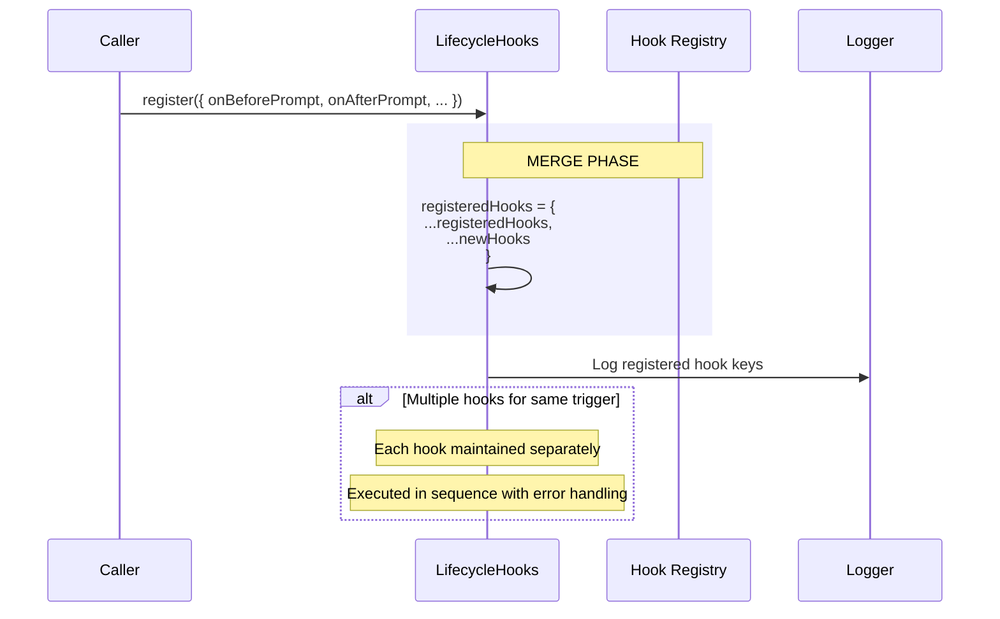
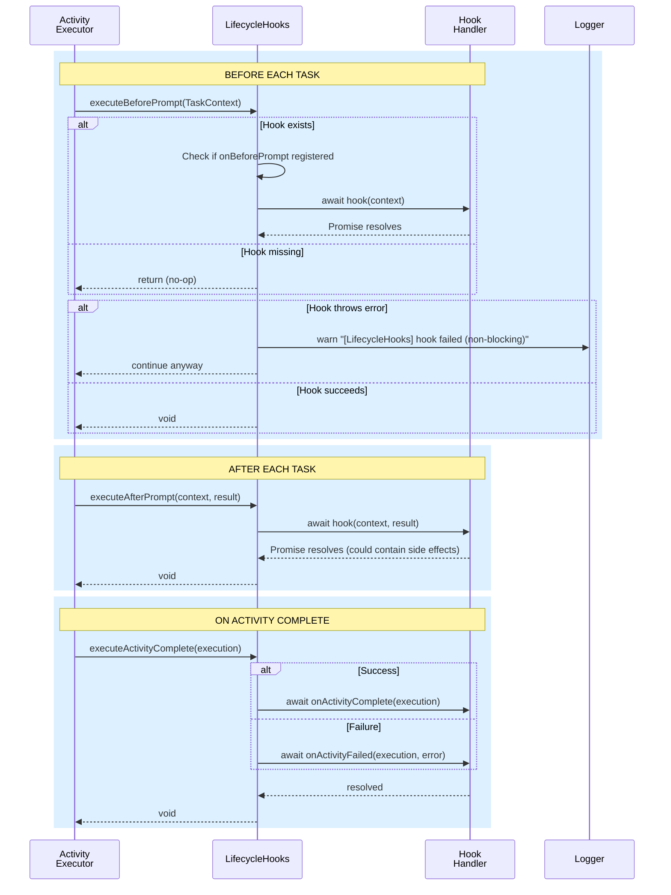
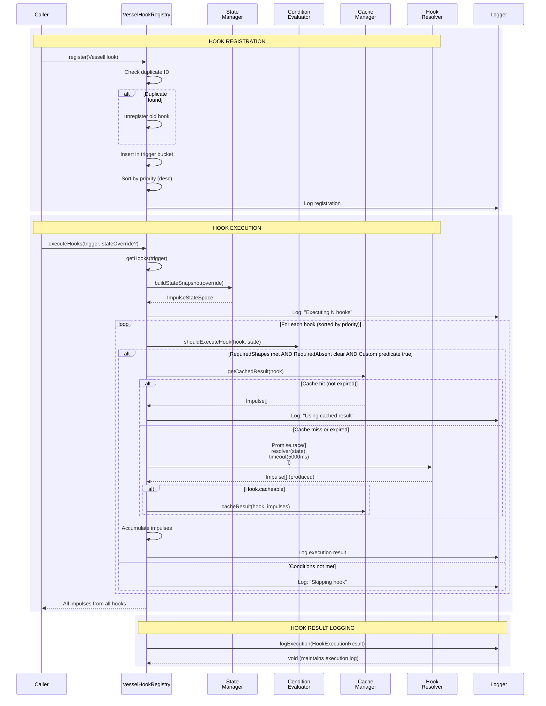
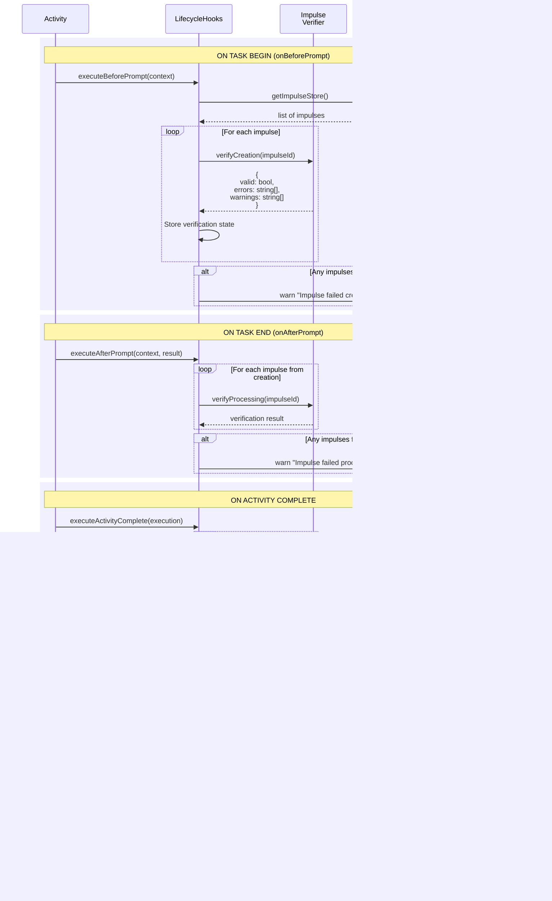
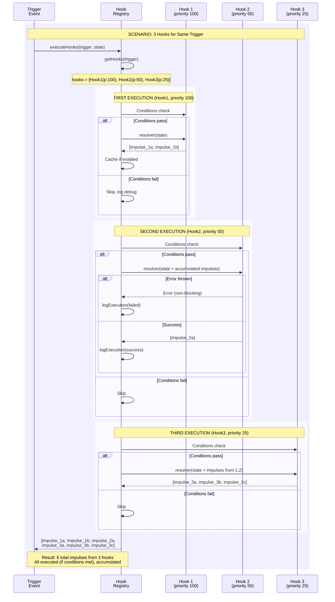
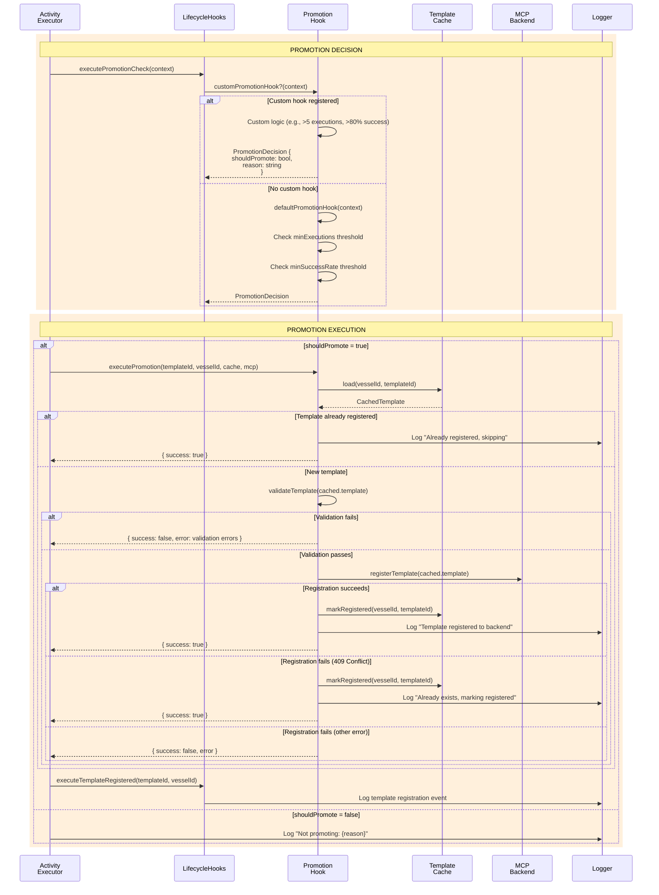
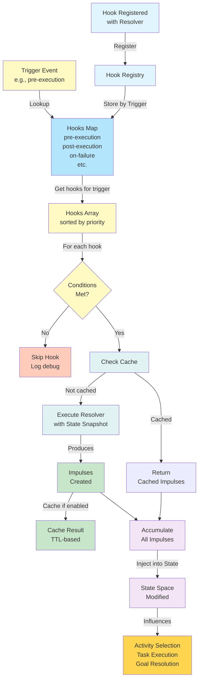

# Hook Registration and Behavior Injection

## Overview

This document maps the complete hook system in MiniBob, showing how behavior can be customized and extended at all lifecycle points. Hooks enable behavior injection without modifying core code, making MiniBob highly extensible.

## Key Concepts

1. **Lifecycle Hooks** - Activity and task lifecycle events (before/after prompt, complete/failed)
2. **Vessel Hooks** - State-based impulse injection with condition evaluation
3. **Impulse Verification Hooks** - Impulse creation and processing validation
4. **Hook Chain Execution** - Multiple hooks for the same trigger (priority-ordered)
5. **Promotion Hooks** - Template promotion decision logic
6. **Non-Blocking Execution** - Hook failures don't stop activity execution
7. **Caching Strategy** - Expensive hook resolvers cached (TTL-based)

## Main Sequence Diagram: Complete Hook Lifecycle

```mermaid
sequenceDiagram
    participant App as Application<br/>(index.ts)
    participant Session as Session<br/>Manager
    participant HookReg as Hook<br/>Registry
    participant LifecycleHooks as LifecycleHooks<br/>Namespace
    participant VesselHooks as VesselHooks<br/>Registry
    participant LLM as LLM<br/>Executor
    participant Resolver as Hook<br/>Resolver
    participant State as State<br/>Manager

    rect rgb(200, 220, 255)
    Note over App,State: PHASE 1: INITIALIZATION & HOOK REGISTRATION

    App->>Session: Initialize session
    Session->>HookReg: Get hook registry (singleton)

    rect rgb(220, 240, 255)
    Note over Session,HookReg: Register Lifecycle Hooks
    Session->>LifecycleHooks: LifecycleHooks.register({<br/>  onBeforePrompt: handler,<br/>  onAfterPrompt: handler,<br/>  onActivityComplete: handler,<br/>  onActivityFailed: handler<br/>})
    LifecycleHooks->>LifecycleHooks: Merge into registeredHooks
    LifecycleHooks->>HookReg: Log: "Registered hooks"
    end

    rect rgb(220, 240, 255)
    Note over Session,VesselHooks: Register Vessel Hooks (State-Based)
    Session->>VesselHooks: registerVesselHook({<br/>  id: "hook-id",<br/>  trigger: "pre-execution",<br/>  priority: 100,<br/>  injection: { resolver }<br/>})
    VesselHooks->>VesselHooks: Get hooks for trigger
    VesselHooks->>VesselHooks: Insert in priority order
    VesselHooks->>VesselHooks: Log: "Registered hook"
    end

    end

    rect rgb(200, 255, 220)
    Note over App,State: PHASE 2: ACTIVITY EXECUTION LIFECYCLE

    App->>LLM: Begin activity execution

    rect rgb(220, 255, 240)
    Note over LLM,LifecycleHooks: PRE-TASK HOOKS
    LLM->>LifecycleHooks: executeBeforePrompt(context)
    alt Hook registered
        LifecycleHooks->>LifecycleHooks: if !registeredHooks.onBeforePrompt return
        LifecycleHooks->>LifecycleHooks: try/catch block
        LifecycleHooks->>LifecycleHooks: await onBeforePrompt(context)
    else No hook
        LifecycleHooks->>LifecycleHooks: return early (no-op)
    end
    LifecycleHooks-->>LLM: Hook execution complete (or non-blocking error)
    end

    rect rgb(220, 255, 240)
    Note over LLM,Resolver: VESSEL HOOK EXECUTION (Pre-Selection)
    LLM->>VesselHooks: executeHooks("pre-selection", stateOverride)
    VesselHooks->>State: Build state snapshot from manager
    State-->>VesselHooks: ImpulseStateSpace {<br/>  shapes, impulseCounts,<br/>  budget, git, currentGoal<br/>}

    loop For each hook (priority order)
        VesselHooks->>VesselHooks: shouldExecuteHook(hook, state)?

        alt Conditions met
            VesselHooks->>VesselHooks: getCachedResult(hook)?

            alt Result cached
                VesselHooks->>VesselHooks: Return cached impulses
                VesselHooks->>VesselHooks: logExecution(success, cached=true)
            else Not cached
                VesselHooks->>Resolver: resolver(state) [timeout 5s]
                Resolver-->>VesselHooks: Impulse[] (produced)
                VesselHooks->>VesselHooks: If cacheable: cacheResult(hook)
                VesselHooks->>VesselHooks: logExecution(success)
            end
        else Conditions NOT met
            VesselHooks->>VesselHooks: Skip hook (log debug)
        end
    end

    VesselHooks-->>LLM: All impulses from hooks
    LLM->>State: Inject impulses into state
    end

    rect rgb(220, 255, 240)
    Note over LLM,LifecycleHooks: LLM TASK EXECUTION
    LLM->>LLM: Process task with context
    LLM->>LLM: Generate response
    LLM->>LLM: Execute tool calls
    end

    rect rgb(220, 255, 240)
    Note over LLM,LifecycleHooks: POST-TASK HOOKS
    LLM->>LifecycleHooks: executeAfterPrompt(context, result)
    alt Hook registered
        LifecycleHooks->>LifecycleHooks: try/catch block
        LifecycleHooks->>LifecycleHooks: await onAfterPrompt(context, result)
    else No hook
        LifecycleHooks-->>LLM: return early (no-op)
    end
    LifecycleHooks-->>LLM: Hook execution complete (non-blocking)
    end

    end

    rect rgb(255, 240, 220)
    Note over App,State: PHASE 3: ACTIVITY COMPLETION HOOKS

    LLM->>LifecycleHooks: executeActivityComplete(execution)
    alt Success path
        LifecycleHooks->>LifecycleHooks: try/catch
        LifecycleHooks->>LifecycleHooks: await onActivityComplete(execution)
    else Failure path
        LLM->>LifecycleHooks: executeActivityFailed(execution, error)
        LifecycleHooks->>LifecycleHooks: try/catch
        LifecycleHooks->>LifecycleHooks: await onActivityFailed(execution, error)
    end

    rect rgb(255, 250, 240)
    Note over LLM,VesselHooks: PROMOTION HOOKS (Post-Execution)
    LLM->>VesselHooks: executePromotionCheck(context)
    VesselHooks->>VesselHooks: checkPromotion(context)
    alt Custom hook registered
        VesselHooks->>Resolver: customPromotionHook(context)
    else Use default
        VesselHooks->>Resolver: defaultPromotionHook(context)
    end
    Resolver-->>VesselHooks: PromotionDecision
    VesselHooks-->>LLM: shouldPromote: boolean
    end

    end

    rect rgb(255, 220, 220)
    Note over App,State: PHASE 4: HOOK CHAIN EXECUTION (Multiple Hooks)

    Note over App,State: When multiple hooks register for same trigger:
    Note over App,State: 1. Hooks sorted by priority (descending)
    Note over App,State: 2. Execute in order
    Note over App,State: 3. Non-blocking failures (continue on error)
    Note over App,State: 4. Accumulate results from all hooks
    Note over App,State: 5. Cache results if enabled

    end
```



## Decomposition: Hook Registration Flow



**Implementation:** `repos/minibob/src/lifecycle-hooks.ts`

## Decomposition: Activity Lifecycle Hooks



**Implementation:** `repos/minibob/src/lifecycle-hooks.ts`

## Decomposition: Vessel Hooks (State-Based Injection)



**Implementation:** `repos/minibob/src/vessel-hooks.ts`

**Key Features:**
- Priority-ordered execution (descending)
- Condition evaluation (requiredShapes, requiredAbsent, custom predicate)
- Caching with TTL (default: 1 minute)
- Timeout protection (default: 5 seconds)
- Non-blocking failures (log and continue)

## Decomposition: Impulse Lifecycle Hooks



**Implementation:** `repos/minibob/src/impulse-verification-hooks.ts`

**Verification Checks:**
- **Creation**: Impulse structure valid, pointer resolvable
- **Processing**: Budget honored, content loaded correctly
- **Completion**: All referenced impulses resolved, no dangling references

## Decomposition: Hook Chain Execution (Multiple Hooks)



**Key Points:**
- Hooks executed in priority order (descending)
- Each hook sees state + accumulated impulses from previous hooks
- Errors are non-blocking (logged and execution continues)
- Results accumulated and returned together

## Decomposition: Promotion Hooks



**Implementation:** `repos/minibob/src/vessel/promotion-hooks.ts`

**Default Promotion Criteria:**
- Minimum executions: 5
- Minimum success rate: 0.8 (80%)
- No recent failures (within last 24 hours)

## Behavior Modification Through Hooks



## Hook Types and Trigger Points

| Hook Type | Trigger | Purpose | Blocking | Example |
|-----------|---------|---------|----------|---------|
| **Lifecycle Hooks** | | | | |
| `onBeforePrompt` | Before task sent to LLM | Prepare context, load impulses | No | Impulse verification setup |
| `onAfterPrompt` | After task completes | Cleanup, logging, metrics | No | Impulse verification checking |
| `onActivityComplete` | Activity succeeds | Final cleanup, reporting | No | Session archive, template registration |
| `onActivityFailed` | Activity fails | Error handling, rollback | No | Cleanup, trace analysis |
| `onPromotionCheck` | Before template promotion | Custom promotion decision | No | Success rate evaluation |
| `onTemplateRegistered` | After registration to backend | Notifications, cleanup | No | Metrics update |
| **Vessel Hooks** | | | | |
| `pre-execution` | Before any activity | Inject context impulses | No | Thompson recommendations |
| `post-execution` | After activity completes | Record patterns, cleanup | No | Composition learning |
| `on-state-change` | Impulse state changes | Dynamic adaptation | No | Recompute priorities |
| `pre-selection` | Before Thompson Sampling | Query for recommendations | No | Hook-injected impulses |
| `post-selection` | After activity selected | Final setup | No | Metrics preparation |
| `on-failure` | When activity fails | Recovery impulses | No | Error context injection |
| `periodic` | On interval | Maintenance tasks | No | Health checks |

## Hook Condition Evaluation

### VesselHook Conditions

```typescript
interface VesselHook {
  id: string
  trigger: string
  priority: number
  conditions?: {
    requiredShapes?: string[]        // Must have these shapes in state
    requiredAbsent?: string[]        // Must NOT have these shapes
    customPredicate?: (state) => boolean
  }
  injection: {
    resolver: (state: ImpulseStateSpace) => Promise<Impulse[]>
  }
  cacheable?: boolean
  cacheTTL?: number  // milliseconds
}
```

### Evaluation Flow

```typescript
function shouldExecuteHook(hook: VesselHook, state: ImpulseStateSpace): boolean {
  // 1. Check required shapes
  if (hook.conditions?.requiredShapes) {
    const hasAllRequired = hook.conditions.requiredShapes.every(
      shape => state.shapes.has(shape)
    );
    if (!hasAllRequired) return false;
  }

  // 2. Check required absent
  if (hook.conditions?.requiredAbsent) {
    const hasAnyForbidden = hook.conditions.requiredAbsent.some(
      shape => state.shapes.has(shape)
    );
    if (hasAnyForbidden) return false;
  }

  // 3. Check custom predicate
  if (hook.conditions?.customPredicate) {
    return hook.conditions.customPredicate(state);
  }

  return true;
}
```

## Caching Strategy

### Cache Entry Structure

```typescript
interface CacheEntry {
  hookId: string
  impulses: Impulse[]
  cachedAt: number
  expiresAt: number
}
```

### Cache Logic

```typescript
function getCachedResult(hook: VesselHook): Impulse[] | null {
  const entry = cache.get(hook.id);

  if (!entry) return null;
  if (Date.now() > entry.expiresAt) {
    cache.delete(hook.id);
    return null;
  }

  return entry.impulses;
}

function cacheResult(hook: VesselHook, impulses: Impulse[]): void {
  if (!hook.cacheable) return;

  const ttl = hook.cacheTTL || 60000;  // Default: 1 minute
  cache.set(hook.id, {
    hookId: hook.id,
    impulses,
    cachedAt: Date.now(),
    expiresAt: Date.now() + ttl
  });
}
```

## Hook Behavior Modification Capabilities

### 1. Input Modification
- Load additional impulses before prompt
- Inject verification context
- Prepare session memory

### 2. Execution Control
- Skip activities via condition predicates
- Select activities via pre-selection hooks
- Inject recovery impulses on failure

### 3. Output Modification
- Log execution results
- Record composition patterns
- Trigger promotion decisions

### 4. State Manipulation
- Create new impulses based on execution state
- Cache expensive resolutions
- Update verification tracking

## Implementation Patterns

### 1. Hook Registration (Setup)
- **Singleton Pattern**: Global hook registry maintained per trigger type
- **Priority Ordering**: Hooks sorted descending by priority
- **Duplicate Prevention**: Unregister old hook if ID conflicts
- **Merge Semantics**: New hooks merged into existing registry

### 2. Hook Execution (Invocation)
- **Non-Blocking by Default**: Hook failures don't stop activity execution
- **Try-Catch Wrappers**: All hook calls wrapped with error handling
- **Sequential Processing**: Hooks executed in order (priority → registration)
- **State Snapshots**: Each execution receives immutable state snapshot

### 3. Behavior Injection
- **Impulse Creation**: Hooks produce impulses that modify state space
- **Condition Evaluation**: Hooks checked for required/absent shapes before execution
- **Caching Strategy**: Expensive resolvers cached (default 1 minute TTL)
- **Timeout Protection**: Hook resolvers have 5-second timeout by default

### 4. Hook Chaining
- **Accumulation**: Results from all hooks accumulated before injection
- **State Flow**: Earlier hooks' impulses available to later hooks' resolvers
- **Error Resilience**: Single hook failure doesn't prevent others from running
- **Logging**: Each hook execution logged with duration, success status, cache status

### 5. Lifecycle Coordination
- **Activity Scope**: Hooks track state per activity execution
- **Task Scope**: Hooks invoked for each task in activity
- **Session Scope**: Can span multiple activities in single session
- **Cleanup**: Verification states deleted after activity completion

## File References

| Component | File | Purpose |
|-----------|------|---------|
| Lifecycle Hooks | `repos/minibob/src/lifecycle-hooks.ts` | Activity/task lifecycle hooks |
| Vessel Hooks | `repos/minibob/src/vessel-hooks.ts` | State-based impulse injection |
| Promotion Hooks | `repos/minibob/src/vessel/promotion-hooks.ts` | Template promotion decisions |
| Impulse Verification | `repos/minibob/src/impulse-verification-hooks.ts` | Impulse lifecycle verification |
| Goal Processor | `repos/minibob/src/goal-processor.ts` | Hook invocation for pre-selection |

## Implementation Architecture

This sequence is **entirely MiniBob (vessel configuration)** with NO backend involvement.

### MiniBob (Execution Environment)

**Responsibilities:**
- Hook registration (lifecycle, vessel, promotion, impulse verification)
- Hook execution at trigger points (priority-ordered)
- Condition evaluation (requiredShapes, requiredAbsent, custom predicates)
- Hook resolver invocation with state snapshots
- Caching (TTL-based, default 1 minute)
- Non-blocking error handling (log and continue)
- Impulse injection from hook resolvers

**Key Files:**
- `repos/minibob/src/lifecycle-hooks.ts` - Activity/task lifecycle hooks
- `repos/minibob/src/vessel-hooks.ts` - State-based impulse injection
- `repos/minibob/src/vessel/promotion-hooks.ts` - Template promotion decisions
- `repos/minibob/src/impulse-verification-hooks.ts` - Impulse lifecycle verification

**What MiniBob Does NOT Do:**
- Does NOT store hooks in backend (vessel configuration, not activity schema)
- Does NOT query backend for hook definitions (registered locally)
- Does NOT persist hook execution history (ephemeral, session-scoped)

### Activity-API (Storage & Learning Backend)

**Responsibilities:**
- **NONE** - Hooks are vessel-level configuration, not backend data

**Why Hooks Are NOT in Activity-API:**
- Hooks are **vessel configuration** (how this MiniBob instance behaves)
- Activities are **portable templates** (what work gets done)
- Hooks customize execution environment (vessel-specific)
- Activities define work to be done (vessel-independent)

**Example:**
- **Activity template** (backend): "fix_typescript_error" - portable, reusable
- **Vessel hook** (MiniBob): "Before execution, verify impulses" - this instance's behavior

### SurrealDB Schema

**Tables:**
- **NONE** - Hooks are not persisted

**Why No Schema:**
- Hooks are runtime configuration, not data
- Different MiniBob instances may have different hooks
- Hooks are registered programmatically (code), not declaratively (data)

### Correct Separation

**MiniBob handles (vessel configuration):**
- Hook registration and storage (in-memory, per-instance)
- Hook execution (lifecycle, vessel, promotion, verification)
- Condition evaluation (requiredShapes, custom predicates)
- Impulse injection from hook resolvers
- Caching and timeout management

**Activity-API handles (portable templates):**
- **NOTHING** - Hooks are not backend data

**Why This Separation Matters:**
- Hooks are vessel-specific customizations (different MiniBob instances can have different hooks)
- Activities are universal templates (same activity runs on any MiniBob)
- Hooks enable per-instance behavior without polluting activity definitions
- This keeps activity templates portable and vessel behavior flexible

**Key Architectural Point:**
Hooks are **vessel configuration**, not **activity schema**. They live in MiniBob's runtime, not the backend's database. Activities remain portable; vessels customize execution.

**Contrast with Activity Composition:**
- **Activity composition** (backend): "activity A composes activity B" → stored in backend, learned via Thompson Sampling
- **Vessel hooks** (MiniBob): "before any activity, inject these impulses" → configured per instance, not stored

### Vessel vs Activity

| Aspect | Vessel (MiniBob) | Activity (Backend) |
|--------|------------------|-------------------|
| **Definition** | Execution environment | Work template |
| **Scope** | This instance | Any instance |
| **Configuration** | Hooks, resolvers, tools | Tasks, prompts, validation |
| **Storage** | In-memory (session) | SurrealDB (persistent) |
| **Portability** | Instance-specific | Cross-instance |
| **Example** | "Before execution, verify impulses" | "Fix TypeScript errors" |

**Why Hooks Are Vessel-Level:**
- Different MiniBob instances may have different priorities (e.g., enterprise vs personal)
- Hooks customize behavior without modifying activity templates
- Allows A/B testing of hook strategies per instance
- Keeps activity definitions clean and portable

## Related Documentation

- [Activity Selection](./01-activity-selection.md) - How hooks influence selection
- [Impulse Resolution](./02-impulse-resolution.md) - How hooks inject impulses
- [Resolver Processing](./03-resolver-processing.md) - How resolvers use hook-injected impulses
- [IMPULSE_ACTIVITY_FOUNDATION.md](../IMPULSE_ACTIVITY_FOUNDATION.md) - Foundational model

---

**Last Updated:** 2026-04-16
