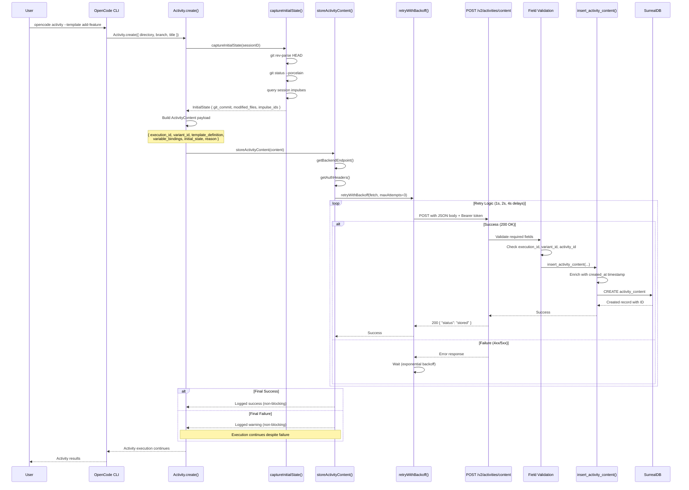
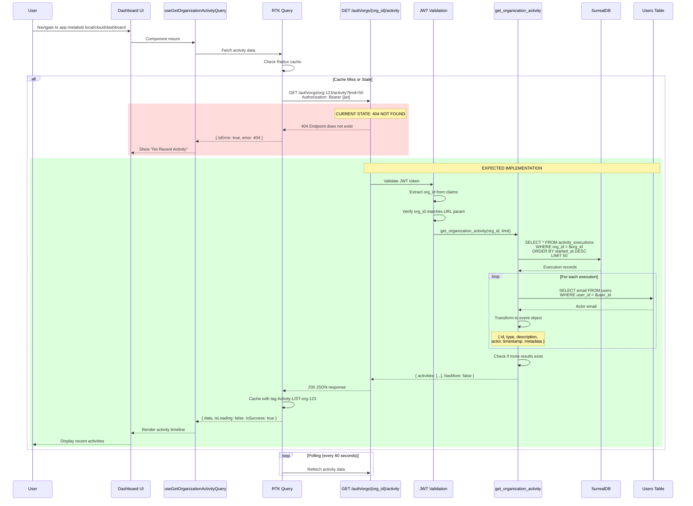

# Dashboard Activity History Viewing Flow - Complete Data Flow Analysis

**Feature**: Dashboard Activity History Viewing Flow  
**Status**: 🔴 **BROKEN** - Critical endpoint missing  
**Last Updated**: 2026-03-04  
**Analysis Type**: End-to-End Data Flow Trace

---

## Executive Summary

The Dashboard Activity History Viewing Flow enables users to view a timeline of activity executions in the cloud dashboard at `http://app.metabob.local/cloud/dashboard`. The flow has two paths:

- **Write Path (Storage)**: ✅ **WORKING** - OpenCode → Backend API → SurrealDB
- **Read Path (Retrieval)**: ❌ **BROKEN** - Dashboard → Backend API (MISSING ENDPOINT) → SurrealDB

**Critical Issue**: The backend endpoint `GET /auth/orgs/{org_id}/activity` is NOT IMPLEMENTED, breaking the entire viewing capability despite data being successfully stored.

---

## 1. Mermaid Flow Diagrams

### 1.1 Complete End-to-End Flow (Current State)

```mermaid
graph TD
    %% User Entry Points
    User1[User: Execute Activity via CLI] -->|opencode activity| OC[OpenCode CLI]
    User2[User: View Dashboard] -->|Navigate to app.metabob.local| UI[Dashboard UI]
    
    %% Write Path (WORKING)
    subgraph "Write Path - Activity Storage (WORKING)"
        OC -->|Activity.create| AC[Activity Object Created]
        AC -->|captureInitialState| IS[Initial State Snapshot]
        IS -->|Build ActivityContent| ACP[ActivityContent Payload]
        ACP -->|storeActivityContent| HTTP1[HTTP POST /v2/activities/content]
        HTTP1 -->|Non-blocking with retry| BE1[Backend: store_activity_content]
        BE1 -->|Validate required fields| VAL[Field Validation]
        VAL -->|insert_activity_content| DBO1[DB Operation: Insert]
        DBO1 -->|CREATE with timestamp| SDB1[(SurrealDB: activity_content)]
    end
    
    %% Read Path (BROKEN)
    subgraph "Read Path - Activity Retrieval (BROKEN)"
        UI -->|useGetOrganizationActivityQuery| RTK[RTK Query Hook]
        RTK -->|HTTP GET /auth/orgs/{org_id}/activity| HTTP2[HTTP Request with JWT]
        HTTP2 -->|Poll every 60s| MISSING{Backend Endpoint?}
        MISSING -->|404 NOT FOUND| ERR[Error: Endpoint Missing]
        
        %% Expected Flow (NOT IMPLEMENTED)
        MISSING -.->|SHOULD EXIST| BE2[Backend: get_organization_activity]
        BE2 -.->|Query activity_executions| DBO2[DB Operation: Query]
        DBO2 -.->|WHERE org_id| SDB2[(SurrealDB: activity_executions)]
        SDB2 -.->|Transform records| TRANS[Transform to Events]
        TRANS -.->|Format timestamps| RESP[JSON Response]
        RESP -.->|Cache in Redux| CACHE[RTK Query Cache]
        CACHE -.->|Render timeline| COMP[RecentActivity Component]
    end
    
    %% Error Handling
    ERR -->|isError: true| EMPTY[UI: No Recent Activity]
    
    %% Styling
    style User1 fill:#e1f5ff,stroke:#0066cc
    style User2 fill:#e1f5ff,stroke:#0066cc
    style SDB1 fill:#ffe1e1,stroke:#cc0000
    style SDB2 fill:#ffe1e1,stroke:#cc0000
    style MISSING fill:#fff3cd,stroke:#856404
    style ERR fill:#f8d7da,stroke:#721c24
    style EMPTY fill:#f8d7da,stroke:#721c24
    style BE2 fill:#d1ecf1,stroke:#0c5460,stroke-dasharray: 5 5
    style DBO2 fill:#d1ecf1,stroke:#0c5460,stroke-dasharray: 5 5
    style TRANS fill:#d1ecf1,stroke:#0c5460,stroke-dasharray: 5 5
    style RESP fill:#d1ecf1,stroke:#0c5460,stroke-dasharray: 5 5
    style CACHE fill:#d1ecf1,stroke:#0c5460,stroke-dasharray: 5 5
    style COMP fill:#d1ecf1,stroke:#0c5460,stroke-dasharray: 5 5
```

### 1.2 Write Path - Activity Storage (Detailed)



### 1.3 Read Path - Activity Retrieval (Expected vs Actual)



### 1.4 Data Transformation Pipeline

```mermaid
graph LR
    subgraph "Input Layer"
        I1[User Parameters] -->|templateId, variables, reason| I2[Activity Tool Input]
    end
    
    subgraph "Transformation Layer 1: Activity Creation"
        I2 --> T1[Activity Object]
        T1 --> T2[Initial State Snapshot]
        T2 --> T3[Enhanced Reason<br/>+ Conversation Context]
    end
    
    subgraph "Transformation Layer 2: Serialization"
        T3 --> S1[ActivityContent Payload]
        S1 --> S2[HTTP Request<br/>+ Auth Headers]
        S2 --> S3[JSON Body]
    end
    
    subgraph "Transformation Layer 3: Backend Processing"
        S3 --> B1[Validated Dict]
        B1 --> B2[Database Parameters]
        B2 --> B3[SurrealDB Record<br/>+ Timestamp]
    end
    
    subgraph "Storage Layer"
        B3 --> DB1[(activity_content table)]
        DB1 --> DB2[Persistent Storage]
    end
    
    subgraph "Retrieval Layer (MISSING)"
        DB2 -.-> R1[Query Execution Records]
        R1 -.-> R2[Join with Users]
        R2 -.-> R3[Transform to Events]
    end
    
    subgraph "Presentation Layer"
        R3 -.-> P1[HTTP JSON Response]
        P1 -.-> P2[RTK Query Cache]
        P2 -.-> P3[React Component State]
        P3 -.-> P4[Rendered Timeline UI]
    end
    
    subgraph "Output Layer"
        P4 -.-> O1[User Views Activity]
    end
    
    style I1 fill:#e1f5ff
    style O1 fill:#ffe1e1
    style DB1 fill:#fff3cd
    style DB2 fill:#fff3cd
    style R1 fill:#f8d7da,stroke-dasharray: 5 5
    style R2 fill:#f8d7da,stroke-dasharray: 5 5
    style R3 fill:#f8d7da,stroke-dasharray: 5 5
    style P1 fill:#f8d7da,stroke-dasharray: 5 5
    style P2 fill:#f8d7da,stroke-dasharray: 5 5
    style P3 fill:#f8d7da,stroke-dasharray: 5 5
    style P4 fill:#f8d7da,stroke-dasharray: 5 5
```



### 1.5 Architectural Boundaries

```mermaid
graph TB
    subgraph "Repository Boundary 1: OpenCode ↔ Backend"
        OC1[TypeScript/OpenCode] -->|HTTP REST API<br/>Loose Coupling| BE1[Python/FastAPI]
        BE1 -.->|Response| OC1
        
        note1[Contract: JSON over HTTP<br/>Versioning: /api/v1/<br/>Auth: Bearer Token]
    end
    
    subgraph "Service Boundary 1: Backend ↔ SurrealDB"
        BE1 -->|surrealdb-py Library<br/>Medium Coupling| SDB1[(SurrealDB)]
        SDB1 -.->|Query Results| BE1
        
        note2[Contract: SurrealDB Protocol<br/>Connection: Singleton<br/>No Pooling]
    end
    
    subgraph "Service Boundary 2: Backend ↔ Redis"
        BE1 -->|redis.StrictRedis<br/>Medium Coupling| RDS1[(Redis Cache)]
        RDS1 -.->|Cached Data| BE1
        
        note3[Contract: Redis Commands<br/>Use: Template Metadata<br/>No TTL Management]
    end
    
    subgraph "Repository Boundary 2: Dashboard ↔ Backend (BROKEN)"
        UI1[JavaScript/React] -->|HTTP REST API<br/>Medium Coupling| BE2[Python/FastAPI]
        BE2 -.->|404 NOT FOUND| UI1
        
        note4[Contract: JSON over HTTP<br/>Auth: JWT Token<br/>ENDPOINT MISSING]
    end
    
    subgraph "Service Boundary 3: Dashboard ↔ Backend (Expected)"
        UI1 -.->|SHOULD CALL| BE3[GET /auth/orgs/{id}/activity]
        BE3 -.->|Query| SDB2[(SurrealDB)]
        SDB2 -.->|Execution Records| BE3
        BE3 -.->|JSON Response| UI1
    end
    
    style OC1 fill:#e1f5ff
    style UI1 fill:#e1f5ff
    style BE2 fill:#f8d7da
    style BE3 fill:#d1ecf1,stroke-dasharray: 5 5
    style SDB1 fill:#fff3cd
    style SDB2 fill:#fff3cd
    style RDS1 fill:#fff3cd
```

---

## 2. Data Flow Summary

### 2.1 Entry Point

**Where**: OpenCode CLI (`tool/activity.ts`)  
**Trigger**: User executes `opencode activity --template <name> --variables <json> --reason <text>`  
**Input Format**:
```typescript
{
  templateId: string,           // e.g., "add-rest-endpoint"
  variables: Record<string, any>, // Template-specific parameters
  reason: string,               // Why this activity is being executed
  trailblazing?: {              // Optional recovery config
    enabled: boolean,
    maxCostPerTask: number,
    maxTotalCost: number
  }
}
```

**Initial Processing**:
1. Load template from repository (local or MCP)
2. Validate variables against template schema
3. Select variant using Thompson Sampling
4. Create `Activity` tracking object
5. Capture initial state snapshot (git commit, modified files, impulse IDs)

---

### 2.2 Key Transformations

#### Transformation 1: User Input → Activity Object
**Component**: `Activity.create()` in `tool/activity.ts:532`  
**Input**: User parameters + template definition  
**Output**: Activity object with tracking metadata

**Data Changes**:
```typescript
// Input
{ templateId: "add-feature", variables: {...}, reason: "..." }

// Output
Activity {
  id: "act_abc123_1709567890",
  templateId: "add-feature",
  templateVersion: 5,
  variables: {...},
  reason: "User wants to add payment API\n\nRecent conversation:\nUser: Can you add...",
  status: "executing",
  sessionIDs: ["sess_xyz"],
  executionEvidence: { sessionsSpawned: [], toolCalls: [] },
  workArtifacts: { filesChanged: [], commitsMade: [] },
  selection_reason: {
    method: "thompson_sampling",
    alpha: 12, beta: 2,
    selectedId: "variant_123"
  }
}
```

**Why**: Enriches user input with execution context, tracking metadata, and variant selection rationale for learning analytics.

---

#### Transformation 2: Activity Object → Initial State Snapshot
**Component**: `captureInitialState()` in `activity-state-capture.ts:59`  
**Input**: Session ID  
**Output**: Complete functional state snapshot

**Data Changes**:
```typescript
// Executes commands
git rev-parse HEAD          // → abc123def456
git branch --show-current   // → main
git status --porcelain      // → M file1.ts\n?? file2.ts

// Output
InitialState {
  git_commit: "abc123def456",
  git_branch: "main",
  git_dirty: true,
  modified_files: ["file1.ts", "file2.ts"],
  impulse_ids: ["imp_design_doc", "imp_context"],
  working_directory: "/home/user/project",
  timestamp: 1709567890000
}
```

**Why**: Enables exact replay by capturing complete execution environment baseline. Non-blocking design ensures execution continues even if git commands fail.

---

#### Transformation 3: Activity Context → ActivityContent Payload
**Component**: Build ActivityContent in `tool/activity.ts:666`  
**Input**: Activity object + template + initial state  
**Output**: Serializable payload for backend

**Data Changes**:
```typescript
ActivityContent {
  activity_id: "act_abc123_1709567890",
  template_definition: {
    id: "add-feature",
    name: "Add Feature",
    description: "...",
    tasks: [...],
    version: { generation: 5, ... }
  },
  variable_bindings: {
    featureName: "Payment API",
    files: ["src/payments.ts"]
  },
  initial_state: InitialState {...},
  reason: "User wants to add payment API\n\nRecent conversation:\n...",
  timestamp: 1709567890000
}
```

**Why**: Packages complete instructional state (template + variables + context) for backend storage. Enables replay (exact reproduction) and learning (pattern analysis).

---

#### Transformation 4: ActivityContent → HTTP Request
**Component**: `storeActivityContent()` in `activity-client.ts:91`  
**Input**: ActivityContent TypeScript object  
**Output**: HTTP POST request with authentication

**Data Changes**:
```typescript
// Input: TypeScript object

// Output: HTTP Request
POST http://localhost:8081/api/v1/activity-execution/content
Headers:
  Content-Type: application/json
  Authorization: Bearer sk_live_abc123...
Body: JSON.stringify(ActivityContent)
```

**Why**: Crosses repository boundary (OpenCode → Backend). Uses Bearer token for authentication, JSON for language-agnostic serialization.

---

#### Transformation 5: HTTP Request → Validated Dict
**Component**: `store_activity_content()` in `activity.py:756`  
**Input**: HTTP request body  
**Output**: Validated Python dictionary

**Data Changes**:
```python
# Input: JSON string from request.body

# Validation
required = ["execution_id", "variant_id", "activity_id", 
            "template_definition", "variable_bindings"]
missing = [f for f in required if f not in content]
if missing:
    raise HTTPException(400, f"Missing: {missing}")

# Output: Validated dict
{
  "execution_id": "exec_abc123_1709567890",
  "variant_id": "add-feature_hash123",
  "activity_id": "add-feature",
  "template_definition": {...},
  "variable_bindings": {...},
  "reason": "..."
}
```

**Why**: Ensures data integrity before database write. Validates required fields but doesn't validate schema (no Pydantic models = type safety gap).

---

#### Transformation 6: Validated Dict → SurrealDB Record
**Component**: `insert_activity_content()` in `activity_content.py:17`  
**Input**: Python dict with validated fields  
**Output**: SurrealDB record with timestamp enrichment

**Data Changes**:
```python
# Input: Python dict

# Timestamp enrichment
data = {
    **content,
    "created_at": datetime.utcnow().isoformat()  # "2026-03-04T10:30:15.123Z"
}

# Database operation
result = await db.create("activity_content", data)

# Output: SurrealDB record
{
  "id": "activity_content:abc123",  # Auto-generated by SurrealDB
  "execution_id": "exec_abc123_1709567890",
  "variant_id": "add-feature_hash123",
  "template_definition": {...},
  "variables": {...},
  "reason": "...",
  "created_at": "2026-03-04T10:30:15.123Z"
}
```

**Why**: Adds created_at timestamp for temporal queries. Uses SurrealDB's CREATE operation for auto-generated ID. Stores complete context for replay and learning.

---

#### Transformation 7: SurrealDB Records → Activity Events (MISSING)
**Component**: `get_organization_activity()` (NOT IMPLEMENTED)  
**Expected Input**: Query activity_executions table  
**Expected Output**: User-friendly activity event objects

**Expected Data Changes**:
```python
# Input: SurrealDB query results
[
  {
    "id": "activity_executions:abc123",
    "execution_id": "exec_abc123_1709567890",
    "template_id": "add-feature",
    "org_id": "org-123",
    "user_id": "user-456",
    "started_at": "2026-03-04T10:30:00Z",
    "completed_at": "2026-03-04T10:31:15Z",
    "success": True,
    "duration_ms": 75000,
    "cost_usd": 0.022
  }
]

# Expected transformation logic
for exec in executions:
    # Lookup user email
    user = await db.query("SELECT email FROM users WHERE user_id = $user_id")
    
    # Map to event
    event = {
        "id": exec["execution_id"],
        "type": "activity.completed" if exec["success"] else "activity.failed",
        "description": f"{'Completed' if exec['success'] else 'Failed'} activity: {exec['template_id']}",
        "actor": {"email": user["email"]},
        "timestamp": int(exec["started_at"].timestamp() * 1000),
        "relativeTime": format_relative_time(exec["started_at"]),
        "metadata": {
            "template_id": exec["template_id"],
            "success": exec["success"],
            "duration_ms": exec["duration_ms"],
            "cost_usd": exec["cost_usd"]
        }
    }

# Expected output
{
  "activities": [
    {
      "id": "exec_abc123_1709567890",
      "type": "activity.completed",
      "description": "Completed activity: add-feature",
      "actor": {"email": "user@example.com"},
      "timestamp": 1709567890000,
      "relativeTime": "2 hours ago",
      "metadata": {
        "template_id": "add-feature",
        "success": true,
        "duration_ms": 75000,
        "cost_usd": 0.022
      }
    }
  ],
  "hasMore": false
}
```

**Why Expected**: Transforms technical execution records into user-friendly timeline events. Joins with users table for actor attribution. Formats timestamps for UI consumption. Paginated to prevent large payloads.

**Current State**: ❌ **NOT IMPLEMENTED** - This transformation doesn't exist, breaking the entire read path.

---

#### Transformation 8: HTTP Response → RTK Query State
**Component**: `useGetOrganizationActivityQuery` in `OrganizationApi.js:284`  
**Expected Input**: HTTP JSON response  
**Expected Output**: Redux cache + React state

**Expected Data Changes**:
```javascript
// Input: HTTP 200 response
{
  "activities": [...],
  "hasMore": false
}

// RTK Query processing
1. Parse JSON response
2. Store in Redux cache with tag { type: 'Activity', id: 'LIST-org-123' }
3. Update component state

// Output: React hook state
{
  data: {
    activities: [...],
    hasMore: false
  },
  isLoading: false,
  isFetching: false,
  isSuccess: true,
  isError: false,
  error: null
}
```

**Current State**: Receives 404 error instead of data, so output is:
```javascript
{
  data: undefined,
  isLoading: false,
  isSuccess: false,
  isError: true,
  error: { status: 404, message: "Not Found" }
}
```

---

#### Transformation 9: RTK Query State → React Component Props
**Component**: `RecentActivity` component  
**Input**: RTK Query state  
**Output**: Rendered JSX elements

**Data Changes**:
```javascript
// Input
{ data: { activities: [...] }, isLoading: false, isError: false }

// Component logic
const displayedActivities = activities.slice(0, limit)  // First 10

// Output: JSX
displayedActivities.map(activity => (
  <ListItem key={activity.id}>
    <ListItemAvatar>
      <Avatar sx={{ bgcolor: getEventColor(activity.type) }}>
        <Icon component={getEventIcon(activity.type)} />
      </Avatar>
    </ListItemAvatar>
    <ListItemText
      primary={activity.description}
      secondary={`${activity.actor.email} • ${activity.relativeTime}`}
    />
  </ListItem>
))
```

**Current State**: Shows empty state or error message because data is undefined.

---

### 2.3 Validations Enforced

#### Input Validations (OpenCode CLI)
- **Template ID exists**: Verified against template repository
- **Variables match schema**: Checked against template's variable definitions
- **Required variables present**: Enforced by template schema
- **Variable types correct**: String, number, boolean validation

#### Request Validations (Backend API)
```python
# Required field validation
required = [
    "execution_id",
    "variant_id", 
    "activity_id",
    "template_definition",
    "variable_bindings"
]
missing = [f for f in required if f not in content]
if missing:
    raise HTTPException(400, f"Missing: {missing}")
```

**Gaps**:
- ❌ No type validation (Dict[str, Any] accepts anything)
- ❌ No schema validation for template_definition
- ❌ No variable bindings validation
- ❌ No size limits on request payload
- ❌ No format validation for execution_id

#### Authentication/Authorization
- **OpenCode → Backend**: Bearer token (METABOB_API_KEY)
- **Dashboard → Backend**: JWT token with org_id claim
- **Backend → SurrealDB**: Username/password authentication

**Gaps**:
- ⚠️ Authentication optional in DEBUG mode (security risk)
- ❌ No rate limiting
- ❌ No request size limits

---

### 2.4 Architectural Boundaries Crossed

#### Boundary 1: Repository Boundary (OpenCode ↔ Backend)
- **Type**: HTTP REST API
- **Contract**: JSON over HTTP
- **Coupling**: Loose (language-agnostic)
- **Versioning**: /api/v1/ prefix
- **Authentication**: Bearer token
- **Resilience**: Retry with exponential backoff (3 attempts)
- **Error Handling**: Non-blocking (execution continues on failure)

#### Boundary 2: Layer Boundary (Backend Route ↔ Database Operation)
- **Type**: Function call (Python)
- **Contract**: Python function signature
- **Coupling**: Tight (direct import)
- **Error Handling**: Exception bubbling (catch Exception)
- **Transaction Management**: None

#### Boundary 3: Service Boundary (Backend ↔ SurrealDB)
- **Type**: Database client library (surrealdb-py)
- **Contract**: SurrealDB protocol
- **Coupling**: Medium (library abstraction)
- **Connection**: Singleton (no pooling)
- **Resilience**: No retry logic
- **Error Handling**: Exceptions bubble up

#### Boundary 4: Repository Boundary (Dashboard ↔ Backend) **BROKEN**
- **Type**: HTTP REST API
- **Contract**: JSON over HTTP
- **Coupling**: Medium (hardcoded endpoint path)
- **Authentication**: JWT token
- **Resilience**: RTK Query caching, polling
- **Current State**: ❌ **404 NOT FOUND**

---

### 2.5 Exit Points

#### Write Path Exit Point
**Where**: SurrealDB `activity_content` table  
**Final Format**: SurrealDB record
```json
{
  "id": "activity_content:abc123",
  "execution_id": "exec_abc123_1709567890",
  "variant_id": "add-feature_hash123",
  "template_definition": {...},
  "variables": {...},
  "reason": "User wants to add payment API...",
  "created_at": "2026-03-04T10:30:15.123Z"
}
```

**Indexing**: 
- Unique index on `execution_id`
- Query capability by `variant_id`, `created_at`

**Storage Purpose**:
- Replay: Reproduce exact execution environment
- Learning: Analyze template/variable success patterns
- Debugging: Understand execution history
- Audit: Track who requested what and why

---

#### Read Path Exit Point (Expected)
**Where**: Dashboard UI component  
**Expected Final Format**: Rendered React component

**Current State**: ❌ Shows "No recent activity" or error state because backend endpoint missing.

**Expected Output** (when implemented):
```jsx
<List>
  <ListItem>
    <ListItemAvatar>
      <Avatar sx={{ bgcolor: 'success.main' }}>
        <CheckCircleIcon />
      </Avatar>
    </ListItemAvatar>
    <ListItemText
      primary="Completed activity: add-feature"
      secondary="user@example.com • 2 hours ago"
    />
  </ListItem>
  {/* More items... */}
</List>
```

---

## 3. Key Insights

### 3.1 Business Purpose

**Primary Goal**: Provide visibility into organizational activity execution for:
1. **Audit Trail**: Track who executed what activities and when
2. **Transparency**: Show team members what automation is running
3. **Debugging**: Identify failed activities that need attention  
4. **Engagement**: Demonstrate value of automation via activity metrics
5. **Learning**: Enable Thompson Sampling by capturing execution patterns

**Value Proposition**: 
- Users can see activity history without checking CLI logs
- Managers can track team automation usage
- Developers can debug failed executions via dashboard
- System learns from execution patterns to optimize template selection

---

### 3.2 Critical Decision Points

#### Decision 1: Non-Blocking Telemetry
**Choice**: Activity execution continues even if backend storage fails  
**Rationale**: User work is more important than telemetry  
**Trade-off**: Some executions may not be recorded (data loss)  
**Alternative Considered**: Blocking execution until storage succeeds (rejected due to poor UX on network issues)

**Impact**: 
- ✅ Better user experience (no blocking on network issues)
- ❌ Incomplete activity history (missed executions on backend downtime)
- ❌ Learning system gets partial data (affects Thompson Sampling accuracy)

---

#### Decision 2: Dict[str, Any] vs. Pydantic Models
**Choice**: Backend uses `Dict[str, Any]` instead of typed Pydantic models  
**Rationale**: Faster iteration during MVP phase  
**Trade-off**: No runtime type validation, schema can drift  
**Alternative Considered**: Pydantic models (rejected to avoid updating models on every schema change)

**Impact**:
- ✅ Rapid prototyping (no model updates needed)
- ❌ Type safety weak (runtime errors possible)
- ❌ No automatic validation (manual field checking)
- ❌ Poor developer experience (no autocomplete)

---

#### Decision 3: Polling vs. WebSocket
**Choice**: Dashboard polls backend every 60 seconds  
**Rationale**: Simpler implementation, adequate latency for activity feed  
**Trade-off**: Higher server load, 60-second update delay  
**Alternative Considered**: WebSocket/SSE for real-time updates (rejected for MVP complexity)

**Impact**:
- ✅ Simple to implement and debug
- ✅ Reliable (no connection management)
- ❌ Wastes bandwidth (polling continues even on errors)
- ❌ 60-second latency (not real-time)

---

#### Decision 4: Separation of activity_content and activity_executions
**Choice**: Store instructional state (template + variables) separately from results  
**Rationale**: Avoid duplicating template definitions across executions  
**Trade-off**: Requires join queries to get complete picture  
**Alternative Considered**: Single table (rejected due to data duplication)

**Impact**:
- ✅ Deduplication (variant_id enables content-addressable storage)
- ✅ Efficient replay (fetch template once, execute many times)
- ❌ Complex queries (join required for full context)
- ❌ Two-phase writes (content first, execution later)

---

#### Decision 5: Singleton vs. Connection Pool
**Choice**: Backend uses singleton SurrealDB connection  
**Rationale**: Simple to implement for MVP  
**Trade-off**: Performance bottleneck under load, no concurrency  
**Alternative Considered**: Connection pooling (deferred to post-MVP)

**Impact**:
- ✅ Simple implementation
- ❌ All requests serialize on single connection
- ❌ No horizontal scaling
- ❌ Connection failure affects all requests

---

### 3.3 Potential Risks and Technical Debt

#### Risk 1: Missing Critical Endpoint (P0 - CRITICAL)
**Issue**: `GET /auth/orgs/{org_id}/activity` not implemented  
**Impact**: Entire read path broken, feature doesn't work  
**Likelihood**: Already occurring (100%)  
**Severity**: Critical - blocks feature launch

**Mitigation**: Implement endpoint ASAP (see section 5.1)

---

#### Risk 2: Exception Leakage (P1 - SECURITY)
**Issue**: Backend exposes internal exception details in HTTP 500 responses  
**Impact**: Information disclosure vulnerability, attackers learn system internals  
**Likelihood**: High (every unhandled exception leaks)  
**Severity**: High - security vulnerability

**Example**:
```python
except Exception as e:
    raise HTTPException(500, detail=str(e))  # ❌ Leaks internal details
```

**Mitigation**: Sanitize errors before returning to clients

---

#### Risk 3: No Rate Limiting (P1 - SECURITY)
**Issue**: All API endpoints lack rate limiting  
**Impact**: Vulnerable to DoS attacks, resource exhaustion  
**Likelihood**: Medium (requires malicious actor)  
**Severity**: High - availability risk

**Mitigation**: Implement rate limiting middleware (slowapi)

---

#### Risk 4: Authentication Bypass in Debug Mode (P1 - SECURITY)
**Issue**: Authentication optional when `DEBUG=True`  
**Impact**: Dev/staging environments exposed without auth  
**Likelihood**: High (debug mode common in dev/staging)  
**Severity**: High - security breach in non-prod

**Mitigation**: Always require auth, provide test fixtures instead

---

#### Risk 5: No Connection Pooling (P2 - PERFORMANCE)
**Issue**: Singleton SurrealDB connection  
**Impact**: Performance bottleneck, no concurrency  
**Likelihood**: High (under load)  
**Severity**: Medium - performance degradation

**Mitigation**: Implement connection pooling

---

#### Risk 6: No Request Timeout (P2 - RESILIENCE)
**Issue**: HTTP requests have no timeout  
**Impact**: Could hang indefinitely on slow backend  
**Likelihood**: Medium (slow network)  
**Severity**: Medium - poor UX

**Mitigation**: Add AbortController timeout to fetch()

---

#### Risk 7: No Idempotency (P2 - DATA INTEGRITY)
**Issue**: Duplicate requests create duplicate records  
**Impact**: Retry logic pollutes database, metrics skewed  
**Likelihood**: Medium (retry logic triggers)  
**Severity**: Medium - data quality

**Mitigation**: Add unique constraint on execution_id, check before insert

---

#### Technical Debt Summary

| Category | Count | Priority |
|----------|-------|----------|
| Missing Implementation | 1 | P0 |
| Security Vulnerabilities | 3 | P1 |
| Type Safety Issues | 3 | P2 |
| Error Handling Issues | 5 | P2 |
| Performance Issues | 3 | P2 |
| Resilience Issues | 2 | P2 |
| Observability Gaps | 2 | P3 |

**Total Issues Identified**: 23

---

### 3.4 Suggested Improvements

#### Immediate (P0 - Unblock Feature)

1. **Implement Missing Endpoint**
```python
# File: repos/metabob-rpc-api/server/routes/cloud_auth.py

@router.get("/orgs/{org_id}/activity")
async def get_organization_activity(
    org_id: str,
    limit: int = Query(50, le=100),
    offset: int = Query(0),
    current_user: TokenPayload = Depends(get_current_user),
) -> Dict[str, Any]:
    """Get recent organization activity feed."""
    
    # Validate user belongs to org
    if current_user.org_id != org_id:
        raise HTTPException(403, "Access denied")
    
    # Query activity_executions
    db = await get_surreal_client()
    query = """
        SELECT * FROM activity_executions 
        WHERE org_id = $org_id 
        ORDER BY started_at DESC 
        LIMIT $limit START $offset
    """
    executions = await db.query(query, {
        "org_id": org_id,
        "limit": limit,
        "offset": offset
    })
    
    # Transform to activity events
    activities = []
    for exec in executions[0] if executions else []:
        # Lookup user email
        user_query = "SELECT email FROM users WHERE user_id = $user_id LIMIT 1"
        user_result = await db.query(user_query, {"user_id": exec.get("user_id")})
        user_email = user_result[0][0]["email"] if user_result and user_result[0] else "unknown"
        
        # Format event
        activity_type = "activity.completed" if exec["success"] else "activity.failed"
        description = f"{'Completed' if exec['success'] else 'Failed'} activity: {exec['template_id']}"
        
        activities.append({
            "id": exec["activity_id"],
            "type": activity_type,
            "description": description,
            "actor": {"email": user_email},
            "timestamp": int(exec["started_at"].timestamp() * 1000),
            "relativeTime": format_relative_time(exec["started_at"]),
            "metadata": {
                "template_id": exec["template_id"],
                "success": exec["success"],
                "duration_ms": exec["duration_ms"],
                "cost_usd": exec["cost_usd"]
            }
        })
    
    # Check if more results exist
    count_query = "SELECT count() FROM activity_executions WHERE org_id = $org_id GROUP ALL"
    count_result = await db.query(count_query, {"org_id": org_id})
    total = count_result[0][0]["count"] if count_result and count_result[0] else 0
    has_more = (offset + limit) < total
    
    return {
        "activities": activities,
        "hasMore": has_more
    }
```

---

#### High Priority (P1 - Security)

2. **Add Pydantic Models for Type Safety**
```python
# File: repos/metabob-rpc-api/server/models/activity.py (create)

from pydantic import BaseModel, Field, validator
from typing import Dict, Any, List, Optional

class TemplateDefinition(BaseModel):
    id: str
    name: str
    description: str = ""
    tasks: List[Dict[str, Any]]
    version: Optional[Dict[str, Any]] = None
    
    @validator('tasks')
    def validate_tasks(cls, v):
        if not v:
            raise ValueError('Template must have at least one task')
        return v

class ActivityContentRequest(BaseModel):
    execution_id: str = Field(..., min_length=1)
    variant_id: str = Field(..., min_length=1)
    activity_id: str = Field(..., min_length=1)
    template_definition: TemplateDefinition
    variable_bindings: Dict[str, Any]
    reason: str = Field(default="")

# Update route handler
@router.post("/content")
async def store_activity_content(
    content: ActivityContentRequest  # ✅ Type-safe
) -> Dict[str, str]:
```

---

3. **Sanitize Exception Messages**
```python
# File: repos/metabob-rpc-api/server/utils/error_handlers.py (create)

def sanitize_error(error: Exception) -> str:
    """Sanitize error messages to prevent information leakage."""
    # Log full error server-side
    logger.error(f"Error occurred: {error}", exc_info=True)
    
    # Return generic message to client
    return "An internal error occurred. Please contact support."

# Update route handlers
except Exception as e:
    logger.error(f"store_activity_content failed: {e}", exc_info=True)
    raise HTTPException(500, detail=sanitize_error(e))  # ✅ Sanitized
```

---

4. **Remove Debug Mode Auth Bypass**
```python
# Always require authentication
SESSION_TOKEN = HTTPBearer(
    description="Metabob Session Token",
    auto_error=True  # ✅ Always require auth
)

# For testing, provide test fixtures
@pytest.fixture
def test_auth_token():
    return create_test_token(user_id="test", org_id="test-org")
```

---

5. **Add Rate Limiting**
```python
from slowapi import Limiter, _rate_limit_exceeded_handler
from slowapi.util import get_remote_address
from slowapi.errors import RateLimitExceeded

limiter = Limiter(key_func=get_remote_address)
app.state.limiter = limiter
app.add_exception_handler(RateLimitExceeded, _rate_limit_exceeded_handler)

@router.post("/content")
@limiter.limit("10/minute")  # ✅ Rate limit
async def store_activity_content(
    request: Request,
    content: ActivityContentRequest,
) -> Dict[str, str]:
```

---

#### Medium Priority (P2 - Technical Debt)

6. **Add Request Timeout**
```typescript
// File: repos/metabob-opencode/packages/opencode/src/api/activity-client.ts

const controller = new AbortController()
const timeoutId = setTimeout(() => controller.abort(), 30000) // 30s

try {
  const response = await fetch(url, {
    method: "POST",
    headers,
    body: JSON.stringify(content),
    signal: controller.signal  // ✅ Timeout support
  })
  clearTimeout(timeoutId)
} catch (error) {
  if (error.name === 'AbortError') {
    log.warn("Request timed out after 30s")
  }
  throw error
}
```

---

7. **Implement Connection Pooling**
```python
# File: repos/metabob-rpc-api/server/db/connection_pool.py (create)

from asyncio import Semaphore
from typing import List

class SurrealDBConnectionPool:
    def __init__(self, url, namespace, database, pool_size=10):
        self.url = url
        self.namespace = namespace
        self.database = database
        self.pool: List[AsyncSurrealDBClient] = []
        self.semaphore = Semaphore(pool_size)
        self.pool_size = pool_size
        
    async def acquire(self) -> AsyncSurrealDBClient:
        await self.semaphore.acquire()
        if not self.pool:
            client = AsyncSurrealDBClient(self.url, self.namespace, self.database)
            await client.connect()
            return client
        return self.pool.pop()
    
    async def release(self, client: AsyncSurrealDBClient):
        self.pool.append(client)
        self.semaphore.release()

# Update get_surreal_client()
_pool: Optional[SurrealDBConnectionPool] = None

async def get_surreal_client() -> AsyncSurrealDBClient:
    global _pool
    if _pool is None:
        conf = settings()
        _pool = SurrealDBConnectionPool(
            url=conf.SURREALDB_URL,
            namespace=conf.SURREALDB_NAMESPACE,
            database=conf.SURREALDB_DATABASE,
            pool_size=conf.SURREALDB_POOL_SIZE
        )
    return await _pool.acquire()
```

---

8. **Add Idempotency Checks**
```python
# Add unique constraint in schema
DEFINE INDEX execution_id_idx ON activity_content FIELDS execution_id UNIQUE;

# Check before insert
existing = await get_activity_content(content.execution_id)
if existing:
    logger.info(f"Duplicate request for {content.execution_id}, skipping")
    return {"status": "already_exists", "execution_id": content.execution_id}

await insert_activity_content(...)
```

---

9. **Add Correlation IDs for Tracing**
```typescript
// OpenCode client
const requestId = crypto.randomUUID()
headers["X-Request-ID"] = requestId

// Backend logs
logger.info("Processing request", { 
    request_id: request.headers.get("X-Request-ID"),
    execution_id: content["execution_id"]
})
```

---

10. **Implement Circuit Breaker Pattern**
```typescript
class CircuitBreaker {
  constructor(failureThreshold = 5, resetTimeout = 60000) {
    this.failureCount = 0
    this.failureThreshold = failureThreshold
    this.resetTimeout = resetTimeout
    this.state = "CLOSED" // CLOSED, OPEN, HALF_OPEN
  }
  
  async call(fn) {
    if (this.state === "OPEN") {
      throw new Error("Circuit breaker is OPEN")
    }
    
    try {
      const result = await fn()
      this.onSuccess()
      return result
    } catch (error) {
      this.onFailure()
      throw error
    }
  }
  
  onSuccess() {
    this.failureCount = 0
    if (this.state === "HALF_OPEN") {
      this.state = "CLOSED"
    }
  }
  
  onFailure() {
    this.failureCount++
    if (this.failureCount >= this.failureThreshold) {
      this.state = "OPEN"
      setTimeout(() => {
        this.state = "HALF_OPEN"
      }, this.resetTimeout)
    }
  }
}

// Usage
const breaker = new CircuitBreaker()
await breaker.call(async () => {
  return await fetch(url, {...})
})
```

---

## 4. Reusable Patterns

### 4.1 Does this flow follow a common pattern?

**Yes** - This flow follows the **Event Sourcing + CQRS** pattern:

- **Event Sourcing**: Activity execution context (event) is stored immutably in activity_content table
- **CQRS (Command Query Responsibility Segregation)**: 
  - **Command Side** (Write): `POST /v2/activities/content` stores execution context
  - **Query Side** (Read): `GET /auth/orgs/{org_id}/activity` retrieves activity feed

**Similar to**:
- GitHub Activity Feed (events stored, aggregated into timeline)
- AWS CloudTrail (API calls logged, queryable via dashboard)
- Datadog APM (traces stored, aggregated into service map)

---

### 4.2 Could it be abstracted into a reusable activity?

**Yes** - This flow could be abstracted into a **"Store-and-Retrieve Telemetry"** activity template:

**Template: `store-retrieve-telemetry`**

**Variables**:
```typescript
{
  entity_name: string,        // e.g., "activity", "session", "tool_call"
  storage_endpoint: string,   // POST /v2/{entity}/content
  retrieval_endpoint: string, // GET /auth/orgs/{org_id}/{entity}
  payload_schema: object,     // What fields to store
  event_schema: object,       // How to transform for display
  polling_interval: number    // How often to poll (optional)
}
```

**Tasks**:
1. **Task 1**: Implement storage endpoint with validation
2. **Task 2**: Implement database operation (insert)
3. **Task 3**: Implement retrieval endpoint with aggregation
4. **Task 4**: Implement database operation (query)
5. **Task 5**: Add frontend hook with RTK Query
6. **Task 6**: Add frontend component for display

**Applicable to**:
- Session history viewing
- Tool call auditing
- Impulse usage tracking
- Error log aggregation

---

### 4.3 What aspects are feature-specific vs. universal?

#### Universal Patterns (Reusable across features)

1. **Non-Blocking Telemetry Transmission**
   - Pattern: Send data to backend without blocking primary operation
   - Applicable to: All telemetry, analytics, logging

2. **Exponential Backoff Retry**
   - Pattern: Retry with 1s, 2s, 4s delays
   - Applicable to: All HTTP requests, database operations

3. **State Snapshot Before/After**
   - Pattern: Capture state before operation, compute delta after
   - Applicable to: Any operation that modifies state (git, files, database)

4. **Timestamp Enrichment at Database Layer**
   - Pattern: Add created_at/updated_at timestamps on insert/update
   - Applicable to: All database writes

5. **JWT-Based Multi-Tenant Authorization**
   - Pattern: Extract org_id from JWT, filter queries by org_id
   - Applicable to: All multi-tenant API endpoints

6. **RTK Query Caching with Polling**
   - Pattern: Fetch data, cache, poll for updates
   - Applicable to: All dashboard data fetching

7. **Transformation Pipeline (DB → Events → UI)**
   - Pattern: Raw data → User-friendly events → Rendered components
   - Applicable to: Activity feeds, notification lists, audit logs

---

#### Feature-Specific Aspects (Unique to Activity History)

1. **ActivityContent Schema**
   - Specific to: Activity execution context (template, variables, reason)
   - Not reusable: Schema is tightly coupled to activity system

2. **Thompson Sampling Variant Selection**
   - Specific to: Activity template learning system
   - Not reusable: Requires variant_id, alpha/beta metrics

3. **Git State Capture**
   - Specific to: Code-related activities (not applicable to non-git operations)
   - Partially reusable: Could extract git utilities

4. **Conversation Context Enrichment**
   - Specific to: Activities invoked via conversational agent
   - Partially reusable: Could apply to other agent-invoked operations

5. **Activity Event Type Mapping**
   - Specific to: Activity success/failure → event types
   - Not reusable: Event types are domain-specific

---

### 4.4 Reusable Activity Template Proposal

**Template ID**: `implement-telemetry-endpoint-pair`

**Purpose**: Implement a complete storage + retrieval flow for telemetry data

**Variables**:
```json
{
  "entity_name": {
    "type": "string",
    "description": "Name of the entity (e.g., 'activity', 'session')",
    "required": true
  },
  "storage_fields": {
    "type": "array",
    "description": "Fields to store (e.g., ['execution_id', 'template_id'])",
    "required": true
  },
  "retrieval_filters": {
    "type": "array",
    "description": "Filters for retrieval (e.g., ['org_id', 'user_id'])",
    "required": true
  },
  "event_transformation": {
    "type": "object",
    "description": "Mapping from DB fields to event fields",
    "required": true
  },
  "requires_auth": {
    "type": "boolean",
    "description": "Whether endpoints require authentication",
    "default": true
  }
}
```

**Tasks**:
1. Create Pydantic models for request/response
2. Implement POST endpoint for storage
3. Implement database insert operation
4. Implement GET endpoint for retrieval
5. Implement database query operation
6. Add RTK Query hook
7. Create React component for display
8. Add tests (unit + integration)

**Expected Output**:
- Fully functional storage + retrieval endpoints
- Type-safe models
- Frontend hook and component
- Test coverage

---

## 5. Implementation Roadmap

### Phase 1: Unblock Feature (P0 - Critical)
**Estimated Effort**: 2-3 days  
**Blocking**: Yes - feature doesn't work without this

1. ✅ Implement `GET /auth/orgs/{org_id}/activity` endpoint
2. ✅ Add database query operation (query activity_executions)
3. ✅ Add user email lookup (join users table)
4. ✅ Transform records to activity events
5. ✅ Test end-to-end (OpenCode → Backend → Dashboard)

**Success Criteria**:
- Dashboard displays activity history
- Polling updates every 60 seconds
- Authentication working (JWT validation)
- Pagination working (limit + hasMore)

---

### Phase 2: Security Hardening (P1 - High)
**Estimated Effort**: 3-5 days  
**Blocking**: No - but security vulnerabilities exist

1. ✅ Add Pydantic models for type safety
2. ✅ Sanitize exception messages (prevent leakage)
3. ✅ Remove debug mode auth bypass
4. ✅ Add rate limiting middleware
5. ✅ Add request timeout to OpenCode client
6. ✅ Add idempotency checks (deduplicate by execution_id)

**Success Criteria**:
- No exception details exposed to clients
- Authentication always required
- Rate limiting prevents DoS
- Duplicate requests handled gracefully

---

### Phase 3: Performance & Resilience (P2 - Medium)
**Estimated Effort**: 5-7 days  
**Blocking**: No - system works but has technical debt

1. ✅ Implement connection pooling for SurrealDB
2. ✅ Add circuit breaker pattern to OpenCode client
3. ✅ Replace broad exception catching with specific handlers
4. ✅ Add correlation IDs for request tracing
5. ✅ Implement database query timeout
6. ✅ Add retry logic for database operations

**Success Criteria**:
- Connection pool utilized (10 concurrent connections)
- Circuit breaker protects against cascading failures
- Specific exception types caught and handled
- Requests traceable via correlation ID

---

### Phase 4: Observability & Monitoring (P3 - Low)
**Estimated Effort**: 3-5 days  
**Blocking**: No - nice to have

1. ✅ Add Prometheus metrics (request count, latency, errors)
2. ✅ Add distributed tracing (OpenTelemetry)
3. ✅ Add health check endpoints
4. ✅ Add centralized logging (structured JSON)
5. ✅ Add alerting rules (error rate, latency)

**Success Criteria**:
- Metrics exposed on /metrics endpoint
- Traces visible in Jaeger/Zipkin
- Health checks used by Kubernetes
- Alerts trigger on errors

---

## 6. Testing Strategy

### 6.1 Unit Tests

**OpenCode Client** (`activity-client.ts`):
```typescript
describe('storeActivityContent', () => {
  it('retries on network failure with exponential backoff', async () => {
    // Mock fetch to fail twice, succeed third time
    // Assert: 3 fetch calls, delays of 1s, 2s
  })
  
  it('continues execution on storage failure (non-blocking)', async () => {
    // Mock fetch to always fail
    // Assert: No exception thrown, warning logged
  })
  
  it('skips storage if endpoint not configured', async () => {
    // Mock getBackendEndpoint to return null
    // Assert: No fetch call, warning logged
  })
})
```

**Backend API** (`activity.py`):
```python
def test_store_activity_content_validates_required_fields():
    # Given: Request missing execution_id
    # When: POST /v2/activities/content
    # Then: 400 error with "Missing required fields: execution_id"

def test_store_activity_content_sanitizes_errors():
    # Given: Database insert fails
    # When: POST /v2/activities/content
    # Then: 500 error with generic message (not exception details)

def test_get_organization_activity_filters_by_org_id():
    # Given: User with org_id "org-123"
    # When: GET /auth/orgs/org-456/activity
    # Then: 403 Forbidden

def test_get_organization_activity_paginates():
    # Given: 100 activity executions in database
    # When: GET /auth/orgs/org-123/activity?limit=50
    # Then: Returns 50 activities, hasMore=true
```

---

### 6.2 Integration Tests

**End-to-End Storage** (OpenCode → Backend → SurrealDB):
```typescript
describe('Activity Storage Integration', () => {
  it('stores activity content successfully', async () => {
    // Given: OpenCode activity execution
    // When: storeActivityContent called
    // Then: Record exists in SurrealDB activity_content table
    
    const content = { execution_id: "test_123", ... }
    await storeActivityContent(content)
    
    const record = await db.query("SELECT * FROM activity_content WHERE execution_id = $id")
    expect(record).toBeDefined()
    expect(record.execution_id).toBe("test_123")
  })
})
```

**End-to-End Retrieval** (Dashboard → Backend → SurrealDB):
```javascript
describe('Activity Retrieval Integration', () => {
  it('retrieves organization activity successfully', async () => {
    // Given: 5 activity executions in database for org-123
    // When: GET /auth/orgs/org-123/activity
    // Then: Returns 5 activities with correct format
    
    const response = await fetch('/auth/orgs/org-123/activity', {
      headers: { Authorization: `Bearer ${jwt}` }
    })
    const data = await response.json()
    
    expect(data.activities).toHaveLength(5)
    expect(data.activities[0]).toMatchObject({
      id: expect.any(String),
      type: expect.stringMatching(/activity\.(completed|failed)/),
      description: expect.any(String),
      actor: { email: expect.any(String) },
      timestamp: expect.any(Number),
      relativeTime: expect.any(String)
    })
  })
})
```

---

### 6.3 E2E Tests (Playwright)

**Dashboard Activity History Flow**:
```javascript
test('view activity history in dashboard', async ({ page }) => {
  // 1. Execute activity via OpenCode CLI
  await exec('opencode activity --template add-feature --variables "{...}"')
  
  // 2. Login to dashboard
  await page.goto('http://app.metabob.local/cloud/login')
  await page.fill('input[name=email]', 'user@example.com')
  await page.fill('input[name=password]', 'password')
  await page.click('button[type=submit]')
  
  // 3. Navigate to dashboard
  await page.goto('http://app.metabob.local/cloud/dashboard')
  
  // 4. Wait for activity to appear (polling interval + processing time)
  await page.waitForSelector('text=Completed activity: add-feature', { timeout: 70000 })
  
  // 5. Verify activity details
  const activity = await page.locator('.activity-item').first()
  await expect(activity).toContainText('user@example.com')
  await expect(activity).toContainText(/\d+ (seconds|minutes|hours) ago/)
})
```

---

### 6.4 Performance Tests

**Load Testing** (Artillery.io):
```yaml
config:
  target: 'http://localhost:8081'
  phases:
    - duration: 60
      arrivalRate: 10  # 10 requests/second
      name: "Sustained load"

scenarios:
  - name: "Store Activity Content"
    flow:
      - post:
          url: "/v2/activities/content"
          headers:
            Authorization: "Bearer {{ $randomString() }}"
            Content-Type: "application/json"
          json:
            execution_id: "{{ $randomString() }}"
            variant_id: "{{ $randomString() }}"
            activity_id: "test-activity"
            template_definition: { id: "test", name: "Test" }
            variable_bindings: {}
          
  - name: "Retrieve Organization Activity"
    flow:
      - get:
          url: "/auth/orgs/org-123/activity?limit=50"
          headers:
            Authorization: "Bearer {{ $jwt_token }}"
```

**Expected Results**:
- Storage endpoint: < 200ms p95 latency, < 1% error rate
- Retrieval endpoint: < 500ms p95 latency, < 1% error rate
- Database connections: No pool exhaustion

---

## 7. Kubernetes Access & Deployment

### 7.1 Access Dashboard

```bash
# Switch to devbob-k8s context
kubectx devbob-k8s

# Verify connection
kubectl cluster-info
kubectl get nodes

# Port-forward dashboard service
kubectl port-forward -n metabob svc/metabob-dashboard 3000:80

# Access in browser
open http://app.metabob.local
# Or http://localhost:3000 if DNS not configured
```

---

### 7.2 Access Backend API

```bash
# Port-forward RPC API service
kubectl port-forward -n metabob svc/metabob-rpc-api 8081:8081

# Test storage endpoint
curl -X POST http://localhost:8081/v2/activities/content \
  -H "Content-Type: application/json" \
  -H "Authorization: Bearer ${METABOB_API_KEY}" \
  -d '{
    "execution_id": "test_123",
    "variant_id": "var_123",
    "activity_id": "test",
    "template_definition": {...},
    "variable_bindings": {}
  }'

# Test retrieval endpoint (after implementation)
curl -X GET "http://localhost:8081/auth/orgs/org-123/activity?limit=10" \
  -H "Authorization: Bearer ${JWT_TOKEN}"
```

---

### 7.3 Access SurrealDB

```bash
# Port-forward SurrealDB service
kubectl port-forward -n metabob svc/surrealdb 8000:8000

# Query activity_content table
surreal sql --endpoint http://localhost:8000 \
  --namespace metabob --database devbob \
  "SELECT * FROM activity_content LIMIT 10"

# Query activity_executions table
surreal sql --endpoint http://localhost:8000 \
  --namespace metabob --database devbob \
  "SELECT * FROM activity_executions WHERE org_id = 'org-123' ORDER BY started_at DESC LIMIT 10"

# Check record counts
surreal sql --endpoint http://localhost:8000 \
  --namespace metabob --database devbob \
  "SELECT count() FROM activity_content GROUP ALL"
```

---

### 7.4 View Logs

```bash
# Dashboard logs
kubectl logs -n metabob deployment/metabob-dashboard --tail=100 -f

# Backend API logs
kubectl logs -n metabob deployment/metabob-rpc-api --tail=100 -f

# SurrealDB logs
kubectl logs -n metabob deployment/surrealdb --tail=100 -f

# Filter for activity-related logs
kubectl logs -n metabob deployment/metabob-rpc-api --tail=1000 | grep activity
```

---

### 7.5 Debug Deployment

```bash
# Check pod status
kubectl get pods -n metabob

# Describe pod for events
kubectl describe pod -n metabob <pod-name>

# Check service endpoints
kubectl get endpoints -n metabob

# Check ingress configuration
kubectl get ingress -n metabob

# Execute into pod
kubectl exec -it -n metabob deployment/metabob-rpc-api -- /bin/bash

# Inside pod, test SurrealDB connection
curl http://surrealdb:8000/health
```

---

## 8. Troubleshooting Guide

### Issue 1: Dashboard shows "No Recent Activity"

**Symptoms**:
- Dashboard loads successfully
- RecentActivity component shows empty state
- No errors in browser console

**Diagnosis**:
```bash
# 1. Check if backend endpoint exists
curl -X GET "http://localhost:8081/auth/orgs/org-123/activity" \
  -H "Authorization: Bearer ${JWT_TOKEN}"

# Expected: 404 if endpoint missing
# Expected: 200 with activities if implemented

# 2. Check browser network tab
# Look for request to /auth/orgs/{org_id}/activity
# If 404: Endpoint not implemented
# If 401: JWT token invalid
# If 403: User doesn't belong to org

# 3. Check if data exists in SurrealDB
surreal sql --endpoint http://localhost:8000 \
  "SELECT * FROM activity_executions WHERE org_id = 'org-123'"

# If empty: No activities executed yet
# If data exists: Endpoint implementation issue
```

**Solution**:
- **If 404**: Implement missing endpoint (see section 3.4.1)
- **If 401/403**: Check JWT token, verify org_id claim
- **If no data**: Execute an activity first, verify it's stored

---

### Issue 2: Activity storage fails silently

**Symptoms**:
- OpenCode activity executes successfully
- No error messages shown to user
- Activity not appearing in dashboard

**Diagnosis**:
```bash
# 1. Check OpenCode logs for storage warnings
# Look for "failed to store activity content (non-blocking)"

# 2. Check backend endpoint is reachable
curl -X POST http://localhost:8081/v2/activities/content \
  -H "Content-Type: application/json" \
  -H "Authorization: Bearer ${METABOB_API_KEY}" \
  -d '{"execution_id": "test"}'

# Expected: 400 (missing fields) if endpoint working
# Expected: connection refused if endpoint unreachable

# 3. Check backend logs for errors
kubectl logs -n metabob deployment/metabob-rpc-api --tail=100 | grep "store_activity_content"

# 4. Check SurrealDB is reachable from backend
kubectl exec -it -n metabob deployment/metabob-rpc-api -- \
  curl http://surrealdb:8000/health
```

**Solution**:
- **If endpoint unreachable**: Check backend deployment, service, ingress
- **If 401/403**: Verify METABOB_API_KEY is correct
- **If SurrealDB unreachable**: Check SurrealDB deployment, network policies

---

### Issue 3: Polling continues despite 404 errors

**Symptoms**:
- Browser network tab shows repeated GET requests every 60s
- All requests return 404
- No circuit breaker stopping the polling

**Diagnosis**:
```javascript
// Check RTK Query configuration
// File: repos/metabob-dashboard/src/cloud/api/OrganizationApi.js

// Look for pollingInterval setting
pollingInterval: 60000  // This causes continuous polling

// Check if skipPollingIfUnfocused is set
skipPollingIfUnfocused: true  // Should pause when tab inactive
```

**Solution**:
```javascript
// Option 1: Add error handling to stop polling on 404
pollingInterval: (baseQuery, { error }) => {
  if (error && error.status === 404) {
    return false  // Stop polling on 404
  }
  return 60000  // Otherwise poll every 60s
}

// Option 2: Implement endpoint to stop polling
// (Better long-term solution)
```

---

## 9. Conclusion

### Current State Summary

**Write Path**: ✅ **FULLY FUNCTIONAL**
- OpenCode successfully stores activity context in SurrealDB
- Non-blocking design ensures execution continues on failures
- Retry logic handles transient network issues
- Data persistently stored for replay and learning

**Read Path**: ❌ **COMPLETELY BROKEN**
- Backend endpoint `GET /auth/orgs/{org_id}/activity` does NOT exist
- Dashboard receives 404 errors when polling
- UI shows "No recent activity" despite data existing in database
- Feature is unusable for end users

---

### Critical Path to Unblock

**P0 - Implement Missing Endpoint** (2-3 days):
1. Create route handler in `cloud_auth.py`
2. Add database query operation (query activity_executions)
3. Add user lookup (join users table)
4. Transform records to activity events
5. Test end-to-end flow

**P1 - Security Hardening** (3-5 days):
1. Add Pydantic models for type safety
2. Sanitize exception messages
3. Remove debug mode auth bypass
4. Add rate limiting
5. Add request timeout

**P2 - Technical Debt** (5-7 days):
1. Implement connection pooling
2. Add circuit breaker pattern
3. Replace broad exception catching
4. Add correlation IDs
5. Add idempotency checks

---

### Success Metrics

**Feature Launch Criteria**:
- ✅ Dashboard displays activity history within 60 seconds of execution
- ✅ Authentication working (JWT validation)
- ✅ Pagination working (limit + hasMore)
- ✅ Actor attribution showing (user emails)
- ✅ Relative time formatting ("2 hours ago")
- ✅ Empty state handling (no activities yet)
- ✅ Error state handling (backend unreachable)

**Performance Criteria**:
- Storage endpoint: < 200ms p95 latency
- Retrieval endpoint: < 500ms p95 latency
- Database queries: < 100ms p95 latency
- Dashboard page load: < 2s p95

**Quality Criteria**:
- Unit test coverage: > 80%
- Integration test coverage: > 60%
- E2E test coverage: Critical user journeys
- Security scan: No HIGH vulnerabilities

---

### Long-Term Vision

**Enhanced Activity History** (Future Phases):
- Real-time updates via WebSocket/SSE
- Advanced filtering (by user, template, date range, success/failure)
- Activity detail view (click to see full execution context)
- Activity replay (re-run failed activities)
- Activity comparison (compare successful vs failed executions)
- Export capabilities (CSV, JSON)
- Activity metrics dashboard (success rate, avg duration, cost trends)

**Learning System Integration**:
- Template success rate visualization
- Variable pattern analysis (which variables lead to success)
- A/B testing results (variant performance comparison)
- Recommendation engine (suggest templates based on history)

**Observability Enhancements**:
- Distributed tracing (trace requests across services)
- Real-time metrics (Prometheus + Grafana)
- Alerting (Slack/email on failures)
- Anomaly detection (unusual patterns in activity executions)

---

## Appendix A: File Locations

### OpenCode CLI
- Entry point: `repos/metabob-opencode/packages/opencode/src/tool/activity.ts`
- Client: `repos/metabob-opencode/packages/opencode/src/api/activity-client.ts`
- State capture: `repos/metabob-opencode/packages/opencode/src/session/activity-state-capture.ts`

### Backend API
- Routes: `repos/metabob-rpc-api/server/routes/activity.py`
- Database ops: `repos/metabob-rpc-api/server/db/operations/activity_content.py`
- Database ops: `repos/metabob-rpc-api/server/db/operations/activity_execution.py`
- SurrealDB client: `repos/metabob-rpc-api/server/db/surrealdb_client.py`
- Config: `repos/metabob-rpc-api/server/config.py`

### Dashboard UI
- API client: `repos/metabob-dashboard/src/cloud/api/OrganizationApi.js`
- Dashboard page: `repos/metabob-dashboard/src/cloud/pages/CloudDashboard/index.js`
- Activity component: `repos/metabob-dashboard/src/cloud/pages/CloudDashboard/components/RecentActivity.js`
- Utils: `repos/metabob-dashboard/src/cloud/utils/statsAggregator.js`

### Database
- Schema: `scripts/init-db.py`
- Tables: `activity_content`, `activity_executions`, `users`

---

## Appendix B: Data Schemas

### ActivityContent (TypeScript)
```typescript
interface ActivityContent {
  activity_id: string
  template_definition: {
    id: string
    name: string
    description: string
    tasks: Task[]
    version: Version
  }
  variable_bindings: Record<string, any>
  initial_state: {
    git_commit: string | null
    git_branch: string | null
    git_dirty: boolean
    modified_files: string[]
    impulse_ids: string[]
    working_directory: string
    timestamp: number
  }
  reason: string
  timestamp: number
}
```

### SurrealDB activity_content Record
```json
{
  "id": "activity_content:abc123",
  "execution_id": "exec_abc123_1709567890",
  "variant_id": "add-feature_hash123",
  "template_definition": {...},
  "variables": {...},
  "reason": "...",
  "created_at": "2026-03-04T10:30:15.123Z"
}
```

### Activity Event (Expected Response)
```json
{
  "id": "exec_abc123_1709567890",
  "type": "activity.completed",
  "description": "Completed activity: add-feature",
  "actor": {
    "email": "user@example.com"
  },
  "timestamp": 1709567890000,
  "relativeTime": "2 hours ago",
  "metadata": {
    "template_id": "add-feature",
    "success": true,
    "duration_ms": 75000,
    "cost_usd": 0.022
  }
}
```

---

**Document Version**: 1.0  
**Last Updated**: 2026-03-04  
**Status**: Complete - Ready for Implementation  
**Next Action**: Implement `GET /auth/orgs/{org_id}/activity` endpoint (P0)
