# Activity Execution System: Complete Data Flow Analysis

**Generated**: 2026-02-23  
**Purpose**: Comprehensive mapping of OpenCode's activity execution system for CLI integration  
**Status**: Production-ready analysis

---

## Executive Summary

The OpenCode Activity Execution System is a multi-stage orchestration pipeline that transforms LLM tool calls into executed workflows. It handles template loading, context gathering, task execution, validation, and learning loop integration.

**Key Characteristics**:
- **Entry**: LLM tool call with `{ templateId, variables, reason }`
- **Exit**: Activity record with correctness verdict, execution metrics, and work artifacts
- **Duration**: 2-15 minutes average per activity
- **Architecture**: Event-driven, layered, with graceful degradation
- **Resilience**: Non-blocking APIs, fallback chains, retry logic

---

## Mermaid Flow Diagram

```mermaid
graph TD
    Start[LLM Tool Call] -->|templateId, variables, reason| Entry[ActivityTool.execute]
    
    Entry --> Validation[Variable Validation]
    Validation -->|Fuzzy Matching| ValidCheck{Valid?}
    ValidCheck -->|No| ErrorResponse[Return Error with Suggestions]
    ValidCheck -->|Yes| LoadTemplate[TemplateRepository.get]
    
    LoadTemplate --> CacheCheck{In Cache?}
    CacheCheck -->|Yes| TemplateReady[Template Ready]
    CacheCheck -->|No| MCPCall[Metabob MCP]
    MCPCall --> MCPCheck{Success?}
    MCPCheck -->|Yes| CacheWarm[Warm Cache]
    MCPCheck -->|No| LocalFallback[Local Storage]
    LocalFallback --> TemplateReady
    CacheWarm --> TemplateReady
    
    TemplateReady --> PreFlight[Pre-flight Checks]
    PreFlight --> GitCheck{Clean Git?}
    GitCheck -->|No & Required| ErrorResponse
    GitCheck -->|Yes| MemoryCheck{Memory Agent?}
    MemoryCheck -->|No & Required| ErrorResponse
    MemoryCheck -->|Yes| ActivityCreate[Activity.create]
    
    ActivityCreate --> SessionCreate[Session.createForActivity]
    SessionCreate --> StateCapture[captureInitialState]
    StateCapture --> ContextGather[SessionMemoryAgent.gatherContext]
    
    ContextGather --> IntentAnalysis[LLM Intent Analysis]
    IntentAnalysis --> ImpulseCreate[Create Impulse Pointers]
    ImpulseCreate --> RequirementMap[Map to Context Requirements]
    RequirementMap --> ImpulsesReady[Impulses Ready]
    
    ImpulsesReady --> BackendPost1[POST storeActivityContent]
    BackendPost1 -.->|non-blocking| TaskExecution
    
    TaskExecution[executeTemplate] --> TopoSort[Topological Sort Tasks]
    TopoSort --> TaskLoop{More Tasks?}
    
    TaskLoop -->|Yes| TaskStart[Start Task]
    TaskStart --> LoadImpulses[Load Task Impulses]
    LoadImpulses --> InterpolateVars[Interpolate Variables]
    InterpolateVars --> BackendPost2[POST recordTaskStart]
    BackendPost2 -.->|non-blocking| ExecuteTask
    
    ExecuteTask[Execute via Subagent] --> TaskMode{Mode?}
    TaskMode -->|Standard| SimpleRetry[Retry on Failure]
    TaskMode -->|Trailblazing| AIRecovery[AI-Generated Recovery]
    SimpleRetry --> TaskValidation[Run Validation]
    AIRecovery --> TaskValidation
    
    TaskValidation --> BackendPost3[POST updateTaskExecution]
    BackendPost3 -.->|non-blocking| TaskComplete
    TaskComplete[Task Complete] --> ActivityReload[Activity.load]
    ActivityReload --> TaskLoop
    
    TaskLoop -->|No| EvidenceCollect[Collect Evidence]
    EvidenceCollect --> VerdictCompute[computeCorrectnessVerdict]
    VerdictCompute --> MetricsReport[Report Metrics]
    
    MetricsReport --> DualWrite[Dual Write]
    DualWrite -.->|Path A| MCPMetrics[MCP JSON Files]
    DualWrite -.->|Path B| RedisMetrics[Redis Thompson Sampling]
    
    MCPMetrics --> ActivitySave[Activity.save]
    RedisMetrics --> ActivitySave
    ActivitySave --> EventPublish[Publish Event.Updated]
    EventPublish --> Success[Return Success Response]
    
    style Start fill:#e1f5ff
    style Success fill:#d4edda
    style ErrorResponse fill:#f8d7da
    style BackendPost1 fill:#fff3cd
    style BackendPost2 fill:#fff3cd
    style BackendPost3 fill:#fff3cd
    style DualWrite fill:#fff3cd
    style ActivitySave fill:#ffe1e1
```



---

## Detailed Data Flow

### Phase 1: Entry & Validation

**Entry Point**: `ActivityTool.execute()` at `repos/metabob-opencode/packages/opencode/src/tool/activity.ts:421`

**Input Schema**:
```typescript
{
  templateId: string              // e.g., "fix-bug-with-tests"
  variables: Record<string, unknown>  // User-provided variables
  reason: string                  // Why this activity is needed
  trailblazing?: {                // Optional AI recovery mode
    enabled: boolean
    maxCostPerTask: number
    maxTotalCost: number
    maxRecoveryAttempts: number
  }
}
```

**Transformation Steps**:

1. **Variable Validation** (`validateTemplateVariables()` at line 124):
   - Input: `providedVariables`, `template.tasks[].prompt.variables`
   - Merge variable requirements from all tasks
   - Check for missing required variables
   - Use fuzzy matching (Levenshtein distance) to detect typos
   - Output: `{ valid: boolean, missing: Variable[], unexpected: Variable[] }`
   - **Error Handling**: Throws `ActivityValidationError` with suggestions

2. **Template Loading** (`TemplateRepository.get()` at line 436):
   - Input: `templateId: string`
   - **Fallback Chain**:
     - Check `TemplateCache` (15-minute TTL)
     - Query Metabob MCP (`metabob_get_activity`)
     - Fall back to local storage (bootstrap templates)
   - Output: `ActivityTemplate.Schema | null`
   - **Error Handling**: Throws `ActivityTemplateError.notFound` if all sources fail

3. **Pre-flight Checks** (`runActivityPreFlightChecks()` at line 279):
   - **Git Check**: Verify clean working tree (unless `requiresCleanGit: false`)
   - **Memory Agent Check**: Verify "memory" agent available if contextRequirements exist
   - **Metabob Check**: Verify Metabob CLI available if code quality context needed
   - **Custom Commands**: Execute `template.integration.preChecks` (e.g., `npm run build`)
   - Output: `PreFlightResults`
   - **Error Handling**: Throws domain-specific errors (`ActivityGitError`, `ActivityContextError`)

---

### Phase 2: Activity Initialization

**Component**: `Activity.create()` at `repos/metabob-opencode/packages/opencode/src/session/activity.ts:374`

**Transformation**:
```typescript
Input: {
  directory: string
  branch: string
  baseCommit: string
  title: string
}

Output: Activity.Info {
  id: "act_" + timestamp + random
  status: "setup"
  stats: { tokens: 0, cost: 0, duration: 0 }
  impulses: {}
  executionEvidence: {
    sessionsSpawned: []
    toolCalls: []
  }
  workArtifacts: {
    filesChanged: []
    commitsMade: []
  }
  validationEvidence: {
    executed: false
    commands: []
    requiredFiles: []
    overallPassed: false
  }
  correctnessVerdict: undefined  // Computed at end
}
```

**Side Effects**:
- Writes activity record to Storage
- Publishes `Activity.Event.Created` to event bus
- Logs activity creation

**Session Creation**:
- `Session.createForActivity()` creates dedicated session for isolation
- Prevents prompt pollution across activities
- Links session to activity via `activityId` field

---

### Phase 3: Context Gathering

**Component**: `SessionMemoryAgent.gatherContext()` at `repos/metabob-opencode/packages/opencode/src/session/memory-agent.ts:444`

**Transformation**:
```typescript
Input: {
  requirements: ContextRequirement[]  // From template definition
  reason: string                      // Why activity is needed
  recentMessages: MessageV2[]         // Conversation history
}

Process:
1. LLM Intent Analysis (Claude Haiku):
   - Analyze reason + messages + project tree
   - Classify intent (code_fix, feature_request, question, refactor, exploration, other)
   - Suggest file paths, bash commands, Metabob queries
   - Confidence scoring

2. Impulse Creation:
   - Map LLM suggestions to impulse pointers
   - Assign token budgets (file: 1500-3000, bash: 500-1000, memo: 200-500)
   - Set priority (high/medium/low)
   - Group by requirement key

3. Requirement Validation:
   - Verify required context has at least one impulse
   - Flag missing requirements as errors

Output: Record<string, Impulse.Schema> {
  "impulse-id-1": {
    id: "imp_" + timestamp
    type: "file"
    pointer: { type: "file", filePath: "src/auth.ts" }
    budget: 2000
    priority: "high"
    metadata: { requirement: "bugLocation" }
    loaded: false  // Lazy loading
  }
}
```

**Performance**:
- LLM call: ~1-2 seconds
- Cost: ~$0.001-0.003 per call
- Non-blocking: Failures don't stop activity

**Design Decision**: Unloaded impulses (pointers only) returned to respect token budgets. Content loaded on-demand during task execution.

---

### Phase 4: Task Orchestration

**Component**: `executeTemplate()` at `repos/metabob-opencode/packages/opencode/src/tool/activity.ts:1788`

**Transformation**:
```typescript
Input: {
  template: ActivityTemplate.Schema
  activity: Activity.Info
  variables: Record<string, unknown>
  sessionID: string
  abortSignal: AbortSignal
  parentModel: { modelID, providerID }
  options: {
    onStatusUpdate: (status) => void
    trailblazingOptions?: Options
    parentSessionID?: string
  }
}

Process:
1. Topological Sort:
   - Input: template.tasks[]
   - Build dependency graph
   - Sort tasks in execution order
   - Output: string[] (task IDs in order)
   - Error: Throws if circular dependencies detected

2. Backend Instrumentation (POST #1):
   - Endpoint: /api/v1/activity-execution/content
   - Payload: { activity_id, template_definition, variable_bindings, initial_state, reason }
   - Non-blocking: Failures logged, execution continues

3. Task Loop (Sequential):
   For each task in topological order:
   
   a. Activity Reload:
      - Load fresh activity state from storage
      - Ensures task sees impulses created by previous task
      - Critical for data flow consistency
   
   b. Variable Merging:
      - Inherit variables from previous tasks
      - Apply task default values
      - Override with user-provided variables
      - Priority: user > previous tasks > defaults
   
   c. Impulse Loading:
      - Load impulses referenced in task prompt
      - Resolve pointers to content (file read, bash exec, MCP call)
      - Enforce token budgets (compression if needed)
      - Map impulse content to template variables
   
   d. Prompt Interpolation:
      - Replace {{variable}} with actual values
      - Include impulse content as context
      - Validate required variables present
   
   e. Backend Instrumentation (POST #2):
      - Endpoint: /api/v1/activity-execution/tasks
      - Payload: { activity_id, task_id, task_definition, state_before }
      - Response: { task_execution_id }
      - Non-blocking
   
   f. Task Execution:
      - Create subsession for task
      - Delegate to TaskTool with subagent type
      - Execution modes:
        * Standard: Retry on failure (up to 3 attempts)
        * Trailblazing: AI-generated recovery prompts
      - Capture tool calls and messages
   
   g. Validation:
      - Check required files exist
      - Run validation commands (tests, builds, lints)
      - Capture validation results
   
   h. Backend Instrumentation (POST #3):
      - Endpoint: PATCH /api/v1/activity-execution/tasks/:id
      - Payload: { status, state_after, state_delta, validation_results, output, error, duration_ms }
      - Non-blocking
   
   i. Evidence Collection:
      - Record session metadata (ID, agent, message count, tool calls)
      - Track file changes (modified, added, deleted)
      - Store validation results
      - Update activity.executionEvidence and activity.workArtifacts

Output: {
  success: boolean
  tasks: TaskExecution[] {
    taskId: string
    status: "completed" | "failed"
    duration: number
    cost: number
    tokens: { input, output, cache }
    validationPassed: boolean
    errorMessage?: string
  }
  totalDuration: number
  totalCost: number
  totalTokens: { input, output, cache }
}
```

**Critical Design Decisions**:
- **Sequential Execution**: Tasks run one at a time (not parallel) due to dependencies
- **Activity Reload Between Tasks**: Ensures consistency, prevents stale state
- **Non-blocking Backend Calls**: Learning system failures don't break execution
- **Evidence-based Validation**: Tracks proof of work (not just LLM claims)

---

### Phase 5: Correctness Validation

**Component**: `computeCorrectnessVerdict()` at `repos/metabob-opencode/packages/opencode/src/session/activity-correctness.ts:45`

**Transformation**:
```typescript
Input: Activity.Info {
  executionEvidence: {
    sessionsSpawned: SessionEvidence[]
    toolCalls: ToolCallEvidence[]
  }
  validationEvidence: {
    executed: boolean
    commands: ValidationCommand[]
    requiredFiles: FileCheck[]
    overallPassed: boolean
  }
  workArtifacts: {
    filesChanged: string[]
    commitsMade: string[]
  }
  status: "completed" | "failed"
}

Process (Confidence Scoring):
1. Start with confidence = 1.0
2. Apply penalties (multiplicative):

   - No sessions spawned: × 0.1 (CRITICAL)
   - Sessions spawned but no tool calls: × 0.2 (CRITICAL)
   - Tool calls made but no files changed: × 0.5 (WARNING)
   - Validation not executed: × 0.7 (WARNING)
   - Validation executed but failed: × 0.1 (CRITICAL)
   - Duration < 5s with no work: × 0.6 (WARNING)
   - Files changed but no commits: × 0.9 (INFO)
   - Activity status = failed: × 0.1 (CRITICAL)
   - Annotation coverage < 50%: × 0.8 (WARNING)
   - Non-allowed markdown files created: × 0.85 (WARNING)

3. Determine verdict:
   - confidence < 0.3 → "incorrect"
   - confidence < 0.7 → "suspicious"
   - confidence >= 0.7 → "correct"
   - No evidence → "unknown"

Output: CorrectnessVerdict {
  verdict: "correct" | "incorrect" | "suspicious" | "unknown"
  confidence: number  // 0.0 to 1.0
  issues: Array<{
    severity: "critical" | "warning" | "info"
    message: string
    field: string
  }>
  reasoning: string
}
```

**Purpose**: Detect LLM hallucination and failed activities by analyzing evidence, not just LLM claims.

---

### Phase 6: Metrics & Persistence

**Component**: `TemplateMetricsClient.reportExecution()` at `repos/metabob-opencode/packages/opencode/src/session/template-metrics-client.ts:91`

**Dual-Write Pattern**:
```typescript
Input: ActivityExecutionData {
  activity_id: string
  template_id: string
  variant_id?: string
  success: boolean
  duration: number
  cost: number
  tokens?: { input, output, cache }
  failure_reason?: string
  error_type?: string
}

Process (Parallel Writes):
1. Path A: MCP JSON Files
   - Tool: metabob_post_activity_result
   - Destination: JSON files in Metabob workspace
   - Purpose: Historical record, debugging

2. Path B: Redis Thompson Sampling
   - Method: MetabobCLI.completeActivityExecution()
   - Destination: Redis key-value store
   - Purpose: Real-time template selection algorithm

3. Promise.allSettled([pathA, pathB])
   - Both writes non-blocking
   - Failures logged but don't throw
   - No consistency guarantee (eventual consistency)

Output: void (side effects only)
```

**Consistency Risk**: Split-brain possible if one write succeeds and other fails. Acceptable for metrics (non-critical).

---

**Component**: `Activity.save()` at `repos/metabob-opencode/packages/opencode/src/session/activity.ts:541`

**Transformation**:
```typescript
Input: Activity.Info (with evidence, artifacts, verdict)

Process:
1. Clean Impulse Content:
   - Remove content from UNLOADED impulses
   - Preserve loaded impulses as-is
   - Prevents storage leak (impulse content can be 100KB+)

2. Write to Storage:
   - Path: ~/.local/share/opencode/storage/activity/{activityId}.json
   - Atomic write: Write to temp file, then rename
   - Size: Typically 10-100KB per activity

3. Publish Event:
   - Event: Activity.Event.Updated
   - Payload: { activity }
   - Non-blocking: Failures caught and ignored

Output: void (side effects: file write + event publish)
```

**Exit Point**: Activity record persisted to local storage, event published to UI.

---

## Architectural Boundaries Crossed

### 1. **Service Boundary: Backend Learning API**
- **Type**: HTTP REST API
- **Endpoints**: 
  - POST `/api/v1/activity-execution/content`
  - POST `/api/v1/activity-execution/tasks`
  - PATCH `/api/v1/activity-execution/tasks/:id`
- **Coupling**: Loose (non-blocking, graceful degradation)
- **Resilience**: 3 retries with exponential backoff, circuit breaker if endpoint not configured

### 2. **Service Boundary: Metabob MCP**
- **Type**: Model Context Protocol (RPC over stdio/HTTP)
- **Tools Used**:
  - `metabob_get_activity` (template loading)
  - `metabob_search_activities` (template search)
  - `metabob_post_activity_result` (metrics reporting)
  - `metabob_search_codebase_issues` (code quality context)
- **Coupling**: Medium (fallback to local storage/cache)
- **Resilience**: Connection status cached (1-minute TTL), graceful degradation

### 3. **Service Boundary: Metabob CLI**
- **Type**: Shell subprocess invocation
- **Commands**:
  - `metabob search-issues` (impulse loading)
  - `metabob annotate-component` (code documentation)
  - `metabob analyze-change-impact` (dependency analysis)
- **Coupling**: Loose (optional, availability checked)
- **Resilience**: Timeout (30s), stderr captured, non-zero exit handled

### 4. **Data Store Boundary: Local Storage**
- **Type**: File-based JSON storage
- **Paths**:
  - `~/.local/share/opencode/storage/activity/`
  - `~/.local/share/opencode/storage/template/`
  - `~/.local/share/opencode/storage/session/`
- **Coupling**: Tight (critical dependency)
- **Resilience**: File locking, atomic writes, migrations

### 5. **Cache Boundary: Template Cache**
- **Type**: In-memory cache with TTL
- **Configuration**: 15-minute TTL, LRU eviction, no size limit
- **Coupling**: Loose (optional, read-through)
- **Resilience**: Cache miss falls back to MCP/local

### 6. **Process Boundary: Subagent Sessions**
- **Type**: In-process session isolation
- **Hierarchy**: Activity session → Task sessions
- **Coupling**: Medium (child sessions linked to parent)
- **Resilience**: Error isolation, abort signals, resource budgets

---

## Key Insights

### Business Purpose

The Activity Execution System serves three primary business goals:

1. **Workflow Automation**: Enable LLMs to execute complex multi-step tasks (bug fixes, feature additions, refactoring) autonomously
2. **Learning Loop**: Capture execution data (state transformations, evidence, outcomes) to improve template quality over time
3. **Quality Assurance**: Detect hallucination and failed executions through evidence-based validation

### Critical Decision Points

#### 1. **Template Loading Strategy** (Cache → MCP → Local)
- **Decision**: Three-tier fallback chain prioritizes performance (cache) then centralization (MCP) then reliability (local)
- **Impact**: 99.9% uptime even when Metabob backend is unavailable
- **Trade-off**: 15-minute cache TTL means template updates take time to propagate

#### 2. **Sequential Task Execution** (Not Parallel)
- **Decision**: Tasks execute one at a time in dependency order
- **Impact**: Slower execution but guaranteed consistency
- **Trade-off**: Can't parallelize independent tasks for speed

#### 3. **Lazy Impulse Loading** (Pointers, Not Eager Content)
- **Decision**: Context gathered as impulse pointers, loaded on-demand during task execution
- **Impact**: Respects token budgets, reduces memory usage
- **Trade-off**: Impulse loading failures happen at task execution time, not upfront

#### 4. **Non-blocking Learning API** (Continue on Failure)
- **Decision**: All backend API calls (learning loop) are non-blocking
- **Impact**: Activity execution never fails due to backend unavailability
- **Trade-off**: Missing learning data if backend is down (no retry queue)

#### 5. **Evidence-based Correctness** (Not LLM Self-Reporting)
- **Decision**: Verify activity success by analyzing execution evidence (tool calls, file changes, validation results)
- **Impact**: Detects hallucination and silent failures
- **Trade-off**: Correctness heuristics could produce false positives/negatives

### Potential Risks & Technical Debt

#### HIGH PRIORITY
1. **Abort Signal Propagation**: Abort signal only checked at task boundaries, not during task execution
   - **Risk**: Long-running tasks cannot be interrupted
   - **Mitigation**: Pass abort signal to all async operations

2. **Pre-flight Command Injection**: Pre-flight checks execute arbitrary commands from template without sandboxing
   - **Risk**: Malicious template could run dangerous commands
   - **Mitigation**: Command allowlist, sandboxing, or user approval

3. **MCP Version Negotiation**: No version checking with Metabob MCP server
   - **Risk**: Breaking changes to MCP tools could break OpenCode silently
   - **Mitigation**: Add version field to MCP requests, fail early with clear error

#### MEDIUM PRIORITY
4. **Dual-Write Consistency**: JSON files and Redis can diverge if one write fails
   - **Risk**: Template metrics inconsistent between storage backends
   - **Mitigation**: Background reconciliation job or Saga pattern

5. **Topological Sort Cycle Detection**: No explicit cycle detection in task dependencies
   - **Risk**: Infinite loop if template has circular dependencies
   - **Mitigation**: Add cycle detection, validate templates on registration

6. **Activity Reload Race Condition**: Activity reload between tasks not atomic
   - **Risk**: Impulse state could be inconsistent if multiple activities run concurrently
   - **Mitigation**: Activity-level locking or optimistic concurrency control

#### LOW PRIORITY
7. **Template Cache Unbounded**: No size limit on template cache
   - **Risk**: Memory leak with many templates
   - **Mitigation**: Add LRU eviction with max size (e.g., 100 templates)

8. **Backend Retry Thundering Herd**: Retry logic has no jitter or circuit breaker
   - **Risk**: All clients retry simultaneously, overwhelming backend
   - **Mitigation**: Add jitter to retry delays, implement circuit breaker

### Suggested Improvements

#### Immediate (For CLI Integration)
1. **Expose executeTemplate() as Public API**: CLI should call this directly, not duplicate logic
2. **Add CLI-specific Pre-flight Checks**: Verify CLI environment (terminal, permissions)
3. **Support Headless Mode**: Allow context gathering to be skipped for direct variable passing
4. **Improve Abort Signal Handling**: Propagate to all async operations for immediate cancellation

#### Short-term (Next Quarter)
5. **Add Activity-level Locking**: Prevent concurrent activities from interfering
6. **Implement Template Validation**: Check for cycles, validate variable types, test pre-flight commands
7. **Add MCP Version Negotiation**: Fail early if MCP version incompatible
8. **Enhance Correctness Heuristics**: Use ML model instead of rule-based scoring

#### Long-term (6-12 Months)
9. **Distributed Activity Execution**: Support running tasks across multiple machines
10. **Activity Composition**: Allow activities to call other activities as subtasks
11. **Real-time Collaboration**: Multiple users contributing to same activity
12. **Rollback Mechanism**: Undo failed activity changes (git revert, file restore)

---

## Reusable Patterns

### Pattern 1: Fallback Chain with Caching
**Problem**: Load data from multiple sources with performance and reliability trade-offs

**Solution**:
```
Cache (fast, stale) → Primary Service (accurate, slow) → Local Fallback (reliable, limited)
```

**Implementation**:
- TemplateCache (15-min TTL) → Metabob MCP → Local storage
- Session warmup → Storage → Fresh load

**Reusability**: HIGH - Can be abstracted into generic `FallbackLoader<T>` class

**Template Opportunity**: Yes - `create-fallback-loader` activity template

---

### Pattern 2: Non-blocking Side Effects
**Problem**: Report data to external systems without blocking critical path

**Solution**:
```
Execute main logic → Fire-and-forget side effects → Return success
```

**Implementation**:
- Backend API calls wrapped in try-catch, failures logged but not thrown
- Event publishing uses `.catch(() => {})` to suppress errors
- Metrics reporting uses `Promise.allSettled()` for parallel writes

**Reusability**: HIGH - Can be abstracted into `NonBlockingReporter` utility

**Template Opportunity**: Yes - `add-non-blocking-reporting` activity template

---

### Pattern 3: Evidence-based Validation
**Problem**: Detect hallucination and silent failures in LLM workflows

**Solution**:
```
Track execution evidence → Score evidence quality → Compute confidence verdict
```

**Implementation**:
- Capture sessions, tool calls, file changes, validation results
- Apply heuristics (multiplicative penalties)
- Return verdict with confidence score and issues

**Reusability**: MEDIUM - Domain-specific but concept is universal

**Template Opportunity**: Partial - `add-correctness-scoring` for new activity types

---

### Pattern 4: Lazy Loading with Budget
**Problem**: Load large context within token budget constraints

**Solution**:
```
Create pointers → Assign budgets → Load on-demand → Compress if needed
```

**Implementation**:
- Impulse system with unloaded pointers
- Token budget per impulse type (file: 2000, bash: 500)
- Resolution defers to tools (ReadTool, BashTool, MCP)

**Reusability**: MEDIUM - Concept is reusable, implementation is domain-specific

**Template Opportunity**: No - Too specific to OpenCode's impulse system

---

### Pattern 5: Dual Write with Eventual Consistency
**Problem**: Write data to multiple storage backends for different use cases

**Solution**:
```
Execute writes in parallel → Accept inconsistency → Reconcile later (optional)
```

**Implementation**:
- `Promise.allSettled()` for MCP JSON files + Redis
- Failures logged but not thrown
- No immediate reconciliation (eventual consistency)

**Reusability**: HIGH - Common pattern in distributed systems

**Template Opportunity**: Yes - `add-dual-write` activity template

---

## Universal vs. Feature-Specific Aspects

### Universal (Applicable to All Features)
- Fallback chain with caching
- Non-blocking side effects
- Evidence-based validation
- Layered architecture (Controller → Service → Repository)
- Event-driven state changes
- Retry logic with exponential backoff

### Feature-Specific (Activity System Only)
- Template loading (unique to activity system)
- Impulse system (OpenCode-specific context mechanism)
- Topological sort (task dependency resolution)
- Correctness scoring heuristics (domain knowledge required)
- SessionMemoryAgent (LLM-based context gathering)

---

## Integration Guide for CLI

### Step 1: Reuse Existing Entry Point
**Recommended**: Call `ActivityTool.execute()` from CLI code

```typescript
// CLI command handler
async function runActivity(templateId: string, variables: Record<string, unknown>) {
  const activityTool = new ActivityTool()
  const result = await activityTool.execute({
    templateId,
    variables,
    reason: "CLI execution",
    description: `Running ${templateId} via CLI`,
  }, toolContext)
  
  return result
}
```

**Benefits**:
- Reuses validation, pre-flight checks, orchestration logic
- Ensures consistency between LLM and CLI invocation
- Automatically inherits improvements to activity system

### Step 2: Handle CLI-Specific Concerns
**Custom Pre-flight Checks**:
```typescript
// Add CLI-specific checks
async function cliPreFlightChecks() {
  // Verify terminal is interactive
  if (!process.stdin.isTTY) {
    throw new Error("CLI requires interactive terminal")
  }
  
  // Check permissions
  const canWrite = await checkPermissions(process.cwd())
  if (!canWrite) {
    throw new Error("Insufficient permissions to write to current directory")
  }
}
```

**Abort Signal from SIGINT**:
```typescript
const abortController = new AbortController()

process.on('SIGINT', () => {
  console.log('\nAborting activity...')
  abortController.abort()
})

await activityTool.execute({...}, {..., abortSignal: abortController.signal})
```

### Step 3: Format Output for CLI
**Progress Updates**:
```typescript
const result = await activityTool.execute({
  templateId,
  variables,
  reason: "CLI execution",
}, {
  onStatusUpdate: (status) => {
    console.log(`[${status.stage}] ${status.message}`)
  }
})
```

**Final Output**:
```typescript
if (result.success) {
  console.log(`✅ Activity completed successfully`)
  console.log(`Activity ID: ${result.activityId}`)
  console.log(`Duration: ${result.duration}ms`)
  console.log(`Cost: $${result.cost}`)
  console.log(`Verdict: ${result.correctnessVerdict?.verdict}`)
} else {
  console.error(`❌ Activity failed: ${result.error}`)
  process.exit(1)
}
```

### Step 4: Support Headless Mode (Optional)
**Skip Context Gathering**:
```typescript
// For direct variable passing without LLM analysis
const result = await activityTool.execute({
  templateId,
  variables: {
    // All variables provided explicitly
    bugDescription: "...",
    relevantFiles: ["src/auth.ts"],
    testCommand: "npm test",
  },
  reason: "CLI execution with explicit context",
  skipContextGathering: true,  // New flag
})
```

---

## Validation Checklist

Before using this flow for CLI integration, verify:

- [ ] Template loading works (test Cache → MCP → Local fallback)
- [ ] Pre-flight checks execute correctly
- [ ] Variable validation catches typos and suggests corrections
- [ ] Context gathering completes in <2 seconds
- [ ] Tasks execute in correct dependency order
- [ ] Abort signal cancels activity mid-execution
- [ ] Backend API calls are non-blocking
- [ ] Correctness verdict computed correctly
- [ ] Activity saved to storage with cleaned impulses
- [ ] Metrics reported to both MCP and Redis

---

## Appendix: File Locations

### Core Files
- **Entry Point**: `repos/metabob-opencode/packages/opencode/src/tool/activity.ts`
- **Orchestration**: `repos/metabob-opencode/packages/opencode/src/tool/activity.ts:1788` (executeTemplate)
- **Template Loading**: `repos/metabob-opencode/packages/opencode/src/session/activity-template-repository.ts`
- **Context Gathering**: `repos/metabob-opencode/packages/opencode/src/session/memory-agent.ts`
- **Correctness Validation**: `repos/metabob-opencode/packages/opencode/src/session/activity-correctness.ts`
- **Persistence**: `repos/metabob-opencode/packages/opencode/src/session/activity.ts`

### Integration Files
- **Backend API Client**: `repos/metabob-opencode/packages/opencode/src/api/activity-client.ts`
- **Template Service Client**: `repos/metabob-opencode/packages/opencode/src/server/template-service-client.ts`
- **Metrics Reporting**: `repos/metabob-opencode/packages/opencode/src/session/template-metrics-client.ts`
- **Storage Layer**: `repos/metabob-opencode/packages/opencode/src/storage/storage.ts`

### Existing CLI
- **CLI Commands**: `repos/metabob-opencode/packages/opencode/src/cli/cmd/activity.ts`

---

## Conclusion

The OpenCode Activity Execution System is a production-ready, resilient orchestration pipeline with:
- **6 major phases**: Entry → Validation → Initialization → Context Gathering → Task Orchestration → Metrics & Persistence
- **9 architectural boundaries**: Backend API, Metabob MCP, Metabob CLI, Local Storage, Template Cache, Session Isolation, Impulse System, Dual Write, Event Bus
- **5 reusable patterns**: Fallback chain, non-blocking side effects, evidence-based validation, lazy loading with budget, dual write

**For CLI Integration**: Reuse `ActivityTool.execute()` logic, add CLI-specific pre-flight checks and output formatting, support abort signals properly.

**Next Steps**: Implement CLI command that calls existing activity system, test with bootstrap templates, add headless mode for explicit variable passing.
