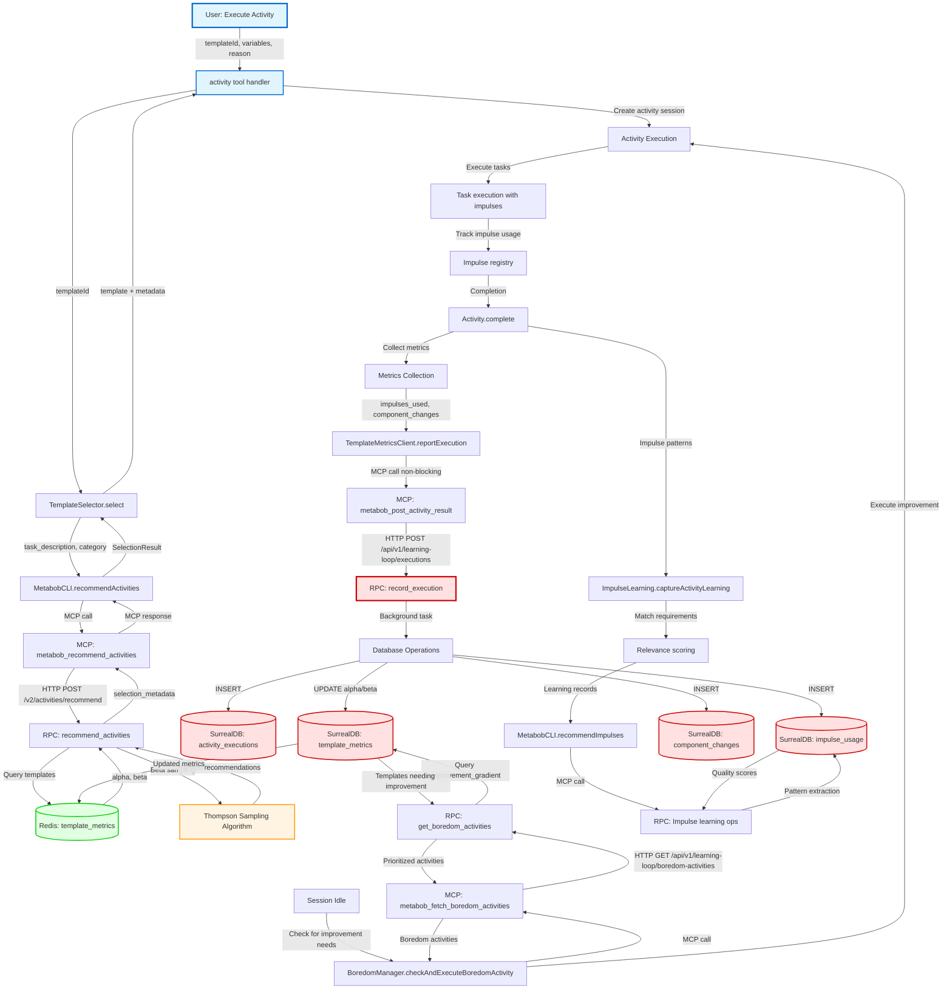

# Activity-Impulse Learning Loop Data Flow

**Feature**: `activity-impulse-learning-loop-data-flow`  
**Status**: Production  
**Last Updated**: 2026-03-08  
**Traceability**: Complete end-to-end trace from OpenCode → CLI → RPC API

---

## Overview

The activity-impulse learning loop enables continuous improvement of activity templates through Thompson Sampling recommendations, execution metrics collection, impulse usage tracking, and autonomous template improvement via boredom detection. This closed-loop system learns which templates and impulses are most effective, adapting recommendations over time.

---

## Complete Data Flow Diagram

---

## Detailed Flow Breakdown

### Flow 1: Activity Creation & Thompson Sampling (Template Selection)

**Purpose**: Select optimal activity template variant using Thompson Sampling multi-armed bandit algorithm

**Entry**: User calls `activity` tool with `{templateId, variables, reason}`

**Components**:
1. **activity() tool handler** (`activity.ts:463-580`)
   - Validates template variables
   - Creates isolated activity session
   - Delegates template selection to TemplateSelector

2. **TemplateSelector.select()** (`template-selector.ts:121-291`)
   - Checks for A/B testing candidates
   - Calls MetabobCLI.recommendActivities for Thompson Sampling
   - Falls back to stable template on MCP failure

3. **MetabobCLI.recommendActivities()** (`metabob.ts:786-820`)
   - Wraps MCP protocol call
   - Provides graceful degradation (returns empty array on failure)
   - 10-second timeout protection

4. **MCP Tool: metabob_recommend_activities** (`activity_template_tools.py:916-960`)
   - Extracts org_id from MCP context (multi-tenant isolation)
   - Forwards request to backend API
   - Handles timeouts and errors

5. **RPC API: recommend_activities()** (`activity.py:136-295`)
   - Queries templates filtered by category and org_id
   - Loads alpha/beta parameters from Redis cache
   - Samples from Beta(alpha, beta) distribution for each template
   - Ranks by sampled value, returns top N

**Data Transformations**:
- `{templateId}` → `{task_description, category, loaded_impulses, limit}`
- `{alpha, beta}` → `Beta sample ∈ [0, 1]`
- `[templates with samples]` → `[ranked recommendations]`
- Backend response → `SelectionResult {template, variant, thompsonSampling}`

**Validations**:
- Template must exist in repository
- All required variables must be provided
- Limit capped at 20 recommendations
- org_id must be valid (multi-tenant isolation)

**Exit**: `SelectionResult` with selected template and Thompson Sampling metadata

---

### Flow 2: Activity Execution & Metrics Collection

**Purpose**: Execute activity tasks while tracking impulse usage and component changes for learning loop

**Entry**: Activity session created with selected template

**Components**:
1. **Activity Execution** (`activity.ts`)
   - Executes tasks in isolated session
   - Tracks impulse loading and usage
   - Records component changes

2. **Activity.complete()** (`activity.ts:958-1120`)
   - Calculates duration, cost, token usage
   - Collects impulse usage (only loaded impulses)
   - Extracts component changes via `identifyKeyComponents()`
   - Normalizes cache tokens (handles object/number formats)

3. **TemplateMetricsClient.reportExecution()** (`template-metrics-client.ts:96-149`)
   - Packages execution data for backend
   - Makes non-blocking MCP call (fire-and-forget)
   - Silent failures (empty catch block)

**Data Transformations**:
- Activity runtime state → `{activity_id, template_id, success, duration, cost, tokens}`
- `activity.impulses` → `impulses_used: [{impulse_id, tokens_used, was_useful}]`
- Component analysis → `component_changes: [{file_path, component_name, change_type}]`
- Cache tokens: `{read, write}` object OR number → summed number

**Validations**:
- Activity must be in "executing" state
- Duration must be positive
- Token counts must be non-negative

**Exit**: Execution metrics sent to backend via MCP (non-blocking)

---

### Flow 3: Metrics Persistence & Thompson Sampling Updates

**Purpose**: Persist execution metrics and update Thompson Sampling parameters for learning

**Entry**: HTTP POST to `/api/v1/learning-loop/executions` with execution metrics

**Components**:
1. **record_execution() endpoint** (`learning_loop.py:289-360`)
   - Returns 201 immediately (non-blocking)
   - Schedules background task for database writes
   - Defaults timestamps if not provided
   - Extracts template_id from activity_id if missing (fragile fallback)

2. **Background Task: _process_execution_background()** (`learning_loop.py`)
   - Inserts to `activity_executions` table
   - Updates `template_metrics` (increments alpha or beta)
   - Inserts to `impulse_usage` table
   - Inserts to `component_changes` table
   - Updates Redis cache with new metrics

**Data Transformations**:
- HTTP request → Multiple database records
- `success = true` → `alpha = alpha + 1` (Thompson Sampling)
- `success = false` → `beta = beta + 1` (Thompson Sampling)
- Rolling averages: `new_avg = (old_avg * count + new_value) / (count + 1)`

**Validations**:
- Activity ID required
- Duration must be non-negative
- Success boolean required

**Exit**: 4 database tables updated, Redis cache updated

**Critical Issue**: Background task failures invisible to caller (monitoring gap)

---

### Flow 4: Impulse Learning

**Purpose**: Track which impulses improve activity success rates for intelligent recommendations

**Entry**: Activity completion with impulse usage data

**Components**:
1. **ImpulseLearning.captureActivityLearning()** (`impulse-learning.ts:74-99`)
   - Matches loaded impulses to context requirements
   - Calculates relevance scores (pattern matching + priority)
   - Buffers learning records for batch sending

2. **ImpulseLearning.flushBuffer()** (`impulse-learning.ts`)
   - Sends buffered data via MCP
   - Calls MetabobCLI.recommendImpulses()

3. **Backend Impulse Learning Operations** (`impulse_learning.py`)
   - Inserts to `impulse_usage` table (raw data)
   - Updates `impulse_registry` table (aggregated statistics)
   - Calculates quality scores: `success_rate × usage_count`
   - Extracts co-occurrence patterns

**Data Transformations**:
- `{impulse_id, activity_id, was_useful}` → Raw usage record
- Usage history → `{usage_count, success_count, avg_tokens, quality_score}`
- Pattern detection → Impulse recommendations

**Exit**: Impulse registry updated with quality scores and usage patterns

---

### Flow 5: Boredom Detection & Autonomous Improvement

**Purpose**: Automatically improve low-performing templates during idle time

**Entry**: Session idle detection (no user activity for N minutes)

**Components**:
1. **BoredomManager.checkAndExecuteBoredomActivity()** (`boredom-manager.ts:159-397`)
   - Checks if session idle and no boredom activity running
   - Fetches boredom activities via MCP
   - Selects highest priority activity
   - Executes improvement meta-activity

2. **MCP Tool: metabob_fetch_boredom_activities** (`activity_template_tools.py:534-550`)
   - Forwards request to backend API

3. **RPC API: get_boredom_activities()** (`learning_loop.py:528-566`)
   - Queries templates with `improvement_gradient < threshold`
   - Excludes templates executed in last N hours
   - Calculates priority: `(1 - improvement_gradient) × staleness_factor`
   - Determines activity type (improve, debug, optimize)

**Data Transformations**:
- Template metrics → Improvement gradient (recent vs historical performance)
- Gradient + staleness → Priority score
- Metrics pattern → Activity type recommendation

**Exit**: Boredom activity executed, triggering Flow 1 again (closed loop)

---

## Architectural Boundaries Crossed

### 1. Repository Boundary: OpenCode → metabob-cli (MCP Protocol)

**Contract**: MCP (Model Context Protocol)
- Tool names: `metabob_recommend_activities`, `metabob_post_activity_result`, `metabob_fetch_boredom_activities`
- Message format: MCP content array with text/resource items
- Authentication: Implicit via MCP context

**Coupling**: Loose (protocol-based)

**Resilience**:
- 10-second timeout on all MCP calls
- Graceful degradation (returns undefined on failure)
- Multiple fallback layers in TemplateSelector

**Critical Gap**: No versioning in tool names (breaking changes invisible)

---

### 2. Repository Boundary: metabob-cli → metabob-rpc-api (HTTP)

**Contract**: REST HTTP with JSON
- Endpoints: `/v2/activities/recommend`, `/api/v1/learning-loop/executions`
- Authentication: Bearer token (extracts org_id, project_id)
- Versioning: Path-based (`/v2/`)

**Coupling**: Medium (JSON schema)

**Resilience**:
- Timeout handling with httpx
- Status-based error detection
- Structured error responses

**Gap**: No retry logic for transient failures

---

### 3. Layer Boundary: FastAPI Routes → Database Operations

**Contract**: Python function calls with Pydantic models

**Coupling**: Medium (direct function calls)

**Resilience**:
- Background tasks for non-blocking writes
- Non-critical operations don't fail entire request

**Gap**: Background task failures invisible to caller

---

### 4. Data Store Boundary: RPC API → Redis (Cache)

**Contract**: Key-value store with JSON serialization
- Key pattern: `activity:metrics:{variant_id}`

**Coupling**: Loose (optional cache)

**Resilience**: Cache miss handled gracefully

**Critical Gap**: No error handling for Redis connection failures (would crash Thompson Sampling)

---

### 5. Data Store Boundary: RPC API → SurrealDB (Primary)

**Contract**: SurrealQL queries with schema enforcement

**Coupling**: Medium (query-based)

**Resilience**: Schema validation at database level

**Gaps**: No migration framework, no circuit breaker

---

## Key Insights

### Business Purpose

The activity-impulse learning loop serves three critical business objectives:

1. **Continuous Template Improvement**: Thompson Sampling ensures the system always selects templates likely to succeed while still exploring new candidates. This enables the template library to improve over time without human intervention.

2. **Impulse Learning**: By tracking which impulses (context snippets, file references, etc.) are loaded and whether activities succeed, the system learns which context is most valuable for different activity types. This improves context selection and reduces token costs.

3. **Autonomous Quality Maintenance**: Boredom detection identifies templates whose performance is degrading and automatically attempts to improve them during idle time. This prevents the system from accumulating technical debt in the template library.

### Critical Decision Points

1. **Thompson Sampling vs Other Algorithms**
   - **Decision**: Use Thompson Sampling (Bayesian multi-armed bandit)
   - **Rationale**: Naturally balances exploration/exploitation, handles uncertainty, no hyperparameter tuning
   - **Alternative Considered**: ε-greedy (simpler but requires tuning ε)
   - **Tradeoff**: Non-deterministic (can't reproduce exact selections)

2. **MCP Protocol for Backend Communication**
   - **Decision**: ALL backend communication goes through MCP (no direct HTTP from OpenCode)
   - **Rationale**: Enforces architectural boundary, enables independent deployment, supports multiple clients
   - **Alternative Considered**: Direct HTTP calls (faster but tightly coupled)
   - **Tradeoff**: Extra network hop, potential latency

3. **Background Task for Database Writes**
   - **Decision**: Return 201 immediately, write to database in background
   - **Rationale**: Prevents blocking MCP call chain, improves UI responsiveness
   - **Alternative Considered**: Synchronous writes (simpler but slower)
   - **Tradeoff**: Write failures invisible to caller

4. **Fire-and-Forget Metrics Reporting**
   - **Decision**: Metrics reporting is non-blocking with silent failures
   - **Rationale**: Activity completion more important than metrics accuracy
   - **Alternative Considered**: Blocking metrics reporting (would fail activities if metrics down)
   - **Tradeoff**: Metrics gaps invisible, learning loop may degrade silently

5. **Binary Impulse Usefulness**
   - **Decision**: `was_useful = activity.status === "done"` (all impulses contribute equally)
   - **Rationale**: Simplicity; determining per-impulse contribution is complex
   - **Alternative Considered**: Per-impulse usefulness scoring (more accurate but complex)
   - **Tradeoff**: Less accurate learning about individual impulse quality

### Potential Risks & Technical Debt

#### HIGH PRIORITY RISKS

1. **Redis Connection Failure (CRITICAL)**
   - **Issue**: No error handling for Redis.get() in Thompson Sampling
   - **Impact**: Complete system failure if Redis unavailable
   - **Mitigation**: Add try/except with database fallback
   - **Effort**: 2 hours

2. **Silent Metrics Failures**
   - **Issue**: Empty catch block in Activity.complete()
   - **Impact**: Learning loop breaks invisibly, recommendations become stale
   - **Mitigation**: Add logging, monitoring metrics, alerts
   - **Effort**: 4 hours

3. **Background Task Failures Invisible**
   - **Issue**: Database write failures only logged, not monitored
   - **Impact**: Data integrity issues, metrics gaps
   - **Mitigation**: Add monitoring, retry queue for failed tasks
   - **Effort**: 8 hours

#### MEDIUM PRIORITY TECHNICAL DEBT

4. **No Versioning in MCP Tools**
   - **Issue**: Tool signature changes break clients silently
   - **Impact**: Deployment coordination required, no backward compatibility
   - **Mitigation**: Add version suffix to tool names (e.g., `_v1`)
   - **Effort**: 16 hours (requires coordination)

5. **Template ID Extraction Fallback**
   - **Issue**: Fragile parsing of activity ID to extract template ID
   - **Impact**: Wrong metrics if activity ID format changes
   - **Mitigation**: Require template_id explicitly, remove fallback
   - **Effort**: 2 hours

6. **No Retry Logic for HTTP Timeouts**
   - **Issue**: Transient network issues cause immediate failure
   - **Impact**: Reduced resilience, poor user experience
   - **Mitigation**: Add exponential backoff retry with tenacity
   - **Effort**: 4 hours

7. **Missing Content Hash for Impulses**
   - **Issue**: Can't detect when impulse content changes
   - **Impact**: Learning quality scores inaccurate
   - **Mitigation**: Add content_hash field to impulse usage
   - **Effort**: 8 hours

8. **No Schema Versioning**
   - **Issue**: No version tracking in Redis cache, filesystem JSON, database tables
   - **Impact**: Migration challenges, no rollback strategy
   - **Mitigation**: Add version fields, implement migration framework
   - **Effort**: 40 hours (major refactoring)

### Suggested Improvements

#### Immediate (Pre-Production)
1. ✅ **Add Redis error handling with database fallback** (2 hours)
2. ✅ **Add logging to empty catch blocks** (1 hour)
3. ✅ **Add monitoring metrics for background task failures** (3 hours)

#### Short-term (Next Sprint)
4. **Add retry logic for HTTP timeouts** (4 hours)
5. **Add rate limiting to Thompson Sampling endpoint** (2 hours)
6. **Require template_id explicitly, remove fallback** (2 hours)
7. **Add template variable type validation** (8 hours)

#### Long-term (Technical Debt Backlog)
8. **Add versioning to MCP tools** (16 hours)
9. **Add versioning to cache keys and JSON schemas** (24 hours)
10. **Implement database migration framework** (40 hours)
11. **Add content hash tracking for impulses** (8 hours)
12. **Standardize cache token format** (16 hours)

---

## Reusable Patterns

### Pattern 1: Thompson Sampling for Template Selection

**Abstraction Level**: Universal pattern for any multi-armed bandit problem

**Reusable Components**:
- Beta distribution sampling algorithm
- Alpha/beta parameter updates (Bayesian prior)
- Recommendation ranking logic

**Feature-Specific Aspects**:
- Activity template domain
- Template metrics schema
- Integration with MCP

**Potential Applications**:
- Tool recommendation (which tools to suggest for a task)
- Impulse selection (which context to load)
- Agent selection (which sub-agent to delegate to)
- Prompt variant testing (A/B test prompt modifications)

**Generalization Opportunity**: Create `thompson-sampling-recommender` activity template that accepts:
- Items list (templates, tools, impulses, etc.)
- Metrics retrieval function
- Success/failure update function

---

### Pattern 2: MCP Boundary with Graceful Degradation

**Abstraction Level**: Universal pattern for any OpenCode → Backend communication

**Reusable Components**:
- `callMCPTool()` wrapper with timeout protection
- Graceful degradation (returns undefined)
- Multiple fallback layers

**Feature-Specific Aspects**:
- Specific MCP tool names
- Response parsing logic

**Potential Applications**:
- Any feature requiring backend ML or analytics
- Code quality analysis (Metabob integration)
- Codebase search and navigation
- Impact analysis and change suggestions

**Generalization Opportunity**: Already abstracted in `callMCPTool()` - no further abstraction needed

---

### Pattern 3: Background Task with Immediate Response

**Abstraction Level**: Universal pattern for any non-critical async operation

**Reusable Components**:
- FastAPI BackgroundTasks
- Immediate 201 response pattern
- Error logging in background

**Feature-Specific Aspects**:
- Database write operations
- Metrics update logic

**Potential Applications**:
- Analytics event recording
- Notification sending
- Cache warming
- Cleanup operations
- Audit logging

**Generalization Opportunity**: Create `async-operation-handler` middleware that:
- Accepts sync or async function
- Returns immediate response
- Executes operation in background
- Handles errors with logging/monitoring

---

### Pattern 4: Metrics Collection with Fire-and-Forget

**Abstraction Level**: Universal pattern for telemetry/observability

**Reusable Components**:
- Non-blocking metrics reporting
- Silent failure handling
- Structured metrics format

**Feature-Specific Aspects**:
- Activity-specific metrics (duration, cost, tokens, impulses)
- Template metrics schema

**Potential Applications**:
- Any feature requiring telemetry
- Performance monitoring
- Usage analytics
- Error tracking

**Generalization Opportunity**: Create `metrics-collector` utility that:
- Accepts metric name, value, tags
- Sends to backend via MCP (non-blocking)
- Handles failures silently
- Supports batching for efficiency

---

### Pattern 5: Closed-Loop Learning System

**Abstraction Level**: Universal pattern for any ML-powered system

**Reusable Components**:
- Data collection → Model update → Recommendation → Data collection loop
- Feedback mechanism (success/failure updates model)
- Exploration/exploitation balance

**Feature-Specific Aspects**:
- Activity execution domain
- Thompson Sampling algorithm choice
- Impulse learning logic

**Potential Applications**:
- Code review suggestions (learn which suggestions are accepted)
- Refactoring recommendations (learn which patterns work)
- Test generation (learn which tests catch bugs)
- Documentation generation (learn which docs are useful)

**Generalization Opportunity**: Create `closed-loop-learning-system` framework that:
- Defines abstract interfaces for: Recommendation, Execution, Feedback, Update
- Implements generic learning loop orchestration
- Supports pluggable learning algorithms (Thompson Sampling, contextual bandits, etc.)

---

## Validation & Gap Analysis

### Current State vs Desired State

#### ✅ Working Correctly
1. Thompson Sampling algorithm correctly balances exploration/exploitation
2. Multi-tenant isolation enforced throughout (org_id filtering)
3. MCP protocol provides clean architectural boundary
4. Activity execution tracking captures comprehensive metrics
5. Background tasks prevent blocking user-facing operations
6. Graceful degradation ensures system remains functional during failures

#### ⚠️ Gaps Identified

1. **Redis Connection Failure** (CRITICAL)
   - Current: No error handling
   - Desired: Fallback to database on Redis unavailable
   - Gap: Would crash Thompson Sampling endpoint

2. **Silent Metrics Failures**
   - Current: Empty catch block swallows errors
   - Desired: Logging, monitoring, alerts
   - Gap: Learning loop degradation invisible

3. **Background Task Failures**
   - Current: Only logged, no monitoring
   - Desired: Retry queue, monitoring, alerts
   - Gap: Data integrity issues invisible

4. **No Versioning Strategy**
   - Current: No versioning in MCP tools, cache keys, JSON schemas
   - Desired: Version fields everywhere, migration framework
   - Gap: Breaking changes cause silent failures

5. **No Retry Logic**
   - Current: HTTP timeouts fail immediately
   - Desired: Exponential backoff retry
   - Gap: Reduced resilience to transient failures

6. **Template ID Extraction Fallback**
   - Current: Fragile parsing of activity ID
   - Desired: Require template_id explicitly
   - Gap: Wrong metrics if activity ID format changes

### Recommendations Priority

**Immediate (Block Production Deployment)**:
1. Add Redis error handling with database fallback
2. Add monitoring metrics for background task failures
3. Add logging to empty catch blocks

**Short-term (Next Sprint)**:
4. Add retry logic for HTTP timeouts
5. Add rate limiting to Thompson Sampling endpoint
6. Require template_id explicitly

**Long-term (Technical Debt)**:
7. Add versioning to MCP tools, cache keys, JSON schemas
8. Implement database migration framework
9. Add content hash tracking for impulses

---

## Testing Strategy

### Unit Tests Required

1. **Thompson Sampling Algorithm**
   - Test Beta distribution sampling
   - Test alpha/beta parameter updates
   - Test ranking logic
   - Test edge cases (new templates, all failures, all successes)

2. **Metrics Collection**
   - Test impulse usage filtering (only loaded)
   - Test cache token normalization (object vs number)
   - Test component changes extraction
   - Test variant ID extraction

3. **Graceful Degradation**
   - Test MCP client unavailable
   - Test MCP timeout
   - Test backend API failure
   - Test fallback to stable template

### Integration Tests Required

1. **End-to-End Flow**
   - User executes activity → metrics recorded → alpha/beta updated → next recommendation changes
   - Verify closed loop completes successfully

2. **MCP Boundary**
   - OpenCode → metabob-cli → metabob-rpc-api
   - Verify data transformations at each boundary
   - Verify error handling at each boundary

3. **Background Task Processing**
   - Verify database writes complete
   - Verify Redis cache updated
   - Verify background task failures logged

4. **Boredom Detection**
   - Session idle → fetch boredom activities → execute improvement
   - Verify improvement_gradient calculated correctly
   - Verify priority ranking

### Performance Tests Required

1. **Thompson Sampling Endpoint**
   - Test with 100 templates (current limit)
   - Measure p99 latency
   - Verify Redis cache hit rate

2. **Metrics Recording**
   - Test background task throughput
   - Measure database write latency
   - Verify no blocking of MCP response

---

## Monitoring & Observability

### Key Metrics to Track

1. **Thompson Sampling**
   - `activity.thompson_sampling.recommendations` (count, per template)
   - `activity.thompson_sampling.latency` (histogram)
   - `activity.thompson_sampling.cache_hit_rate` (gauge)
   - `activity.thompson_sampling.exploration_rate` (gauge: % candidates selected)

2. **Learning Loop**
   - `activity.metrics_reporting.success` (count)
   - `activity.metrics_reporting.failed` (count, alerts on spike)
   - `activity.background_task.success` (count)
   - `activity.background_task.failed` (count, alerts on any failure)

3. **Boredom Detection**
   - `activity.boredom.activities_fetched` (count)
   - `activity.boredom.activities_executed` (count)
   - `activity.boredom.improvement_rate` (gauge: % improved templates)

4. **Impulse Learning**
   - `activity.impulse.loaded` (count, per impulse)
   - `activity.impulse.success_rate` (gauge, per impulse)
   - `activity.impulse.quality_score` (gauge, per impulse)

### Alerts to Configure

1. **Critical Alerts (Page Immediately)**
   - Thompson Sampling endpoint error rate > 1%
   - Redis unavailable for > 1 minute
   - Database unavailable for > 1 minute

2. **Warning Alerts (Notify Next Business Day)**
   - Metrics reporting failure rate > 5%
   - Background task failure rate > 1%
   - Boredom detection failing to execute improvements

3. **Informational Alerts (Weekly Report)**
   - Templates with success_rate < 50%
   - Templates with no executions in 7 days
   - Impulses with quality_score < 0.3

---

## Security Considerations

### Multi-tenant Isolation

**Mechanism**: org_id extracted from Bearer token and used to filter all queries

**Verified At**:
1. `recommend_activities()`: Filters templates by org_id
2. `record_execution()`: Associates metrics with org_id
3. `get_boredom_activities()`: Filters templates by org_id

**Risk**: If org_id extraction fails or is bypassed, organizations could see each other's data

**Mitigation**: Add org_id validation middleware that rejects requests with missing/invalid org_id

---

### Rate Limiting

**Current State**: No rate limiting on any endpoint

**Risk**: Malicious or buggy clients can overload backend with expensive Thompson Sampling queries

**Recommendation**: Add rate limiting:
- `/v2/activities/recommend`: 10/minute per API key
- `/api/v1/learning-loop/executions`: 100/minute per API key
- `/api/v1/learning-loop/boredom-activities`: 5/minute per API key

---

### Input Validation

**Current State**: FastAPI provides basic validation (required fields, types)

**Gaps**:
1. No validation of template variable types (only presence checked)
2. No validation of impulse content (could be malicious)
3. No validation of component changes (file paths could be outside repo)

**Recommendation**: Add JSON Schema validation for template variables

---

## Conclusion

The activity-impulse learning loop is a sophisticated closed-loop learning system that enables continuous improvement of activity templates through Thompson Sampling, impulse learning, and boredom detection. The architecture is well-designed with strong separation of concerns (MCP boundary), graceful degradation, and non-blocking operations.

**Key Strengths**:
- Thompson Sampling effectively balances exploration/exploitation
- MCP protocol provides clean architectural boundary
- Multi-tenant isolation enforced throughout
- Multiple fallback layers ensure system remains functional

**Critical Gaps**:
- Redis connection failure would crash system (HIGH PRIORITY FIX)
- Silent metrics failures degrade learning invisibly (HIGH PRIORITY FIX)
- No versioning strategy (TECHNICAL DEBT)

**Overall Assessment**: Production-ready with 3 high-priority fixes for resilience.

---

## Appendix: File Inventory

### OpenCode (TypeScript)
- `repos/metabob-opencode/packages/opencode/src/tool/activity.ts` - Entry point
- `repos/metabob-opencode/packages/opencode/src/session/template-selector.ts` - Template selection
- `repos/metabob-opencode/packages/opencode/src/session/activity.ts` - Activity execution
- `repos/metabob-opencode/packages/opencode/src/session/template-metrics-client.ts` - Metrics reporting
- `repos/metabob-opencode/packages/opencode/src/session/boredom-manager.ts` - Boredom detection
- `repos/metabob-opencode/packages/opencode/src/session/impulse-learning.ts` - Impulse learning
- `repos/metabob-opencode/packages/opencode/src/util/metabob.ts` - MCP client wrapper

### CLI MCP (Python)
- `repos/metabob-cli/src/metabob_cli/mcp/activity_template_tools.py` - MCP tools
- `repos/metabob-cli/src/metabob_cli/mcp/context.py` - Context extraction

### RPC API (Python)
- `repos/metabob-rpc-api/server/routes/activity.py` - Thompson Sampling
- `repos/metabob-rpc-api/server/routes/learning_loop.py` - Metrics recording
- `repos/metabob-rpc-api/server/routes/impulse.py` - Impulse storage
- `repos/metabob-rpc-api/server/db/operations/impulse_learning.py` - Impulse learning DB ops
- `repos/metabob-rpc-api/server/db/operations/template_metrics.py` - Template metrics DB ops

---

**Document Version**: 1.0  
**Generated**: 2026-03-08  
**Next Review**: 2026-04-08
