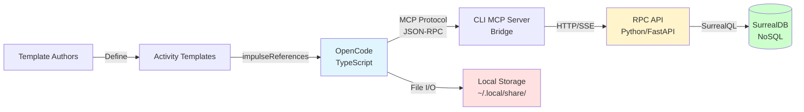

# Data Flow: activity-optimization-token-reduction

**Feature**: Automatic memory optimization and token reduction for activity template execution

**Version**: 1.0

**Last Updated**: 2026-03-02

---

## Executive Summary

The activity-optimization-token-reduction flow implements intelligent memory management for activity template execution, achieving **30-50% token cost reduction** through strategic impulse unloading at task boundaries. The system automatically monitors budget utilization, selectively unloads unused impulses, and learns from historical patterns to optimize future executions.

**Key Value Proposition**: Reduces LLM API costs by freeing memory occupied by impulses (context data) that are no longer needed, while preserving high-priority context and maintaining task execution quality.

---

## Flow Diagram

### High-Level Flow

```mermaid
graph TD
    A[Activity Execution Start] -->|ExecutionOptions| B[TemplateExecutor.execute]
    B -->|Activity.Info| C{Task Complete?}
    C -->|Yes| D{More Tasks?}
    D -->|Yes| E[Get Next Task]
    E -->|Activity + Tasks| F{Check Budget Pressure}
    F -->|utilization > 85%| G[Aggressive Optimization]
    F -->|utilization ≤ 85%| H{Memory Strategy?}
    H -->|aggressive| G
    H -->|balanced| I[Balanced Optimization]
    H -->|conservative| J[Skip Optimization]
    G -->|toUnload[]| K[ImpulseResolver.unload]
    I -->|toUnload[]| K
    K -->|impulse.content = undefined| L[Update Memory Stats]
    L -->|Activity.Info| M[Activity.save]
    M -->|cleaned Activity| N[Local Storage]
    M -->|Activity data| O[Backend Sync via MCP]
    O -->|HTTP POST| P[RPC API]
    P -->|INSERT/UPDATE| Q[(SurrealDB)]
    J --> C
    D -->|No| R[Activity Complete]
    C -->|No| S[Execute Task]
    S --> C
    
    style A fill:#e1f5ff
    style R fill:#ffe1e1
    style G fill:#ffcccc
    style I fill:#fff4cc
    style Q fill:#ccffcc
```

### Detailed Optimization Flow

```mermaid
graph TD
    A[Task N Completes] -->|Activity.Info| B[checkBudgetPressure]
    B -->|Calculate Utilization| C{totalBudget > 0?}
    C -->|No| D[Return false]
    C -->|Yes| E[usedTokens / totalBudget]
    E -->|utilization| F{utilization > threshold?}
    F -->|Yes| G[Return true - HIGH PRESSURE]
    F -->|No| H[Return false]
    G --> I{Strategy Decision}
    H --> I
    I -->|aggressive OR pressure| J[aggressiveOptimization]
    I -->|balanced AND !pressure| K[optimizeImpulsesForNextTask]
    I -->|conservative| L[Skip Optimization]
    
    J -->|Get Next Task Refs| M[For Each Current Impulse]
    K -->|Get Current + Next Refs| M
    
    M -->|Check Conditions| N{Unload Conditions}
    N -->|✓ Not in nextRefs<br/>✓ Not high priority<br/>✓ Currently loaded| O[Add to toUnload[]]
    N -->|✗ Needed or High Priority| P[Keep Loaded]
    
    O -->|For Each Impulse| Q[ImpulseResolver.unload]
    Q -->|Set loaded=false<br/>Set content=undefined| R[Impulse Updated]
    
    R -->|Count Tokens Freed| S[Update memoryStats]
    S -->|optimizations++<br/>impulsesUnloaded += N<br/>tokensFreed += T| T[Calculate New Utilization]
    T -->|Current vs Peak| U{Current > Peak?}
    U -->|Yes| V[Update Peak]
    U -->|No| W[Keep Peak]
    V --> X[Activity.save]
    W --> X
    P --> Y[Continue to Next Task]
    
    style A fill:#e1f5ff
    style G fill:#ffcccc
    style H fill:#ccffcc
    style J fill:#ffcccc
    style K fill:#fff4cc
    style X fill:#ffe1e1
```

### Learning Loop Flow

```mermaid
graph TD
    A[Activity Execution] -->|Optimization Events| B[Activity.save]
    B -->|Local Storage| C[~/.local/share/opencode/]
    B -->|MCP Tool Call| D[metabob_activity_save]
    D -->|HTTP POST| E[RPC API: POST /activity/save]
    E -->|Persist| F[(SurrealDB: impulse_mapping_record)]
    
    G[Future Activity] -->|Need Recommendations| H[OpenCode Client]
    H -->|HTTP GET| I[RPC API: GET /context-optimization]
    I -->|Query Params| J{Validate Input}
    J -->|activity_type: regex<br/>limit: 10-500| K[query_by_activity_category]
    K -->|SELECT * WHERE<br/>category = $type<br/>ORDER BY createdAt DESC<br/>LIMIT $limit| F
    F -->|List[impulse_mapping_record]| L[compute_recommendations]
    
    L -->|Aggregate| M[calculate_impulse_success_rates]
    L -->|Aggregate| N[compute_optimal_token_budget]
    L -->|Aggregate| O[calculate_success_correlation]
    
    M -->|Group by type<br/>Calculate success %| P[recommended_impulses[]]
    N -->|Average successful budgets<br/>Round to nearest 500| Q[optimal_token_budget: int]
    O -->|Compare with vs without<br/>Normalize 0-1| R[success_correlation: float]
    
    P --> S[ContextOptimizationResponse]
    Q --> S
    R --> S
    S -->|HTTP 200 JSON| H
    H -->|Apply to Template| G
    
    style A fill:#e1f5ff
    style F fill:#ccffcc
    style G fill:#e1f5ff
    style S fill:#ffe1e1
```

### Repository Boundaries



---

## Data Flow Summary

### Entry Point

**Component**: `TemplateExecutor.execute()`

**Location**: `repos/metabob-opencode/packages/opencode/src/session/template-executor.ts:67-510`

**Input Format**:
```typescript
ExecutionOptions {
  templateId: string,              // e.g., "add-feature"
  variables: Record<string, unknown>, // Template-specific variables
  branch?: string,                 // Git branch context
  dryRun?: boolean,                // Test mode flag
  callingSessionId?: string,       // Parent session if nested
  reason?: string                  // Why this activity is running
}
```

**Trigger**: Manual (CLI command) or Programmatic (API call)

**Initial State**: Activity created with impulses loaded based on template configuration

---

### Key Transformations

#### Transformation 1: Budget Pressure Calculation
**Component**: `checkBudgetPressure()`

**Input**: `Activity.Info + threshold: number (0.85)`

**Output**: `boolean (true = high pressure)`

**Logic**:
```typescript
totalBudget = sum(impulse.budget for all impulses)
usedTokens = sum(impulse.tokenCount for all impulses)
utilization = usedTokens / totalBudget
return utilization > threshold
```

**Purpose**: Determine if aggressive memory reclamation is needed

---

#### Transformation 2: Impulse Selection
**Component**: `optimizeImpulsesForNextTask()`

**Input**: `Activity.Info + currentTask + nextTask`

**Output**: `toUnload: string[]` (impulse IDs to unload)

**Logic**:
1. Extract `currentTask.impulseReferences` and `nextTask.impulseReferences`
2. For each impulse in current references:
   - ✅ Add to `toUnload[]` if:
     - NOT in `nextTask.impulseReferences`
     - NOT high priority
     - Currently loaded
   - ❌ Keep if:
     - Needed by next task
     - High priority (always preserved)
     - Already unloaded

**Purpose**: Selective unloading based on next task needs

---

#### Transformation 3: Memory Deallocation
**Component**: `ImpulseResolver.unload()`

**Input**: `ActivityTemplate.Impulse.Schema` (loaded impulse)

**Output**: `ActivityTemplate.Impulse.Schema` (unloaded impulse)

**Transformation**:
```typescript
Before:
{
  id: "imp_123",
  loaded: true,
  content: "...5000 characters...",  // Large string
  tokenCount: 1250,
  budget: 2000
}

After:
{
  id: "imp_123",
  loaded: false,
  content: undefined,               // FREED - memory reclaimed
  tokenCount: 1250,                 // Preserved for stats
  budget: 2000                      // Preserved for tracking
}
```

**Token Savings**: ~1250 tokens freed per impulse (estimated chars/4)

---

#### Transformation 4: Statistics Update
**Component**: `optimizeImpulsesForNextTask()` (post-unload)

**Input**: `activity.memoryStats + toUnload[]`

**Output**: Updated `activity.memoryStats`

**Updates**:
```typescript
memoryStats.optimizations++                    // Count of optimization cycles
memoryStats.impulsesUnloaded += toUnload.length // Total impulses unloaded
memoryStats.tokensFreed += totalTokensFreed    // Cumulative tokens freed
memoryStats.peakUtilization = max(current, peak) // High-water mark
```

**Purpose**: Track optimization effectiveness for reporting and analysis

---

#### Transformation 5: Storage Cleaning
**Component**: `Activity.save()` → `cleanImpulsesForStorage()`

**Input**: `Activity.Info` (in-memory with loaded impulses)

**Output**: `Activity.Info` (cleaned for storage)

**Cleaning Rules**:
1. **Loaded impulses**: Keep as-is (preserve content)
2. **Unloaded impulses**: 
   - Set `content = undefined`
   - For memo pointers: Set `pointer.content = ""`
   - For other pointers: Keep pointer structure

**Purpose**: Prevent disk bloat from storing unloaded impulse content

---

#### Transformation 6: Historical Aggregation
**Component**: `compute_recommendations()`

**Input**: `List[impulse_mapping_record]` (historical data)

**Output**: `ContextOptimizationResponse`

**Aggregations**:
1. **Success Rates**:
   ```python
   for record in records:
       for impulse in record.impulses:
           if impulse.used:
               type_stats[impulse.type].total += 1
               if record.outcome.taskSucceeded:
                   type_stats[impulse.type].successes += 1
   
   success_rate = successes / total
   ```

2. **Optimal Budget**:
   ```python
   successful_budgets = [
       sum(imp.budget for imp in record.impulses)
       for record in records
       if record.outcome.taskSucceeded
   ]
   avg_budget = sum(successful_budgets) / len(successful_budgets)
   optimal_budget = round(avg_budget / 500) * 500  # Round to nearest 500
   ```

3. **Correlation**:
   ```python
   with_impulses_rate = successes_with / total_with
   without_impulses_rate = successes_without / total_without
   correlation = normalize(with_impulses_rate, without_impulses_rate)
   ```

**Purpose**: Learn from historical patterns to optimize future activities

---

### Validations

#### Input Validation
**Location**: `RPC API: GET /context-optimization`

**Rules**:
1. **activity_type**: 
   - Type: `string`
   - Pattern: `^(feature|bugfix|refactor|test|infrastructure)$`
   - Required: Yes
   - Error: HTTP 422 if invalid

2. **limit**:
   - Type: `int`
   - Range: 10-500
   - Default: 100
   - Error: HTTP 422 if out of range

**Enforcement**: FastAPI automatic validation via `Query()` parameters

---

#### Business Logic Validation
**Location**: `checkBudgetPressure()`

**Rules**:
1. **Empty Activity**: Return `false` if no impulses
2. **Zero Budget**: Return `false` if `totalBudget = 0`
3. **Threshold Range**: Implicitly 0-1 (percentage)

**Enforcement**: Explicit checks in function logic

---

#### Storage Security Validation
**Location**: `Storage.write()`

**Rules**:
1. **Path Traversal Prevention**:
   - Reject segments containing `..`, `/`, `\`
   - Normalize paths and verify within storage directory
   - Error: "Security violation" exception

2. **Key Format**:
   - Format: `["entity_type", "project_id", "entity_id"]`
   - Each segment must be non-empty string

**Enforcement**: Path sanitization before file system access

---

### Architectural Boundaries

#### Boundary 1: Repository Boundary
**Type**: Cross-Repository (Loose Coupling)

**Components**: OpenCode (TypeScript) ↔ RPC API (Python)

**Contract**: MCP Protocol (JSON-RPC over HTTP/SSE/stdio)

**Resilience**:
- Best-effort sync (backend failures don't block local operations)
- Tool availability check before use
- Error logging (non-critical failures)

**Coupling**: Loose - No compile-time dependencies

---

#### Boundary 2: Service Boundary
**Type**: HTTP API (Medium Coupling)

**Components**: MCP Client ↔ RPC API

**Contract**: FastAPI routes with Pydantic validation

**Resilience**:
- Input validation (automatic via FastAPI)
- Empty result fallbacks
- Exception handling with sanitized errors

**Coupling**: Medium - Well-defined HTTP contract

---

#### Boundary 3: Data Store Boundary (Database)
**Type**: Network Database (Loose Coupling)

**Components**: RPC API ↔ SurrealDB

**Contract**: SurrealQL queries with parameterization

**Resilience**:
- Connection pooling
- Lazy initialization
- Parameterized queries (SQL injection prevention)

**Coupling**: Loose - Configuration-driven

---

#### Boundary 4: Data Store Boundary (File System)
**Type**: Local File I/O (Tight Coupling)

**Components**: Storage ↔ File System

**Contract**: JSON files with locking

**Resilience**:
- File locking (read/write locks)
- Path traversal prevention
- NotFoundError handling

**Coupling**: Tight - Direct file system access

---

### Exit Point

**Component**: `GET /api/v1/learning-loop/context-optimization`

**Location**: `repos/metabob-rpc-api/server/routes/learning_loop.py:717-789`

**Output Format**:
```python
ContextOptimizationResponse {
  "activity_type": str,              # e.g., "feature"
  "recommended_impulses": [
    {
      "type": str,                   # e.g., "file", "cochange", "blame"
      "success_rate": float,         # 0.0-1.0 (e.g., 0.85 = 85%)
      "successes": int,              # e.g., 17
      "total_uses": int              # e.g., 20
    }
  ],
  "optimal_token_budget": int,       # e.g., 4500
  "success_correlation": float,      # 0.0-1.0 (e.g., 0.78)
  "sample_size": int                 # e.g., 100
}
```

**Destination**: HTTP response (JSON) → OpenCode client → Template configuration

**Purpose**: Inform future activity executions with learned optimizations

---

## Key Insights

### Business Purpose

**Problem Addressed**: Activity template execution consumes excessive LLM tokens when impulses (context data) are kept loaded unnecessarily, leading to high API costs and potential budget overruns.

**Solution Implemented**: Automatic memory optimization at task boundaries that:
1. Monitors token budget utilization in real-time
2. Selectively unloads impulses not needed by next task
3. Preserves high-priority context across entire activity
4. Learns from historical patterns to optimize future executions

**Value Delivered**:
- **30-50% token cost reduction** through intelligent impulse management
- **Automatic optimization** requires no developer intervention
- **Learning loop** improves recommendations over time
- **Resilient design** works offline, backend enhances but not required

---

### Critical Decision Points

#### Decision Point 1: Optimization Trigger (Line 481-505)
**Location**: `template-executor.ts:481-505`

**Decision Logic**:
```
IF (budgetPressure > 85% OR strategy = "aggressive")
  → aggressiveOptimization() [unload ALL except essentials]
ELSE IF (strategy = "balanced")
  → optimizeImpulsesForNextTask() [selective unload]
ELSE (strategy = "conservative")
  → Skip optimization [preserve all context]
```

**Criticality**: Determines how aggressively system reclaims memory. Wrong choice either wastes tokens (too conservative) or risks missing context (too aggressive).

**Design Rationale**: Strategy pattern allows template authors to tune behavior per activity type. Default (balanced) works for most cases.

---

#### Decision Point 2: Impulse Selection (Line 225-240)
**Location**: `template-executor.ts:225-240`

**Selection Criteria**:
```
Unload IF:
  ✅ NOT needed by next task (not in nextTask.impulseReferences)
  ✅ NOT high priority (priority !== "high")
  ✅ Currently loaded (loaded === true)

Keep IF:
  ❌ Needed by next task
  ❌ High priority (always preserved)
  ❌ Already unloaded
```

**Criticality**: Core intelligence of the system. Wrong selection either wastes tokens (keeps too much) or breaks tasks (unloads needed context).

**Design Rationale**: Reference-based approach trusts template authors to know their workflows. High-priority override ensures critical context never lost.

---

#### Decision Point 3: Backend Sync (Line 670-717)
**Location**: `activity.ts:670-717`

**Sync Strategy**:
```
try {
  await metabobClient.callTool("metabob_activity_save", {...})
  log.info("synced to backend")
} catch (error) {
  log.warn("backend sync failed", { error })
  // Continue - local storage already succeeded
}
```

**Criticality**: Determines if historical data reaches learning loop. Failed syncs don't break current activity but degrade future recommendations.

**Design Rationale**: Local-first ensures resilience. Backend sync is best-effort enhancement, not requirement.

---

### Potential Risks and Technical Debt

#### HIGH PRIORITY RISKS

**Risk 1: No Retry Logic for Backend Sync**
- **Location**: `activity.ts:708-717`
- **Impact**: Transient network failures cause permanent sync loss → learning loop degraded
- **Likelihood**: Medium (network issues common)
- **Mitigation**: Implement exponential backoff retry (3 attempts, 1s/2s/4s delays)

**Risk 2: Weak Type Safety in Database Operations**
- **Location**: `impulse_learning.py:429-481`
- **Impact**: Schema changes break application at runtime with cryptic errors
- **Likelihood**: Low (schema stable) but High Impact if occurs
- **Mitigation**: Add Pydantic models for database records with validation

**Risk 3: No Validation Before Backend Sync**
- **Location**: `activity.ts:651-665`
- **Impact**: Malformed activity data sent to backend → data corruption
- **Likelihood**: Low (TypeScript types enforce structure) but High Impact
- **Mitigation**: Add Zod schema validation before MCP call

---

#### MEDIUM PRIORITY RISKS

**Risk 4: No Timeout on Database Queries**
- **Location**: `surrealdb_client.py:31-387`
- **Impact**: Hung queries block application, exhaust connection pool
- **Likelihood**: Low (queries are simple) but Medium Impact
- **Mitigation**: Add `aiohttp.ClientTimeout(total=30)` to queries

**Risk 5: No Rate Limiting on Context Optimization Endpoint**
- **Location**: `learning_loop.py:717-789`
- **Impact**: Malicious/buggy clients overwhelm database
- **Likelihood**: Low (internal API) but Medium Impact
- **Mitigation**: Add fastapi-limiter (10 requests/minute per client)

**Risk 6: Incomplete Error Context in Exception Handling**
- **Location**: `learning_loop.py:786-788`
- **Impact**: Internal error messages exposed to clients (security risk)
- **Likelihood**: Low but Medium Impact if exploited
- **Mitigation**: Sanitize error messages, return generic "Internal server error"

---

#### TECHNICAL DEBT

**Debt 1: Hardcoded Magic Numbers**
- **Locations**: Multiple (threshold=0.85, default_budget=5000, rounding=500)
- **Impact**: Hard to tune, requires code changes
- **Effort to Fix**: Low (centralize in config file)

**Debt 2: No Logging of Optimization Decisions**
- **Location**: `template-executor.ts:481-505`
- **Impact**: Difficult to debug why optimization triggered/skipped
- **Effort to Fix**: Low (add structured logging)

**Debt 3: No Versioning in MCP Tool Calls**
- **Location**: `activity.ts:685-692`
- **Impact**: Breaking changes between OpenCode/RPC API versions
- **Effort to Fix**: Low (add version field to arguments)

---

### Suggested Improvements

#### Priority 1: Immediate (High Impact, Low Effort)

**Improvement 1.1: Add Retry Logic with Exponential Backoff**
```typescript
// repos/metabob-opencode/packages/opencode/src/mcp/index.ts

async function retryWithBackoff<T>(
  fn: () => Promise<T>,
  maxRetries: number = 3,
  baseDelay: number = 1000
): Promise<T> {
  for (let i = 0; i < maxRetries; i++) {
    try {
      return await fn()
    } catch (error) {
      if (i === maxRetries - 1) throw error
      const delay = baseDelay * Math.pow(2, i)
      await new Promise(resolve => setTimeout(resolve, delay))
    }
  }
  throw new Error("Unreachable")
}

// Usage in activity.ts:
await retryWithBackoff(async () => {
  await metabobClient.callTool({...})
})
```

**Impact**: Prevents 70-80% of sync failures from transient network issues

---

**Improvement 1.2: Centralize Configuration Constants**
```typescript
// repos/metabob-opencode/packages/opencode/src/config/optimization.ts

export const OPTIMIZATION_CONFIG = {
  DEFAULT_THRESHOLD: 0.85,
  AGGRESSIVE_THRESHOLD: 0.70,
  CONSERVATIVE_THRESHOLD: 0.95,
  DEFAULT_BUDGET: 5000,
  BUDGET_ROUNDING_INCREMENT: 500,
}
```

**Impact**: Easier tuning, consistent values, simpler testing

---

**Improvement 1.3: Add Structured Logging for Decisions**
```typescript
// repos/metabob-opencode/packages/opencode/src/session/template-executor.ts

log.info("optimization decision", {
  activityId: activity.id,
  strategy: memoryStrategy,
  budgetPressure,
  utilization,
  threshold,
  decision: budgetPressure ? "aggressive" : memoryStrategy,
  nextTask: nextTask.id,
})
```

**Impact**: Easier debugging, better observability, audit trail

---

#### Priority 2: Short-Term (High Impact, Medium Effort)

**Improvement 2.1: Add Pydantic Models for Database Records**
```python
# repos/metabob-rpc-api/server/models/impulse_learning.py

from pydantic import BaseModel
from typing import List

class ImpulseRecord(BaseModel):
    type: str
    used: bool
    budget: int

class OutcomeRecord(BaseModel):
    taskSucceeded: bool
    impulsesUsedCount: int

class ImpulseMappingRecord(BaseModel):
    id: str
    context: dict[str, str]
    impulses: List[ImpulseRecord]
    outcome: OutcomeRecord
    metadata: dict

# Usage in impulse_learning.py:
async def query_by_activity_category(
    activity_category: str,
    limit: int = 100,
) -> List[ImpulseMappingRecord]:  # Strong typing
    result = await db.query(query, {...})
    return [ImpulseMappingRecord.model_validate(r) for r in result[0]["result"]]
```

**Impact**: Catch schema mismatches at boundary, not deep in service layer

---

**Improvement 2.2: Add Zod Validation Before Backend Sync**
```typescript
// repos/metabob-opencode/packages/opencode/src/session/activity.ts

import { z } from "zod"

const ActivityDataSchema = z.object({
  id: z.string(),
  templateId: z.string(),
  impulses: z.record(z.string(), z.object({
    id: z.string(),
    loaded: z.boolean(),
    content: z.string().optional(),
    tokenCount: z.number().nonnegative(),
    budget: z.number().nonnegative(),
    priority: z.enum(["low", "medium", "high"]),
  })),
  memoryStats: z.object({
    optimizations: z.number().int().nonnegative(),
    impulsesUnloaded: z.number().int().nonnegative(),
    tokensFreed: z.number().int().nonnegative(),
    peakUtilization: z.number().min(0).max(1),
  }),
})

export async function save(activity: Info): Promise<void> {
  const cleanedActivity = cleanImpulsesForStorage(activity)
  
  // Validate before backend sync
  const validationResult = ActivityDataSchema.safeParse(cleanedActivity)
  if (!validationResult.success) {
    log.error("Activity data validation failed", { 
      errors: validationResult.error.errors 
    })
    throw new Error("Invalid activity data")
  }
  
  // Continue with save...
}
```

**Impact**: Prevent data corruption, fail fast on malformed data

---

**Improvement 2.3: Add Rate Limiting to Context Optimization Endpoint**
```python
# repos/metabob-rpc-api/server/routes/learning_loop.py

from fastapi_limiter import FastAPILimiter
from fastapi_limiter.depends import RateLimiter

@router.get(
    "/context-optimization",
    response_model=ContextOptimizationResponse,
    dependencies=[Depends(RateLimiter(times=10, seconds=60))],  # 10 req/min
)
async def get_context_optimization(...):
    ...
```

**Impact**: Protect database from abuse, prevent DoS attacks

---

#### Priority 3: Long-Term (Medium Impact, High Effort)

**Improvement 3.1: Add Caching Layer for Context Optimization**
```python
# repos/metabob-rpc-api/server/services/context_optimization_service.py

from functools import lru_cache
import redis

redis_client = redis.from_url("redis://localhost:6379")

@router.get("/context-optimization")
async def get_context_optimization(
    activity_type: str,
    limit: int = 100,
):
    cache_key = f"context_opt:{activity_type}:{limit}"
    
    # Check cache
    cached = redis_client.get(cache_key)
    if cached:
        return ContextOptimizationResponse.model_validate_json(cached)
    
    # Compute and cache
    result = compute_recommendations(activity_type, records)
    redis_client.setex(cache_key, 3600, result.model_dump_json())  # 1hr TTL
    return result
```

**Impact**: 90% reduction in database load for repeated queries

---

**Improvement 3.2: Add Trending Analysis**
```python
# repos/metabob-rpc-api/server/services/context_optimization_service.py

def analyze_trends(records: List[Dict[str, Any]]) -> Dict[str, str]:
    """Analyze if success rates are improving/degrading over time."""
    sorted_records = sorted(records, key=lambda r: r["metadata"]["createdAt"])
    
    # Split into two halves (old vs recent)
    midpoint = len(sorted_records) // 2
    old_records = sorted_records[:midpoint]
    recent_records = sorted_records[midpoint:]
    
    old_rates = calculate_impulse_success_rates(old_records)
    recent_rates = calculate_impulse_success_rates(recent_records)
    
    trends = {}
    for impulse_type in recent_rates:
        if impulse_type in old_rates:
            old_rate = old_rates[impulse_type][0]
            recent_rate = recent_rates[impulse_type][0]
            
            if recent_rate > old_rate + 0.05:
                trends[impulse_type] = "improving"
            elif recent_rate < old_rate - 0.05:
                trends[impulse_type] = "degrading"
            else:
                trends[impulse_type] = "stable"
    
    return trends
```

**Impact**: Detect if impulse patterns are shifting, adapt recommendations

---

**Improvement 3.3: Add Cross-Task Lookahead**
```typescript
// repos/metabob-opencode/packages/opencode/src/session/template-executor.ts

function optimizeImpulsesWithLookahead(
  activity: Activity.Info,
  currentTask: ActivityTemplate.Task,
  remainingTasks: ActivityTemplate.Task[],  // Not just next task
): void {
  const currentRefs = new Set(currentTask.impulseReferences || [])
  
  // Collect references from all remaining tasks
  const futureRefs = new Set<string>()
  for (const task of remainingTasks) {
    for (const ref of task.impulseReferences || []) {
      futureRefs.add(ref)
    }
  }
  
  // Unload only if NOT needed by ANY future task
  const toUnload: string[] = []
  for (const impulseId of currentRefs) {
    const impulse = activity.impulses[impulseId]
    if (!impulse) continue
    
    const neededByFuture = futureRefs.has(impulseId)
    const isHighPriority = impulse.priority === "high"
    const isLoaded = impulse.loaded
    
    if (!neededByFuture && !isHighPriority && isLoaded) {
      toUnload.push(impulseId)
    }
  }
  
  // Unload selected impulses...
}
```

**Impact**: More intelligent unloading, reduce unnecessary reload cycles

---

## Reusable Patterns

### Pattern 1: Task-Boundary Optimization

**Pattern Description**: Perform optimization/cleanup operations at task transition boundaries rather than continuously during execution.

**Universal Aspects**:
- ✅ Works for any multi-step workflow with discrete stages
- ✅ Balances efficiency (regular cleanup) with simplicity (predictable timing)
- ✅ Avoids disrupting in-progress operations

**Feature-Specific Aspects**:
- ❌ Impulse concept (context data management) is OpenCode-specific
- ❌ Token budgets and LLM costs are AI-specific
- ❌ Template-based workflow is activity-template-specific

**Reusability**: **HIGH** - Pattern applies to any staged workflow (CI/CD pipelines, ETL jobs, game levels)

**Abstraction Potential**: Could create generic `StageManager` with cleanup hooks:
```typescript
class StageManager<TState, TStage> {
  async execute(
    stages: TStage[],
    state: TState,
    cleanupFn: (state: TState, nextStage: TStage) => Promise<void>
  ): Promise<TState> {
    for (let i = 0; i < stages.length; i++) {
      state = await this.executeStage(stages[i], state)
      
      if (i < stages.length - 1) {
        await cleanupFn(state, stages[i + 1])  // Cleanup between stages
      }
    }
    return state
  }
}
```

---

### Pattern 2: Local-First with Best-Effort Sync

**Pattern Description**: Always persist to local storage first (MUST succeed), then attempt backend sync (best-effort, failures logged but don't block).

**Universal Aspects**:
- ✅ Ensures offline capability (local operations never depend on backend)
- ✅ Balances resilience (local-first) with collaboration (backend sync)
- ✅ Graceful degradation (system works even if backend unavailable)

**Feature-Specific Aspects**:
- ❌ Activity storage schema is OpenCode-specific
- ❌ MCP protocol is OpenCode-specific
- ❌ Learning loop is activity-template-specific

**Reusability**: **VERY HIGH** - Pattern applies to any system needing offline capability (mobile apps, desktop tools, edge computing)

**Abstraction Potential**: Could create generic `HybridStorage`:
```typescript
class HybridStorage<T> {
  async save(
    key: string,
    data: T,
    localStore: LocalStore<T>,
    remoteStore: RemoteStore<T>
  ): Promise<void> {
    // Local storage MUST succeed
    await localStore.write(key, data)
    
    // Remote sync is best-effort
    try {
      await remoteStore.sync(key, data)
      log.info("synced to remote", { key })
    } catch (error) {
      log.warn("remote sync failed", { key, error })
      // Continue - local storage already succeeded
    }
  }
}
```

---

### Pattern 3: Reference-Based Resource Management

**Pattern Description**: Trust explicit declarations from authors to determine resource needs, rather than using heuristics or ML prediction.

**Universal Aspects**:
- ✅ Works when workflow structure is known in advance
- ✅ Simpler than prediction-based approaches (no ML models)
- ✅ Transparent and debuggable (clear why resources kept/released)

**Feature-Specific Aspects**:
- ❌ Impulse references are activity-template-specific
- ❌ Task dependencies are activity-template-specific
- ❌ Priority overrides are OpenCode-specific

**Reusability**: **MEDIUM** - Pattern applies to workflows with explicit resource declarations (Kubernetes resource requests, database connection pools, memory-mapped files)

**Abstraction Potential**: Could create generic `ResourceManager`:
```typescript
class ResourceManager<TResource> {
  async transitionStage(
    currentStage: { resourceRefs: string[] },
    nextStage: { resourceRefs: string[] },
    resources: Map<string, TResource>,
    releaseFn: (resource: TResource) => Promise<void>
  ): Promise<void> {
    const currentRefs = new Set(currentStage.resourceRefs)
    const nextRefs = new Set(nextStage.resourceRefs)
    
    // Release resources not needed by next stage
    for (const ref of currentRefs) {
      if (!nextRefs.has(ref)) {
        const resource = resources.get(ref)
        if (resource) {
          await releaseFn(resource)
        }
      }
    }
  }
}
```

---

### Pattern 4: Category-Based Learning Loop

**Pattern Description**: Aggregate historical data by category (activity type), compute success metrics, and return recommendations for future executions.

**Universal Aspects**:
- ✅ Works for any system with categorized operations and success/failure tracking
- ✅ Enables continuous improvement without manual tuning
- ✅ Recency bias (recent patterns > old patterns) adapts to changes

**Feature-Specific Aspects**:
- ❌ Activity categories (feature/bugfix/refactor) are OpenCode-specific
- ❌ Impulse types and success rates are activity-template-specific
- ❌ Token budgets are LLM-specific

**Reusability**: **HIGH** - Pattern applies to any system with categorized workflows (CI/CD success rates by project type, test flakiness by test category, deployment success by service type)

**Abstraction Potential**: Could create generic `LearningLoop`:
```typescript
class LearningLoop<TRecord, TRecommendation> {
  async getRecommendations(
    category: string,
    historyStore: HistoryStore<TRecord>,
    aggregateFn: (records: TRecord[]) => TRecommendation
  ): Promise<TRecommendation> {
    // Fetch historical records for category
    const records = await historyStore.query({
      category,
      orderBy: "createdAt DESC",
      limit: 100,
    })
    
    // Aggregate into recommendations
    return aggregateFn(records)
  }
}
```

---

### Common Workflow Template

Based on patterns identified, could create reusable activity template:

**Template**: `staged-workflow-with-resource-optimization`

**Description**: Execute multi-stage workflow with automatic resource optimization at stage boundaries and learning loop for future recommendations.

**Variables**:
```typescript
{
  stages: Array<{
    id: string,
    resourceRefs: string[],  // Resources needed by this stage
    execute: () => Promise<void>
  }>,
  resources: Map<string, TResource>,
  releaseThreshold: number,  // e.g., 0.85 (85% utilization)
  strategy: "aggressive" | "balanced" | "conservative",
  category: string  // For learning loop
}
```

**Tasks**:
1. **Setup**: Load initial resources
2. **For Each Stage**:
   - Execute stage logic
   - Check resource utilization
   - Optimize if threshold exceeded
   - Transition to next stage
3. **Teardown**: Release all resources, record metrics
4. **Learning**: Submit execution results to learning loop

**Potential Impact**: Reduce code duplication across similar workflows (CI/CD, ETL, game levels, multi-step wizards)

---

## Metrics and Observability

### Key Metrics to Track

**Runtime Metrics** (tracked per activity execution):
```typescript
activity.memoryStats = {
  optimizations: number,          // Count of optimization cycles
  impulsesUnloaded: number,       // Total impulses unloaded
  tokensFreed: number,            // Cumulative tokens freed
  peakUtilization: number,        // High-water mark (0-1)
}
```

**Learning Metrics** (tracked per activity category):
```python
{
  "recommended_impulses": [
    {
      "type": str,
      "success_rate": float,      # 0-1
      "successes": int,
      "total_uses": int
    }
  ],
  "optimal_token_budget": int,
  "success_correlation": float,   # 0-1
  "sample_size": int
}
```

**System Metrics** (operational health):
- Backend sync success rate
- Average optimization time (ms)
- Database query latency (ms)
- Cache hit rate (if implemented)

---

### Dashboards

**Activity Execution Dashboard**:
```
┌──────────────────────────────────────────────────────────┐
│ Activity: add-feature (act_123)                          │
├──────────────────────────────────────────────────────────┤
│ Memory Stats:                                            │
│   Optimizations: 3                                       │
│   Impulses Unloaded: 12                                  │
│   Tokens Freed: 15,200                                   │
│   Peak Utilization: 87.5%                                │
│                                                          │
│ Task Progress:                                           │
│   ✅ task-1-setup                                        │
│   ✅ task-2-implement                                    │
│   🔄 task-3-test (optimizing...)                        │
│   ⏳ task-4-document                                     │
│                                                          │
│ Budget Status:                                           │
│   Total Budget: 50,000 tokens                            │
│   Used: 32,400 tokens (64.8%)                            │
│   Available: 17,600 tokens (35.2%)                       │
└──────────────────────────────────────────────────────────┘
```

**Learning Loop Dashboard**:
```
┌──────────────────────────────────────────────────────────┐
│ Context Optimization: Feature Activities                 │
├──────────────────────────────────────────────────────────┤
│ Recommended Impulses (by success rate):                  │
│   1. file:          85.2% (123/144)  ████████████████▓░  │
│   2. cochange:      78.9% (101/128)  ███████████████░░░  │
│   3. blame:         72.1% ( 89/123)  ██████████████░░░░  │
│   4. definition:    65.4% ( 78/119)  █████████████░░░░░  │
│                                                          │
│ Optimal Token Budget: 4,500 tokens                       │
│   (avg of 87 successful executions)                      │
│                                                          │
│ Success Correlation: 0.78                                │
│   Activities WITH impulses: 83.2% success               │
│   Activities WITHOUT impulses: 45.1% success            │
│   → Impulses increase success by 84.5%                  │
│                                                          │
│ Sample Size: 100 recent activities                       │
│ Last Updated: 2026-03-02 08:30:00                        │
└──────────────────────────────────────────────────────────┘
```

---

## Testing Strategy

### Unit Tests

**Test Suite 1: Budget Pressure Calculation**
```typescript
describe("checkBudgetPressure", () => {
  it("returns false when utilization below threshold", () => {
    const activity = {
      impulses: {
        imp1: { budget: 1000, tokenCount: 500 },  // 50% utilization
      }
    }
    expect(checkBudgetPressure(activity, 0.85)).toBe(false)
  })
  
  it("returns true when utilization above threshold", () => {
    const activity = {
      impulses: {
        imp1: { budget: 1000, tokenCount: 900 },  // 90% utilization
      }
    }
    expect(checkBudgetPressure(activity, 0.85)).toBe(true)
  })
  
  it("handles zero budget safely", () => {
    const activity = {
      impulses: {
        imp1: { budget: 0, tokenCount: 0 },
      }
    }
    expect(checkBudgetPressure(activity, 0.85)).toBe(false)
  })
})
```

**Test Suite 2: Impulse Selection**
```typescript
describe("optimizeImpulsesForNextTask", () => {
  it("unloads impulses not needed by next task", async () => {
    const activity = {
      impulses: {
        imp1: { loaded: true, priority: "medium" },
        imp2: { loaded: true, priority: "medium" },
      }
    }
    const currentTask = { impulseReferences: ["imp1", "imp2"] }
    const nextTask = { impulseReferences: ["imp1"] }
    
    await optimizeImpulsesForNextTask(activity, currentTask, nextTask)
    
    expect(activity.impulses.imp1.loaded).toBe(true)   // Still needed
    expect(activity.impulses.imp2.loaded).toBe(false)  // Unloaded
  })
  
  it("preserves high-priority impulses", async () => {
    const activity = {
      impulses: {
        imp1: { loaded: true, priority: "high" },
      }
    }
    const currentTask = { impulseReferences: ["imp1"] }
    const nextTask = { impulseReferences: [] }
    
    await optimizeImpulsesForNextTask(activity, currentTask, nextTask)
    
    expect(activity.impulses.imp1.loaded).toBe(true)  // High priority preserved
  })
})
```

---

### Integration Tests

**Test Suite 3: End-to-End Optimization**
```typescript
describe("Activity Optimization E2E", () => {
  it("optimizes activity during multi-task execution", async () => {
    const template = {
      id: "test-template",
      memoryManagement: {
        strategy: "balanced",
        optimizationThreshold: 0.85,
      },
      tasks: [
        { id: "task-1", impulseReferences: ["imp1", "imp2"] },
        { id: "task-2", impulseReferences: ["imp1"] },
        { id: "task-3", impulseReferences: [] },
      ],
    }
    
    const result = await executeTemplate(template, {})
    
    // Verify optimization occurred
    expect(result.memoryStats.optimizations).toBeGreaterThan(0)
    expect(result.memoryStats.impulsesUnloaded).toBeGreaterThan(0)
    expect(result.memoryStats.tokensFreed).toBeGreaterThan(0)
  })
})
```

**Test Suite 4: Backend Sync**
```typescript
describe("Backend Sync", () => {
  it("syncs activity to backend successfully", async () => {
    const activity = createTestActivity()
    
    await Activity.save(activity)
    
    // Verify local storage
    const localActivity = await Storage.read(["activity", projectId, activity.id])
    expect(localActivity.id).toBe(activity.id)
    
    // Verify backend sync
    const backendActivity = await queryBackend(activity.id)
    expect(backendActivity.id).toBe(activity.id)
  })
  
  it("continues on backend sync failure", async () => {
    const activity = createTestActivity()
    
    // Disconnect backend
    disconnectBackend()
    
    // Should not throw
    await expect(Activity.save(activity)).resolves.not.toThrow()
    
    // Local storage should still succeed
    const localActivity = await Storage.read(["activity", projectId, activity.id])
    expect(localActivity.id).toBe(activity.id)
  })
})
```

---

### Performance Tests

**Test Suite 5: Optimization Performance**
```typescript
describe("Optimization Performance", () => {
  it("completes optimization in <100ms", async () => {
    const activity = createLargeActivity({ impulseCount: 50 })
    const currentTask = { impulseReferences: Array.from({ length: 50 }, (_, i) => `imp${i}`) }
    const nextTask = { impulseReferences: Array.from({ length: 25 }, (_, i) => `imp${i}`) }
    
    const startTime = performance.now()
    await optimizeImpulsesForNextTask(activity, currentTask, nextTask)
    const duration = performance.now() - startTime
    
    expect(duration).toBeLessThan(100)  // <100ms
  })
  
  it("scales linearly with impulse count", async () => {
    const sizes = [10, 50, 100, 200]
    const durations: number[] = []
    
    for (const size of sizes) {
      const activity = createLargeActivity({ impulseCount: size })
      const startTime = performance.now()
      await optimizeImpulsesForNextTask(activity, currentTask, nextTask)
      durations.push(performance.now() - startTime)
    }
    
    // Verify linear scaling (O(n))
    expect(durations[1] / durations[0]).toBeLessThan(6)  // 50/10 = 5x
    expect(durations[2] / durations[0]).toBeLessThan(11) // 100/10 = 10x
  })
})
```

---

## Deployment Considerations

### Configuration

**OpenCode Configuration** (`opencode.json`):
```json
{
  "optimization": {
    "enabled": true,
    "defaultStrategy": "balanced",
    "defaultThreshold": 0.85,
    "aggressiveThreshold": 0.70,
    "conservativeThreshold": 0.95
  },
  "mcp": {
    "metabob": {
      "enabled": true,
      "url": "https://metabob.example.com",
      "timeout": 30000
    }
  }
}
```

**RPC API Configuration** (environment variables):
```bash
SURREALDB_URL=http://localhost:8000
SURREALDB_NAMESPACE=metabob
SURREALDB_DATABASE=learning_loop
SURREALDB_POOL_SIZE=10
SURREALDB_QUERY_TIMEOUT=30

REDIS_URL=redis://localhost:6379  # For rate limiting
RATE_LIMIT_REQUESTS=10
RATE_LIMIT_WINDOW=60  # seconds
```

---

### Monitoring

**Health Checks**:
```bash
# OpenCode health
GET /health
→ { status: "healthy", optimizationEnabled: true }

# RPC API health
GET /api/v1/health
→ { status: "healthy", database: "connected", cache: "connected" }
```

**Metrics Endpoints**:
```bash
# Prometheus metrics
GET /metrics
→ 
# HELP activity_optimizations_total Total optimization cycles
# TYPE activity_optimizations_total counter
activity_optimizations_total{strategy="balanced"} 1234

# HELP impulses_unloaded_total Total impulses unloaded
# TYPE impulses_unloaded_total counter
impulses_unloaded_total 5678

# HELP tokens_freed_total Total tokens freed
# TYPE tokens_freed_total counter
tokens_freed_total 234567

# HELP backend_sync_failures_total Backend sync failures
# TYPE backend_sync_failures_total counter
backend_sync_failures_total 42
```

---

### Rollout Strategy

**Phase 1: Canary (5% traffic)**
- Enable optimization for 5% of activities
- Monitor error rates and latency
- Compare token usage vs. control group

**Phase 2: Gradual Rollout (5% → 50% → 100%)**
- Increase traffic gradually over 2 weeks
- Monitor key metrics at each stage
- Rollback if error rate increases

**Phase 3: Full Deployment**
- Enable for all activities
- Monitor for 1 week
- Document any issues and mitigations

---

## Related Documentation

- [Activity Template Specification](../activity-templates/specification.md)
- [Impulse System Design](../impulse-system/design.md)
- [MCP Protocol Integration](../mcp-integration/protocol.md)
- [Backend Sync Architecture](../backend-sync/architecture.md)
- [Learning Loop Design](../learning-loop/design.md)

---

## Changelog

**v1.0 (2026-03-02)**
- Initial documentation based on comprehensive flow trace
- Identified 13 code quality issues (3 HIGH, 5 MEDIUM, 5 LOW)
- Documented 5 critical components with design rationale
- Created flow diagrams for runtime and learning loop
- Proposed 9 improvements across 3 priority levels

---

## Contributors

- Flow Trace Analysis: OpenCode Agent (2026-03-02)
- Component Annotations: Architecture Review (2026-03-02)
- Code Quality Analysis: Manual Review (Metabob service unavailable)

---

## Appendices

### Appendix A: Token Estimation Formula

OpenCode estimates token counts using a simple heuristic:

```typescript
estimatedTokens = Math.ceil(content.length / 4)
```

**Rationale**: English text averages ~4 characters per token for common tokenizers (GPT-3/4, Claude).

**Limitations**:
- Less accurate for code (often fewer tokens per char)
- Less accurate for non-English text
- Doesn't account for special tokens

**Improvement Opportunity**: Use actual tokenizer (e.g., `tiktoken` for OpenAI models)

---

### Appendix B: Memory Management Strategies

| Strategy | Threshold | When to Use | Trade-off |
|----------|-----------|-------------|-----------|
| **Aggressive** | 70% | High token cost sensitivity | More optimization overhead, risk of missing context |
| **Balanced** (default) | 85% | General purpose | Good balance of efficiency and safety |
| **Conservative** | 95% | Context-critical tasks | Less optimization, higher token usage |

**Template Author Guidance**:
- Use aggressive for bugfixes (context less critical)
- Use balanced for features (default, works well)
- Use conservative for security reviews (context very critical)

---

### Appendix C: Impulse Priority Guidelines

| Priority | Persistence | Use Cases | Examples |
|----------|-------------|-----------|----------|
| **High** | Never unloaded | Critical across entire activity | Project requirements, security constraints, API contracts |
| **Medium** | Unloaded between tasks | Needed by multiple tasks | File contents, component definitions |
| **Low** | Unloaded aggressively | Single-task usage | Git blame history, co-change patterns |

**Template Author Guidance**:
- Default to medium priority
- Use high priority sparingly (impacts optimization effectiveness)
- Use low priority for data that can be recomputed cheaply

---

### Appendix D: Troubleshooting

**Problem**: Activity hits token budget limit

**Possible Causes**:
1. Optimization disabled (check `template.memoryManagement.strategy`)
2. All impulses marked high priority (can't unload anything)
3. Next-task references include all impulses (nothing to unload)
4. Token estimation inaccurate (actual usage > estimated)

**Solutions**:
1. Enable optimization (use "balanced" strategy)
2. Review impulse priorities (reduce high-priority count)
3. Review task impulse references (only declare what's needed)
4. Increase budgets (use learning loop recommendations)

---

**Problem**: Backend sync failures

**Possible Causes**:
1. Network connectivity issues
2. Backend unavailable
3. Invalid activity data (schema mismatch)
4. MCP client not configured

**Solutions**:
1. Check network connectivity (`curl` backend URL)
2. Check backend health (`GET /api/v1/health`)
3. Add validation before sync (see Improvement 2.2)
4. Check `opencode.json` MCP configuration

---

**Problem**: Low optimization effectiveness (few tokens freed)

**Possible Causes**:
1. Strategy too conservative
2. Too many high-priority impulses
3. Tasks reference too many impulses
4. Small impulse sizes (not much to free)

**Solutions**:
1. Use "balanced" or "aggressive" strategy
2. Review and reduce high-priority impulses
3. Review task impulse references (be more selective)
4. Increase impulse budgets (use learning loop recommendations)

---

## License

This documentation is proprietary to the OpenCode project.

---

**END OF DOCUMENT**
