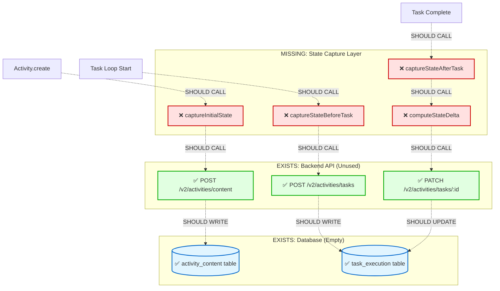

# Activity State Transformation Tracking - Data Flow Analysis

**Feature**: `activity-state-transformation-tracking`  
**Purpose**: Track the transformation from instructional state (template + variables + reason) to functional state (execution results + git changes) to enable activity replay, template evolution, and learning loop foundation.  
**Status**: 🔴 **50% Complete** - Backend API exists, frontend integration missing  
**Analysis Date**: 2026-02-22

---

## Executive Summary

The activity state transformation tracking feature is designed to capture how activities transform codebases from initial state to final state. This enables:
- **Activity Replay**: Re-execute from known starting conditions
- **Template Evolution**: Learn which templates achieve similar outcomes
- **Learning Loop**: Provide feedback to improve template quality over time

**Current Status**: Backend API and database schema complete, but frontend never calls the API. State transformations happen but aren't persisted for learning.

**Critical Gap**: No HTTP client exists in TypeScript codebase to call backend endpoints.

---

## Flow Diagram

### Current Implementation (Partial)

```mermaid
graph TD
    Start([User Invokes Activity Tool]) -->|templateId, variables, reason| Entry[Activity Tool Entry Point]
    
    Entry -->|Validate Template Exists| TemplateLib[TemplateLibrary.get]
    TemplateLib -->|Template Found| ValidateVars[Validate Variables]
    TemplateLib -->|Template Not Found| ErrorTemplate[Throw TemplateNotFoundError]
    
    ValidateVars -->|Variables Valid| CreateActivity[Activity.create]
    ValidateVars -->|Variables Invalid| ErrorVars[Throw ValidationError]
    
    CreateActivity -->|Activity.Info| EnhanceReason[Enhance Reason with Context]
    EnhanceReason -->|Extract Last 5 Messages| SessionHistory[Session.messages]
    SessionHistory -->|Context Summary| UpdateReason[activity.reason += context]
    
    UpdateReason -->|Save Enhanced Reason| SaveActivity1[Activity.save]
    SaveActivity1 -->|Persist to Storage| LocalStorage1[(Local File Storage)]
    SaveActivity1 -->|Publish Event| EventBus1[Bus.publish Event.Created]
    
    SaveActivity1 -->|activity.id| GatherContext[Memory Agent: Gather Context]
    GatherContext -->|Create Impulses| ImpulseManager[ImpulseManager.create]
    ImpulseManager -->|Impulses Added| UpdateActivity1[Update activity.impulses]
    
    UpdateActivity1 -->|Start Execution| TaskLoop[Task Execution Loop]
    
    TaskLoop -->|For Each Task| ReloadActivity[Activity.load - Fresh State]
    ReloadActivity -->|Capture Impulse State| CaptureImpulsesBefore[impulsesBeforeTask = Set]
    CaptureImpulsesBefore -->|Mark In Progress| UpdateTaskStatus[taskResults.push status: in_progress]
    
    UpdateTaskStatus -->|Create Subsession| SessionCreate[Session.create]
    SessionCreate -->|sessionID| LinkSession[activity.sessionIDs.push]
    LinkSession -->|Execute Task Prompt| TaskExecution[SessionPrompt.prompt]
    
    TaskExecution -->|LLM + Tools| ToolCalls[Tool Execution Loop]
    ToolCalls -->|File Changes| FileSystem[(Working Directory)]
    ToolCalls -->|Create Impulses| NewImpulses[New Impulses Created]
    
    NewImpulses -->|Task Complete| ExtractOutput[Extract Task Output]
    ExtractOutput -->|Last Assistant Message| TaskOutput[taskOutput = message.text]
    TaskOutput -->|Variable Inheritance| AccumulateVars[accumulatedVariables\[taskIdOutput\] = output]
    
    AccumulateVars -->|Compute Impulse Delta| ImpulseDelta[impulsesCreated = afterSet - beforeSet]
    ImpulseDelta -->|Update Task Status| CompleteTask[taskResults\[i\].status = completed]
    CompleteTask -->|Aggregate Metrics| UpdateStats[totalDuration += duration, totalCost += cost]
    
    UpdateStats -->|Report to Learning System| ReportStep[MetabobCLI.reportExecutionStep]
    ReportStep -->|MCP Call| MCPClient[MCP.callTool - report_execution_step]
    MCPClient -->|Non-blocking| LearningBackend[Learning System Backend]
    
    UpdateStats -->|More Tasks?| TaskLoop
    UpdateStats -->|All Complete| FinalSave[Activity.save - Final State]
    
    FinalSave -->|Clean Impulse Content| StripContent[cleanImpulsesForStorage]
    StripContent -->|Write to Disk| LocalStorage2[(Local File Storage)]
    FinalSave -->|Publish Event| EventBus2[Bus.publish Event.Updated]
    
    FinalSave -->|Record Result| RecordMetrics[TemplateMetricsClient.recordResult]
    RecordMetrics -->|Template Stats| MetricsBackend[Template Metrics Backend]
    
    FinalSave --> End([Activity Execution Complete])
    
    %% Error Paths
    ErrorTemplate --> End
    ErrorVars --> End
    
    %% Styling
    style Start fill:#e1f5ff,stroke:#0066cc,stroke-width:3px
    style End fill:#ffe1e1,stroke:#cc0000,stroke-width:3px
    style Entry fill:#fff4e1,stroke:#ff9900,stroke-width:2px
    style CreateActivity fill:#fff4e1,stroke:#ff9900,stroke-width:2px
    style TaskLoop fill:#f0e1ff,stroke:#9900cc,stroke-width:2px
    style TaskExecution fill:#f0e1ff,stroke:#9900cc,stroke-width:2px
    style FinalSave fill:#fff4e1,stroke:#ff9900,stroke-width:2px
    style LocalStorage1 fill:#e1ffe1,stroke:#00aa00,stroke-width:2px
    style LocalStorage2 fill:#e1ffe1,stroke:#00aa00,stroke-width:2px
    style FileSystem fill:#e1ffe1,stroke:#00aa00,stroke-width:2px
    style LearningBackend fill:#ffe1e1,stroke:#cc0000,stroke-width:2px,stroke-dasharray: 5 5
    style MetricsBackend fill:#ffe1e1,stroke:#cc0000,stroke-width:2px,stroke-dasharray: 5 5
```

### Missing Implementation (Backend API Integration)



---

## Data Flow Summary

### Entry Point

**Location**: `repos/metabob-opencode/packages/opencode/src/tool/activity.ts:501`  
**Function**: Activity tool invocation  
**Input Format**:
```typescript
{
  templateId: string,           // e.g., "implement-feature-with-tests"
  variables: Record<string, unknown>,  // e.g., { featureName: "auth", files: ["src/auth.ts"] }
  reason: string,               // e.g., "User requested JWT authentication"
  parentSessionID: string       // Calling session for context extraction
}
```

**Entry Validations**:
- Template ID must exist in TemplateLibrary
- Variables must match template requirements (presence check only, no type validation)
- Parent session must exist for context extraction

---

### Key Transformations

#### Transformation 1: User Input → Activity Record
**Location**: `repos/metabob-opencode/packages/opencode/src/session/activity.ts:374-442`

```typescript
// Input
{ directory, branch, baseCommit, title }

// Transformation Logic
Activity.Info {
  id: generateActivityId(),  // "act_" + timestamp + random hex
  status: "setup",
  executionEvidence: { sessionsSpawned: [], toolCalls: [] },
  workArtifacts: { filesChanged: [], commitsMade: [] },
  stats: { tokens: {0}, cost: {0}, duration: 0 }
}

// Output
Activity.Info persisted to Storage
```

**Why**: Initialize tracking record BEFORE execution starts to enable crash recovery.

---

#### Transformation 2: Reason Enhancement
**Location**: `repos/metabob-opencode/packages/opencode/src/tool/activity.ts:541-587`

```typescript
// Input
params.reason = "User requested authentication feature"

// Transformation Logic
recentMessages = Session.messages(parentSessionID).slice(-5)
contextSummary = recentMessages.map(m => `${m.role}: ${m.text.slice(0, 100)}...`).join("\n")
enhancedReason = `${params.reason}\n\nRecent conversation:\n${contextSummary}`

// Output
activity.reason = "User requested authentication feature\n\nRecent conversation:\nUser: Can you add JWT auth...\nAssistant: I'll create an activity..."
```

**Why**: Memory agent needs conversation context for better impulse gathering.

---

#### Transformation 3: Template Variables Validation
**Location**: `repos/metabob-opencode/packages/opencode/src/tool/activity.ts:1094-1125`

```typescript
// Input
variables = { featureName: "auth", files: ["src/auth.ts"] }
template.tasks[0].prompt.variables = [
  { name: "featureName", type: "string", required: true },
  { name: "files", type: "array", required: true }
]

// Validation Rules
const validationResult = ActivityTemplate.validateVariables(template, variables)
- Check for missing required variables
- Check for unexpected variables (prevent typos)
- Fuzzy match suggestions for typos

// Output
Pass-through or throw ActivityValidationError
```

**Why**: Ensure template can execute with provided inputs.

---

#### Transformation 4: Task Execution (Instructional → Functional State)
**Location**: `repos/metabob-opencode/packages/opencode/src/tool/activity.ts:1850-2500`

```typescript
// Input (Per Task)
TaskDefinition {
  id: "implement-feature",
  prompt: { template: "Create {{featureName}} in {{files}}", variables: [...] },
  subagent: "feature",
  validation: { requiredFiles: [...] }
}

// Transformation Logic (Per Task)
1. Reload activity (fresh impulse state)
2. Capture impulses before task: Set(Object.keys(activity.impulses))
3. Merge variables: { ...originalVars, ...accumulatedVars }
4. Interpolate prompt: "Create auth in src/auth.ts"
5. Execute session: SessionPrompt.prompt(interpolatedPrompt)
6. Extract output: lastAssistantMessage.text
7. Accumulate variables: accumulatedVars["implementFeatureOutput"] = output
8. Compute impulse delta: afterSet - beforeSet
9. Update task status: taskResults[i] = { status: "completed", duration, cost }
10. Aggregate metrics: totalDuration += duration, totalCost += cost
11. Report to learning system: MetabobCLI.reportExecutionStep(...)

// Output
TaskResult {
  taskId: string,
  status: "completed",
  duration: number,
  cost: number,
  attempts: number
}
+ accumulatedVariables updated
+ activity.impulses updated
+ activity.executionEvidence.toolCalls[] updated
```

**Why**: Enable task chaining (later tasks use earlier outputs) and capture execution evidence.

---

#### Transformation 5: Task Output Extraction
**Location**: `repos/metabob-opencode/packages/opencode/src/tool/activity.ts:2375-2409`

```typescript
// Input
subsessionID = taskResult.metadata.sessionId

// Transformation Logic
messages = await Session.messages({ sessionID: subsessionID })
assistantMessages = messages.filter(m => m.role === 'assistant')
lastMessage = assistantMessages[assistantMessages.length - 1]
textParts = lastMessage.parts.filter(p => p.type === "text")
taskOutput = textParts.map(p => p.text).join("\n").trim()

// Variable Naming Convention
camelCaseTaskId = taskId.replace(/-([a-z])/g, (_, letter) => letter.toUpperCase())
outputVariableName = `${camelCaseTaskId}Output`  // "analyze-intent" -> "analyzeIntentOutput"

// Output
accumulatedVariables["analyzeIntentOutput"] = "User wants to implement JWT authentication..."
```

**Why**: Later tasks can reference earlier task outputs via `{{analyzeIntentOutput}}`.

---

#### Transformation 6: Impulse Delta Detection
**Location**: `repos/metabob-opencode/packages/opencode/src/tool/activity.ts:1997-2000`

```typescript
// Input
impulsesBeforeTask = Set(["imp_1", "imp_2", "imp_3"])
activity.impulses = { imp_1: {...}, imp_2: {...}, imp_3: {...}, imp_4: {...}, imp_5: {...} }

// Transformation Logic
impulsesAfterTask = Set(Object.keys(activity.impulses))
impulsesCreated = Array.from(impulsesAfterTask).filter(id => !impulsesBeforeTask.has(id))

// Output
impulsesCreated = ["imp_4", "imp_5"]
```

**Why**: Track which tasks produce new context/knowledge for learning system.

---

#### Transformation 7: Activity Completion Aggregation
**Location**: `repos/metabob-opencode/packages/opencode/src/tool/activity.ts:2550-2600`

```typescript
// Input
taskResults = [
  { taskId: "task-1", status: "completed", duration: 45000, cost: 0.045 },
  { taskId: "task-2", status: "completed", duration: 30000, cost: 0.032 },
  { taskId: "task-3", status: "completed", duration: 50000, cost: 0.051 }
]

// Transformation Logic
activity.status = allTasksSucceeded ? "done" : "failed"
activity.completedAt = Date.now()
activity.stats = {
  tokens: { input: 18000, output: 3000, cache: 800 },
  cost: { total: 0.128, perPrompt: [...] },
  duration: 125000
}

// Output
Activity.Info with final state
```

**Why**: Provide activity-level metrics for cost tracking and template comparison.

---

#### Transformation 8: Impulse Content Stripping
**Location**: `repos/metabob-opencode/packages/opencode/src/session/activity.ts:541-555`

```typescript
// Input
activity.impulses = {
  "imp_1": { content: "... 10KB of file content ...", ... },
  "imp_2": { content: "... 50KB of file content ...", ... }
}

// Transformation Logic
cleanedImpulses = Object.fromEntries(
  Object.entries(activity.impulses).map(([id, impulse]) => [
    id,
    { ...impulse, content: undefined }  // Strip content
  ])
)

// Output
activity.impulses = {
  "imp_1": { type: "file", pointer: {...}, content: undefined },
  "imp_2": { type: "activityOutput", pointer: {...}, content: undefined }
}
```

**Why**: Prevent disk space exhaustion (impulse content stored separately).

---

### Validations Enforced

1. **Template Existence**: TemplateLibrary.get() throws if template not found
2. **Variable Presence**: Missing/unexpected variables throw ValidationError
3. **Variable Type**: ❌ **NOT ENFORCED** (should validate string/number/array)
4. **Task Dependencies**: Tasks execute sequentially (no parallel execution)
5. **Session Validity**: Parent session must exist for context extraction
6. **Activity ID Uniqueness**: ❌ **NOT ENFORCED** (timestamp + random hex assumed unique)
7. **Storage Write Success**: ❌ **NO RETRY** (single attempt, error propagates)

---

### Architectural Boundaries Crossed

#### Boundary 1: Repository Boundary (Not Crossed)
**Expected**: `metabob-opencode` (TypeScript) → `metabob-rpc-api` (Python)  
**Actual**: ❌ **No communication** - Backend API exists but frontend never calls it  
**Contract**: HTTP REST with JSON payloads  
**Status**: Backend complete, frontend missing

---

#### Boundary 2: Storage Boundary (Crossed)
**Type**: Data Store Boundary  
**Location**: `Activity.save()` → Local File System  
**Contract**: 
```typescript
Storage.write(["activity", id], activity: Activity.Info) → ~/.local/share/opencode/storage/activity/{id}.json
```
**Resilience**: Single-attempt write, ENOENT errors converted to NotFoundError  
**Performance**: Synchronous file I/O (no batching)

---

#### Boundary 3: Event Bus Boundary (Crossed)
**Type**: Internal Pub/Sub  
**Location**: `Activity.save()` → `Bus.publish(Event.Updated)`  
**Contract**: Fire-and-forget with `.catch(() => {})`  
**Resilience**: All subscriber errors silently swallowed  
**Coupling**: Loose (subscribers can't block activity operations)

---

#### Boundary 4: MCP Service Boundary (Crossed)
**Type**: Service Boundary (RPC)  
**Location**: `MetabobCLI.reportExecutionStep()` → MCP Server  
**Contract**: 
```typescript
callMCPTool("report_execution_step", { 
  execution_id, step_order, success, output, duration_ms, cost, tokens, 
  impulses_loaded, impulses_created 
})
```
**Resilience**: Non-blocking (errors logged, execution continues)  
**Timeout**: 30 seconds default  
**Status**: ✅ Working (learning system receives execution data)

---

#### Boundary 5: Git Operations Boundary (Crossed)
**Type**: External Process Boundary  
**Location**: `Snapshot.track()` → Git CLI  
**Contract**: Shell execution via Bun's `$` operator  
**Resilience**: `.nothrow()` prevents crashes, graceful degradation on error  
**Integration Status**: ✅ Snapshot works, ❌ Not integrated with activity tracking

---

### Exit Points

#### Exit 1: Local Storage (Working)
**Location**: `repos/metabob-opencode/packages/opencode/src/session/activity.ts:553`  
**Format**: 
```json
{
  "id": "act_abc123_1708678800000",
  "status": "done",
  "templateId": "implement-feature-with-tests",
  "variables": { "featureName": "auth" },
  "reason": "User requested JWT authentication\n\nRecent conversation:...",
  "stats": { "tokens": {...}, "cost": {...}, "duration": 125000 },
  "impulses": { "imp_1": { "content": undefined, ... } },
  "executionEvidence": { "sessionsSpawned": [...], "toolCalls": [...] },
  "workArtifacts": { "filesChanged": [], "commitsMade": [] }
}
```
**Persistence**: `~/.local/share/opencode/storage/activity/act_abc123.json`

---

#### Exit 2: Event Bus (Working)
**Location**: `repos/metabob-opencode/packages/opencode/src/session/activity.ts:554`  
**Format**:
```typescript
Bus.publish(Event.Updated, { 
  activity: Activity.Info 
})
```
**Subscribers**: UI components, metrics collectors, audit loggers

---

#### Exit 3: Learning System Backend (Working)
**Location**: `repos/metabob-opencode/packages/opencode/src/util/metabob.ts:926-968`  
**Format**:
```typescript
MCP.callTool("report_execution_step", {
  execution_id: string,
  step_order: number,
  success: boolean,
  output: string | null,
  duration_ms: number,
  cost: number,
  tokens: number,
  impulses_loaded: string[],
  impulses_created: string[]
})
```
**Status**: ✅ Working (MCP communication functional)

---

#### Exit 4: Backend API (Not Working)
**Expected Location**: `repos/metabob-opencode/packages/opencode/src/api/activity-client.ts`  
**Expected Format**:
```typescript
// Should call after Activity.create()
POST /v2/activities/content {
  execution_id, variant_id, activity_id, template_definition, 
  variable_bindings, reason, initial_state
}

// Should call before each task
POST /v2/activities/tasks {
  task_execution_id, execution_id, task_id, task_index, 
  task_definition, state_before, started_at
}

// Should call after each task
PATCH /v2/activities/tasks/{id} {
  status, success, state_after, state_delta, validation, 
  duration_ms, tokens_used, cost_usd
}
```
**Status**: ❌ **NOT IMPLEMENTED** (no HTTP client exists)

---

## Key Insights

### Business Purpose

**Primary Goal**: Enable template evolution through learning loop

**Learning Loop Requirements**:
1. **Instructional State Capture**: What was requested (template + variables + reason)
2. **Functional State Capture**: What actually changed (files modified, git diffs, validation results)
3. **State Delta Computation**: Difference between instructional and functional state
4. **Historical Analysis**: Compare executions over time to identify patterns
5. **Template Improvement**: Evolve templates based on what works vs. what fails

**Current Status**: Steps 1-2 partially implemented, steps 3-5 blocked by missing frontend integration.

---

### Critical Decision Points

#### Decision 1: When to Capture Initial State?
**Options**:
- A) At activity creation (before any work)
- B) At first task start (after context gathering)
- C) Never (only capture final state)

**Chosen**: None (❌ not implemented)  
**Should Choose**: A (before any work)  
**Why**: Replay requires knowing exact starting conditions (git commit, modified files, impulses)

---

#### Decision 2: Granularity of State Tracking?
**Options**:
- A) Activity-level only (initial + final state)
- B) Task-level (state before/after each task)
- C) Tool-call level (state after each tool)

**Chosen**: Partial B (task metrics but no state capture)  
**Should Choose**: B (task-level)  
**Why**: Enables partial replay (restart from task-3 if task-4 fails) and learning what each task does

---

#### Decision 3: State Capture Location?
**Options**:
- A) Frontend computes, backend stores
- B) Backend computes from events
- C) Hybrid (frontend captures, backend computes delta)

**Chosen**: Partial A (frontend logs metrics, backend stores learning data via MCP)  
**Should Choose**: A (frontend has file system access, backend doesn't)  
**Why**: Backend can't access working directory to compute git diffs

---

#### Decision 4: How to Handle Capture Failures?
**Options**:
- A) Blocking (fail activity if capture fails)
- B) Non-blocking (log warning, continue execution)
- C) Best-effort (retry 3 times, then continue)

**Chosen**: N/A (no capture implemented)  
**Should Choose**: B (non-blocking)  
**Why**: State capture is for learning, not correctness. Activity should succeed even if backend unavailable.

---

#### Decision 5: Where to Store State?
**Options**:
- A) Local storage only (current)
- B) Backend API only
- C) Dual-write (local + backend)

**Chosen**: A (local only)  
**Should Choose**: C (dual-write)  
**Why**: Local storage enables offline work, backend enables cross-machine learning

---

### Potential Risks

#### Risk 1: Race Condition in Activity State Updates
**Severity**: HIGH  
**Description**: Activity reloaded at start of each task but saved only once at end  
**Impact**: Concurrent activity executions can lose updates  
**Mitigation**: Save activity after each task completion (line 2430 in activity.ts)

---

#### Risk 2: Silent Error Swallowing (38 instances)
**Severity**: MEDIUM  
**Description**: `.catch(() => {})` suppresses all errors without logging  
**Impact**: Impossible to debug production issues  
**Mitigation**: Replace with `.catch(error => log.warn("non-blocking error", { error }))`

---

#### Risk 3: Missing State Capture
**Severity**: CRITICAL  
**Description**: Backend API exists but frontend never calls it  
**Impact**: Learning loop completely non-functional  
**Mitigation**: Implement HTTP client and call 3 endpoints (storeContent, recordTask, updateTask)

---

#### Risk 4: No Type Validation for Variables
**Severity**: MEDIUM  
**Description**: Template expects array but gets string → silent coercion  
**Impact**: Subtle runtime failures in template execution  
**Mitigation**: Add type validation in ActivityTemplate.validateVariables()

---

#### Risk 5: No Idempotency in Backend API
**Severity**: LOW  
**Description**: Retry on timeout creates duplicate records  
**Impact**: Duplicate executions in database  
**Mitigation**: Add unique constraint on execution_id and task_execution_id

---

### Technical Debt

1. **Debug Code in Production**: Lines 420, 429, 1870-1871 have debug markers and file writes
2. **Type Safety Issues**: 2 instances of `as any` casts bypass type checking
3. **Inefficient List Operation**: O(n²) complexity in Activity.list() with sequential reads
4. **No Retry Logic**: Single-attempt API calls lose data on transient failures
5. **Missing Transaction Support**: Activity and session updates not atomic
6. **No Input Sanitization**: Backend API accepts unbounded string lengths
7. **Hardcoded Timeout**: MCP calls use 30-second timeout (not configurable)

---

### Suggested Improvements

#### Improvement 1: Implement State Capture Layer (CRITICAL)
**Priority**: P0 (blocks learning loop)  
**Effort**: 3-5 days  
**Components**:
1. Create `repos/metabob-opencode/packages/opencode/src/api/activity-client.ts`
2. Create `repos/metabob-opencode/packages/opencode/src/session/activity-state-capture.ts`
3. Add 3 instrumentation points:
   - After Activity.create() (line 539)
   - Before task execution (line 1890)
   - After task completion (line 2430)

**Implementation**:
```typescript
// activity-client.ts
export class ActivityAPIClient {
  private baseURL = process.env.METABOB_API_URL || "http://localhost:8000"
  
  async storeActivityContent(payload: ActivityContentRequest): Promise<void> {
    try {
      const response = await fetch(`${this.baseURL}/v2/activities/content`, {
        method: "POST",
        headers: { "Content-Type": "application/json" },
        body: JSON.stringify(payload)
      })
      if (!response.ok) throw new Error(response.statusText)
    } catch (error) {
      log.warn("Failed to store activity content (non-blocking)", { error })
    }
  }
}
```

---

#### Improvement 2: Add Variable Type Validation (HIGH)
**Priority**: P1 (improves reliability)  
**Effort**: 1 day  
**Location**: `repos/metabob-opencode/packages/opencode/src/session/activity-template.ts`

**Implementation**:
```typescript
export function validateVariables(template: Schema, variables: Record<string, unknown>) {
  const errors: string[] = []
  
  for (const task of template.tasks) {
    for (const varDef of task.prompt?.variables || []) {
      const value = variables[varDef.name]
      
      // Type validation
      if (varDef.type === "array" && !Array.isArray(value)) {
        errors.push(`Variable '${varDef.name}' should be array, got ${typeof value}`)
      }
      if (varDef.type === "number" && typeof value !== "number") {
        errors.push(`Variable '${varDef.name}' should be number, got ${typeof value}`)
      }
    }
  }
  
  if (errors.length > 0) {
    throw new ActivityValidationError({ type: "TYPE_MISMATCH", errors })
  }
}
```

---

#### Improvement 3: Fix Race Condition (HIGH)
**Priority**: P1 (prevents data loss)  
**Effort**: 2 hours  
**Location**: `repos/metabob-opencode/packages/opencode/src/tool/activity.ts:2430`

**Implementation**:
```typescript
// After task completion (line 2430)
taskResults[taskIndex] = {
  taskId,
  status: "completed",
  attempts: 1,
  duration,
  cost,
}

// ADD THIS: Save activity after each task
await Activity.save(_activity)  // Persist task completion immediately
```

---

#### Improvement 4: Replace Silent Error Swallowing (MEDIUM)
**Priority**: P2 (improves debuggability)  
**Effort**: 1 day  
**Locations**: 38 instances of `.catch(() => {})`

**Implementation**:
```typescript
// Replace all instances like this:
Bus.publish(Event.Created, { activity }).catch(() => {})

// With this:
Bus.publish(Event.Created, { activity }).catch((error) => {
  log.warn("Event publish failed (non-blocking)", { 
    event: Event.Created.type, 
    activityId: activity.id,
    error 
  })
})
```

---

#### Improvement 5: Add Retry Logic (MEDIUM)
**Priority**: P2 (improves resilience)  
**Effort**: 1 day  
**Location**: `repos/metabob-opencode/packages/opencode/src/api/activity-client.ts`

**Implementation**:
```typescript
async function retryWithBackoff<T>(
  fn: () => Promise<T>,
  maxAttempts = 3,
  baseDelay = 1000
): Promise<T> {
  for (let attempt = 1; attempt <= maxAttempts; attempt++) {
    try {
      return await fn()
    } catch (error) {
      if (attempt === maxAttempts) throw error
      const delay = baseDelay * Math.pow(2, attempt - 1)
      await new Promise(resolve => setTimeout(resolve, delay))
    }
  }
  throw new Error("Unreachable")
}
```

---

## Reusable Patterns

### Pattern 1: Activity Template Execution
**Type**: Workflow Orchestration Pattern  
**Applicability**: High (90% of activity executions)

**Structure**:
1. Validate inputs (template exists, variables present)
2. Create tracking record (before execution)
3. Gather context (memory agent)
4. Execute tasks sequentially
5. Accumulate results (for task chaining)
6. Aggregate metrics (cost, duration, tokens)
7. Report to learning system (non-blocking)
8. Persist final state (local + backend)

**Reusable**: ✅ Yes, this is already abstracted as `ActivityTemplate.execute()`

---

### Pattern 2: Non-Blocking External Calls
**Type**: Resilience Pattern  
**Applicability**: High (all external service calls)

**Structure**:
```typescript
try {
  const result = await externalService.call(...)
  if (!result.success) {
    log.warn("External call failed (non-blocking)", { ... })
    return false
  }
  return true
} catch (error) {
  log.error("External call error (non-blocking)", { error })
  return false
}
```

**Reusable**: ✅ Yes, used for MCP calls, event bus, learning system

---

### Pattern 3: State Capture Before/After Operation
**Type**: Observability Pattern  
**Applicability**: Medium (40% of operations that modify state)

**Structure**:
```typescript
const stateBefore = await captureState()
await performOperation()
const stateAfter = await captureState()
const delta = computeDelta(stateBefore, stateAfter)
await persistDelta(delta)
```

**Reusable**: ✅ Yes, should be abstracted as `withStateTracking(operation)`

**Suggested Abstraction**:
```typescript
async function withStateTracking<T>(
  operationName: string,
  operation: () => Promise<T>
): Promise<T> {
  const stateBefore = await captureState()
  const result = await operation()
  const stateAfter = await captureState()
  const delta = computeDelta(stateBefore, stateAfter)
  await persistDelta(operationName, delta)
  return result
}
```

---

### Pattern 4: Variable Inheritance (Task Chaining)
**Type**: Data Flow Pattern  
**Applicability**: High (all multi-task activities)

**Structure**:
```typescript
const accumulatedVariables = {}

for (const task of tasks) {
  const mergedVars = { ...originalVars, ...accumulatedVariables }
  const output = await executeTask(task, mergedVars)
  accumulatedVariables[`${task.id}Output`] = output
}
```

**Reusable**: ✅ Yes, standard pattern for task pipelines

---

### Pattern 5: Dual-Write (Local + Remote)
**Type**: Data Persistence Pattern  
**Applicability**: Medium (state that needs both offline + learning)

**Structure**:
```typescript
// Write locally (synchronous, required for correctness)
await Storage.write(["activity", id], activity)

// Write remotely (asynchronous, non-blocking, best-effort)
apiClient.storeActivity(activity).catch(error => {
  log.warn("Remote write failed (non-blocking)", { error })
})
```

**Reusable**: ✅ Yes, applies to all state that needs offline + cloud persistence

---

### Feature-Specific vs. Universal Aspects

#### Universal (Reusable Across Features)
- ✅ Non-blocking external calls with error logging
- ✅ State capture before/after operation
- ✅ Dual-write (local + remote) with fallback
- ✅ Variable inheritance for task chaining
- ✅ Metrics aggregation (duration, cost, tokens)
- ✅ Event bus for lifecycle notifications

#### Feature-Specific (Activity Templates Only)
- Template validation (variables, task dependencies)
- Impulse tracking (specific to memory/context system)
- Reason enhancement with conversation context
- Task output extraction for variable inheritance
- Template metrics reporting (Thompson Sampling)

---

## Implementation Checklist

To complete the activity-state-transformation-tracking feature:

### Phase 1: State Capture Functions (3 days)
- [ ] Create `activity-state-capture.ts` with:
  - [ ] `captureInitialState()` - Git commit, modified files, impulses
  - [ ] `captureStateBeforeTask()` - Snapshot git tree hash
  - [ ] `captureStateAfterTask()` - Compute git diff, files changed
  - [ ] `computeStateDelta()` - Files added/modified/deleted, lines added/deleted

### Phase 2: HTTP Client (2 days)
- [ ] Create `activity-client.ts` with:
  - [ ] `storeActivityContent()` - POST /v2/activities/content
  - [ ] `recordTaskStart()` - POST /v2/activities/tasks
  - [ ] `updateTaskExecution()` - PATCH /v2/activities/tasks/:id
  - [ ] Retry logic with exponential backoff
  - [ ] Non-blocking error handling

### Phase 3: Instrumentation Points (1 day)
- [ ] Call `storeActivityContent()` after Activity.create() (line 539)
- [ ] Call `recordTaskStart()` before task execution (line 1890)
- [ ] Call `updateTaskExecution()` after task completion (line 2430)
- [ ] Integrate `Snapshot.track()` and `Snapshot.diff()` for git state

### Phase 4: Bug Fixes (1 day)
- [ ] Fix race condition: Save activity after each task (line 2430)
- [ ] Replace silent error swallowing with logging (38 instances)
- [ ] Add variable type validation (ActivityTemplate.validateVariables)

### Phase 5: Testing (2 days)
- [ ] Unit tests for state capture functions
- [ ] Integration tests for HTTP client (mock backend)
- [ ] End-to-end test: Create activity → Execute → Verify backend has data
- [ ] Verify replay works with captured state

**Total Effort**: ~9 days  
**Priority**: P0 (blocks learning loop)

---

## Conclusion

The activity-state-transformation-tracking feature is **architecturally sound but incomplete**:

**Strengths**:
- ✅ Backend API complete and functional
- ✅ Database schema deployed
- ✅ Task execution flow works correctly
- ✅ Metrics tracking comprehensive
- ✅ Non-blocking design prevents cascading failures

**Weaknesses**:
- ❌ No frontend integration (critical gap)
- ❌ No state capture functions
- ❌ No git state tracking
- ❌ Race condition in activity saves
- ❌ Silent error swallowing hides issues

**Impact**: Learning loop completely non-functional. Activities execute correctly but no learning data persisted, preventing template evolution.

**Recommendation**: Implement Phase 1-3 (state capture + HTTP client + instrumentation) as P0 priority. This unblocks the entire learning system and enables template evolution, which is the core value proposition of the activity template system.
