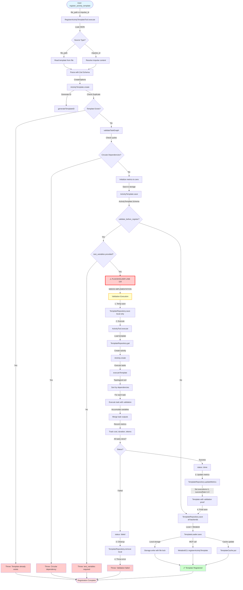

# Activity Template Validation Before Registration - Data Flow Analysis

**Feature**: Activity Template Validation Before Registration
**Status**: Partially Implemented (Placeholder at line 118 needs replacement)
**Last Updated**: 2026-02-24

---

## Executive Summary

This flow enables quality gates for activity templates by executing them with test variables before registration. It prevents broken templates from entering the registry, ensuring only validated, working templates are available to users. This improves user experience and reduces wasted execution costs from failed templates.

**Current State**: Validation checkpoint exists but contains placeholder logic that always returns success.
**Required Action**: Implement real template execution at line 118 in `register-activity-template.ts`.

---

## Flow Diagram



---

## Detailed Data Flow

### Entry Point

**Location**: `repos/metabob-opencode/packages/opencode/src/tool/register-activity-template.ts:39`

**Input Format**:
```typescript
{
  file_path?: string,              // Path to template JSON file
  impulse_id?: string,             // OR impulse ID containing template
  validate_before_register?: boolean,  // Enable validation (default: false)
  test_variables?: Record<string, any>,  // Variables for validation execution
  register_with_metabob?: boolean  // Sync to backend (default: true)
}
```

**Entry Conditions**:
- Exactly one of `file_path` or `impulse_id` must be provided
- If `validate_before_register=true`, then `test_variables` is required
- Tool context provides project directory, session info, abort signal

---

### Transformation Pipeline

#### Phase 1: Template Loading (Lines 43-100)

**Transformation**: File/Impulse → Raw JSON
- **File Path**: `fs.readFileSync(file_path)` → Parse JSON
- **Impulse ID**: `ImpulseResolver.resolve(impulseId)` → Extract definition from pointer

**Output**: Raw JSON object (unvalidated)

---

#### Phase 2: Schema Validation (Line 103)

**Transformation**: Raw JSON → CreateOptions (Zod Schema)

```typescript
const options = ActivityTemplate.CreateOptions.parse(json)
```

**Validations Applied**:
- ✅ `name` is string (required)
- ✅ `description` is string (required)
- ✅ `category` is valid enum (required)
- ✅ `tasks` is array with at least 1 task (required)
- ✅ Each task has `id`, `subagent`, `description`, `prompt`
- ✅ `dependencies` arrays reference valid task IDs
- ✅ Defaults applied: `evolutionReason="MANUAL"`, `author="HUMAN"`

**Output**: `ActivityTemplate.CreateOptions` (type-safe)

---

#### Phase 3: Template Creation (Lines 108, activity-template.ts:986-1088)

**Transformation**: CreateOptions → ActivityTemplate.Schema

**Key Transformations**:
1. **ID Generation** (line 993):
   ```typescript
   const id = generateTemplateID(parsed.name)
   // "Add REST Endpoint v2" → "add-rest-endpoint"
   ```

2. **Duplicate Check** (line 996):
   ```typescript
   if (await exists(id)) {
     throw new Error(`Template with id "${id}" already exists`)
   }
   ```

3. **Task Graph Validation** (line 1004):
   ```typescript
   validateTaskGraph(parsed.tasks)
   // Check: No duplicate task IDs
   // Check: All dependencies exist
   // Check: No circular dependencies (topological sort)
   ```

4. **Metrics Initialization** (lines 1054-1095):
   ```typescript
   {
     executions: 0,
     successRate: 0.0,
     avgDuration: 0,
     avgCost: 0,
     avgTokens: { input: 0, output: 0, cache: 0 },
     qualityScore: 0.0
   }
   ```

5. **Storage** (line 1097):
   ```typescript
   await save(template)  // Writes to Storage.write(["activity-template", id])
   ```

**Output**: `ActivityTemplate.Schema` (complete template with ID, version, metrics)

---

#### Phase 4: Validation Checkpoint (Lines 118-148) ⚠️ PLACEHOLDER

**Current Implementation** (PLACEHOLDER):
```typescript
if (params.validate_before_register) {
  if (!params.test_variables) {
    throw new Error("test_variables required when validate_before_register=true")
  }
  
  // ⚠️ PLACEHOLDER: Always returns success
  validationResult = {
    success: true,
    duration: 0,
    cost: 0,
    error: undefined,
  }
}
```

**Required Implementation**:

```typescript
if (params.validate_before_register) {
  if (!params.test_variables) {
    throw new Error("test_variables required when validate_before_register=true")
  }
  
  log.info("validating template via test execution", { id: template.id })
  
  // 1. Temporarily save template to local storage only
  await TemplateRepository.save(template, ["local"])
  
  try {
    // 2. Import ActivityTool and execute template
    const { ActivityTool } = await import("./activity")
    const activityTool = await ActivityTool()
    
    const startTime = Date.now()
    const result = await activityTool.execute({
      templateId: template.id,
      variables: params.test_variables,
      reason: "Template validation execution before registration",
    }, ctx)
    
    const duration = Date.now() - startTime
    
    // 3. Extract metrics from result
    validationResult = {
      success: result.metadata?.status === "done",
      duration,
      cost: result.metadata?.cost?.total ?? 0,
      tokens: result.metadata?.tokens ?? { input: 0, output: 0, cache: 0 },
      error: result.metadata?.status === "failed" ? result.metadata?.error : undefined,
    }
    
    // 4. If validation failed, remove template and throw
    if (!validationResult.success) {
      await TemplateRepository.remove(template.id, ["local"]).catch(() => {})
      throw new Error(`Template validation failed: ${validationResult.error}`)
    }
    
    // 5. Update template with initial success metrics
    await TemplateRepository.updateMetrics(template.id, {
      executions: 1,
      successRate: 1.0,
      avgDuration: duration,
      avgCost: validationResult.cost,
      avgTokens: validationResult.tokens,
    })
    
    log.info("template validation succeeded", {
      id: template.id,
      duration,
      cost: validationResult.cost,
    })
    
  } catch (error) {
    // Clean up template on failure
    await TemplateRepository.remove(template.id, ["local"]).catch(() => {})
    throw error
  }
}
```

**Transformation**: ActivityTemplate.Schema → ValidationResult

**Validations Applied**:
- ✅ Template must exist in storage (ActivityTool requires it)
- ✅ Template must execute successfully with test_variables
- ✅ All tasks must pass pre-flight and post-execution checks
- ✅ No exceptions during execution
- ✅ Activity status must be "done" (not "failed")

**Output**: `{ success: boolean, duration: number, cost: number, tokens: {...}, error?: string }`

---

#### Phase 5: Template Execution (activity.ts:394-560, 1868-2400)

**Transformation**: Template ID → Execution Result

**Sub-Flow**:

1. **Load Template** (line 432):
   ```typescript
   const template = await TemplateRepository.get(templateId)
   ```

2. **Create Activity Tracking** (line 502):
   ```typescript
   const activity = await Activity.create({
     directory: ctx.directory,
     branch: ctx.branch,
     baseCommit: ctx.baseCommit,
     title: `Validation: ${template.name}`
   })
   ```

3. **Execute Template** (line 907):
   ```typescript
   const result = await executeTemplate({
     template,
     activity,
     variables,
     sessionID,
     abortSignal: ctx.abort,
     parentModel: ctx.model,
     options: { onStatusUpdate }
   })
   ```

4. **Task Execution Loop** (executeTemplate, lines 1941-2150):
   ```typescript
   // Topological sort tasks by dependencies
   const order = topologicalSort(template.tasks)
   
   for (const taskId of order) {
     // Check abort signal (timeout enforcement)
     if (abortSignal.aborted) throw new Error("Aborted")
     
     // Reload activity (see impulses from previous tasks)
     activity = await Activity.load(activity.id)
     
     // Create session for task
     const session = await Session.create(...)
     
     // Execute task with agent
     const taskResult = await executeTaskWithAgent(task, variables, session)
     
     // Validate task completion
     await validateTaskCompletion(task, taskResult)
     
     // Accumulate variables for next task
     variables = { ...variables, ...taskResult.output }
     
     // Record metrics
     totalCost += taskResult.cost
     totalDuration += taskResult.duration
     totalTokens.input += taskResult.tokens.input
     totalTokens.output += taskResult.tokens.output
     
     // Update activity state
     await Activity.save(activity)
     
     if (!taskResult.success) {
       return { success: false, error: taskResult.error }
     }
   }
   
   return {
     success: true,
     tasks: taskResults,
     totalDuration,
     totalCost,
     totalTokens
   }
   ```

**Validations Applied Per Task**:
- ✅ Pre-flight checks: Required files, directories, commands
- ✅ Task execution: No exceptions, validation rules pass
- ✅ Post-execution checks: Required patterns, forbidden patterns, commands

**Output**: `{ success: boolean, tasks: [...], totalDuration, totalCost, totalTokens, error? }`

---

#### Phase 6: Metrics Update (Lines 155, activity-template-repository.ts:238)

**Transformation**: Execution Result → Updated Template Metrics

```typescript
await TemplateRepository.updateMetrics(template.id, {
  executions: 1,
  successRate: 1.0,
  avgDuration: validationResult.duration,
  avgCost: validationResult.cost,
  avgTokens: validationResult.tokens,
})
```

**Effect**:
- Template transitions from "untested" (0 executions) to "validated" (1 execution, 100% success)
- Thompson Sampling algorithm now favors this template over untested ones
- Users see validation proof (executions > 0, successRate = 1.0)

**Output**: Updated `ActivityTemplate.Schema` with real metrics

---

#### Phase 7: Final Registration (Lines 150-158, template-loader.ts:295-345)

**Transformation**: Template → Multi-Backend Persistence

**Backend Strategy**:
```typescript
await TemplateRepository.save(template, backends)
// backends defaults to ["local", "metabob"] (all backends)
```

**Parallel Writes**:
1. **Local Storage** (template-loader.ts:324-332):
   ```typescript
   await ActivityTemplate.save(template)
   // → Storage.write(["activity-template", id], template)
   // → File lock + JSON write to ~/.local/share/opencode/storage/
   ```

2. **Metabob Backend** (template-loader.ts:305-320):
   ```typescript
   await TemplateServiceClient.registerTemplate(template)
   // → MetabobCLI.registerActivityTemplate(template)
   // → callMCPTool("metabob_register_activity_template", { template })
   // → MCP JSON-RPC call over stdio/HTTP
   ```

3. **Cache Update** (template-loader.ts:335):
   ```typescript
   TemplateCache.put(template)
   // → In-memory LRU cache update
   ```

**Resilience**:
- Best-effort saves: Partial success acceptable
- If Metabob fails but local succeeds → Registration succeeds (log warning)
- If all backends fail → Throw aggregated error
- Cache always updated (even if backends fail)

**Output**: Template persisted to storage and available for use

---

### Exit Point

**Location**: `repos/metabob-opencode/packages/opencode/src/tool/register-activity-template.ts:169-177`

**Output Format**:
```typescript
{
  success: true,
  template_id: string,
  template_name: string,
  source: "file" | "impulse",
  backends: ["local", "metabob"],
  validation_result?: {
    success: boolean,
    duration: number,
    cost: number,
    tokens: { input: number, output: number, cache: number },
    error?: string
  }
}
```

**Exit Conditions**:
- ✅ Template created with unique ID
- ✅ Template validated (if `validate_before_register=true`)
- ✅ Template saved to at least one backend
- ✅ Template cache updated
- ✅ Metrics reflect validation execution (if validated)

**Storage Locations**:
- Local: `~/.local/share/opencode/storage/activity-template/{id}.json`
- Metabob: Remote MCP backend (if available)
- Cache: In-memory `TemplateCache` (LRU)

---

## Architectural Boundaries Crossed

### Boundary 1: Tool Layer → Session Layer
**Location**: `register-activity-template.ts:108` → `activity-template.ts:986`
**Contract**: `ActivityTemplate.CreateOptions` → `ActivityTemplate.Schema`
**Coupling**: Medium (Zod schemas provide type safety)
**Resilience**: Schema validation throws on invalid input

### Boundary 2: Tool Layer → Activity Execution
**Location**: `register-activity-template.ts:118` (when implemented) → `activity.ts:394`
**Contract**: `{ templateId, variables, reason }` → `{ metadata: { status, cost, ... } }`
**Coupling**: Loose (interface-based, dynamic import)
**Resilience**: Timeout via abort signal, cleanup on failure

### Boundary 3: Session Layer → Storage Layer
**Location**: `activity-template.ts:692` → `storage.ts:189`
**Contract**: `Storage.write(["activity-template", id], template)`
**Coupling**: Loose (generic key-value interface)
**Resilience**: File locking, ENOENT → NotFoundError

### Boundary 4: Repository → Service Client
**Location**: `template-loader.ts:305` → `template-service-client.ts:304`
**Contract**: `registerTemplate(options)` → `{ success, error? }`
**Coupling**: Loose (service interface abstraction)
**Resilience**: Connection caching, fail-safe returns

### Boundary 5: Service Client → MCP Transport
**Location**: `template-service-client.ts:306` → `metabob.ts:793`
**Contract**: `MetabobCLI.registerActivityTemplate(template)` → `boolean`
**Coupling**: Medium (MCP-specific, but abstracted)
**Resilience**: Graceful failure, local backup, no retry

---

## Key Validations Enforced

### Input Validation
1. **Schema Validation** (line 103): Zod schema ensures required fields present
2. **Source Validation** (lines 47-52): Exactly one of `file_path` or `impulse_id`
3. **Test Variables** (lines 119-121): Required when `validate_before_register=true`

### Template Structure Validation
4. **ID Uniqueness** (activity-template.ts:996): No duplicate template IDs
5. **Task Graph** (activity-template.ts:1004): No circular dependencies
6. **Task IDs** (activity-template.ts:1143): Unique within template
7. **Dependencies** (activity-template.ts:1151): All dependencies exist

### Execution Validation (When Implemented)
8. **Pre-Flight Checks**: Optional files, required directories, commands
9. **Task Execution**: No exceptions, validation rules pass
10. **Post-Execution Checks**: Required files, patterns, forbidden patterns
11. **Status Check**: Activity status must be "done" (not "failed")

### Storage Validation
12. **File Locking**: Prevents concurrent write corruption
13. **ENOENT Handling**: NotFoundError for missing files
14. **Backend Availability**: At least one backend must succeed

---

## Critical Decision Points

### Decision 1: Validation Optional (Line 118)
**Question**: Should validation be mandatory or optional?
**Decision**: Optional (via `validate_before_register` flag)
**Rationale**:
- Fast iteration during development (skip validation for local testing)
- Validation requires test_variables which may not always be available
- Some templates too complex/expensive to validate upfront
- Maintains backward compatibility

**Trade-off**: Broken templates can enter registry if validation skipped

---

### Decision 2: Zero Metrics Initialization (activity-template.ts:1054)
**Question**: What default metrics for new templates?
**Decision**: All zeros (executions=0, successRate=0.0)
**Rationale**:
- Thompson Sampling uses Bayesian priors for "unknown" state
- Zero metrics signal "untested" to users
- After validation, metrics become meaningful (executions=1, successRate=1.0)

**Trade-off**: Untested templates get random selection initially

---

### Decision 3: Two-Phase Save (Lines 118, 150)
**Question**: When to save template to storage?
**Decision**: Save twice - temporary local save, then final multi-backend save
**Rationale**:
- ActivityTool requires template in storage (can't execute in-memory)
- Validation might fail → need to clean up temporary save
- Final save includes updated metrics (after validation)

**Trade-off**: Extra I/O overhead, cleanup complexity

---

### Decision 4: No Rollback on Task Failure (activity.ts:2076)
**Question**: Should failed tasks undo previous work?
**Decision**: No rollback - partial work remains
**Rationale**:
- Activities are audit logs, not transactions
- Partial work valuable for debugging
- Rollback complex (git reset, file deletion, state reversion)
- Template validation uses this to assess quality

**Trade-off**: Failed activities leave artifacts in repository

---

### Decision 5: Best-Effort Multi-Backend (template-loader.ts:295)
**Question**: Require all backends succeed or accept partial success?
**Decision**: Best-effort - partial success acceptable
**Rationale**:
- Local storage critical, Metabob optional
- Network failures shouldn't block local workflow
- User can retry backend sync later
- Logs warnings for visibility

**Trade-off**: Inconsistency between local and backend

---

## Potential Risks & Technical Debt

### Risk 1: Validation Cost Explosion
**Issue**: No budget limit on validation execution
**Impact**: Expensive templates could cost $$$ during validation
**Mitigation**: Add `maxCost` parameter, abort if exceeded
**Priority**: MEDIUM (should have for production)

### Risk 2: Validation Timeout
**Issue**: No timeout on validation execution
**Impact**: Long-running templates could block registration indefinitely
**Mitigation**: Use abort signal with timeout (5-10 minutes)
**Priority**: MEDIUM (should have for production)

### Risk 3: Storage Pollution on Partial Failure
**Issue**: Template saved to storage before validation, not cleaned up if creation fails
**Impact**: Failed templates consume storage, cause ID conflicts
**Mitigation**: Wrap entire registration in try-catch with cleanup
**Priority**: LOW (handled by remove() call in validation failure path)

### Risk 4: No Retry on MCP Failures
**Issue**: Single attempt to register with Metabob backend
**Impact**: Transient network failures cause backend sync to fail
**Mitigation**: Add exponential backoff retry (3 attempts)
**Priority**: LOW (nice to have, fails gracefully to local)

### Risk 5: Global File Lock
**Issue**: Write operations use global lock ("storage")
**Impact**: Concurrent registrations block each other
**Mitigation**: Use file-specific locks instead
**Priority**: LOW (performance optimization)

### Risk 6: No Validation Activity Flagging
**Issue**: Validation activities tracked like production activities
**Impact**: Pollutes activity metrics, confuses analytics
**Mitigation**: Add `isValidation: true` flag to validation activities
**Priority**: LOW (nice to have for cleaner metrics)

---

## Suggested Improvements

### Improvement 1: Cost Budget Enforcement
```typescript
if (params.validate_before_register) {
  const maxCost = params.validation_max_cost ?? 1.0  // Default $1
  
  const result = await activityTool.execute({
    templateId: template.id,
    variables: params.test_variables,
    reason: "Template validation",
    trailblazing: {
      enabled: false,
      maxCostPerTask: maxCost / template.tasks.length,
      maxTotalCost: maxCost,
    }
  }, ctx)
  
  if (result.metadata.cost.total > maxCost) {
    throw new Error(`Validation exceeded cost budget: $${result.metadata.cost.total} > $${maxCost}`)
  }
}
```

### Improvement 2: Timeout Enforcement
```typescript
const abortController = new AbortController()
const timeoutMs = params.validation_timeout_ms ?? 5 * 60 * 1000  // 5 min default
const timeoutId = setTimeout(() => abortController.abort(), timeoutMs)

try {
  const result = await activityTool.execute({
    templateId: template.id,
    variables: params.test_variables,
    reason: "Template validation"
  }, { ...ctx, abort: abortController.signal })
} finally {
  clearTimeout(timeoutId)
}
```

### Improvement 3: Validation Activity Flagging
```typescript
const activity = await Activity.create({
  directory: ctx.directory,
  branch: ctx.branch,
  baseCommit: ctx.baseCommit,
  title: `Validation: ${template.name}`,
  metadata: {
    isValidation: true,  // Flag for analytics filtering
    validationFor: template.id,
  }
})
```

### Improvement 4: MCP Retry Logic
```typescript
async function registerWithRetry(template: ActivityTemplate.Schema, maxRetries = 3) {
  for (let attempt = 1; attempt <= maxRetries; attempt++) {
    try {
      await TemplateServiceClient.registerTemplate(template)
      log.info("metabob registration succeeded", { attempt })
      return
    } catch (error) {
      if (attempt === maxRetries) {
        log.error("metabob registration failed after retries", { error, attempts: maxRetries })
        throw error
      }
      const delayMs = Math.pow(2, attempt) * 1000
      log.warn("metabob registration failed, retrying", { attempt, delayMs })
      await delay(delayMs)
    }
  }
}
```

---

## Reusable Patterns

### Pattern 1: Two-Phase Commit with Cleanup
**Usage**: Save temporarily, execute operation, cleanup on failure, finalize on success
**Abstraction**:
```typescript
async function withTemporaryResource<T>(
  create: () => Promise<T>,
  operation: (resource: T) => Promise<void>,
  cleanup: (resource: T) => Promise<void>,
  finalize: (resource: T) => Promise<void>
) {
  const resource = await create()
  try {
    await operation(resource)
    await finalize(resource)
  } catch (error) {
    await cleanup(resource).catch(() => {})
    throw error
  }
}

// Usage
await withTemporaryResource(
  () => TemplateRepository.save(template, ["local"]),
  (template) => validateExecution(template, test_variables),
  (template) => TemplateRepository.remove(template.id, ["local"]),
  (template) => TemplateRepository.save(template, backends)
)
```

**Universal Aspects**: Resource lifecycle management, cleanup on failure
**Feature-Specific**: Template validation logic

---

### Pattern 2: Best-Effort Multi-Backend Writes
**Usage**: Write to multiple backends, accept partial success, log failures
**Abstraction**:
```typescript
async function writeMultiBackend<T>(
  resource: T,
  backends: Array<{
    name: string,
    write: (resource: T) => Promise<void>
  }>,
  requireAll: boolean = false
) {
  const errors: Error[] = []
  
  for (const backend of backends) {
    try {
      await backend.write(resource)
      log.info("write succeeded", { backend: backend.name })
    } catch (error) {
      log.warn("write failed", { backend: backend.name, error })
      errors.push(error)
    }
  }
  
  if (requireAll && errors.length > 0) {
    throw new Error(`Failed backends: ${errors.map(e => e.message).join(", ")}`)
  }
  
  if (errors.length === backends.length) {
    throw new Error("All backends failed")
  }
}
```

**Universal Aspects**: Multi-backend resilience, error aggregation
**Feature-Specific**: Template storage backends

---

### Pattern 3: Validation Pipeline
**Usage**: Load → Parse → Validate → Transform → Persist
**Abstraction**:
```typescript
interface ValidationStage<TIn, TOut> {
  name: string
  validate: (input: TIn) => Promise<TOut>
  onError?: (error: Error) => Error
}

async function runValidationPipeline<TIn, TOut>(
  input: TIn,
  stages: ValidationStage<any, any>[]
): Promise<TOut> {
  let current = input
  
  for (const stage of stages) {
    try {
      current = await stage.validate(current)
    } catch (error) {
      const wrappedError = stage.onError
        ? stage.onError(error as Error)
        : new Error(`${stage.name} failed: ${error}`)
      throw wrappedError
    }
  }
  
  return current as TOut
}

// Usage
const template = await runValidationPipeline(params, [
  { name: "Load", validate: loadTemplate },
  { name: "Parse", validate: parseWithZod },
  { name: "CreateTemplate", validate: ActivityTemplate.create },
  { name: "ValidateExecution", validate: executeWithTestVars },
  { name: "Persist", validate: saveToBackends },
])
```

**Universal Aspects**: Pipeline structure, error handling, stage composition
**Feature-Specific**: Template validation stages

---

### Pattern 4: Metrics-Driven Quality Gates
**Usage**: Execute operation, capture metrics, update entity, accept/reject based on results
**Abstraction**:
```typescript
interface QualityGate<TEntity, TMetrics> {
  execute: (entity: TEntity) => Promise<TMetrics>
  evaluate: (metrics: TMetrics) => boolean
  updateEntity: (entity: TEntity, metrics: TMetrics) => TEntity
}

async function applyQualityGate<TEntity, TMetrics>(
  entity: TEntity,
  gate: QualityGate<TEntity, TMetrics>
): Promise<TEntity> {
  const metrics = await gate.execute(entity)
  
  if (!gate.evaluate(metrics)) {
    throw new Error(`Quality gate failed: ${JSON.stringify(metrics)}`)
  }
  
  return gate.updateEntity(entity, metrics)
}

// Usage
const validatedTemplate = await applyQualityGate(template, {
  execute: (t) => executeTemplate(t, test_variables),
  evaluate: (m) => m.success && m.cost < 1.0 && m.duration < 5 * 60 * 1000,
  updateEntity: (t, m) => ({ ...t, executions: 1, successRate: 1.0, avgCost: m.cost })
})
```

**Universal Aspects**: Quality gate pattern, metrics capture, accept/reject logic
**Feature-Specific**: Template execution metrics, success criteria

---

## Business Purpose

### Problem Statement
Activity templates are registered without validation, leading to:
- Broken templates in registry (0% success rate)
- Wasted user time on failed executions
- Wasted execution costs (LLM API calls for broken templates)
- Poor user experience (templates fail at runtime)
- System quality degradation over time

### Solution
Validate templates before registration by executing them with test variables:
- Only working templates enter registry
- Templates start with 100% success rate (1 execution)
- Thompson Sampling algorithm favors validated templates
- Users get working templates on first try
- Better cost efficiency and user experience

### Business Value
- **User Experience**: Only working templates available
- **Cost Efficiency**: No wasted execution costs on broken templates
- **Developer Experience**: Fast feedback on template quality
- **System Quality**: High success rates across all templates
- **Trust**: Validation proof visible to users (executions > 0, successRate = 1.0)

### Success Metrics
- % of templates with successRate > 0.9 (target: 100%)
- Average execution cost per template (target: < $0.50)
- User satisfaction with template quality (target: > 4.5/5)
- Time to first successful template execution (target: < 1 min)

---

## Implementation Checklist

### Must Have (Blocking)
- [ ] Replace placeholder at line 118 with real execution logic
- [ ] Add cleanup on validation failure (TemplateRepository.remove)
- [ ] Capture execution metrics (success, duration, cost, tokens)
- [ ] Update template metrics on success (executions=1, successRate=1.0)
- [ ] Remove template from storage on failure
- [ ] Add error handling and detailed error messages

### Should Have (Recommended)
- [ ] Add timeout to validation execution (5 min default)
- [ ] Add cost budget limit (maxCost parameter)
- [ ] Mark validation activities with special flag (isValidation: true)
- [ ] Add logging for validation start/success/failure
- [ ] Return validation result in tool output

### Nice to Have (Enhancements)
- [ ] Add retry logic to MCP calls (3 attempts with exponential backoff)
- [ ] Improve file locking granularity (file-specific vs. global)
- [ ] Add timeout to MCP tool calls (30s default)
- [ ] Add validation metrics to template output (duration, cost)
- [ ] Add validation history tracking (all validation attempts)

---

## Related Documentation

- [Activity Template System](../architecture/activity-templates.md)
- [Thompson Sampling Algorithm](../algorithms/thompson-sampling.md)
- [Storage Layer](../architecture/storage.md)
- [MCP Integration](../integrations/mcp.md)
- [Template Repository API](../api/template-repository.md)

---

## Revision History

| Date | Author | Changes |
|------|--------|---------|
| 2026-02-24 | DataFlow Trace Activity | Initial documentation from dataflow analysis |

