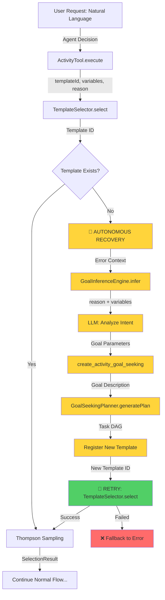

# Agent-Executor Autonomous Activity Execution Flow

**Feature**: `agent-executor-autonomous-activity-execution`  
**Date**: 2025-03-14  
**Status**: 90% Implemented - Missing autonomous recovery mechanism

---

## Executive Summary

This flow enables LLM agents to autonomously execute reusable activity templates with Thompson Sampling for variant selection, context gathering, and comprehensive tracking. **Critical gap**: No autonomous template creation when template not found (try-create-retry pattern incomplete).

---

## Mermaid Flow Diagram

### Current Implementation (Without Autonomous Recovery)

```mermaid
graph TD
    A[User Request: Natural Language] -->|Agent Decision| B[ActivityTool.execute]
    B -->|templateId, variables, reason| C[TemplateSelector.select]
    C -->|Template ID| D{Template Exists?}
    D -->|No| E[❌ ERROR: Template Not Found]
    D -->|Yes| F[Thompson Sampling]
    
    F -->|SelectionResult| G[TemplateLoader.load]
    G -->|Backend Query| H{Load Source?}
    H -->|Cache Hit| I[TemplateCache]
    H -->|Metabob Backend| J[MCP: getTemplate]
    H -->|Bootstrap Fallback| K[Embedded Templates]
    
    I --> L[Template Schema]
    J --> L
    K --> L
    
    L -->|Template + Variables| M[validateTemplateVariables]
    M -->|Valid?| N{Validation Result}
    N -->|Invalid| O[❌ ERROR: Missing/Unexpected Variables]
    N -->|Valid| P[Activity.create]
    
    P -->|Activity Record| Q[Session.createForActivity]
    Q -->|Isolated Session| R[SessionMemoryAgent.gatherContext]
    R -->|Context Requirements| S{Context Needed?}
    S -->|Yes| T[LLM: Analyze & Create Impulses]
    S -->|No| U[Skip Context Gathering]
    
    T -->|Impulses| V[Map Context to Variables]
    U --> V
    V -->|Merged Variables| W[topologicalSort]
    
    W -->|Task Execution Order| X[For Each Task]
    X -->|Task Definition| Y{Execution Mode?}
    Y -->|Trailblazing| Z[TrailblazingExecutor]
    Y -->|Deterministic| AA[executeTaskDeterministic]
    
    Z -->|LLM + Tool Calls| AB[Task Result]
    AA -->|Direct Tool Execution| AB
    
    AB -->|Success?| AC{Task Status}
    AC -->|Failed| AD[Activity Failed]
    AC -->|Success| AE{More Tasks?}
    AE -->|Yes| X
    AE -->|No| AF[All Tasks Complete]
    
    AF -->|Execution Results| AG[computeCorrectnessVerdict]
    AG -->|Correctness Assessment| AH[Update Template Metrics]
    AH -->|Incremental Weighted Avg| AI[TemplateRepository.updateMetrics]
    AI -->|Backend Sync| AJ[MetabobCLI.reportExecutionStep]
    
    AJ -->|Non-blocking| AK[Activity.save]
    AK -->|Dual Persistence| AL[Local Storage]
    AK -->|Optional| AM[Backend Storage]
    
    AL --> AN[✅ Activity Complete]
    AM --> AN
    AD --> AN
    E --> AO[❌ Agent Must Handle Error]
    O --> AO
    
    style A fill:#e1f5ff
    style E fill:#ff6b6b
    style O fill:#ff6b6b
    style AD fill:#ff6b6b
    style AN fill:#51cf66
    style AO fill:#ffa94d
```



### Desired Implementation (With Autonomous Recovery)



---

## Data Flow Summary

### Entry Point

**Where**: `ActivityTool.execute()` at `src/tool/activity.ts:425`

**Input Format**:
```typescript
{
  templateId: string,              // e.g., "fix-bug-complete"
  variables: Record<string, unknown>, // e.g., { filePath: "auth.py", bugType: "SQL injection" }
  reason: string,                  // e.g., "Fix SQL injection in authentication"
  trailblazing?: {
    enabled: boolean,
    maxCostPerTask: number,
    maxTotalCost: number,
    maxRecoveryAttempts: number
  }
}
```

**Trigger**: LLM agent decides to use activity tool based on system prompt guidance

**Context**: Calling session has recent conversation history for context enrichment

---

### Key Transformations

#### 1. Template ID → Template Schema (with Thompson Sampling)

**Component**: `TemplateSelector.select()`  
**Location**: `src/session/template-selector.ts:121`

**Input**: `templateId: string`  
**Output**: 
```typescript
{
  template: ActivityTemplate.Schema,
  selectedId: string,
  variant: "stable" | "candidate",
  thompsonSampling?: {
    method: "thompson_sampling",
    alpha: number,  // Success count + 1
    beta: number,   // Failure count + 1
    sample: number  // Random sample from Beta(alpha, beta)
  }
}
```

**Business Logic**:
- Implements multi-armed bandit optimization for template improvement
- Balances exploration (trying candidate variants) vs exploitation (using stable templates)
- ~10-30% probability of selecting candidate based on success metrics
- Falls back to stable on candidate load failure

**Critical Failure Point**:
```typescript
// Line 130
if (!requestedTemplate) {
  throw new Error(`Template not found: ${templateId}`)
  // ❌ Should trigger autonomous recovery here
}
```

#### 2. Template + Variables → Validated Parameters

**Component**: `validateTemplateVariables()`  
**Location**: `src/tool/activity.ts:128`

**Input**: 
- `template: ActivityTemplate.Schema`
- `providedVariables: Record<string, unknown>`

**Output**:
```typescript
{
  valid: boolean,
  missing: Array<{ name: string, description?: string }>,
  unexpected: Array<{ name: string, suggestion?: string }>,
  errorMessage: string
}
```

**Validation Rules**:
- All required template variables must be provided
- No unexpected variables (helps catch typos)
- Fuzzy matching with Levenshtein distance < 3 for suggestions
- Descriptive error messages with expected vs provided

**Example Error**:
```
❌ Activity variable validation failed for template "Fix Bug"

Missing required variables:
  - filePath: Path to file containing the bug
  - bugDescription: Description of the bug to fix

Unexpected variables:
  - bugType (did you mean "bugDescription"?)
```

#### 3. Context Requirements → Impulses

**Component**: `SessionMemoryAgent.gatherContext()`  
**Location**: `src/tool/activity.ts:705`

**Input**:
```typescript
{
  requirements: ContextRequirement[],  // e.g., "files related to authentication"
  reason: string,
  recentMessages: MessageV2.WithParts[]
}
```

**Output**: 
```typescript
Record<string, ActivityTemplate.Impulse.Schema>
```

**Transformation Logic**:
- LLM analyzes intent and suggests relevant impulses
- Creates impulses for files, Metabob issues, bash output, etc.
- Loads impulse content lazily
- Maps impulses to template variables by requirement key

**Example**:
```typescript
// Context requirement
{ key: "relevantFiles", description: "Files related to authentication" }

// Generated impulses
{
  "auth-file-1": {
    type: "file",
    pointer: { path: "src/auth/login.ts" },
    content: "...",  // Loaded content
    budget: 2000
  }
}

// Mapped to variable
variables["relevantFiles"] = "src/auth/login.ts:\n..."
```

#### 4. Task Definitions → Execution Order

**Component**: `topologicalSort()`  
**Location**: `src/tool/activity.ts:2321`

**Input**: `ActivityTemplate.Task[]` with `dependencies: string[]`  
**Output**: `string[]` (task IDs in execution order)

**Algorithm**: Kahn's algorithm for topological sorting (DAG)

**Validation**:
- Detects cycles (invalid templates)
- Ensures all dependencies exist
- Throws error if graph is not acyclic

**Example**:
```typescript
// Tasks
[
  { id: "gather-info", dependencies: [] },
  { id: "analyze", dependencies: ["gather-info"] },
  { id: "fix", dependencies: ["analyze"] },
  { id: "test", dependencies: ["fix"] }
]

// Execution order
["gather-info", "analyze", "fix", "test"]
```

#### 5. Task Execution → Results

**Components**: 
- `TrailblazingExecutor.executeTaskWithTrailblazing()` (LLM-assisted)
- `executeTaskDeterministic()` (Direct tool calls)

**Input**:
```typescript
{
  task: ActivityTemplate.Task,
  variables: Record<string, unknown>,
  sessionID: string,
  abortSignal: AbortSignal
}
```

**Output**:
```typescript
{
  success: boolean,
  duration: number,
  cost: number,
  tokens: { input, output, cache },
  impulses?: Record<string, Impulse>,  // Newly created
  attempts?: number  // For trailblazing
}
```

**Execution Modes**:

**Trailblazing Mode** (task has `prompt`):
- Creates sub-session
- Executes LLM prompt with tool access
- Retries with modified prompts on failure (recovery attempts)
- Captures newly created impulses
- More expensive but flexible

**Deterministic Mode** (task has `toolSequence`):
- Executes predefined tool calls in sequence
- No LLM involved (faster, cheaper)
- Used for CI/CD, simple automation
- Predictable execution

#### 6. Execution Results → Learning Metrics

**Component**: `TemplateRepository.updateMetrics()`  
**Location**: `src/tool/activity.ts:1184`

**Input**: Execution result + current template metrics

**Output**: Updated template with new metrics

**Formula**: Incremental Weighted Average (prevents overflow)
```typescript
newAvg = oldAvg + (newValue - oldAvg) / (count + 1)
```

**Metrics Updated**:
- `successRate`: Percentage of successful executions
- `avgDuration`: Average execution time (milliseconds)
- `avgCost`: Average cost (USD)
- `avgTokens`: Average token usage
- `improvementGradient`: Composite quality score (0.0 to 1.0)

**Improvement Gradient Calculation**:
```typescript
costEfficiency = 1 - min(avgCost / $2.50, 1.0)
durationEfficiency = 1 - min(avgDuration / 600000ms, 1.0)

improvementGradient = 
  successRate * 0.5 + 
  costEfficiency * 0.25 + 
  durationEfficiency * 0.25
```

**Purpose**: Thompson Sampling uses these metrics to decide variant selection

---

### Validation Points

#### Pre-Flight Validation
**Location**: `src/tool/activity.ts:528`

**Checks**:
- Template variables match provided variables
- Required files exist (if specified in template)
- Pre-conditions satisfied

**Failure**: Throws error before activity execution starts

#### Post-Execution Validation
**Location**: `src/tool/activity.ts:1640-1735`

**Checks**:
- Required files created
- Required patterns present in files
- Forbidden patterns absent
- Commands succeed

**Failure**: Activity marked as failed, metrics updated

#### Correctness Validation
**Location**: `src/tool/activity.ts:1121-1131`

**Analyzes**:
- Execution evidence (sessions, tool calls)
- Work artifacts (files changed, commits)
- Validation results

**Output**: Correctness verdict
```typescript
{
  verdict: "correct" | "incorrect" | "uncertain",
  confidence: number (0.0 to 1.0),
  issues: string[],
  reasoning: string
}
```

---

### Architectural Boundaries Crossed

#### 1. Service Boundary: OpenCode ↔ Metabob Backend

**Protocol**: MCP (Model Context Protocol)  
**Transport**: HTTP/HTTPS  
**Location**: `TemplateLoader.load()` → `TemplateServiceClient.getTemplate()`

**Contract**:
```typescript
interface TemplateServiceClient {
  getTemplate(options: { templateId: string, version?: string }): 
    Promise<{ success: boolean, template?: ActivityTemplate.Schema }>
}
```

**Resilience**:
- Retry with exponential backoff (3 attempts)
- 10-second timeout per call
- Graceful fallback to bootstrap templates
- `strictBackend` mode for production

**Data Format**: ActivitySchemaAdapter converts between OpenCode canonical and Metabob formats

#### 2. Data Store Boundary: Activity Persistence

**Strategy**: Dual Write (Local + Backend)

**Local Storage**:
- Path: `~/.local/share/opencode/storage/activity/{projectId}/{activityId}.json`
- Synchronous write (must succeed)
- Fast path for local access

**Backend Storage** (Optional):
- MCP tool: `metabob_activity_save`
- Asynchronous write (best-effort)
- Enables cross-instance access

**Trade-off**: Consistency vs Availability
- Local-first for performance
- Backend-optional for resilience
- No transaction guarantees across stores

#### 3. Layer Boundary: Tool → Service → Repository

**Pattern**: Clean Architecture / Layered Architecture

**Flow**:
1. **Tool Layer**: `ActivityTool.execute()` - Validation, error formatting
2. **Service Layer**: `TemplateSelector.select()` - Business logic, Thompson Sampling
3. **Repository Layer**: `TemplateRepository.get()` - Data access orchestration
4. **Loader Layer**: `TemplateLoader.load()` - Low-level fetching, retry

**Dependencies**: Unidirectional (Tool → Service → Repository → Loader)

#### 4. Integration Boundary: Learning Loop

**Purpose**: Report execution data to backend for cross-execution learning

**Non-Blocking**: Failures logged but don't block activity completion

**API Calls**:
- `MetabobCLI.startActivityExecution()` - Activity started
- `MetabobCLI.reportExecutionStep()` - Task completed

**Data Reported**:
- Template definition
- Variable bindings
- Initial state (git commit, files)
- Per-task results (duration, cost, tokens)
- State transformations

---

### Exit Point

**Where**: `Activity.save()` at `src/session/activity.ts:667`

**Final Format**:
```typescript
Activity.Info {
  id: string,
  templateId: string,
  templateVersion: number,
  variables: Record<string, unknown>,
  reason: string,
  status: "done" | "failed",
  startedAt: number,
  completedAt: number,
  stats: {
    tokens: { input, output, cache: { read, write } },
    cost: { total, perPrompt },
    duration: number
  },
  impulses: Record<string, Impulse>,
  sessionIDs: string[],
  executionEvidence: {
    sessionsSpawned: SessionInfo[],
    toolCalls: ToolCallInfo[]
  },
  workArtifacts: {
    filesChanged: string[],
    commitsMade: string[]
  },
  correctnessVerdict?: {
    verdict: "correct" | "incorrect" | "uncertain",
    confidence: number,
    issues: string[]
  }
}
```

**Side Effects**:
- Written to local storage (synchronous)
- Optionally written to backend (asynchronous)
- `Activity.Event.Completed` published to event bus

---

## Key Insights

### Business Purpose

**Primary Goal**: Enable LLM agents to autonomously execute complex, multi-step workflows using reusable templates with continuous improvement through Thompson Sampling.

**Key Benefits**:
1. **Reusability**: Templates can be used across sessions and agents
2. **Learning**: Thompson Sampling optimizes template variants over time
3. **Tracking**: Comprehensive execution evidence for debugging and learning
4. **Context Awareness**: Automatic context gathering based on requirements
5. **Resilience**: Multi-level fallbacks, retry logic, graceful degradation

**Use Cases**:
- Bug fixing with established patterns
- Feature development following team conventions
- Code refactoring with validation checks
- Infrastructure automation with rollback capability

---

### Critical Decision Points

#### 1. Template Not Found (Line src/session/template-selector.ts:130) ⚠️ CRITICAL

**Current Behavior**: Throws error → Agent must manually handle

**Decision Impact**: 
- ❌ Blocks autonomous execution
- ❌ Requires manual intervention
- ❌ Breaks flow continuity

**Desired Behavior**: 
```typescript
if (!requestedTemplate) {
  // Autonomous recovery
  try {
    const goal = await GoalInferenceEngine.infer({ templateId, reason, variables })
    const newTemplateId = await create_activity_goal_seeking(goal)
    return await select(newTemplateId, backend)  // Retry
  } catch (autoCreateError) {
    throw new Error(`Template not found: ${templateId}`)
  }
}
```

**Recommendation**: **Implement try-create-retry pattern immediately**

#### 2. Thompson Sampling Variant Selection (Line src/session/template-selector.ts:157)

**Decision**: Use Thompson Sampling over epsilon-greedy

**Rationale**:
- Better exploration-exploitation trade-off
- Adapts to success rate automatically
- No hyperparameter tuning required

**Implementation**: Delegates to MCP backend for centralized learning

**Trade-off**: 
- ✅ Better long-term performance
- ⚠️ Requires backend connectivity
- ⚠️ Cold-start problem (no metrics initially)

#### 3. Dual Persistence Strategy (Line src/session/activity.ts:667)

**Decision**: Write to both local storage and backend

**Rationale**:
- Local-first for performance and offline capability
- Backend-optional for cross-instance access
- Non-blocking backend writes prevent timeout failures

**Trade-off**:
- ✅ Performance and resilience
- ❌ Eventual consistency only (no transactions)
- ❌ Potential local-backend divergence

#### 4. Context Gathering (Line src/tool/activity.ts:705)

**Decision**: Use LLM-based SessionMemoryAgent for context inference

**Rationale**:
- Flexible - adapts to natural language requirements
- Automatic - no manual impulse creation
- Intelligent - uses conversation history

**Trade-off**:
- ✅ Better UX (automatic context)
- ⚠️ Additional LLM call (cost, latency)
- ⚠️ Potential timeout (3-second default)

---

### Potential Risks & Technical Debt

#### High Priority Risks

1. **No Autonomous Recovery from Template Not Found** ⚠️ CRITICAL
   - **Impact**: Agent must manually create templates
   - **Risk**: Poor UX, flow interruption
   - **Mitigation**: Implement try-create-retry pattern
   - **Effort**: Medium (2-3 days)

2. **Type Safety Issues (Excessive `any` types)**
   - **Impact**: Runtime errors, poor IntelliSense
   - **Risk**: Bugs in production, difficult refactoring
   - **Mitigation**: Define proper interfaces
   - **Effort**: Low (1 day)

3. **Command Injection in Deterministic Mode**
   - **Impact**: Security vulnerability if variables contain malicious input
   - **Risk**: Remote code execution
   - **Mitigation**: Sanitize bash commands
   - **Effort**: Low (0.5 day)

#### Medium Priority Technical Debt

4. **Potential Race Conditions in Activity Updates**
   - **Impact**: Lost updates when multiple tasks modify activity concurrently
   - **Risk**: Data loss, inconsistent state
   - **Mitigation**: Add optimistic locking
   - **Effort**: Medium (1-2 days)

5. **Performance: Repeated Activity Reloading**
   - **Impact**: I/O overhead on every task iteration
   - **Risk**: Slow execution for multi-task activities
   - **Mitigation**: In-memory cache with dirty flag
   - **Effort**: Low (0.5 day)

6. **Silent Failures in Non-Blocking Operations**
   - **Impact**: Context injection or learning loop failures go unnoticed
   - **Risk**: Incomplete data, poor observability
   - **Mitigation**: Add metrics/monitoring
   - **Effort**: Low (0.5 day)

#### Low Priority Technical Debt

7. **Hardcoded Configuration (Magic Numbers)**
   - **Impact**: Inflexible, difficult to tune
   - **Risk**: Poor performance in different environments
   - **Mitigation**: Extract to configuration
   - **Effort**: Low (0.5 day)

8. **TODO Comments for ACP Connection**
   - **Impact**: Phase 3 remote execution incomplete
   - **Risk**: Feature not functional
   - **Mitigation**: Complete ACP implementation
   - **Effort**: High (1 week)

---

### Suggested Improvements

#### Critical Improvements

1. **Implement Try-Create-Retry Pattern** 🔥 TOP PRIORITY

**Component**: `TemplateSelector.select()` at line 130

**Implementation**:
```typescript
// src/session/autonomous-activity-executor.ts
export async function executeWithAutoCreation(params: {
  templateId: string,
  variables: Record<string, unknown>,
  reason: string,
  trailblazing?: {...}
}): Promise<ActivityResult> {
  try {
    return await ActivityTool.execute(params)
  } catch (error) {
    if (isTemplateNotFoundError(error)) {
      // Autonomous recovery
      const goal = await GoalInferenceEngine.infer({
        attemptedTemplateId: params.templateId,
        reason: params.reason,
        variables: params.variables
      })
      
      const newTemplateId = await create_activity_goal_seeking(goal)
      
      return await ActivityTool.execute({
        ...params,
        templateId: newTemplateId
      })
    }
    throw error
  }
}
```

**Files to Create**:
- `src/session/goal-inference-engine.ts` - LLM-based goal inference
- `src/session/autonomous-activity-executor.ts` - Wrapper with retry

**Benefit**: Enables true autonomous execution, removes manual intervention

#### High Priority Improvements

2. **Add Proper TypeScript Types**

**Replace `any` types with**:
```typescript
interface ACPConnection {
  sessionId: string
  send(message: ACPMessage): Promise<void>
  close(): Promise<void>
}

interface ToolCallResult {
  tool: string
  success: boolean
  output?: unknown
  error?: string
}
```

**Benefit**: Type safety, better IntelliSense, easier refactoring

3. **Add Input Sanitization for Bash Commands**

```typescript
function sanitizeBashCommand(cmd: string): string {
  // Escape shell metacharacters
  return cmd.replace(/(["\s'$`\\])/g, '\\$1')
}
```

**Benefit**: Prevents command injection attacks

#### Medium Priority Improvements

4. **Add Optimistic Locking for Activity Updates**

```typescript
export interface Info {
  version: number  // Add version field
  // ... existing fields
}

export async function save(activity: Info): Promise<void> {
  const current = await load(activity.id)
  if (current.version !== activity.version) {
    throw new ConcurrentModificationError()
  }
  activity.version++
  await Storage.write(["activity", projectId, activity.id], activity)
}
```

**Benefit**: Prevents lost updates in concurrent scenarios

5. **Add Metrics for Silent Failures**

```typescript
} catch (error) {
  log.warn("context injection failed", { error })
  metrics.incrementCounter("activity.context_injection_failure")
  // Continue execution
}
```

**Benefit**: Better observability, alerting on high failure rates

---

## Reusable Patterns

### Pattern 1: Try-Create-Retry with Goal-Seeking

**Abstraction**: When a resource is not found, infer intent and auto-create it

**Reusable Template**:
```typescript
async function withAutoCreation<T, CreateParams>(
  tryFn: () => Promise<T>,
  inferFn: (error: Error) => Promise<CreateParams>,
  createFn: (params: CreateParams) => Promise<void>,
  retryFn: () => Promise<T>
): Promise<T> {
  try {
    return await tryFn()
  } catch (error) {
    if (isNotFoundError(error)) {
      const params = await inferFn(error)
      await createFn(params)
      return await retryFn()
    }
    throw error
  }
}
```

**Applicable To**:
- Template not found → Create from goal
- File not found → Generate from spec
- Configuration missing → Infer from context
- Dependency missing → Install from manifest

**Feature-Specific**: Goal inference logic (template-specific)  
**Universal**: Try-catch-create-retry structure

---

### Pattern 2: Thompson Sampling for A/B Testing

**Abstraction**: Multi-armed bandit optimization for variant selection

**Reusable Template**:
```typescript
interface Variant<T> {
  id: string
  value: T
  successRate: number
  executions: number
}

function thompsonSample<T>(variants: Variant<T>[]): Variant<T> {
  const samples = variants.map(v => {
    const alpha = v.successRate * v.executions + 1
    const beta = (1 - v.successRate) * v.executions + 1
    return {
      variant: v,
      sample: betaDistribution.sample(alpha, beta)
    }
  })
  
  return samples.reduce((best, current) => 
    current.sample > best.sample ? current : best
  ).variant
}
```

**Applicable To**:
- Template variant selection
- Model selection (Haiku vs Sonnet vs Opus)
- Strategy selection (greedy vs beam search)
- Configuration tuning (cache size, timeout values)

**Feature-Specific**: Template metrics (success rate, cost, duration)  
**Universal**: Thompson Sampling algorithm

---

### Pattern 3: Dual Persistence with Non-Blocking Backend

**Abstraction**: Write-through local cache with eventual consistency to backend

**Reusable Template**:
```typescript
async function dualSave<T>(
  data: T,
  localStore: (data: T) => Promise<void>,
  backendStore: (data: T) => Promise<void>
): Promise<void> {
  // Synchronous local write (must succeed)
  await localStore(data)
  
  // Asynchronous backend write (best-effort)
  backendStore(data).catch(error => {
    log.warn("backend save failed (non-fatal)", { error })
    metrics.incrementCounter("backend.save_failure")
  })
}
```

**Applicable To**:
- Activity persistence
- Session storage
- Configuration updates
- Metric collection

**Feature-Specific**: Activity.Info schema  
**Universal**: Dual persistence strategy

---

### Pattern 4: Context Gathering via LLM

**Abstraction**: Infer relevant context from natural language requirements

**Reusable Template**:
```typescript
async function gatherContext(
  requirements: ContextRequirement[],
  recentActivity: string[]
): Promise<ContextItems> {
  const prompt = buildPrompt(requirements, recentActivity)
  
  const suggestions = await llm.generate({
    prompt,
    schema: ContextSuggestionsSchema
  })
  
  const items = await Promise.all(
    suggestions.map(s => loadContextItem(s))
  )
  
  return items
}
```

**Applicable To**:
- Activity context requirements
- Code review context
- Documentation generation
- Test case selection

**Feature-Specific**: Context requirement format  
**Universal**: LLM-based inference structure

---

### Pattern 5: Topological Task Execution

**Abstraction**: Execute tasks in dependency order with parallel opportunities

**Reusable Template**:
```typescript
async function executeDAG<T, R>(
  nodes: Array<{ id: string, dependencies: string[], execute: () => Promise<R> }>
): Promise<Map<string, R>> {
  const order = topologicalSort(nodes)
  const results = new Map<string, R>()
  
  for (const nodeId of order) {
    const node = nodes.find(n => n.id === nodeId)!
    results.set(nodeId, await node.execute())
  }
  
  return results
}
```

**Applicable To**:
- Activity task execution
- Build system (make-like)
- Data pipeline
- Workflow orchestration

**Feature-Specific**: Task execution logic  
**Universal**: DAG execution structure

---

## Feature-Specific vs. Universal Aspects

### Feature-Specific (Activity Execution)

- **Template schema**: ActivityTemplate.Schema structure
- **Variable validation**: Template-specific variable contracts
- **Context requirements**: Activity-specific context needs
- **Impulse system**: Activity-specific knowledge representation
- **Correctness validation**: Activity-specific success criteria

### Universal (Reusable Patterns)

- **Try-create-retry**: General error recovery pattern
- **Thompson Sampling**: General A/B testing algorithm
- **Dual persistence**: General caching strategy
- **LLM inference**: General context gathering approach
- **DAG execution**: General dependency resolution

### Abstraction Opportunities

1. **Create Generic Resource Loader**:
   ```typescript
   interface ResourceLoader<T> {
     load(id: string): Promise<T>
     create(params: unknown): Promise<T>
     shouldAutoCreate: boolean
   }
   ```

2. **Create Generic A/B Testing Framework**:
   ```typescript
   interface ABTest<T> {
     variants: Variant<T>[]
     select(): Variant<T>
     recordResult(variantId: string, success: boolean): void
   }
   ```

3. **Create Generic Workflow Engine**:
   ```typescript
   interface WorkflowEngine {
     execute(workflow: Workflow): Promise<WorkflowResult>
     validate(workflow: Workflow): ValidationResult
     optimize(workflow: Workflow): Workflow
   }
   ```

---

## Implementation Roadmap

### Phase 1: Critical Gap (Autonomous Recovery) - 1 Week

**Goal**: Enable try-create-retry pattern

**Tasks**:
1. Create `GoalInferenceEngine` (2 days)
   - LLM-based goal inference from error context
   - Fallback to rule-based inference
   - Unit tests

2. Create `AutonomousActivityExecutor` wrapper (1 day)
   - Catch template not found errors
   - Call GoalInferenceEngine
   - Invoke create_activity_goal_seeking
   - Retry with new template

3. Integration and testing (2 days)
   - Update ActivityTool to use new wrapper
   - End-to-end tests
   - Documentation updates

**Success Criteria**: 
- Agent can autonomously create templates when not found
- No manual intervention required
- Graceful fallback if auto-creation fails

### Phase 2: Type Safety & Security - 3 Days

**Goal**: Fix type safety and security issues

**Tasks**:
1. Replace `any` types (1 day)
2. Add input sanitization (0.5 day)
3. Add proper error types (0.5 day)
4. Testing (1 day)

### Phase 3: Performance & Observability - 3 Days

**Goal**: Optimize and improve monitoring

**Tasks**:
1. Add optimistic locking (1 day)
2. Optimize activity reloading (0.5 day)
3. Add metrics for silent failures (0.5 day)
4. Extract configuration (0.5 day)
5. Testing (0.5 day)

---

## Related Documentation

- [Activity System Guide](../activity-system/ACTIVITY_EXECUTION_GUIDE.md)
- [Template Creation](../GOAL_SEEKING_ACTIVITY_CREATION.md)
- [Thompson Sampling Implementation](../IMPLEMENTATION_THOMPSON_AND_GRADIENTS.md)
- [Architectural Boundaries](../architectural-boundaries/METABOB_OPENCODE_ARCHITECTURAL_BOUNDARIES.md)

---

## Appendix: Complete Data Flow Table

| Stage | Component | Input Type | Output Type | Side Effects | Error Handling |
|-------|-----------|------------|-------------|--------------|----------------|
| 1. Entry | ActivityTool.execute | `{ templateId, variables, reason }` | Activity result | Session creation | Validation errors |
| 2. Selection | TemplateSelector.select | `templateId: string` | `SelectionResult` | Thompson Sampling log | ❌ Template not found |
| 3. Loading | TemplateLoader.load | Template ID | `LoadResult` | Cache update | Retry with backoff |
| 4. Validation | validateTemplateVariables | Template + variables | `ValidationResult` | None | Descriptive errors |
| 5. Activity Init | Activity.create | Activity params | `Activity.Info` | Storage write | ID collision |
| 6. Session Init | Session.createForActivity | Session params | Session object | Storage write | Session exists |
| 7. Context | SessionMemoryAgent.gatherContext | Context requirements | Impulses | LLM call | Timeout |
| 8. Sorting | topologicalSort | Task array | Task order | None | Cycle detection |
| 9. Execution | executeTask | Task definition | Task result | Sub-session, tools | Abort signal |
| 10. Metrics | updateMetrics | Execution result | Updated template | Backend sync | Non-blocking |
| 11. Verdict | computeCorrectnessVerdict | Evidence | Verdict | None | Low confidence |
| 12. Exit | Activity.save | Activity state | void | Dual persistence | Local must succeed |

---

**End of Documentation**
