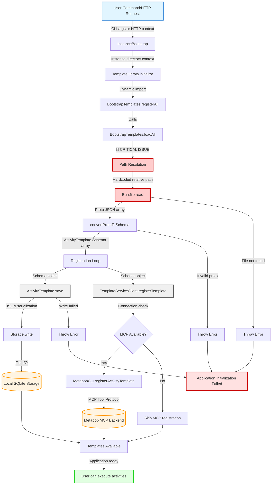
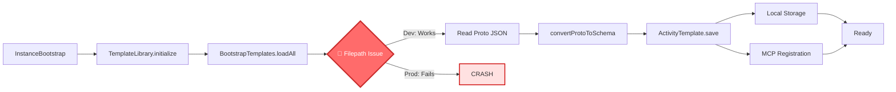

# Data Flow Analysis: Bootstrap Template Filepath Compliance

**Feature:** bootstrap-template-filepath-compliance  
**Status:** 🔴 CRITICAL - Production Blocker  
**Date:** 2026-03-02  
**Root Cause:** Hardcoded development-only filepath breaks in production environments

---

## Executive Summary

The bootstrap template loading system is responsible for loading 6 critical activity templates at application startup. These templates enable vessel self-configuration capabilities (creating activities, debugging, evolution, etc.).

**Critical Issue:** The implementation uses a hardcoded relative filepath that assumes a specific monorepo directory structure. This works in development but fails completely in Docker containers and standalone binary distributions, making the application non-functional in production environments.

**Impact:** P0 Blocker - Application initialization fails completely in production, rendering OpenCode unusable.

---

## Flow Diagram



### Simplified Flow (Key Components Only)



---

## Data Flow Summary

### 1. Entry Point

**Component:** `InstanceBootstrap()` (bootstrap.ts:15)

**Entry Format:**
```typescript
// No direct input - uses Instance.directory from context
Instance.provide({
  directory: string,           // Project directory path
  init: InstanceBootstrap,     // Bootstrap function
  fn: () => Promise<T>         // Command to execute after bootstrap
})
```

**Trigger:** Every application start
- CLI commands: `opencode`, `opencode chat`, etc.
- HTTP server requests: Middleware wraps all requests
- ACP server: Remote agent connections

**Entry Data:**
- `Instance.directory`: Project directory path (e.g., `/path/to/project`)
- No other inputs required

---

### 2. Key Transformations

#### Transformation 1: Filepath Resolution → File Handles
**Location:** `bootstrap-templates.ts:17, 196-207`

**Input:** Module-level constant `BOOTSTRAP_DIR`  
**Output:** Bun.file handles

**🔴 CRITICAL ISSUE:**
```typescript
// Line 17: Hardcoded relative path
const BOOTSTRAP_DIR = "../../../../../metabob-proto/activities/bootstrap"
const __dirname = path.dirname(fileURLToPath(import.meta.url))

// Line 20-30: Computed paths
const TEMPLATE_FILES = {
  "create-activity": path.join(__dirname, BOOTSTRAP_DIR, "create-activity-self-contained.json"),
  // ... 5 more templates
}

// Line 196-207: File reading
for (const [id, filePath] of Object.entries(TEMPLATE_FILES)) {
  const file = Bun.file(filePath)  // ← FAILS in production
  const json = await file.json()
  templates.push(json)
}
```

**Environment-Specific Behavior:**

| Environment | `__dirname` | Resolved Path | Status |
|-------------|-------------|---------------|--------|
| **Development** | `/path/to/metabob-devbob/repos/metabob-opencode/packages/opencode/src/session/` | `/path/to/metabob-devbob/repos/metabob-proto/activities/bootstrap/` | ✅ Works |
| **Docker Container** | Embedded in binary | `<binary-location>/../../../../../metabob-proto/` | ❌ Broken (workaround: COPY to `/metabob-proto/`) |
| **Standalone Binary** | User installation directory | `<install-dir>/../../../../../metabob-proto/` | ❌ Broken (proto not distributed) |

**Transformation:**
```
String (relative path) 
  → path.join(__dirname, BOOTSTRAP_DIR, filename)
  → Absolute filepath string
  → Bun.file() handle
  → File read operation
```

---

#### Transformation 2: Proto JSON → ActivityTemplate.Schema
**Location:** `bootstrap-templates.ts:47-188`

**Input:** Proto JSON (snake_case fields, enum values)  
**Output:** ActivityTemplate.Schema (camelCase fields, string literals)

**Field Mappings:**
```typescript
// Category enum → string literal
Proto category: 0-4 (enum) → Schema category: "feature" | "bugfix" | "refactor" | "tool" | "infrastructure"

// Field name conversions (snake_case → camelCase)
activity_id → id
task_id → id
max_tokens → maxTokens
compression_strategy → compressionStrategy
required_files → requiredFiles
pre_checks → preChecks
post_checks → postChecks

// Generated metadata (not in proto)
version: Generated via generateVersion(contentHash, timestamp)
genealogy: Generated via createGenealogy(parentId, reason, author)
createdAt: Date.now()
updatedAt: Date.now()
executions: 0
successRate: 0
```

**Transformation:**
```
Proto JSON (any)
  → Zod validation (MISSING - should be added)
  → Field mapping (snake_case → camelCase)
  → Enum conversion (number → string literal)
  → Metadata generation (version, genealogy)
  → ActivityTemplate.Schema (typed object)
```

---

#### Transformation 3: Schema Object → Local Storage
**Location:** `activity-template.ts:690-697`

**Input:** ActivityTemplate.Schema (TypeScript object)  
**Output:** void (side effect: JSON file on disk)

**Mutation:** `template.updatedAt = Date.now()`

**Storage Format:**
```typescript
// Storage path
~/.local/share/opencode/storage/activity-template/{template.id}.json

// File content (pretty-printed JSON)
{
  "id": "create-activity",
  "name": "Create Activity Template",
  "version": { "full_version": "v1.0.0-abc123", ... },
  "genealogy": { "depth": 0, "parent_id": "", ... },
  "tasks": [...],
  "updatedAt": 1709375471000,
  // ... rest of schema
}
```

**Transformation:**
```
ActivityTemplate.Schema (TypeScript object)
  → Mutate updatedAt timestamp
  → JSON.stringify(value, null, 2)
  → fs.writeFile(path, json)
  → File written to ~/.local/share/opencode/storage/
```

---

#### Transformation 4: Schema Object → MCP Registration Request
**Location:** `template-service-client.ts:293-332`

**Input:** RegisterTemplateOptions { template, overwrite? }  
**Output:** RegisterTemplateResult { success, templateId?, error? }

**Network Protocol:**
```typescript
// MCP Tool Call (JSON-RPC over HTTP/gRPC)
{
  tool: "metabob_register_activity_template",
  arguments: {
    template: ActivityTemplate.Schema,  // Full schema object
    overwrite: boolean
  }
}

// MCP Tool Result
{
  content: [
    { type: "text", text: '{"success": true, "templateId": "create-activity"}' }
  ],
  metadata: {}
}
```

**Transformation:**
```
ActivityTemplate.Schema (TypeScript object)
  → RegisterTemplateOptions wrapper
  → MCP connection check (cached 1 min)
  → MetabobCLI.registerActivityTemplate()
  → MCP tool call (JSON-RPC)
  → Backend HTTP/gRPC request
  → Response parsing
  → RegisterTemplateResult { success, templateId, error }
```

---

### 3. Validations

#### ❌ Missing Validations (Critical Gaps)

1. **File Existence Validation** (bootstrap-templates.ts:196)
   ```typescript
   // MISSING: Proactive check before read
   const file = Bun.file(filePath)
   const json = await file.json()  // ← Throws if file doesn't exist
   ```
   
   **Should be:**
   ```typescript
   const file = Bun.file(filePath)
   const exists = await file.exists()
   if (!exists) {
     log.warn("template file not found", { id, filePath })
     continue  // Allow partial loading
   }
   const json = await file.json()
   ```

2. **Proto Schema Validation** (bootstrap-templates.ts:47)
   ```typescript
   // MISSING: Input validation
   function convertProtoToSchema(protoJson: any): ActivityTemplate.Schema {
     const category = categoryMap[protoJson.category] || "feature"  // Silently defaults
     const id = protoJson.activity_id || protoJson.id || ""  // Empty string allowed
   }
   ```
   
   **Should use Zod:**
   ```typescript
   const ProtoTemplateSchema = z.object({
     activity_id: z.string().optional(),
     id: z.string().optional(),
     name: z.string().min(1),
     category: z.number().int().min(0).max(4),
     tasks: z.array(...).min(1),
   })
   
   function convertProtoToSchema(protoJson: any): ActivityTemplate.Schema {
     const validated = ProtoTemplateSchema.parse(protoJson)  // Throws on invalid
     // ...
   }
   ```

3. **Path Safety Validation**
   ```typescript
   // MISSING: Path traversal check
   const filePath = path.join(__dirname, BOOTSTRAP_DIR, filename)
   // Should validate: No ".." escapes, within allowed directory
   ```

#### ✅ Existing Validations

1. **Storage Write Lock** (storage.ts:180-200)
   ```typescript
   await lock.run(key.join("/"), async () => {
     await fs.mkdir(path.dirname(file), { recursive: true })
     await fs.writeFile(file, JSON.stringify(value, null, 2))
   })
   ```
   - Prevents concurrent writes to same template
   - Creates parent directories if needed

2. **MCP Connection Check** (template-service-client.ts:296-303)
   ```typescript
   const status = await checkConnection()
   if (!status.connected) {
     return { success: false, error: "Metabob TemplateService not available" }
   }
   ```
   - Validates MCP availability before attempting registration
   - Caches result for 1 minute to reduce network overhead

3. **TypeScript Type Safety** (activity-template.ts)
   ```typescript
   export async function save(template: Schema): Promise<void>
   ```
   - Compile-time type checking ensures schema conformance
   - Runtime validation via TypeScript (but can be bypassed with `any`)

---

### 4. Architectural Boundaries Crossed

#### Boundary 1: Repository Boundary (Cross-Repository Filesystem)
**Type:** Repository/Filesystem  
**Components:** metabob-opencode → metabob-proto  
**Coupling:** 🔴 TIGHT (hardcoded path)

**Contract:**
```typescript
// Implicit contract: File path string resolution
Source: repos/metabob-opencode/packages/opencode/src/session/bootstrap-templates.ts:17
Target: repos/metabob-proto/activities/bootstrap/*.json

Path: "../../../../../metabob-proto/activities/bootstrap"
```

**Issue:** No version checking, no fallback, environment-dependent

---

#### Boundary 2: Data Store Boundary (Application → Local Filesystem)
**Type:** Data Store  
**Components:** ActivityTemplate.save → Storage.write → SQLite  
**Coupling:** 🟡 MEDIUM (abstraction layer)

**Contract:**
```typescript
// Storage abstraction
Storage.write(
  key: ["activity-template", template.id],
  value: ActivityTemplate.Schema
)

// File location
~/.local/share/opencode/storage/activity-template/{id}.json
```

**Resilience:** ✅ GOOD
- Locking prevents concurrent writes
- Migration support for schema evolution
- Cross-platform (Linux, macOS, Windows)

---

#### Boundary 3: Service Boundary (Application → MCP Backend)
**Type:** Network/RPC  
**Components:** TemplateServiceClient → MetabobCLI → MCP Server  
**Coupling:** 🟢 LOOSE (optional service)

**Contract:**
```typescript
// MCP Tool Protocol (JSON-RPC)
Tool: metabob_register_activity_template
Input: { template: ActivityTemplate.Schema, overwrite?: boolean }
Output: { success: boolean, templateId?: string, error?: string }

// Transport: HTTP/gRPC (configured in opencode.json)
{
  "mcp": {
    "metabob": {
      "type": "remote",
      "url": "https://metabob-mcp-server.com"
    }
  }
}
```

**Resilience:** ✅ EXCELLENT
- Graceful degradation (local fallback)
- Connection caching (reduces overhead)
- Non-blocking errors (never throws)

**Missing:** Timeout (can hang indefinitely)

---

#### Boundary 4: Schema Boundary (Proto → OpenCode)
**Type:** Data Layer  
**Components:** convertProtoToSchema  
**Coupling:** 🟡 MEDIUM (hardcoded mappings)

**Contract:**
```typescript
// Input: Proto JSON (metabob-proto schema)
interface ProtoJSON {
  activity_id?: string
  category: number  // Enum value 0-4
  tasks: Array<{ task_id: string, max_tokens?: number, ... }>
}

// Output: OpenCode schema
interface ActivityTemplate.Schema {
  id: string
  category: "feature" | "bugfix" | "refactor" | "tool" | "infrastructure"
  tasks: Array<{ id: string, maxTokens: number, ... }>
  version: Version  // GENERATED
  genealogy: TemplateGenealogy  // GENERATED
}
```

**Issue:** No validation, breaking proto changes cause silent failures

---

### 5. Exit Points

#### Exit Point 1: Local Storage (Always)
**Location:** `~/.local/share/opencode/storage/activity-template/{id}.json`

**Format:** JSON (pretty-printed)
```json
{
  "id": "create-activity",
  "name": "Create Activity Template",
  "description": "Self-contained template for creating new activity templates",
  "category": "feature",
  "version": {
    "full_version": "v1.0.0-abc123def456",
    "major": 1,
    "minor": 0,
    "patch": 0,
    "variant_hash": "abc123def456",
    "timestamp": 1709375471000
  },
  "genealogy": {
    "depth": 0,
    "parent_id": "",
    "variant_hash": "abc123def456",
    "reason": "manual",
    "author": "human",
    "improvised": false,
    "notes": "Bootstrap template"
  },
  "tasks": [...],
  "status": "stable",
  "executions": 0,
  "successRate": 0,
  "createdAt": 1709375471000,
  "updatedAt": 1709375471000
}
```

**Status:** ✅ REQUIRED - Application fails if this write fails

---

#### Exit Point 2: MCP Backend (Optional)
**Location:** Metabob MCP Server (external service)

**Format:** MCP Tool Result (JSON-RPC)
```json
{
  "content": [
    {
      "type": "text",
      "text": "{\"success\": true, \"templateId\": \"create-activity\", \"version\": \"v1.0.0\"}"
    }
  ],
  "metadata": {
    "registered_at": "2026-03-02T10:15:30Z"
  }
}
```

**Status:** 🟡 OPTIONAL - Application continues if this fails

---

## Key Insights

### 1. Business Purpose

**Primary Goal:** Enable vessel self-configuration and autonomous operation

The bootstrap template loading system provides 6 critical activity templates that allow OpenCode vessels to:
1. **Create new activities** - Self-evolve by creating custom workflows
2. **Debug activities** - Self-repair when executions fail
3. **Evolve templates** - Self-improve by learning from execution data
4. **Manage session memory** - Optimize context usage
5. **Trace data flows** - Understand feature implementations
6. **Validate constraints** - Enforce architectural boundaries

**Why this matters:**
- Without bootstrap templates, vessels cannot create new activities
- Without activities, vessels cannot perform complex multi-step tasks
- Vessels become static, non-evolving agents

**Critical dependency:** Bootstrap templates are the foundation of vessel autonomy.

---

### 2. Critical Decision Points

#### Decision Point 1: Filepath Resolution Strategy
**Location:** `bootstrap-templates.ts:17`

**Current Decision:** Hardcoded relative path to metabob-proto
```typescript
const BOOTSTRAP_DIR = "../../../../../metabob-proto/activities/bootstrap"
```

**Why this was chosen:**
- Simple development setup
- Direct access to proto source of truth
- No configuration needed

**Why it's wrong:**
- Assumes monorepo structure (dev-only)
- No environment detection
- No fallback mechanism
- Breaks in production

**Better alternatives:**
1. **Environment variable** (quick fix)
2. **Embed templates** (eliminates dependency)

---

#### Decision Point 2: Dual-Write Strategy (Local + MCP)
**Location:** `bootstrap-templates.ts:255-320`

**Current Decision:** Always save locally, optionally register with MCP
```typescript
for (const template of templates) {
  await ActivityTemplate.save(template)      // REQUIRED
  await TemplateServiceClient.registerTemplate({ template })  // OPTIONAL
}
```

**Why this was chosen:**
- Local-first architecture (offline capability)
- MCP enhances collaboration but isn't required
- Graceful degradation on MCP failures

**Trade-off:**
- ✅ Resilient (works without backend)
- ❌ Can create inconsistent state (local saved, MCP failed)
- ❌ No rollback mechanism

**Is this correct?** Yes, for local-first architecture

---

#### Decision Point 3: All-or-Nothing Loading
**Location:** `bootstrap-templates.ts:196-207`

**Current Decision:** Throw error on first missing file
```typescript
for (const [id, filePath] of Object.entries(TEMPLATE_FILES)) {
  const file = Bun.file(filePath)
  const json = await file.json()  // ← Throws on missing file
  templates.push(json)
}
```

**Why this was chosen:**
- Fail-fast approach
- Ensures all required templates are available
- Prevents partial/broken state

**Trade-off:**
- ✅ Guaranteed complete template set
- ❌ Single missing file crashes initialization
- ❌ No degraded mode

**Is this correct?** Partially - should add better error messages and partial loading option

---

### 3. Potential Risks and Technical Debt

#### 🔴 CRITICAL RISKS (Production Blockers)

1. **Hardcoded Filepath Dependency**
   - **Risk:** Complete failure in production environments
   - **Severity:** P0 - Blocks deployment
   - **Likelihood:** 100% (already happening)
   - **Impact:** Application unusable in Docker/standalone
   - **Mitigation:** Add environment variable or embed templates

2. **No File Existence Validation**
   - **Risk:** Cryptic error messages on missing files
   - **Severity:** P1 - Poor user experience
   - **Likelihood:** High (corrupted deployments)
   - **Impact:** Difficult troubleshooting
   - **Mitigation:** Proactive checks with clear errors

---

#### 🟡 TECHNICAL DEBT (Should Fix)

3. **No Proto Schema Validation**
   - **Risk:** Silent data corruption from invalid proto files
   - **Severity:** P2 - Data integrity
   - **Likelihood:** Medium (manual proto editing)
   - **Impact:** Templates load with incorrect data
   - **Mitigation:** Add Zod validation to convertProtoToSchema

4. **Unsafe Input Mutation**
   - **Risk:** Race conditions in concurrent saves
   - **Severity:** P2 - Function purity
   - **Likelihood:** Low (saves are locked)
   - **Impact:** Unexpected behavior, debugging difficulty
   - **Mitigation:** Create immutable copy before mutation

5. **Missing MCP Timeout**
   - **Risk:** Application hangs during MCP outages
   - **Severity:** P2 - User experience
   - **Likelihood:** Medium (network issues)
   - **Impact:** Slow startup, failed health checks
   - **Mitigation:** Add 5-second timeout to MCP calls

6. **No Rollback Mechanism**
   - **Risk:** Inconsistent state (local saved, MCP failed)
   - **Severity:** P3 - State consistency
   - **Likelihood:** Medium (MCP intermittent)
   - **Impact:** Templates out of sync
   - **Mitigation:** Add reconciliation endpoint

7. **No Rate Limiting on MCP Calls**
   - **Risk:** MCP server overload during initialization
   - **Severity:** P3 - Backend stability
   - **Likelihood:** Low (only 6 templates)
   - **Impact:** Increased failure rate
   - **Mitigation:** Batch registrations with delay

8. **Insufficient Error Context**
   - **Risk:** Difficult debugging when failures occur
   - **Severity:** P3 - Observability
   - **Likelihood:** High (errors will happen)
   - **Impact:** Longer resolution time
   - **Mitigation:** Preserve stack traces, add error types

---

### 4. Suggested Improvements

#### Immediate Fixes (Production Blockers)

**1. Fix Filepath Compliance Issue**

**Option A: Environment Variable (2-4 hours)**
```typescript
const BOOTSTRAP_DIR = 
  process.env.BOOTSTRAP_TEMPLATES_DIR ?? 
  (process.env.CONTAINER_ENV === "true" 
    ? "/metabob-proto/activities/bootstrap"
    : path.join(__dirname, "../../../../../metabob-proto/activities/bootstrap"))

// In Dockerfile
ENV CONTAINER_ENV=true
COPY repos/metabob-proto/activities/bootstrap /metabob-proto/activities/bootstrap
```

**Pros:** Quick fix, minimal code changes  
**Cons:** Still requires deploying proto files separately

---

**Option B: Embed Templates in Binary (1-2 days, RECOMMENDED)**
```typescript
// Use Bun's asset bundling to embed JSON at build time
import createActivity from "./templates/create-activity-self-contained.json"
import debugActivity from "./templates/debug-activity-self-contained.json"
import evolveActivity from "./templates/evolve-activity-self-contained.json"
import manageMemory from "./templates/manage-session-memory.json"
import traceDataFlow from "./templates/trace-data-flow-single-feature.json"
import traceEnforceValidate from "./templates/trace-enforce-validate-loop.json"

const TEMPLATES = {
  "create-activity": createActivity,
  "debug-activity-self-contained": debugActivity,
  "evolve-activity-self-contained": evolveActivity,
  "manage-session-memory": manageMemory,
  "trace-data-flow-single-feature": traceDataFlow,
  "trace-enforce-validate-loop": traceEnforceValidate,
}

async function loadAll(): Promise<any[]> {
  // Templates are embedded in binary - no filesystem access needed
  return Object.values(TEMPLATES)
}
```

**Pros:**
- ✅ Eliminates filepath dependency entirely
- ✅ Works in all environments (dev, container, production, standalone)
- ✅ Faster loading (no I/O)
- ✅ Simpler deployment (single binary)
- ✅ No configuration needed

**Cons:**
- Templates baked into binary (requires rebuild to update)
- Slightly larger binary size (~60KB for 6 templates)

**Verdict:** Option B is strongly recommended for long-term reliability

---

**2. Add File Validation and Partial Loading**

```typescript
interface LoadResult {
  loaded: ActivityTemplate.Schema[]
  missing: string[]
  failed: Array<{ id: string, error: string }>
}

async function loadAll(): Promise<LoadResult> {
  const result: LoadResult = {
    loaded: [],
    missing: [],
    failed: [],
  }
  
  for (const [id, filePath] of Object.entries(TEMPLATE_FILES)) {
    try {
      const file = Bun.file(filePath)
      
      // Proactive existence check
      const exists = await file.exists()
      if (!exists) {
        log.warn("bootstrap template file not found", { id, filePath })
        result.missing.push(id)
        continue  // Allow partial loading
      }
      
      const json = await file.json()
      const schema = convertProtoToSchema(json)
      result.loaded.push(schema)
      
    } catch (error) {
      log.error("failed to load bootstrap template", { id, filePath, error })
      result.failed.push({
        id,
        error: error instanceof Error ? error.message : String(error),
      })
    }
  }
  
  // Only throw if ALL templates failed
  if (result.loaded.length === 0) {
    throw new Error(
      `Failed to load any bootstrap templates. Missing: ${result.missing.join(", ")}. Failed: ${result.failed.map(f => f.id).join(", ")}`
    )
  }
  
  // Log warnings for partial failures
  if (result.missing.length > 0 || result.failed.length > 0) {
    log.warn("bootstrap template loading completed with issues", {
      loaded: result.loaded.length,
      missing: result.missing,
      failed: result.failed,
    })
  }
  
  return result
}
```

**Benefits:**
- Better error messages (distinguish file-not-found vs parse-error)
- Partial loading (app can start with subset of templates)
- Clear diagnostics (shows exactly which templates failed)

---

#### Short-Term Improvements (Technical Debt)

**3. Add Proto Schema Validation**

```typescript
import z from "zod"

const ProtoTemplateSchema = z.object({
  activity_id: z.string().optional(),
  id: z.string().optional(),
  name: z.string().min(1, "Template name is required"),
  description: z.string().min(1, "Template description is required"),
  category: z.number().int().min(0).max(4, "Category must be 0-4"),
  tasks: z.array(z.object({
    task_id: z.string().min(1),
    subagent: z.string().optional(),
    agent: z.string().optional(),
    description: z.string(),
    prompt: z.object({
      template: z.string().min(1),
      max_tokens: z.number().int().positive().optional(),
      compression_strategy: z.string().optional(),
    }),
  })).min(1, "At least one task is required"),
})

function convertProtoToSchema(protoJson: any): ActivityTemplate.Schema {
  // Validate input
  const validated = ProtoTemplateSchema.parse(protoJson)
  
  // Ensure ID exists
  const id = validated.activity_id || validated.id
  if (!id) {
    throw new Error("Proto template must have activity_id or id field")
  }
  
  // ... rest of conversion
}
```

---

**4. Fix Input Mutation**

```typescript
export async function save(template: Schema): Promise<void> {
  // Create immutable copy
  const templateToSave = {
    ...template,
    updatedAt: Date.now(),
  }
  
  await Storage.write(["activity-template", templateToSave.id], templateToSave)
  log.info("saved template", {
    id: templateToSave.id,
    version: templateToSave.version.full_version,
  })
  
  await maybeAutoRegisterWithMetabob(templateToSave, "on-save")
}
```

---

**5. Add MCP Timeout**

```typescript
async function callMCPTool<T>(
  toolName: string,
  args: Record<string, any>,
  timeoutMs: number = 5000
): Promise<T | undefined> {
  try {
    const result = await Promise.race([
      metabobClient.callTool({ name: toolName, arguments: args }),
      new Promise<undefined>((_, reject) =>
        setTimeout(() => reject(new Error(`MCP call timeout after ${timeoutMs}ms`)), timeoutMs)
      ),
    ])
    
    // ... parse result
  } catch (error) {
    if (error instanceof Error && error.message.includes("timeout")) {
      log.warn("mcp tool call timed out", { toolName, timeoutMs })
    }
    return undefined
  }
}
```

---

## Reusable Patterns

### 1. Pattern: Local-First Dual-Write with Graceful Degradation

**Description:** Always persist data locally first, then attempt remote synchronization as a best-effort operation.

**Implementation:**
```typescript
async function saveWithRemoteSync(data: T): Promise<Result> {
  // Phase 1: Local persistence (REQUIRED)
  try {
    await localStore.save(data)
  } catch (error) {
    // Local failure is CRITICAL
    throw new Error(`Local save failed: ${error}`)
  }
  
  // Phase 2: Remote sync (OPTIONAL)
  try {
    await remoteStore.sync(data)
  } catch (error) {
    // Remote failure is acceptable - log and continue
    log.warn("remote sync failed, data saved locally", { error })
  }
  
  return { success: true, local: true, remote: !error }
}
```

**When to use:**
- Applications that need offline capability
- Services with optional cloud features
- Distributed systems with eventual consistency

**Benefits:**
- ✅ Resilient to network failures
- ✅ Works offline
- ✅ No single point of failure

**Trade-offs:**
- ❌ Can create inconsistent state (local vs remote)
- ❌ Requires reconciliation strategy

---

### 2. Pattern: Bootstrap Initialization with Fail-Fast

**Description:** Load critical application dependencies at startup and fail immediately if any are missing.

**Implementation:**
```typescript
async function bootstrap() {
  // Load all required dependencies
  const critical = [
    loadTemplates(),
    loadConfiguration(),
    connectDatabase(),
  ]
  
  try {
    await Promise.all(critical)
  } catch (error) {
    log.error("bootstrap failed", { error })
    throw new Error(`Application initialization failed: ${error}`)
  }
  
  log.info("bootstrap complete")
}
```

**When to use:**
- Applications with hard dependencies
- When partial initialization is worse than no initialization
- Systems where degraded mode isn't acceptable

**Benefits:**
- ✅ Guaranteed complete initialization
- ✅ Clear failure signals
- ✅ No partial/broken states

**Trade-offs:**
- ❌ No degraded mode
- ❌ Single failure crashes app

---

### 3. Pattern: Schema Transformation with Generated Metadata

**Description:** Convert between different data schemas while generating derived metadata (versions, timestamps, hashes).

**Implementation:**
```typescript
function transformSchema(input: SourceSchema): TargetSchema {
  // Field mappings
  const mapped = mapFields(input)
  
  // Generate metadata
  const contentHash = computeHash(JSON.stringify(mapped))
  const version = generateVersion(contentHash, Date.now())
  const genealogy = createGenealogy(input.parent, version)
  
  return {
    ...mapped,
    version,
    genealogy,
    createdAt: Date.now(),
    updatedAt: Date.now(),
  }
}
```

**When to use:**
- Protocol buffer → TypeScript conversions
- API response transformations
- Database entity mapping

**Benefits:**
- ✅ Consistent metadata generation
- ✅ Version tracking
- ✅ Audit trail

**Trade-offs:**
- ❌ No validation (should add Zod)
- ❌ Breaking source changes cause failures

---

### 4. Could This Flow Be Abstracted?

**Yes - Bootstrap Template Loading is a Specific Instance of a General Pattern**

**General Pattern:** "Load Configuration from Source → Transform → Store Locally → Sync Remotely"

**Abstraction:**
```typescript
interface BootstrapLoader<Source, Target> {
  // Source loading
  loadSources(): Promise<Source[]>
  
  // Transformation
  transform(source: Source): Target
  
  // Validation
  validate(target: Target): boolean
  
  // Local persistence
  saveLocal(target: Target): Promise<void>
  
  // Remote sync
  syncRemote(target: Target): Promise<void>
  
  // Orchestration
  async bootstrap(): Promise<BootstrapResult> {
    const sources = await this.loadSources()
    const targets = sources.map(s => this.transform(s))
    
    const results = { loaded: [], failed: [] }
    for (const target of targets) {
      if (!this.validate(target)) {
        results.failed.push(target)
        continue
      }
      
      await this.saveLocal(target)
      await this.syncRemote(target).catch(log.warn)
      
      results.loaded.push(target)
    }
    
    return results
  }
}
```

**Reusable for:**
- Configuration file loading (YAML, JSON, TOML)
- Plugin/extension loading
- Language pack initialization
- Database schema migrations

---

### 5. Feature-Specific vs. Universal Aspects

**Feature-Specific (Not Reusable):**
- ❌ Hardcoded template filenames (`create-activity.json`, etc.)
- ❌ Proto → ActivityTemplate.Schema field mappings
- ❌ Bootstrap template count (6 templates)
- ❌ Metabob-specific MCP tool names

**Universal (Reusable):**
- ✅ Local-first dual-write pattern
- ✅ Fail-fast bootstrap strategy
- ✅ Schema transformation with metadata generation
- ✅ Graceful degradation on remote failures
- ✅ Connection status caching
- ✅ File loading with error handling

**Extraction Opportunity:**
Create a generic `BootstrapLoader<Source, Target>` class that can be reused for:
- Template loading (current use case)
- Plugin loading
- Configuration loading
- Language pack loading

---

## Conclusion

The bootstrap template loading flow is a **critical initialization path** that enables vessel self-configuration. The current implementation has a **production-blocking filepath compliance issue** that must be fixed before deployment.

**Recommended Action:**
1. **Immediate:** Embed templates in binary (Option B) - eliminates filepath dependency
2. **Short-term:** Add validation, fix mutation, add timeouts
3. **Long-term:** Extract reusable bootstrap pattern for other use cases

**Estimated Effort:**
- Option B (embed templates): 1-2 days
- Validation + timeout fixes: 4-8 hours
- Pattern extraction: 1-2 days (optional)

**Impact:**
- ✅ Production-ready deployment
- ✅ Improved reliability
- ✅ Better error diagnostics
- ✅ Reusable patterns for future features
