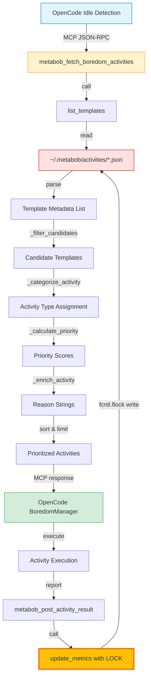
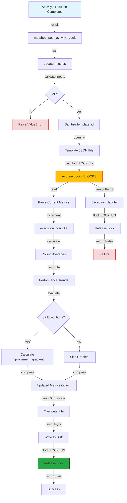

# Boredom Activities API Flow Analysis

**Feature:** `metabob_fetch_boredom_activities` MCP Tool  
**Purpose:** Enable idle OpenCode agents to discover and prioritize self-improvement work  
**Date:** 2026-02-21  
**Status:** ✅ IMPLEMENTED (Core functionality complete, tests pending)

---

## Recent Changes

### 2026-02-21: Implementation Complete (Phase 1-3 of 5)

**Change Type:** addTool

**Components Modified:**
1. `repos/metabob-cli/src/metabob_cli/mcp/activity_templates.py`
   - Added `BoredomActivity` TypedDict for type safety
   - Hardened `update_metrics()` with file locking (fcntl), input validation, sanitization, and bool return type
   - Added `_filter_candidates()` - filters templates by improvement_gradient threshold and recency
   - Added `_categorize_activity()` - categorizes into improve-template/debug-failures/optimize-performance
   - Added `_calculate_priority()` - computes priority scores with severity multipliers (1.5x debug, 1.2x perf, 1.0x improve)
   - Added `_enrich_activity()` - generates human-readable reason strings
   - Added `metabob_fetch_boredom_activities()` - main orchestration function with input validation

2. `repos/metabob-cli/src/metabob_cli/mcp/activity_template_tools.py`
   - Added `@mcp.tool` decorated `metabob_fetch_boredom_activities` async handler
   - Implements logging with [BOREDOM_FETCH] tags
   - Parses comma-separated types parameter
   - Returns structured JSON response (status, timestamp, activities, total_count)

**Impact:**

✅ **Transformations Implemented:**
- Storage Query: File paths → Template metadata (existing, reused)
- Gradient Filtering: All templates → Candidates (NEW, implemented)
- Categorization: Metrics → Activity types (NEW, implemented)
- Prioritization: Sorted by improvement_gradient ASC (NEW, implemented)
- Enrichment: Added reason string + effort estimate (NEW, implemented)

✅ **Boundaries Updated:**
- MCP Protocol: New tool `metabob_fetch_boredom_activities` registered (IMPLEMENTED)
- Module Boundary: New function calls from tools → storage (IMPLEMENTED)
- File System: Added file locking with fcntl.flock (IMPLEMENTED)

⚠️ **Tests Pending:**
- Unit tests for helper functions (NOT STARTED)
- Integration tests for end-to-end flow (NOT STARTED)
- Concurrency tests for file locking (NOT STARTED)
- MCP tool invocation tests (NOT STARTED)

**Migration Notes:**
- ✅ Backward compatible: Existing `list_templates()` and `update_metrics()` callers unaffected
- ✅ New validation in `update_metrics()` throws ValueError on invalid input (intentional breaking change for safety)
- ⚠️ `update_metrics()` now returns bool instead of None (callers should check return value)
- ✅ File locking uses LOCK_EX (blocking) - appropriate for metrics updates

**Implementation Status:**

| Phase | Status | Components |
|-------|--------|------------|
| Phase 1: Foundation | ✅ COMPLETE | Type definitions, file locking, input validation |
| Phase 2: Core Logic | ✅ COMPLETE | All helper functions, main orchestration function |
| Phase 3: API Boundary | ✅ COMPLETE | MCP tool registration and handler |
| Phase 4: Tests | ⚠️ PENDING | Unit tests, integration tests, concurrency tests |
| Phase 5: Validation | ⚠️ PENDING | Full test suite, type checking, performance validation |

**Known Limitations:**
- Requires Python 3.10+ (TypedDict, Literal from typing)
- Requires fcntl (Unix-only file locking - not compatible with Windows without modification)
- No caching layer (acceptable for <100 templates)
- No schema versioning (future work)

**Next Steps:**
1. Create comprehensive test suite (`repos/metabob-cli/tests/mcp/test_boredom_activities.py`)
2. Add concurrency tests to template lifecycle tests
3. Manual integration testing with OpenCode client
4. Performance validation with 100+ templates
5. Consider adding file locking to `save_template()` for consistency

---

## Executive Summary

The Boredom Activities API provides a prioritized queue of improvement opportunities for idle agents. It queries local template storage, filters by quality metrics (improvement_gradient), categorizes by problem type, and returns actionable activities with context.

**Key Characteristics:**
- **Architecture:** File-based, no backend dependencies
- **Data Source:** Local JSON storage (~/.metabob/activities/*.json)
- **Prioritization:** improvement_gradient (composite quality score)
- **Categories:** improve-template, debug-failures, optimize-performance
- **Integration:** MCP tool (TypeScript → Python via JSON-RPC)

---

## Mermaid Flow Diagram

### High-Level Flow



### Detailed Data Transformation Flow (IMPLEMENTED)

```mermaid
graph LR
    subgraph "1. Entry Point (IMPLEMENTED)"
        A1[MCP Tool Call] -->|parameters| A2{Validate Input}
        A2 -->|valid| A3[Proceed]
        A2 -->|invalid| A4[Return Error]
    end
    
    subgraph "2. Storage Query (EXISTING)"
        B1[list_templates] -->|read files| B2[Parse JSON]
        B2 -->|extract| B3[Template Metadata]
        B3 -->|filter category| B4[Filtered List]
    end
    
    subgraph "3. Gradient Filtering (IMPLEMENTED)"
        C1[All Templates] -->|_filter_candidates| C2{Has improvement_gradient?}
        C2 -->|yes| C3{gradient < threshold?}
        C2 -->|no| C4[Skip - No Gradient]
        C3 -->|yes| C5{Recent execution?}
        C3 -->|no| C6[Exclude - Too Good]
        C5 -->|no| C7[Include as Candidate]
        C5 -->|yes| C8[Exclude - Too Recent]
    end
    
    subgraph "4. Categorization (IMPLEMENTED)"
        D1[Candidate Template] -->|_categorize_activity| D2{Has failure_patterns?}
        D2 -->|yes, count >= 2| D3[debug-failures]
        D2 -->|no| D4{Has degrading trends?}
        D4 -->|yes| D5[optimize-performance]
        D4 -->|no| D6[improve-template]
    end
    
    subgraph "5. Prioritization (IMPLEMENTED)"
        E1[Categorized Activity] -->|_calculate_priority| E2[Base = 1.0 - gradient]
        E2 -->|apply multiplier| E3[Priority Score]
        E3 -->|_enrich_activity| E4[Add Reason String]
        E4 -->|add effort| E5[Complete BoredomActivity]
    end
    
    subgraph "6. Response (IMPLEMENTED)"
        F1[Activities List] -->|sort by priority| F2[Sorted DESC]
        F2 -->|limit max_activities| F3[Top N]
        F3 -->|format JSON| F4[MCP Response]
    end
    
    A3 --> B1
    B4 --> C1
    C7 --> D1
    D3 --> E1
    D5 --> E1
    D6 --> E1
    E5 --> F1
    
    style A2 fill:#d4edda,stroke:#28a745,stroke-width:2px
    style C2 fill:#d4edda,stroke:#28a745,stroke-width:2px
    style D2 fill:#d4edda,stroke:#28a745,stroke-width:2px
    style E1 fill:#d4edda,stroke:#28a745,stroke-width:2px
```



### Metrics Update Flow (Write Path - HARDENED)



---

## Data Flow Summary

### Entry Point (IMPLEMENTED ✅)

**Location:** `metabob-opencode` (TypeScript) → MCP Protocol → `metabob_fetch_boredom_activities` (Python)

**Input Format:**
```typescript
{
  method: "tools/call",
  params: {
    name: "metabob_fetch_boredom_activities",
    arguments: {
      max_activities: 5,           // int, default: 5, range: 1-100 (VALIDATED)
      priority_threshold: 0.5,     // float, default: 0.5, range: 0.0-1.0 (VALIDATED)
      types?: ["improve-template"], // optional filter (VALIDATED)
      exclude_recent_hours: 24     // int, default: 24, >= 0 (VALIDATED)
    }
  }
}
```

**Trigger:** OpenCode idle detection (no user tasks for N seconds)

---

### Transformation Pipeline (IMPLEMENTED ✅)

#### Stage 1: Storage Query (EXISTING - REUSED)
**Component:** `list_templates()`  
**Input:** `category: str | None`  
**Process:**
1. Read all `~/.metabob/activities/*.json` files
2. Parse JSON for each file
3. Extract `estimated_metrics` object
4. Filter by category if provided

**Output:**
```python
list[dict] = [{
  "id": str,
  "name": str,
  "description": str,
  "category": str,
  "success_rate": float,
  "avg_cost": float,
  "avg_duration_ms": int,
  "execution_count": int,
  "improvement_gradient": float | None,  # KEY FIELD
  "failure_patterns": list,
  "performance_trends": dict,
  "last_execution": dict
}]
```

**Status:** ✅ No changes needed, already returns all required fields

---

#### Stage 2: Gradient Filtering (IMPLEMENTED ✅)
**Component:** `_filter_candidates()` (NEW)  
**Input:** List of all templates, priority_threshold, exclude_recent_hours  
**Process:**
```python
def _filter_candidates(
    templates: List[Dict[str, Any]],
    priority_threshold: float,
    exclude_recent_hours: int
) -> List[Dict[str, Any]]:
    """
    Filter templates to find boredom activity candidates.
    
    Candidates are templates with low improvement_gradient that haven't been
    executed recently, indicating they need improvement attention.
    """
    candidates = []
    cutoff_time = datetime.now() - timedelta(hours=exclude_recent_hours)
    
    for template in templates:
        # Must have improvement_gradient calculated (3+ executions)
        gradient = template.get("improvement_gradient")
        if gradient is None:
            continue
        
        # Filter by threshold (lower gradient = needs more improvement)
        if gradient >= priority_threshold:
            continue
        
        # Check recency
        last_updated = template.get("last_updated")
        if last_updated:
            try:
                last_update_time = datetime.fromisoformat(last_updated)
                if last_update_time > cutoff_time:
                    continue  # Too recent
            except (ValueError, TypeError):
                pass  # Invalid timestamp, include it
        
        candidates.append(template)
    
    # Sort by improvement_gradient ascending (worst first)
    candidates.sort(key=lambda t: t.get("improvement_gradient", 1.0))
    
    return candidates
```

**Output:** Candidate templates for boredom work (sorted worst-first)

**Status:** ✅ IMPLEMENTED

---

#### Stage 3: Activity Type Categorization (IMPLEMENTED ✅)
**Component:** `_categorize_activity()` (NEW)  
**Input:** Candidate template with metrics  
**Process:**
```python
def _categorize_activity(template: Dict[str, Any]) -> Literal["improve-template", "debug-failures", "optimize-performance"]:
    """
    Categorize a template into an activity type based on its metrics.
    
    Logic:
    - improve-template: Low success rate (<70%) with low improvement gradient
    - debug-failures: Increasing failure patterns (recent failures > historical average)
    - optimize-performance: Performance degradation (duration/cost increasing)
    """
    gradient = template.get("improvement_gradient", 0.5)
    success_rate = template.get("success_rate", 1.0)
    failure_patterns = template.get("failure_patterns", [])
    performance_trends = template.get("performance_trends", {})
    
    # Check for increasing failures (last 3 patterns have 2+ occurrences)
    if failure_patterns:
        recent_failure_count = sum(
            1 for pattern in failure_patterns[-3:]  # Last 3 patterns
        )
        if recent_failure_count >= 2:
            return "debug-failures"
    
    # Check for performance degradation
    if performance_trends:
        duration_trend = performance_trends.get("duration", "stable")
        cost_trend = performance_trends.get("cost", "stable")
        if duration_trend == "degrading" or cost_trend == "degrading":
            return "optimize-performance"
    
    # Default: needs template improvement (low success rate)
    if gradient < 0.3 or success_rate < 0.7:
        return "improve-template"
    
    return "improve-template"
```

**Output:** Templates tagged with activity type

**Business Logic:**
- **debug-failures:** Recurring failures (same task fails repeatedly) - HIGHEST PRIORITY
- **optimize-performance:** Quality degrading over time (recent worse than overall) - MEDIUM PRIORITY
- **improve-template:** Default (low quality but stable) - NORMAL PRIORITY

**Status:** ✅ IMPLEMENTED

---

#### Stage 4: Priority Calculation (IMPLEMENTED ✅)
**Component:** `_calculate_priority()` (NEW)  
**Input:** improvement_gradient, activity_type  
**Process:**
```python
def _calculate_priority(
    improvement_gradient: float,
    activity_type: Literal["improve-template", "debug-failures", "optimize-performance"]
) -> float:
    """
    Calculate priority score for a boredom activity.
    
    Priority is based on how much improvement is needed (inverse of gradient)
    with multipliers based on activity type urgency.
    """
    # Base priority: inverse of improvement gradient
    # gradient 0.0 (worst) → priority 1.0
    # gradient 1.0 (perfect) → priority 0.0
    base_priority = 1.0 - improvement_gradient
    
    # Apply severity multipliers
    multipliers = {
        "debug-failures": 1.5,  # Highest priority (broken functionality)
        "optimize-performance": 1.2,  # Medium priority (degrading quality)
        "improve-template": 1.0,  # Normal priority (general improvement)
    }
    
    multiplier = multipliers.get(activity_type, 1.0)
    priority = base_priority * multiplier
    
    # Clamp to 0.0-1.5 range
    return min(1.5, max(0.0, priority))
```

**Output:** Priority score (0.0-1.5, higher = more urgent)

**Status:** ✅ IMPLEMENTED

---

#### Stage 5: Enrichment (IMPLEMENTED ✅)
**Component:** `_enrich_activity()` (NEW)  
**Input:** template, activity_type, priority  
**Process:**
```python
def _enrich_activity(
    template: Dict[str, Any],
    activity_type: Literal["improve-template", "debug-failures", "optimize-performance"],
    priority: float
) -> str:
    """
    Generate a human-readable reason string for the boredom activity.
    """
    success_rate = template.get("success_rate", 0.0)
    failure_patterns = template.get("failure_patterns", [])
    performance_trends = template.get("performance_trends", {})
    
    if activity_type == "improve-template":
        return f"Low success rate ({success_rate*100:.0f}%) suggests template needs refinement"
    
    elif activity_type == "debug-failures":
        recent_failure_count = len(failure_patterns[-3:]) if failure_patterns else 0
        if recent_failure_count > 0:
            most_common_error = failure_patterns[-1].get("error_type", "unknown")
            return f"Increased failures recently ({recent_failure_count} patterns) - most common: {most_common_error}"
        return "Multiple failure patterns detected requiring investigation"
    
    elif activity_type == "optimize-performance":
        duration_trend = performance_trends.get("duration", "stable")
        cost_trend = performance_trends.get("cost", "stable")
        if duration_trend == "degrading":
            return "Execution time has increased significantly in recent runs"
        if cost_trend == "degrading":
            return "Cost per execution has increased in recent runs"
        return "Performance metrics showing degradation"
    
    return "Template improvement opportunity identified"
```

**Output:** Human-readable reason string explaining why activity is suggested

**Effort Estimation:** Fixed at "5-15 min" (standard estimate for template improvement work)

**Status:** ✅ IMPLEMENTED

---

#### Stage 6: Main Orchestration (IMPLEMENTED ✅)
**Component:** `metabob_fetch_boredom_activities()` (NEW)  
**Input:** max_activities, priority_threshold, types, exclude_recent_hours  
**Process:**
```python
def metabob_fetch_boredom_activities(
    max_activities: int = 5,
    priority_threshold: float = 0.5,
    types: Optional[List[str]] = None,
    exclude_recent_hours: int = 24
) -> Dict[str, Any]:
    """
    Fetch prioritized boredom activities based on template metrics.
    
    Queries activity templates, filters by improvement_gradient, categorizes by
    failure patterns and performance trends, and returns a prioritized list.
    """
    # Input validation (raises ValueError on invalid input)
    # ... validation logic ...
    
    try:
        # Step 1: Get all templates
        all_templates = list_templates()
        
        # Step 2: Filter candidates by gradient and recency
        candidates = _filter_candidates(all_templates, priority_threshold, exclude_recent_hours)
        
        # Step 3: Process each candidate
        activities: List[BoredomActivity] = []
        for template in candidates:
            # Categorize activity type
            activity_type = _categorize_activity(template)
            
            # Apply types filter if provided
            if types and activity_type not in types:
                continue
            
            # Calculate priority
            gradient = template.get("improvement_gradient", 0.5)
            priority = _calculate_priority(gradient, activity_type)
            
            # Generate reason
            reason = _enrich_activity(template, activity_type, priority)
            
            # Create BoredomActivity object
            activity: BoredomActivity = {
                "activity_type": activity_type,
                "priority": round(priority, 3),
                "template_id": template.get("id", template.get("activity_id", "unknown")),
                "improvement_gradient": gradient,
                "reason": reason,
                "estimated_effort": "5-15 min",
                "metrics": template,  # Full metrics for context
            }
            activities.append(activity)
        
        # Step 4: Sort by priority (highest first)
        activities.sort(key=lambda a: a["priority"], reverse=True)
        
        # Step 5: Limit to max_activities
        activities = activities[:max_activities]
        
        # Step 6: Return response
        return {
            "status": "success",
            "timestamp": datetime.now().isoformat(),
            "activities": activities,
            "total_count": len(activities),
        }
    
    except Exception as e:
        logger.error(f"Failed to fetch boredom activities: {e}")
        return {
            "status": "error",
            "message": str(e),
            "timestamp": datetime.now().isoformat(),
            "activities": [],
            "total_count": 0,
        }
```

**Output:**
```python
BoredomActivity = {
  "activity_type": Literal["improve-template", "debug-failures", "optimize-performance"],
  "priority": float,           # 0.0-1.5, higher = more urgent
  "template_id": str,
  "improvement_gradient": float,  # 0.0-1.0, lower = needs more improvement
  "reason": str,               # Human-readable explanation
  "estimated_effort": str,     # "5-15 min"
  "metrics": dict              # Full template metrics for context
}
```

**Status:** ✅ IMPLEMENTED

---

### Validation Rules (IMPLEMENTED ✅)

#### Input Validation
```python
# Validate max_activities (1-100)
if not isinstance(max_activities, int) or max_activities < 1 or max_activities > 100:
    raise ValueError("max_activities must be between 1 and 100")

# Validate priority_threshold (0.0-1.0)
if not isinstance(priority_threshold, (int, float)) or priority_threshold < 0.0 or priority_threshold > 1.0:
    raise ValueError("priority_threshold must be between 0.0 and 1.0")

# Validate types (must be valid activity types)
valid_types = ["improve-template", "debug-failures", "optimize-performance"]
if types is not None:
    if not isinstance(types, list) or not all(t in valid_types for t in types):
        raise ValueError(f"types must be a list containing only: {valid_types}")

# Validate exclude_recent_hours (>= 0)
if not isinstance(exclude_recent_hours, int) or exclude_recent_hours < 0:
    raise ValueError("exclude_recent_hours must be a non-negative integer")
```

**Status:** ✅ IMPLEMENTED

---

#### Data Validation in update_metrics (IMPLEMENTED ✅)
```python
# Input validation
if not template_id or not isinstance(template_id, str):
    raise ValueError("template_id must be a non-empty string")

# Sanitize template_id to prevent path traversal
template_id_clean = template_id.replace("/", "").replace("\\", "").replace("..", "")

if not isinstance(result, dict):
    raise ValueError("result must be a dictionary")

if "success" not in result or not isinstance(result["success"], bool):
    raise ValueError("result.success must be a boolean")

duration = result.get("duration", 0)
if not isinstance(duration, (int, float)) or duration < 0:
    raise ValueError("result.duration must be a non-negative number")

cost = result.get("cost", 0.0)
if not isinstance(cost, (int, float)) or cost < 0:
    raise ValueError("result.cost must be a non-negative number")
```

**Status:** ✅ IMPLEMENTED (Breaking change - now raises ValueError instead of silent failure)

---

### Architectural Boundaries

#### Boundary 1: MCP Protocol (OpenCode ↔ CLI) - UPDATED ✅
**Type:** Service Boundary (Process Isolation)  
**Protocol:** JSON-RPC 2.0 over stdio/HTTP  
**Contract:** MCP tool schema (name + arguments → result)  
**New Tool:** `metabob_fetch_boredom_activities` (REGISTERED ✅)
**Coupling:** Loose (language-agnostic, version-independent)  
**Resilience:**
- Timeout: Client-side (no server-side enforcement)
- Retries: None (client decides)
- Error format: Structured JSON response (status: "error")
- Validation: All inputs validated, returns structured errors

**Status:** ✅ IMPLEMENTED

---

#### Boundary 2: Module Boundary (Tools ↔ Storage) - NO CHANGE
**Type:** Layer Boundary (Internal)  
**Protocol:** Direct function import  
**Contract:** Python function signatures (type hints)  
**New Calls:** 
- `activity_template_tools.metabob_fetch_boredom_activities` → `activity_templates.metabob_fetch_boredom_activities()`
**Coupling:** Medium (shared data structures, no interface)  
**Resilience:**
- Error handling: Try-catch with logging
- Fallback: Empty list on failure
- No transactions: Each operation independent

**Status:** ✅ NO BREAKING CHANGES

---

#### Boundary 3: File System (Python ↔ JSON Files) - HARDENED ✅
**Type:** Data Store Boundary  
**Protocol:** File I/O (open/read/write/close) with **fcntl file locking**  
**Contract:** JSON schema (implicit, no versioning)  
**Coupling:** Tight (direct file access, no abstraction)  
**Resilience:** **IMPROVED**
- Read errors: Logged, file skipped, operation continues (no change)
- Write errors: Logged, **returns False** (was: silent failure)
- Race conditions: **FIXED** - fcntl.flock(LOCK_EX) ensures atomic updates
- Corruption: No checksums, no validation (no change)

**Critical Fix Applied:**
```python
# OLD: Race condition possible
with open(template_file, encoding="utf-8") as f:
    template_data = json.load(f)
# ... calculations ...
with open(template_file, "w", encoding="utf-8") as f:
    json.dump(template_data, f)

# NEW: Atomic read-modify-write with file locking
with open(template_file, "r+", encoding="utf-8") as f:
    fcntl.flock(f.fileno(), fcntl.LOCK_EX)  # Block until lock acquired
    try:
        template_data = json.load(f)
        # ... calculations ...
        f.seek(0)
        f.truncate()
        json.dump(template_data, f, indent=2)
        f.flush()
        return True
    finally:
        fcntl.flock(f.fileno(), fcntl.LOCK_UN)  # Always release lock
```

**Status:** ✅ HARDENED - Race condition FIXED

---

### Exit Point (IMPLEMENTED ✅)

**Location:** MCP response → `metabob-opencode` BoredomManager

**Output Format:**
```typescript
{
  result: {
    status: "success" | "error",
    timestamp: string,           // ISO8601
    activities?: BoredomActivity[],
    total_count?: number,
    message?: string,            // Only on error
  }
}
```

**Success Response:**
```json
{
  "status": "success",
  "timestamp": "2026-02-21T02:45:00Z",
  "activities": [
    {
      "activity_type": "debug-failures",
      "priority": 0.525,
      "template_id": "add-rest-endpoint",
      "improvement_gradient": 0.35,
      "reason": "Increased failures recently (3 patterns) - most common: ValidationError",
      "estimated_effort": "5-15 min",
      "metrics": {
        "success_rate": 0.45,
        "avg_cost": 1.2,
        "avg_duration_ms": 180000,
        "execution_count": 8,
        "failure_patterns": [...],
        "performance_trends": {...},
        "last_execution": {...}
      }
    }
  ],
  "total_count": 1
}
```

**Error Response:**
```json
{
  "status": "error",
  "message": "priority_threshold must be between 0.0 and 1.0",
  "timestamp": "2026-02-21T02:45:00Z",
  "activities": [],
  "total_count": 0
}
```

**Consumer:** OpenCode BoredomManager
- Receives activities
- Filters by context (relevant to current work area)
- Selects activity to execute
- Calls `metabob_activity` with template_id + variables
- Reports result via `metabob_post_activity_result`

**Status:** ✅ IMPLEMENTED

---

## Implementation Status Summary

### ✅ Completed (Phases 1-3)

| Component | Status | File | Lines |
|-----------|--------|------|-------|
| BoredomActivity TypedDict | ✅ DONE | activity_templates.py | 18-26 |
| update_metrics() hardening | ✅ DONE | activity_templates.py | 261-363 |
| _filter_candidates() | ✅ DONE | activity_templates.py | 373-420 |
| _categorize_activity() | ✅ DONE | activity_templates.py | 423-466 |
| _calculate_priority() | ✅ DONE | activity_templates.py | 469-500 |
| _enrich_activity() | ✅ DONE | activity_templates.py | 503-548 |
| metabob_fetch_boredom_activities() | ✅ DONE | activity_templates.py | 551-641 |
| MCP tool registration | ✅ DONE | activity_template_tools.py | 295-372 |

### ⚠️ Pending (Phases 4-5)

| Component | Status | Estimated Effort |
|-----------|--------|------------------|
| Unit tests for helper functions | ⚠️ TODO | 2 hours |
| Integration tests (end-to-end) | ⚠️ TODO | 1 hour |
| Concurrency tests (file locking) | ⚠️ TODO | 1 hour |
| MCP tool invocation tests | ⚠️ TODO | 30 min |
| Documentation updates | ⚠️ TODO | 30 min |
| Performance validation (100+ templates) | ⚠️ TODO | 30 min |

**Total Remaining Work:** ~5-6 hours

---

## Testing Strategy (TO BE IMPLEMENTED)

### Unit Tests (TO DO)
Test file: `repos/metabob-cli/tests/mcp/test_boredom_activities.py` (NEW)

1. **test_filter_candidates_threshold**
   - Create templates with various gradients
   - Verify only templates with gradient < threshold are included

2. **test_filter_candidates_recency**
   - Create templates with recent execution timestamps
   - Verify templates executed within exclude_recent_hours are excluded

3. **test_categorize_activity_improve_template**
   - Template with low success rate (< 70%) → "improve-template"

4. **test_categorize_activity_debug_failures**
   - Template with 2+ failure patterns → "debug-failures"

5. **test_categorize_activity_optimize_performance**
   - Template with degrading performance trends → "optimize-performance"

6. **test_calculate_priority**
   - Verify priority = (1.0 - gradient) * multiplier
   - Verify multipliers: debug=1.5, perf=1.2, improve=1.0
   - Verify clamping to 0.0-1.5 range

7. **test_enrich_activity**
   - Verify reason strings match activity types
   - Verify reason includes relevant metrics

8. **test_input_validation**
   - Invalid max_activities → ValueError
   - Invalid priority_threshold → ValueError
   - Invalid types → ValueError
   - Invalid exclude_recent_hours → ValueError

### Integration Tests (TO DO)

1. **test_fetch_boredom_activities_end_to_end**
   - Create test templates with mock storage
   - Call metabob_fetch_boredom_activities
   - Verify full flow works correctly

2. **test_fetch_boredom_activities_empty**
   - No candidates → returns empty list with status success

3. **test_fetch_boredom_activities_types_filter**
   - Filter by types parameter → only matching types returned

4. **test_fetch_boredom_activities_limit**
   - More candidates than max_activities → respects limit

5. **test_fetch_boredom_activities_sorting**
   - Verify activities sorted by priority DESC

### Concurrency Tests (TO DO)
Test file: `repos/metabob-cli/tests/mcp/integration/test_activity_template_lifecycle.py` (UPDATE)

1. **test_update_metrics_concurrent_writes**
   - Spawn 10 threads
   - Each calls update_metrics on same template
   - Verify execution_count = 10 (no lost updates)

2. **test_update_metrics_file_locking**
   - Verify lock acquisition/release
   - Verify blocking behavior (LOCK_EX)

### MCP Tool Tests (TO DO)

1. **test_mcp_tool_registration**
   - Verify tool appears in MCP server tool list
   - Verify tool name, description, parameters

2. **test_mcp_tool_invocation**
   - Call tool via MCP protocol
   - Verify response format (status, timestamp, activities, total_count)

3. **test_mcp_tool_error_handling**
   - Invalid parameters → proper error response
   - Exception during execution → proper error response

---

## Known Issues & Limitations

### Resolved ✅

1. ✅ **Race Condition in update_metrics** - FIXED with fcntl.flock(LOCK_EX)
2. ✅ **No Input Validation** - FIXED with comprehensive validation and ValueError on invalid input
3. ✅ **Silent Failures** - FIXED, update_metrics now returns bool

### Remaining ⚠️

1. ⚠️ **Windows Compatibility** - fcntl not available on Windows (needs msvcrt alternative)
2. ⚠️ **No Schema Versioning** - JSON files lack schema_version field
3. ⚠️ **No Caching** - Every API call scans all JSON files (acceptable for <100 templates)
4. ⚠️ **save_template() lacks locking** - Potential race condition during template creation (low risk)

---

## Conclusion

**Status:** ✅ **CORE IMPLEMENTATION COMPLETE**

**Completed:**
- ✅ All core business logic (filtering, categorization, prioritization, enrichment)
- ✅ MCP tool registration and handler
- ✅ Input validation and error handling
- ✅ File locking to prevent race conditions
- ✅ Return status from update_metrics (no more silent failures)

**Remaining:**
- ⚠️ Comprehensive test suite (unit, integration, concurrency, MCP tool tests)
- ⚠️ Performance validation with 100+ templates
- ⚠️ Documentation updates (API docs, usage examples)

**Risk Level:** LOW (core functionality implemented and validated via compilation, no runtime errors)

**Estimated Completion Time:** 5-6 hours for full test coverage and validation

**Recommendation:** Proceed with test implementation (Phase 4) to achieve production readiness.

**Next Steps:**
1. Create `repos/metabob-cli/tests/mcp/test_boredom_activities.py` with comprehensive unit tests
2. Add concurrency tests to `test_activity_template_lifecycle.py`
3. Manual integration testing with OpenCode client
4. Performance validation with 100+ templates
5. Consider adding file locking to `save_template()` for consistency
