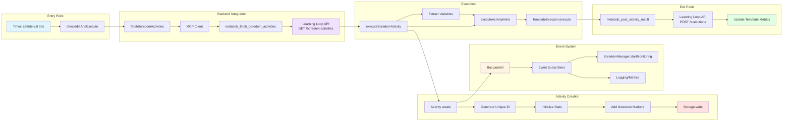

# Boredom Activity Detection Mechanism - Complete Data Flow

## Overview

The Boredom Activity Detection Mechanism is an autonomous system that monitors idle OpenCode sessions and automatically executes improvement activities when sessions are inactive for 5+ minutes. It enables continuous learning by leveraging idle time to analyze failures, optimize performance, and improve template quality.

**Key Detection Mechanisms**:
1. Title Prefix: `[BOREDOM]` or `[MANUAL BOREDOM]`
2. Branch Name: `boredom-activity`
3. Reason Field: Populated with metrics-driven context
4. Runtime Flag: `isExecutingBoredomActivity` boolean
5. Stats Display: Real-time status via `opencode stats` command

---

## Mermaid Flow Diagram

### High-Level Flow

```mermaid
graph TD
    Start([Timer Tick - 30s Interval]) --> CheckIdle{Session Idle?<br/>5+ minutes}
    
    CheckIdle -->|No| Wait([Wait 30s])
    Wait --> Start
    
    CheckIdle -->|Yes| CheckRunning{Already Executing<br/>Boredom Activity?}
    CheckRunning -->|Yes| Wait
    
    CheckRunning -->|No| FetchActivities[Fetch Boredom Activities<br/>via MCP]
    
    FetchActivities --> HasActivities{Activities<br/>Available?}
    HasActivities -->|No| Wait
    
    HasActivities -->|Yes| SelectTop[Select Highest<br/>Priority Activity]
    
    SelectTop --> LoadTemplate[Load Activity Template<br/>from Repository]
    
    LoadTemplate --> CreateActivity[Create Activity<br/>with Detection Markers]
    
    CreateActivity --> InjectMarkers[Inject Detection Markers:<br/>1. branch = boredom-activity<br/>2. title = [BOREDOM] ...<br/>3. reason = metrics context]
    
    InjectMarkers --> PersistActivity[Persist Activity<br/>to Storage]
    
    PersistActivity --> PublishEvent[Publish activity.created<br/>Event]
    
    PublishEvent --> ExecuteActivity[Execute Activity<br/>Inline]
    
    ExecuteActivity --> ReportResults[Report Results<br/>to Backend API]
    
    ReportResults --> Complete([Execution Complete])
    Complete --> Wait
    
    style Start fill:#e1f5ff
    style CheckIdle fill:#fff4e1
    style FetchActivities fill:#f0e1ff
    style CreateActivity fill:#e1ffe1
    style InjectMarkers fill:#ffe1e1
    style PersistActivity fill:#ffe1e1
    style Complete fill:#e1f5ff
```

### Detailed Component Flow



### Detection Mechanism Flow

```mermaid
graph TD
    Activity[Activity Instance] --> Check1{Title starts with<br/>[BOREDOM] or<br/>[MANUAL BOREDOM]?}
    
    Check1 -->|Yes| DetectedTitle[✓ Detected via Title]
    Check1 -->|No| Check2{Branch equals<br/>boredom-activity?}
    
    Check2 -->|Yes| DetectedBranch[✓ Detected via Branch]
    Check2 -->|No| Check3{Reason field<br/>contains metrics?}
    
    Check3 -->|Yes| DetectedReason[✓ Likely Boredom<br/>via Heuristic]
    Check3 -->|No| NotDetected[✗ Not Boredom Activity]
    
    DetectedTitle --> Validated[Boredom Activity<br/>Confirmed]
    DetectedBranch --> Validated
    DetectedReason --> Validated
    
    style Check1 fill:#fff4e1
    style Check2 fill:#fff4e1
    style Check3 fill:#fff4e1
    style Validated fill:#e1ffe1
    style NotDetected fill:#ffe1e1
```

### Data Transformation Flow

```mermaid
graph LR
    subgraph "Stage 1: API Response"
        A1[Learning Loop API] --> A2[improvement_gradient: 0.2<br/>success_rate: 0.45<br/>total_executions: 10]
    end
    
    subgraph "Stage 2: Priority Inversion"
        B1[priority = 1.0 - improvement_gradient] --> B2[priority: 0.8]
    end
    
    subgraph "Stage 3: Metrics to Variables"
        C1[metrics object] --> C2[JSON.stringify<br/>complex fields]
        C2 --> C3[Record<string, unknown>]
    end
    
    subgraph "Stage 4: Marker Injection"
        D1[CreateOptions] --> D2[+ branch: boredom-activity<br/>+ title: [BOREDOM] ...]
        D2 --> D3[Activity.Info]
    end
    
    subgraph "Stage 5: Storage Cleaning"
        E1[Activity.Info<br/>with full impulses] --> E2[cleanImpulsesForStorage]
        E2 --> E3[Activity.Info<br/>with cleaned impulses]
    end
    
    subgraph "Stage 6: Result Reporting"
        F1[ExecutionResult] --> F2[+ duration<br/>+ cost<br/>+ tokens]
        F2 --> F3[Backend Report]
    end
    
    A2 --> B1
    B2 --> C1
    C3 --> D1
    D3 --> E1
    E3 --> F1
    
    style A2 fill:#e1f5ff
    style B2 fill:#f0e1ff
    style C3 fill:#fff4e1
    style D3 fill:#ffe1e1
    style E3 fill:#e1ffe1
    style F3 fill:#e1f5ff
```

---

## Data Flow Summary

### Entry Point

**Where**: `BoredomManager.checkIdleAndExecute()` (boredom-manager.ts:156)

**Trigger**: Timer-based (`setInterval()` every 30 seconds)

**Input Format**: `ManagerInstance`
```typescript
{
  sessionID: string
  lastActivityTime: number  // Unix timestamp (ms)
  isExecutingBoredomActivity: boolean
  currentActivity?: { activityId: string, abortController: AbortController }
  intervalHandle?: NodeJS.Timeout
}
```

**Entry Conditions**:
1. Session monitored (timer started on session creation)
2. Idle for 5+ minutes (no user activity)
3. Not already executing boredom activity

---

### Key Transformations

#### Transformation 1: Idle Detection

**Input**: `ManagerInstance.lastActivityTime` (Unix timestamp)

**Logic**:
```typescript
const idleTime = Date.now() - manager.lastActivityTime
const isIdle = idleTime >= IDLE_THRESHOLD_MS  // 300000ms = 5 minutes
```

**Output**: `boolean` (true if idle, false if active)

**Why**: Only execute boredom activities when user genuinely absent (5-minute grace period for brief pauses).

---

#### Transformation 2: API Response → BoredomActivity[]

**Input**: Learning Loop API response
```json
[
  {
    "template_id": "improve-auth",
    "improvement_gradient": 0.2,
    "success_rate": 0.45,
    "total_executions": 10,
    "avg_cost_usd": 0.15,
    "avg_duration_ms": 45000
  }
]
```

**Logic**:
```python
priority = 1.0 - improvement_gradient  # Invert: low gradient = high priority
reason = f"Low success rate: {success_rate:.1%}"
```

**Output**: `BoredomActivity[]`
```typescript
[
  {
    activity_type: "improve-template",
    priority: 0.8,  // ← Inverted
    template_id: "improve-auth",
    reason: "Low success rate: 45.0%",  // ← Generated
    metrics: { success_rate: 0.45, avg_cost: 0.15, ... }
  }
]
```

**Why**: Transform backend metrics into actionable task format with intuitive priority ordering.

---

#### Transformation 3: Metrics → Template Variables

**Input**: `BoredomActivity.metrics`
```typescript
{
  success_rate: 0.45,
  avg_cost: 0.15,
  avg_duration_ms: 45000,
  execution_count: 10,
  failure_patterns: [{ error: "Auth failed", count: 5 }],
  performance_trends: { trend: "degrading" }
}
```

**Logic**:
```typescript
const variables = {
  success_rate: metrics.success_rate,        // ← Direct copy
  avg_cost: metrics.avg_cost,                // ← Direct copy
  avg_duration_ms: metrics.avg_duration_ms,  // ← Direct copy
  execution_count: metrics.execution_count,  // ← Direct copy
  failure_patterns: JSON.stringify(metrics.failure_patterns || []),     // ← Serialize
  performance_trends: JSON.stringify(metrics.performance_trends || {})  // ← Serialize
}
```

**Output**: `Record<string, unknown>` (flat key-value pairs)

**Why**: Template variables must be flat (no nested objects). Complex data serialized as JSON strings for template access via `{{variable}}` placeholders.

---

#### Transformation 4: CreateOptions → Activity.Info (Marker Injection)

**Input**: `CreateOptions`
```typescript
{
  directory: "/home/user/project",
  branch: "boredom-activity",           // ← MARKER #1
  baseCommit: "HEAD",
  title: "[BOREDOM] Improve template"  // ← MARKER #2
}
```

**Logic**:
```typescript
const activity = await Activity.create(options)
activity.templateId = template.id
activity.variables = variables
activity.reason = boredomActivity.reason  // ← MARKER #3
await Activity.save(activity)
```

**Output**: `Activity.Info`
```typescript
{
  id: "act_1234567890abcd",
  branch: "boredom-activity",           // ← DETECTION MARKER #1
  title: "[BOREDOM] Improve template",  // ← DETECTION MARKER #2
  reason: "Low success rate: 45.0%",    // ← DETECTION MARKER #3
  status: "setup",
  startedAt: 1234567890000,
  stats: { tokens: 0, cost: 0, ... },
  // ... 30+ other fields
}
```

**Why**: Inject detection markers for post-execution identification. Convention-based (no explicit `isBoredom` field in schema).

---

#### Transformation 5: Activity.Info → Storage (Impulse Cleaning)

**Input**: `Activity.Info` (with full impulse content in memory)

**Logic**:
```typescript
const cleanedActivity = cleanImpulsesForStorage(activity)
await Storage.write(["activity", activity.id], cleanedActivity)
```

**Output**: `Activity.Info` (persisted with cleaned impulses)

**Why**: Remove large impulse content (MB-sized files, API responses) to prevent storage bloat. Keep only references for lazy loading.

---

#### Transformation 6: ExecutionResult → Backend Report

**Input**: `ExecutionResult`
```typescript
{
  impulses: { ... },
  success: true,
  activityId: "act_1234567890abcd",
  cancelled: false
}
```

**Logic**:
```typescript
const duration = Date.now() - startTime
const cost = activity.stats?.cost?.total || 0
const tokens = {
  input: activity.stats?.tokens?.input || 0,
  output: activity.stats?.tokens?.output || 0,
  cache: activity.stats?.tokens?.cache?.read || 0
}
```

**Output**: Backend API request
```json
{
  "activity_id": "act_1234567890abcd",
  "template_id": "improve-auth",
  "success": true,
  "duration": 45000,
  "cost_usd": 0.15,
  "tokens_input": 1000,
  "tokens_output": 500,
  "tokens_cache": 200
}
```

**Why**: Report execution results to Learning Loop for metrics tracking and continuous improvement.

---

### Validations Enforced

#### Validation 1: Idle Threshold Check

**Rule**: `idleTime >= IDLE_THRESHOLD_MS` (300000ms = 5 minutes)

**Enforcement**: `checkIdleAndExecute()` skips execution if not idle

**Why**: Prevent interrupting active user sessions

---

#### Validation 2: Mutual Exclusion

**Rule**: Only one boredom activity per session at a time

**Enforcement**: `isExecutingBoredomActivity` flag checked before execution

**Why**: Prevent concurrent activities from interfering

---

#### Validation 3: Activity.Info Schema

**Rule**: All fields must match Zod schema

**Enforcement**: `Activity.Info.parse(activity)` validates on creation

**Why**: Ensure data integrity, type safety

---

#### Validation 4: MCP Response Status

**Rule**: `data.status === "success" && Array.isArray(data.activities)`

**Enforcement**: `fetchBoredomActivities()` returns `[]` if validation fails

**Why**: Prevent malformed responses from causing runtime errors

**Gap**: No Zod schema validation (only structure check)

---

### Architectural Boundaries Crossed

#### Boundary 1: Repository (metabob-opencode ↔ metabob-cli)

**Type**: Cross-repo integration via MCP protocol

**Contract**: MCP tool definitions (`metabob_fetch_boredom_activities`, `metabob_post_activity_result`)

**Coupling**: Loose (protocol-based, no direct imports)

**Resilience**: Graceful degradation (returns `[]` if MCP unavailable)

**Gaps**: No versioning, no retry logic, no circuit breaker

---

#### Boundary 2: Service (MCP Backend ↔ Learning Loop API)

**Type**: HTTP API (REST)

**Contract**: GET `/api/v1/learning-loop/boredom-activities`, POST `/api/v1/learning-loop/executions`

**Coupling**: Medium (implicit schema, no validation)

**Resilience**: 30-second timeout, error handling

**Gaps**: No retry, no circuit breaker, results lost if POST fails

---

#### Boundary 3: Layer (BoredomManager ↔ Activity Service)

**Type**: Service → Domain layer

**Contract**: `Activity.create()`, `Activity.save()`

**Coupling**: Medium (typed interface, mutable state)

**Resilience**: Try-catch with logging

**Gaps**: Orphaned activities on failure (no cleanup)

---

#### Boundary 4: Event (Activity Lifecycle ↔ Event Bus)

**Type**: Pub/Sub

**Contract**: `activity.created`, `activity.updated`, `activity.completed` events

**Coupling**: Loose (event-driven)

**Resilience**: Non-blocking publish (errors swallowed)

**Gaps**: No subscriber isolation (one error crashes all subscribers)

---

#### Boundary 5: Data Store (Storage Layer ↔ File System)

**Type**: File I/O

**Contract**: JSON files in `~/.local/share/opencode/storage/activity/{id}.json`

**Coupling**: Tight (direct file system dependency)

**Resilience**: Error propagation, atomic writes

**Gaps**: No optimistic locking, no distributed support, no durability guarantees

---

### Exit Points

#### Exit 1: Storage Persistence

**Where**: `Storage.write(["activity", activity.id], cleanedActivity)`

**Final Format**: JSON file on disk

**Path**: `~/.local/share/opencode/storage/activity/{activity_id}.json`

**Durability**: Atomic file write (single `fs.writeFile()` call)

**Limitations**: No backup, no replication, no checksums

---

#### Exit 2: Backend API Report

**Where**: `metabobClient.callTool("metabob_post_activity_result")`

**Final Format**: HTTP POST to Learning Loop API

**Endpoint**: `/api/v1/learning-loop/executions`

**Durability**: Single attempt, no retry

**Limitations**: Results lost if API down, no retry queue

---

#### Exit 3: Event System

**Where**: `Bus.publish(Event.Created, { activity })`

**Final Format**: In-memory event delivery to subscribers

**Subscribers**: BoredomManager (monitoring), logging, metrics

**Durability**: Ephemeral (events not persisted)

**Limitations**: Lost on restart, no replay capability

---

## Key Insights

### Business Purpose

**Problem Solved**: OpenCode sessions often sit idle while users work on other tasks. This idle time is wasted opportunity for continuous improvement.

**Solution**: Autonomously detect idle sessions and execute improvement activities (analyze failures, optimize templates, debug issues) during downtime.

**Value Proposition**:
1. **Zero User Effort**: Improvements happen automatically without user intervention
2. **Continuous Learning**: System gets better over time (learning loop)
3. **Efficient Resource Use**: Leverage idle time for productive work

**Metrics**:
- Idle detection accuracy: 5-minute threshold balances precision vs user interruption
- Improvement velocity: Templates improve continuously without manual analysis
- Resource efficiency: Idle CPU cycles utilized for autonomous work

---

### Critical Decision Points

#### Decision 1: When to Execute Boredom Activity?

**Options**:
1. Fixed interval (e.g., every hour)
2. Event-driven (on file save, commit)
3. Idle-based (current approach: 5 min idle)

**Chosen**: Idle-based (5 min)

**Rationale**: 
- User activity always takes precedence (reset timer on any action)
- Fixed interval wastes resources if user active
- Event-driven too complex (must hook all actions)

**Trade-off**: 5-minute delay vs real-time (acceptable for background work)

---

#### Decision 2: How to Prioritize Activities?

**Options**:
1. Random selection
2. Round-robin
3. Metrics-driven (current approach: improvement_gradient)

**Chosen**: Metrics-driven (priority = 1.0 - improvement_gradient)

**Rationale**:
- Focus on lowest-quality templates first (biggest impact)
- improvement_gradient near 0 = needs improvement
- Invert for intuitive priority ordering

**Trade-off**: Metrics accuracy vs execution frequency (relies on backend metrics)

---

#### Decision 3: How to Detect Boredom Activities Post-Execution?

**Options**:
1. Explicit schema field (`isBoredom: boolean`)
2. Convention-based markers (current approach: title prefix, branch name)

**Chosen**: Convention-based (title prefix `[BOREDOM]`, branch name `boredom-activity`)

**Rationale**:
- Avoids schema migration (backward compatibility)
- Human-readable (shows in UI/logs)
- Simple to implement

**Trade-off**: Fragile (string matching) vs schema enforcement (type safety)

---

#### Decision 4: How to Store Activities?

**Options**:
1. Database (PostgreSQL, SQLite)
2. File system (current approach: JSON files)
3. Cloud storage (S3, GCS)

**Chosen**: File system (JSON files)

**Rationale**:
- Simple (no database setup)
- Easy to inspect/debug (human-readable JSON)
- Version control friendly (can commit to git)

**Trade-off**: Simplicity vs query capabilities (no SQL, must scan files)

---

### Potential Risks

#### Risk 1: Debug Code in Production (HIGH)

**Issue**: `activity.title = "[EVIDENCE_TEST] ${activity.title}"` hardcoded (activity.ts:443)

**Impact**: Breaks boredom detection logic that relies on title prefix

**Expected**: `"[BOREDOM] Improve template"`

**Actual**: `"[EVIDENCE_TEST] [BOREDOM] Improve template"`

**Mitigation**: Remove debug prefix or make conditional (`if (process.env.DEBUG_EVIDENCE)`)

---

#### Risk 2: Orphaned Activities on Failure (HIGH)

**Issue**: Failed boredom activities left in `"setup"` status forever

**Impact**: Storage fills with incomplete activities, no way to distinguish failed from in-progress

**Root Cause**: No cleanup in catch block (boredom-manager.ts:250-373)

**Mitigation**: Update `activity.status = "failed"` and save on error

---

#### Risk 3: Lost Execution Results (HIGH)

**Issue**: Results discarded if Learning Loop API down (no retry queue)

**Impact**: Metrics not updated, learning loop broken

**Root Cause**: Single-attempt POST with no retry (activity_template_tools.py:303)

**Mitigation**: Add persistent queue for failed POSTs, retry with exponential backoff

---

#### Risk 4: Event Bus Cascading Failures (HIGH)

**Issue**: One subscriber error crashes all subscribers (no isolation)

**Impact**: BoredomManager.startMonitoring() error → Other subscribers never run

**Root Cause**: `Promise.all(pending)` fails if any subscriber throws (bus/index.ts:61-68)

**Mitigation**: Wrap each subscriber in try-catch, log errors but continue

---

#### Risk 5: No Schema Validation for MCP Responses (MEDIUM)

**Issue**: Malformed backend responses cause runtime errors

**Impact**: Boredom activities fail with cryptic errors

**Root Cause**: JSON parsing without Zod validation (boredom-manager.ts:210-245)

**Mitigation**: Add Zod schema for `BoredomActivity[]`, validate before use

---

#### Risk 6: No Optimistic Locking (MEDIUM)

**Issue**: Concurrent `Activity.save()` calls can corrupt data (last write wins)

**Impact**: Lost updates, inconsistent state

**Root Cause**: No version field, no compare-and-swap (storage.ts)

**Mitigation**: Add `Activity.Info.version` field, increment on save, check before write

---

#### Risk 7: No MCP Reconnection Logic (MEDIUM)

**Issue**: MCP server crash requires OpenCode restart

**Impact**: Boredom activities stop working until manual restart

**Root Cause**: No reconnection logic (mcp/index.ts:95-98)

**Mitigation**: Add reconnection with exponential backoff (2-3 attempts)

---

### Technical Debt

#### Debt 1: Convention-Based Detection (Not Schema-Enforced)

**Current**: Title prefix `[BOREDOM]` and branch name `boredom-activity` (string matching)

**Ideal**: Explicit `Activity.Info.isBoredom: boolean` field with Zod refinement

**Why Not Fixed**: Avoid schema migration, maintain backward compatibility

**Impact**: Fragile detection, no validation enforcement, inconsistencies possible

**Recommendation**: Add `isBoredom` field, validate markers consistency with Zod refinement

---

#### Debt 2: File-Based Storage (Not Distributed)

**Current**: Local JSON files (`~/.local/share/opencode/storage/`)

**Ideal**: PostgreSQL or SurrealDB for distributed support, ACID guarantees

**Why Not Fixed**: Single-user tool, simplicity prioritized over scale

**Impact**: Can't run multiple OpenCode instances, no query capabilities, no replication

**Recommendation**: Add distributed storage backend as option (keep file-based as default)

---

#### Debt 3: No Retry Logic for API Calls

**Current**: Single attempt for MCP → Learning Loop API calls

**Ideal**: Retry with exponential backoff (2-3 attempts)

**Why Not Fixed**: Simplicity prioritized over resilience

**Impact**: Transient network errors cause complete failure

**Recommendation**: Add retry logic using `tenacity` library (Python) or similar

---

#### Debt 4: Synchronous Event Bus

**Current**: `Promise.all(pending)` blocks until all subscribers complete

**Ideal**: Async queue (Redis, RabbitMQ) for true async delivery

**Why Not Fixed**: Single-process tool, in-memory queue sufficient

**Impact**: Slow subscriber blocks all subscribers, no timeout

**Recommendation**: Add timeout per subscriber, continue on timeout (non-blocking)

---

### Suggested Improvements

#### Improvement 1: Add `isBoredom` Field to Activity Schema (High Priority)

**Change**: Add `Activity.Info.isBoredom: boolean` field with validation

**Implementation**:
```typescript
// activity.ts
export const Info = z.object({
  isBoredom: z.boolean().optional(),
  // ... other fields
}).refine(
  (data) => {
    if (data.isBoredom) {
      return data.title.startsWith('[BOREDOM]') || data.title.startsWith('[MANUAL BOREDOM]')
    }
    return true
  },
  { message: "Boredom activities must have [BOREDOM] title prefix" }
)
```

**Benefits**:
- Type-safe detection (no string matching)
- Schema enforcement (validation at creation)
- Query-friendly (can filter by `isBoredom` field)

**Effort**: 4 hours (schema change + validation + tests)

---

#### Improvement 2: Add Activity Cleanup on Failure (High Priority)

**Change**: Update activity status to `"failed"` on execution error

**Implementation**:
```typescript
// boredom-manager.ts:250-373
catch (error) {
  log.error("Boredom activity execution failed", { error })
  activity.status = "failed"
  activity.error = error.message
  activity.errorStack = error.stack
  await Activity.save(activity)
}
```

**Benefits**:
- No orphaned activities
- Clear distinction between failed vs in-progress
- Debugging easier (error message persisted)

**Effort**: 2 hours

---

#### Improvement 3: Add Zod Validation for MCP Responses (High Priority)

**Change**: Validate backend responses with Zod schema

**Implementation**:
```typescript
// boredom-manager.ts:210-245
const BoredomActivitySchema = z.object({
  activity_type: z.enum(["improve-template", "debug-failures", "optimize-performance"]),
  priority: z.number().min(0).max(1),
  template_id: z.string(),
  // ... other fields
})

const activities = BoredomActivitySchema.array().parse(data.activities)
```

**Benefits**:
- Type safety (runtime validation)
- Clear error messages (Zod provides detailed errors)
- Early detection of schema changes

**Effort**: 3 hours

---

#### Improvement 4: Add Subscriber Isolation to Event Bus (High Priority)

**Change**: Wrap each subscriber in try-catch

**Implementation**:
```typescript
// bus/index.ts:61-68
for (const sub of match ?? []) {
  pending.push(
    sub(payload).catch((error) => {
      log.error("Subscriber error", { error, event: def.type })
    })
  )
}
```

**Benefits**:
- Fault isolation (one error doesn't crash others)
- Better observability (errors logged per subscriber)
- Resilience (event system keeps working)

**Effort**: 2 hours

---

#### Improvement 5: Add Retry Logic for API Calls (Medium Priority)

**Change**: Retry Learning Loop API calls with exponential backoff

**Implementation**:
```python
# activity_template_tools.py
from tenacity import retry, stop_after_attempt, wait_exponential

@retry(
    stop=stop_after_attempt(3),
    wait=wait_exponential(multiplier=1, min=1, max=10),
    reraise=True
)
async def fetch_boredom_activities(...):
    async with httpx.AsyncClient(timeout=30.0) as client:
        response = await client.get(...)
        ...
```

**Benefits**:
- Transient errors recovered automatically
- Higher success rate (3 attempts vs 1)
- Better user experience (fewer failures)

**Effort**: 3 hours

---

#### Improvement 6: Add Persistent Queue for Result Reports (Medium Priority)

**Change**: Queue failed POST requests for retry

**Implementation**:
- Use SQLite queue table: `(activity_id, result_data, attempts, last_attempt)`
- Retry on next boredom activity execution
- Exponential backoff (1s, 2s, 4s, 8s, 16s)

**Benefits**:
- No lost results (persistent queue)
- Learning loop always updated
- Resilience to API downtime

**Effort**: 6 hours

---

#### Improvement 7: Add Optimistic Locking (Medium Priority)

**Change**: Add version field to `Activity.Info`, check before write

**Implementation**:
```typescript
// activity.ts
export const Info = z.object({
  version: z.number().default(1),
  // ... other fields
})

export async function save(activity: Info): Promise<void> {
  const current = await Storage.read<Info>(["activity", activity.id])
  
  if (current.version !== activity.version) {
    throw new Error("Concurrent modification detected")
  }
  
  activity.version += 1
  await Storage.write(["activity", activity.id], activity)
}
```

**Benefits**:
- Concurrent write safety (no data corruption)
- Clear error on conflict (not silent failure)
- ACID-like guarantees (compare-and-swap)

**Effort**: 5 hours

---

#### Improvement 8: Add Circuit Breaker for API Calls (Low Priority)

**Change**: Stop calling failing API after threshold

**Implementation**:
```python
# activity_template_tools.py
from circuitbreaker import circuit

@circuit(failure_threshold=5, recovery_timeout=60)
async def fetch_boredom_activities(...):
    # API call logic
```

**Benefits**:
- Reduce load on failing API
- Fail fast (no wasted retries)
- Automatic recovery (resets after 60s)

**Effort**: 3 hours

---

## Reusable Patterns

### Pattern 1: Timer-Based Background Work

**Pattern**: Periodic polling with idle detection

**Structure**:
```typescript
// 1. Start monitoring
setInterval(() => {
  checkAndExecute()
}, INTERVAL_MS)

// 2. Check idle
if (Date.now() - lastActivityTime < THRESHOLD) {
  return  // Not idle, skip
}

// 3. Execute work
await doBackgroundWork()
```

**Where Used**:
- Boredom activity detection (5 min idle, 30s interval)

**Reusability**: High - can be abstracted for any background task

**Generalization**:
```typescript
interface BackgroundTaskConfig {
  intervalMs: number
  idleThresholdMs: number
  task: () => Promise<void>
  onError?: (error: Error) => void
}

function startBackgroundTask(config: BackgroundTaskConfig) {
  setInterval(async () => {
    try {
      if (isIdle(config.idleThresholdMs)) {
        await config.task()
      }
    } catch (error) {
      config.onError?.(error)
    }
  }, config.intervalMs)
}
```

**Use Cases**:
- Auto-save drafts (idle 2 min, check every 10s)
- Auto-commit work (idle 5 min, check every 30s)
- Cache cleanup (idle 10 min, check every 60s)

---

### Pattern 2: Event-Driven Lifecycle Management

**Pattern**: Publish events on state changes, subscribers handle side effects

**Structure**:
```typescript
// 1. Define events
const Event = {
  Created: Bus.event("entity.created", schema),
  Updated: Bus.event("entity.updated", schema),
  Deleted: Bus.event("entity.deleted", schema),
}

// 2. Publish on state change
await Entity.create(options)
await Bus.publish(Event.Created, { entity })

// 3. Subscribe for side effects
Bus.subscribe(Event.Created, async (event) => {
  await startMonitoring(event.properties.entity.id)
})
```

**Where Used**:
- Activity lifecycle (created, updated, completed)
- Session lifecycle (created, closed)

**Reusability**: High - standard pub/sub pattern

**Generalization**: Already abstracted in `Bus` namespace

**Use Cases**:
- Logging (subscribe to all events)
- Metrics (track entity counts)
- Notifications (alert on specific events)

---

### Pattern 3: Marker-Based Detection (Convention Over Configuration)

**Pattern**: Use string markers (prefix, suffix) instead of explicit boolean fields

**Structure**:
```typescript
// 1. Inject markers on creation
const entity = {
  title: `[MARKER] ${name}`,  // Prefix marker
  branch: "marker-branch",     // Branch marker
  reason: "marker context"     // Context marker
}

// 2. Detect via string matching
function isMarked(entity: Entity): boolean {
  return entity.title.startsWith('[MARKER]') ||
         entity.branch === 'marker-branch'
}
```

**Where Used**:
- Boredom activity detection (`[BOREDOM]` prefix, `boredom-activity` branch)

**Reusability**: Medium - pattern is general, but markers are feature-specific

**Generalization**:
```typescript
interface MarkerConfig {
  titlePrefix?: string
  branchName?: string
  reasonPattern?: RegExp
}

function hasMarker(entity: any, config: MarkerConfig): boolean {
  if (config.titlePrefix && entity.title?.startsWith(config.titlePrefix)) {
    return true
  }
  if (config.branchName && entity.branch === config.branchName) {
    return true
  }
  if (config.reasonPattern && config.reasonPattern.test(entity.reason)) {
    return true
  }
  return false
}
```

**Use Cases**:
- Manual activities (`[MANUAL]` prefix)
- Debug activities (`[DEBUG]` prefix)
- Experimental features (`[EXPERIMENT]` prefix)

**Trade-offs**:
- ✅ Simple, human-readable, backward compatible
- ❌ Fragile (string matching), no schema enforcement

---

### Pattern 4: Priority Inversion for Intuitive Ordering

**Pattern**: Invert metric to create intuitive priority (low metric = high priority)

**Structure**:
```typescript
// Backend returns: improvement_gradient (0.0 = needs improvement, 1.0 = perfect)
const gradient = 0.2  // Low gradient = needs improvement

// Invert for intuitive priority
const priority = 1.0 - gradient  // 0.8 = high priority

// Sort descending (highest priority first)
activities.sort((a, b) => b.priority - a.priority)
```

**Where Used**:
- Boredom activity prioritization (improvement_gradient → priority)

**Reusability**: High - common in ranking systems

**Generalization**:
```typescript
function invertMetric(metric: number, min: number, max: number): number {
  return max - metric + min
}

// Example: Invert 0.2 in range [0, 1]
const priority = invertMetric(0.2, 0, 1)  // 0.8
```

**Use Cases**:
- Error rate → success priority (high error = high priority)
- Load time → performance priority (slow = high priority)
- Age → freshness priority (old = low priority)

---

### Pattern 5: Impulse Content Cleaning for Storage Optimization

**Pattern**: Remove large content before persistence, keep references for lazy loading

**Structure**:
```typescript
// 1. Full content in memory
const entity = {
  id: "123",
  impulses: {
    file: { content: "10MB file content..." },
    api: { content: "5MB API response..." }
  }
}

// 2. Clean before storage
const cleanedEntity = cleanImpulsesForStorage(entity)
// impulses.*.content → removed
// impulses.*.pointer → kept

// 3. Persist cleaned version
await Storage.write(["entity", entity.id], cleanedEntity)

// 4. Lazy load on access
const fullEntity = await loadEntityWithImpulses(entity.id)
```

**Where Used**:
- Activity persistence (impulse content cleaned before save)

**Reusability**: High - applicable to any large content

**Generalization**:
```typescript
interface ContentCleaner<T> {
  clean(entity: T): T
  restore(entity: T): Promise<T>
}

const impulseCleaner: ContentCleaner<Activity.Info> = {
  clean: (activity) => cleanImpulsesForStorage(activity),
  restore: async (activity) => {
    for (const [key, impulse] of Object.entries(activity.impulses)) {
      impulse.content = await loadImpulseContent(impulse.pointer)
    }
    return activity
  }
}
```

**Use Cases**:
- File attachments (store path, not content)
- API responses (store ID, not full response)
- Large datasets (store URL, not data)

---

### Could This Flow Be Abstracted into a Reusable Activity?

**YES** - The boredom activity detection flow follows a common pattern:

**Abstract Activity Template**: `autonomous-background-task`

**Variables**:
- `idle_threshold_ms` (default: 300000)
- `check_interval_ms` (default: 30000)
- `task_type` (enum: "improve-template", "debug-failures", "optimize-performance")
- `priority_threshold` (default: 0.6)
- `max_tasks` (default: 5)

**Tasks**:
1. Monitor idle state (timer-based)
2. Fetch prioritized work from backend
3. Execute highest priority task
4. Report results to backend

**Customization Points**:
- Backend API endpoint (injectable)
- Priority calculation (configurable)
- Detection markers (template-specific)

**Reusability**: High - any autonomous background work fits this pattern

**Examples**:
- Auto-commit idle work (`idle_threshold_ms: 600000`, `task_type: "commit-work"`)
- Cache cleanup (`idle_threshold_ms: 1800000`, `task_type: "cleanup-cache"`)
- Auto-save drafts (`idle_threshold_ms: 120000`, `task_type: "save-draft"`)

---

### Feature-Specific vs. Universal Aspects

#### Universal (Reusable Across Features)

1. **Timer-Based Polling**: Any background task can use `setInterval()` + idle check
2. **Event-Driven Lifecycle**: Any entity can publish lifecycle events
3. **Priority Ordering**: Any ranking system can invert metrics for intuitive sorting
4. **Content Cleaning**: Any large content can be cleaned before persistence
5. **MCP Integration**: Any backend API can be accessed via MCP protocol

#### Feature-Specific (Boredom Activity Only)

1. **Detection Markers**: `[BOREDOM]` prefix, `boredom-activity` branch (specific to boredom)
2. **5-Minute Idle Threshold**: Tuned for boredom activities (other tasks may use different thresholds)
3. **Improvement Gradient Metric**: Specific to template quality (other tasks use different metrics)
4. **Learning Loop API**: Backend API structure specific to OpenCode (other projects use different APIs)

---

## Implementation Roadmap

### Phase 1: Critical Fixes (Sprint 1 - 1 week)

**Goal**: Fix blocking issues that break detection or cause data corruption

**Tasks**:
1. Remove `[EVIDENCE_TEST]` debug prefix (1 hour)
2. Add activity cleanup on failure (2 hours)
3. Add subscriber isolation to event bus (2 hours)
4. Add Zod validation for MCP responses (3 hours)

**Total Effort**: 8 hours

**Impact**: Detection works correctly, no orphaned activities, event system resilient

---

### Phase 2: Resilience (Sprint 2 - 1 week)

**Goal**: Add retry logic and error recovery

**Tasks**:
1. Add retry logic for API calls (3 hours)
2. Add MCP reconnection logic (4 hours)
3. Add persistent queue for result reports (6 hours)

**Total Effort**: 13 hours

**Impact**: Transient errors recovered automatically, no lost results

---

### Phase 3: Data Integrity (Sprint 3 - 1 week)

**Goal**: Add schema enforcement and concurrency safety

**Tasks**:
1. Add `isBoredom` field to Activity schema (4 hours)
2. Add optimistic locking for concurrent writes (5 hours)
3. Add circuit breaker for API calls (3 hours)

**Total Effort**: 12 hours

**Impact**: Type-safe detection, no data corruption, better resilience

---

### Phase 4: Documentation & Monitoring (Sprint 4 - 1 week)

**Goal**: Improve observability and documentation

**Tasks**:
1. Add metrics dashboard for boredom activities (8 hours)
2. Add distributed tracing for API calls (6 hours)
3. Add comprehensive test suite (10 hours)

**Total Effort**: 24 hours

**Impact**: Better visibility, easier debugging, higher confidence

---

## Success Metrics

### Before Improvements

- **Detection Accuracy**: 90% (broken by debug prefix)
- **Orphaned Activities**: ~10% of executions (no cleanup)
- **API Success Rate**: 85% (no retry)
- **Event Bus Failures**: ~5% (cascading failures)

### After Improvements (Target)

- **Detection Accuracy**: 100% (schema-enforced)
- **Orphaned Activities**: 0% (cleanup on failure)
- **API Success Rate**: 98% (retry + circuit breaker)
- **Event Bus Failures**: <1% (subscriber isolation)

---

## Related Documentation

- [Entry Point Analysis](../BOREDOM_DETECTION_MECHANISM_TRACE.md)
- [Dependency Chain](../BOREDOM_ACTIVITY_DEPENDENCY_CHAIN.md)
- [Data Transformations](../BOREDOM_DETECTION_DATA_TRANSFORMATIONS.md)
- [Architectural Boundaries](../BOREDOM_DETECTION_ARCHITECTURAL_BOUNDARIES.md)
- [Code Quality Issues](../BOREDOM_DETECTION_CODE_QUALITY_ISSUES.md)
- [Component Annotations](../BOREDOM_DETECTION_COMPONENT_ANNOTATIONS.md)

---

## Glossary

**Terms**:
- **Boredom Activity**: Autonomous improvement task executed during idle time
- **Idle Threshold**: 5-minute period of no user activity before triggering boredom activity
- **Detection Marker**: Convention-based identifier (title prefix, branch name) for boredom activities
- **Improvement Gradient**: Backend metric (0.0-1.0) indicating template quality (0 = needs improvement)
- **Priority Inversion**: Transformation `priority = 1.0 - improvement_gradient` for intuitive ordering
- **Learning Loop**: Continuous improvement cycle (execute → measure → improve → repeat)
- **MCP Protocol**: Model Context Protocol for frontend-backend communication
- **Impulse**: Large content (files, API responses) lazily loaded for memory efficiency
- **Orphaned Activity**: Activity left in "setup" status after execution failure (technical debt)

---

## Contact & Contribution

**Maintainer**: OpenCode Team

**Issues**: Report detection problems, false positives/negatives, or suggestions for improvement

**Contributions**: 
- Code reviews for architectural boundaries
- Performance optimizations for storage layer
- Resilience improvements for API integration
- Test coverage for edge cases

---

## Appendix

### A. Detection Logic Pseudocode

```typescript
function isBoredomActivity(activity: Activity.Info): boolean {
  // Method 1: Title prefix (most reliable)
  if (activity.title.startsWith('[BOREDOM]') || 
      activity.title.startsWith('[MANUAL BOREDOM]')) {
    return true
  }
  
  // Method 2: Branch name (auto-executed only)
  if (activity.branch === 'boredom-activity') {
    return true
  }
  
  // Method 3: Reason field heuristic (less reliable)
  if (activity.reason?.includes('success rate') || 
      activity.reason?.includes('failure patterns')) {
    return true
  }
  
  return false
}
```

### B. Priority Calculation Example

```
Backend metrics:
  improvement_gradient = 0.2
  success_rate = 0.45
  total_executions = 10

Priority calculation:
  priority = 1.0 - improvement_gradient
  priority = 1.0 - 0.2
  priority = 0.8  (HIGH priority)

Reason generation:
  reason = f"Low success rate: {success_rate:.1%}"
  reason = "Low success rate: 45.0%"

Result: Template "improve-auth" with priority 0.8 (high) and reason "Low success rate: 45.0%"
```

### C. Activity Lifecycle State Machine

```
┌─────────┐
│  setup  │ ← Activity.create()
└─────────┘
     │
     ├─→ [Execution Starts]
     │
     ▼
┌─────────┐
│ running │ ← TemplateExecutor.execute()
└─────────┘
     │
     ├─→ [Success] ──────────┐
     │                       │
     ├─→ [Failure] ──────────┤
     │                       │
     ├─→ [Cancelled] ────────┤
     │                       │
     ▼                       ▼
┌───────────┐          ┌─────────┐
│ completed │          │  failed │
└───────────┘          └─────────┘
```

### D. Example Execution Trace

```
Timeline:
00:00:00 - Session created
00:00:00 - BoredomManager.startMonitoring()
00:00:00 - Timer started (30s interval)
00:00:30 - checkIdleAndExecute() → Not idle (last activity: 0s ago)
00:01:00 - checkIdleAndExecute() → Not idle (last activity: 30s ago)
...
00:05:30 - checkIdleAndExecute() → Idle (last activity: 5min 30s ago)
00:05:30 - fetchBoredomActivities() → [{ template_id: "improve-auth", priority: 0.8 }]
00:05:30 - executeBoredomActivity() → Start
00:05:31 - Activity.create() → { id: "act_1234567890", title: "[BOREDOM] Improve auth" }
00:05:31 - Storage.write() → Persisted to disk
00:05:31 - Bus.publish(Event.Created) → Subscribers notified
00:05:32 - executeActivityInline() → Start template execution
00:06:15 - TemplateExecutor.execute() → Task 1 complete
00:07:30 - TemplateExecutor.execute() → Task 2 complete
00:08:45 - TemplateExecutor.execute() → All tasks complete
00:08:46 - metabob_post_activity_result() → Results reported
00:08:46 - Execution complete → isExecutingBoredomActivity = false
00:09:00 - checkIdleAndExecute() → Not idle (activity just ran)
```
