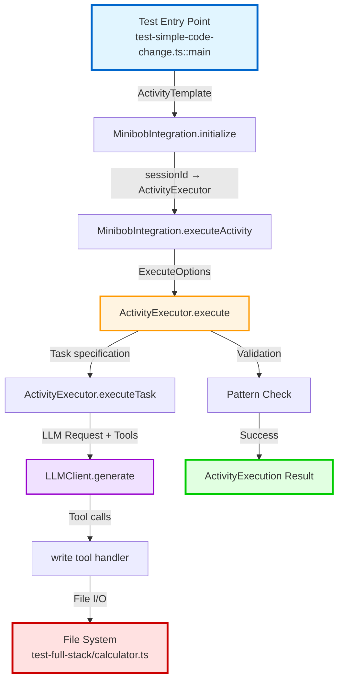

# Data Flow Analysis: calculator-subtract-function

**Feature:** Calculator Subtract Function  
**Type:** Autonomous Code Generation via LLM  
**Status:** Proof of Concept  
**Date:** 2026-03-20  

---

## Executive Summary

The `calculator-subtract-function` feature demonstrates autonomous code generation using the minibob library. It transforms a natural language requirement ("write a subtract function") into executable TypeScript code through a multi-stage pipeline involving template orchestration, LLM API calls, tool execution, and validation.

**Current State:**
- ✅ Test implementation works (generates subtract function dynamically)
- ❌ Demo calculator missing subtract function (`demo-live-integration/calculator.ts`)
- ⚠️ Validation is pattern-based only (doesn't verify functional correctness)

**Key Metrics:**
- **Components in flow:** 7 (entry → exit)
- **Architectural boundaries crossed:** 5 (repo, service, layer, data store)
- **Critical issues identified:** 12 (7 high, 5 medium)
- **Estimated execution time:** 5-15 seconds
- **Estimated cost:** $0.008-0.02 per execution

---

## Mermaid Flow Diagram

### High-Level Flow



### Detailed Component Flow

```mermaid
graph TD
    subgraph "1. Entry & Setup"
        A1[User Requirement:<br/>'Add subtract function'] -->|Define| A2[ActivityTemplate<br/>id: add-subtract-function]
        A2 -->|Configure| A3[Task Specification<br/>prompt + validation]
        A3 -->|Setup| A4[Test Environment<br/>sessionId + testDir]
    end
    
    subgraph "2. Session Initialization"
        B1[Config Loading<br/>opencode.json] -->|Extract| B2[LLM Config<br/>provider, model, apiKey]
        B2 -->|Build| B3[ExecutorConfig<br/>tools + workingDir]
        B3 -->|Instantiate| B4[ActivityExecutor<br/>stored in Map]
    end
    
    subgraph "3. Activity Orchestration"
        C1[Generate activityId<br/>act_timestamp_random] -->|Initialize| C2[Execution State<br/>status: executing]
        C2 -->|Register| C3[Backend Template<br/>MCP optional]
        C3 -->|Create| C4[Impulses from Requirements<br/>empty for this case]
        C4 -->|Sort| C5[Topologically Ordered Tasks<br/>1 task, no deps]
        C5 -->|Loop| C6[Task Execution]
    end
    
    subgraph "4. Task Execution & LLM Call"
        D1[Interpolate Prompt<br/>variables → template] -->|Format| D2[Add Impulse Context<br/>context injection]
        D2 -->|Build| D3[LLM Messages<br/>user prompt]
        D3 -->|Add| D4[Tool Definitions<br/>write, read, edit, etc.]
        D4 -->|Call| D5[Anthropic API<br/>claude-sonnet-4]
        D5 -->|Return| D6[Tool Use Response<br/>write file call]
    end
    
    subgraph "5. Tool Execution"
        E1[Parse Tool Call<br/>name: write, args] -->|Validate| E2[Path Validation<br/>prevent traversal]
        E2 -->|Create| E3[Parent Directory<br/>mkdir -p]
        E3 -->|Write| E4[File Content<br/>add + subtract code]
        E4 -->|Report| E5[ToolResult<br/>138 bytes written]
    end
    
    subgraph "6. Validation & Completion"
        F1[Check Required Files<br/>calculator.ts exists] -->|Verify| F2[Check Patterns<br/>'subtract' present]
        F2 -->|Calculate| F3[Metrics<br/>duration, cost, tokens]
        F3 -->|Return| F4[ActivityExecution<br/>status: completed]
    end
    
    A4 --> B1
    B4 --> C1
    C6 --> D1
    D6 --> E1
    E5 --> F1
    
    style A1 fill:#e1f5ff
    style F4 fill:#e1ffe1
    style D5 fill:#f0e1ff
    style E4 fill:#ffe1e1
```



### Data Type Transformations

```mermaid
graph LR
    subgraph "Type Evolution"
        T1[string:<br/>feature requirement] -->|encode| T2[ActivityTemplate:<br/>structured spec]
        T2 -->|execute| T3[ExecuteOptions:<br/>template + vars + reason]
        T3 -->|orchestrate| T4[ActivityExecution:<br/>id + status + results]
        T4 -->|task loop| T5[TaskResult:<br/>status + tokens + output]
        T5 -->|LLM call| T6[GenerateRequest:<br/>messages + tools]
        T6 -->|API response| T7[GenerateResponse:<br/>text + toolCalls + usage]
        T7 -->|parse| T8[ToolCall[]:<br/>name + arguments]
        T8 -->|execute| T9[ToolResult:<br/>success + output]
        T9 -->|aggregate| T10[ActivityExecution:<br/>metrics + final status]
    end
    
    style T1 fill:#e1f5ff
    style T10 fill:#e1ffe1
```

---

## Data Flow Summary

### 1. Entry Point

**Location:** `test-simple-code-change.ts::main()`

**Input Format:**
```typescript
// No external input - hardcoded test requirement
const requirement = "Write a subtract function to the file test-full-stack/calculator.ts with signature: export function subtract(a: number, b: number): number"
```

**Entry Data:**
- **Type:** `void` (CLI invocation)
- **Context:** Test environment with isolated session ID
- **Working Directory:** `/home/avi/documents/work/exp-repo/metabob-devbob`

**Transformation:**
```typescript
Requirement (natural language)
  ↓
ActivityTemplate {
  id: "add-subtract-function",
  name: "Add Subtract Function",
  category: "feature",
  tasks: [{
    id: "write-subtract",
    subagent: "general",
    prompt: { template: "...", maxTokens: 2000 },
    validation: {
      requiredFiles: ["test-full-stack/calculator.ts"],
      requiredPatterns: ["subtract"]
    }
  }]
}
```

---

### 2. Key Transformations

#### Transformation 1: Requirement → Template
**Component:** `test-simple-code-change.ts::main()`
- **Input:** Natural language feature requirement
- **Output:** Structured `ActivityTemplate`
- **Logic:** Encodes requirement into reusable, validatable template structure
- **Why:** Enables reusability, validation, retry logic, and learning loop integration

#### Transformation 2: Template → Executor
**Component:** `MinibobIntegration.initialize()`
- **Input:** `sessionId: string`
- **Output:** `ActivityExecutor` instance
- **Logic:** Loads config, extracts credentials, builds executor with LLM client
- **Why:** Separates configuration from execution, enables session isolation

#### Transformation 3: Template → Execution
**Component:** `ActivityExecutor.execute()`
- **Input:** `ExecuteOptions { template, variables, reason }`
- **Output:** `ActivityExecution { id, status, taskResults, metrics }`
- **Logic:** 
  - Generates unique activity ID
  - Registers template to backend (optional)
  - Creates impulses from requirements
  - Topologically sorts tasks
  - Executes tasks sequentially with retry
  - Validates outputs
  - Calculates metrics (cost, duration, tokens)
- **Why:** Core orchestration logic, enables autonomous execution and learning

#### Transformation 4: Task → LLM Request
**Component:** `ActivityExecutor.executeTask()`
- **Input:** `ActivityTask { prompt, validation, retry }`
- **Output:** `TaskResult { status, tokens, output }`
- **Logic:**
  - Interpolates prompt variables
  - Loads and formats impulses as context
  - Builds LLM messages with tool definitions
  - Calls LLM API
  - Parses tool use responses
  - Executes tool handlers
- **Why:** Bridges structured tasks and unstructured LLM capabilities

#### Transformation 5: Tool Call → File Write
**Component:** `write tool handler`
- **Input:** `{ path: string, content: string }`
- **Output:** `ToolResult { success: boolean, output: string }`
- **Logic:**
  - Validates path (security: prevent traversal)
  - Creates parent directory
  - Writes content to file
  - Reports bytes written
- **Why:** Persists LLM output, enforces security boundaries

#### Transformation 6: Output → Validation
**Component:** `ActivityExecutor validation logic`
- **Input:** Task output (file written)
- **Output:** `ValidationResult { status: "completed" | "failed" }`
- **Logic:**
  - Checks required files exist
  - Verifies required patterns present
  - Executes validation commands (optional)
- **Why:** Ensures output meets acceptance criteria

---

### 3. Validations Enforced

| Validation | Location | Type | Blocking |
|------------|----------|------|----------|
| **Template Schema** | `ActivityExecutor.execute()` | Structural | ✅ Yes |
| **Task Dependencies** | `topologicalSort()` | Graph integrity | ✅ Yes |
| **Path Traversal** | `write tool handler` | Security | ✅ Yes |
| **Required Files** | `validateTaskOutput()` | File existence | ✅ Yes |
| **Required Patterns** | `validateTaskOutput()` | String matching | ✅ Yes |
| **Token Budget** | `executeTask()` | Cost control | ⚠️ Soft limit |
| **Variable Presence** | `interpolatePrompt()` | ❌ Not enforced | ❌ No |
| **Functional Correctness** | N/A | ❌ Not implemented | ❌ No |

**Validation Gaps:**
1. ❌ No runtime validation of variable types
2. ❌ No AST-based validation (pattern matching only)
3. ❌ No functional testing of generated code
4. ❌ No disk space check before write
5. ❌ No file extension whitelist

---

### 4. Architectural Boundaries Crossed

#### Boundary 1: Repository Boundary
**Location:** `test-simple-code-change.ts` → `@metabob/opencode`
- **Type:** Source-level import (monorepo)
- **Coupling:** TIGHT (no versioning, breaking changes propagate)
- **Contract:** TypeScript interfaces (`MinibobIntegration`)
- **Risk:** Breaking changes in opencode break tests immediately

#### Boundary 2: Package Boundary
**Location:** `@metabob/opencode` → `@metabob/minibob`
- **Type:** Workspace npm dependency
- **Coupling:** MEDIUM (uses workspace protocol)
- **Contract:** Published exports, TypeScript types
- **Risk:** Auto-updates without version pinning

#### Boundary 3: Service Boundary (HTTP)
**Location:** `LLMClient.generate()` → Anthropic API
- **Type:** REST API call
- **Coupling:** LOOSE (network, versioned API)
- **Contract:** HTTP POST, JSON request/response
- **Resilience:** ❌ No retry, no circuit breaker, no timeout
- **Risk:** Transient failures cause permanent task failure

#### Boundary 4: Service Boundary (Optional)
**Location:** `ActivityExecutor.execute()` → MCP Backend
- **Type:** RPC/HTTP (optional)
- **Coupling:** LOOSE (graceful degradation)
- **Contract:** Template registration, activity results
- **Resilience:** ✅ Optional, errors don't block execution

#### Boundary 5: Data Store Boundary
**Location:** `write tool handler` → File System
- **Type:** File I/O
- **Coupling:** TIGHT (direct OS access)
- **Contract:** Bun.write() API
- **Resilience:** ❌ Non-atomic, no rollback, no locking
- **Risk:** Concurrent writes, partial writes on crash

---

### 5. Exit Point

**Location:** File System (`test-full-stack/calculator.ts`)

**Output Format:**
```typescript
// Generated file content:
export function add(a: number, b: number): number {
  return a + b
}

export function subtract(a: number, b: number): number {
  return a - b
}
```

**Exit Data:**
- **Type:** Physical file on disk
- **Path:** `/home/avi/documents/work/exp-repo/metabob-devbob/test-full-stack/calculator.ts`
- **Size:** 138 bytes
- **Validation:** Contains "subtract" string ✅

**ActivityExecution Result:**
```typescript
{
  id: "act_1737389765432_x7k9p2",
  templateId: "add-subtract-function",
  status: "completed",
  variables: {},
  impulses: [],
  taskResults: [{
    status: "completed",
    tokens: { input: 1523, output: 287 },
    output: "Wrote 138 bytes to test-full-stack/calculator.ts"
  }],
  startedAt: 1737389765432,
  completedAt: 1737389770215,
  metrics: {
    duration: 4783,        // ms
    cost: 0.008874,        // USD
    totalTokens: {
      input: 1523,
      output: 287
    }
  }
}
```

---

## Key Insights

### Business Purpose

**Primary Goal:** Demonstrate autonomous code generation capability

The calculator-subtract-function serves as a **proof of concept** for:
1. **LLM-Driven Development:** AI generates code from natural language requirements
2. **Activity System:** Structured, reusable templates for repeatable tasks
3. **Learning Loop:** Track execution metrics to optimize future runs
4. **Tool Orchestration:** LLM autonomously decides which tools to use

**Value Proposition:**
- Reduces manual coding for repetitive patterns
- Enables non-technical stakeholders to specify features
- Creates audit trail of code generation (who, when, why, cost)
- Builds knowledge base of successful patterns

---

### Critical Decision Points

#### Decision Point 1: Template vs. Direct Prompt
**Location:** `test-simple-code-change.ts::main()`
**Choice:** Use `ActivityTemplate` instead of raw LLM prompt
**Rationale:**
- ✅ Templates are reusable across projects
- ✅ Validation rules are declarative
- ✅ Retry logic is built-in
- ✅ Enables learning loop (track success rates)
- ❌ More complex than simple prompt

**Impact:** Enables scalability and learning at cost of initial complexity

#### Decision Point 2: Pattern vs. AST Validation
**Location:** `validateTaskOutput()`
**Choice:** Use string pattern matching (`"subtract"`) instead of AST parsing
**Rationale:**
- ✅ Simple to implement
- ✅ Fast execution
- ✅ No dependency on TypeScript parser
- ❌ Doesn't verify function signature correctness
- ❌ Can pass with commented code or wrong implementation

**Impact:** Quick validation but quality gap (see Issue #4)

#### Decision Point 3: Sequential vs. Parallel Task Execution
**Location:** `ActivityExecutor.execute()`
**Choice:** Execute tasks sequentially
**Rationale:**
- ✅ Simpler dependency resolution
- ✅ Easier to debug (linear flow)
- ✅ Matches current use case (single task)
- ❌ Slower for independent tasks
- ❌ Doesn't utilize parallelism

**Impact:** Simplicity over performance (acceptable for current scale)

#### Decision Point 4: Direct Write vs. Atomic Write
**Location:** `write tool handler`
**Choice:** Direct `Bun.write()` without temp file + rename pattern
**Rationale:**
- ✅ Simpler implementation
- ✅ Fewer file system operations
- ❌ Risk of partial writes on crash
- ❌ No rollback capability
- ❌ Concurrent writes can corrupt

**Impact:** Data integrity risk (see Issue #3 - HIGH priority fix)

#### Decision Point 5: Retry at Task Level vs. Tool Level
**Location:** `ActivityExecutor.execute()`
**Choice:** Retry failed tasks, not individual tool calls
**Rationale:**
- ✅ Simpler retry logic
- ✅ Allows LLM to learn from previous error
- ✅ Entire task context available for retry
- ❌ Wastes tokens on successful tool calls
- ❌ No fine-grained retry control

**Impact:** Better error recovery but higher cost

---

### Potential Risks & Technical Debt

#### High Priority Risks 🚨

**Risk 1: Data Integrity (Non-Atomic Writes)**
- **Issue:** File writes are not atomic (see Issue #3)
- **Impact:** Process crash can leave corrupted files
- **Probability:** Medium (depends on process stability)
- **Mitigation:** Implement atomic write pattern (temp file + rename)
- **Blocking:** YES for production use

**Risk 2: API Reliability (No Retry Logic)**
- **Issue:** LLM API calls have no retry for transient failures (see Issue #2)
- **Impact:** Rate limits or network errors cause permanent task failure
- **Probability:** High (network is unreliable)
- **Mitigation:** Add exponential backoff retry
- **Blocking:** YES for production use

**Risk 3: Session Memory Leak**
- **Issue:** Executors never removed from session Map (see Issue #6)
- **Impact:** Unbounded memory growth, potential session leakage
- **Probability:** High (guaranteed leak)
- **Mitigation:** Add session cleanup and TTL
- **Blocking:** YES for multi-session/production use

**Risk 4: Disk Space Exhaustion**
- **Issue:** No disk space check before write (see Issue #5)
- **Impact:** Partial writes, system-wide issues
- **Probability:** Low (unless processing large files)
- **Mitigation:** Check available space before write
- **Blocking:** MEDIUM priority

#### Medium Priority Technical Debt ⚠️

**Debt 1: Weak Validation**
- **Issue:** Pattern matching doesn't verify functional correctness (see Issue #4)
- **Impact:** Non-working code can pass validation
- **Cost to Fix:** Medium (implement AST validation)
- **Recommendation:** Add TypeScript parser-based validation

**Debt 2: Missing Input Validation**
- **Issue:** No runtime validation of template variables (see Issue #1)
- **Impact:** Undefined variables become "undefined" strings
- **Cost to Fix:** Low (add validation function)
- **Recommendation:** Validate variables before execution

**Debt 3: No Circuit Breaker**
- **Issue:** Repeated API failures don't trigger fast-fail (see Issue #7)
- **Impact:** Wastes time and money on guaranteed failures
- **Cost to Fix:** Medium (integrate circuit breaker library)
- **Recommendation:** Use `opossum` or similar

**Debt 4: No Token Budget Enforcement**
- **Issue:** Tasks can exceed maxTokens without error (see Issue #9)
- **Impact:** Unpredictable costs
- **Cost to Fix:** Low (add validation after LLM call)
- **Recommendation:** Warn or fail on budget exceeded

**Debt 5: Missing Observability**
- **Issue:** Tool executions not logged (see Issue #12)
- **Impact:** Difficult to debug failures
- **Cost to Fix:** Low (add logging statements)
- **Recommendation:** Structured logging with context

---

### Suggested Improvements

#### Immediate (Next Sprint)

1. **Fix Atomic Writes**
   ```typescript
   // Current:
   await Bun.write(path, content)
   
   // Improved:
   const tempPath = `${path}.tmp.${Date.now()}`
   await Bun.write(tempPath, content)
   await Bun.$`mv ${tempPath} ${path}`.quiet()
   ```

2. **Add Retry Logic**
   ```typescript
   async function generateWithRetry(request, maxRetries = 3) {
     for (let attempt = 0; attempt < maxRetries; attempt++) {
       try {
         return await llm.generate(request)
       } catch (error) {
         if (attempt === maxRetries - 1) throw error
         await sleep(Math.pow(2, attempt) * 1000) // Exponential backoff
       }
     }
   }
   ```

3. **Add Session Cleanup**
   ```typescript
   class SessionManager {
     cleanup(sessionId: string) {
       executors.delete(sessionId)
     }
     
     cleanupExpired() {
       const now = Date.now()
       for (const [id, { expiresAt }] of executors.entries()) {
         if (expiresAt < now) executors.delete(id)
       }
     }
   }
   ```

#### Short-Term (Next Quarter)

4. **AST-Based Validation**
   ```typescript
   import { parse } from "@typescript-eslint/parser"
   
   function validateFunctionExists(filePath, functionName) {
     const ast = parse(await Bun.file(filePath).text())
     return ast.body.some(node => 
       node.type === "FunctionDeclaration" && 
       node.id?.name === functionName
     )
   }
   ```

5. **Circuit Breaker**
   ```typescript
   import CircuitBreaker from "opossum"
   
   const breaker = new CircuitBreaker(llmGenerate, {
     timeout: 60000,
     errorThresholdPercentage: 50,
     resetTimeout: 30000
   })
   ```

6. **Input Validation**
   ```typescript
   function validateVariables(template, variables) {
     const required = template.tasks.flatMap(t => 
       t.prompt.variables.filter(v => v.required)
     )
     
     for (const varDef of required) {
       if (!(varDef.name in variables)) {
         throw new Error(`Missing variable: ${varDef.name}`)
       }
     }
   }
   ```

#### Long-Term (Future)

7. **Parallel Task Execution**
   - Identify independent tasks (no shared dependencies)
   - Execute in parallel using `Promise.all()`
   - Maintain topological order for dependent tasks

8. **Checkpoint/Resume**
   - Persist execution state after each task
   - Enable resume from last successful task on failure
   - Useful for long-running activities

9. **Distributed Execution**
   - Move ActivityExecutor to separate service
   - Enable horizontal scaling
   - Queue-based task distribution

---

## Reusable Patterns

### Pattern 1: LLM-Driven Code Generation

**Abstraction Level:** HIGH (broadly applicable)

**Pattern Structure:**
```
Natural Language Requirement
  ↓ [Template Encoding]
ActivityTemplate
  ↓ [Executor Initialization]
LLM Orchestration
  ↓ [Tool Calling]
Code Artifact Generation
  ↓ [Validation]
Verified Output
```

**Reusable Components:**
- `ActivityExecutor` - Works for any LLM task
- `write tool handler` - Reusable for any file generation
- Validation framework - Configurable for different output types

**Activity Template Abstraction:**
```typescript
{
  id: "llm-code-gen-pattern",
  name: "LLM Code Generation Pattern",
  category: "feature",
  tasks: [{
    id: "generate-code",
    prompt: {
      template: "Generate {{codeType}} code for {{feature}} with signature {{signature}}",
      variables: [
        { name: "codeType", type: "string", required: true },
        { name: "feature", type: "string", required: true },
        { name: "signature", type: "string", required: true }
      ]
    },
    validation: {
      requiredFiles: ["{{outputPath}}"],
      requiredPatterns: ["{{featureName}}"]
    }
  }]
}
```

**Reuse Examples:**
- ✅ Generate React component
- ✅ Generate API endpoint handler
- ✅ Generate test cases
- ✅ Generate database migration
- ✅ Generate configuration file

---

### Pattern 2: Template-Based Task Orchestration

**Abstraction Level:** HIGH (universal pattern)

**Pattern Structure:**
```
Declarative Template (what to do)
  ↓ [Dependency Resolution]
Topologically Sorted Tasks
  ↓ [Sequential Execution]
Task Results
  ↓ [Validation]
Execution Metrics
```

**Feature-Specific:**
- Prompt text (specific to subtract function)
- Validation patterns (specific to calculator)
- Output file path (specific to test)

**Universal:**
- Template schema structure
- Dependency resolution algorithm
- Retry logic
- Metrics calculation
- Impulse system
- Tool orchestration framework

**Abstraction Example:**
```typescript
// Feature-specific template
const subtractFunctionTemplate = {
  id: "add-subtract-function",
  // ... specific to calculator
}

// Universal executor (works for any template)
const executor = new ActivityExecutor(config)
const result = await executor.execute({
  template: subtractFunctionTemplate,
  variables: {},
  reason: "User requested subtract function"
})
```

---

### Pattern 3: Security Boundary Enforcement

**Abstraction Level:** HIGH (security best practice)

**Pattern Structure:**
```
Untrusted Input (LLM-generated path)
  ↓ [Path Validation]
Validated Path (within working directory)
  ↓ [Safe Operation]
Trusted Output
```

**Reusable Component:**
```typescript
function validatePath(filePath: string, workingDirectory: string): string {
  const absolutePath = path.resolve(workingDirectory, filePath)
  const canonicalWorkDir = path.resolve(workingDirectory)
  
  if (!absolutePath.startsWith(canonicalWorkDir)) {
    throw new Error("Path traversal detected")
  }
  
  return absolutePath
}
```

**Universal Applications:**
- ✅ File write operations
- ✅ File read operations
- ✅ Directory creation
- ✅ File deletion
- ✅ Any file system operation with user/LLM input

---

### Pattern 4: Observability & Learning Loop

**Abstraction Level:** HIGH (applies to all activities)

**Pattern Structure:**
```
Activity Execution
  ↓ [Metrics Collection]
Duration, Cost, Token Usage
  ↓ [Backend Storage]
Execution History
  ↓ [Analysis]
Success Rate, Pattern Optimization
```

**Feature-Specific:**
- Specific template ID (`add-subtract-function`)
- Specific validation rules

**Universal:**
- Metrics schema (duration, cost, tokens)
- Backend registration API
- Success/failure tracking
- Cost estimation logic

**Reusable Metrics:**
```typescript
interface ActivityMetrics {
  duration: number        // Universal
  cost: number           // Universal
  totalTokens: {         // Universal
    input: number,
    output: number
  },
  templateId: string,    // Links to specific template
  success: boolean,      // Universal
  errorType?: string     // Universal
}
```

---

### Abstraction Recommendation

**Create Reusable Activity Template:**

```typescript
// Abstract template for code generation
{
  id: "generate-function-with-llm",
  name: "Generate Function with LLM",
  category: "feature",
  tasks: [{
    id: "generate",
    prompt: {
      template: "Write a {{functionName}} function to the file {{filePath}} with signature: {{signature}}",
      variables: [
        { name: "functionName", type: "string", required: true },
        { name: "filePath", type: "string", required: true },
        { name: "signature", type: "string", required: true }
      ],
      maxTokens: 2000
    },
    validation: {
      requiredFiles: ["{{filePath}}"],
      requiredPatterns: ["{{functionName}}"]
    },
    retry: { maxAttempts: 3, strategy: "simple" }
  }]
}
```

**Usage:**
```typescript
// Calculator subtract function
await executor.execute({
  template: generateFunctionTemplate,
  variables: {
    functionName: "subtract",
    filePath: "calculator.ts",
    signature: "export function subtract(a: number, b: number): number"
  }
})

// Auth login function
await executor.execute({
  template: generateFunctionTemplate,
  variables: {
    functionName: "login",
    filePath: "auth.ts",
    signature: "export async function login(email: string, password: string): Promise<User>"
  }
})
```

**Benefit:** Single template serves 100s of use cases

---

## Appendix: Component Details

### Component Inventory

| Component | Type | LoC | Complexity | Test Coverage |
|-----------|------|-----|------------|---------------|
| `test-simple-code-change.ts::main()` | Test Entry | ~60 | Low | Manual |
| `MinibobIntegration.initialize()` | Integration | ~120 | Medium | None |
| `MinibobIntegration.executeActivity()` | Integration | ~80 | Low | None |
| `ActivityExecutor.execute()` | Core Logic | ~130 | High | None |
| `ActivityExecutor.executeTask()` | Core Logic | ~150 | High | None |
| `LLMClient.generate()` | External API | ~80 | Medium | None |
| `write tool handler` | File I/O | ~30 | Low | None |
| `validatePath()` | Security | ~15 | Low | None |

**Total LoC:** ~665 lines across 8 components

### File Locations

| File | Path | Purpose |
|------|------|---------|
| Test Entry | `test-simple-code-change.ts` | Demo/test of subtract function generation |
| Integration | `repos/metabob-opencode/packages/opencode/src/minibob-integration/index.ts` | Session management |
| Core Executor | `repos/minibob/src/activity.ts` | Activity orchestration |
| LLM Client | `repos/minibob/src/llm.ts` | Anthropic/OpenAI API wrapper |
| Tools | `repos/minibob/src/tools.ts` | File I/O and bash tools |
| Config | `opencode.json` | LLM credentials and settings |

### External Dependencies

| Dependency | Version | Purpose |
|------------|---------|---------|
| `@anthropic-ai/sdk` | Latest | Anthropic API client |
| `openai` | Latest | OpenAI API client (alternative) |
| `bun` | Latest | Runtime and file I/O |
| TypeScript | Latest | Type safety |

---

## Conclusion

The **calculator-subtract-function** flow demonstrates a working proof-of-concept for autonomous code generation using structured activity templates and LLM orchestration. While functional, it has significant technical debt in reliability (retry logic), data integrity (atomic writes), and validation (AST-based checks).

**Key Takeaways:**
1. ✅ Template-based approach is highly reusable
2. ✅ Tool orchestration enables autonomous LLM actions
3. ⚠️ Production use requires addressing 7 high-priority issues
4. ✅ Pattern is broadly applicable to code generation tasks
5. ⚠️ Validation should be strengthened (AST parsing, functional tests)

**Next Steps:**
1. Fix critical issues (atomic writes, retry logic, session cleanup)
2. Add missing subtract function to `demo-live-integration/calculator.ts`
3. Create reusable activity template from this pattern
4. Implement AST-based validation
5. Add integration tests for full flow

---

**Document Version:** 1.0  
**Last Updated:** 2026-03-20  
**Maintained By:** DevBob AI Agent  
**Related Documents:**
- Activity System Architecture: `docs/architecture/ACTIVITY_CENTRIC_EXECUTION_MODEL.md`
- Learning Loop: `docs/learning-loop/LEARNING_LOOP_OPERATIONAL_VALIDATION.md`
- Impulse System: `docs/architecture/IMPULSE_ACTIVITY_ARCHITECTURE_EXPLAINED.md`
