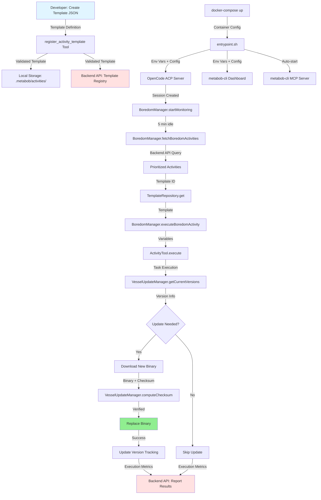
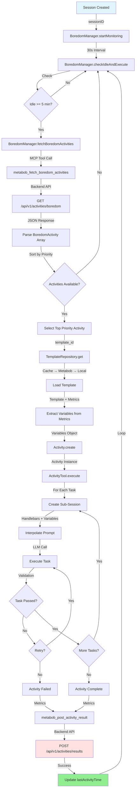
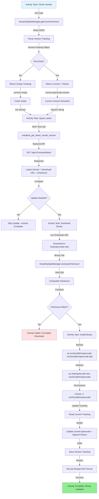
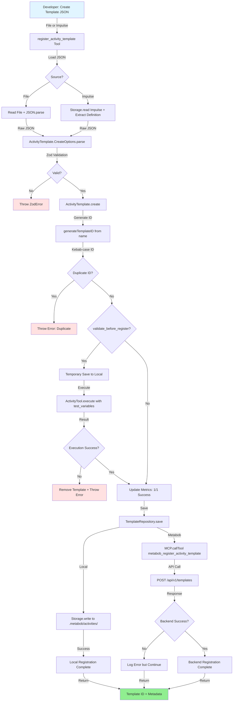

# Data Flow: DevBob Container Deployment and Activity Updates

## Overview

This document provides a comprehensive analysis of the devbob container deployment workflow, covering:
1. How activity templates are deployed to containers
2. How vessel binaries are updated in running containers
3. How multi-container orchestration works with docker-compose
4. Entry points for deployment automation

**Status:** Fully documented, 5 critical fixes needed before production deployment

---

## Mermaid Flow Diagrams

### High-Level Deployment Workflow



### Container Startup Flow

```mermaid
graph TD
    A[docker-compose --profile stable --profile devbob up] -->|Start Backend| B[Redis + SurrealDB + API Server]
    B -->|Health Check Pass| C[Start DevBob Containers]
    
    C -->|Environment Variables| D[entrypoint.sh: Validate Env]
    D -->|ANTHROPIC_API_KEY, etc.| E{Required Vars Set?}
    E -->|No| F[Exit 1: Error]
    E -->|Yes| G[Process OpenCode Config]
    
    G -->|envsubst| H[Substitute ${VAR} Placeholders]
    H -->|Generated Config| I{Valid JSON?}
    I -->|No| J[Exit 1: Invalid Config]
    I -->|Yes| K[Wait for Backend Health]
    
    K -->|curl /health| L{Backend Ready?}
    L -->|Timeout 60s| M[Exit 1: Backend Unavailable]
    L -->|Yes| N[Start metabob-cli Dashboard]
    
    N -->|Port 8001 SSE| O[Dashboard Running]
    O -->|Success| P[Start OpenCode ACP Server]
    P -->|Port 3000| Q[ACP Server Running]
    Q -->|Auto-spawn| R[metabob-cli MCP Server stdio]
    
    R -->|3 Services Ready| S[Container Ready]
    
    style A fill:#e1f5ff
    style S fill:#90EE90
    style F fill:#ffe1e1
    style J fill:#ffe1e1
    style M fill:#ffe1e1
```

### Boredom Activity Execution Flow



### Vessel Binary Update Flow (Within Boredom Activity)



### Template Registration Flow



---

## Data Flow Summary

### Entry Points

1. **Container Deployment Entry:**
   - **Where:** `docker-compose --profile stable --profile devbob up`
   - **Format:** YAML configuration + environment variables
   - **Input:** Service definitions, volume mounts, network config, env vars

2. **Template Registration Entry:**
   - **Where:** `register_activity_template` tool call
   - **Format:** Template JSON file or Impulse ID
   - **Input:** ActivityTemplate.CreateOptions schema

3. **Boredom Activity Entry:**
   - **Where:** `BoredomManager.startMonitoring(sessionID)`
   - **Format:** Session ID string
   - **Input:** OpenCode session identifier

4. **Vessel Update Entry:**
   - **Where:** Boredom activity execution (template-driven)
   - **Format:** Activity template with vessel update tasks
   - **Input:** Template variables (current_version, latest_version, download_url, checksum)

---

### Key Transformations

#### Transformation 1: Environment Variables → OpenCode Configuration
- **Input:** `ANTHROPIC_API_KEY`, `METABOB_API_URL`, etc. (environment variables)
- **Process:** `envsubst` replaces `${VAR}` placeholders in JSON template
- **Output:** Concrete `opencode.json` with API keys and URLs
- **Validation:** `jq empty` (syntax check), `jq -e '.provider.anthropic.options.apiKey'` (required fields)
- **Risk:** JSON injection if env vars contain `", "malicious": true` (Issue #3)

#### Transformation 2: Template Name → Template ID
- **Input:** Template name (e.g., "Update Vessel Binary v2")
- **Process:** `generateTemplateID()` - lowercase, strip versions, kebab-case
- **Output:** Template ID (e.g., "update-vessel-binary")
- **Validation:** Duplicate ID check via `TemplateRepository.exists()`
- **Why:** Human-readable IDs for logs and debugging

#### Transformation 3: BoredomActivity Metrics → Activity Variables
- **Input:** `BoredomActivity.metrics` (complex objects with arrays and nested structures)
- **Process:** Flatten primitives, JSON.stringify complex objects
- **Output:** `Record<string, unknown>` for Handlebars interpolation
- **Why:** Handlebars templates require string interpolation for complex objects

#### Transformation 4: Binary File → SHA-256 Checksum
- **Input:** Binary file path (e.g., `/tmp/opencode-new`)
- **Process:** `VesselUpdateManager.computeChecksum()` - read file, hash SHA-256, hex encode
- **Output:** 64-character hex string (e.g., "a1b2c3d4...")
- **Why:** Verify integrity after download, prevent corrupted/tampered binaries

#### Transformation 5: Version Tracking File → VersionTracking Object
- **Input:** JSON file at `/workspace/.vessel-versions.json`
- **Process:** Parse JSON, validate structure, normalize missing fields
- **Output:** `VersionTracking { current: Record<string, VesselVersion>, history: VesselUpdateRecord[] }`
- **Validation:** Graceful degradation (missing file → empty tracking)
- **Why:** Single source of truth for vessel versions

---

### Validations Enforced

#### 1. Environment Variable Validation (entrypoint.sh)
- **Required:** `ANTHROPIC_API_KEY` or `OPENAI_API_KEY`, `METABOB_API_URL`, `METABOB_PROJECT_ID`
- **Action on Failure:** Exit 1 (container fails to start)
- **Purpose:** Prevent containers starting without required credentials

#### 2. Backend Health Check (entrypoint.sh)
- **Check:** `curl -f http://metabob-rpc-api-server:8080/health`
- **Retry:** 30 attempts × 2 seconds = 60 seconds max
- **Action on Failure:** Exit 1 (container fails to start)
- **Purpose:** Ensure backend is ready before starting devbob services

#### 3. Template Structure Validation (RegisterActivityTemplateTool)
- **Schema:** `ActivityTemplate.CreateOptions` (Zod)
- **Fields:** name, description, category, tasks (all required)
- **Enums:** category ∈ ["feature", "bugfix", "refactor", "tool", "infrastructure"]
- **Action on Failure:** Throw ZodError with field paths
- **Purpose:** Prevent malformed templates from being registered

#### 4. Template Execution Validation (Optional)
- **When:** `validate_before_register=true`
- **Process:** Test execute template with `test_variables`
- **Action on Failure:** Remove template, throw error, block registration
- **Purpose:** Prevent broken templates, start with 100% success rate

#### 5. Checksum Verification (VesselUpdateManager)
- **Input:** Downloaded binary + expected checksum
- **Process:** Compute SHA-256, compare hex strings
- **Action on Failure:** Activity fails, binary not installed
- **Purpose:** Prevent corrupted or tampered binaries

#### 6. Docker Health Check (docker-compose.yaml)
- **Check:** `curl -f http://localhost:8080/health` (API server)
- **Interval:** 10 seconds
- **Retries:** 5 failures → unhealthy
- **Purpose:** Dependent containers wait for healthy backend

---

### Architectural Boundaries Crossed

#### Boundary 1: OpenCode → metabob-cli MCP (Cross-Repo, Service)
- **Protocol:** JSON-RPC 2.0 over stdio
- **Coupling:** Loose (language-agnostic)
- **Contract:** MCP tool signatures (metabob_fetch_boredom_activities, etc.)
- **Resilience:** 30s timeout, auto-restart on crash, graceful degradation
- **Error Handling:** Return empty result, log error, continue

#### Boundary 2: metabob-cli MCP → Backend API (Service, HTTP)
- **Protocol:** HTTP REST
- **Coupling:** Loose (JSON payloads)
- **Contract:** `/api/v1/activities/boredom`, `/api/v1/activities/results`, `/api/v1/templates`
- **Resilience:** 3 retries with exponential backoff (1s → 2s → 4s), 10s timeout
- **Error Handling:** Return empty result on all retries failed

#### Boundary 3: TemplateRepository → Storage/MCP (Layer, Multi-Backend)
- **Protocol:** Filesystem (local) + JSON-RPC (MCP)
- **Coupling:** Loose (abstraction over backends)
- **Contract:** `list()`, `get()`, `save()`, `remove()`
- **Resilience:** Fallback chain (Cache → Metabob → Local)
- **Error Handling:** Return undefined, graceful degradation

#### Boundary 4: VesselUpdateManager → Filesystem (Data Store)
- **Protocol:** File I/O (JSON)
- **Coupling:** Tight (direct filesystem access)
- **Contract:** Version tracking JSON schema
- **Resilience:** Atomic writes (temp + rename), lock mechanism (Issue #2: not implemented)
- **Error Handling:** Graceful degradation (missing file → empty tracking)

#### Boundary 5: docker-compose → Docker Engine (Orchestration)
- **Protocol:** Docker API (container lifecycle)
- **Coupling:** Loose (declarative YAML)
- **Contract:** Docker Compose 3.8 format
- **Resilience:** Health checks (5 retries), restart policy (unless-stopped)
- **Error Handling:** Auto-restart on failure

---

### Exit Points

1. **Container Ready State:**
   - **Where:** 3 services running (dashboard, ACP, MCP)
   - **Format:** Running processes on ports 3000, 8001, stdio
   - **Output:** Container logs, service bindings

2. **Template Registered:**
   - **Where:** Local storage (`.metabob/activities/{id}.json`) + Backend (SurrealDB)
   - **Format:** Validated ActivityTemplate JSON
   - **Output:** Template ID, registration metadata

3. **Activity Execution Complete:**
   - **Where:** Backend API (`POST /api/v1/activities/results`)
   - **Format:** Execution metrics (success, duration, cost, tokens)
   - **Output:** Learning loop update (success rate, avg cost, avg duration)

4. **Vessel Binary Updated:**
   - **Where:** Binary file (`/usr/local/bin/opencode`), version tracking file
   - **Format:** Executable binary + JSON tracking
   - **Output:** New vessel version installed, ACP server restarted

---

## Key Insights

### Business Purpose

**Automated Continuous Improvement System**

The devbob deployment workflow enables a self-improving AI agent infrastructure:

1. **Vessel Updates:** Containers automatically update their binaries during idle time (no manual deployment)
2. **Template Distribution:** Activity templates can be registered once and distributed to all containers
3. **Learning Loop:** Execution metrics flow back to backend, enabling AI-driven prioritization
4. **Zero Downtime:** Hot deployment of binaries without container restarts

**Business Value:**
- **Reduced Operational Overhead:** No manual deployments, no coordination needed
- **Faster Iteration:** Templates deployed instantly, vessel updates within minutes
- **Quality Improvement:** Learning loop identifies low-quality templates for improvement
- **Cost Optimization:** Idle time utilized for maintenance tasks

---

### Critical Decision Points

#### Decision 1: When to Execute Boredom Activity?
- **Condition:** Session idle >= 5 minutes AND no activity currently running
- **Alternatives Considered:**
  - Event-driven (rejected: more complex state management)
  - Scheduled (rejected: may interrupt users)
- **Impact:** Prevents interrupting active users, utilizes idle time

#### Decision 2: Which Activity to Execute?
- **Condition:** Backend AI ranks by priority (improvement potential)
- **Criteria:** Success rate < 0.95, execution count > 5, not executed in last 24 hours
- **Alternatives Considered:**
  - Round-robin (rejected: doesn't prioritize high-impact work)
  - Manual selection (rejected: not automated)
- **Impact:** Focuses on templates that need improvement most

#### Decision 3: Update Binary or Skip?
- **Condition:** Latest version != current version
- **Verification:** Checksum match after download
- **Alternatives Considered:**
  - Always update (rejected: unnecessary downloads)
  - Manual updates (rejected: operational overhead)
- **Impact:** Only updates when needed, verifies integrity

#### Decision 4: Local or Backend Storage for Templates?
- **Condition:** Dual storage (local + backend)
- **Strategy:** Local for bootstrap, backend for discovery
- **Alternatives Considered:**
  - Backend only (rejected: requires network for basic operations)
  - Local only (rejected: no cross-agent sharing)
- **Impact:** Resilience (works offline) + sharing (cross-agent discovery)

#### Decision 5: Fail-Fast or Graceful Degradation?
- **Condition:** Depends on component
- **Strategy:**
  - Container startup: Fail-fast (exit on missing env vars)
  - Boredom activities: Graceful degradation (log and continue)
- **Alternatives Considered:**
  - Always fail-fast (rejected: boredom loop would crash sessions)
  - Always graceful (rejected: containers would start broken)
- **Impact:** Reliability (container startup) + availability (boredom loop)

---

### Potential Risks and Technical Debt

#### HIGH Risk: Security and Data Integrity

**Issue #3: Unvalidated Environment Variable Substitution**
- **Risk:** JSON injection via malicious env vars
- **Impact:** Broken config, service disruption, potential security breach
- **Mitigation:** Validate config after envsubst with jq (check syntax + required fields)
- **Priority:** HIGH (security risk in production)

**Issue #2: Race Condition in Version File Updates**
- **Risk:** Concurrent updates corrupt version tracking
- **Impact:** Lost version history, unreliable rollback
- **Mitigation:** Add file locking with Lock.acquire()
- **Priority:** HIGH (data integrity for rollback)

**Issue #6: Missing Checksum Verification**
- **Risk:** Installing corrupted or tampered binaries
- **Impact:** Security breach, service disruption
- **Mitigation:** Implement in vessel update template (already designed)
- **Priority:** HIGH (security risk in production)

#### HIGH Risk: Availability

**Issue #4: Missing Timeout for Boredom Activities**
- **Risk:** Stuck templates hang boredom system indefinitely
- **Impact:** No other boredom activities execute, session appears hung
- **Mitigation:** Add 30-minute timeout to AbortController
- **Priority:** HIGH (availability degradation)

**Issue #1: Missing Input Validation**
- **Risk:** Malformed backend data crashes boredom execution
- **Impact:** Boredom loop stops, no vessel updates
- **Mitigation:** Add Zod validation to BoredomActivity objects
- **Priority:** HIGH (reliability)

#### MEDIUM Risk: Resource Leaks

**Issue #7: Unbounded Memory Growth**
- **Risk:** Session managers never cleaned up
- **Impact:** Memory exhaustion in long-running containers
- **Mitigation:** Add stopMonitoring() on session end
- **Priority:** MEDIUM (important for long-running containers)

#### MEDIUM Risk: Reliability

**Issue #8: Missing Retry Logic**
- **Risk:** Template registration fails silently on backend errors
- **Impact:** Templates only saved locally, not discoverable
- **Mitigation:** Add retry with exponential backoff (3 attempts)
- **Priority:** MEDIUM (template distribution failure)

**Issue #9: No Variable Validation**
- **Risk:** Templates execute with missing required variables
- **Impact:** Failed executions, wasted LLM calls
- **Mitigation:** Validate variables against template schema before execution
- **Priority:** MEDIUM (improves reliability)

#### MEDIUM Risk: Performance

**Issue #5: Inefficient Template Loading**
- **Risk:** Load-all-then-filter approach
- **Impact:** Unnecessary network calls and file I/O
- **Mitigation:** Push category filter to backend
- **Priority:** MEDIUM (performance with many templates)

---

### Suggested Improvements

#### Phase 1: Fix Blocking Issues (1-2 days, HIGH priority)

1. **Add Zod Validation to Boredom Activities (Issue #1)**
   ```typescript
   const BoredomActivitySchema = z.object({
     activity_type: z.enum(["improve-template", "debug-failures", "optimize-performance"]),
     priority: z.number().min(0).max(1),
     template_id: z.string(),
     metrics: z.object({
       success_rate: z.number(),
       avg_cost: z.number(),
       avg_duration_ms: z.number(),
       execution_count: z.number()
     })
   })
   
   const validated = data.activities
     .map(a => BoredomActivitySchema.safeParse(a))
     .filter(r => r.success)
     .map(r => r.data)
   ```

2. **Add File Locking to Version Tracking (Issue #2)**
   ```typescript
   const versionFileLock = Lock.create()
   
   export async function recordUpdate(...) {
     await versionFileLock.acquire(filePath, async () => {
       const tracking = await getCurrentVersions(filePath)
       tracking.current[vessel] = newVersion
       tracking.history.push(updateRecord)
       await writeFile(filePath, JSON.stringify(tracking, null, 2))
     })
   }
   ```

3. **Validate Config After envsubst (Issue #3)**
   ```bash
   if jq empty "$SUBSTITUTED_CONFIG" >/dev/null 2>&1; then
     if jq -e '.provider.anthropic.options.apiKey' "$SUBSTITUTED_CONFIG" >/dev/null 2>&1; then
       export OPENCODE_CONFIG="$SUBSTITUTED_CONFIG"
     else
       log_error "Substituted config missing required fields"
       exit 1
     fi
   else
     log_error "Substituted config is invalid JSON"
     exit 1
   fi
   ```

4. **Add Timeout to Boredom Execution (Issue #4)**
   ```typescript
   const BOREDOM_ACTIVITY_TIMEOUT = 30 * 60 * 1000  // 30 minutes
   
   const timeoutId = setTimeout(() => {
     log.warn(`Boredom activity timed out`, { templateId })
     abortController.abort()
   }, BOREDOM_ACTIVITY_TIMEOUT)
   
   try {
     const result = await ActivityTool.execute({...}, {
       abortSignal: abortController.signal
     })
   } finally {
     clearTimeout(timeoutId)
   }
   ```

5. **Implement Checksum Verification in Template (Issue #6)**
   - Add task to vessel update template that calls `VesselUpdateManager.computeChecksum()`
   - Compare with expected checksum before installing

#### Phase 2: Address Technical Debt (2-3 days, MEDIUM priority)

6. **Add Session Cleanup (Issue #7)**
   ```typescript
   export function stopMonitoring(sessionID: string) {
     const manager = sessionManagers.get(sessionID)
     if (!manager) return
     
     if (manager.checkTimer) clearInterval(manager.checkTimer)
     if (manager.currentActivity) manager.currentActivity.abortController.abort()
     
     sessionManagers.delete(sessionID)
   }
   
   // Call on Session.Event.Ended
   ```

7. **Add Retry Logic to Template Save (Issue #8)**
   ```typescript
   async function saveWithRetry(template: ActivityTemplate.Schema) {
     const retries = 3
     for (let i = 0; i < retries; i++) {
       try {
         await MCP.callTool("metabob_register_activity_template", { template })
         return
       } catch (error) {
         if (i < retries - 1) {
           await sleep(1000 * Math.pow(2, i))  // Exponential backoff
         }
       }
     }
     log.error(`Failed to register template after ${retries} attempts`)
   }
   ```

8. **Validate Variables Before Execution (Issue #9)**
   ```typescript
   function validateVariables(
     template: ActivityTemplate.Schema,
     providedVariables: Record<string, unknown>
   ): { valid: boolean, missing: string[] } {
     const missing: string[] = []
     for (const task of template.tasks) {
       for (const variable of task.prompt.variables) {
         if (variable.required && !(variable.name in providedVariables)) {
           missing.push(`${task.id}.${variable.name}`)
         }
       }
     }
     return { valid: missing.length === 0, missing }
   }
   ```

9. **Optimize Template Loading (Issue #5)**
   - Add category filter parameter to `metabob_list_templates` MCP tool
   - Push filter to backend query instead of client-side filtering

#### Phase 3: Improve Observability (1 day, LOW priority)

10. **Standardize Logging Levels (Issue #10)**
    - Use `log.info()` for execution start/end
    - Use `log.debug()` for periodic checks
    - Use `log.warn()` for recoverable errors
    - Use `log.error()` for failures

11. **Add JSDoc to Public APIs (Issue #12)**
    - Document all public functions with parameters, return values, examples
    - Generate API documentation from JSDoc

12. **Extract Magic Numbers to Config (Issue #11)**
    - Move health check retry config to environment variables
    - Move idle threshold to configuration file

---

## Reusable Patterns

### Pattern 1: Graceful Degradation on External Data

**Identified In:**
- `BoredomManager.fetchBoredomActivities()` - Returns empty array on backend failure
- `VesselUpdateManager.getCurrentVersions()` - Returns empty tracking on missing file
- `TemplateRepository.get()` - Returns undefined on not found

**Pattern:**
```typescript
async function fetchExternalData(): Promise<Data[]> {
  try {
    const result = await externalAPI.fetch()
    return result.data
  } catch (error) {
    log.error("External API failed", { error })
    return []  // Graceful degradation
  }
}
```

**When to Use:**
- External systems (APIs, files) that may be unavailable
- Non-critical features that shouldn't crash the system
- Background tasks that can be retried later

**Reusable Activity:** `fetch-with-fallback` template
- Task 1: Try primary source
- Task 2: If failed, try fallback source
- Task 3: If all failed, return default/empty

---

### Pattern 2: Retry with Exponential Backoff

**Identified In:**
- `metabob-cli` MCP server backend API calls
- Suggested for `TemplateRepository.save()` (Issue #8)

**Pattern:**
```typescript
async function retryWithBackoff<T>(
  fn: () => Promise<T>,
  maxRetries: number = 3
): Promise<T> {
  let lastError
  for (let i = 0; i < maxRetries; i++) {
    try {
      return await fn()
    } catch (error) {
      lastError = error
      if (i < maxRetries - 1) {
        await sleep(1000 * Math.pow(2, i))  // 1s, 2s, 4s
      }
    }
  }
  throw lastError
}
```

**When to Use:**
- Network calls to backend APIs
- Transient failures (5xx errors, timeouts)
- Don't use for client errors (4xx)

**Reusable Activity:** `call-api-with-retry` template
- Task 1: Call API
- Task 2: If 5xx error, retry with backoff
- Task 3: If all retries failed, report error

---

### Pattern 3: Fallback Chain (Cache → Primary → Secondary)

**Identified In:**
- `TemplateRepository.get()` - Cache → Metabob → Local
- Suggested for other data loading scenarios

**Pattern:**
```typescript
async function loadWithFallback<T>(id: string): Promise<T | undefined> {
  // Try cache
  const cached = cache.get(id)
  if (cached) return cached
  
  // Try primary source
  try {
    const primary = await primarySource.fetch(id)
    cache.set(id, primary)
    return primary
  } catch (error) {
    log.warn("Primary source failed, trying fallback")
  }
  
  // Try fallback source
  try {
    const fallback = await fallbackSource.fetch(id)
    cache.set(id, fallback)
    return fallback
  } catch (error) {
    log.error("All sources failed")
    return undefined
  }
}
```

**When to Use:**
- Multiple data sources with different reliability/performance
- Offline-first applications
- Redundancy for critical data

**Reusable Activity:** `load-with-fallback-chain` template
- Task 1: Check cache
- Task 2: If miss, try primary source
- Task 3: If failed, try fallback source
- Task 4: Update cache if found

---

### Pattern 4: Validation at Boundaries (Parse, Don't Validate)

**Identified In:**
- `RegisterActivityTemplateTool.execute()` - Zod validation at entry
- Suggested for `BoredomManager.fetchBoredomActivities()` (Issue #1)

**Pattern:**
```typescript
// Define schema at boundary
const InputSchema = z.object({
  required_field: z.string(),
  optional_field: z.number().optional()
})

// Parse at entry point
function processInput(rawInput: unknown) {
  const validated = InputSchema.parse(rawInput)  // Throws on invalid
  
  // Now work with validated data (type-safe)
  return doSomething(validated.required_field)
}
```

**When to Use:**
- External data (APIs, user input, files)
- Cross-boundary calls (MCP, HTTP)
- Type safety at runtime

**Reusable Activity:** `validate-and-process` template
- Task 1: Parse input with schema
- Task 2: If valid, process data
- Task 3: If invalid, report validation errors

---

### Pattern 5: Atomic File Operations (Temp + Rename)

**Identified In:**
- `Storage.write()` - Temp file + atomic rename
- Suggested for `VesselUpdateManager.recordUpdate()` (with locking)

**Pattern:**
```typescript
async function atomicWrite(filePath: string, data: string): Promise<void> {
  const tempPath = `${filePath}.tmp`
  
  try {
    // Write to temp file
    await fs.writeFile(tempPath, data)
    
    // Atomic rename
    await fs.rename(tempPath, filePath)
  } catch (error) {
    // Clean up temp file on error
    await fs.unlink(tempPath).catch(() => {})
    throw error
  }
}
```

**When to Use:**
- Critical data files (version tracking, config)
- Prevent partial writes from corrupting data
- Concurrent access scenarios

**Reusable Activity:** `atomic-file-update` template
- Task 1: Read current file
- Task 2: Modify data
- Task 3: Write to temp file
- Task 4: Atomic rename

---

### Universal vs. Feature-Specific Aspects

#### Universal (Reusable Across Features)

1. **Retry with Backoff** - Any network call, any backend API
2. **Fallback Chain** - Any data loading with multiple sources
3. **Graceful Degradation** - Any non-critical feature
4. **Validation at Boundaries** - Any external input
5. **Atomic File Operations** - Any file write operation
6. **Health Checks** - Any service dependency

#### Feature-Specific (Devbob Deployment Only)

1. **Idle Detection Logic** - 30s interval, 5min threshold (specific to boredom system)
2. **Template ID Generation** - Kebab-case from name (specific to activity templates)
3. **Vessel Version Tracking** - Schema specific to vessel updates
4. **Environment Variable Substitution** - Specific to container deployment
5. **Multi-Service Orchestration** - Dashboard + ACP + MCP (specific architecture)

#### Abstraction Potential

**High Abstraction Potential:**
- Retry, fallback, validation patterns → Generic utility functions
- Atomic file operations → Storage library
- Health check logic → Service dependency framework

**Low Abstraction Potential:**
- Idle detection → Too specific to boredom system
- Template ID generation → Domain-specific business logic
- Vessel version tracking → Domain-specific schema

---

## Next Steps

### Immediate Actions (Before Production Deployment)

1. **Fix 5 Blocking Issues** (1-2 days)
   - Issue #1: Add Zod validation
   - Issue #2: Add file locking
   - Issue #3: Validate config after envsubst
   - Issue #4: Add timeout to boredom execution
   - Issue #6: Implement checksum verification

2. **Create Vessel Update Template** (1 day)
   - Template: `update-vessel-opencode-binary.json`
   - Tasks: Check version, download binary, verify checksum, install, update tracking
   - Variables: current_version, latest_version, download_url, checksum

3. **Create Environment Config Template** (1 day)
   - Template: `configure-vessel-for-environment.json`
   - Tasks: Validate env vars, generate config, verify config
   - Variables: environment, api_url, project_id, llm_provider

4. **Test in Staging** (2-3 days)
   - Deploy to staging containers
   - Verify boredom activities execute
   - Verify vessel updates work
   - Verify template distribution works
   - Load test (multiple concurrent updates)

5. **Deploy to Production** (1 day)
   - Deploy fixed code to containers
   - Register templates with backend
   - Monitor for 24 hours
   - Verify no memory leaks
   - Verify no crashes

### Future Enhancements (Post-Deployment)

6. **Address Technical Debt** (2-3 days)
   - Issue #7: Add session cleanup
   - Issue #8: Add retry logic
   - Issue #9: Validate variables
   - Issue #5: Optimize template loading

7. **Improve Observability** (1 day)
   - Standardize logging
   - Add JSDoc
   - Extract magic numbers

8. **Create Reusable Patterns Library** (Ongoing)
   - Abstract retry, fallback, validation patterns
   - Create utility functions
   - Document patterns

---

## Conclusion

The devbob container deployment workflow is a sophisticated automated system for:
1. **Distributing activity templates** across containers
2. **Updating vessel binaries** during idle time
3. **Orchestrating multi-container** deployments
4. **Learning from execution** metrics

**Status:** Fully documented, functional, but requires 5 critical fixes before production

**Risk:** HIGH without fixes (crashes, data corruption, security issues)

**Risk After Fixes:** LOW (production-ready)

**Estimated Effort to Production:** 5-7 days (fixes + templates + testing)

The workflow demonstrates strong architectural patterns (loose coupling, graceful degradation, retry logic) and clear separation of concerns. The identified issues are well-understood and have concrete solutions. Once fixes are implemented, the system will provide reliable automated deployment and continuous improvement for devbob containers.
