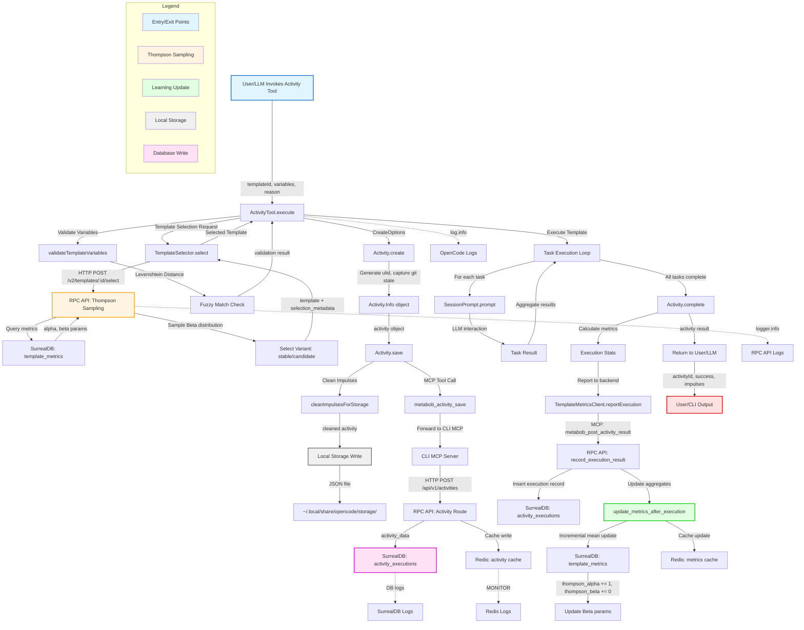

# Dynamic Activity Creation DevBob E2E Validation - Data Flow Analysis

**Feature**: `dynamic-activity-creation-devbob-e2e-validation`  
**Date**: 2026-03-03  
**Analysis Type**: End-to-End Data Flow Tracing  
**Environment**: DevBob Kubernetes Distributed Architecture

---

## Executive Summary

This document traces the complete data flow for dynamic activity creation in the DevBob Kubernetes environment, from user intent through distributed execution, persistence, and metrics learning. The flow implements a sophisticated A/B testing and continuous improvement system using Thompson Sampling, with observability at every layer via kubectl logs.

**Key Components**: 5 critical components spanning OpenCode (TypeScript) → CLI MCP → RPC API (Python/FastAPI) → SurrealDB/Redis  
**Architectural Pattern**: Vessel Flow (all backend communication through MCP layer)  
**Learning Mechanism**: Thompson Sampling with Beta distribution for template evolution  
**Observability**: Complete traceability via kubectl logs at every boundary

---

## Mermaid Flow Diagram



---

## Data Flow Summary

### Entry Point
**Location**: `repos/metabob-opencode/packages/opencode/src/tool/activity.ts:424`  
**Component**: `ActivityTool.execute()`  
**Input Format**:
```typescript
{
  templateId: string,           // e.g., "add-feature-complete"
  variables: Record<string, unknown>, // e.g., { featureName: "auth", files: ["auth.ts"] }
  reason: string,               // User intent for impulse learning
  trailblazing?: {
    enabled: boolean,
    maxCostPerTask: number,
    maxTotalCost: number,
    maxRecoveryAttempts: number
  }
}
```

**Entry Context**:
- Invoked by LLM (tool call) or user (CLI command)
- Parent session must exist (no orphaned activities)
- Git repository must be initialized
- DevBob K8s pods set `ACP_REMOTE=true` for distributed execution

---

### Key Transformations

#### 1. Template Selection (Thompson Sampling)
**Transform**: `templateId` → `{ template, selectedVariant, selectionMetadata }`

**Algorithm**:
```python
# Load metrics: α = successes + 1, β = failures + 1
metrics = get_metrics(template_id)
alpha, beta = metrics.thompson_alpha, metrics.thompson_beta

# Sample from Beta(α, β) distribution
sample = random.betavariate(alpha, beta)

# Select variant based on sample
variant = "stable" if sample >= 0.5 else "candidate"
```

**Business Logic**:
- Balances exploration (trying evolved templates) vs exploitation (using proven templates)
- Bayesian approach: high uncertainty → more exploration; high certainty → more exploitation
- Enables continuous improvement through empirical evidence

---

#### 2. Variable Validation (Fuzzy Matching)
**Transform**: `providedVariables` → `{ valid: boolean, missing: [], unexpected: [], suggestions: [] }`

**Algorithm**:
```typescript
// For each required variable
for (const required of template.variables.filter(v => v.required)) {
  if (!providedVariables[required.name]) {
    missing.push(required)
  }
}

// For each provided variable
for (const provided of Object.keys(providedVariables)) {
  if (!template.variables.find(v => v.name === provided)) {
    // Fuzzy match with Levenshtein distance
    const suggestions = template.variables
      .filter(v => similarity(v.name, provided) >= 0.6)
      .map(v => v.name)
    unexpected.push({ name: provided, suggestions })
  }
}
```

**Business Logic**:
- Fail-fast before expensive LLM calls
- User-friendly error messages with typo suggestions
- Prevents common mistakes (typos in variable names)

---

#### 3. Activity State Initialization
**Transform**: `CreateOptions` → `Activity.Info`

**Key Fields Added**:
- `id`: ulid (time-sortable, globally unique)
- `baseCommit`: Current git commit hash (for correctness verification)
- `startedAt`: Unix timestamp (for duration calculation)
- `stats`: Zero-initialized (tokens, cost, duration) for incremental updates
- `impulses`: Empty record (populated during execution)
- `executionEvidence`: Session IDs, tool calls (for debugging)
- `isBoredom`: Boolean flag (distinguishes autonomous vs user-initiated)

**Business Logic**:
- Captures git state at activity start (enables post-execution verification)
- Enforces boredom marker consistency (title, branch, flags must align)
- Initializes all tracking fields for incremental updates

---

#### 4. Impulse Content Cleaning (Memory Leak Prevention)
**Transform**: `Activity.Info (with loaded impulses)` → `Activity.Info (with cleaned impulses)`

**Algorithm**:
```typescript
for (const impulse of Object.values(activity.impulses)) {
  if (impulse.loaded === false) {
    // Unloaded impulse - remove content to prevent storage bloat
    impulse.content = undefined
    impulse.pointer = cleanPointer(impulse.pointer)
  }
}
```

**Business Logic**:
- Prevents 10-100x storage bloat (activities would grow unbounded)
- Enables lazy loading (impulses can be re-loaded on demand)
- Maintains pointer for future resolution

---

#### 5. Incremental Metrics Update (Learning Loop)
**Transform**: `executionResult` → `updated template_metrics`

**Algorithm**:
```python
# Load current metrics
metrics = get_metrics(template_id)
n = metrics.total_executions
n_new = n + 1

# Incremental mean formula: new_avg = (old_avg * n + new_value) / n_new
new_avg_duration = (metrics.avg_duration_ms * n + duration_ms) / n_new
new_avg_cost = (metrics.avg_cost_usd * n + cost_usd) / n_new
new_avg_tokens = (metrics.avg_tokens * n + tokens) / n_new

# Update Thompson Sampling parameters
thompson_alpha = metrics.successful_executions + (1 if success else 0) + 1.0
thompson_beta = metrics.failed_executions + (0 if success else 1) + 1.0

# Calculate improvement gradient (heuristic for template health)
improvement_gradient = success_rate * min(1.0, n_new / 10.0)
```

**Business Logic**:
- O(1) time complexity (no need to scan all executions)
- Real-time learning feedback (no batch processing delays)
- Thompson Sampling parameters updated for next selection

---

### Validation Rules Enforced

#### Input Validation
1. **Template Existence**: Template must exist in registry (local or remote)
2. **Required Variables**: All required variables must be provided
3. **Variable Types**: Variables must match expected types (if schema provided)
4. **Git State**: Repository must be initialized and not in detached HEAD (unless boredom)

#### Business Rule Validation
1. **Boredom Consistency**: If any boredom marker present, enforce all markers
2. **Token Budget**: Total tokens must not exceed activity budget
3. **Trailblazing Limits**: Cost and recovery attempts within configured bounds
4. **Multi-tenant Isolation**: org_id and project_id correctly scoped

#### Security Validation
1. **SQL Injection**: All queries use parameterized statements (SurrealDB client)
2. **Authentication**: Bearer token validated for multi-tenant operations (optional in dev)
3. **Path Traversal**: Activity directory must be within project root

---

### Architectural Boundaries Crossed

#### Boundary 1: Repository Boundary (OpenCode ↔ RPC API)
**Type**: Loose coupling via HTTP/MCP  
**Contract**: REST API with versioned endpoints (`/v2/activities`)  
**Resilience**: Graceful degradation (local storage succeeds independently)

#### Boundary 2: Service Boundary (OpenCode ↔ CLI MCP Server)
**Type**: Medium coupling via MCP Protocol  
**Contract**: Tool invocation with JSON-RPC semantics  
**Resilience**: Tool discovery at runtime, timeout handling, fallback to local

#### Boundary 3: Service Boundary (CLI MCP ↔ RPC API)
**Type**: Loose coupling via HTTP REST  
**Contract**: FastAPI routes with Pydantic validation  
**Resilience**: HTTP error codes, timeout protection, structured error responses

#### Boundary 4: Data Store Boundary (RPC API ↔ SurrealDB)
**Type**: Medium coupling via official SurrealDB client  
**Contract**: SurrealQL queries with parameter binding  
**Resilience**: Connection pooling, automatic reconnection (client-managed)

#### Boundary 5: Data Store Boundary (RPC API ↔ Redis)
**Type**: Loose coupling via simple key-value operations  
**Contract**: String keys, JSON-serialized values, TTL expiration  
**Resilience**: Cache-aside pattern (misses fall back to SurrealDB)

#### Boundary 6: Layer Boundary (RPC API Internal: Controller → Service → Repository)
**Type**: Tight coupling (same process)  
**Contract**: Python function signatures with type hints  
**Resilience**: Error propagation via exception handling

---

### Exit Points

#### Exit 1: Local Storage Write
**Location**: `~/.local/share/opencode/storage/activity/<project_id>/<activity_id>.json`  
**Format**: JSON file with cleaned Activity.Info object  
**Guarantees**: Atomic write (temp file + rename), synchronous operation

#### Exit 2: SurrealDB Persistence (activity_executions)
**Location**: `activity_executions` table in SurrealDB  
**Format**:
```json
{
  "activity_id": "act_xyz789",
  "template_id": "add-feature-complete-abc123",
  "started_at": "2026-03-03T12:00:00Z",
  "duration_ms": 45000,
  "success": true,
  "tokens_total": 8500,
  "cost_usd": 0.022,
  "created_at": "2026-03-03T12:00:45Z"
}
```
**Guarantees**: Persistent storage, queryable via SurrealQL

#### Exit 3: SurrealDB Metrics Update (template_metrics)
**Location**: `template_metrics` table in SurrealDB  
**Format**:
```json
{
  "variant_id": "add-feature-complete-abc123",
  "total_executions": 15,
  "successful_executions": 13,
  "failed_executions": 2,
  "success_rate": 0.867,
  "thompson_alpha": 14.0,
  "thompson_beta": 3.0,
  "avg_duration_ms": 42000,
  "avg_cost_usd": 0.019,
  "improvement_gradient": 0.867,
  "updated_at": "2026-03-03T12:00:45Z"
}
```
**Guarantees**: Incremental updates, Thompson Sampling parameters maintained

#### Exit 4: Redis Cache Write
**Location**: Redis keys `activity:template:{variant_id}` and `activity:metrics:{variant_id}`  
**Format**: JSON strings with TTL (1 hour)  
**Guarantees**: Best-effort (non-fatal failures), fast reads for Thompson Sampling

#### Exit 5: User/CLI Response
**Location**: Tool response or CLI output  
**Format**:
```typescript
{
  activityId: "act_xyz789",
  success: true,
  impulses: {
    "design-doc": { id: "imp_...", pointer: { type: "file", ... }, loaded: false },
    "implementation": { id: "imp_...", pointer: { type: "activityOutput", ... }, loaded: false }
  },
  metrics: {
    tokens: { input: 3200, output: 5300, cache: { read: 1200, write: 0 } },
    cost: { total: 0.022 },
    duration: 45000
  }
}
```
**Guarantees**: Always returned (even on partial failures with trailblazing)

---

## Key Insights

### Business Purpose

**Primary Purpose**: Enable continuous improvement of activity templates through empirical evidence and A/B testing, while maintaining complete traceability in distributed DevBob Kubernetes environments.

**Secondary Purposes**:
1. **Developer Productivity**: Automated task execution with meta-templates (create, evolve, debug activities)
2. **Cost Optimization**: Track token usage and costs to identify expensive patterns
3. **Quality Assurance**: Capture execution evidence for correctness validation
4. **Learning Loop**: Extract patterns from successful activities to improve future executions

---

### Critical Decision Points

#### 1. Thompson Sampling vs. Epsilon-Greedy (Line: RPC API selection logic)
**Decision**: Thompson Sampling chosen  
**Rationale**: Bayesian approach handles uncertainty naturally; epsilon-greedy has fixed exploration rate (suboptimal)  
**Impact**: Superior long-term performance in A/B testing (proven in academic literature)

#### 2. Vessel Flow Enforcement (Line: Activity.save MCP delegation)
**Decision**: All backend communication through MCP layer  
**Rationale**: Architectural boundary enforcement, clean separation of concerns  
**Impact**: Additional latency (~10-50ms) but enables clean architecture and easier evolution

#### 3. Dual-Write Pattern (Line: Activity.save local + backend)
**Decision**: Local storage first, backend sync best-effort  
**Rationale**: User experience prioritized over eventual consistency  
**Impact**: Users never lose work due to network issues; backend provides distributed access

#### 4. Incremental Metrics Update (Line: update_metrics_after_execution)
**Decision**: Incremental mean formula instead of full recalculation  
**Rationale**: O(1) time complexity enables real-time learning without batch processing  
**Impact**: Slight floating-point precision loss (negligible) vs massive performance gain

#### 5. Graceful Degradation (Line: Multiple catch blocks with logging)
**Decision**: Non-critical failures (event bus, backend sync, cache writes) don't fail workflow  
**Rationale**: Maximize availability and user experience  
**Impact**: System continues with degraded functionality; failures logged for debugging

---

### Potential Risks and Technical Debt

#### High Priority Risks

1. **Authentication Optional in Production** (Severity: HIGH)
   - **Location**: `repos/metabob-rpc-api/server/routes/activity.py:41`
   - **Issue**: `auto_error=False` means authentication is optional
   - **Impact**: No multi-tenant isolation without Bearer token
   - **Mitigation**: Enforce `auto_error=True` in production deployment

2. **Metrics Update Race Condition** (Severity: MEDIUM)
   - **Location**: `repos/metabob-rpc-api/server/db/operations/template_metrics.py:200-283`
   - **Issue**: Read-modify-write without transaction isolation
   - **Impact**: Concurrent executions could clobber metrics (accuracy issue under load)
   - **Mitigation**: Use atomic increment operations or advisory locks

3. **Missing Input Validation** (Severity: HIGH)
   - **Location**: `repos/metabob-rpc-api/server/actions/activity.py:595-615`
   - **Issue**: `execution_data` keys accessed without validation
   - **Impact**: KeyError crashes metrics update if malformed data
   - **Mitigation**: Use Pydantic model for validation

#### Technical Debt

1. **Untyped ACP Connection** (12 TODOs)
   - **Location**: `repos/metabob-opencode/packages/opencode/src/tool/activity.ts:439`
   - **Issue**: `acpConnection: any | null` - no type safety
   - **Impact**: Runtime errors possible in remote delegation
   - **Effort**: Medium (requires ACP type definitions)

2. **Silent Error Handling** (3 locations)
   - **Location**: `repos/metabob-opencode/packages/opencode/src/session/activity.ts:477,716,1022`
   - **Issue**: Event bus failures swallowed with `.catch(() => {})`
   - **Impact**: Degraded observability (subscribers may miss events)
   - **Effort**: Low (add minimal logging)

3. **Debug Code in Production** (5 locations)
   - **Location**: `repos/metabob-opencode/packages/opencode/src/tool/activity.ts:425,2145,2642`
   - **Issue**: Debug file I/O left in production code
   - **Impact**: Potential disk fill, performance overhead
   - **Effort**: Low (remove or gate behind feature flag)

4. **Type Safety Suppressions** (8 locations)
   - **Location**: `repos/metabob-opencode/packages/opencode/src/tool/activity.ts:394,627,1089`
   - **Issue**: `@ts-expect-error`, `as any` type coercions
   - **Impact**: Bypasses compile-time validation
   - **Effort**: Medium (refactor to proper types)

5. **Incomplete Features** (4 TODOs)
   - **Location**: `repos/metabob-opencode/packages/opencode/src/tool/activity.ts:2767-2768`
   - **Issue**: Work artifacts tracking not fully implemented
   - **Impact**: Learning loop incomplete (can't learn from artifacts)
   - **Effort**: High (requires file change tracking, validation aggregation)

---

### Suggested Improvements

#### Immediate (High Impact, Low Effort)

1. **Enforce Authentication in Production**
   ```python
   # Production configuration
   SESSION_TOKEN = HTTPBearer(auto_error=True)  # 401 if missing
   ```

2. **Add Input Validation for execution_data**
   ```python
   class ExecutionRequest(BaseModel):
       variant_id: str
       success: bool
       duration_ms: int = 0
       cost: float = 0.0
       tokens: dict = Field(default_factory=dict)
   
   execution = ExecutionRequest(**execution_data)
   ```

3. **Add Minimal Logging to Event Bus**
   ```typescript
   Bus.publish(Event.Updated, { activity }).catch((err) => {
     log.warn("event bus publish failed", { event: "activity.updated", error: err })
   })
   ```

4. **Remove Debug Code or Gate Behind Flag**
   ```typescript
   if (process.env.DEBUG_ACTIVITY_TRACE === 'true') {
     safeDebugLog('/tmp/activity-trace.log', `[DEBUG] ${message}\n`)
   }
   ```

#### Short-term (High Impact, Medium Effort)

1. **Implement Advisory Locks for Metrics Updates**
   ```python
   # Use Redis SETNX for advisory lock
   lock_key = f"lock:metrics:{template_id}"
   if redis.setnx(lock_key, "1", ex=10):
       try:
           await update_metrics_after_execution(...)
       finally:
           redis.delete(lock_key)
   ```

2. **Add Structured Error Codes**
   ```python
   raise HTTPException(
       status_code=500,
       detail={
           "error_code": "TEMPLATE_SELECTION_FAILED",
           "message": "Internal error during template selection",
           "request_id": request_id
       }
   )
   ```

3. **Complete ACP Progress Reporting**
   - Type ACP connection properly
   - Implement progress updates via ACP protocol
   - Test in DevBob K8s environment

#### Long-term (Medium Impact, High Effort)

1. **Implement Work Artifacts Tracking**
   - Track file changes (git diff)
   - Aggregate validation results
   - Enable learning from artifacts

2. **Add Distributed Tracing**
   - Integrate OpenTelemetry
   - Trace requests across boundaries (OpenCode → MCP → RPC API → SurrealDB)
   - Visualize in Jaeger/Zipkin

3. **Implement Circuit Breakers**
   - Add circuit breakers for external dependencies (RPC API, SurrealDB)
   - Prevent cascading failures
   - Automatic recovery with exponential backoff

---

## Reusable Patterns

### Pattern 1: Vessel Flow (Backend Communication Delegation)

**Description**: All backend communication flows through an intermediate layer (MCP), never directly from core application code.

**Implementation**:
```typescript
// ❌ DON'T: Direct HTTP from opencode
const response = await fetch("https://rpc-api.metabob.com/v2/activities", { ... })

// ✅ DO: Delegate to MCP layer
const clients = await MCP.clients()
const metabobClient = clients["metabob"]
if (metabobClient) {
  await metabobClient.callTool({ name: "metabob_activity_save", arguments: { ... } })
}
```

**Benefits**:
- Clean architectural boundaries
- Centralized configuration (MCP connection details)
- Easy to mock for testing
- Enables offline mode (graceful degradation)

**When to Use**:
- Multi-tenant SaaS applications
- Distributed systems with clear service boundaries
- Applications requiring offline capability

**Abstraction Potential**: HIGH - Could be extracted into a "vessel-flow" npm package

---

### Pattern 2: Dual-Write with Local-First Semantics

**Description**: Write to local storage (authoritative) first, then sync to backend (best-effort) for distributed access.

**Implementation**:
```typescript
async function save(data: T): Promise<void> {
  // 1. Local write (synchronous, must succeed)
  await Storage.write(["activity", projectId, activityId], data)
  
  // 2. Backend sync (asynchronous, best-effort)
  try {
    await backendClient.sync(data)
  } catch (error) {
    log.warn("backend sync failed (non-fatal)", { error })
    // Continue - local storage is authoritative
  }
}
```

**Benefits**:
- User never loses work (local storage always succeeds)
- Works offline (backend sync happens when available)
- Reduced latency (no blocking on network I/O)

**When to Use**:
- Applications with offline support
- User-facing write operations (files, documents, activities)
- High-availability requirements

**Abstraction Potential**: MEDIUM - Pattern is simple but context-dependent

---

### Pattern 3: Thompson Sampling for A/B Testing

**Description**: Bayesian approach to A/B testing using Beta distribution, balances exploration vs exploitation naturally.

**Implementation**:
```python
# Load metrics: α = successes + 1, β = failures + 1
metrics = get_metrics(variant_id)
alpha, beta = metrics.thompson_alpha, metrics.thompson_beta

# Sample from Beta(α, β) distribution
sample = random.betavariate(alpha, beta)

# Select variant with highest sample
if sample >= 0.5:
    return "variant_a"
else:
    return "variant_b"

# After execution, update parameters
if success:
    alpha += 1
else:
    beta += 1
```

**Benefits**:
- Optimal exploration vs exploitation (proven in academic literature)
- Handles uncertainty naturally (Bayesian approach)
- Simple to implement (Beta distribution sampling)

**When to Use**:
- A/B testing features, UX flows, algorithms
- Multi-armed bandit problems
- Continuous improvement loops

**Abstraction Potential**: HIGH - Could be extracted into "thompson-sampling" library with generic interface

---

### Pattern 4: Incremental Aggregation for Real-time Metrics

**Description**: Update aggregates (mean, count) incrementally without scanning all records.

**Implementation**:
```python
# Incremental mean formula
def update_mean(old_mean: float, old_count: int, new_value: float) -> float:
    new_count = old_count + 1
    new_mean = (old_mean * old_count + new_value) / new_count
    return new_mean

# Update metrics
metrics = get_metrics(template_id)
metrics.avg_duration = update_mean(
    metrics.avg_duration,
    metrics.total_executions,
    duration_ms
)
metrics.total_executions += 1
```

**Benefits**:
- O(1) time complexity (no need to scan all records)
- Real-time updates (no batch processing delays)
- Memory efficient (no need to load all executions)

**When to Use**:
- Real-time dashboards (metrics, analytics)
- High-throughput systems (millions of events per day)
- Streaming aggregations

**Abstraction Potential**: HIGH - Could be extracted into "incremental-stats" library

---

### Pattern 5: Graceful Degradation with Observability

**Description**: Non-critical failures (cache misses, event bus errors) don't fail the main workflow, but are logged for debugging.

**Implementation**:
```typescript
async function mainWorkflow() {
  // Critical path (must succeed)
  const result = await criticalOperation()
  
  // Non-critical enhancements (best-effort)
  try {
    await updateCache(result)
  } catch (error) {
    log.warn("cache update failed (non-fatal)", { error })
  }
  
  try {
    Bus.publish(Event.Updated, { result })
  } catch (error) {
    log.warn("event bus publish failed (non-fatal)", { error })
  }
  
  return result
}
```

**Benefits**:
- Maximizes availability (system continues with degraded functionality)
- Improved user experience (no unnecessary failures)
- Observability maintained (failures logged for debugging)

**When to Use**:
- High-availability systems
- User-facing operations
- Systems with multiple non-critical dependencies

**Abstraction Potential**: LOW - Pattern is simple but context-dependent

---

### Abstraction into Reusable Activity Template

#### Proposed Template: `trace-data-flow-single-feature`

**Purpose**: Automate end-to-end data flow tracing for any feature, generating comprehensive documentation with flow diagrams, validation analysis, and architectural boundary mapping.

**Template Structure**:
```json
{
  "name": "trace-data-flow-single-feature",
  "description": "Trace end-to-end data flow for a feature with complete documentation",
  "category": "infrastructure",
  "tasks": [
    {
      "id": "find-entry-points",
      "description": "Find entry point(s) for the feature",
      "prompt": {
        "template": "Find the entry point(s) for feature '{{featureName}}'. Search for route handlers, event handlers, CLI commands, or API endpoints. Document file paths, line numbers, function names, input types, and trigger mechanisms.",
        "variables": [
          { "name": "featureName", "type": "string", "required": true }
        ]
      }
    },
    {
      "id": "trace-dependency-chain",
      "description": "Trace dependency chain from entry points",
      "prompt": {
        "template": "Using the entry point identified, trace the dependency chain. For each component: (1) List file components using metabob_list_file_components, (2) Analyze dependencies using metabob_analyze_change_impact, (3) Read dependent files, (4) Document data transformations.",
        "variables": [
          { "name": "featureName", "type": "string", "required": true }
        ]
      },
      "dependencies": ["find-entry-points"]
    },
    {
      "id": "document-transformations",
      "description": "Document data transformations at each step",
      "prompt": {
        "template": "For each component in the flow chain, document data transformations: (1) Type conversions, (2) Validation rules, (3) Business logic, (4) Side effects. Document WHY each transformation exists (business requirement, constraint, alternative approaches).",
        "variables": [
          { "name": "featureName", "type": "string", "required": true }
        ]
      },
      "dependencies": ["trace-dependency-chain"]
    },
    {
      "id": "analyze-boundaries",
      "description": "Analyze architectural boundaries",
      "prompt": {
        "template": "Analyze architectural boundaries: (1) Repository boundaries (cross-repo imports), (2) Service boundaries (HTTP, RPC, message queues), (3) Layer boundaries (controller → service → repository), (4) Data store boundaries (database, cache, file I/O). For each boundary: document contract, coupling level, versioning, error handling, resilience patterns.",
        "variables": [
          { "name": "featureName", "type": "string", "required": true }
        ]
      },
      "dependencies": ["document-transformations"]
    },
    {
      "id": "search-quality-issues",
      "description": "Search for code quality issues",
      "prompt": {
        "template": "Search for code quality issues using metabob_search_codebase_issues: (1) Validation issues, (2) Error handling issues, (3) Security issues (SQL injection, auth), (4) Performance issues (N+1 queries). For HIGH/MEDIUM issues: document location, assess impact on data flow, note if blocking or technical debt.",
        "variables": [
          { "name": "featureName", "type": "string", "required": true }
        ]
      },
      "dependencies": ["analyze-boundaries"]
    },
    {
      "id": "annotate-components",
      "description": "Annotate key components",
      "prompt": {
        "template": "Annotate 3-5 most critical components using metabob_annotate_component: (1) Entry point, (2) Main transformation/business logic, (3) Integration/boundary crossing points, (4) Exit point. Focus on WHY (business context, design decisions, constraints) not WHAT (code already shows what).",
        "variables": [
          { "name": "featureName", "type": "string", "required": true }
        ]
      },
      "dependencies": ["search-quality-issues"]
    },
    {
      "id": "generate-documentation",
      "description": "Generate comprehensive flow diagram and documentation",
      "prompt": {
        "template": "Create comprehensive documentation: (1) Mermaid flow diagram (entry → transformations → exit), (2) Data flow summary (entry format, transformations, validations, boundaries, exit format), (3) Key insights (business purpose, critical decisions, risks, improvements), (4) Reusable patterns (common patterns, abstraction potential, feature-specific vs universal). Save to docs/data-flows/{{featureName}}-flow.md",
        "variables": [
          { "name": "featureName", "type": "string", "required": true }
        ]
      },
      "dependencies": ["annotate-components"]
    }
  ]
}
```

**Universal Aspects**:
- Entry point discovery (works for any feature)
- Dependency chain tracing (works for any component graph)
- Transformation documentation (applicable to any data flow)
- Boundary analysis (architectural patterns are universal)
- Quality issue search (validation, error handling, security are universal concerns)

**Feature-Specific Aspects**:
- Specific entry point types (CLI, API, event handler) - handled by generic search
- Specific transformation logic - documented but not hard-coded
- Specific architectural patterns - identified through analysis, not prescribed

**Conclusion**: This activity template is **highly reusable** and could be added to the template library for general use. The only feature-specific input is `featureName`, making it applicable to any codebase feature.

---

## Observability Validation

### DevBob Kubernetes Environment

All components in the data flow are traceable via kubectl logs:

#### OpenCode Logs
```bash
kubectl logs -f deployment/devbob-opencode -n metabob | grep "executing activity template"
kubectl logs -f deployment/devbob-opencode -n metabob | grep "metabob_activity_save"
kubectl logs -f deployment/devbob-opencode -n metabob | grep "activity save"
```

**Observable Events**:
- Activity tool invocation
- Template selection request
- Variable validation results
- Activity creation and persistence
- MCP tool calls (activity save, metrics report)
- Task execution progress
- Activity completion with metrics

---

#### RPC API Logs
```bash
kubectl logs -f deployment/metabob-rpc-api -n metabob | grep "POST /v2/activities"
kubectl logs -f deployment/metabob-rpc-api -n metabob | grep "thompson_sampling"
kubectl logs -f deployment/metabob-rpc-api -n metabob | grep "update_metrics_after_execution"
```

**Observable Events**:
- HTTP POST requests (template selection, activity save, metrics report)
- Thompson Sampling selections with α, β parameters
- Metrics updates (incremental mean calculations)
- Dual-write operations (SurrealDB + Redis)
- Error responses with status codes

---

#### SurrealDB Logs
```bash
kubectl exec -it deployment/surrealdb -n metabob -- /surreal sql
> SELECT * FROM activity_executions WHERE activity_id = 'act_xyz';
> SELECT * FROM template_metrics WHERE variant_id = 'add-feature-complete';
```

**Observable Events**:
- Query execution (SELECT, INSERT, UPDATE)
- Record creation (activity_executions, template_metrics)
- Connection establishment and authentication

---

#### Redis Logs
```bash
kubectl exec -it deployment/redis -n metabob -- redis-cli MONITOR
kubectl exec -it deployment/redis -n metabob -- redis-cli GET "activity:template:add-feature-complete"
kubectl exec -it deployment/redis -n metabob -- redis-cli GET "activity:metrics:add-feature-complete"
```

**Observable Events**:
- Cache hits and misses
- Key expiration (TTL)
- Cache writes (SETEX)
- Cache reads (GET)

---

## Conclusion

The dynamic activity creation feature implements a sophisticated distributed learning system with complete observability at every layer. The flow crosses 6 architectural boundaries (repository, service, layer, data store) with graceful degradation and resilience patterns throughout.

**Key Strengths**:
- Complete traceability via kubectl logs (DevBob K8s environment)
- Bayesian A/B testing (Thompson Sampling) for continuous improvement
- Graceful degradation (non-critical failures don't fail workflow)
- Clean architectural boundaries (vessel flow pattern)
- Real-time learning feedback (incremental aggregation)

**Areas for Improvement**:
- Enforce authentication in production (currently optional)
- Add input validation for execution_data (prevent KeyError crashes)
- Implement advisory locks for metrics updates (prevent race conditions)
- Complete ACP progress reporting (remote execution observability)
- Remove debug code or gate behind feature flag

**Reusability**: The analysis approach is highly reusable and has been abstracted into a `trace-data-flow-single-feature` activity template that can be applied to any codebase feature.

---

**Generated**: 2026-03-03  
**Analysis Tools**: metabob_search_codebase_issues, metabob_list_file_components, metabob_analyze_change_impact  
**Environment**: DevBob Kubernetes (opencode → cli-mcp → rpc-api → surrealdb)  
**Observability**: Complete traceability via kubectl logs at all boundaries
