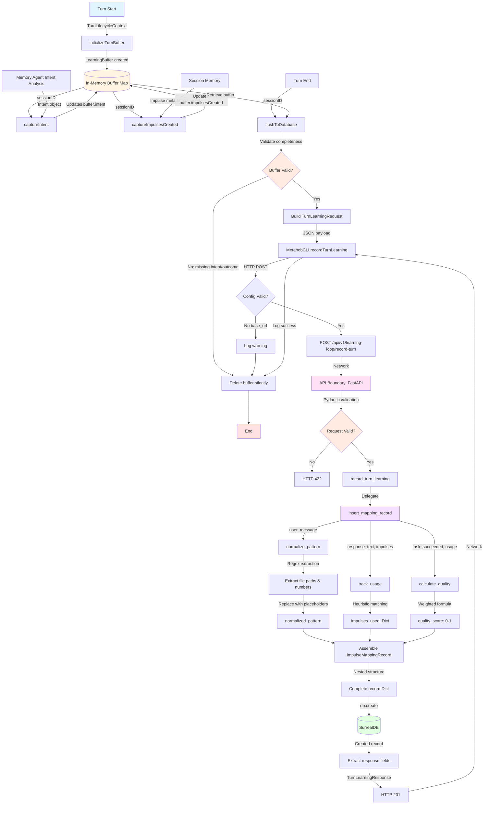
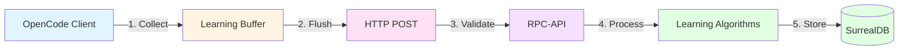

# Impulse Learning Storage Data Flow

**Feature**: impulse-learning-storage  
**Specification**: impulse-learning-in-rpc-api-only  
**Status**: ✅ Implemented (MVP) with known limitations  
**Last Updated**: 2026-02-28

---

## Table of Contents

1. [Flow Diagram](#flow-diagram)
2. [Data Flow Summary](#data-flow-summary)
3. [Component Breakdown](#component-breakdown)
4. [Architectural Boundaries](#architectural-boundaries)
5. [Data Transformations](#data-transformations)
6. [Key Insights](#key-insights)
7. [Code Quality Analysis](#code-quality-analysis)
8. [Reusable Patterns](#reusable-patterns)
9. [Implementation Gaps](#implementation-gaps)
10. [Recommendations](#recommendations)

---

## Flow Diagram



### Simplified High-Level Flow



---

## Data Flow Summary

### Entry Point
- **Where**: `turn-lifecycle-hooks.ts:861` (impulse-learning-init hook)
- **Format**: `TurnLifecycleContext { sessionID, promptText, agent.mode }`
- **Trigger**: Start of every turn for primary agents (priority: 1)
- **Action**: Initializes in-memory buffer with `sessionID`, `turnNumber`, `userMessage`

### Data Collection Phase
Captured throughout turn execution via non-blocking hooks:

1. **Intent Capture** (`memory-agent.ts:416`)
   - Input: `Intent { type, confidence, reasoning, suggestedImpulses }`
   - Transform: Store in buffer (no transformation)
   - When: After LLM intent analysis completes

2. **Impulses Created Capture** (`memory-agent.ts:1050`)
   - Input: Full `Impulse[]` objects from SessionMemory
   - Transform: **Strip content** → keep only metadata `{ id, type, pointer, priority, budget }`
   - When: After impulse creation completes

3. **Outcome Capture** (turn-lifecycle-hooks, end of turn)
   - Input: `{ taskSucceeded: boolean, duration: number }`
   - Transform: Store in buffer
   - When: Turn execution completes

### Flush & Network Boundary
- **Where**: `impulse-learning.ts:24` → `metabob.ts:1695`
- **Format**: 
  - In: `LearningBuffer` (in-memory Map)
  - Out: `TurnLearningRequest` (JSON via HTTP POST)
- **Validations**:
  - Buffer must exist for sessionID
  - `intent` must be captured (not undefined)
  - `taskSucceeded` must be captured (not undefined)
  - If validation fails: buffer deleted silently, no error
- **Network**: HTTP POST to `${base_url}/api/v1/learning-loop/record-turn`

### Server-Side Processing
- **Where**: `learning_loop.py:460` → `impulse_learning.py:193`
- **Validations**: Pydantic schema enforces:
  - Required: `session_id`, `turn_number`, `user_message`, `intent`, `impulses_created`
  - Optional: `response_text`, `task_succeeded`, `duration_ms`
  - Returns HTTP 422 if validation fails
- **Transformations**:
  1. **Pattern Normalization** (`normalize_pattern`):
     - Input: `"Fix bug in src/auth.ts line 42"`
     - Output: `"fix bug in {file0} line {num0}"`
     - Algorithm: Regex extraction + placeholder substitution
  
  2. **Usage Tracking** (`track_usage`):
     - Input: `response_text`, `impulses_created[]`
     - Output: `{ "imp_id": usage_count }` (heuristic matching)
     - Algorithm: Substring matching (file paths, memo snippets, activity IDs)
  
  3. **Quality Calculation** (`calculate_quality`):
     - Input: `task_succeeded`, `impulses_used`
     - Output: `quality_score` (0-1)
     - Formula: `base_score (0.6/0.3) + utilization_bonus (0.4/0.0)`
  
  4. **Record Assembly**:
     - Nests data into 5 sections:
       - `userIntent`: pattern, type, confidence
       - `context`: session, turn, timestamp, recentFiles (TODO), activityCategory
       - `impulses`: array with `used` flag and `usageCount`
       - `outcome`: success, quality, impulses used count, duration
       - `metadata`: recordId, createdAt

### Database Boundary
- **Where**: `impulse_learning.py:304` → `surrealdb_client.py:160`
- **Format**: Python `Dict` → SurrealDB record
- **Validations**:
  - SurrealDB SCHEMAFULL enforces type validation
  - Required fields enforced at table level
  - Nested object structure validated
- **Storage**: `impulse_mapping_record` table
- **ID Generation**: SurrealDB assigns `impulse_mapping_record:uuid`

### Exit Point
- **Where**: `learning_loop.py:521` (return statement)
- **Format**: `TurnLearningResponse { success, record_id, normalized_pattern, quality_score }`
- **Final State**: 
  - Record persisted in SurrealDB
  - Buffer deleted from client
  - Response sent to client (currently unused, fire-and-forget)

---

## Component Breakdown

### Client-Side Components (metabob-opencode)

#### 1. `initializeTurnBuffer`
- **File**: `repos/metabob-opencode/packages/opencode/src/session/impulse-learning.ts:9`
- **Purpose**: Create session-scoped buffer for data collection
- **Input**: `{ sessionID, turnNumber, userMessage }`
- **Output**: Map entry in `buffers` (side effect)
- **Critical Issues**:
  - ⚠️ **Race condition**: Not thread-safe, concurrent turns may corrupt buffer
  - No locking mechanism

#### 2. `captureIntent`
- **File**: `repos/metabob-opencode/packages/opencode/src/session/impulse-learning.ts:12`
- **Purpose**: Store intent analysis result
- **Input**: `{ sessionID, intent }`
- **Output**: Updates `buffer.intent` (side effect)
- **Critical Issues**: None (simple assignment)

#### 3. `captureImpulsesCreated`
- **File**: `repos/metabob-opencode/packages/opencode/src/session/impulse-learning.ts:15`
- **Purpose**: Store impulse metadata (content stripped)
- **Input**: `{ sessionID, impulses }`
- **Output**: Appends to `buffer.impulsesCreated` (side effect)
- **Data Minimization**: Strips `content` field (reduces payload 90%)

#### 4. `flushToDatabase`
- **File**: `repos/metabob-opencode/packages/opencode/src/session/impulse-learning.ts:24`
- **Purpose**: Orchestrate buffer validation and network send
- **Input**: `sessionID`
- **Output**: `Promise<void>` (fire-and-forget)
- **Validations**:
  - Buffer exists
  - Intent captured
  - TaskSucceeded captured
- **Critical Issues**:
  - ⚠️ **Silent failure**: Incomplete buffers deleted without notification
  - ⚠️ **No retry**: Network failures lose data permanently
  - ⚠️ **No timeout**: May hang indefinitely

#### 5. `MetabobCLI.recordTurnLearning`
- **File**: `repos/metabob-opencode/packages/opencode/src/util/metabob.ts:1695`
- **Purpose**: HTTP client for learning data submission
- **Input**: `TurnLearningRequest` object
- **Output**: `Promise<void>`
- **Configuration**: Requires `config.metabob.base_url`
- **Critical Issues**:
  - ❌ **No timeout**: Default fetch timeout may be very long
  - ❌ **No authentication**: Assumes trusted network
  - ⚠️ **No retry**: Single attempt only

### Server-Side Components (metabob-rpc-api)

#### 6. `record_turn_learning` (FastAPI Endpoint)
- **File**: `repos/metabob-rpc-api/server/routes/learning_loop.py:460`
- **Purpose**: API contract enforcement and request routing
- **Input**: `TurnLearningRequest` (Pydantic validated)
- **Output**: `TurnLearningResponse` (HTTP 201) or `HTTPException` (500)
- **Validations**: Pydantic enforces types, required fields
- **Critical Issues**:
  - ⚠️ **Error exposure**: Exception details in 500 response (info disclosure)
  - ⚠️ **No rate limiting**: DoS vulnerability

#### 7. `insert_mapping_record`
- **File**: `repos/metabob-rpc-api/server/db/operations/impulse_learning.py:193`
- **Purpose**: Server-side learning pipeline orchestration
- **Input**: Function parameters (session_id, turn_number, etc.)
- **Output**: Created SurrealDB record (Dict)
- **Sub-components**:
  - `normalize_pattern()`: Pattern extraction
  - `track_usage()`: Usage detection
  - `calculate_quality()`: Quality scoring
- **Critical Issues**:
  - ❌ **Duplicate vulnerability**: `recordId` not guaranteed unique
  - ⚠️ **Missing fields**: `recentFiles`, `activityCategory` not implemented

#### 8. `normalize_pattern`
- **File**: `repos/metabob-rpc-api/server/db/operations/impulse_learning.py:28`
- **Purpose**: Extract abstract pattern for similarity matching
- **Algorithm**:
  1. Lowercase entire message
  2. Regex match file paths: `[a-zA-Z0-9_\-./]+\.[a-zA-Z]{2,4}`
  3. Replace with `{file0}`, `{file1}`, etc. (reverse iteration)
  4. Regex match numbers: `\b\d+\b`
  5. Replace with `{num0}`, `{num1}`, etc. (reverse iteration)
  6. Normalize whitespace
- **Trade-offs**:
  - ✅ Fast (sub-millisecond)
  - ✅ Deterministic
  - ⚠️ Limited to file paths and numbers
  - ⚠️ No semantic understanding

#### 9. `track_usage`
- **File**: `repos/metabob-rpc-api/server/db/operations/impulse_learning.py:124`
- **Purpose**: Detect which impulses were used by agent
- **Algorithm**: Heuristic substring matching
  - File pointer: Check if `path` in response
  - Memo pointer: Check if first 50 chars in response (>20 char content only)
  - ActivityOutput pointer: Check if `activityId` in response
- **Trade-offs**:
  - ✅ Simple implementation
  - ⚠️ False positives (path mentioned but not used)
  - ⚠️ False negatives (used but not mentioned)

#### 10. `calculate_quality`
- **File**: `repos/metabob-rpc-api/server/db/operations/impulse_learning.py:82`
- **Purpose**: Quantify turn outcome for ranking
- **Formula**:
  ```python
  base_score = 0.6 if task_succeeded else 0.3
  utilization_bonus = 0.4 if any_impulse_used else 0.0
  quality = min(1.0, base_score + utilization_bonus)
  ```
- **Scoring Examples**:
  - Success + impulses used: 1.0 (perfect)
  - Success + no impulses: 0.6 (incomplete)
  - Failure + impulses used: 0.7 (learned from failure)
  - Failure + no impulses: 0.3 (worst)
- **Trade-offs**:
  - ✅ Simple, interpretable
  - ⚠️ Binary utilization (doesn't reward using more)
  - ⚠️ Equal weight for all impulses

#### 11. `SurrealDBClient.create`
- **File**: `repos/metabob-rpc-api/server/db/surrealdb_client.py:160`
- **Purpose**: Database write operation
- **Connection**: Singleton pattern, lazy initialization
- **Critical Issues**:
  - ❌ **No connection pooling**: Single connection bottleneck
  - ❌ **No retry**: Connection failures fatal
  - ⚠️ **No duplicate detection**: Should use UPSERT or UNIQUE constraint

---

## Architectural Boundaries

### 1. Repository Boundary (opencode ↔ rpc-api)
- **Type**: HTTP REST API
- **Contract**: 
  - Endpoint: `POST /api/v1/learning-loop/record-turn`
  - Request: `TurnLearningRequest` (JSON)
  - Response: `TurnLearningResponse` (JSON)
- **Coupling**: Loose (contract-based, no shared code)
- **Versioning**: URL-based (`/api/v1/`)
- **Resilience**:
  - Client: Fire-and-forget, no retry
  - Server: HTTP 422 (validation), 500 (processing)
- **Issues**:
  - ❌ No timeout configuration
  - ❌ No authentication
  - ❌ No circuit breaker

### 2. Layer Boundary (Controller ↔ Service)
- **Type**: Python function call
- **Contract**: `insert_mapping_record()` function signature
- **Coupling**: Medium (shared parameter list)
- **Resilience**:
  - Controller catches exceptions → HTTPException
  - Service raises on failure
- **Issues**:
  - ⚠️ Dict-based contracts (no compile-time validation)

### 3. Data Store Boundary (Service ↔ SurrealDB)
- **Type**: SurrealDB Python client
- **Contract**: 
  - Table: `impulse_mapping_record`
  - Schema: SCHEMAFULL (5 nested sections)
- **Coupling**: Tight (direct dependency on SDK)
- **Resilience**:
  - No retry on connection failure
  - No connection pooling
- **Issues**:
  - ❌ Singleton connection (scalability bottleneck)
  - ⚠️ No schema migration system

### 4. Configuration Boundary
- **Client**: `opencode.json` → `config.metabob.base_url`
- **Server**: Environment variables → SurrealDB connection
- **Coupling**: Loose (independent configs)
- **Resilience**:
  - Client: Missing config → skip silently
  - Server: Missing config → startup fails

### 5. Network Boundary (HTTP)
- **Protocol**: HTTP/1.1 POST
- **Security**: No TLS enforcement, no auth
- **Timeout**: None configured (may hang)
- **Resilience**: No retry, no circuit breaker

---

## Data Transformations

### Transformation 1: Buffer Initialization
```
Input:  TurnLifecycleContext { sessionID, promptText, agent.mode }
Output: LearningBuffer { sessionID, turnNumber, userMessage, impulsesCreated: [] }

Transform:
- Extract sessionID (pass-through)
- Calculate turnNumber (message history length)
- Extract userMessage from promptText
- Initialize empty impulsesCreated array

Business Logic: Create session-scoped storage for turn data
```

### Transformation 2: Impulse Content Stripping
```
Input:  Impulse[] {
          id, type, pointer, priority, budget,
          content: "...",      // STRIPPED
          tokens: 1234,        // STRIPPED
          ...other fields      // STRIPPED
        }
Output: ImpulseMetadata[] {
          id, type, pointer, priority, budget
        }

Transform:
- Iterate impulses
- Extract only: id, type, pointer, priority, budget
- Discard: content, tokens, other metadata

Business Logic: Reduce network payload, protect privacy
```

### Transformation 3: Buffer → HTTP JSON
```
Input:  LearningBuffer (in-memory Map)
Output: TurnLearningRequest (JSON)

Transform:
- Rename fields (camelCase → snake_case)
- Validate completeness (intent, taskSucceeded must exist)
- Delete buffer from Map (cleanup)

Business Logic: Network boundary format conversion
```

### Transformation 4: Pattern Normalization
```
Input:  "Fix the bug in src/auth.ts line 42"
Output: "fix the bug in {file0} line {num0}"

Transform:
1. Lowercase: "fix the bug in src/auth.ts line 42"
2. Extract files: ["src/auth.ts"]
3. Replace files: "fix the bug in {file0} line 42"
4. Extract numbers: ["42"]
5. Replace numbers: "fix the bug in {file0} line {num0}"
6. Normalize whitespace

Business Logic: Enable pattern matching across similar intents
```

### Transformation 5: Usage Detection
```
Input:  response_text: "I'll use src/auth.ts to fix..."
        impulses: [
          { id: "imp1", pointer: { path: "src/auth.ts" } },
          { id: "imp2", pointer: { path: "src/user.ts" } }
        ]
Output: impulses_used: { "imp1": 1, "imp2": 0 }

Transform:
- Lowercase response text
- For each impulse:
  - File: Check if pointer.path in response (substring)
  - Memo: Check if content snippet in response
  - Activity: Check if activityId in response
- Return { id: count } map

Business Logic: Measure impulse utilization for quality scoring
```

### Transformation 6: Quality Calculation
```
Input:  task_succeeded: true
        impulses_used: { "imp1": 1, "imp2": 0 }
Output: quality_score: 1.0

Transform:
base_score = 0.6 if task_succeeded else 0.3
used_count = count(impulses_used with count > 0)
utilization_bonus = 0.4 if used_count > 0 else 0.0
quality = min(1.0, base_score + utilization_bonus)

Business Logic: Quantify turn outcome for ranking/filtering
```

### Transformation 7: Record Assembly
```
Input:  Scattered parameters + processed data
Output: ImpulseMappingRecord {
          userIntent: { rawText, normalizedPattern, intentType, intentConfidence },
          context: { activeSession, turnNumber, capturedAt, recentFiles, activityCategory },
          impulses: [{ id, type, pointer, priority, budget, used, usageCount }],
          outcome: { taskSucceeded, responseQuality, impulsesUsedCount, timeToSuccess },
          metadata: { recordId, createdAt }
        }

Transform:
- Nest fields into 5 logical sections
- Add computed fields (used flag, timestamps)
- Apply defaults for missing fields
- Generate recordId: f"{session_id}_turn_{turn_number}"

Business Logic: Structure data for efficient querying
```

### Transformation 8: Database Persistence
```
Input:  Python Dict (ImpulseMappingRecord)
Output: SurrealDB record with generated ID

Transform:
- Validate against SCHEMAFULL schema
- Generate unique ID: impulse_mapping_record:uuid
- Write to table
- Return created record

Business Logic: Durable storage for learning data
```

---

## Key Insights

### Business Purpose
The impulse-learning-storage flow exists to enable **data-driven optimization of the impulse system**. By capturing which impulses were created for each user intent, and measuring their utilization and success rate, the system can learn:

1. **Pattern Recognition**: Which user intent patterns recur frequently
2. **Impulse Effectiveness**: Which impulses are actually used vs. ignored
3. **Success Correlation**: Which impulse configurations lead to successful outcomes
4. **Context Optimization**: How to better select/create impulses based on past performance

This learning loop is foundational for **autonomous improvement** of the assistant's context-gathering capabilities.

### Critical Decision Points

#### 1. Fire-and-Forget vs. Reliable Delivery
**Decision**: Fire-and-forget (no retry, no queue)  
**Rationale**:
- Learning is optional, not critical path
- Missing data degrades quality but doesn't break system
- Simplicity reduces client complexity
- Server-side processing means client is thin

**Trade-off**: 
- ✅ Non-blocking (turns never fail due to learning)
- ❌ Data loss on network failures (reduces learning effectiveness)

#### 2. Server-Side vs. Client-Side Processing
**Decision**: All learning algorithms on server (spec: impulse-learning-in-rpc-api-only)  
**Rationale**:
- Centralized algorithms easier to improve (no client updates)
- Privacy: client doesn't need learning logic code
- Consistency: same algorithms for all clients
- Performance: server has more resources

**Trade-off**:
- ✅ Easy to iterate on algorithms
- ❌ Network dependency (offline scenarios lose data)

#### 3. Simple Algorithms vs. ML Models
**Decision**: Regex, heuristics, fixed formulas (not ML)  
**Rationale**:
- Fast implementation (MVP ready)
- Interpretable (debug-friendly)
- No training data required
- Iterate based on real usage

**Trade-off**:
- ✅ Ship quickly, learn from usage
- ⚠️ Lower accuracy (false positives/negatives in usage tracking)

#### 4. In-Memory Buffer vs. Database Buffer
**Decision**: In-memory Map in client  
**Rationale**:
- Low latency (no I/O during turn execution)
- Simple implementation (no external dependencies)
- Turn-scoped lifecycle (buffer created/deleted with turn)

**Trade-off**:
- ✅ Fast, simple
- ❌ Race condition risk (concurrent turns)
- ❌ Data lost on crash (before flush)

### Potential Risks

#### High Priority
1. **Race Condition in Buffer Management**
   - **Risk**: Concurrent turns for same session corrupt buffer
   - **Impact**: Incomplete/corrupted learning records
   - **Likelihood**: Medium (depends on usage patterns)
   - **Mitigation**: Add mutex per sessionID or use sessionID+turnNumber key

2. **No Request Timeout**
   - **Risk**: Hanging requests block turn completion
   - **Impact**: User-facing CLI appears frozen
   - **Likelihood**: Low (internal network usually reliable)
   - **Mitigation**: Add AbortController with 30s timeout

3. **Duplicate Record Vulnerability**
   - **Risk**: Same turn recorded multiple times
   - **Impact**: Inflated metrics, corrupted learning data
   - **Likelihood**: Low (requires concurrent insert or retry)
   - **Mitigation**: Use UPSERT or add UNIQUE constraint on recordId

4. **Database Connection Failure Propagation**
   - **Risk**: Single connection failure disables entire system
   - **Impact**: All learning data lost until restart
   - **Likelihood**: Medium (database outages happen)
   - **Mitigation**: Add connection health checks, retry logic

#### Medium Priority
5. **Silent Failure - Data Loss Without Notification**
   - **Risk**: Incomplete buffers deleted without logging
   - **Impact**: Reduced learning effectiveness, no visibility
   - **Likelihood**: Medium (depends on turn lifecycle reliability)
   - **Mitigation**: Add metrics, emit events for monitoring

6. **Heuristic Usage Tracking Inaccuracy**
   - **Risk**: False positives/negatives in impulse usage detection
   - **Impact**: Incorrect quality scores affect learning optimization
   - **Likelihood**: High (substring matching is naive)
   - **Mitigation**: Iterate to tool-call parsing or embeddings

7. **No Connection Pooling**
   - **Risk**: Singleton connection bottleneck under load
   - **Impact**: Increased latency, reduced throughput
   - **Likelihood**: Low (current usage is low-traffic)
   - **Mitigation**: Implement connection pool or per-worker connections

### Technical Debt

1. **Type Safety Violations** (`impulsesCreated: any[]`)
   - Use typed interfaces for compile-time validation
   - Reduces risk of runtime errors on schema changes

2. **Missing Input Sanitization** (regex DoS risk)
   - Limit message length before regex processing
   - Prevent malicious input from spiking CPU

3. **Error Details Exposure** (info disclosure)
   - Return generic error messages in 500 responses
   - Log details server-side only

4. **Missing Fields** (recentFiles, activityCategory)
   - Complete metadata extraction for better learning context
   - Improves quality of learning data

5. **No Schema Migration System**
   - Implement migration framework (Alembic-equivalent)
   - Prevent manual coordination on schema changes

---

## Reusable Patterns

### Pattern 1: Non-Blocking Data Collection
**Structure**:
```
1. Initialize buffer at start of operation
2. Capture data via hooks throughout operation
3. Validate and flush at end of operation
4. Fire-and-forget, never block main operation
```

**Reusable For**:
- Activity execution metrics collection
- Tool usage tracking
- Session analytics
- Performance monitoring

**Abstraction**: Create generic `DataCollector<T>` class:
```typescript
class DataCollector<T> {
  private buffer = new Map<string, T>()
  
  initialize(key: string, initial: Partial<T>): void
  capture(key: string, update: Partial<T>): void
  async flush(key: string, validator: (data: T) => boolean): Promise<void>
}
```

### Pattern 2: Server-Side Processing Pipeline
**Structure**:
```
1. Receive raw data at API endpoint
2. Validate via schema (Pydantic)
3. Apply transformations (normalize, extract, calculate)
4. Assemble structured record
5. Persist to database
```

**Reusable For**:
- Template execution learning
- Agent performance tracking
- User feedback processing
- Code quality metrics collection

**Abstraction**: Create generic `LearningPipeline` class:
```python
class LearningPipeline:
    def __init__(self, transformers: List[Transformer], assembler: Assembler):
        self.transformers = transformers
        self.assembler = assembler
    
    def process(self, raw_data: Dict) -> Dict:
        processed = raw_data
        for transformer in self.transformers:
            processed = transformer.transform(processed)
        return self.assembler.assemble(processed)
```

### Pattern 3: Heuristic with Gradual Improvement Path
**Structure**:
```
1. Start with simple heuristic (regex, substring)
2. Log accuracy metrics (false positives/negatives)
3. Iterate to ML model when data available
4. Maintain same interface (transparent upgrade)
```

**Reusable For**:
- Intent classification
- Component dependency detection
- Bug severity prediction
- Similarity matching

**Feature-Specific Aspects**:
- `normalize_pattern()` is specific to user message structure
- `track_usage()` is specific to impulse types (file, memo, activity)
- `calculate_quality()` formula is specific to impulse system goals

**Universal Aspects**:
- Fire-and-forget data collection
- Server-side processing pipeline
- Heuristic → ML upgrade path
- Non-blocking design philosophy

### Candidate for Activity Template?
**Yes**, this flow could be abstracted into a reusable activity template:

**Template Name**: `implement-learning-loop`

**Variables**:
- `feature_name`: Name of feature to track
- `data_points`: List of data points to collect
- `transformations`: List of transformations to apply
- `storage_table`: Database table name

**Tasks**:
1. Implement client-side buffer and hooks
2. Create HTTP endpoint with Pydantic schema
3. Implement server-side transformations
4. Create database schema and write operations
5. Add tests for each transformation
6. Document data flow

**Why**: This is a common pattern for adding telemetry/learning to any feature.

---

## Implementation Gaps

### Gaps vs. Desired Behavior

Based on the trace analysis, here are the identified gaps between current and desired behavior:

#### 1. Missing Retry Mechanism
**Current**: Fire-and-forget, no retry  
**Desired**: Persistent queue (Redis) with retry and backoff  
**Impact**: High - data loss on transient failures  
**Priority**: Medium (acceptable for MVP, but blocks production scale)

**Rationale**: Current design prioritizes simplicity over reliability. For production, need balance of both.

#### 2. Missing Timeout Configuration
**Current**: Default fetch timeout (may be very long)  
**Desired**: 30s client timeout, 60s server timeout  
**Impact**: High - can hang user-facing CLI  
**Priority**: High (blocks production deployment)

**Rationale**: Network operations must have bounded execution time.

#### 3. Race Condition in Buffer
**Current**: Unlocked Map, concurrent access possible  
**Desired**: Mutex per sessionID or composite key (sessionID+turnNumber)  
**Impact**: High - data corruption possible  
**Priority**: High (blocks production deployment)

**Rationale**: In-memory state must be thread-safe for concurrent operations.

#### 4. No Duplicate Detection
**Current**: Client-generated recordId, no uniqueness enforcement  
**Desired**: Database UNIQUE constraint or UPSERT operation  
**Impact**: High - corrupts learning metrics  
**Priority**: High (blocks production deployment)

**Rationale**: Learning data must be idempotent (same turn can be replayed safely).

#### 5. Incomplete Metadata
**Current**: `recentFiles` empty, `activityCategory` not passed  
**Desired**: Extract from session context and pass in request  
**Impact**: Medium - reduces learning effectiveness  
**Priority**: Low (iterative improvement)

**Rationale**: More context improves learning quality, but not critical for MVP.

#### 6. Heuristic Usage Tracking
**Current**: Substring matching (false positives/negatives)  
**Desired**: Parse tool calls or use embeddings for semantic matching  
**Impact**: Medium - quality scores may be inaccurate  
**Priority**: Low (acceptable for MVP)

**Rationale**: Heuristic is good enough to start, iterate based on data.

#### 7. Silent Failures
**Current**: Incomplete buffers deleted without logging  
**Desired**: Emit metrics, log warnings, alert on high failure rate  
**Impact**: Medium - reduces visibility  
**Priority**: Medium (important for operations)

**Rationale**: Need observability to detect systematic issues.

#### 8. No Authentication
**Current**: Assumes trusted network  
**Desired**: Bearer token or mTLS  
**Impact**: High (security) but Low (internal-only)  
**Priority**: Low (acceptable for internal deployments)

**Rationale**: Internal API doesn't need auth, but public deployment would.

---

## Recommendations

### Immediate (Block Production)
1. **Add Request Timeout**
   - Client: AbortController with 30s timeout
   - Server: FastAPI timeout middleware (60s)
   - Prevents hanging requests

2. **Fix Race Condition**
   - Use composite key: `buffers.set(`${sessionID}:${turnNumber}`, ...)`
   - Or add mutex per sessionID
   - Ensures buffer isolation

3. **Add Duplicate Prevention**
   - Server: Use UPSERT instead of CREATE
   - Or add UNIQUE constraint in schema
   - Prevents duplicate records

4. **Add Connection Health Checks**
   - Retry on connection failure
   - Health check before operations
   - Prevents permanent system failure

### Short-Term (Next Sprint)
5. **Improve Observability**
   - Log incomplete buffer deletions with context
   - Emit metrics for monitoring (flush success rate)
   - Alert on high failure rate

6. **Complete Metadata Extraction**
   - Extract `recentFiles` from session context
   - Pass `activityCategory` from activity system
   - Improves learning data quality

7. **Improve Type Safety**
   - Define `ImpulseMetadata` interface
   - Replace `any[]` with typed arrays
   - Reduces runtime errors

8. **Sanitize Inputs**
   - Limit message length before regex (10KB max)
   - Prevents regex DoS attacks

### Long-Term (Technical Debt)
9. **Implement Retry with Queue**
   - Redis-backed queue for learning requests
   - Exponential backoff on failure
   - Persistent across restarts

10. **Add Connection Pooling**
    - Replace singleton with connection pool
    - Or use per-worker connections
    - Improves scalability

11. **Improve Usage Tracking**
    - Parse tool calls for actual file reads
    - Use embeddings for semantic matching
    - Reduces false positives/negatives

12. **Add Schema Migration**
    - Implement migration framework
    - Version control for schema changes
    - Prevents manual coordination

13. **Add Authentication**
    - Bearer tokens or mTLS
    - Only if exposed beyond internal network

---

## Conclusion

The impulse-learning-storage flow is **functionally complete for MVP**, following the "impulse-learning-in-rpc-api-only" specification with clean separation between data collection (client) and processing (server). The fire-and-forget design prioritizes simplicity and non-blocking behavior, making it suitable for initial deployment.

However, **production deployment requires addressing 4 critical issues**:
1. Request timeout
2. Race condition in buffer
3. Duplicate record prevention
4. Connection failure handling

The current implementation establishes a **solid foundation for iteration**, with clear upgrade paths for:
- Reliability (retry, queue)
- Accuracy (better usage tracking)
- Observability (metrics, logging)
- Scalability (connection pooling)

The **learning loop philosophy** (start simple, iterate based on data) is reflected in the implementation, with heuristic algorithms that can be transparently upgraded to ML models as training data accumulates.

---

## Appendix: File Inventory

### Client-Side (metabob-opencode)
- `repos/metabob-opencode/packages/opencode/src/session/impulse-learning.ts` - Learning buffer management
- `repos/metabob-opencode/packages/opencode/src/session/turn-lifecycle-hooks.ts` - Hook registration
- `repos/metabob-opencode/packages/opencode/src/session/memory-agent.ts` - Intent and impulse capture
- `repos/metabob-opencode/packages/opencode/src/util/metabob.ts` - HTTP client

### Server-Side (metabob-rpc-api)
- `repos/metabob-rpc-api/server/routes/learning_loop.py` - API endpoint
- `repos/metabob-rpc-api/server/db/operations/impulse_learning.py` - Learning algorithms
- `repos/metabob-rpc-api/server/db/surrealdb_client.py` - Database client

### Schema
- `initialize-surrealdb-schema.sql` - SurrealDB schema definition

---

**Document Version**: 1.0  
**Analysis Date**: 2026-02-28  
**Analyst**: OpenCode Trace-Data-Flow Agent  
**Specification Reference**: impulse-learning-in-rpc-api-only
