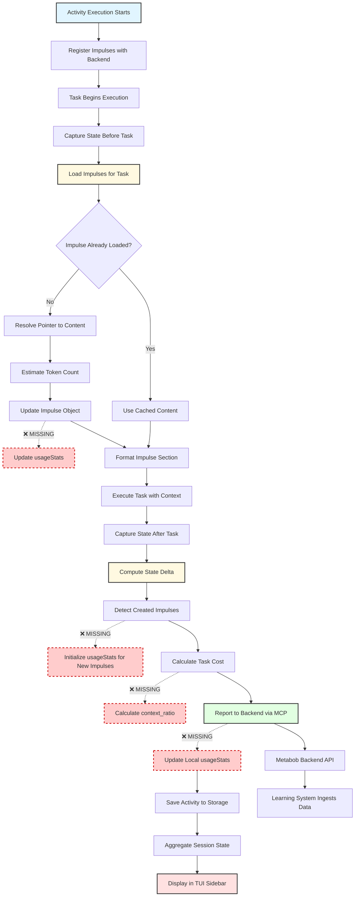

# Impulse Usage Tracking - Data Flow Analysis

**Feature**: `impulse-usage-tracking`  
**Status**: ⚠️ **PARTIALLY IMPLEMENTED** - Backend integration works, local tracking broken  
**Date Analyzed**: 2026-02-23  
**Complexity**: High (spans 5 layers, 2 service boundaries)

---

## Executive Summary

The impulse-usage-tracking feature tracks how impulses (context artifacts) are loaded and created during activity execution. This data feeds a learning system that optimizes template effectiveness.

**Current State**:
- ✅ Backend receives correct data via API
- ❌ Local `usageStats` never updated
- ❌ UI shows zeros for all usage metrics
- ❌ `context_ratio` not calculated or sent

**Impact**: Learning system has data, but users have no visibility into impulse usage patterns.

---

## Flow Diagram



**Legend**:
- 🟦 Blue: Entry points
- 🟨 Yellow: Core business logic
- 🟩 Green: External integrations
- 🟥 Red: Exit points
- 🔴 Red dashed: **Missing implementations**

---

## Data Flow Summary

### **Entry: Activity Execution Start**

**Location**: `src/tool/activity.ts:758-775`

**Input Format**:
```typescript
{
  activityId: string
  templateId: string
  variables: Record<string, unknown>
  impulses: Record<string, Impulse>
}

interface Impulse {
  id: string
  type: string
  pointer: Pointer
  budget: number
  loaded: false
  usageStats?: UsageStats  // ❌ Initially undefined
}
```

**Initial Registration**:
- Sends impulse metadata to backend (startup event)
- Establishes execution ID for tracking
- Backend stores initial impulse list for pattern detection

---

### **Transformation 1: Impulse Loading**

**Location**: `src/session/task-execution-shared.ts:70-129`

**Input**: `string[]` (impulse IDs)  
**Output**: `string` (formatted markdown section)

**Process**:
1. **Parallel Load** (Promise.all):
   - For each impulse ID, resolve pointer to content
   - Estimate token count using tiktoken
   - Set `loaded: true`

2. **In-Place Update**:
   - Mutate `activityImpulses` dict with loaded content
   - ❌ **MISSING**: `usageStats.loadCount++`
   - ❌ **MISSING**: `usageStats.totalTokens += tokenCount`

3. **Format for Prompt**:
   - Build markdown section with headers
   - Include source info (file path, commit hash, etc.)
   - Append to task prompt

**Data Transformation**:
```typescript
// Before:
impulse = { id, pointer, loaded: false, content: undefined }

// After (current):
impulse = { id, pointer, loaded: true, content: "...", tokenCount: 1523 }

// After (expected):
impulse = {
  id, pointer, loaded: true, content: "...", tokenCount: 1523,
  usageStats: {
    loadCount: 1,           // ❌ Not set (stays 0)
    totalTokens: 1523,      // ❌ Not set (stays 0)
    firstAccessedAt: Date.now(),  // ❌ Not set
    lastAccessedAt: Date.now()    // ❌ Not set
  }
}
```

---

### **Transformation 2: Pointer Resolution**

**Location**: `src/session/impulse-resolver.ts:~850-970`

**Input**: `Impulse { pointer: Pointer }`  
**Output**: `Impulse { content: string, tokenCount: number }`

**Pointer Types Supported**:
| Type | Resolution Method | Example |
|------|------------------|---------|
| `memo` | Inline content | `{ type: "memo", content: "..." }` |
| `file` | fs.readFile | `{ type: "file", path: "design.md" }` |
| `component` | ripgrep extraction | `{ type: "component", filePath: "...", componentName: "..." }` |
| `commit` | git diff | `{ type: "commit", hash: "abc123" }` |
| `metabobIssue` | MCP call | `{ type: "metabobIssue", issueId: "..." }` |
| `activityOutput` | Storage read | `{ type: "activityOutput", activityId: "..." }` |
| `bashOutput` | Execute command | `{ type: "bashOutput", command: "..." }` |
| `custom` | Extensibility | `{ type: "custom", resolver: "...", data: {...} }` |

**Validation Rules**:
- Short-circuit if `impulse.loaded === true`
- Throw error if pointer resolution fails (file not found, API error, etc.)
- Token estimation uses tiktoken (accurate for Claude models)

**Design Decision**: Immutable return (doesn't mutate input) for functional purity

---

### **Transformation 3: State Delta Computation**

**Location**: `src/session/activity-state-capture.ts:186-213`

**Input**: `CurrentState (before)` × `CurrentState (after)`  
**Output**: `StateDelta { impulses_created: string[], files_added: string[], ... }`

**Algorithm**:
```typescript
// Set difference for O(n) performance
const beforeImpulses = new Set(before.impulse_ids)
const impulsesCreated = after.impulse_ids.filter(
  (id) => !beforeImpulses.has(id)
)
```

**Captures**:
- Newly created impulses (artifacts produced by task)
- Files added/modified/deleted
- Git diff (if snapshots enabled)
- Line changes (additions/deletions)

**Validation Rules**:
- Returns empty delta on error (non-blocking)
- Assumes impulse IDs are unique (no collision handling)
- ❌ **MISSING**: Initialize `usageStats` for created impulses

---

### **Transformation 4: Backend Reporting**

**Location**: `src/util/metabob.ts:907-969`

**Input**: Task execution metrics + impulse lists  
**Output**: Boolean (success status)

**Side Effect**: HTTP POST to `/api/executions/:id/steps` via MCP

**Payload Structure**:
```typescript
{
  execution_id: string
  step_order: number
  success: boolean
  duration_ms: number
  cost: number
  tokens: number,              // ❌ Should be { input, output, cache }
  impulses_loaded: string[]    // ✅ Correct
  impulses_created: string[]   // ✅ Correct
  // ❌ MISSING: context_ratio
}
```

**Validation Rules**:
- Non-blocking: failures logged but don't halt execution
- Timeout: 30s (via MCP layer)
- No retry: transient failures cause data loss

**Design Decision**: Resilience over consistency (activity continues even if backend is down)

---

### **Architectural Boundaries Crossed**

#### **Boundary 1: Tool Layer → Domain Layer**
- **Location**: `activity.ts` → `activity-template.ts`, `activity-state-capture.ts`
- **Contract**: TypeScript interfaces (Activity, Impulse, StateDelta)
- **Coupling**: Medium (shared types, no side effects)

#### **Boundary 2: Domain Layer → Service Layer**
- **Location**: `activity.ts` → `metabob.ts` (MetabobCLI)
- **Contract**: MCP protocol (JSON-RPC over HTTP/SSE)
- **Coupling**: Loose (protocol abstraction, client discovery)
- **Resilience**: ✅ Non-blocking failures, timeouts

#### **Boundary 3: Service Layer → External Backend**
- **Location**: `metabob.ts` → Metabob Backend API
- **Contract**: ExecutionStepRequest schema (unversioned)
- **Coupling**: Loose (HTTP API, no shared code)
- **Resilience**: ⚠️ No retry, no versioning

#### **Boundary 4: Domain Layer → Storage Layer**
- **Location**: `activity.ts` → `storage.ts`
- **Contract**: Key-value store (Activity.Info JSON)
- **Coupling**: Medium (schema coupling, file-based)
- **Resilience**: ✅ Lock-based concurrency, atomic writes

---

### **Exit: Session State Aggregation**

**Location**: `src/session/session-state.ts:726-775`

**Input**: `sessionID: string`  
**Output**: `RelationshipState { impulseUsage: ImpulseUsageStats[], ... }`

**Aggregation Logic**:
```typescript
// Iterate all activities in session
for (const activity of activities) {
  for (const [impulseId, impulse] of Object.entries(activity.impulses)) {
    // ❌ READS usageStats that was NEVER WRITTEN
    const stats = impulse.usageStats ?? {
      loadCount: 0,      // ❌ Always 0
      totalCost: 0,      // ❌ Always 0
      totalTokens: 0     // ❌ Always 0
    }
    
    // Aggregate across activities
    impulseUsageMap.get(impulseId).loadCount += stats.loadCount
    impulseUsageMap.get(impulseId).totalCost += stats.totalCost
    impulseUsageMap.get(impulseId).totalTokens += stats.totalTokens
  }
}

// Filter out never-used impulses
return Array.from(impulseUsageMap.values()).filter(
  (stats) => stats.loadCount > 0  // ❌ Filters everything (all are 0)
)
```

**Output Format** (for TUI sidebar):
```typescript
interface ImpulseUsageStats {
  impulseId: string
  impulseType: string
  scope: "session" | "activity"
  loadCount: number          // ❌ Always 0 (missing writes)
  totalCost: number          // ❌ Always 0
  avgCostPerLoad: number     // ❌ Always 0
  totalTokens: number        // ❌ Always 0
  avgTokensPerLoad: number   // ❌ Always 0
  firstAccessedAt?: number
  lastAccessedAt?: number
  activitiesUsing: string[]
  sessionsUsing: string[]
}
```

**Result**: UI shows empty impulse usage (array filtered to empty because `loadCount: 0`)

---

## Key Insights

### **Business Purpose**

The impulse-usage-tracking feature serves three critical business goals:

1. **Learning System Optimization**:
   - Backend learns which impulse combinations lead to task success
   - Template evolution: Successful patterns trigger variant commissioning
   - Effectiveness tracking: Calculate impulse ROI (cost vs. success rate)

2. **Developer Visibility**:
   - TUI sidebar shows which impulses are most used (cost attribution)
   - Identify frequently loaded impulses (candidates for caching)
   - Track impulse reuse across activities

3. **Cost Attribution**:
   - Break down activity costs by impulse
   - Identify expensive context sources
   - Optimize token budgets based on actual usage

### **Critical Decision Points**

#### **Decision 1: Dual-Write vs. Single Source of Truth**
**Current State**: Single write (backend only)  
**Problem**: Local state is stale, UI shows incorrect data  
**Recommended Fix**: Dual-write pattern (update both local and backend)

```typescript
// After impulse load:
impulse.usageStats.loadCount++  // Write to local state
await MetabobCLI.reportExecutionStep({...})  // Write to backend
```

#### **Decision 2: Synchronous vs. Asynchronous Backend Reporting**
**Current Choice**: Asynchronous (non-blocking)  
**Rationale**: Activity execution shouldn't fail if backend is down (resilience)  
**Trade-off**: Data loss on transient failures (no retry queue)

**Recommendation**: Keep async but add retry queue for critical data

#### **Decision 3: In-Place Mutation vs. Immutable Updates**
**Current Choice**: In-place mutation (`activityImpulses[id] = loadedImpulse`)  
**Rationale**: Performance (avoid copying large objects)  
**Trade-off**: Harder to debug, potential race conditions

**Recommendation**: Keep mutation but add defensive copying at boundaries

#### **Decision 4: Parallel Load vs. Sequential Load**
**Current Choice**: Parallel (`Promise.all`)  
**Rationale**: Performance (load multiple impulses simultaneously)  
**Trade-off**: Fail-fast (one failure fails all)

**Recommendation**: Add `Promise.allSettled` with individual error handling

---

### **Potential Risks**

#### **Risk 1: Data Inconsistency (HIGH)**
**Issue**: Backend has correct data, local state doesn't  
**Impact**: Users see incorrect usage metrics, learning system can't provide local recommendations  
**Probability**: 100% (currently happening)  
**Mitigation**: Implement dual-write pattern (3 locations)

#### **Risk 2: Type Safety Violation (HIGH)**
**Issue**: `tokens` sent as `number` but backend expects `{ input, output, cache }`  
**Impact**: Backend can't distinguish prompt vs. generation costs  
**Probability**: 100% (currently happening)  
**Mitigation**: Fix type signature and update payload structure

#### **Risk 3: Missing context_ratio (MEDIUM)**
**Issue**: Learning system can't measure impulse effectiveness  
**Impact**: Template evolution can't optimize context usage  
**Probability**: 100% (feature not implemented)  
**Mitigation**: Calculate `impulse_tokens / total_input_tokens` and send to backend

#### **Risk 4: No Retry on Backend Failures (MEDIUM)**
**Issue**: Transient failures cause permanent data loss  
**Impact**: Learning system has incomplete data set  
**Probability**: ~5% (depends on backend uptime)  
**Mitigation**: Implement offline queue with retry logic

**Recent Mitigation** (2026-02-28, via metrics-tui-accuracy enforcement):
- SessionState.get() now uses `Promise.allSettled` for error isolation
- Impulse usage stats now shown in TUI even if other sources fail (Metabob API, MCP, Boredom)
- Individual source failures log warnings but don't crash entire sidebar
- **Impact**: Users retain visibility into impulse metrics during transient failures

#### **Risk 5: Race Condition in State Capture (LOW)**
**Issue**: Impulses created outside task execution may be missed  
**Impact**: `impulsesCreated` array is incomplete  
**Probability**: <1% (only if sub-agents create impulses concurrently)  
**Mitigation**: Use activity-wide lock during state capture

#### **Risk 6: Security Hole in bashOutput Pointer (LOW)**
**Issue**: Allows arbitrary code execution  
**Impact**: Malicious templates could execute dangerous commands  
**Probability**: <0.1% (requires malicious template author)  
**Mitigation**: Add command whitelist or sandboxing

---

### **Technical Debt**

1. **No API Versioning**: Breaking backend changes will break OpenCode silently
2. **No Caching**: Same impulse loaded multiple times (I/O waste)
3. **No Size Limits**: Large files can exhaust memory
4. **Weak Error Handling**: Impulse load failures are all-or-nothing
5. **No Progress Tracking**: Long-running loads have no visibility

---

## Suggested Improvements

### **Priority 1: Fix Broken Data Pipeline (CRITICAL)**

**Locations to Fix**:

1. **`task-execution-shared.ts:89`** - After impulse load:
```typescript
const loadedImpulse = await ImpulseResolver.load(impulse)

// ✅ ADD: Update usage stats
loadedImpulse.usageStats ??= {
  loadCount: 0,
  totalCost: 0,
  totalTokens: 0
}
loadedImpulse.usageStats.loadCount++
loadedImpulse.usageStats.totalTokens += loadedImpulse.tokenCount || 0
loadedImpulse.usageStats.firstAccessedAt ??= Date.now()
loadedImpulse.usageStats.lastAccessedAt = Date.now()

activityImpulses[impulseIds[i]] = loadedImpulse
```

2. **`activity.ts:2559`** - After delta computation:
```typescript
const impulsesCreated = delta.impulses_created

// ✅ ADD: Initialize usageStats for new impulses
for (const impulseId of impulsesCreated) {
  const impulse = _activity.impulses[impulseId]
  if (impulse) {
    impulse.usageStats = {
      loadCount: 0,
      totalCost: 0,
      totalTokens: 0,
      firstAccessedAt: Date.now(),
      lastAccessedAt: Date.now()
    }
  }
}
```

3. **`activity.ts:2577`** - After backend report:
```typescript
await MetabobCLI.reportExecutionStep({...})

// ✅ ADD: Update local usageStats with task cost
const costPerImpulse = cost / (task.impulseReferences?.length || 1)
for (const impulseId of task.impulseReferences || []) {
  const impulse = _activity.impulses[impulseId]
  if (impulse?.usageStats) {
    impulse.usageStats.totalCost += costPerImpulse
  }
}

await Activity.save(_activity)
```

### **Priority 2: Add context_ratio (HIGH)**

**Location**: `activity.ts:2567`

```typescript
// ✅ ADD: Calculate context_ratio
const impulseTokens = (task.impulseReferences || [])
  .map(id => _activity.impulses[id]?.tokenCount || 0)
  .reduce((sum, t) => sum + t, 0)

const contextRatio = tokens.input > 0 
  ? impulseTokens / tokens.input 
  : 0

await MetabobCLI.reportExecutionStep({
  ...
  contextRatio  // ✅ ADD: Send to backend
})
```

**Also update**: `metabob.ts:907` - Add `contextRatio?: number` to interface

### **Priority 3: Fix Token Structure (HIGH)**

**Location**: `metabob.ts:914`

```typescript
// ❌ BEFORE:
tokens: number

// ✅ AFTER:
tokens: {
  input: number
  output: number
  cache: number
}
```

**Also update**: `activity.ts:2574`
```typescript
// ❌ BEFORE:
tokens: tokens.input + tokens.output

// ✅ AFTER:
tokens: {
  input: tokens.input,
  output: tokens.output,
  cache: tokens.cache || 0
}
```

### **Priority 4: Add Null Safety (MEDIUM)**

**Location**: `session-state.ts:746`

```typescript
// ❌ BEFORE:
if (stats.firstAccessedAt && stats.firstAccessedAt < existing.firstAccessedAt) {
  existing.firstAccessedAt = stats.firstAccessedAt
}

// ✅ AFTER:
if (stats.firstAccessedAt && 
    (existing.firstAccessedAt === undefined || 
     stats.firstAccessedAt < existing.firstAccessedAt)) {
  existing.firstAccessedAt = stats.firstAccessedAt
}
```

### **Priority 5: Add Retry Queue (MEDIUM)**

**Location**: `metabob.ts:960` - Catch block

```typescript
catch (error) {
  log.error("reportExecutionStep error", {...})
  
  // ✅ ADD: Queue for retry
  await OfflineQueue.enqueue("execution_step", stepData)
  
  return false
}
```

**Implementation**: Create `OfflineQueue` service that:
- Stores failed requests to disk
- Retries on next successful backend connection
- Expires after 7 days

---

## Reusable Patterns

### **Pattern 1: Lazy Loading with Usage Tracking**

**Abstraction**:
```typescript
interface LazyLoadable<T> {
  id: string
  loaded: boolean
  content?: T
  usageStats: {
    loadCount: number
    totalCost: number
    firstAccessedAt?: number
    lastAccessedAt?: number
  }
}

class LazyLoader<T> {
  async load(item: LazyLoadable<T>): Promise<LazyLoadable<T>> {
    if (item.loaded) return item
    
    const content = await this.resolve(item)
    
    // ✅ Pattern: Update stats after load
    item.loaded = true
    item.content = content
    item.usageStats.loadCount++
    item.usageStats.firstAccessedAt ??= Date.now()
    item.usageStats.lastAccessedAt = Date.now()
    
    return item
  }
}
```

**Applicability**: 
- File loading with caching
- API response caching
- Database query result caching

**Feature-Specific Parts**:
- Pointer resolution logic (impulse-specific)
- Token estimation (LLM-specific)

**Universal Parts**:
- Lazy loading pattern
- Usage stats tracking
- First/last accessed timestamps

---

### **Pattern 2: State Delta with Set Difference**

**Abstraction**:
```typescript
interface StateDelta<T> {
  added: T[]
  removed: T[]
  modified: T[]
}

function computeDelta<T>(
  before: T[],
  after: T[],
  getId: (item: T) => string
): StateDelta<T> {
  const beforeSet = new Set(before.map(getId))
  const afterSet = new Set(after.map(getId))
  
  return {
    added: after.filter(item => !beforeSet.has(getId(item))),
    removed: before.filter(item => !afterSet.has(getId(item))),
    modified: [] // Requires deep comparison
  }
}
```

**Applicability**:
- File change detection (git status simulation)
- Database record change tracking
- Shopping cart diff computation

**Feature-Specific Parts**:
- Impulse ID extraction
- File path extraction
- Git diff integration

**Universal Parts**:
- Set difference algorithm
- Delta computation pattern
- O(n) performance

---

### **Pattern 3: Non-Blocking Backend Reporting**

**Abstraction**:
```typescript
interface BackendReporter<T> {
  async report(data: T): Promise<boolean> {
    try {
      await this.sendToBackend(data)
      return true
    } catch (error) {
      // ✅ Pattern: Log but don't throw
      this.log.error("Backend report failed (non-blocking)", { error })
      return false
    }
  }
}
```

**Applicability**:
- Analytics events
- Telemetry data
- Audit logs
- Usage metrics

**Feature-Specific Parts**:
- ExecutionStepRequest schema
- MCP protocol integration

**Universal Parts**:
- Non-blocking failure pattern
- Fire-and-forget semantics
- Error logging

---

### **Pattern 4: Dual-Write for Consistency**

**Abstraction**:
```typescript
class DualWriter<T> {
  async write(data: T): Promise<void> {
    // ✅ Pattern: Update local first, then backend
    await this.updateLocal(data)
    await this.updateBackend(data).catch(error => {
      // Log but don't fail (eventual consistency)
      this.log.error("Backend write failed", { error })
    })
  }
}
```

**Applicability**:
- Cache + database writes
- Local storage + cloud sync
- Memory + disk persistence

**Feature-Specific Parts**:
- Activity storage format
- MCP protocol

**Universal Parts**:
- Dual-write pattern
- Eventual consistency model
- Local-first architecture

---

## Potential Activity Templates

### **Activity 1: "trace-data-flow"**

**Purpose**: Automated data flow tracing for features

**Tasks**:
1. Find entry points (search for route handlers, tool definitions)
2. Trace dependency chain (follow imports, function calls)
3. Document transformations (input → output at each step)
4. Identify boundaries (service calls, storage writes)
5. Detect gaps (missing validations, error handling)

**Variables**:
- `feature_name`: Name of feature to trace
- `entry_hint`: Optional hint for entry point (e.g., "tool/activity.ts")

**Impulses**:
- `codebase-structure`: Directory tree
- `architecture-docs`: Existing architecture documentation

**Success Criteria**:
- Mermaid diagram generated
- All transformations documented
- Boundaries identified
- Gaps reported

---

### **Activity 2: "fix-data-consistency"**

**Purpose**: Implement dual-write pattern for consistency

**Tasks**:
1. Identify write locations (where backend is updated)
2. Add local state updates (before backend call)
3. Add error handling (non-blocking failures)
4. Add tests (verify both writes succeed)

**Variables**:
- `feature_name`: Feature with consistency issue
- `state_field`: Field that needs updating (e.g., "usageStats")

**Impulses**:
- `flow-diagram`: Data flow diagram from trace-data-flow
- `gap-analysis`: List of missing writes

**Success Criteria**:
- Dual-writes implemented at all locations
- Tests pass
- UI shows correct data

---

## Related Documentation

- [Activity System Architecture](../ACTIVITY_SYSTEM_ARCHITECTURE.md)
- [Impulse System Design](../IMPULSE_SYSTEM_REALITY_CHECK.md)
- [Learning System Integration](../CPG_INTEGRATION_SUMMARY.md)
- [MCP Protocol Guide](../repos/metabob-opencode/packages/opencode/src/mcp/README.md)

---

## Changelog

| Date | Author | Change |
|------|--------|--------|
| 2026-02-23 | AI Agent | Initial data flow analysis |
| 2026-02-23 | AI Agent | Identified 8 code quality issues |
| 2026-02-23 | AI Agent | Documented 4 reusable patterns |
| 2026-02-23 | AI Agent | Proposed 2 activity templates |

---

## Appendix: Component Reference

### **Files Analyzed**:
1. `src/tool/activity.ts` - Activity execution orchestration
2. `src/session/task-execution-shared.ts` - Impulse loading logic
3. `src/session/impulse-resolver.ts` - Pointer resolution
4. `src/session/activity-state-capture.ts` - State delta computation
5. `src/util/metabob.ts` - Backend integration via MCP
6. `src/session/session-state.ts` - State aggregation for UI
7. `src/storage/storage.ts` - Persistence layer
8. `src/mcp/index.ts` - MCP protocol implementation

### **Key Interfaces**:
- `ActivityTemplate.Impulse.Schema` - Impulse data structure
- `ActivityTemplate.Impulse.UsageStats` - Usage tracking fields
- `CurrentState` - Pre/post task state snapshot
- `StateDelta` - Computed changes between states
- `ExecutionStepRequest` - Backend API payload (inferred)

### **External Dependencies**:
- `tiktoken` - Token estimation for Claude models
- `@modelcontextprotocol/sdk` - MCP client library
- `zod` - Runtime type validation
- `bun` - File I/O and process management

---

**End of Document**
