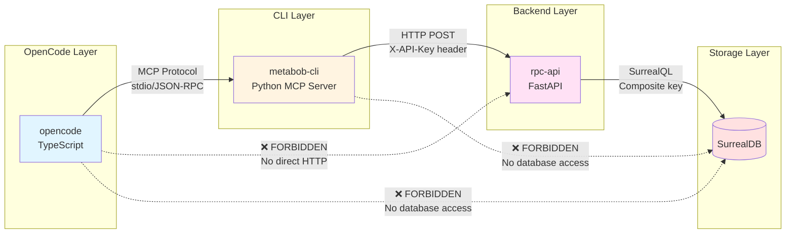
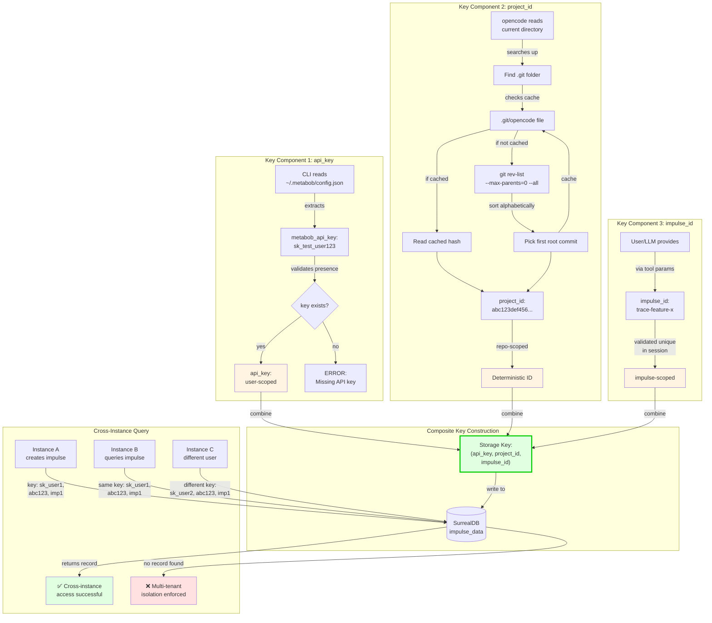

# Data Flow: Instance-Invariant Storage for Impulses and Activities

**Feature**: Cross-instance data accessibility for distributed debugging and activity upgrades  
**Status**: Partially Implemented (Impulse storage complete, Activity storage pending)  
**Last Updated**: 2026-02-27

---

## Executive Summary

Instance-Invariant Storage enables impulses and activities created in one OpenCode instance to be retrievable from another instance with matching credentials (api_key + project_id). This is critical for:

- **Distributed Debugging**: Inspect activities/impulses from any machine
- **Activity Upgrades**: Centralized storage enables template evolution
- **Team Collaboration**: Share impulses across team members' instances

**Key Mechanism**: Composite storage key `(api_key, project_id, impulse_id)` where:
- `api_key`: User-scoped (from CLI config) - multi-tenant isolation
- `project_id`: Git root commit hash - deterministic across clones
- `impulse_id`: User-defined identifier

**Architectural Pattern**: Vessel Flow Routing
- opencode → CLI MCP → RPC API → SurrealDB
- No direct HTTP from opencode to backend
- Authentication injected at CLI layer

---

## Mermaid Flow Diagram

### High-Level Flow

```mermaid
graph TD
    subgraph "OpenCode Instance (TypeScript)"
        A[LLM Tool Call:<br/>impulse_create] -->|params: id, pointer,<br/>budget, priority| B[ImpulseCreateTool.execute]
        B -->|creates| C[Impulse Schema<br/>with session context]
        C -->|writes to| D[SessionMemory<br/>in-memory cache]
        C -->|writes to| E[Activity.impulses<br/>local storage]
        C -->|async best-effort| F[Backend Sync<br/>via MCP]
    end
    
    subgraph "Project ID Generation"
        F -->|requires| G[Instance.project.id]
        G -->|calls| H[Project.fromDirectory]
        H -->|searches| I[.git folder]
        I -->|checks cache| J[.git/opencode file]
        J -->|if not cached| K[git rev-list<br/>--max-parents=0 --all]
        K -->|returns| L[Git Root Commit Hash<br/>abc123def456...]
        L -->|cached to| J
        L -->|stored as| M[project_id:<br/>deterministic, immutable]
    end
    
    subgraph "Vessel Flow: MCP Bridge"
        F -->|MCP Tool Call| N[metabob_impulse_store<br/>CLI MCP Tool]
        N -->|reads config| O[~/.metabob/config.json]
        O -->|extracts| P[metabob_api_key:<br/>sk_test_...]
        O -->|extracts| Q[metabob_url:<br/>https://api.metabob.com]
        N -->|constructs payload| R[{impulse_id, project_id,<br/>impulse_data}]
        M -->|included in| R
    end
    
    subgraph "HTTP Boundary"
        N -->|HTTP POST| S[/v2/impulses endpoint]
        P -->|X-API-Key header| S
        R -->|JSON body| S
        S -->|FastAPI validates| T[ImpulseCreateRequest<br/>Pydantic schema]
        T -->|extracts header| U[x_api_key]
    end
    
    subgraph "Database Layer"
        S -->|checks duplicate| V[get_impulse<br/>SELECT query]
        V -->|if not exists| W[create_impulse<br/>database operation]
        W -->|constructs record| X["composite key:<br/>{api_key, project_id,<br/>impulse_id}"]
        X -->|adds timestamps| Y[created_at, updated_at<br/>ISO format]
        Y -->|writes to| Z[(SurrealDB<br/>impulse_data table)]
    end
    
    subgraph "Cross-Instance Retrieval"
        AA[Instance B<br/>different machine] -->|same git repo| AB[project_id: abc123...]
        AA -->|same user| AC[api_key: sk_test_...]
        AB -->|query| Z
        AC -->|query| Z
        Z -->|WHERE api_key=$api<br/>AND project_id=$proj<br/>AND impulse_id=$id| AD[Returns impulse<br/>created by Instance A]
    end
    
    Z -->|returns record| S
    S -->|HTTP 201| N
    N -->|MCP response| F
    F -->|logs result| AE[Backend Sync Complete]
    
    style A fill:#e1f5ff,stroke:#0066cc,stroke-width:2px
    style Z fill:#ffe1e1,stroke:#cc0000,stroke-width:2px
    style L fill:#fff4e1,stroke:#ff9900,stroke-width:2px
    style P fill:#fff4e1,stroke:#ff9900,stroke-width:2px
    style X fill:#e1ffe1,stroke:#00cc00,stroke-width:2px
    style AD fill:#e1ffe1,stroke:#00cc00,stroke-width:2px
```

### Vessel Flow Architecture



### Storage Key Construction



---

## Data Flow Summary

### Entry Point

**Component**: `ImpulseCreateTool.execute`  
**Location**: repos/metabob-opencode/packages/opencode/src/tool/impulse-create.ts:27

**Input Format**:
```typescript
{
  id: string,                    // e.g., "trace-storage-flow"
  pointer: Impulse.Pointer,      // {type: "file", path: "..."} or {type: "memo", content: "..."}
  budget: number,                // Token budget (e.g., 5000)
  priority: "high" | "medium" | "low",
  type?: string,                 // Optional type classification
  metadata?: Record<string, unknown>
}
```

**Trigger**: LLM tool invocation during session execution

---

### Key Transformations

#### Transformation 1: User Input → Impulse Schema
**Location**: impulse-create.ts:48-63

```typescript
Input:  Tool params
Output: Activity.Impulse.Schema
```

**What Changes**:
- Adds `sessionID` for lifecycle management
- Adds `createdBy` (activity ID) for provenance tracking
- Adds `createdAt` timestamp
- Sets `loaded: false` for lazy loading
- Wraps pointer with session context

**Why**: Enables impulse tracking, debugging, and proper memory management

---

#### Transformation 2: Directory → Project ID (Critical)
**Location**: project.ts:43-92

```typescript
Input:  Directory path (string)
Output: Git root commit hash (string)
```

**What Changes**:
1. Searches up directory tree for `.git`
2. Checks `.git/opencode` cache
3. If not cached: `git rev-list --max-parents=0 --all`
4. Sorts root commits alphabetically
5. Picks first commit hash
6. Caches to `.git/opencode`

**Why**: **THIS IS THE KEY TO INSTANCE-INVARIANCE**
- Git root commit hash is:
  - Immutable (never changes after repo creation)
  - Deterministic (same repo = same hash)
  - Available in all clones
  - Unique per repository lineage

**Fallback**: Returns "global" if not in git repo (⚠️ causes data leakage)

---

#### Transformation 3: Impulse Schema → Backend Sync Payload
**Location**: impulse-create.ts:86-93

```typescript
Input:  Activity.Impulse.Schema
Output: MCP tool call payload
```

**What Changes**:
```typescript
{
  name: "metabob_impulse_store",
  arguments: {
    impulse_id: params.id,
    project_id: Instance.project.id,  // Git root hash
    impulse_data: impulse              // Full impulse object
  }
}
```

**Why**: Prepares data for vessel flow routing (opencode → CLI)

---

#### Transformation 4: MCP Payload → HTTP Request
**Location**: tools.py:5372-5394

```python
Input:  MCP tool arguments
Output: HTTP POST request
```

**What Changes**:
- Reads `metabob_api_key` from CLI config
- Reads `metabob_url` from CLI config
- Constructs HTTP headers: `{"X-API-Key": api_key, "Content-Type": "application/json"}`
- Constructs HTTP body: `{impulse_id, project_id, impulse_data}`
- Sends POST to `/v2/impulses`

**Why**: 
- Injects authentication (api_key) at vessel boundary
- Enforces separation: opencode has no HTTP client
- Enables configuration management at CLI layer

---

#### Transformation 5: HTTP Request → Database Record
**Location**: impulse_data.py:58-79

```python
Input:  HTTP body + header
Output: SurrealDB record
```

**What Changes**:
```python
{
  "impulse_id": impulse_id,
  "api_key": api_key,          # From X-API-Key header
  "project_id": project_id,    # From request body
  "impulse_data": impulse_data,
  "created_at": "2026-02-27T12:34:56Z",
  "updated_at": "2026-02-27T12:34:56Z"
}
```

**Why**: 
- Composite key `(api_key, project_id, impulse_id)` enables:
  - Multi-tenant isolation (different api_keys separated)
  - Cross-instance access (same api_key + project_id = same data)
  - Efficient querying (indexed composite key)

---

### Validations

#### Validation 1: Impulse ID Uniqueness (Session Scope)
**Location**: impulse-create.ts:42-46
```typescript
if (SessionMemory.getImpulse(params.id)) {
  throw new Error(`Impulse with id "${params.id}" already exists in session`)
}
```
**Why**: Prevents duplicate impulse IDs within session

---

#### Validation 2: API Key Presence
**Location**: tools.py:5374-5378
```python
api_key = config.get("metabob_api_key", "")
if not api_key:
    return json.dumps({"status": "error", "error": "Missing metabob_api_key"})
```
**Why**: Prevents unauthenticated requests to backend

⚠️ **Issue #1**: No format validation (whitespace, length, prefix)

---

#### Validation 3: Pydantic Schema Validation
**Location**: impulse.py:35-39
```python
class ImpulseCreateRequest(BaseModel):
    impulse_id: str
    project_id: str
    impulse_data: dict  # ⚠️ No strict schema
```
**Why**: Ensures type safety at HTTP boundary

⚠️ **Issue #6**: `impulse_data` typed as `dict` (no schema validation)

---

#### Validation 4: Duplicate Check (Database)
**Location**: impulse.py:105-111
```python
existing = get_impulse(request.impulse_id, x_api_key, request.project_id)
if existing:
    raise HTTPException(status_code=400, detail="Impulse already exists")
```
**Why**: Prevents overwriting existing impulses

⚠️ **Issue #4**: TOCTOU race condition (check-then-create)

---

### Architectural Boundaries

#### Boundary 1: Repository Boundary (opencode ↔ CLI)
**Type**: MCP Protocol (JSON-RPC over stdio)  
**Coupling**: Loose  
**Contract**:
```typescript
MCP Tool Call:
  name: "metabob_impulse_store"
  arguments: {impulse_id, project_id, impulse_data}

MCP Response:
  content: [{type: "text", text: JSON.stringify({status, impulse_id, created_at})}]
```

**Resilience**:
- Graceful degradation if CLI unavailable
- Best-effort backend sync (local operation succeeds)
- No timeout specified (⚠️ Issue #5)

**Versioning**: No versioning scheme (⚠️ breaking changes risky)

---

#### Boundary 2: Service Boundary (CLI ↔ RPC API)
**Type**: HTTP/REST  
**Coupling**: Medium  
**Contract**:
```
POST /v2/impulses
Headers: X-API-Key
Body: {impulse_id, project_id, impulse_data}
Response: 201 {impulse_id, api_key, project_id, impulse_data, created_at, updated_at}
```

**Resilience**:
- HTTP timeout: 30 seconds
- No retry logic (⚠️ Issue #8)
- Error handling: catches exceptions, returns error JSON

**Versioning**: URL versioning (`/v2/`) allows breaking changes

**Security**:
- API key in header (not URL/body)
- Multi-tenancy enforced by composite key

---

#### Boundary 3: Data Store Boundary (RPC API ↔ SurrealDB)
**Type**: Database Client  
**Coupling**: Loose  
**Contract**:
```python
db.create(table: "impulse_data", data: dict)
db.query(query: str, params: dict)
```

**Resilience**:
- No connection pooling visible
- No retry logic
- Exceptions propagate to route layer

**Performance**:
- ⚠️ **Issue #12**: No index on `(api_key, project_id, impulse_id)` → O(n) queries

---

### Exit Point

**Component**: `create_impulse`  
**Location**: repos/metabob-rpc-api/server/db/operations/impulse_data.py:23

**Output Format**:
```python
{
  "id": "impulse_data:xyz789",      # SurrealDB record ID
  "impulse_id": "trace-storage-flow",
  "api_key": "sk_test_user123",
  "project_id": "abc123def456...",
  "impulse_data": {...},             # Full impulse object
  "created_at": "2026-02-27T12:34:56Z",
  "updated_at": "2026-02-27T12:34:56Z"
}
```

**Storage Location**: SurrealDB `impulse_data` table

**Query Pattern** (for cross-instance retrieval):
```sql
SELECT * FROM impulse_data 
WHERE impulse_id = $impulse_id 
  AND api_key = $api_key 
  AND project_id = $project_id
```

---

## Key Insights

### Business Purpose

**Primary Goal**: Enable cross-instance data accessibility for distributed debugging and activity upgrades.

**Use Cases**:
1. **Distributed Debugging**: Developer creates impulse on laptop, inspects from desktop
2. **Team Collaboration**: Share impulse context across team members (with shared API key)
3. **Activity Upgrades**: Centralized storage enables template evolution and migration
4. **Audit Trail**: Track impulse creation across instances for compliance

**Value Proposition**:
- Reduces friction in multi-device workflows
- Enables debugging without local state
- Supports activity template evolution
- Provides single source of truth for impulse data

---

### Critical Decision Points

#### Decision 1: Git Root Hash for Project ID
**Why**: Immutable, deterministic, available in all clones  
**Alternatives Considered**:
- Random UUID: ❌ Breaks cross-instance access
- Directory path hash: ❌ Different clone paths = different IDs
- Repository URL: ❌ Remote URLs may differ (SSH vs HTTPS)

**Trade-offs**:
- ✅ Deterministic across instances
- ✅ Unique per repository lineage
- ❌ Fallback to "global" causes data leakage
- ❌ Monorepos share same ID (by design, may surprise users)

---

#### Decision 2: Vessel Flow Architecture
**Why**: Enforce separation of concerns, prevent auth bypass  
**Alternatives Considered**:
- Direct HTTP from opencode: ❌ Security risk, breaks architecture
- Embed API key in opencode.json: ❌ Credential leakage risk

**Trade-offs**:
- ✅ Clean separation (opencode: logic, CLI: auth, RPC: storage)
- ✅ Configuration isolated to CLI layer
- ✅ Testable layers (mock MCP, mock HTTP)
- ❌ More complex (3 hops instead of 1)
- ❌ Latency overhead (MCP + HTTP)

---

#### Decision 3: Composite Key Storage
**Why**: Enable multi-tenancy + cross-instance access  
**Alternatives Considered**:
- Single API key scope: ❌ No project isolation
- Concatenated key: ❌ Harder to query subsets
- UUID primary key: ❌ Loses semantic meaning

**Trade-offs**:
- ✅ Efficient querying (indexed composite key)
- ✅ Multi-tenant isolation (different api_keys separated)
- ✅ Cross-instance access (same api_key + project_id)
- ❌ Requires all 3 fields for uniqueness
- ❌ No uniqueness constraint (⚠️ Issue #4)

---

#### Decision 4: Best-Effort Backend Sync
**Why**: Local operations must not fail due to network issues  
**Alternatives Considered**:
- Synchronous sync: ❌ Blocks local operation on network failure
- Queue-based sync: ❌ Adds complexity (need persistent queue)

**Trade-offs**:
- ✅ Local operation always succeeds
- ✅ Simple implementation (no queue infrastructure)
- ❌ Backend sync failures silent
- ❌ No retry mechanism (⚠️ Issue #8)
- ❌ No eventual consistency guarantee

---

### Potential Risks

#### Risk 1: Silent Git Command Failures (HIGH)
**Issue #7**: repos/metabob-opencode/packages/opencode/src/project/project.ts:50-62

**Problem**:
```typescript
git rev-list --max-parents=0 --all
  .nothrow()  // ❌ Silently ignores errors
```

**Impact**:
- Corrupted repos fall back to "global" project ID
- All failed repos share same storage space
- Cross-project data leakage

**Mitigation**:
- Add error logging for git command failures
- Validate project ID before using (check for "global")
- Warn user if project ID is "global"

---

#### Risk 2: TOCTOU Race Condition in Duplicate Check (HIGH)
**Issue #4**: repos/metabob-rpc-api/server/routes/impulse.py:105-114

**Problem**:
```python
existing = get_impulse(...)  # Check
if existing:
    raise HTTPException(400)
create_impulse(...)           # Create (race window)
```

**Impact**:
- Concurrent requests can create duplicate impulses
- Retrieval returns arbitrary record
- Storage key uniqueness violated

**Mitigation**:
- Add database-level UNIQUE constraint on `(api_key, project_id, impulse_id)`
- Catch `UniqueConstraintViolation` and return HTTP 409

---

#### Risk 3: Missing Database Index (HIGH)
**Issue #12**: repos/metabob-rpc-api/server/db/operations/impulse_data.py:111-116

**Problem**:
```sql
SELECT * FROM impulse_data 
WHERE impulse_id = $id AND api_key = $key AND project_id = $proj
-- No index on (api_key, project_id, impulse_id)
```

**Impact**:
- O(n) table scans on every query
- Performance degrades linearly with data size
- Unusable at scale (>10,000 impulses)

**Mitigation**:
```surrealql
DEFINE INDEX idx_impulse_lookup ON impulse_data 
FIELDS api_key, project_id, impulse_id UNIQUE;
```

---

#### Risk 4: No API Key Validation (MEDIUM)
**Issue #1**: repos/metabob-cli/src/metabob_cli/mcp/tools.py:5374-5378

**Problem**:
```python
api_key = config.get("metabob_api_key", "")
if not api_key:  # ❌ Allows whitespace, single char
    return error
```

**Impact**:
- Malformed keys reach database
- Silent failures in cross-instance access
- Difficult to debug

**Mitigation**:
```python
if not api_key or len(api_key) < 10 or not api_key.startswith("sk_"):
    return error("Invalid API key format")
```

---

### Technical Debt

1. **Activity Storage Not Implemented** (HIGH)
   - `metabob_activity_save` CLI tool: ❌ Not implemented
   - `metabob_activity_load` CLI tool: ❌ Not implemented
   - `/v2/activities` RPC endpoints: ❌ Not implemented
   - `activity_data` DB operations: ❌ Not implemented

2. **No Versioning in MCP Tools** (MEDIUM)
   - Tool names hardcoded (no `_v2` suffix)
   - Breaking changes require coordinated deployment
   - No version negotiation

3. **No Retry Logic** (MEDIUM)
   - CLI → RPC API: Single attempt
   - RPC API → SurrealDB: Single attempt
   - Transient failures not recoverable

4. **No Rate Limiting** (MEDIUM)
   - RPC API endpoints unprotected
   - DoS vulnerability
   - Storage exhaustion risk

5. **No Timeout on Backend Sync** (LOW)
   - opencode → CLI MCP: No explicit timeout
   - Hung connections block impulse creation
   - Poor user experience

---

## Suggested Improvements

### Improvement 1: Add Project ID Validation
**Priority**: HIGH  
**Location**: impulse-create.ts:78

**Current**:
```typescript
const projectId = Instance.project.id
await metabobClient.callTool({ ... })
```

**Improved**:
```typescript
const projectId = Instance.project.id

// Validate project ID
if (!projectId || projectId === "global") {
  log.warn("Cannot sync impulse without valid project ID", { projectId })
  return  // Skip backend sync
}

// Validate git hash format (40 hex chars for SHA-1)
if (!/^[0-9a-f]{40}$/i.test(projectId)) {
  log.error("Invalid project ID format (expected git SHA-1 hash)", { projectId })
  return
}

await metabobClient.callTool({ ... })
```

**Why**: Prevents silent failures and data leakage

---

### Improvement 2: Add Database Uniqueness Constraint
**Priority**: HIGH  
**Location**: SurrealDB schema

**Current**: No constraint (relies on route layer duplicate check)

**Improved**:
```surrealql
DEFINE INDEX idx_impulse_unique ON impulse_data 
FIELDS api_key, project_id, impulse_id UNIQUE;
```

**Route handler**:
```python
try:
    result = create_impulse(...)
    return result
except UniqueConstraintViolation:
    raise HTTPException(status_code=409, detail="Impulse already exists")
```

**Why**: Prevents TOCTOU race condition, enforces data integrity

---

### Improvement 3: Add Retry Logic with Exponential Backoff
**Priority**: MEDIUM  
**Location**: tools.py:5394-5420

**Current**: Single HTTP attempt

**Improved**:
```python
async def post_with_retry(url, headers, payload, max_retries=3):
    for attempt in range(max_retries):
        try:
            async with httpx.AsyncClient(timeout=30.0) as client:
                response = await client.post(url, headers=headers, json=payload)
                
                if response.status_code == 201:
                    return response
                elif response.status_code >= 500:  # Retry server errors
                    if attempt < max_retries - 1:
                        await asyncio.sleep(2 ** attempt)  # Exponential backoff
                        continue
                return response
        except httpx.RequestError as e:
            if attempt < max_retries - 1:
                await asyncio.sleep(2 ** attempt)
                continue
            raise
```

**Why**: Improves reliability for transient failures

---

### Improvement 4: Add Backend Sync Timeout
**Priority**: MEDIUM  
**Location**: impulse-create.ts:86-93

**Current**: No explicit timeout

**Improved**:
```typescript
const BACKEND_SYNC_TIMEOUT = 5000  // 5 seconds

try {
  await Promise.race([
    metabobClient.callTool({ ... }),
    new Promise((_, reject) => 
      setTimeout(() => reject(new Error("Backend sync timeout")), BACKEND_SYNC_TIMEOUT)
    )
  ])
  log.info("synced impulse to backend")
} catch (error) {
  log.warn("backend sync failed or timed out", { error, impulseId: params.id })
}
```

**Why**: Prevents hung connections from blocking user

---

### Improvement 5: Implement Activity Storage
**Priority**: HIGH (for feature completeness)

**Required Components**:
1. `metabob_activity_save` CLI MCP tool (mirror `metabob_impulse_store`)
2. `metabob_activity_load` CLI MCP tool (for backend fallback)
3. `POST /v2/activities` RPC endpoint
4. `GET /v2/activities/{activity_id}` RPC endpoint
5. `create_activity` database operation
6. `get_activity` database operation
7. SurrealDB `activity_data` table with composite key index

**Why**: Enables distributed debugging and activity upgrades (core feature goal)

---

## Reusable Patterns

### Pattern 1: Vessel Flow Architecture

**Abstraction**:
```
Client (Business Logic)
  ↓ Protocol Boundary (MCP/RPC)
Vessel (Authentication + Routing)
  ↓ Service Boundary (HTTP/REST)
Backend (Authorization + Storage)
  ↓ Data Boundary (Database Client)
Storage (Persistence)
```

**Applicability**:
- Any feature requiring backend storage with authentication
- Multi-tenant systems with user-scoped data
- Systems requiring architectural boundary enforcement

**Example Uses**:
- Activity storage (identical pattern)
- Session storage (similar pattern)
- Template registry (could use this pattern)

**Template Variables**:
- `entity_name`: "impulse", "activity", "session"
- `client_tool_name`: Tool invoked in business logic layer
- `vessel_tool_name`: MCP tool name in CLI
- `backend_endpoint`: RPC API route
- `storage_table`: Database table name

---

### Pattern 2: Composite Key Multi-Tenancy

**Abstraction**:
```
Storage Key = (tenant_id, workspace_id, entity_id)

Where:
  tenant_id: User/org scope (isolation boundary)
  workspace_id: Project/repo scope (deterministic across instances)
  entity_id: Entity-specific identifier
```

**Applicability**:
- Multi-tenant SaaS applications
- Cross-instance data sharing with isolation
- Hierarchical data scoping

**Example Uses**:
- Impulse storage: (api_key, project_id, impulse_id)
- Activity storage: (api_key, project_id, activity_id)
- Session storage: (api_key, project_id, session_id)

**Benefits**:
- Efficient querying (indexed composite key)
- Natural multi-tenancy
- Flexible scoping (query by tenant, workspace, or entity)

---

### Pattern 3: Deterministic Workspace Identifier

**Abstraction**:
```
Workspace ID = hash(immutable_workspace_property)

Examples:
  Git repo: root commit hash
  Monorepo: root commit hash (shared across packages)
  Non-git: fallback to global or manual config
```

**Applicability**:
- Distributed systems requiring consistent identifiers
- Cross-machine synchronization
- Workspace-scoped data

**Benefits**:
- Deterministic (same workspace = same ID)
- Immutable (doesn't change with time)
- Available in all clones/copies

**Trade-offs**:
- Requires immutable property (not all workspaces have one)
- Fallback strategy needed (may cause data leakage)

---

### Pattern 4: Best-Effort Backend Sync

**Abstraction**:
```
1. Perform local operation (write to cache/storage)
2. Attempt backend sync (async, non-blocking)
3. Log result (success/failure)
4. Continue (don't fail local operation)
```

**Applicability**:
- Offline-first applications
- Systems where local state is source of truth
- Scenarios where network reliability is uncertain

**Benefits**:
- Resilient to network failures
- Fast local operations
- Simple implementation

**Trade-offs**:
- No eventual consistency guarantee
- Backend may be stale
- Requires retry mechanism for reliability

---

## Feature-Specific vs. Universal Aspects

### Feature-Specific

1. **Project ID = Git Root Hash**
   - Specific to git-based workspaces
   - Alternative needed for non-git projects

2. **Impulse Schema**
   - Specific to impulse data structure
   - Activity storage requires different schema

3. **MCP Tool Names**
   - Hardcoded: `metabob_impulse_store`
   - Not reusable across entities

### Universal (Reusable)

1. **Vessel Flow Routing**
   - Applicable to any backend storage
   - Can be abstracted to template

2. **Composite Key Multi-Tenancy**
   - Applicable to any multi-tenant storage
   - Reusable for activities, sessions, etc.

3. **Best-Effort Backend Sync**
   - Applicable to any offline-first system
   - Reusable pattern for resilience

4. **Architectural Boundaries**
   - Repository boundary (MCP protocol)
   - Service boundary (HTTP/REST)
   - Data boundary (database client)
   - Reusable separation of concerns

---

## Activity Template Potential

### Could This Be an Activity Template?

**Partially**: The vessel flow routing pattern could be abstracted, but the feature is tightly coupled to impulse/activity schemas.

**Abstraction Approach**:

```typescript
// Template: register-cross-instance-storage
{
  name: "Register Cross-Instance Storage for Entity",
  variables: {
    entity_name: "impulse",           // or "activity", "session"
    client_layer_file: "...",         // Where to add backend sync call
    mcp_tool_name: "metabob_impulse_store",
    rpc_endpoint_path: "/v2/impulses",
    storage_table: "impulse_data",
    entity_schema: {...}              // Pydantic model definition
  },
  tasks: [
    {
      id: "add-backend-sync-call",
      description: "Add backend sync via MCP to client layer",
      prompt: "Add metabobClient.callTool('{{mcp_tool_name}}', ...) to {{client_layer_file}}"
    },
    {
      id: "implement-cli-mcp-tool",
      description: "Implement CLI MCP tool for {{entity_name}}",
      prompt: "Create @mcp.tool('{{mcp_tool_name}}') in tools.py"
    },
    {
      id: "implement-rpc-endpoint",
      description: "Implement RPC API endpoint",
      prompt: "Create POST {{rpc_endpoint_path}} in routes/{{entity_name}}.py"
    },
    {
      id: "implement-db-operations",
      description: "Implement database operations",
      prompt: "Create create_{{entity_name}}, get_{{entity_name}} in db/operations/{{entity_name}}_data.py"
    },
    {
      id: "add-database-index",
      description: "Add composite key index",
      prompt: "Create UNIQUE INDEX on {{storage_table}} FIELDS api_key, project_id, {{entity_name}}_id"
    }
  ]
}
```

**Why This Would Be Useful**:
- Accelerates implementation of activity storage (pending)
- Ensures consistency across entity types
- Encodes best practices (uniqueness constraint, index, error handling)

**Limitations**:
- Schema differences between entities (impulse vs activity)
- Different validation rules per entity
- Entity-specific business logic not captured

---

## Cross-Instance Access Validation

### Test Scenario 1: Same User, Different Instances ✅

```
Instance A (Laptop):
  1. User runs opencode in /home/user/myproject
  2. Project.fromDirectory() → project_id = "abc123..." (git root hash)
  3. CLI reads ~/.metabob/config.json → api_key = "sk_user1"
  4. Creates impulse "design-doc"
  5. Stores to SurrealDB: (sk_user1, abc123..., design-doc)

Instance B (Desktop):
  1. User clones same repo to /workspace/myproject
  2. Project.fromDirectory() → project_id = "abc123..." (same git root hash)
  3. CLI reads ~/.metabob/config.json → api_key = "sk_user1" (same user)
  4. Queries impulse "design-doc"
  5. Query: WHERE api_key=sk_user1 AND project_id=abc123... AND impulse_id=design-doc
  6. ✅ Returns impulse created by Instance A

Result: ✅ Cross-instance access successful
```

### Test Scenario 2: Different Users, Same Project ❌

```
Instance A (User 1):
  1. project_id = "abc123..."
  2. api_key = "sk_user1"
  3. Creates impulse "design-doc"
  4. Stores: (sk_user1, abc123..., design-doc)

Instance B (User 2):
  1. project_id = "abc123..." (same repo)
  2. api_key = "sk_user2" (different user)
  3. Queries impulse "design-doc"
  4. Query: WHERE api_key=sk_user2 AND project_id=abc123... AND impulse_id=design-doc
  5. ❌ No record found (different api_key)

Result: ❌ Multi-tenant isolation enforced
```

### Test Scenario 3: Same User, Different Projects ❌

```
Instance A (Project X):
  1. project_id = "abc123..."
  2. api_key = "sk_user1"
  3. Creates impulse "design-doc"
  4. Stores: (sk_user1, abc123..., design-doc)

Instance B (Project Y):
  1. project_id = "def456..." (different repo)
  2. api_key = "sk_user1" (same user)
  3. Queries impulse "design-doc"
  4. Query: WHERE api_key=sk_user1 AND project_id=def456... AND impulse_id=design-doc
  5. ❌ No record found (different project_id)

Result: ❌ Project-scoped isolation enforced
```

---

## Implementation Status

### ✅ Implemented (Impulse Storage)

1. **opencode Layer**:
   - ✅ ImpulseCreateTool.execute (entry point)
   - ✅ Project.fromDirectory (project ID generation)
   - ✅ Backend sync via MCP (metabob_impulse_store)
   - ✅ SessionMemory integration
   - ✅ Activity.impulses local storage

2. **CLI Layer**:
   - ✅ metabob_impulse_store MCP tool
   - ✅ API key from config
   - ✅ HTTP POST to /v2/impulses

3. **RPC API Layer**:
   - ✅ POST /v2/impulses endpoint
   - ✅ ImpulseCreateRequest Pydantic model
   - ✅ Duplicate check
   - ✅ create_impulse database operation

4. **Database Layer**:
   - ✅ impulse_data table
   - ✅ Composite key storage
   - ✅ get_impulse query
   - ✅ create_impulse write

### ⚠️ Partially Implemented (Activity Storage)

1. **opencode Layer**:
   - ✅ Activity.save (local storage)
   - ✅ Activity.load (local fallback)
   - ✅ cleanImpulsesForStorage (data sanitization)
   - ✅ Backend sync code (calls metabob_activity_save)
   - ❌ Backend tools not deployed (gracefully degrades)

2. **CLI Layer**:
   - ❌ metabob_activity_save MCP tool
   - ❌ metabob_activity_load MCP tool

3. **RPC API Layer**:
   - ❌ POST /v2/activities endpoint
   - ❌ GET /v2/activities/{activity_id} endpoint
   - ❌ ActivityCreateRequest Pydantic model

4. **Database Layer**:
   - ❌ activity_data table
   - ❌ create_activity operation
   - ❌ get_activity operation

---

## Critical Path for Activity Storage

To complete Instance-Invariant Storage for Activities:

1. **Create CLI MCP Tools** (2-3 hours)
   - `metabob_activity_save` (mirror `metabob_impulse_store`)
   - `metabob_activity_load` (mirror `metabob_impulse_get`)

2. **Create RPC API Endpoints** (2-3 hours)
   - `POST /v2/activities`
   - `GET /v2/activities/{activity_id}`
   - ActivityCreateRequest Pydantic model

3. **Create Database Operations** (1-2 hours)
   - `create_activity` in `db/operations/activity_data.py`
   - `get_activity` in `db/operations/activity_data.py`

4. **Create Database Schema** (1 hour)
   - `activity_data` table
   - Composite UNIQUE index on (api_key, project_id, activity_id)

5. **Testing** (2-3 hours)
   - Unit tests for each component
   - Integration test: create activity on instance A, load on instance B
   - Validate multi-tenancy isolation

**Total Effort**: ~8-12 hours

---

## Conclusion

Instance-Invariant Storage is a well-architected feature that successfully enables cross-instance data accessibility through:

1. **Deterministic Project IDs**: Git root commit hash ensures same ID across clones
2. **Composite Key Storage**: (api_key, project_id, entity_id) enables multi-tenancy + cross-instance access
3. **Vessel Flow Routing**: Enforces architectural boundaries and separation of concerns

**Critical Issues** to address before production:
- Issue #7: Silent git failures (data leakage)
- Issue #4: TOCTOU race condition (data corruption)
- Issue #12: Missing database index (performance)
- Issue #1: API key validation (security)

**Next Steps**:
1. Fix critical issues (#7, #4, #12)
2. Implement activity storage (mirror impulse pattern)
3. Add monitoring and observability
4. Document deployment requirements (SurrealDB schema, indices)

**Feature Completeness**: 60% (Impulse storage complete, Activity storage pending)

---

**Document Version**: 1.0  
**Last Updated**: 2026-02-27  
**Author**: OpenCode Trace Analysis  
**Related Documents**:
- DEPLOYMENT_ARCHITECTURAL_BOUNDARIES.md
- DEPLOYMENT_DATA_TRANSFORMATIONS.md
- DEPLOYMENT_DEPENDENCY_CHAINS.md
