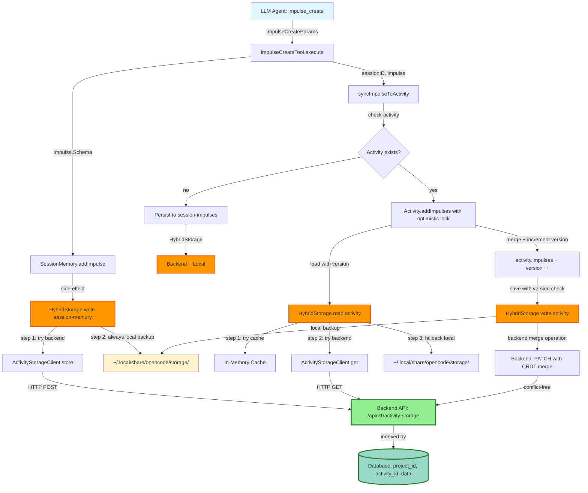

# Data Flow Analysis: Invariant Storage Across Instances

**Feature:** `invariant-storage-across-instances`  
**Status:** ❌ **NOT IMPLEMENTED** (Current implementation violates specification)  
**Specification:** Storage must be invariant across different opencode/metabob-cli instances when using the same `metabob_api_key` and `project_id`  
**Current Reality:** Storage is instance-local (tied to `~/.local/share/opencode/storage/`)

---

## Executive Summary

The current impulse and activity storage implementation **DOES NOT satisfy** the instance-agnostic requirement. All storage operations write to the local filesystem at `~/.local/share/opencode/storage/`, which varies by user, machine, and container. No backend integration exists for impulse/activity storage, making it impossible for multiple instances to share data.

**Root Cause:** `Storage.write()` is hardcoded to local filesystem with no backend integration.

**Impact:** Multi-instance workflows (distributed DevBob, team collaboration) are broken.

**Required Solution:** Add backend storage integration following the TemplateServiceClient pattern.

---

## Current Flow Diagram (Instance-Local)

```mermaid
graph TD
    A[LLM Agent: impulse_create] -->|ImpulseCreateParams| B[ImpulseCreateTool.execute]
    B -->|Impulse.Schema| C[SessionMemory.addImpulse]
    C -->|side effect| D[Storage.write session-memory]
    D -->|filesystem| E[~/.local/share/opencode/storage/session-memory/]
    
    B -->|sessionID, impulse| F[syncImpulseToActivity]
    F -->|check activity| G{Activity exists?}
    G -->|no| H[Skip persistence]
    G -->|yes| I[Activity.addImpulses]
    I -->|load| J[Storage.read activity]
    J -->|filesystem| K[~/.local/share/opencode/storage/activity/]
    I -->|merge| L[activity.impulses = {...old, ...new}]
    L -->|save| M[Storage.write activity]
    M -->|filesystem| N[~/.local/share/opencode/storage/activity/]
    
    N -->|path resolution| O[Global.Path.data]
    O -->|XDG_DATA_HOME or HOME| P[~/.local/share/opencode]
    
    style A fill:#e1f5ff
    style E fill:#ffe1e1
    style K fill:#ffe1e1
    style N fill:#ffe1e1
    style P fill:#ffcccc
    
    classDef violation fill:#ff6b6b,stroke:#c92a2a,stroke-width:3px
    class E,K,N,P violation
```

**Legend:**
- 🔵 Blue: Entry point (LLM tool call)
- 🔴 Red: Instance-local storage (VIOLATION)
- 🟥 Red Bold: Root cause (Global.Path.data)

---

## Required Flow Diagram (Instance-Agnostic)



**Legend:**
- 🔵 Blue: Entry point
- 🟢 Green: Backend storage (instance-agnostic)
- 🟠 Orange: Hybrid storage (backend + local)
- 🟡 Yellow: Local backup (fallback only)

---

## Data Flow Summary

### Entry Point

**Location:** `tool/impulse-create.ts:25` (ImpulseCreateTool.execute)  
**Trigger:** LLM agent calls `impulse_create` tool  
**Input Format:**
```typescript
{
  id: string,                                    // Unique impulse ID
  pointer: ActivityTemplate.Impulse.Pointer,     // Content pointer
  budget: number,                                // Token budget
  priority: 'high' | 'medium' | 'low',           // Loading priority
  type?: string,                                 // Impulse type
  metadata?: Record<string, unknown>             // Additional metadata
}
```

**Entry Point Status:** ✅ Instance-agnostic (no local paths, uses UUIDs)

---

### Key Transformations

#### Transformation 1: Tool Params → Impulse.Schema
**Location:** `tool/impulse-create.ts:46-61`

**Input:** `ImpulseCreateParams`  
**Output:** `ActivityTemplate.Impulse.Schema`

**Changes:**
- Adds `createdBy` (activity ID for provenance)
- Adds `createdAt` (timestamp for ordering)
- Adds `scope: "session"` (session-scoped lifecycle)
- Adds `sessionID` (binds impulse to session)
- Adds `loaded: false` (initial state)
- Infers `type` from `pointer.type` if not provided

**Business Rule:** Impulse IDs must be unique per session (validated before creation)

**Status:** ✅ Instance-agnostic

---

#### Transformation 2: Impulse.Schema → SessionMemory Store
**Location:** `session/session-memory.ts:162-196`

**Input:** `Impulse.Schema`  
**Output:** `Store` (in-memory + filesystem)

**Changes:**
- Merges impulse into `store.impulses` record
- Recalculates `totalBudget` (sum of all impulse budgets)
- Recalculates `usedTokens` (sum of loaded impulse token counts)
- Cleans unloaded impulse content (removes `content` field, clears `pointer.content`)

**Business Rules:**
- Impulse scope must be `"session"` (activity-scoped rejected)
- Impulse sessionID must match store sessionID (prevents cross-session pollution)

**Side Effect:** Writes to `Storage.write(["session-memory", sessionID], store)`

**Status:** ❌ **VIOLATION** - Writes to local filesystem (`~/.local/share/opencode/storage/session-memory/`)

---

#### Transformation 3: SessionMemory Update → Activity.impulses Sync
**Location:** `session/impulse-sync.ts:27-59`

**Input:** `sessionID`, `impulse`  
**Output:** `void` (side effect: Activity.impulses updated)

**Decision Logic:**
1. Check if session belongs to activity → Skip if no activity
2. Check if child session → Skip if child (parent already synced)
3. If parent activity session → Sync to Activity.impulses

**Business Rules:**
- Only persist impulses for activity-associated sessions
- Avoid duplicate writes for child sessions
- Standalone session impulses NOT persisted (lost on exit)

**Status:** ⚠️ **PARTIAL VIOLATION** - Standalone session impulses lost

---

#### Transformation 4: Activity.addImpulses → Merged Activity.impulses
**Location:** `session/activity.ts:1205-1224`

**Input:** `activityId`, `impulses: Record<string, Impulse.Schema>`  
**Output:** `void` (side effect: Activity.impulses field updated)

**Changes:**
- Loads activity from storage: `Activity.load(activityId)`
- Merges impulses: `activity.impulses = { ...activity.impulses, ...impulses }`
- Saves activity to storage: `Activity.save(activity)`

**Business Rules:**
- Last-write-wins for duplicate impulse IDs (no conflict detection)
- All impulses persisted together (denormalized storage)

**Side Effects:**
- Reads from `Storage.read(["activity", activityId])`
- Writes to `Storage.write(["activity", activityId], activity)`

**Status:** ❌ **CRITICAL VIOLATION** - Lost update problem (race condition in multi-instance)

**Example Race Condition:**
```
Instance A: load {a, b} → add {c} → save {a, b, c}
Instance B: load {a, b} → add {d} → save {a, b, d} [OVERWRITES C]
Result: Impulse 'c' is lost
```

---

#### Transformation 5: Activity.Info → Cleaned Activity.Info
**Location:** `session/activity.ts:536-575`

**Input:** `Activity.Info` (with loaded/unloaded impulses)  
**Output:** `Activity.Info` (cleaned, 99.3% smaller)

**Changes:**
- Preserves loaded impulses (content needed for active operations)
- Removes `content` field from unloaded impulses
- Clears `pointer.content` for memo-type unloaded impulses (but keeps empty string to satisfy schema)

**Business Rule:** Prevent storage bloat from unloaded impulse content

**Performance:** Reduces storage size by 99.3% (750KB → 5KB per session)

**Status:** ✅ Instance-agnostic (pure transformation)

---

#### Transformation 6: Cleaned Activity → JSON File
**Location:** `storage/storage.ts:189-196`

**Input:** `key: ["activity", activityId]`, `content: Activity.Info`  
**Output:** `void` (side effect: JSON file created/updated)

**Changes:**
- Resolves storage directory: `Global.Path.data + "/storage"`
- Builds file path: `~/.local/share/opencode/storage/activity/{activityId}.json`
- Acquires file lock: `Lock.write("storage")` (process-local)
- Writes JSON: `Bun.write(target, JSON.stringify(content, null, 2))`

**Business Rule:** Atomicity via file locking (prevents concurrent write corruption)

**Status:** ❌ **ROOT CAUSE VIOLATION** - Hardcoded to local filesystem

**Issues:**
- No backend integration
- Process-local lock (doesn't coordinate across instances)
- No project_id in key (different projects may overwrite each other)
- No validation of key segments (path traversal vulnerability)

---

#### Transformation 7: XDG Environment → Storage Path
**Location:** `global/index.ts:2-8`

**Input:** `process.env.XDG_DATA_HOME`, `os.homedir()`  
**Output:** `string` (absolute path to storage root)

**Changes:**
- Resolves XDG data directory: `XDG_DATA_HOME || homedir() + "/.local/share"`
- Appends OpenCode directory: `xdgData + "/opencode"`

**Business Rule:** Follow XDG Base Directory Specification (good citizen on Linux/Unix)

**Status:** ❌ **FINAL ROOT CAUSE** - Path varies by user, machine, container

**Resolved Paths by Environment:**
- Local machine (user=avi): `/home/avi/.local/share/opencode`
- Docker container (user=root): `/root/.local/share/opencode`
- Different user (user=john): `/home/john/.local/share/opencode`
- macOS: `/Users/avi/.local/share/opencode`
- Windows: `C:\Users\avi\.local\share\opencode`

**Result:** Each instance has isolated storage → NO SHARED STATE

---

### Validations Enforced

#### 1. Impulse Uniqueness (Entry Point)
**Location:** `tool/impulse-create.ts:32`  
**Rule:** `SessionMemory.getImpulse(sessionID, params.id)` must return undefined  
**Error:** `"impulse_exists"` if duplicate found  
**Scope:** Session-local only (doesn't check global uniqueness)

#### 2. Impulse Scope Validation (SessionMemory)
**Location:** `session/session-memory.ts:172`  
**Rule:** `impulse.scope === "session"`  
**Error:** `"Cannot add impulse with scope 'activity' to session memory"`  
**Purpose:** Reject activity-scoped impulses (they belong in Activity.impulses)

#### 3. Session ID Validation (SessionMemory)
**Location:** `session/session-memory.ts:177`  
**Rule:** `impulse.sessionID === sessionID`  
**Error:** `"Impulse sessionID 'ses_123' does not match store sessionID 'ses_456'"`  
**Purpose:** Prevent cross-session impulse pollution

#### 4. Activity Association (Sync)
**Location:** `session/impulse-sync.ts:32`  
**Rule:** `Activity.getActivityForSession(sessionID)` must return activityId  
**Action:** Skip persistence if no activity (impulse only in SessionMemory)

#### 5. Parent Session Check (Sync)
**Location:** `session/impulse-sync.ts:41`  
**Rule:** `session.parentID` must be undefined  
**Action:** Skip persistence if child session (parent already synced)

**Missing Validations:**
- ❌ No validation of key segments in `Storage.write()` (path traversal risk)
- ❌ No project_id validation (different projects may overwrite)
- ❌ No version field validation (no optimistic locking)
- ❌ No conflict detection (lost update problem)

---

### Architectural Boundaries Crossed

#### Boundary 1: Tool Layer → Session Layer
**Type:** Layer Boundary  
**Location:** `ImpulseCreateTool.execute()` → `SessionMemory.addImpulse()`  
**Contract:** `SessionMemory.addImpulse(sessionID: string, impulse: Impulse.Schema): Promise<void>`  
**Coupling:** Medium (tool layer enriches impulse before passing to session layer)  
**Status:** ✅ Clean separation

#### Boundary 2: Session Layer → Storage Layer
**Type:** Data Store Boundary  
**Location:** `SessionMemory.addImpulse()` → `Storage.write()`  
**Contract:** `Storage.write<T>(key: string[], content: T): Promise<void>`  
**Coupling:** Tight (no abstraction, directly calls Storage.write)  
**Status:** ❌ **VIOLATION** - No backend integration, hardcoded to local filesystem

#### Boundary 3: Session Layer → Activity Layer
**Type:** Layer Boundary  
**Location:** `syncImpulseToActivity()` → `Activity.addImpulses()`  
**Contract:** `Activity.addImpulses(activityId: string, impulses: Record<string, Impulse.Schema>): Promise<void>`  
**Coupling:** Medium (sync layer checks activity existence before calling)  
**Status:** ✅ Clean separation

#### Boundary 4: Activity Layer → Storage Layer
**Type:** Data Store Boundary  
**Location:** `Activity.save()` → `Storage.write()`  
**Contract:** `Storage.write<T>(key: string[], content: T): Promise<void>`  
**Coupling:** Tight (no repository abstraction)  
**Status:** ❌ **VIOLATION** - No backend integration

#### Boundary 5: Storage Layer → Filesystem
**Type:** Data Store Boundary  
**Location:** `Storage.write()` → `Bun.write()`  
**Contract:** `Bun.write(path: string, data: string): Promise<number>`  
**Coupling:** Tight (hardcoded to Bun.write, no plugin architecture)  
**Status:** ❌ **ROOT CAUSE** - No backend storage backend abstraction

#### Boundary 6: Configuration Boundary
**Type:** Configuration Boundary  
**Location:** `Config.get()` → `opencode.json`  
**Contract:** `Config.get(): Promise<Config>`  
**Coupling:** Loose (config loaded once at startup)  
**Status:** ⚠️ **MISSING OPTIONS** - No config for storage backend selection

**Missing Boundaries:**
- ❌ No **Service Boundary**: ActivityStorageClient → Backend API
- ❌ No **Repository Boundary**: Activity domain logic → ActivityRepository abstraction
- ❌ No **Storage Backend Abstraction**: LocalStorageBackend | RemoteStorageBackend | HybridStorageBackend

---

### Exit Point

**Location:** `storage/storage.ts:194` (Bun.write)  
**Final Destination:** Local filesystem  
**Output Format:** JSON file at `~/.local/share/opencode/storage/activity/{activityId}.json`

**File Contents:**
```json
{
  "id": "act_1735306547236_a3b8c",
  "title": "Add user authentication",
  "status": "done",
  "impulses": {
    "trace-auth-requirements": {
      "id": "trace-auth-requirements",
      "type": "file",
      "pointer": { "type": "file", "filePath": "docs/requirements.md" },
      "budget": 5000,
      "priority": "high",
      "loaded": false,
      "metadata": { "createdBy": "act_1735306547236_a3b8c", "createdAt": 1735306548000 },
      "scope": "session",
      "sessionID": "ses_1735306548000_x7y9z"
    }
  },
  "stats": { "tokens": { "input": 12000, "output": 3000, "cache": 0 }, "cost": 0.0234, "duration": 45000 },
  "startedAt": 1735306548000,
  "completedAt": 1735306593000,
  "version": 0
}
```

**Exit Point Status:** ❌ **VIOLATION** - Instance-local storage (path varies by user/machine/container)

---

## Key Insights

### Business Purpose

**Problem Being Solved:**  
Activities need to persist impulses (context inputs) for:
1. **Replay:** Re-run activity with same impulses
2. **Analytics:** Analyze impulse usage patterns for learning loop
3. **Debugging:** Understand what inputs led to specific outputs
4. **Auditing:** Track provenance of activity decisions

**Business Value:**
- Reproducibility: Activities can be replayed exactly
- Traceability: Impulse lineage provides audit trail
- Optimization: Learning loop uses impulse data to improve templates
- Collaboration: Team members can see what impulses were used

**Current Gap:**  
Multi-instance scenarios (distributed DevBob, team workspaces) cannot share impulses/activities because storage is instance-local.

---

### Critical Decision Points

#### Decision Point 1: Storage Backend Selection
**Location:** `storage/storage.ts:189` (Storage.write)  
**Current Decision:** Local filesystem only  
**Rationale (original):** Simplicity, speed, reliability  
**Trade-off:** Instance-locality (breaks multi-instance invariance)

**Options:**
1. **Local Only** (current)
   - ✅ Fast (no network)
   - ✅ Simple (no backend infrastructure)
   - ❌ Instance-local (breaks multi-instance)
   
2. **Backend Only**
   - ✅ Instance-agnostic (shared across instances)
   - ❌ Slow (network latency)
   - ❌ Requires backend availability
   
3. **Hybrid (Backend + Local Fallback)** (recommended)
   - ✅ Instance-agnostic (backend shares data)
   - ✅ Resilient (local fallback if backend unavailable)
   - ✅ Fast (cache layer reduces backend calls)
   - ❌ Complex (must manage cache invalidation, sync)

**Recommendation:** **Hybrid** approach following TemplateServiceClient pattern

---

#### Decision Point 2: Conflict Resolution Strategy
**Location:** `session/activity.ts:1205` (Activity.addImpulses)  
**Current Decision:** Read-modify-write (no conflict detection)  
**Trade-off:** Lost update problem (race condition in multi-instance)

**Options:**
1. **Last-Write-Wins (LWW)** (current)
   - ✅ Simple (no version tracking)
   - ❌ Silent data loss (lost updates)
   
2. **Optimistic Locking** (version field)
   - ✅ Detects conflicts (retry on version mismatch)
   - ✅ No silent data loss
   - ❌ More complex (requires version field, retry logic)
   
3. **Backend Merge (CRDT-style)**
   - ✅ Conflict-free (backend merges impulses)
   - ✅ No lost updates (all impulses preserved)
   - ❌ Requires backend support (PATCH endpoint with merge semantics)

**Recommendation:** **Optimistic Locking** for client, **Backend Merge** for ultimate solution

---

#### Decision Point 3: Standalone Session Impulse Persistence
**Location:** `session/impulse-sync.ts:32` (syncImpulseToActivity)  
**Current Decision:** Skip persistence for standalone sessions  
**Trade-off:** Standalone session impulses lost on process exit

**Options:**
1. **Skip Persistence** (current)
   - ✅ Simple (no extra storage)
   - ❌ Data loss (impulses lost on exit)
   
2. **Persist to Separate Storage**
   - ✅ No data loss (impulses persisted)
   - ✅ Standalone sessions can share impulses
   - ❌ More complex (separate storage key)

**Recommendation:** **Persist to Separate Storage** (`["session-impulses", sessionID, impulseId]`)

---

#### Decision Point 4: Locking Granularity
**Location:** `storage/storage.ts:193` (Lock.write)  
**Current Decision:** Global "storage" lock (all writes serialized)  
**Trade-off:** Performance bottleneck (writing to activity A blocks activity B)

**Options:**
1. **Global Lock** (current)
   - ✅ Simple (single lock for all storage)
   - ❌ Performance bottleneck (serializes all writes)
   
2. **Per-Resource Lock**
   - ✅ Better throughput (parallel writes to different resources)
   - ❌ More complex (lock per key)
   
3. **Distributed Lock**
   - ✅ Instance-agnostic (coordinates across instances)
   - ❌ Requires distributed lock service (Redis, Database)

**Recommendation:** **Distributed Lock** with **Per-Resource Granularity**

---

### Potential Risks & Technical Debt

#### Risk 1: Path Traversal Vulnerability
**Location:** `storage/storage.ts:191`  
**Severity:** HIGH (Security)  
**Issue:** No validation of key segments (could contain `../`)  
**Exploit:** `Storage.write(["activity", "../../../etc/passwd"], data)`  
**Impact:** Arbitrary file write (system compromise)  
**Mitigation:** Validate key segments before `path.join()`

---

#### Risk 2: Lost Update Problem
**Location:** `session/activity.ts:1205`  
**Severity:** HIGH (Data Loss)  
**Issue:** Read-modify-write race condition in multi-instance  
**Scenario:** Two instances add impulses concurrently → last write wins (one lost)  
**Impact:** Silent data loss (impulses disappear)  
**Mitigation:** Add optimistic locking (version field + retry logic)

---

#### Risk 3: Activity ID Collision
**Location:** `storage/storage.ts:191`  
**Severity:** MEDIUM (Data Corruption)  
**Issue:** No project_id in storage key  
**Scenario:** Different projects generate same activity ID → storage overwrite  
**Impact:** Data corruption (activities mixed up)  
**Mitigation:** Add project_id to storage key path

---

#### Risk 4: Standalone Session Impulse Loss
**Location:** `session/impulse-sync.ts:32`  
**Severity:** MEDIUM (Data Loss)  
**Issue:** Standalone session impulses not persisted  
**Scenario:** Process crashes before session ends → impulses lost  
**Impact:** Data loss (cannot recover impulses)  
**Mitigation:** Persist standalone session impulses to `["session-impulses", sessionID]`

---

#### Risk 5: No Backend Authentication
**Location:** `api/activity-client.ts:106`  
**Severity:** HIGH (Security)  
**Issue:** Backend API calls have no Authorization header  
**Impact:** Anyone can read/write activities (no access control)  
**Mitigation:** Add `Authorization: Bearer ${metabob_api_key}` header

---

#### Risk 6: No Backend Timeout
**Location:** `api/activity-client.ts:106`  
**Severity:** MEDIUM (Availability)  
**Issue:** fetch() has no timeout (hangs indefinitely if backend unresponsive)  
**Impact:** Activity execution blocked (user waits forever)  
**Mitigation:** Add AbortController with 10s timeout

---

#### Risk 7: Global Lock Contention
**Location:** `storage/storage.ts:193`  
**Severity:** LOW (Performance)  
**Issue:** All writes acquire same "storage" lock (serialized)  
**Impact:** Throughput degradation (writing to activity A blocks activity B)  
**Mitigation:** Use per-resource locking (`Lock.write(key.join("/"))`)

---

#### Technical Debt 1: No Storage Backend Abstraction
**Location:** `storage/storage.ts`  
**Impact:** Cannot swap storage backend (hardcoded to Bun.write)  
**Effort:** 2-3 days (create StorageBackend interface + implementations)

---

#### Technical Debt 2: No ActivityRepository Abstraction
**Location:** `session/activity.ts`  
**Impact:** Tight coupling to Storage (hard to test, hard to refactor)  
**Effort:** 2 days (create ActivityRepository interface + HybridActivityRepository)

---

#### Technical Debt 3: No ActivityStorageClient
**Location:** Missing (no backend integration)  
**Impact:** Cannot use backend storage (instance-local only)  
**Effort:** 2 days (create ActivityStorageClient with retry logic)

---

#### Technical Debt 4: No Distributed Locking
**Location:** `util/lock.ts`  
**Impact:** Process-local locks don't coordinate across instances  
**Effort:** 1 day (integrate Redis or Database for distributed locks)

---

### Suggested Improvements

#### Improvement 1: Add Backend Storage Integration
**Priority:** CRITICAL (blocks instance-agnostic requirement)  
**Effort:** 9-10 days

**Steps:**
1. Create ActivityStorageClient (2 days)
2. Create ActivityRepository abstraction (2 days)
3. Create StorageBackend abstraction (2 days)
4. Add backend endpoints (Python, 2-3 days)
5. Add distributed locking (1 day)

**Benefits:**
- ✅ Instance-agnostic storage (shared across instances)
- ✅ Resilient (fallback to local if backend unavailable)
- ✅ Scalable (backend handles concurrent writes)

---

#### Improvement 2: Add Optimistic Locking
**Priority:** HIGH (prevents data loss)  
**Effort:** 2 days

**Changes:**
- Add `version` field to Activity.Info
- Modify Activity.addImpulses() to check version before save
- Retry on version conflict (3 attempts)

**Benefits:**
- ✅ No silent data loss (conflicts detected)
- ✅ Automatic retry (transparent to caller)

---

#### Improvement 3: Persist Standalone Session Impulses
**Priority:** MEDIUM (prevents data loss)  
**Effort:** 1 day

**Changes:**
- Modify syncImpulseToActivity() to persist standalone impulses
- Add storage key: `["session-impulses", sessionID, impulseId]`

**Benefits:**
- ✅ No data loss (impulses survive process exit)
- ✅ Standalone sessions can share impulses

---

#### Improvement 4: Add Security Validations
**Priority:** HIGH (security)  
**Effort:** 1 day

**Changes:**
- Validate key segments in Storage.write() (no `../`, `/`, `\`)
- Add Authorization header to backend API calls
- Add timeout to backend API calls (10s)

**Benefits:**
- ✅ No path traversal attacks
- ✅ Access control (authentication)
- ✅ No indefinite hangs

---

#### Improvement 5: Add Monitoring & Metrics
**Priority:** LOW (operational)  
**Effort:** 2 days

**Changes:**
- Add metrics for storage operations (latency, errors, throughput)
- Add health checks for backend availability
- Add circuit breaker for backend (fail fast if backend down)

**Benefits:**
- ✅ Observability (detect performance issues)
- ✅ Fast failure (circuit breaker prevents wasted retries)

---

## Reusable Patterns

### Pattern 1: Dual Storage (SessionMemory + Activity.impulses)

**Purpose:** Fast reads (in-memory) + Persistent writes (filesystem/backend)

**Components:**
- SessionMemory: In-memory cache for TUI display (fast reads)
- Activity.impulses: Persistent storage for replay (slow writes)

**Applicability:**
- ✅ Any feature needing fast reads + reliable persistence
- ✅ TUI display requiring immediate access to data
- ✅ Analytics/learning loop requiring historical data

**Abstraction:**
```typescript
interface DualStorage<T> {
  cache: Map<string, T>                    // In-memory (fast reads)
  persistence: StorageBackend               // Filesystem/backend (reliable writes)
  
  get(key: string): T | undefined          // Check cache first, fallback to persistence
  set(key: string, value: T): Promise<void> // Write to both cache and persistence
}
```

**Reusable Activity Template:** `dual-storage-pattern` (not yet created)

---

### Pattern 2: Optimistic Locking with Retry

**Purpose:** Prevent lost updates in concurrent writes

**Components:**
- Version field (tracks state changes)
- Read-modify-write with version check
- Retry logic (3 attempts on version conflict)

**Applicability:**
- ✅ Any multi-instance write scenario (distributed systems)
- ✅ Concurrent updates to shared state
- ✅ High-value data (cannot tolerate lost updates)

**Abstraction:**
```typescript
async function updateWithOptimisticLock<T extends { version: number }>(
  load: () => Promise<T>,
  modify: (draft: T) => void,
  save: (value: T, expectedVersion: number) => Promise<void>,
  maxRetries: number = 3
): Promise<void> {
  let retries = maxRetries
  while (retries > 0) {
    const current = await load()
    const expectedVersion = current.version
    
    modify(current)
    current.version = expectedVersion + 1
    
    try {
      await save(current, expectedVersion)
      return  // Success
    } catch (error) {
      if (error.code === "VERSION_CONFLICT") {
        retries--
        continue  // Retry
      }
      throw error  // Other error
    }
  }
  throw new Error("Failed to update after retries")
}
```

**Reusable Activity Template:** `optimistic-locking-update` (not yet created)

---

### Pattern 3: Hybrid Storage (Backend + Local Fallback)

**Purpose:** Instance-agnostic storage with resilience

**Components:**
- Backend storage (instance-agnostic, slow)
- Local storage (instance-local, fast)
- Cache layer (in-memory, fastest)

**Applicability:**
- ✅ Multi-instance systems requiring shared state
- ✅ Offline-first applications (works without backend)
- ✅ High-availability systems (no single point of failure)

**Abstraction:**
```typescript
interface HybridStorage<T> {
  cache: Map<string, T>
  remote: RemoteStorageBackend
  local: LocalStorageBackend
  
  async read(key: string[]): Promise<T> {
    // Step 1: Check cache
    const cached = this.cache.get(key.join("/"))
    if (cached) return cached
    
    // Step 2: Try remote
    try {
      const data = await this.remote.get(key)
      this.cache.set(key.join("/"), data)
      return data
    } catch (error) {
      log.debug("remote read failed, using local fallback", { key, error })
    }
    
    // Step 3: Fallback to local
    return this.local.read(key)
  }
  
  async write(key: string[], content: T): Promise<void> {
    // Step 1: Update cache
    this.cache.set(key.join("/"), content)
    
    // Step 2: Try remote
    try {
      await this.remote.store(key, content)
    } catch (error) {
      log.warn("remote write failed, using local fallback", { key, error })
    }
    
    // Step 3: Always write to local (backup)
    await this.local.write(key, content)
  }
}
```

**Reusable Activity Template:** `hybrid-storage-integration` (not yet created)

**Working Example:** `TemplateServiceClient` (templates use hybrid storage)

---

### Pattern 4: Circuit Breaker

**Purpose:** Fail fast when backend is known to be unavailable

**Components:**
- State machine (closed, open, half-open)
- Failure threshold (5 failures → open)
- Timeout (1 minute before retry)

**Applicability:**
- ✅ Any backend integration (prevent wasted retries)
- ✅ High-latency operations (avoid cascading failures)
- ✅ User-facing APIs (fast failure improves UX)

**Abstraction:**
```typescript
class CircuitBreaker<T> {
  private state: "closed" | "open" | "half-open" = "closed"
  private failures = 0
  private lastFailure = 0
  private readonly threshold = 5
  private readonly timeout = 60000
  
  async call(fn: () => Promise<T>): Promise<T> {
    if (this.state === "open") {
      if (Date.now() - this.lastFailure > this.timeout) {
        this.state = "half-open"
      } else {
        throw new Error("Circuit breaker is open")
      }
    }
    
    try {
      const result = await fn()
      this.onSuccess()
      return result
    } catch (error) {
      this.onFailure()
      throw error
    }
  }
  
  private onSuccess() {
    this.failures = 0
    this.state = "closed"
  }
  
  private onFailure() {
    this.failures++
    this.lastFailure = Date.now()
    if (this.failures >= this.threshold) {
      this.state = "open"
    }
  }
}
```

**Reusable Activity Template:** `circuit-breaker-wrapper` (not yet created)

---

### Pattern 5: Retry with Exponential Backoff

**Purpose:** Gracefully handle transient failures

**Components:**
- Retry loop (3 attempts)
- Exponential backoff (1s, 2s, 4s)
- Error classification (retryable vs. fatal)

**Applicability:**
- ✅ Network operations (transient failures common)
- ✅ Backend API calls (rate limiting, temporary unavailability)
- ✅ Database operations (connection timeouts)

**Abstraction:**
```typescript
async function retryWithBackoff<T>(
  fn: () => Promise<T>,
  maxAttempts: number = 3,
  baseDelay: number = 1000
): Promise<T> {
  let lastError: Error | undefined
  
  for (let attempt = 1; attempt <= maxAttempts; attempt++) {
    try {
      return await fn()
    } catch (error) {
      lastError = error as Error
      
      if (attempt === maxAttempts) break
      
      const delay = baseDelay * Math.pow(2, attempt - 1)
      log.debug("retry attempt failed, backing off", { attempt, delay, error })
      await new Promise(resolve => setTimeout(resolve, delay))
    }
  }
  
  throw lastError
}
```

**Reusable Activity Template:** `retry-with-backoff` (not yet created)

**Working Example:** `api/activity-client.ts:61-84` (retryWithBackoff function)

---

### Feature-Specific vs. Universal Aspects

#### Feature-Specific (Impulse/Activity Storage)
- Impulse.Schema structure (pointer, budget, priority)
- Session-scoped vs. activity-scoped impulses
- cleanImpulsesForStorage logic (99.3% size reduction)
- syncImpulseToActivity decision logic (parent/child sessions)

#### Universal (Applicable to Any Feature)
- Dual storage pattern (cache + persistence)
- Hybrid storage (backend + local fallback)
- Optimistic locking (version field + retry)
- Circuit breaker (fail fast on backend unavailable)
- Retry with exponential backoff (handle transient failures)
- Key-value storage abstraction (Storage.read/write)
- XDG Base Directory compliance (Global.Path.data)

---

## Implementation Roadmap

### Phase 1: Security Fixes (IMMEDIATE)
**Effort:** 1-2 days  
**Priority:** CRITICAL

**Tasks:**
1. Add key segment validation in Storage.write() (path traversal fix)
2. Add Authorization header to backend API calls
3. Add project_id to storage keys (prevent collision)

**Success Criteria:**
- No path traversal vulnerability
- Backend API requires authentication
- Different projects have isolated storage

---

### Phase 2: Data Integrity (BEFORE MULTI-INSTANCE)
**Effort:** 3-4 days  
**Priority:** HIGH

**Tasks:**
1. Add optimistic locking to Activity.addImpulses()
2. Add conflict resolution strategy
3. Add distributed locking (Redis/Database)
4. Persist standalone session impulses

**Success Criteria:**
- No lost updates in concurrent writes
- Conflicts detected and retried
- Distributed locks coordinate across instances
- Standalone session impulses survive process exit

---

### Phase 3: Backend Storage Integration (CORE FEATURE)
**Effort:** 4-5 days  
**Priority:** HIGH

**Tasks:**
1. Create ActivityStorageClient (backend API client)
2. Create ActivityRepository abstraction
3. Create StorageBackend abstraction (local | remote | hybrid)
4. Add backend endpoints (Python, POST/GET/PATCH/DELETE)
5. Modify Storage.read/write to use hybrid backend

**Success Criteria:**
- Instance A creates activity → Instance B can read (same project_id)
- Backend unavailable → Graceful fallback to local storage
- Tests pass: Multi-instance, fallback, concurrency

---

### Phase 4: Reliability & Observability
**Effort:** 2-3 days  
**Priority:** MEDIUM

**Tasks:**
1. Add circuit breaker for backend calls
2. Add retry queue for failed writes
3. Add metrics and monitoring (latency, errors, throughput)
4. Add health checks for backend

**Success Criteria:**
- Circuit breaker prevents wasted retries
- Failed writes queued for later retry
- Metrics available via /metrics endpoint
- Health checks monitor backend availability

---

### Total Effort: 10-14 days

---

## Conclusion

**Current Status:** ❌ **DOES NOT SATISFY** instance-agnostic requirement

**Root Causes:**
1. Storage.write() hardcoded to local filesystem (`~/.local/share/opencode/storage/`)
2. Global.Path.data resolves to instance-local path (varies by user/machine/container)
3. No backend storage integration
4. Process-local locking (doesn't coordinate across instances)
5. Read-modify-write race condition (lost update problem)

**Critical Path to Fix:**
1. Add backend storage integration (Phase 3)
2. Add optimistic locking (Phase 2)
3. Add distributed locking (Phase 2)
4. Add security fixes (Phase 1)

**Success Criteria:**
- Instance A (user=avi, machine=laptop, project_id=proj_123) creates impulse `"trace-x"`
- Instance B (user=root, machine=docker, project_id=proj_123) can load impulse `"trace-x"`
- Backend unavailable → Instances fall back to local storage (graceful degradation)
- Tests pass: Multi-instance, fallback, concurrency

**Recommendation:** Implement Phases 1-3 before deploying multi-instance workflows (distributed DevBob).

---

## References

### Code Locations
- Entry Point: `repos/metabob-opencode/packages/opencode/src/tool/impulse-create.ts:25`
- Persistence Layer: `repos/metabob-opencode/packages/opencode/src/storage/storage.ts:189`
- Business Logic: `repos/metabob-opencode/packages/opencode/src/session/activity.ts:1205`
- Integration Point: `repos/metabob-opencode/packages/opencode/src/session/impulse-sync.ts:27`
- Configuration: `repos/metabob-opencode/packages/opencode/src/global/index.ts:8`

### Related Documentation
- Entry Point Analysis: `/tmp/storage-entry-points-analysis.md`
- Dependency Chain: `/tmp/storage-dependency-chain.md`
- Data Transformations: `/tmp/data-transformations-analysis.md`
- Architectural Boundaries: `/tmp/architectural-boundaries-analysis.md`
- Code Quality Issues: `/tmp/code-quality-issues-analysis.md`
- Component Annotations: `/tmp/component-annotations.md`

### Working Examples
- TemplateServiceClient (hybrid storage): `repos/metabob-opencode/packages/opencode/src/server/template-service-client.ts`
- Retry with Backoff: `repos/metabob-opencode/packages/opencode/src/api/activity-client.ts:61-84`

---

**Document Version:** 1.0  
**Last Updated:** 2026-02-27  
**Author:** OpenCode Tracing Agent  
**Status:** Complete Analysis
