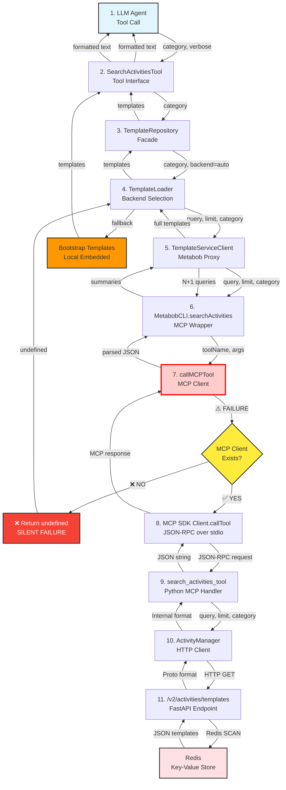
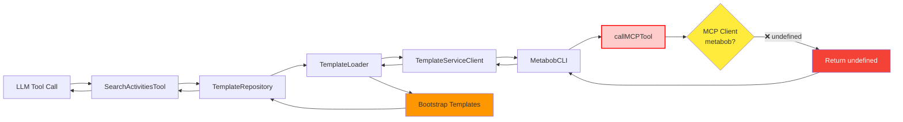
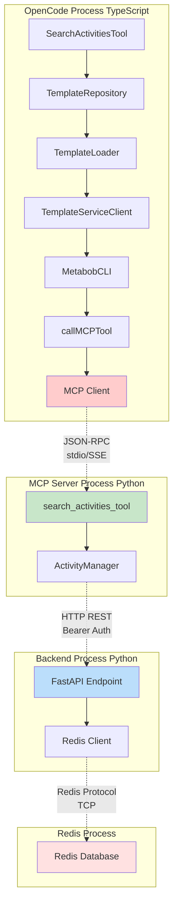

# Data Flow Analysis: metabob-cli-mcp-backend-communication

Complete flow diagram and documentation for the activity template communication flow from LLM tool call to backend database.

**Status**: ⚠️ **BROKEN** - No HTTP traffic reaching backend due to missing mcp.metabob configuration  
**Root Cause**: Silent configuration failure at Component 6 (callMCPTool)  
**Impact**: Users get bootstrap templates only, missing org-specific learned templates

---

## Table of Contents

1. [Flow Diagram](#flow-diagram)
2. [Data Flow Summary](#data-flow-summary)
3. [Component Details](#component-details)
4. [Key Insights](#key-insights)
5. [Reusable Patterns](#reusable-patterns)
6. [Troubleshooting Guide](#troubleshooting-guide)

---

## Flow Diagram

### Complete Flow (10 Components)



### Simplified Success Flow (Happy Path)


### Failure Flow (Missing mcp.metabob)



### Architectural Boundaries



---

## Data Flow Summary

### Entry Point

**Component**: LLM Agent → SearchActivitiesTool  
**Location**: `repos/metabob-opencode/packages/opencode/src/tool/search-activities.ts:27`  
**Format**: 
```typescript
{
  category?: "feature" | "bugfix" | "refactor" | "tool" | "infrastructure",
  verbose?: boolean  // Default: false
}
```
**Trigger**: LLM calls search_activities tool during conversation  
**Purpose**: Discover activity templates to recommend to user

---

### Transformations

#### Transformation 1: Tool Parameters → Repository Options
**Location**: SearchActivitiesTool → TemplateRepository  
**Change**: Drop verbose flag (presentation concern)
```typescript
Input:  { category: "feature", verbose: false }
Output: { category: "feature" }
```

#### Transformation 2: Backend Selection Mapping
**Location**: TemplateRepository → TemplateLoader  
**Change**: "all" → "auto" (semantic clarity)
```typescript
Input:  { backend: "all" }
Output: { backend: "auto" }
```

#### Transformation 3: Result Wrapping → Unwrapping
**Location**: TemplateLoader → TemplateRepository
**Change**: Extract templates array, discard metadata
```typescript
Input:  { templates: [...], source: "metabob", cached: false }
Output: [...]
```

#### Transformation 4: Summaries → Full Templates (N+1 Problem)
**Location**: TemplateServiceClient.searchTemplates()  
**Change**: Fetch full template for each summary
```typescript
Input:  [{ id: "t1", name: "...", task_count: 3 }]
Process: await Promise.all(summaries.map(s => getActivity(s.id)))
Output: [{ id: "t1", name: "...", tasks: [...] }]
```
**Issue**: 1 search + 20 getActivity calls = 21 HTTP requests

#### Transformation 5: TypeScript → JSON-RPC
**Location**: callMCPTool → MCP SDK  
**Change**: Method call → JSON-RPC 2.0 message
```typescript
Input:  callMCPTool("search_activities", { query: "", limit: 100 })
Output: {
  "jsonrpc": "2.0",
  "method": "tools/call",
  "params": {
    "name": "search_activities",
    "arguments": { "query": "", "limit": 100 }
  },
  "id": 1
}
```

#### Transformation 6: Python Dict → JSON String
**Location**: search_activities_tool → MCP response  
**Change**: Dict → JSON string for MCP protocol
```python
Input:  {"status": "success", "activities": [...]}
Output: '{"status": "success", "activities": [...]}'
```

#### Transformation 7: Proto Format → Internal Format
**Location**: ActivityManager.search_activities()  
**Change**: Backend proto fields → client internal format
```python
Input (Proto):  {
  "variant_id": "template-1",
  "variant_name": "Add REST",
  "expected_quality_score": 0.85
}
Output (Internal): {
  "id": "template-1",
  "name": "Add REST",
  "success_rate": 0.85
}
```

#### Transformation 8: Templates → Formatted Text
**Location**: SearchActivitiesTool.execute()  
**Change**: Array → compact or verbose text
```typescript
Input:  [{ id: "t1", name: "Add REST", successRate: 0.85 }]
Output (Compact): "1. Add REST (85% success)\n"
Output (Verbose): "1. Add REST Endpoint\n   Success: 85%\n   Tasks: 3\n   Cost: $0.05\n"
```

---

### Validations

#### Input Validation
- **SearchActivitiesTool**: Category validated by Zod schema enum
- **callMCPTool**: ❌ **Missing** - No validation of limit, category
- **search_activities_tool**: Default values (limit=20, query="")
- **ActivityManager**: ❌ **Missing** - No URL format validation

#### Response Validation
- **callMCPTool**: ❌ **Missing** - Type cast, no runtime validation
- **MetabobCLI**: Validates status="success" and activities/templates field exists
- **TemplateServiceClient**: Filters undefined results from getActivity
- **Backend**: ❌ **Missing** - Returns 500 for all exceptions

#### Authentication
- **ActivityManager**: Bearer token required for org-scoped templates
- **Backend**: Optional in DEBUG mode (security risk)
- **Issue**: ❌ 401 returns [] (silent auth failure)

---

### Boundaries Crossed

#### Boundary 1: Configuration → Runtime (Component 7)
**Type**: Config file → MCP client registry  
**Contract**: opencode.json must have mcp.metabob section  
**Coupling**: Tight - hardcoded "metabob" string  
**Resilience**: ❌ **None** - Silent failure, returns undefined  
**⚠️ THIS IS WHERE COMMUNICATION BREAKS**

#### Boundary 2: Process (TypeScript → Python)
**Type**: IPC via JSON-RPC over stdio/SSE  
**Contract**: MCP protocol (JSON-RPC 2.0)  
**Coupling**: Loose - standard protocol  
**Resilience**: Timeout (30s), exception handling

#### Boundary 3: Service (Python → Backend)
**Type**: HTTP REST with Bearer auth  
**Contract**: GET /v2/activities/templates  
**Coupling**: Medium - Proto format on wire  
**Resilience**: ❌ **Missing** - No retry, circuit breaker, or connection pooling

#### Boundary 4: Data Store (Backend → Redis)
**Type**: Redis protocol (TCP)  
**Contract**: Key-value SCAN + GET pattern  
**Coupling**: Tight - Direct Redis commands  
**Resilience**: ❌ **Missing** - No connection pool, 5s timeout

---

### Exit Point

**Component**: Backend API → Redis  
**Location**: `repos/metabob-rpc-api/server/routes/activity.py:72`  
**Format**:
```json
{
  "templates": [
    {
      "variant_id": "add-rest-endpoint-v1",
      "variant_name": "Add REST Endpoint",
      "task_steps": [...],
      "expected_quality_score": 0.85,
      "scope": "global",
      "org_id": null
    }
  ]
}
```
**Storage**: Redis key `activity_template:{variant_id}`  
**Purpose**: Persist learned templates for multi-tenant access

---

## Component Details

### Component 1: SearchActivitiesTool (Entry)
- **Purpose**: LLM tool interface for template discovery
- **Input**: `{ category?, verbose? }`
- **Output**: Formatted text (compact or verbose)
- **Key Logic**: Token optimization (compact default)
- **Issues**: Silent fallback to bootstrap

### Component 2-5: OpenCode Service Layers
- **Purpose**: Abstraction layers (Tool → Repository → Loader → Client)
- **Pattern**: Facade, Fallback Chain, Proxy
- **Key Logic**: Cache → Metabob → Bootstrap fallback
- **Issues**: N+1 queries, client-side filtering

### Component 6: callMCPTool ⚠️ CRITICAL
- **Purpose**: MCP client lookup and tool invocation
- **Input**: `(toolName: string, args: Record<string, unknown>)`
- **Output**: `T | undefined`
- **Key Logic**: Registry lookup by "metabob" key
- **⚠️ ROOT CAUSE**: Returns undefined if client not found

### Component 7: MCP Client (SDK)
- **Purpose**: JSON-RPC communication over stdio/SSE
- **Protocol**: MCP (Model Context Protocol)
- **Timeout**: 30 seconds default
- **Issues**: No retry logic

### Component 8: search_activities_tool (Python)
- **Purpose**: MCP tool handler, config extraction
- **Input**: `(query, limit, category, min_success_rate)`
- **Output**: JSON string `{"status": "success", "activities": [...]}`
- **Key Logic**: Gets base_url and session_token from config
- **Issues**: Defaults to localhost:8080

### Component 9: ActivityManager (HTTP Client)
- **Purpose**: HTTP GET to backend with auth
- **Protocol**: HTTP REST with Bearer token
- **Transformation**: Proto format → Internal format
- **Issues**: Silent 401, no connection pooling, no retry

### Component 10: Backend API (Exit)
- **Purpose**: Multi-tenant template query from Redis
- **Storage**: Redis key-value (SCAN + GET pattern)
- **Security**: Bearer token for org isolation
- **Issues**: O(N) filtering, no connection pool, overly broad exceptions

---

## Key Insights

### Business Purpose

**What**: Provide LLM agents with access to activity templates from central backend (learned, org-specific) and local fallback (bootstrap, built-in).

**Why**: 
- Enable agent-driven development workflows
- Learn from executions (Thompson Sampling)
- Multi-tenant template sharing (global + org-scoped)
- Graceful degradation (work offline)

**Value**:
- Faster development (reusable templates)
- Quality improvement (learned from success rates)
- Organization knowledge capture (org templates)

### Critical Decision Points

#### Decision 1: Silent Failure (callMCPTool) ⚠️⚠️⚠️
**Choice**: Return undefined instead of throwing exception  
**Rationale**: Enable graceful degradation (offline mode)  
**Benefit**: OpenCode works without backend  
**Cost**: **Silent configuration errors, user has no idea backend unreachable**  
**Result**: **THIS IS THE ROOT CAUSE OF "NO HTTP TRAFFIC"**

**Recommendation**: Throw exception, but catch at TemplateLoader for fallback
```typescript
// callMCPTool - throw instead of undefined
if (!metabobClient) {
  throw new MCPClientNotFoundError("metabob")
}

// TemplateLoader - catch and fallback
try {
  const metabobResult = await client.listTemplates(...)
  return { templates: metabobResult.templates, source: "metabob" }
} catch (error) {
  if (error instanceof MCPClientNotFoundError) {
    log.warn("MCP client not configured, using bootstrap templates")
  } else {
    log.error("Metabob error, falling back", { error })
  }
  return { templates: await bootstrapTemplates(), source: "local" }
}
```

#### Decision 2: N+1 Queries (TemplateServiceClient)
**Choice**: Search for summaries, then getActivity for each  
**Rationale**: Backend returns lightweight summaries, client needs full templates  
**Benefit**: Smaller search responses  
**Cost**: 20 templates = 21 HTTP requests (~2-5 seconds)

**Recommendation**: Backend supports `include_full=true` parameter
```python
# Backend
@router.get("/templates")
async def list_templates(
    include_full: bool = False,  # ← New parameter
    ...
):
    if include_full:
        # Return full templates with task_steps
        return {"templates": full_templates}
    else:
        # Return summaries only
        return {"templates": summaries}
```

#### Decision 3: Proto Format (Backend → Client)
**Choice**: Backend returns ActivityVariant proto (snake_case)  
**Rationale**: Protobuf is efficient, versioned schema  
**Benefit**: Can evolve schema with backwards compatibility  
**Cost**: Manual field mapping (error-prone, breaks on renames)

**Recommendation**: Proto code generation
```bash
# Generate Python types from .proto
protoc --python_out=. activity_variant.proto
from metabob_proto import ActivityVariant

# Use generated types (type-safe)
variant = ActivityVariant()
variant.ParseFromString(response.content)
```

#### Decision 4: Redis for MVP (Backend Storage)
**Choice**: Redis key-value store  
**Rationale**: Fast prototyping, simple key-value access  
**Benefit**: No schema migrations, iterate quickly  
**Cost**: O(N) filtering, no relational queries, will migrate to SurrealDB

**Recommendation**: Migrate to SurrealDB with indexes
```sql
-- SurrealDB with indexes
CREATE INDEX idx_templates_category ON activity_template(category);
CREATE INDEX idx_templates_org ON activity_template(org_id);

-- O(1) queries instead of O(N)
SELECT * FROM activity_template
WHERE category = "feature" AND org_id IN ["global", $org_id]
ORDER BY expected_value DESC
LIMIT 50;
```

### Potential Risks

#### Risk 1: Configuration Drift ⚠️ HIGH
**Problem**: mcp.metabob missing breaks entire flow silently  
**Impact**: Users get bootstrap templates only, no backend communication  
**Likelihood**: HIGH (new users, different environments)  
**Mitigation**: 
- Add startup validation
- Check mcp.metabob exists before serving requests
- Show clear error message to user

#### Risk 2: Authentication Failure ⚠️ HIGH
**Problem**: 401 returns [] (silent auth failure)  
**Impact**: Users see only global templates, think that's all  
**Likelihood**: MEDIUM (expired tokens, wrong env)  
**Mitigation**:
- Throw exception on 401
- Show "Please login" message
- Distinguish "no templates" from "auth failure"

#### Risk 3: Backend Unavailable ⚠️ MEDIUM
**Problem**: Network errors, backend down, Redis unavailable  
**Impact**: Falls back to bootstrap templates silently  
**Likelihood**: LOW (development), HIGH (production)  
**Mitigation**:
- Health check endpoint (/health, /ready)
- Circuit breaker (stop calling after N failures)
- Retry with exponential backoff
- Status indicator in UI

#### Risk 4: Performance Degradation ⚠️ MEDIUM
**Problem**: N+1 queries, no connection pooling, O(N) Redis filtering  
**Impact**: Slow responses (2-5 seconds for 20 templates)  
**Likelihood**: HIGH (with scale)  
**Mitigation**:
- Fix N+1 with batch API
- Connection pooling (HTTP, Redis)
- Migrate to SurrealDB with indexes
- Caching (5-60 second TTL)

### Technical Debt

1. **No distributed tracing** - Can't debug multi-component failures
2. **No metrics** - Can't measure latency, error rates, throughput
3. **No integration tests** - Manual testing only
4. **Manual proto mapping** - Error-prone, breaks on schema changes
5. **No retry logic** - Transient failures become permanent
6. **No circuit breaker** - Failed backend amplifies errors
7. **No request logging** - Can't see what requests hit backend
8. **Inconsistent error handling** - Some throw, some return undefined/[]

---

## Reusable Patterns

### Pattern 1: Graceful Degradation with Fallback Chain

**Implementation**: TemplateLoader
```typescript
async function loadTemplates(options: { backend: Backend }): Promise<Templates> {
  // 1. Try primary source
  if (options.backend !== "local") {
    try {
      const result = await primarySource.fetch(...)
      if (result.length > 0) {
        return { templates: result, source: "primary" }
      }
    } catch (error) {
      log.warn("Primary source failed, falling back", { error })
    }
  }
  
  // 2. Try secondary source
  try {
    const result = await secondarySource.fetch(...)
    return { templates: result, source: "secondary" }
  } catch (error) {
    log.error("Secondary source failed", { error })
  }
  
  // 3. Final fallback
  return { templates: [], source: "none" }
}
```

**Applicability**: Any data fetching with multiple sources  
**Variants**:
- Cache → Remote → Local
- Primary DB → Replica DB → In-memory
- Real-time API → Batch API → Static file

**Universal**: ✅ Yes - Common pattern for resilient systems

---

### Pattern 2: Proxy with Transformation

**Implementation**: ActivityManager
```python
class BackendProxy:
    def __init__(self, base_url: str, auth_token: str):
        self.client = httpx.AsyncClient(
            base_url=base_url,
            headers={"Authorization": f"Bearer {auth_token}"}
        )
    
    async def search(self, query: str, limit: int) -> List[Dict]:
        # 1. HTTP call
        response = await self.client.get("/api/search", params={"q": query, "limit": limit})
        
        # 2. Status code handling
        if response.status_code != 200:
            raise HTTPError(response.status_code, response.text)
        
        # 3. Parse response
        data = response.json()
        
        # 4. Transform proto → internal
        return [self._transform(item) for item in data["items"]]
    
    def _transform(self, proto_item: Dict) -> Dict:
        return {
            "id": proto_item["item_id"],        # proto field → internal field
            "name": proto_item["item_name"],
            "score": proto_item["relevance_score"]
        }
```

**Applicability**: Any HTTP client wrapping external API  
**Variants**:
- GraphQL → REST transformation
- gRPC → JSON transformation
- SOAP → REST transformation

**Universal**: ✅ Yes - Standard integration pattern

---

### Pattern 3: Multi-Tenant Filtering

**Implementation**: Backend list_activity_templates
```python
async def list_resources(
    category: Optional[str],
    credentials: Optional[HTTPAuthorizationCredentials]
) -> List[Resource]:
    # 1. Extract tenant context from auth
    org_id = None
    if credentials:
        org_id = extract_org_id(credentials.credentials)
    
    # 2. Fetch all resources
    all_resources = await db.query("SELECT * FROM resources")
    
    # 3. Filter by scope
    filtered = []
    for resource in all_resources:
        # Global resources visible to all
        if resource["scope"] == "global":
            filtered.append(resource)
        # Org resources only to org members
        elif resource["scope"] == "org" and resource["org_id"] == org_id:
            filtered.append(resource)
    
    # 4. Filter by category
    if category:
        filtered = [r for r in filtered if r["category"] == category]
    
    return filtered
```

**Applicability**: Any multi-tenant SaaS application  
**Variants**:
- User-level isolation (user_id)
- Project-level isolation (project_id)
- Team-level isolation (team_id)

**Universal**: ✅ Yes - Standard SaaS pattern

---

### Pattern 4: Token Optimization for LLM Tools

**Implementation**: SearchActivitiesTool
```typescript
function formatForLLM(
    templates: Template[],
    mode: "compact" | "verbose"
): string {
    if (mode === "compact") {
        // ~15 bytes per template
        return templates.map((t, i) => 
            `${i+1}. ${t.name} (${t.successRate}%)`
        ).join("\n")
    } else {
        // ~150 bytes per template
        return templates.map((t, i) => `
${i+1}. ${t.name}
   Description: ${t.description}
   Success Rate: ${t.successRate}%
   Avg Cost: $${t.avgCost}
   Avg Duration: ${t.avgDuration}ms
   Tasks: ${t.taskCount}
        `).join("\n")
    }
}
```

**Applicability**: Any LLM tool returning data  
**Variants**:
- JSON → YAML (more readable)
- Table format (structured)
- Hierarchical (nested data)

**Feature-Specific**: ⚠️ Partially - Concept universal, implementation specific to templates

---

### Could This Flow Be an Activity?

**Answer**: Yes, partially - the "fetch from backend with fallback" pattern

**Abstraction**:
```yaml
activity: fetch-with-fallback
description: Fetch data from primary source with fallback chain
tasks:
  - id: fetch-primary
    description: Fetch from primary source
    validation:
      commands:
        - curl ${primary_url}
    
  - id: fetch-secondary
    description: Fetch from secondary source if primary fails
    dependencies: [fetch-primary]
    condition: fetch-primary.status == "failed"
    validation:
      commands:
        - curl ${secondary_url}
    
  - id: use-fallback
    description: Use embedded fallback data
    dependencies: [fetch-secondary]
    condition: fetch-secondary.status == "failed"

variables:
  - name: primary_url
    type: string
    required: true
  - name: secondary_url
    type: string
    required: false
  - name: fallback_data
    type: json
    required: true
```

**Usage**:
```typescript
const result = await executeActivity("fetch-with-fallback", {
  primary_url: "http://backend/api/templates",
  secondary_url: "http://backup/api/templates",
  fallback_data: bootstrapTemplates
})
```

**Universal Parts**:
- Fallback chain (primary → secondary → embedded)
- HTTP client with auth
- Response validation
- Error handling with retry

**Feature-Specific Parts**:
- Template transformation (proto → internal)
- Multi-tenant filtering
- Thompson Sampling ranking
- LLM text formatting

---

## Troubleshooting Guide

### Symptom: No HTTP Traffic to Backend

**Diagnosis**:
1. Check if mcp.metabob exists in opencode.json
   ```bash
   cat ~/.config/opencode/opencode.json | jq '.mcp.metabob'
   ```
2. Check if MCP server process is running
   ```bash
   ps aux | grep "metabob_cli.mcp.server"
   ```
3. Check if base_url is correct
   ```bash
   echo $METABOB_API_URL
   ```

**Fix**:
```json
// opencode.json
{
  "mcp": {
    "metabob": {
      "type": "local",
      "command": ["python", "-m", "metabob_cli.mcp.server"],
      "environment": {
        "METABOB_API_URL": "http://localhost:8080"
      },
      "enabled": true
    }
  }
}
```

**Verify**:
```bash
# Should see mcp.metabob section
opencode config get mcp.metabob

# Should return templates
curl http://localhost:8080/v2/activities/templates
```

---

### Symptom: Only Global Templates Returned (Missing Org Templates)

**Diagnosis**:
1. Check if session token is set
   ```bash
   ls ~/.metabob/state/*.json
   cat ~/.metabob/state/sess_*.json | jq '.session_token'
   ```
2. Check if 401 response in logs
   ```bash
   grep "401" ~/.metabob/logs/mcp.log
   ```

**Fix**:
```bash
# Login to get session token
opencode login

# Or set token manually
export METABOB_API_TOKEN="eyJ..."
```

**Verify**:
```bash
# Should return org-scoped templates
curl -H "Authorization: Bearer $METABOB_API_TOKEN" \
     http://localhost:8080/v2/activities/templates
```

---

### Symptom: Slow Template Fetching (2-5 Seconds)

**Diagnosis**:
1. Check network logs for multiple requests
   ```bash
   # Enable httpx logging
   export HTTPX_LOG_LEVEL=DEBUG
   ```
2. Count HTTP requests
   ```bash
   grep "GET /v2/activities" ~/.metabob/logs/http.log | wc -l
   # Should be 1, not 21
   ```

**Fix**: Use backend with `include_full=true` (requires backend update)
```python
# Backend: Add include_full parameter
@router.get("/templates")
async def list_templates(include_full: bool = False, ...):
    if include_full:
        return full_templates_with_tasks
    else:
        return summaries_only
```

**Temporary Workaround**: Cache templates for 60 seconds
```typescript
const cache = new Map<string, { templates: Template[], timestamp: number }>()

async function listTemplatesWithCache(category?: string): Promise<Template[]> {
  const key = category || "all"
  const cached = cache.get(key)
  
  if (cached && Date.now() - cached.timestamp < 60_000) {
    return cached.templates
  }
  
  const templates = await listTemplates(category)
  cache.set(key, { templates, timestamp: Date.now() })
  return templates
}
```

---

### Symptom: Backend Returns 500 Error

**Diagnosis**:
1. Check backend logs
   ```bash
   kubectl logs -f deployment/metabob-rpc-api
   ```
2. Check Redis connectivity
   ```bash
   redis-cli -h redis-host -p 6379 PING
   ```

**Fix**: Restart Redis or backend
```bash
# Kubernetes
kubectl rollout restart deployment/redis
kubectl rollout restart deployment/metabob-rpc-api

# Docker
docker restart redis metabob-rpc-api
```

---

## Summary

### Flow Overview

**Entry**: LLM agent calls search_activities tool  
**Path**: 10 components across 4 process boundaries  
**Exit**: Redis database with activity templates  
**Duration**: 200-500ms (happy path), 2-5s (with N+1)

### Critical Findings

1. **Root Cause of "No HTTP Traffic"**: Missing mcp.metabob config causes silent failure at callMCPTool (Component 6)
2. **Performance Issue**: N+1 queries fetch 1 search + 20 getActivity calls (20x overhead)
3. **Security Issue**: 401 returns [] (silent auth failure, missing org templates)
4. **Scalability Issue**: O(N) Redis filtering, no connection pooling

### Recommendations

**Immediate (Fix blocking issues)**:
1. Throw exception on missing mcp.metabob
2. Throw exception on 401 auth failure
3. Add startup validation of required config

**Short-term (Improve reliability)**:
4. Add retry logic with exponential backoff
5. Add connection pooling (HTTP, Redis)
6. Add health check endpoints

**Medium-term (Improve performance)**:
7. Fix N+1 with batch API or include_full flag
8. Push filtering to backend
9. Add caching (5-60 second TTL)

**Long-term (Improve architecture)**:
10. Migrate to SurrealDB with indexes
11. Add distributed tracing (OpenTelemetry)
12. Add metrics and monitoring
13. Proto code generation

### Documentation Artifacts

All analysis artifacts available in:
- `ENTRY_POINTS_metabob-cli-mcp-backend-communication.md`
- `DEPENDENCY_CHAIN_metabob-cli-mcp-backend-communication.md`
- `DATA_TRANSFORMATIONS_metabob-cli-mcp-backend-communication.md`
- `ARCHITECTURE_BOUNDARIES_metabob-cli-mcp-backend-communication.md`
- `CODE_QUALITY_ANALYSIS_metabob-cli-mcp-backend-communication.md`
- `COMPONENT_ANNOTATIONS_metabob-cli-mcp-backend-communication.md`
- `docs/data-flows/metabob-cli-mcp-backend-communication-flow.md` (this file)
