# Data Flow Documentation: metabob-cli-to-dashboard-data-flow

**Feature:** Code analysis pipeline from CLI through backend to dashboard display  
**Status:** PARTIALLY IMPLEMENTED (Critical gaps identified)  
**Last Updated:** 2026-03-11  
**Trace Session:** metabob-cli-to-dashboard-data-flow

---

## Executive Summary

This data flow enables users to analyze code via CLI, process it through ML models, and view results in a dashboard. The flow spans three repositories (metabob-cli, metabob-rpc-api, metabob-dashboard) and crosses multiple architectural boundaries (HTTP, Celery, Redis, SurrealDB).

**Current State:**
- ✅ CLI → RPC API → ML Analysis → Redis Storage (WORKING)
- ❌ Redis → SurrealDB Persistence (MISSING)
- ❌ Project Registration (MISSING)
- ❌ Dashboard API Route (MISSING)
- ❌ Dashboard Display (BROKEN - 404 error)

**Critical Gaps:** 4 major implementation gaps block end-to-end functionality.

---

## Mermaid Flow Diagram

### Complete Flow (Current + Expected)

```mermaid
graph TD
    %% CLI Entry
    A[CLI: metabob analyze] -->|pattern, config, api_key| B[commands.py:analyze]
    B -->|ConfigData object| C[analysis.py:analyze_from_config]
    C -->|async wrapper| D[AnalysisEngine.analyze_priority_files]
    
    %% File Processing
    D -->|dict[str, bytes]| E[AnalysisApiClient.submit_files]
    E -->|HTTP POST /v2/submit<br/>multipart/form-data| F[routes/analysis.py:post_analysis_v2]
    
    %% API Processing
    F -->|SessionData validation| G{Valid Session?}
    G -->|No| H[401 Unauthorized]
    G -->|Yes| I[actions/analysis.py:submit_files]
    
    %% Redis Storage
    I -->|Redis HSET| J[(Redis: session:files)]
    I --> K[actions/analysis.py:analyze]
    K -->|Celery group| L[tasks/jobs/analysis.py:run_analysis]
    
    %% ML Processing
    L -->|ClassificationRequest| M[ML Model: classification_stream]
    M -->|confidence, ProblemLocation| N{confidence > 0.75?}
    N -->|Yes| O[ProblemContext objects]
    N -->|No| P[Filtered out]
    
    %% Results Storage
    O --> Q[_store_results]
    Q -->|Deduplication by hash| R[(Redis: session:problems)]
    
    %% MISSING: Project Registration
    D -.->|MISSING| S[Project Registration]
    S -.->|MISSING POST /projects| T[(SurrealDB: projects)]
    
    %% MISSING: SurrealDB Persistence
    Q -.->|MISSING| U[Copy to SurrealDB]
    U -.->|MISSING| V[(SurrealDB: problems)]
    
    %% Dashboard Query
    W[Dashboard: ProjectsList.js] -->|GET /auth/orgs/{id}/projects| X[routes/cloud_auth.py:get_org_projects]
    X -.->|NOT IMPLEMENTED| Y[404 Not Found]
    
    %% Expected Dashboard Flow
    X -.->|EXPECTED| Z[db/operations/project_ops.py:list_projects_by_org]
    Z -.->|EXPECTED SELECT| T
    T -.->|EXPECTED| AA[Projects JSON Response]
    AA -.->|EXPECTED| AB[Dashboard: Render Projects]
    
    %% Styling
    style A fill:#e1f5ff,stroke:#333,stroke-width:2px
    style H fill:#ffe1e1,stroke:#333,stroke-width:2px
    style R fill:#fff3cd,stroke:#333,stroke-width:2px
    style Y fill:#ffe1e1,stroke:#333,stroke-width:2px
    style T fill:#d4edda,stroke:#333,stroke-width:2px
    style V fill:#d4edda,stroke:#333,stroke-width:2px
    
    %% Dotted lines for missing components
    linkStyle 22,23,24,25,26,27,28,29,30 stroke:#ff0000,stroke-width:2px,stroke-dasharray:5
```

### Working Flow (Currently Implemented)

```mermaid
graph LR
    A[CLI Entry] -->|ConfigData| B[Analysis Engine]
    B -->|File Bytes| C[HTTP POST /v2/submit]
    C -->|Session Validation| D[Submit Files to Redis]
    D -->|Trigger| E[Celery Task: run_analysis]
    E -->|ML Inference| F[Filter by Confidence]
    F -->|ProblemContext| G[Deduplicate & Store Redis]
    
    style A fill:#e1f5ff
    style G fill:#fff3cd
```



### Broken Flow (Missing Implementation)

```mermaid
graph LR
    A[Dashboard Query] -.->|GET /auth/orgs/{id}/projects| B[404 Not Found]
    C[Expected Route] -.->|Query| D[SurrealDB: projects]
    D -.->|Empty| E[No Data]
    
    style B fill:#ffe1e1
    style E fill:#ffe1e1
    linkStyle 0,1,2 stroke:#ff0000,stroke-width:2px,stroke-dasharray:5
```

---

## Data Flow Summary

### Entry Point

**Location:** `repos/metabob-cli/src/metabob_cli/commands.py:analyze()`

**Input Format:**
```python
{
    "pattern": Optional[str],      # e.g., "src/**/*.py"
    "config": str,                 # ".metabob/config.json"
    "api_key": Optional[str],      # API authentication
    "force": Optional[str],        # Force re-analysis
    "full_report": bool           # Bootstrap flag
}
```

**Entry Trigger:** User executes `metabob analyze` command

**Responsibility:** Parse CLI arguments, load configuration, route to appropriate analysis function

---

### Key Transformations

#### Transformation 1: CLI Args → ConfigData
**Component:** `repos/metabob-cli/src/metabob_cli/core/config.py:load_config()`

**Input:** CLI arguments + JSON config file  
**Output:** `ConfigData` object with validated settings

**Business Logic:**
- Load config from `.metabob/config.json` or legacy location
- Apply environment variable overrides (`METABOB_*`)
- Detect project root from config location
- Validate required fields (base_url, include_paths)

**Why:** Centralized configuration with environment flexibility

---

#### Transformation 2: File Paths → File Bytes
**Component:** `repos/metabob-cli/src/metabob_cli/core/analysis_engine.py:_process_priority_files()`

**Input:** List of file paths (strings)  
**Output:** `dict[str, bytes]` (filename → content)

**Business Logic:**
- Read files from disk
- Normalize paths relative to project_root
- Skip unreadable files (log warning)
- Batch files for submission

**Why:** API expects file contents as bytes in multipart form

---

#### Transformation 3: File Bytes → HTTP Multipart Form
**Component:** `repos/metabob-cli/src/metabob_cli/core/analysis_api_client.py:submit_files()`

**Input:** `dict[str, bytes]`  
**Output:** HTTP POST request with `aiohttp.FormData`

**Business Logic:**
- Construct multipart/form-data payload
- Add session token to Authorization header
- Add `X-Client-Timeout: 0` for async mode
- Retry on 401 (session refresh), 429 (rate limit), 5xx (server error)

**Why:** RESTful HTTP boundary, resilient to transient failures

---

#### Transformation 4: HTTP Request → Session Validation
**Component:** `repos/metabob-rpc-api/server/routes/analysis.py:post_analysis_v2()`

**Input:** HTTP POST with files and session token  
**Output:** Validated `SessionData` object

**Business Logic:**
- Extract session token from Authorization header
- Query Redis for session existence
- Raise 401 if session invalid/expired
- Extract file bytes from UploadFile objects

**Why:** Authentication and authorization before processing

---

#### Transformation 5: Files → Redis Storage
**Component:** `repos/metabob-rpc-api/server/actions/analysis.py:submit_files()`

**Input:** `dict[str, bytes]`  
**Output:** Redis hash `session:{session_id}:files`

**Business Logic:**
- Store each file in Redis hash
- Set `$latest` field to last uploaded file
- Use Redis pipeline for atomic transaction

**Why:** Decouple file upload from analysis execution (async processing)

---

#### Transformation 6: Session ID → Celery Task Group
**Component:** `repos/metabob-rpc-api/server/actions/analysis.py:analyze()`

**Input:** `session_id` string  
**Output:** Celery task group (3 parallel tasks)

**Business Logic:**
- Generate unique job_id (uuid4)
- Spawn parallel Celery tasks:
  - `run_analysis` (main ML analysis)
  - `extract_contribution_rules | run_opengrep_analysis` (contribution chain)
  - `detect_maintainability` (maintainability analysis)
- Store job_id in Redis for polling
- Return immediately if `no_wait=True`

**Why:** Parallel execution, non-blocking API response

---

#### Transformation 7: Redis Files → ML Model Input
**Component:** `repos/metabob-rpc-api/tasks/jobs/analysis.py:run_analysis()`

**Input:** `session_id` → retrieve files from Redis  
**Output:** `ClassificationRequest` object

**Business Logic:**
- Retrieve files from Redis hash
- Filter files based on parameters:
  - `all_files=True`: All files
  - `file_list`: Specific files
  - Default: Only `$latest` file
- Construct `ClassificationRequest` with file_data

**Why:** Celery worker needs file contents for ML model

---

#### Transformation 8: ML Model Stream → ProblemContext Objects
**Component:** `repos/metabob-rpc-api/tasks/jobs/analysis.py:run_analysis()`

**Input:** `ClassificationRequest`  
**Output:** `list[ProblemContext]` (filtered by confidence)

**Business Logic:**
- Stream predictions from `model.classification_stream()`
- Filter results by confidence threshold (>0.75)
- Convert `ProblemLocation` → `ProblemContext`
- Generate unique UUIDs for each problem
- Extract code context from file content

**Why:** Only high-confidence predictions to reduce false positives

**Critical Decision:** Hardcoded confidence threshold (0.75)
- Tradeoff: Fewer false positives vs. some false negatives
- Cannot be configured without code change

---

#### Transformation 9: ProblemContext List → Redis Storage (Deduplicated)
**Component:** `repos/metabob-rpc-api/tasks/jobs/analysis.py:_store_results()`

**Input:** `list[ProblemContext]`  
**Output:** Redis hash `session:{session_id}:problems`

**Business Logic:**
- Retrieve existing problems from Redis
- Compute hash for each problem: `md5(path + category + lines + context)`
- Deduplicate by hash (reuse existing problem IDs)
- Store in Redis hash: `problem_id → JSON`
- Update `$latest` field with latest problem IDs

**Why:** Avoid duplicate problems across multiple analyses, preserve user feedback on problems

**Critical Design Decision:** Hash-based identity
- Same problem = same hash = same ID
- Preserves user actions (endorsed/discarded problems)
- Works across code refactoring (as long as problem context unchanged)

---

#### Transformation 10: Dashboard Query Params → HTTP GET (BROKEN)
**Component:** `repos/metabob-dashboard/src/cloud/api/ProjectApi.js:getProjects`

**Input:** URL query parameters (status, search, sort, page, limit)  
**Output:** HTTP GET request to `/auth/orgs/{org_id}/projects`

**Business Logic:**
- Extract organizationId from Redux state
- Build query params from filters
- Dispatch RTK Query with Authorization header
- **CURRENT STATE:** API returns 404 (route not implemented)

**Why:** RESTful query for paginated, filtered project list

---

#### Transformation 11: SurrealDB Query → Project Records (NOT USED)
**Component:** `repos/metabob-rpc-api/server/db/operations/project_ops.py:list_projects_by_org()`

**Input:** `org_id`, pagination parameters  
**Output:** `list[dict]` (project records)

**Business Logic:**
- Execute SurrealQL query: `SELECT * FROM projects WHERE org_id = $org_id`
- Apply sorting and pagination
- Sanitize records (remove internal fields)

**Why:** Persistent storage of project metadata

**CRITICAL GAP:** Function exists but NOT CALLED (no API route uses it)

---

### Validations Enforced

#### 1. Session Validation
**Location:** `repos/metabob-rpc-api/server/utils/dependencies.py:validate_session()`

**Rules:**
- Session token must be present in Authorization header or cookie
- Session must exist in Redis: `session:{session_id}` key
- Session must not be expired (TTL check)

**Failure Mode:** HTTP 401 Unauthorized

---

#### 2. File Validation
**Location:** `repos/metabob-rpc-api/server/routes/analysis.py:post_analysis_v2()`

**Rules:**
- Each file must have a filename
- File must be readable (UploadFile.read() succeeds)

**Failure Mode:** HTTP 400 Bad Request

**MISSING:** File size limits (memory exhaustion risk)

---

#### 3. Confidence Threshold
**Location:** `repos/metabob-rpc-api/tasks/jobs/analysis.py:run_analysis()`

**Rules:**
- Only problems with confidence > 0.75 are kept
- Lower confidence predictions are filtered out

**Failure Mode:** Silent filtering (not an error)

**Business Justification:** Reduce false positives, improve user trust

---

#### 4. Deduplication
**Location:** `repos/metabob-rpc-api/tasks/jobs/analysis.py:_store_results()`

**Rules:**
- Problems with same hash reuse existing IDs
- Hash = md5(path + category + start_line + end_line + context)
- New problems get new UUIDs

**Failure Mode:** None (always succeeds)

**Business Justification:** Preserve user feedback across re-analyses

---

### Architectural Boundaries Crossed

#### Boundary 1: Repository Boundary (CLI → RPC API)
**Type:** HTTP REST API  
**Contract:** `POST /v2/submit` with multipart/form-data  
**Coupling:** Medium (session management, file formats)  
**Resilience:** Retry with exponential backoff, session refresh on 401

**Security:**
- JWT session tokens for authentication
- HTTPS encryption (in production)

---

#### Boundary 2: Service Boundary (RPC API → Celery Workers)
**Type:** Message Queue (RabbitMQ/Redis)  
**Contract:** Celery task signature with `session_id`, `job_id` parameters  
**Coupling:** Medium-Tight (shared Redis state, task signatures)  
**Resilience:** No task retry, `acks_late=False` (task loss risk)

**Critical Issues:**
- Workers don't retry on failure
- Task lost if worker crashes before completion
- No dead-letter queue for failed tasks

---

#### Boundary 3: Data Store Boundary (RPC API → Redis)
**Type:** In-Memory Cache/Session Store  
**Contract:** Redis hashes with specific key naming convention  
**Coupling:** Tight (hardcoded key names, no abstraction)  
**Resilience:** No error handling, no retry on connection failure

**Critical Issues:**
- All data ephemeral (lost on Redis restart)
- No TTL extension (sessions expire after 7 days)
- No eviction policy (memory pressure could delete data)

---

#### Boundary 4: Data Store Boundary (RPC API → SurrealDB)
**Type:** Persistent Database  
**Contract:** SurrealQL queries on `projects` table  
**Coupling:** Loose-Medium (repository pattern, SurrealQL vendor lock-in)  
**Resilience:** Singleton connection, no reconnection on disconnect

**CRITICAL GAP:** Database exists but NOT USED for analysis results

---

#### Boundary 5: Repository Boundary (Dashboard → RPC API)
**Type:** HTTP REST API  
**Contract:** `GET /auth/orgs/{org_id}/projects` (MISSING)  
**Coupling:** Loose (RESTful, JWT, JSON)  
**Resilience:** RTK Query caching and retry

**CRITICAL GAP:** Route not implemented, API returns 404

---

### Exit Points

#### Exit Point 1: Redis Storage (Current)
**Location:** `repos/metabob-rpc-api/tasks/jobs/analysis.py:_store_results()`

**Output Format:** Redis hashes
```
session:{session_id}:problems
  {problem_id}: '{"id":"uuid","path":"file.py",...}'
  $latest: '["uuid1", "uuid2"]'
  
session:{session_id}:info
  latest_results: '[{...}, {...}]'
  job_result:{job_id}: '{"state":"SUCCESS","results":[...]}'
```

**Lifetime:** 7 days (session TTL)

**Issues:**
- Ephemeral storage (data lost on Redis restart)
- No long-term persistence
- Cannot query historical data

---

#### Exit Point 2: SurrealDB Storage (MISSING)
**Location:** Expected in `repos/metabob-rpc-api/tasks/jobs/analysis.py` or separate persistence layer

**Expected Output Format:** SurrealDB records
```sql
INSERT INTO problems (
  problem_id, project_id, session_id, path, category,
  start_line, end_line, summary, description, context,
  severity, confidence, created_at
) VALUES (...)
```

**Expected Lifetime:** Permanent (until explicitly deleted)

**Status:** NOT IMPLEMENTED

---

#### Exit Point 3: Dashboard API Response (BROKEN)
**Location:** Expected in `repos/metabob-rpc-api/server/routes/cloud_auth.py:get_org_projects()`

**Expected Output Format:** JSON response
```json
{
  "projects": [
    {
      "id": "proj_123",
      "name": "Backend Service",
      "status": "active",
      "lastAnalyzedAt": "2026-03-11T10:00:00Z",
      "stats": {
        "total_problems_found": 42,
        "total_problems_fixed": 10
      }
    }
  ],
  "total": 1,
  "page": 1,
  "limit": 20
}
```

**Status:** NOT IMPLEMENTED (route returns 404)

---

## Key Insights

### Business Purpose

**Primary Goal:** Enable developers to analyze code quality via CLI and view results in a centralized dashboard.

**User Journey:**
1. Developer runs `metabob analyze` in their codebase
2. CLI sends code to RPC API for ML analysis
3. Backend detects code quality issues (bugs, security vulnerabilities)
4. Results stored for dashboard visualization
5. Developer views projects and issues in web dashboard
6. Developer fixes issues, re-analyzes, tracks progress

**Current State:** Steps 1-3 work, steps 4-6 are broken.

---

### Critical Decision Points

#### Decision 1: Confidence Threshold = 0.75
**Made In:** `repos/metabob-rpc-api/tasks/jobs/analysis.py:run_analysis()`

**Rationale:**
- Balance false positives vs. false negatives
- Higher threshold → fewer false positives, more false negatives
- 0.75 empirically chosen for user trust

**Tradeoffs:**
- Hardcoded (cannot tune per-user or per-project)
- Some valid issues may be filtered out
- Opaque to users (they don't see low-confidence predictions)

**Alternatives Considered:**
- Make configurable (rejected: complexity)
- Show low-confidence with warning (rejected: UI clutter)

---

#### Decision 2: Hash-Based Deduplication
**Made In:** `repos/metabob-rpc-api/tasks/jobs/analysis.py:_store_results()`

**Rationale:**
- Same problem = same hash = stable ID across re-analyses
- Preserves user feedback (endorsed/discarded problems)
- Works across minor code refactoring

**Hash Formula:** `md5(path + category + start_line + end_line + context)`

**Tradeoffs:**
- Line numbers shift → new problem (even if same issue)
- Hash collisions possible (low probability)
- Context changes → new problem (even if same location)

**Alternatives Considered:**
- Path + line number only (rejected: breaks on refactoring)
- Category + description (rejected: too coarse)

---

#### Decision 3: Redis for Ephemeral Storage
**Made In:** `repos/metabob-rpc-api/server/actions/analysis.py:submit_files()`

**Rationale:**
- Fast in-memory storage
- Celery workers can access (shared state)
- Natural TTL for session cleanup

**Tradeoffs:**
- Data lost on Redis restart (ephemeral)
- Memory pressure could evict critical data
- No historical analysis (sessions expire after 7 days)

**Alternatives Considered:**
- Database (SurrealDB): Rejected for file storage (slower, unnecessary persistence)
- Filesystem: Rejected (multi-worker access issues)
- S3: Rejected (network overhead, cost)

**CRITICAL ISSUE:** No migration path to SurrealDB for long-term storage

---

#### Decision 4: Celery for Async Processing
**Made In:** `repos/metabob-rpc-api/server/actions/analysis.py:analyze()`

**Rationale:**
- Non-blocking API (return job_id immediately)
- Parallel task execution (main analysis + contribution + maintainability)
- Scalable worker pool

**Tradeoffs:**
- Complexity (broker, workers, result backend)
- Task loss risk (`acks_late=False`)
- No retry on failure (transient errors lost)

**Alternatives Considered:**
- Synchronous processing: Rejected (timeout issues)
- Background threads: Rejected (not scalable)

---

### Potential Risks and Technical Debt

#### Risk 1: Data Loss on Worker Crash (HIGH)
**Location:** `repos/metabob-rpc-api/tasks/jobs/analysis.py:run_analysis()`

**Issue:** `acks_late=False` means task acknowledged before processing  
**Impact:** Analysis results lost if worker crashes during execution

**Mitigation:**
- Set `acks_late=True` (task only acknowledged after success)
- Add task retry on failure
- Implement dead-letter queue for failed tasks

---

#### Risk 2: Memory Exhaustion (HIGH)
**Location:** Multiple components

**Issues:**
- No file size limits on upload
- All files loaded into memory for analysis
- Worker could process gigabytes of code

**Mitigation:**
- Add file size limit (e.g., 10MB per file, 100MB total)
- Stream file processing (read chunks instead of full file)
- Add worker memory limits in Kubernetes

---

#### Risk 3: Redis Data Loss (HIGH)
**Location:** All Redis storage points

**Issue:** Redis is ephemeral, data lost on restart or eviction  
**Impact:** Users lose analysis history, cannot query past results

**Mitigation:**
- Copy analysis results to SurrealDB (permanent storage)
- Add Redis persistence (AOF/RDB snapshots)
- Implement session archival before TTL expiration

---

#### Risk 4: No Error Handling (HIGH)
**Location:** `repos/metabob-rpc-api/server/actions/analysis.py:submit_files()`

**Issue:** Redis operations have no try-except  
**Impact:** Uncaught exceptions crash request, no graceful degradation

**Mitigation:**
- Add try-except around all Redis calls
- Retry on transient errors (connection timeout, network issues)
- Return error response instead of crashing

---

#### Risk 5: Race Conditions (MEDIUM)
**Location:** `repos/metabob-rpc-api/tasks/jobs/analysis.py:_store_results()`

**Issue:** No distributed lock on Redis hash updates  
**Impact:** Concurrent analyses could overwrite each other's results

**Mitigation:**
- Add Redis distributed lock (SETNX pattern)
- Use Redis Lua scripts for atomic read-modify-write
- Implement optimistic locking with version field

---

#### Technical Debt 1: Missing SurrealDB Persistence (CRITICAL)
**Location:** No persistence layer from Redis to SurrealDB

**Issue:** Analysis results only stored in Redis (ephemeral)  
**Impact:** Cannot query historical data, sessions expire after 7 days

**Required Work:**
1. Create `problems` table schema in SurrealDB
2. Add persistence function after Redis storage
3. Link problems to `project_id` and `session_id`
4. Implement archival job for expiring sessions

---

#### Technical Debt 2: Missing Project Registration (CRITICAL)
**Location:** CLI never registers projects with backend

**Issue:** `projects` table empty, no project-level aggregation  
**Impact:** Dashboard has no projects to display

**Required Work:**
1. Extract project metadata from CLI config
2. Add `POST /projects` or `POST /orgs/{org_id}/projects` endpoint
3. Call from CLI before analysis
4. Store `project_id` in session context

---

#### Technical Debt 3: Missing Projects API Route (CRITICAL)
**Location:** `repos/metabob-rpc-api/server/routes/cloud_auth.py`

**Issue:** Dashboard calls non-existent route  
**Impact:** 404 error, dashboard cannot fetch projects

**Required Work:**
1. Implement `@router.get("/orgs/{org_id}/projects")`
2. Validate user belongs to organization
3. Call `list_projects_by_org()` from project_ops.py
4. Apply filters, sorting, pagination
5. Return JSON response

---

#### Technical Debt 4: No Session-Project Link (HIGH)
**Location:** Redis sessions lack `project_id` field

**Issue:** Cannot filter problems by project  
**Impact:** Cannot aggregate stats at project level

**Required Work:**
1. Add `project_id` to `session:{session_id}:info` hash
2. Include `project_id` when spawning Celery tasks
3. Store `project_id` in ProblemContext records
4. Enable project-level queries in dashboard

---

#### Technical Debt 5: Hardcoded Configuration (MEDIUM)
**Location:** Multiple files

**Issues:**
- Confidence threshold hardcoded (0.75)
- Retry parameters hardcoded (max_retries=3)
- Queue names hardcoded ("vsc-analysis")

**Mitigation:**
- Move to configuration files (settings.py)
- Support environment variable overrides
- Add per-user/per-project configuration

---

#### Technical Debt 6: Generic Error Handling (MEDIUM)
**Location:** `repos/metabob-rpc-api/server/routes/analysis.py:post_analysis_v2()`

**Issue:** All exceptions become generic 500 errors  
**Impact:** Cannot distinguish error types, poor debugging

**Mitigation:**
- Define custom exception types (ValidationError, StorageError, TaskError)
- Map exceptions to specific HTTP status codes
- Return structured error responses with error codes

---

### Suggested Improvements

#### Improvement 1: Implement End-to-End Flow (CRITICAL)
**Priority:** P0 (blocking functionality)

**Steps:**
1. Implement `GET /auth/orgs/{org_id}/projects` route
2. Add CLI project registration on first analysis
3. Copy Redis results to SurrealDB after analysis
4. Link sessions to projects via `project_id`

**Impact:** Dashboard functional, users can view analysis history

---

#### Improvement 2: Add Resilience Patterns (HIGH)
**Priority:** P1 (reliability)

**Steps:**
1. Set `acks_late=True` on Celery tasks
2. Add task retry on failure (max 3 attempts)
3. Add try-except around all Redis operations
4. Implement SurrealDB reconnection logic

**Impact:** Reduced data loss, improved service reliability

---

#### Improvement 3: Add Input Validation (HIGH)
**Priority:** P1 (security and stability)

**Steps:**
1. Add file size limits (10MB per file, 100MB total)
2. Validate file types (only code files, not binaries)
3. Sanitize SQL query parameters (limit, offset)
4. Add rate limiting on API endpoints

**Impact:** Prevent memory exhaustion, improve security

---

#### Improvement 4: Optimize Performance (MEDIUM)
**Priority:** P2 (performance)

**Steps:**
1. Stream file processing (don't load all in memory)
2. Use Redis pipelining for batch operations
3. Add SurrealDB connection pooling
4. Implement caching for project list queries

**Impact:** Reduced memory usage, faster response times

---

#### Improvement 5: Add Observability (MEDIUM)
**Priority:** P2 (monitoring)

**Steps:**
1. Add metrics (analysis success rate, processing time)
2. Add distributed tracing (OpenTelemetry)
3. Add structured logging (JSON logs)
4. Set up alerting (Prometheus + Grafana)

**Impact:** Better visibility, faster debugging

---

## Reusable Patterns

### Pattern 1: CLI → Backend Analysis Pipeline

**Abstract Pattern:**
```
1. CLI Entry Point → Parse arguments, load config
2. API Client → HTTP POST with authentication
3. API Route → Validate session, store data
4. Task Queue → Spawn async workers
5. Worker → Process data, apply business logic
6. Storage → Persist results (cache + database)
7. API Query → Retrieve results
8. UI Display → Render results
```

**Reusable Components:**
- Session management (JWT tokens, Redis sessions)
- File upload handling (multipart/form-data)
- Celery task orchestration (parallel execution)
- Deduplication logic (hash-based identity)
- Pagination and filtering (query params)

**Feature-Specific:**
- ML model inference (classification_stream)
- Confidence threshold filtering (0.75)
- Problem context extraction (code snippets)

**Could Be Abstracted Into Activity:**
YES - This could be a reusable activity template: "async-processing-pipeline"

**Template Variables:**
- `entry_point` (CLI command or API endpoint)
- `processing_function` (ML model, data transformation, etc.)
- `storage_destination` (Redis, SurrealDB, S3, etc.)
- `result_retrieval_endpoint` (API route for querying)

---

### Pattern 2: Deduplication by Hash

**Abstract Pattern:**
```
1. Compute hash from canonical representation (path + context + metadata)
2. Retrieve existing records from storage
3. Build hash → ID mapping
4. For each new record:
   - If hash exists: Reuse existing ID
   - If hash new: Generate new ID
5. Store with stable IDs
```

**Reusable:** Yes, applicable to any entity with identity based on content

**Use Cases:**
- Code problems (current use case)
- Test results (deduplicate across runs)
- Dependencies (deduplicate across projects)
- User feedback (deduplicate similar comments)

---

### Pattern 3: Retry with Exponential Backoff

**Abstract Pattern:**
```python
max_retries = 3
retry_base_delay = 1.0
retry_max_delay = 60.0

for attempt in range(max_retries):
    try:
        result = perform_operation()
        return result
    except TransientError as e:
        wait_time = min(retry_base_delay * (2 ** attempt), retry_max_delay)
        await asyncio.sleep(wait_time)
    except PermanentError as e:
        raise  # Don't retry
```

**Reusable:** Yes, standard resilience pattern

**Use Cases:**
- HTTP requests (current use case)
- Database connections
- External API calls
- Message queue operations

---

### Pattern 4: Session Management with Redis

**Abstract Pattern:**
```
1. Client sends credentials (API key)
2. Server creates session, generates JWT token
3. Server stores session in Redis (TTL: 7 days)
4. Client stores token (localStorage or file)
5. Client sends token with each request
6. Server validates token, queries Redis
7. Server refreshes session on access
```

**Reusable:** Yes, standard session pattern

**Use Cases:**
- CLI authentication (current use case)
- Web app sessions
- Mobile app tokens
- API authentication

---

## Critical Gaps Summary

### Gap 1: No Project Registration
**Severity:** CRITICAL  
**Impact:** Projects table empty, dashboard has no data  
**Required Fix:** Implement `POST /projects` endpoint, call from CLI

---

### Gap 2: No SurrealDB Persistence
**Severity:** CRITICAL  
**Impact:** Analysis results ephemeral (lost after 7 days)  
**Required Fix:** Copy Redis results to SurrealDB, create `problems` table

---

### Gap 3: Missing Projects API Route
**Severity:** CRITICAL  
**Impact:** Dashboard API returns 404, cannot fetch projects  
**Required Fix:** Implement `GET /auth/orgs/{org_id}/projects` route

---

### Gap 4: No Session-Project Link
**Severity:** HIGH  
**Impact:** Cannot aggregate stats by project  
**Required Fix:** Add `project_id` to session context, link problems to projects

---

## Next Steps

### Phase 1: Restore End-to-End Functionality (P0)
**Goal:** Dashboard displays projects and analysis results

**Tasks:**
1. Implement projects API route (`GET /auth/orgs/{org_id}/projects`)
2. Add CLI project registration (extract from config, POST to API)
3. Link sessions to projects (add `project_id` to Redis session)
4. Test end-to-end flow (CLI → API → Dashboard)

**Estimated Effort:** 3-5 days

---

### Phase 2: Add Data Persistence (P1)
**Goal:** Analysis results stored permanently in SurrealDB

**Tasks:**
1. Create `problems` table schema in SurrealDB
2. Implement persistence layer (Redis → SurrealDB copy)
3. Update project stats after analysis (total_problems_found, etc.)
4. Add archival job for expiring sessions

**Estimated Effort:** 2-3 days

---

### Phase 3: Improve Resilience (P1)
**Goal:** Service handles failures gracefully, no data loss

**Tasks:**
1. Set `acks_late=True` on Celery tasks
2. Add task retry on failure
3. Add error handling around Redis operations
4. Implement SurrealDB reconnection logic
5. Add file size limits

**Estimated Effort:** 2-3 days

---

### Phase 4: Optimize Performance (P2)
**Goal:** Reduce latency, handle larger codebases

**Tasks:**
1. Stream file processing (reduce memory usage)
2. Add SurrealDB connection pooling
3. Implement caching for project queries
4. Add pagination to problem lists

**Estimated Effort:** 3-4 days

---

### Phase 5: Add Observability (P2)
**Goal:** Monitor service health, debug issues faster

**Tasks:**
1. Add metrics (success rate, processing time)
2. Add distributed tracing (OpenTelemetry)
3. Add structured logging (JSON format)
4. Set up alerting (Prometheus + Grafana)

**Estimated Effort:** 2-3 days

---

## References

### Trace Artifacts
1. Entry Points: `/tmp/metabob_cli_dashboard_flow_entry_points.md`
2. Dependency Chain: `/tmp/dependency_chain_metabob_cli_dashboard.md`
3. Data Transformations: `/tmp/data_transformations_metabob_cli_dashboard.md`
4. Architectural Boundaries: `/tmp/architectural_boundaries_analysis.md`
5. Code Quality Analysis: `/tmp/final_trace_summary.md`

### Key Files
- CLI Entry: `repos/metabob-cli/src/metabob_cli/commands.py`
- Analysis Engine: `repos/metabob-cli/src/metabob_cli/core/analysis_engine.py`
- API Routes: `repos/metabob-rpc-api/server/routes/analysis.py`
- Celery Tasks: `repos/metabob-rpc-api/tasks/jobs/analysis.py`
- Database Ops: `repos/metabob-rpc-api/server/db/operations/project_ops.py`
- Dashboard API: `repos/metabob-dashboard/src/cloud/api/ProjectApi.js`

### Related Documentation
- Activity Templates: `templates/` directory
- Architecture Decisions: `ARCHITECTURE_*.md` files
- Configuration: `.env.devbob.example`, `opencode.json`

---

**Document Version:** 1.0  
**Last Updated:** 2026-03-11  
**Trace Session:** metabob-cli-to-dashboard-data-flow  
**Status:** Complete (with critical gaps identified)
