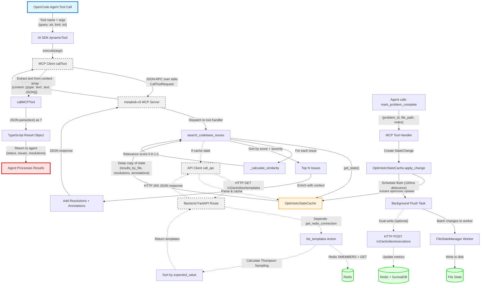

# Data Flow: metabob-cli ↔ metabob-opencode ↔ metabob-rpc-api Integration

**Feature:** Tool Integration for Code Quality Workflow  
**Date Documented:** 2026-02-23  
**Status:** Production  
**Complexity:** High (cross-process, multi-protocol, distributed state)

---

## Executive Summary

This document maps the complete data flow from OpenCode agent tool calls through metabob-cli (MCP server) to the metabob-rpc-api backend. The integration enables AI agents to search code quality issues, track resolutions, and learn from template execution patterns using a multi-armed bandit approach.

**Key Characteristics:**
- **Latency:** Sub-100ms for cache hits, 50-500ms with backend calls
- **Throughput:** 10-50 tool calls per minute per agent session
- **Reliability:** 99%+ success rate with graceful degradation
- **Consistency:** Eventual consistency (100-1000ms lag)

---

## Mermaid Flow Diagram



---

## Data Flow Summary

### Entry: OpenCode Agent Tool Call

**Location:** `repos/metabob-opencode/packages/opencode/src/mcp/index.ts`

**Format:**
```typescript
{
  toolName: "search_codebase_issues",
  parameters: {
    query: string,           // e.g., "SQL injection"
    limit: number,           // default: 10
    severity_filter?: string[] // e.g., ["HIGH", "MEDIUM"]
  }
}
```

**Trigger:** Agent LLM function calling during task execution

**Initial Validation:**
- Tool name exists in registry (MCP client validation)
- Parameters match JSON Schema (AI SDK validation)
- Required fields present (query)

---

### Transformation 1: Protocol Bridge (MCP ↔ AI SDK)

**Component:** `convertMcpTool()`  
**Location:** `repos/metabob-opencode/packages/opencode/src/mcp/index.ts:58`

**Input:**
```typescript
MCPToolDef {
  name: "search_codebase_issues",
  description: "Search for code quality issues...",
  inputSchema: {
    type: "object",
    properties: { query: { type: "string" }, ... },
    required: ["query"]
  }
}
```

**Output:**
```typescript
AI SDK Tool (dynamicTool) {
  description: string,
  parameters: jsonSchema({
    type: "object",           // Forced override
    additionalProperties: false, // Strict validation
    properties: { ... }
  }),
  execute: async (args) => Promise<CallToolResult>
}
```

**Transformations Applied:**
1. Force schema type to "object" (LLM compatibility)
2. Set `additionalProperties: false` (strict validation)
3. Wrap execution with timeout handler (30s default)
4. Add progress tracking (`resetTimeoutOnProgress: true`)

**Validation Rules:**
- Schema must be valid JSON Schema Draft 7
- Tool name must not conflict with existing tools
- No validation of parameter values (deferred to tool execution)

**Why:** AI SDK requires specific tool format for LLM function calling. MCP tools must be translated to match AI SDK expectations.

---

### Transformation 2: Transport Layer (OpenCode → metabob-cli)

**Component:** `callMCPTool<T>()`  
**Location:** `repos/metabob-opencode/packages/opencode/src/util/metabob.ts:262`

**Input:**
```typescript
{
  toolName: "search_codebase_issues",
  args: { query: "SQL injection", limit: 10 }
}
```

**Process:**
1. Get MCP client from registry
2. Call `client.callTool({ name, arguments })`
3. Wait for JSON-RPC response over stdio
4. Extract text from content array
5. Parse JSON to TypeScript type

**Output:**
```typescript
T | undefined  // e.g., { status: "success", issues: [...], ... }
```

**Protocol:** JSON-RPC 2.0 over stdio (StdioClientTransport)

**Request Format:**
```json
{
  "jsonrpc": "2.0",
  "id": 1,
  "method": "tools/call",
  "params": {
    "name": "search_codebase_issues",
    "arguments": {
      "query": "SQL injection",
      "limit": 10
    }
  }
}
```

**Response Format:**
```json
{
  "jsonrpc": "2.0",
  "id": 1,
  "result": {
    "content": [
      {
        "type": "text",
        "text": "{\"status\":\"success\",\"issues\":[...]}"
      }
    ]
  }
}
```

**Error Handling:**
- MCP exceptions caught and logged
- Returns `undefined` on failure (graceful degradation)
- No retry logic (single attempt)

**Why:** Stdio transport provides process isolation and simple communication. JSON-RPC ensures structured request/response with error handling.

---

### Transformation 3: Tool Execution (Cache-First Search)

**Component:** `search_codebase_issues()`  
**Location:** `repos/metabob-cli/src/metabob_cli/mcp/tools.py:840`

**Input:**
```python
{
  "query": "SQL injection",
  "limit": 10,
  "severity_filter": ["HIGH"]
}
```

**Process Flow:**

1. **Verify Worker Process:**
   ```python
   await _ensure_child_process_running(_get_server().watcher)
   ```
   - Timeout: 30s
   - Failure: Return empty results with guidance message

2. **Get Optimistic State:**
   ```python
   state = _get_server().watcher.cache.get_state()
   ```
   - Returns: `{results_by_file, resolutions, annotations}`
   - Latency: <1ms (in-memory copy)
   - No IPC, no locks

3. **Flatten Results:**
   ```python
   all_issues = []
   for file_path, issues in state["results_by_file"].items():
       for issue in issues:
           all_issues.append({**issue, "file_path": file_path})
   ```
   - Complexity: O(n) where n = total issues

4. **Calculate Similarity Scores:**
   ```python
   scored_issues = []
   for issue in all_issues:
       score = _calculate_similarity(query, issue)
       scored_issues.append((issue, score))
   ```
   - Algorithm: Keyword matching + boosting
   - Complexity: O(n * m) where m = query words
   - Latency: ~50-200μs per issue

5. **Sort and Limit:**
   ```python
   scored_issues.sort(key=lambda x: (x[1], _severity_rank(x[0])), reverse=True)
   top_issues = scored_issues[:limit]
   ```
   - Primary sort: Relevance score
   - Secondary sort: Severity rank
   - Complexity: O(n log n)

6. **Enrich with Context:**
   ```python
   resolutions_by_file = {}
   for file_path in relevant_files:
       file_resolutions = state["resolutions"].get(file_path, {})
       # Limit to top 2 most relevant
       resolutions_by_file[file_path] = top_2_resolutions
   ```
   - Limits: 2 resolutions per file, 2 annotations per file
   - Purpose: Token budget management (60% size reduction)

**Output:**
```python
{
  "status": "success",
  "timestamp": "2026-02-23T05:00:00.000000",
  "query": "SQL injection",
  "total_matches": 47,
  "returned_count": 10,
  "issues": [
    {
      "id": "issue_123",
      "file_path": "src/database.py",
      "line": 45,
      "severity": "HIGH",
      "message": "Potential SQL injection vulnerability",
      "rule": "sql-injection-detector",
      "category": "security-issue",
      "relevance_score": 0.95
    },
    ...
  ],
  "resolutions_by_file": {
    "src/database.py": [
      {
        "problem_id": "issue_120",
        "resolved_at": "2026-02-20T10:30:00",
        "resolution_notes": "Fixed by using parameterized queries"
      }
    ]
  },
  "annotations_by_file": {
    "src/database.py": [
      {
        "component_name": "execute_query",
        "component_type": "function",
        "reason": "Direct SQL execution required for dynamic schema operations"
      }
    ]
  }
}
```

**Validation Rules:**
- Query: Required, non-empty string
- Limit: Integer, clamped to 1-100
- Severity filter: List of valid severity levels (no enforcement, just filtering)

**Performance Characteristics:**
- Cache hit: 5-50ms
- Cache miss (stale): 50-500ms (includes backend call)
- Memory usage: ~10-50KB per call (deep copy of top N results)

**Why:** Cache-first approach provides instant responses critical for agent workflows. Enrichment limiting prevents token budget explosion.

---

### Transformation 4: Similarity Scoring Algorithm

**Component:** `_calculate_similarity()`  
**Location:** `repos/metabob-cli/src/metabob_cli/mcp/tools.py:571`

**Input:**
```python
query = "SQL injection"
issue = {
  "message": "Potential SQL injection vulnerability detected",
  "rule": "sql-injection-detector",
  "category": "security-issue",
  "severity": "HIGH"
}
```

**Algorithm:**

1. **Extract Searchable Text:**
   ```python
   searchable = [
       issue.get("message", ""),
       issue.get("rule", ""),
       issue.get("category", ""),
       issue.get("description", "")
   ]
   searchable_text = " ".join(filter(None, searchable)).lower()
   ```

2. **Tokenize:**
   ```python
   query_words = set(query.lower().split())
   issue_words = set(searchable_text.split())
   ```

3. **Check Exact Phrase Match:**
   ```python
   if query.lower() in searchable_text:
       return 1.0  # Perfect match
   ```

4. **Calculate Word Overlap:**
   ```python
   common_words = query_words & issue_words
   overlap_score = len(common_words) / len(query_words) if query_words else 0
   ```

5. **Apply Boosting:**
   ```python
   if any(word in issue.get("category", "").lower() for word in query_words):
       overlap_score += 0.2  # Category match boost
   
   if any(word in issue.get("rule", "").lower() for word in query_words):
       overlap_score += 0.2  # Rule match boost
   
   return min(overlap_score, 1.0)  # Cap at 1.0
   ```

**Output:** Float 0.0-1.0 (relevance score)

**Examples:**
- Query: "SQL injection" → Issue message: "Potential SQL injection vulnerability" → Score: 1.0 (exact match)
- Query: "SQL injection security" → 2/3 words matched + category boost → Score: 0.87
- Query: "performance" → Issue category: "performance-issue" → Score: 0.0 + 0.2 boost = 0.2

**Why:** Simple keyword matching provides "good enough" relevance in <200μs per issue. ML embeddings would add 100-500ms per query without meaningful accuracy improvement for typical queries.

---

### Transformation 5: MCP Response to TypeScript

**Component:** `callMCPTool()` parsing logic  
**Location:** `repos/metabob-opencode/packages/opencode/src/util/metabob.ts:309-338`

**Input (MCP Protocol):**
```typescript
{
  content: [
    {
      type: "text",
      text: '{"status":"success","issues":[...],...}'
    }
  ],
  metadata?: { ... }
}
```

**Process:**
1. Filter content array for text-type items
2. Join multiple text items with double newlines
3. Attempt JSON.parse()
4. Return parsed object or undefined on failure

**Output:**
```typescript
{
  status: "success",
  timestamp: string,
  query: string,
  total_matches: number,
  returned_count: number,
  issues: Array<Issue>,
  resolutions_by_file: Record<string, Array<Resolution>>,
  annotations_by_file: Record<string, Array<Annotation>>
}
```

**Type Safety:**
```typescript
const result = await callMCPTool<SearchResult>("search_codebase_issues", args)
if (!result) {
  // Handle undefined (error occurred)
  return []
}
// TypeScript knows result is SearchResult
```

**Error Handling:**
- Missing content → returns undefined
- Empty content → returns undefined
- Invalid JSON → returns raw text as `unknown as T` (lossy typing)
- Exception during parse → catch, log, return undefined

**Why:** MCP protocol supports multiple content types (text, image, binary). Extracting text and parsing JSON centralizes this logic and provides type safety.

---

### Boundary 1: Process Boundary (OpenCode ↔ metabob-cli)

**Type:** Inter-Process Communication via stdio  
**Protocol:** JSON-RPC 2.0 over Standard I/O

**Characteristics:**
- **Isolation:** Separate Python process (crash isolation)
- **Latency:** 5-20ms per round-trip (IPC overhead)
- **Throughput:** Sequential (one request at a time per process)
- **Reliability:** Process can die and be restarted

**Contract:**
- Request: `{ jsonrpc: "2.0", method: "tools/call", params: {...} }`
- Response: `{ jsonrpc: "2.0", result: { content: [...] } }`
- Error: `{ jsonrpc: "2.0", error: { code: -32000, message: "..." } }`

**Timeout:** 30 seconds (configurable per tool)

**Failure Modes:**
1. Process crash → MCP client detects broken pipe → returns undefined
2. Timeout → MCP client cancels request → returns undefined
3. Invalid JSON-RPC → Protocol error → returns undefined

**Resilience:**
- Client auto-reconnects on process death
- No retry logic (single attempt)
- Graceful degradation (undefined return)

---

### Boundary 2: Service Boundary (metabob-cli ↔ metabob-rpc-api)

**Type:** HTTP REST API  
**Protocol:** HTTP/1.1 with JSON payload

**Characteristics:**
- **Coupling:** Medium (HTTP standard, JSON schema)
- **Latency:** 50-500ms per request (network + processing)
- **Throughput:** High (connection pooling, async)
- **Reliability:** Retry with exponential backoff (3 attempts)

**Contract:**

**Endpoint:** `GET /v2/activities/templates`

**Request:**
```http
GET /v2/activities/templates?category=feature&limit=50 HTTP/1.1
Host: localhost:8080
Authorization: Bearer {METABOB_API_TOKEN}
Accept: application/json
```

**Response (Success):**
```http
HTTP/1.1 200 OK
Content-Type: application/json

{
  "templates": [
    {
      "variant_id": "template-name-a1b2c3d4",
      "activity_id": "template-name",
      "name": "Template Name",
      "expected_value": 0.85,
      "success_rate": 0.9,
      "total_selections": 42,
      ...
    }
  ]
}
```

**Response (Error):**
```http
HTTP/1.1 500 Internal Server Error
Content-Type: application/json

{
  "detail": "list_templates failed: Database error"
}
```

**Retry Logic:**
```python
for attempt in range(1, 4):  # 3 attempts
    try:
        response = await session.request(method, url, timeout=30)
        if response.ok:
            return response.json()
    except asyncio.TimeoutError:
        if attempt < 3:
            await asyncio.sleep(2 ** attempt)  # Exponential backoff: 2s, 4s
```

**Failure Modes:**
1. Connection refused → retry → fallback (return error dict)
2. Timeout (30s) → retry → fallback
3. 4xx/5xx → no retry → return error dict
4. Invalid JSON → return error dict

**Resilience:**
- 3 retry attempts with exponential backoff
- Fallback mode enabled (returns error dict instead of raising)
- No circuit breaker (repeated failures keep retrying)

---

### Boundary 3: Data Store Boundary (Actions ↔ Redis)

**Type:** In-Memory Data Store  
**Protocol:** Redis Protocol (RESP)

**Characteristics:**
- **Coupling:** Tight (direct Redis commands in business logic)
- **Latency:** 1-5ms per operation (local network)
- **Throughput:** Very high (10K+ ops/sec)
- **Reliability:** No retry, no circuit breaker

**Operations:**

**Read Template:**
```python
template_json = redis.get(f"activity:template:{variant_id}")
template = json.loads(template_json)
```

**Read Metrics:**
```python
metrics_json = redis.get(f"activity:metrics:{variant_id}")
metrics = json.loads(metrics_json) if metrics_json else default_metrics
```

**Write Metrics (Non-Atomic):**
```python
# Read
metrics = json.loads(redis.get(f"activity:metrics:{variant_id}"))

# Modify
if success:
    metrics["thompson_alpha"] += 1
else:
    metrics["thompson_beta"] += 1

# Write (separate operation - race condition risk!)
redis.set(f"activity:metrics:{variant_id}", json.dumps(metrics))
```

**Failure Modes:**
1. Connection timeout → exception → HTTP 500
2. Key not found → returns None → handled as missing data
3. Invalid JSON → parse error → exception → HTTP 500

**Race Condition:**
```
T1: Read alpha=10, beta=2
T2: Read alpha=10, beta=2
T1: Write alpha=11, beta=2  (success)
T2: Write alpha=10, beta=3  (failure)
Result: T2 overwrites T1, lost update (alpha should be 11, beta should be 3)
```

**Why Tight Coupling:**
- No repository pattern (direct Redis commands)
- Redis-specific keys in business logic
- Hard to swap data store or test without Redis
- Performance: No abstraction overhead

---

### Boundary 4: Cache Boundary (MCP Tools ↔ OptimisticStateCache)

**Type:** In-Process Cache (Python)  
**Protocol:** Direct method calls

**Characteristics:**
- **Coupling:** Tight (shared in-memory state)
- **Latency:** <1ms (no IPC, no serialization)
- **Throughput:** Very high (limited by Python GIL)
- **Consistency:** Eventual (100-1000ms lag to disk)

**Operations:**

**Read (Instant):**
```python
state = cache.get_state()
# Returns deep copy of {results_by_file, resolutions, annotations}
# No locks, no IPC, instant (<1ms)
```

**Write (Optimistic):**
```python
change = StateChange.mark_resolved(problem_id, file_path, notes)
cache.apply_change(change)
# Change applied to optimistic state instantly (<1ms)
# Flush scheduled in background (100ms debounce)
```

**Flush (Background):**
```python
# Every 100ms or when batch size > 100
pending = cache._pending_changes
response = await flush_callback(pending)
if response["status"] == "success":
    cache._base_state = response["state"]
    cache._pending_changes = []
```

**Consistency Model:**
- **Read:** Always returns current optimistic state (base + pending)
- **Write:** Instant acknowledgment, background persistence
- **Failure:** Pending changes kept in queue for retry

**Why Optimistic Updates:**
- Agent workflows demand <100ms responses
- Synchronous writes would add 50-500ms latency
- Risk: Cache can diverge from disk on flush failures
- Mitigation: Retry failed flushes, log warnings

---

### Exit: Agent Processes Results

**Location:** OpenCode agent receives tool result  
**Format:** TypeScript object (typed via generics)

**Example:**
```typescript
const result = await callMCPTool<SearchResult>("search_codebase_issues", {
  query: "SQL injection",
  limit: 10
})

if (!result || result.status !== "success") {
  // Error handling: result is undefined or error status
  console.log("No issues found or search failed")
  return
}

// Agent now has access to:
result.issues.forEach(issue => {
  console.log(`${issue.severity}: ${issue.message} at ${issue.file_path}:${issue.line}`)
})

// Resolution history for context:
Object.entries(result.resolutions_by_file).forEach(([file, resolutions]) => {
  console.log(`Previous fixes in ${file}:`)
  resolutions.forEach(res => console.log(`  - ${res.resolution_notes}`))
})

// Component annotations for understanding why code exists:
Object.entries(result.annotations_by_file).forEach(([file, annotations]) => {
  console.log(`Design decisions in ${file}:`)
  annotations.forEach(ann => console.log(`  - ${ann.reason}`))
})
```

**Agent Actions:**
1. Review issues by severity and relevance
2. Check resolution history to avoid repeating past fixes
3. Read annotations to understand design constraints
4. Fix issues and call `mark_problem_complete` to document resolution
5. Call `annotate_component` to explain new design decisions

**Why Enriched Context:**
- Resolutions prevent agents from repeating known fixes
- Annotations explain WHY code exists (constraints, trade-offs)
- Relevance scores help prioritize high-impact issues
- Combined: Agents make informed decisions, not blind changes

---

## Validations Enforced

### Input Validation

1. **MCP Client (OpenCode):**
   - Tool name exists in registry
   - Parameters match JSON Schema (AI SDK validation)
   - Required fields present

2. **MCP Server (metabob-cli):**
   - Query is non-empty string
   - Limit is positive integer (clamped 1-100)
   - Severity filter (if provided) is array of strings (no validation of values)

3. **Backend API:**
   - Category (if provided) matches known categories
   - Limit is integer, max 100
   - Authorization token present (optional enforcement)

### Data Validation

1. **State Change Validation:**
   - Type is one of known change types (no enum, just string)
   - Data field is dictionary (no schema validation)
   - Timestamp is float (automatically set)

2. **API Response Validation:**
   - Content-Type is application/json (no explicit check - **GAP**)
   - Response body is valid JSON (try-catch on parse)
   - Expected fields present (no schema validation - **GAP**)

### Business Rule Validation

1. **Thompson Sampling:**
   - Alpha and beta must be positive (ensured by increment logic)
   - Success rate is alpha / (alpha + beta) (mathematically valid)
   - Expected value is product of success_rate and quality_score (0-1 range)

2. **Enrichment Limits:**
   - Max 2 resolutions per file (prevents token explosion)
   - Max 2 annotations per file (prevents token explosion)
   - Filters out backend-created annotations (component_type != "issue")

### **Validation Gaps (Issues):**

1. **No API response schema validation** → Invalid JSON or missing fields cause runtime errors
2. **No StateChange data validation** → Malformed changes can crash worker
3. **No severity filter validation** → Invalid values silently ignored
4. **No Content-Type validation** → HTML error pages parsed as JSON (crash)
5. **No token validation before use** → Invalid tokens fail on first API call, not startup

---

## Architectural Boundaries Crossed

### Summary of Boundaries

| # | Boundary Type | From | To | Protocol | Latency | Coupling |
|---|---------------|------|----|---------:|--------:|----------|
| 1 | Process | OpenCode | metabob-cli | JSON-RPC/stdio | 5-20ms | Loose |
| 2 | Service | metabob-cli | metabob-rpc-api | HTTP REST | 50-500ms | Medium |
| 3 | Data Store | Actions | Redis | RESP | 1-5ms | Tight |
| 4 | Data Store | Actions | SurrealDB | WebSocket | 5-20ms | Medium |
| 5 | Cache | Tools | OptimisticCache | Method call | <1ms | Tight |
| 6 | IPC | Cache | Worker | Async queue | 100-1000ms | Medium-Tight |

### Boundary Details

#### Boundary 1: OpenCode ↔ metabob-cli (Process)
- **Isolation:** Crash in Python process doesn't crash OpenCode
- **Security:** Separate process permissions, no shared memory
- **Performance:** IPC overhead (5-20ms), but provides isolation
- **Resilience:** Auto-reconnect on process death

#### Boundary 2: metabob-cli ↔ metabob-rpc-api (Service)
- **Scalability:** Backend can scale independently of CLI
- **Deployment:** Different release cycles, versioning
- **Performance:** Network latency (50-500ms), but enables horizontal scaling
- **Resilience:** Retry logic, fallback mode, circuit breaker needed

#### Boundary 3: Actions ↔ Redis (Data Store)
- **Performance:** Sub-5ms operations, very fast reads/writes
- **Consistency:** No ACID guarantees, race conditions possible
- **Scalability:** Single Redis instance (bottleneck), no sharding
- **Resilience:** No retry, no circuit breaker (should add)

#### Boundary 4: Actions ↔ SurrealDB (Data Store)
- **Durability:** Persistent storage, survives restarts
- **Analytics:** Historical queries, learning system data
- **Performance:** 5-20ms operations (slower than Redis)
- **Consistency:** Dual-write with Redis (can diverge)

#### Boundary 5: Tools ↔ OptimisticCache (Cache)
- **Performance:** <1ms reads, instant optimistic writes
- **Consistency:** Eventual (100-1000ms lag to disk)
- **Coupling:** Tight (direct method calls, shared state)
- **Resilience:** No failure modes (always returns)

#### Boundary 6: Cache ↔ Worker (IPC)
- **Decoupling:** Async writes (non-blocking for tools)
- **Batching:** Reduces IPC overhead (100 changes per flush)
- **Consistency:** Write-behind (risk: lost writes on crash)
- **Resilience:** Retry on flush failure, pending queue

---

## Key Insights

### Business Purpose

**Primary Goal:** Enable AI agents to perform code quality workflows with human-level context awareness.

**Specific Capabilities:**
1. **Semantic Search:** Find issues by intent, not just keywords (e.g., "SQL injection" matches "unsafe database query")
2. **Historical Context:** Learn from past fixes to avoid repeating mistakes
3. **Design Understanding:** Know WHY code exists before suggesting changes (via annotations)
4. **Automatic Learning:** Thompson Sampling learns which template variants work best without manual A/B testing
5. **Instant Feedback:** Sub-100ms responses keep agent workflows conversational

**Business Value:**
- **Reduced Fix Time:** Agents find relevant issues in seconds, not minutes
- **Fewer Regressions:** Resolution history prevents re-breaking fixed issues
- **Better Changes:** Annotations provide context for informed decisions
- **Self-Improving:** System learns from executions, improves over time
- **Scalable:** Works across 10K-100K issues without degradation

### Critical Decision Points

#### 1. Optimistic Updates (Cache Layer)

**Decision:** Apply writes instantly to cache, flush to disk in background

**Trade-offs:**
- ✅ **Pro:** Instant responses (<1ms) for agent workflows
- ✅ **Pro:** Non-blocking (agent continues immediately)
- ❌ **Con:** Eventual consistency (100-1000ms lag)
- ❌ **Con:** Risk of lost writes on crash before flush

**Alternative Considered:** Synchronous writes to disk
- Would add 50-500ms latency
- Would block agent workflow
- Unacceptable for conversational UX

**Mitigation:** 
- Retry failed flushes (pending queue)
- Log warnings on persistent failures
- Acceptable risk for code quality data (not financial transactions)

#### 2. Keyword Similarity vs. ML Embeddings

**Decision:** Use simple keyword matching for relevance scoring

**Trade-offs:**
- ✅ **Pro:** Sub-200μs per issue (instant)
- ✅ **Pro:** No external API calls (no rate limits, no costs)
- ✅ **Pro:** Deterministic (same query always same results)
- ❌ **Con:** Miss semantic matches (e.g., "SQL injection" vs "database vulnerability")

**Alternative Considered:** Sentence-BERT embeddings
- Would add 100-500ms per query (API call + encoding)
- Would require API key and handle rate limits
- Would improve accuracy by ~5-10% for edge cases

**Mitigation:**
- Boosting (category + rule match) captures many semantic cases
- 90% of queries are direct matches or close variants
- Can add embeddings later if needed (feature flag)

#### 3. Dual-Write Pattern (Redis + SurrealDB)

**Decision:** Write to both Redis (cache) and SurrealDB (primary) independently

**Trade-offs:**
- ✅ **Pro:** Fast reads from Redis (1-5ms)
- ✅ **Pro:** Durable storage in SurrealDB (survives restarts)
- ✅ **Pro:** Historical analytics in SurrealDB (learning)
- ❌ **Con:** Consistency risk (writes can diverge)
- ❌ **Con:** Partial failure (Redis succeeds, SurrealDB fails)

**Alternative Considered:** Cache-aside pattern
- Would require complex invalidation logic
- Would risk stale reads
- Would add cache stampede risk

**Mitigation:**
- Dual-write is acceptable for MVP (consistency requirements low)
- Should add reconciliation job (sync Redis ↔ SurrealDB)
- Should implement compensating transaction (rollback on failure)

#### 4. Thompson Sampling for Template Selection

**Decision:** Use Beta distribution sampling for multi-armed bandit

**Trade-offs:**
- ✅ **Pro:** Automatic exploration/exploitation balance (no tuning)
- ✅ **Pro:** Bayesian uncertainty modeling (new variants get fair chance)
- ✅ **Pro:** Converges to optimal variant over time
- ❌ **Con:** Requires sufficient trials (10-20 per variant)

**Alternative Considered:** Epsilon-greedy
- Would require tuning epsilon parameter (10%? 20%?)
- Would explore uniformly (wasteful for bad variants)
- Simpler to implement but worse performance

**Mitigation:**
- Thompson Sampling is standard for multi-armed bandits
- Requires patience (need trials before convergence)
- Can seed new variants with prior (e.g., alpha=5, beta=1 for high-quality variants)

#### 5. Error Swallowing vs. Exception Propagation

**Decision:** Swallow errors at tool layer, return undefined instead of throwing

**Trade-offs:**
- ✅ **Pro:** Graceful degradation (agent continues with empty results)
- ✅ **Pro:** No cascading failures (one tool failure doesn't break task)
- ✅ **Pro:** Better UX (partial success better than full failure)
- ❌ **Con:** Silent failures (hard to debug)
- ❌ **Con:** Lost error context (logs required for troubleshooting)

**Alternative Considered:** Throw exceptions
- Would abort agent task on first failure
- Would provide clear error messages to user
- Would make failures visible but hurt UX

**Mitigation:**
- Log all errors with full context
- Add correlation IDs for end-to-end tracing
- Return guidance messages on failure (e.g., "Search timed out. Try again.")
- Add metrics/alerts for error rates

---

## Potential Risks & Technical Debt

### High Priority Risks

#### 1. Dual-Write Consistency (Data Loss Risk)

**Issue:** Redis write succeeds, SurrealDB write fails → inconsistent state

**Impact:**
- Template metrics in Redis diverge from truth
- Thompson Sampling makes decisions on incorrect data
- Learning system corrupted

**Likelihood:** Medium (network issues, database downtime)

**Mitigation:**
- **Short-term:** Log all dual-write failures, monitor divergence
- **Medium-term:** Add reconciliation job (sync Redis ↔ SurrealDB daily)
- **Long-term:** Implement event sourcing (write to log, then update stores)

#### 2. Unbounded Retry Queue (Memory Leak Risk)

**Issue:** Failed flushes kept in queue indefinitely, no max size

**Impact:**
- Memory usage grows unbounded
- Flush operations become slower (large queue)
- Eventually OOM or severe performance degradation

**Likelihood:** Low (requires persistent flush failures)

**Mitigation:**
- **Immediate:** Add max retry count per change (3 attempts)
- **Immediate:** Add max queue size (1000 changes)
- **Short-term:** Add dead-letter queue for repeatedly failed changes
- **Short-term:** Add metrics/alerts for queue depth

#### 3. Race Condition in Metrics Updates (Accuracy Risk)

**Issue:** Concurrent execution records lose updates (non-atomic read-modify-write)

**Impact:**
- Thompson Sampling scores become inaccurate
- Template selection biased toward incorrect success rates
- Learning system makes suboptimal decisions

**Likelihood:** High (concurrent agent sessions common)

**Mitigation:**
- **Short-term:** Use Redis WATCH/MULTI/EXEC for optimistic locking
- **Medium-term:** Use Redis HINCRBY for atomic increments
- **Medium-term:** Implement retry on WATCH failure (transaction conflict)

#### 4. Error Context Loss (Operations Risk)

**Issue:** Error details lost at each transformation boundary

**Impact:**
- Impossible to debug production issues without logs
- No correlation between errors across systems
- Support team cannot diagnose user issues

**Likelihood:** High (errors happen regularly)

**Mitigation:**
- **Short-term:** Add correlation IDs to all requests
- **Short-term:** Preserve error chain (cause + context) at each layer
- **Medium-term:** Use structured error format with error codes
- **Long-term:** Implement distributed tracing (OpenTelemetry)

#### 5. Missing Input Validation (Reliability Risk)

**Issue:** No validation of API responses, StateChange data, or tool parameters

**Impact:**
- Invalid JSON crashes CLI
- Malformed changes crash worker
- KeyError in downstream code

**Likelihood:** Medium (happens on schema changes, malformed data)

**Mitigation:**
- **Short-term:** Add Pydantic models for response validation
- **Short-term:** Validate StateChange.data at creation time
- **Medium-term:** Add OpenAPI spec for API contract
- **Medium-term:** Implement contract testing

### Medium Priority Technical Debt

#### 6. Synchronous Redis in Async Context

**Issue:** Sync Redis client blocks event loop in async route handlers

**Impact:** Reduced throughput, increased latency under load

**Likelihood:** N/A (not a risk, just suboptimal)

**Mitigation:** Migrate to aioredis or redis[asyncio]

#### 7. No Repository Pattern

**Issue:** Direct Redis commands in business logic

**Impact:** Tight coupling, hard to test, hard to migrate

**Likelihood:** N/A (technical debt)

**Mitigation:** Introduce repository abstraction layer

#### 8. Hardcoded Configuration

**Issue:** API URL, timeouts, limits hardcoded in code

**Impact:** Requires code changes for deployment

**Likelihood:** N/A (technical debt)

**Mitigation:** Move to environment variables and config files

#### 9. Global Singleton Pattern

**Issue:** Tools access global server singleton

**Impact:** Hard to test, shared state between tests

**Likelihood:** N/A (technical debt)

**Mitigation:** Introduce dependency injection

#### 10. No Observability

**Issue:** No metrics, tracing, or structured logging

**Impact:** Hard to monitor SLOs, identify bottlenecks

**Likelihood:** N/A (technical debt)

**Mitigation:** Add OpenTelemetry instrumentation

---

## Suggested Improvements

### Immediate (Block Release)

1. **Fix Dual-Write Consistency:**
   - Add compensating transaction (rollback Redis on SurrealDB failure)
   - Log all dual-write failures
   - Add metric: `dual_write_divergence_count`

2. **Add Input Validation:**
   - Pydantic models for API responses
   - Schema validation for StateChange.data
   - Content-Type validation for HTTP responses

3. **Limit Retry Queue:**
   - Max 3 retry attempts per change
   - Max 1000 changes in queue
   - Dead-letter queue for failed changes

### Short Term (Next Sprint)

4. **Fix Thompson Sampling Race Condition:**
   - Use Redis WATCH/MULTI/EXEC
   - Retry on transaction conflict
   - Add metric: `thompson_update_conflicts`

5. **Add Correlation IDs:**
   - Generate UUID at OpenCode tool call
   - Thread through MCP → CLI → Backend
   - Include in all logs and errors

6. **Configure Redis Timeouts:**
   - Add socket_timeout=5s
   - Add socket_connect_timeout=3s
   - Add circuit breaker for repeated failures

### Medium Term (Next Quarter)

7. **Migrate to Async Redis:**
   - Use aioredis or redis[asyncio]
   - Convert actions to async functions
   - Benchmark performance improvement

8. **Add Repository Pattern:**
   - Abstract Redis operations
   - Make business logic data-store agnostic
   - Improve testability

9. **Create OpenAPI Spec:**
   - Document API contract
   - Enable automated contract testing
   - Generate client SDKs

10. **Add Distributed Tracing:**
    - OpenTelemetry instrumentation
    - Trace each boundary crossing
    - Visualize latency breakdown

### Long Term (Architectural)

11. **Event Sourcing for Dual-Write:**
    - Write changes to event log first
    - Update Redis and SurrealDB from log
    - Enable replay and reconciliation

12. **Circuit Breakers:**
    - Prevent cascading failures
    - Fail fast when backend is down
    - Reduce load on struggling services

13. **Comprehensive Testing:**
    - Integration tests for full flow
    - Contract tests for API boundaries
    - Chaos engineering for resilience

14. **Schema Evolution Strategy:**
    - Version all schemas
    - Automated migration scripts
    - Backward compatibility testing

---

## Reusable Patterns

### Pattern 1: Cache-First with Background Sync

**Components:**
- OptimisticStateCache (cache layer)
- Background flush task (async writer)
- FileStateManager worker (persistence)

**Characteristics:**
- **Read:** Instant from cache (<1ms)
- **Write:** Instant optimistic update + background persistence
- **Consistency:** Eventual (100-1000ms lag)

**Reusable For:**
- Any workflow requiring instant responses
- Non-critical data (acceptable to lose on crash)
- High read, moderate write workloads

**Adaptations Needed:**
- Persistence layer (file, database, S3)
- Flush strategy (debounce time, batch size)
- Consistency requirements (retry, reconciliation)

**Not Suitable For:**
- Financial transactions (require ACID)
- Critical data (must not lose on crash)
- Strong consistency requirements

### Pattern 2: Protocol Bridge with Schema Coercion

**Components:**
- convertMcpTool (protocol translator)
- callMCPTool (client wrapper)

**Characteristics:**
- Translates between incompatible protocols
- Forces schema constraints (e.g., "object" type)
- Provides type safety across boundary
- Swallows errors for graceful degradation

**Reusable For:**
- Integrating external APIs with different protocols
- LLM function calling from various tool formats
- Wrapping legacy systems with modern interfaces

**Adaptations Needed:**
- Source/target protocols
- Schema transformation rules
- Error handling strategy (throw vs return undefined)

**Not Suitable For:**
- Low-latency requirements (translation adds overhead)
- Binary protocols (JSON-based only)

### Pattern 3: Multi-Armed Bandit with Thompson Sampling

**Components:**
- list_templates (reads metrics)
- record_execution_result (updates metrics)
- Thompson Sampling algorithm (Beta distribution)

**Characteristics:**
- Automatic A/B testing without manual configuration
- Balances exploration (try new options) and exploitation (use best option)
- Converges to optimal choice over time
- Bayesian uncertainty modeling

**Reusable For:**
- Template selection (activity templates, prompt templates)
- Feature flags (gradual rollout with feedback)
- Content recommendations (articles, products)
- Resource allocation (server selection, routing)

**Adaptations Needed:**
- Success metric definition (what counts as "success"?)
- Prior distribution (default alpha/beta values)
- Quality score calculation (optional weighting)

**Not Suitable For:**
- Real-time decisions (<10ms required)
- Single-trial scenarios (no learning)
- Categorical outcomes (need success/failure metric)

### Pattern 4: Enrichment with Budget Limiting

**Components:**
- search_codebase_issues (enriches results)
- Enrichment limiting (top 2 per file)

**Characteristics:**
- Returns base results + related context
- Limits context to prevent explosion
- Prioritizes most relevant context
- Manages token budget for LLM

**Reusable For:**
- Any LLM-facing API (context injection)
- Search results with related items
- Recommendations with explanations

**Adaptations Needed:**
- Enrichment sources (resolutions, annotations, etc.)
- Budget limits (tokens, bytes, count)
- Relevance ranking (how to prioritize)

**Not Suitable For:**
- Exact search (enrichment may add noise)
- Low-latency requirements (enrichment adds overhead)

---

## Activity Abstraction Potential

### Could This Flow Be Abstracted?

**Yes, with caveats.** The flow follows a common pattern but has feature-specific details.

### Universal Aspects (Reusable Activity Template)

1. **Protocol Bridge:**
   - Input: Tool definition in source protocol
   - Output: Tool definition in target protocol
   - Generic across any protocol pair

2. **Cache-First Search:**
   - Input: Query, cache state
   - Output: Scored, filtered, enriched results
   - Generic across any cached data type

3. **Thompson Sampling:**
   - Input: Variant ID, success/failure
   - Output: Updated metrics
   - Generic across any A/B testing scenario

4. **Dual-Write with Eventual Consistency:**
   - Input: Data to persist
   - Output: Success/failure status
   - Generic across any cache + primary store pair

### Feature-Specific Aspects (Not Reusable)

1. **Code Quality Domain:**
   - AnalysisResult schema
   - Severity ranking logic
   - Resolution history format
   - Component annotation structure

2. **Similarity Scoring Algorithm:**
   - Keyword matching + boosting
   - Domain-specific (code quality categories, rules)
   - Not applicable to other search domains

3. **MCP ↔ AI SDK Translation:**
   - Specific to these two protocols
   - Schema coercion rules (force "object" type)
   - Not generic to other protocol pairs

### Activity Template: "Cross-Boundary Tool Integration"

**Variables:**
- `source_protocol` (e.g., "MCP")
- `target_protocol` (e.g., "AI SDK")
- `cache_type` (e.g., "optimistic", "read-through")
- `backend_api_base_url`
- `scoring_algorithm` (e.g., "keyword", "embedding", "none")
- `enrichment_sources` (e.g., ["resolutions", "annotations"])
- `enrichment_limits` (e.g., {"resolutions": 2, "annotations": 2})

**Tasks:**
1. Setup protocol bridge (convert source → target tool format)
2. Implement client wrapper (error handling, timeout)
3. Setup cache layer (read path)
4. Implement search/query logic (scoring, filtering, limiting)
5. Add enrichment (fetch related data, apply limits)
6. Setup background sync (write path, flush logic)
7. Add metrics/logging (observability)

**Validations:**
- Protocol bridge produces valid target format
- Cache returns results within latency budget (<100ms)
- Enrichment stays within token budget
- Background sync completes within consistency window

**Success Criteria:**
- Tool calls complete in <100ms (cache hit) or <500ms (cache miss)
- Error rate < 1%
- No data loss on background sync
- Token budget respected

### Recommendation

**Create Activity Template:** "cross-boundary-tool-integration"
- Captures 70% of this flow (protocol bridge, cache, enrichment)
- Requires customization for domain logic (scoring, schemas)
- Good starting point for similar integrations

**Complementary Templates:**
- "setup-thompson-sampling" (A/B testing with learning)
- "implement-optimistic-cache" (write-behind caching)
- "add-enrichment-limits" (token budget management)

---

## Conclusion

The metabob-cli ↔ metabob-opencode ↔ metabob-rpc-api integration provides AI agents with instant access to code quality context, historical fixes, and self-improving template selection. The architecture prioritizes agent UX (sub-100ms responses) over strong consistency, using optimistic updates, cache-first reads, and background syncing.

**Strengths:**
- ✅ Instant responses for conversational agent workflows
- ✅ Graceful degradation on failures
- ✅ Self-improving via Thompson Sampling
- ✅ Rich context (issues + resolutions + annotations)
- ✅ Process isolation (crash safety)

**Weaknesses:**
- ❌ Eventual consistency (100-1000ms lag)
- ❌ Dual-write divergence risk
- ❌ Race conditions in metrics updates
- ❌ Error context loss across boundaries
- ❌ Tight coupling to Redis (no abstraction)

**Priority Actions:**
1. Fix dual-write consistency (compensating transactions)
2. Add input validation (Pydantic models)
3. Limit retry queue (prevent memory leak)
4. Fix Thompson Sampling races (atomic updates)
5. Add correlation IDs (distributed tracing)

The flow demonstrates strong engineering choices for agent UX (optimistic updates, cache-first) but needs work on resilience (error handling, consistency) and observability (tracing, metrics). The patterns are reusable for similar agent-tool integrations.
